### TL;DR



Large vision-language models (LVLMs) are computationally expensive and memory-intensive, particularly when dealing with high-resolution images.  This paper presents ZipVL, a new framework that addresses these issues. ZipVL uses a dynamic ratio allocation strategy to identify important tokens, focusing attention computations only on those, thus accelerating the prefill phase.  To save memory, ZipVL employs mixed-precision quantization for the key-value (KV) cache, using high-bit for important tokens and low-bit for less important ones, resulting in significant memory reduction during the decoding phase.  Experiments show ZipVL accelerates prefill by 2.6 times and reduces GPU memory usage by 50%, while maintaining accuracy. The adaptive token selection and mixed-precision KV cache compression are key innovations improving LVLMs’ efficiency.




 &nbsp; read the paper on arXiv

  

 &nbsp; on Hugging Face


#### Why does it matter?
This paper is important because it introduces ZipVL, a novel framework that significantly improves the efficiency of large vision-language models (LVLMs). ZipVL addresses both the computational and memory bottlenecks inherent in LVLMs, leading to faster inference and reduced resource requirements.  The adaptive layer-wise ratio allocation of important tokens and mixed-precision KV cache quantization techniques used are highly relevant to current research efforts in optimizing large language models and could inspire further innovations in efficient inference techniques.
#### Key Takeaways


 ZipVL dynamically adjusts the number of important tokens processed per layer based on attention patterns for optimal speed. 



 ZipVL employs mixed-precision quantization for KV caches based on token importance for efficient memory use. 



 ZipVL achieves significant speed improvements and reduces memory usage in LVLMs without considerable performance loss. 


------
#### Visual Insights

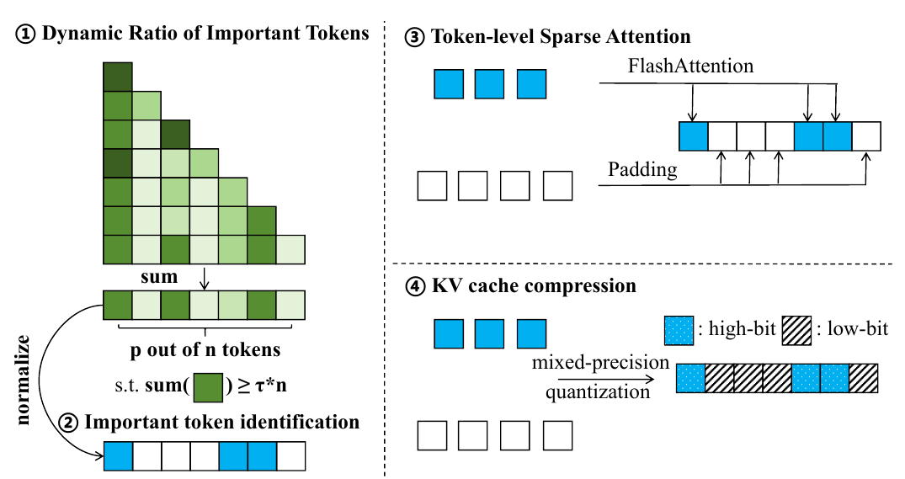

> 🔼 Figure 2 illustrates the ZipVL framework's prefill phase, showing dynamic ratio allocation for important tokens, token-level sparse attention using FlashAttention, and mixed-precision KV cache compression.
> 

> 
read the caption

> Figure 2: Overview of the proposed ZipVL framework during the prefill phase. Here, τ represents the threshold for retaining attention scores, n and p are the total number of tokens and the number of important tokens, respectively. After determining the ratio of important tokens and identifying them, we optimize the prefill phase by exclusively computing attention for important tokens. Additionally, we apply mixed-precision quantization to the KV cache, where the KV cache of less important tokens is quantized to a lower bit-width.
> 

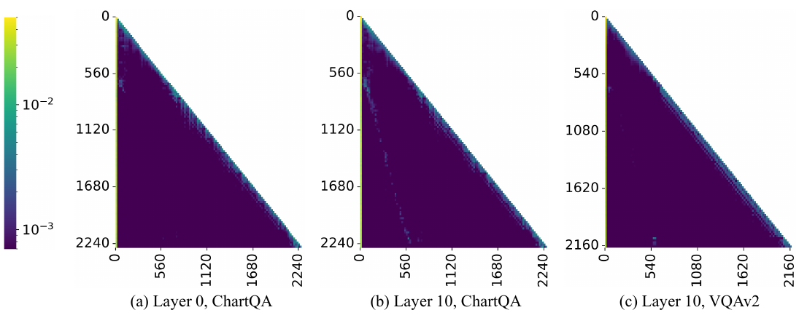

> 🔼 The chart displays attention maps from different layers of a large vision-language model (LLaVA-Next-7B) across two different tasks (VQAv2 and ChartQA), highlighting their distinct sparse patterns and variations.
> 

> 
read the caption

> Figure 1: The attention maps exhibit distinct sparse patterns across different layers (subfigures (a) and (b)) and vary significantly between tasks (subfigures (b) and (c)). Data was collected from the LLaVA-Next-7B model using input samples from the VQAv2 and ChartQA datasets.
> 


<table id='0' style='font-size:18px'><tr><td>Algorithm 1: The attention mechanism of ZipVL</td><td></td></tr><tr><td>procedure ZipVL Prefill: Input: Input embedding X, bit-width for important tokens bh, bit-width for other tokens b1 Output: Attention output 0, KV cache (K, V) Calculate query, key and value states (Q,K,V) as per Eq. (1)</td><td></td></tr><tr><td></td><td></td></tr><tr><td></td><td></td></tr><tr><td></td><td>Select a subset of tokens Q' from query states and compute attention scores A' = Softmax (Q/KT) number of important tokens as per Eq. (6)</td></tr><tr><td></td><td>Determine the Calculate the normalized attention scores for each token as per Eq. T for important tokens per Eq. (8) and U for other tokens as per Eq. (9)</td></tr><tr><td></td><td>Select set as set / / Token-level Sparse Attention with FlashAt tention = FlashAttention(Q[T], K[T], V[T])</td></tr><tr><td></td><td>0 // Compressing KV Cache = Concat(Quant(K[T], bh),</td></tr><tr><td></td><td></td></tr><tr><td></td><td></td></tr><tr><td>K Quant(K[U],b1)) v = Concat(Quant(V[T], bh), Quant(V[U], b1)) return 0, (K, V)</td><td></td></tr><tr><td>procedure ZipVL Decoding:</td><td></td></tr><tr><td></td><td></td></tr><tr><td>Input: Input embedding x, stored KV cache (Kin, Vin), bit-width for important tokens bh, bit-width for other tokens b1, number of token generated m Attention output cache (Kout, V out) key (q,k,v) as Eq. (1)</td><td></td></tr><tr><td></td><td>the Output: 0, updated KV Calculate query, and value states per Fetch KV cache memory: = Concat(Kin, Concat(V in, v)</td></tr><tr><td>from K k), v = V)</td><td></td></tr><tr><td>Compute attention output 0 = FlashAttention(q, K,</td><td></td></tr><tr><td>/ / Compress new KV cache every 100 tokens generated if m%100 == 0 then attention scores as per set T as per Eq. set U as per Eq. :], V = K'), V out = Concat(V[: -100], V')</td><td></td></tr><tr><td>attention a = Softmax (qKT) [-100 :]</td><td>(8) and</td></tr><tr><td>Compute scores: the number tokens as per</td><td></td></tr><tr><td>Determine of important Eq. (6) Calculate the normalized Eq. Select (9) K = K[-100 V[-100 :] = Concat(Quant(K [T], bh), Quant(K' [U], b1)) = Concat(Quant(V [T], bh), Quant(V [U], b1)) = Concat(K[: -100],</td><td></td></tr><tr><td>V'</td><td></td></tr><tr><td>K' Kout else Kout = K, V out =</td><td></td></tr><tr><td>I v 0, (Kout, V out)</td><td></td></tr><tr><td>return</td><td></td></tr><tr><td></td><td></td></tr><tr><td></td><td></td></tr><tr><td></td><td></td></tr><tr><td></td><td></td></tr><tr><td></td><td></td></tr><tr><td></td><td></td></tr><tr><td></td><td></td></tr></table>

> 🔼 Table 1 presents a comparison of the performance of various image-based Large Vision-Language Models (LVLMs) across five different benchmark datasets, showing the impact of different methods on accuracy and the ratio of important tokens used in the computation.
> 

> 
read the caption

> Table 1: Performance comparisons of image LVLMs on various benchmarks. Here, “Ratio
> 

### More visual insights

More on charts

> 🔼 The chart displays the varying ratios of important tokens across different layers for the VQAv2 and ChartQA datasets, comparing ZipVL's dynamic approach to FastV's fixed ratio.
> 

> 
read the caption

> Figure 3: The ratio of important tokens distributed across layers. Data was collected from the LLaVA-Next-7B model using input samples from the VQAv2 and ChartQA datasets.
> 

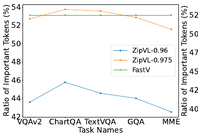

> 🔼 The chart displays the ratio of important tokens across different tasks and models, showing that ZipVL dynamically adjusts this ratio based on task complexity.
> 

> 
read the caption

> Figure 4: The ratio of important tokens across different methods on different tasks. The proposed ZipVL can adaptively determine this ratio based on the attention scores, assigning more ratio to important tokens on complex tasks.
> 

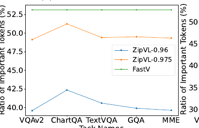

> 🔼 The chart shows the ratio of important tokens across different tasks for three methods: ZipVL-0.96, ZipVL-0.975, and FastV, demonstrating ZipVL's adaptive token ratio adjustment based on task complexity.
> 

> 
read the caption

> Figure 4: The ratio of important tokens across different methods on different tasks. The proposed ZipVL can adaptively determine this ratio based on the attention scores, assigning more ratio to important tokens on complex tasks.
> 

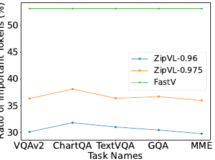

> 🔼 The chart shows the ratio of important tokens used by different methods (ZipVL with thresholds 0.96 and 0.975, and FastV) across five image comprehension tasks.
> 

> 
read the caption

> Figure 4: The ratio of important tokens across different methods on different tasks. The proposed ZipVL can adaptively determine this ratio based on the attention scores, assigning more ratio to important tokens on complex tasks.
> 

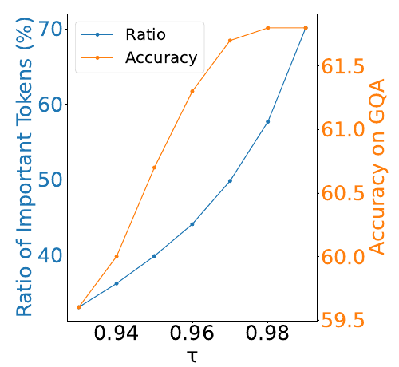

> 🔼 The chart shows the relationship between the attention retention threshold (τ) and both the ratio of important tokens and the model's accuracy on the GQA benchmark, revealing an optimal threshold around 0.97.
> 

> 
read the caption

> Figure 5: The effect of attention scores retention threshold τ on the ratio of important tokens and the model performance. Data was collected on GQA benchmark over LLaVA-v1.5-7B model.
> 

> 🔼 The chart compares the prefill phase latency and GPU memory usage of FlashAttention, MInference, and the proposed ZipVL method across various sequence lengths.
> 

> 
read the caption

> Figure 6: Comparisons of prefill phase latency and GPU memory across different sequence lengths. Data is collected from LongVA-7B model.
> 

More on tables


<table id='2' style='font-size:18px'><tr><td>Model</td><td>Method</td><td>Ratio</td><td>VQAv2</td><td>ChartQA</td><td>TextVQA</td><td>GQA</td><td>MME</td></tr><tr><td rowspan="6">LLaVA-v1.5-7B</td><td>Full</td><td>100%</td><td>76.6</td><td>18.2</td><td>46.1</td><td>61.9</td><td>1507</td></tr><tr><td>FastV+</td><td>53.1%</td><td>75.8</td><td>17.7</td><td>45.5</td><td>60.2</td><td>1511</td></tr><tr><td>HiRED</td><td>20%</td><td>73.0</td><td>17.3</td><td>45.6</td><td>56.8</td><td>1368</td></tr><tr><td>HiRED</td><td>40%</td><td>75.5</td><td>17.6</td><td>45.6</td><td>59.5</td><td>1433</td></tr><tr><td>Ours (T=0.96)</td><td>44.1%</td><td>76.1</td><td>17.9</td><td>45.0</td><td>61.3</td><td>1515</td></tr><tr><td>Ours (�=0.975)</td><td>52.8%</td><td>76.4</td><td>18.0</td><td>45.7</td><td>61.7</td><td>1524</td></tr><tr><td rowspan="6">LLa VA-Next-7B</td><td>Full</td><td>100%</td><td>80.3</td><td>54.8</td><td>64.8</td><td>64.1</td><td>1519</td></tr><tr><td>FastV+</td><td>53.1%</td><td>79.5</td><td>51.2</td><td>63.7</td><td>63.7</td><td>1490</td></tr><tr><td>HiRED</td><td>20%</td><td>77.5</td><td>42.0</td><td>61.4</td><td>61.4</td><td>1483</td></tr><tr><td>HiRED</td><td>40%</td><td>78.8</td><td>46.5</td><td>61.8</td><td>59.4</td><td>1474</td></tr><tr><td>Ours (�=0.96)</td><td>40.4%</td><td>79.4</td><td>51.0</td><td>62.6</td><td>63.8</td><td>1489</td></tr><tr><td>Ours (�=0.975)</td><td>49.7%</td><td>79.8</td><td>52.4</td><td>63.9</td><td>64.1</td><td>1495</td></tr><tr><td rowspan="6">LLa VA-Next-13B</td><td>Full</td><td>100%</td><td>80.9</td><td>66.2</td><td>66.9</td><td>65.7</td><td>1570</td></tr><tr><td>FastV†</td><td>53.1%</td><td>76.8</td><td>51.6</td><td>59.7</td><td>62.9</td><td>1555</td></tr><tr><td>HiRED</td><td>20%</td><td>77.9</td><td>48.9</td><td>63.6</td><td>63.1</td><td>1545</td></tr><tr><td>HiRED</td><td>40%</td><td>79.3</td><td>53.7</td><td>65.2</td><td>64.1</td><td>1570</td></tr><tr><td>Ours (T=0.96)</td><td>30.6%</td><td>79.7</td><td>56.2</td><td>63.8</td><td>64.4</td><td>1549</td></tr><tr><td>Ours (T=0.975)</td><td>36.7%</td><td>80.3</td><td>58.2</td><td>65.0</td><td>65.0</td><td>1551</td></tr></table>
> 🔼 {{ table.description }}
> 

> 
read the caption

> {{ table.caption }}
> 

> Table 1 compares the performance of different image LVLMs on various benchmark datasets using different methods with varying ratios of important tokens.


<table id='1' style='font-size:18px'><tr><td>Model</td><td>Frames</td><td>Method</td><td>Attn FLOPs Reduction</td><td>Short</td><td>Medium</td><td>Long</td><td>Overall</td></tr><tr><td rowspan="10">Long VA-7B</td><td rowspan="5">64</td><td>Full</td><td>0%</td><td>61.4</td><td>50.9</td><td>45.0</td><td>52.4</td></tr><tr><td>QK-sparse</td><td>47.0%</td><td>60.9</td><td>51.4</td><td>45.1</td><td>52.4</td></tr><tr><td>MInference</td><td>54.2%</td><td>60.7</td><td>51.2</td><td>44.6</td><td>52.1</td></tr><tr><td>FastV+</td><td>71.7%</td><td>61.0</td><td>50.6</td><td>45.0</td><td>52.2</td></tr><tr><td>Ours(T=0.975)</td><td>77.0%</td><td>61.1</td><td>51.6</td><td>45.0</td><td>52.5</td></tr><tr><td rowspan="5">128</td><td>Full</td><td>0%</td><td>61.1</td><td>50.4</td><td>46.2</td><td>52.6</td></tr><tr><td>QK-sparse</td><td>46.9%</td><td>61.3</td><td>49.7</td><td>46.3</td><td>52.4</td></tr><tr><td>MInference</td><td>77.1%</td><td>61.0</td><td>50.5</td><td>45.3</td><td>52.3</td></tr><tr><td>FastV+</td><td>71.7%</td><td>60.2</td><td>50.2</td><td>46.2</td><td>52.2</td></tr><tr><td>Ours(T=0.975)</td><td>82.3%</td><td>60.7</td><td>51.3</td><td>45.2</td><td>52.4</td></tr></table>
> 🔼 {{ table.description }}
> 

> 
read the caption

> {{ table.caption }}
> 

> Table 2 compares the performance of different methods on the Video-MME benchmark, showing the reduction in FLOPs of attention mechanisms and overall accuracy for different video lengths.


<table id='7' style='font-size:20px'><tr><td colspan="4">Sparse Attention</td></tr><tr><td>Method</td><td>Ratio (%)</td><td>Attn FLOPs Reduction (%)</td><td>Video-MME (%)</td></tr><tr><td>LongVA-7B</td><td>100</td><td>0</td><td>52.6</td></tr><tr><td>Fixed</td><td>42.1</td><td>82.3</td><td>51.1</td></tr><tr><td>Ours</td><td>42.1</td><td>82.3</td><td>52.4</td></tr><tr><td colspan="4">KV Cache Compression</td></tr><tr><td>Method</td><td>Ratio (%)</td><td>Compression Ratio</td><td>GSM8k Acc. (%)</td></tr><tr><td>LLaMA3-8B</td><td>100</td><td>1x</td><td>55.88</td></tr><tr><td>Fixed (He et al., 2024b)</td><td>70.0</td><td>4.69x</td><td>53.75</td></tr><tr><td>Ours</td><td>28.6</td><td>6.18x</td><td>54.06</td></tr></table>
> 🔼 {{ table.description }}
> 

> 
read the caption

> {{ table.caption }}
> 

> Table 1 compares the performance of different image LVLMs on various benchmarks using different methods with varying ratios of important tokens.

### Full paper


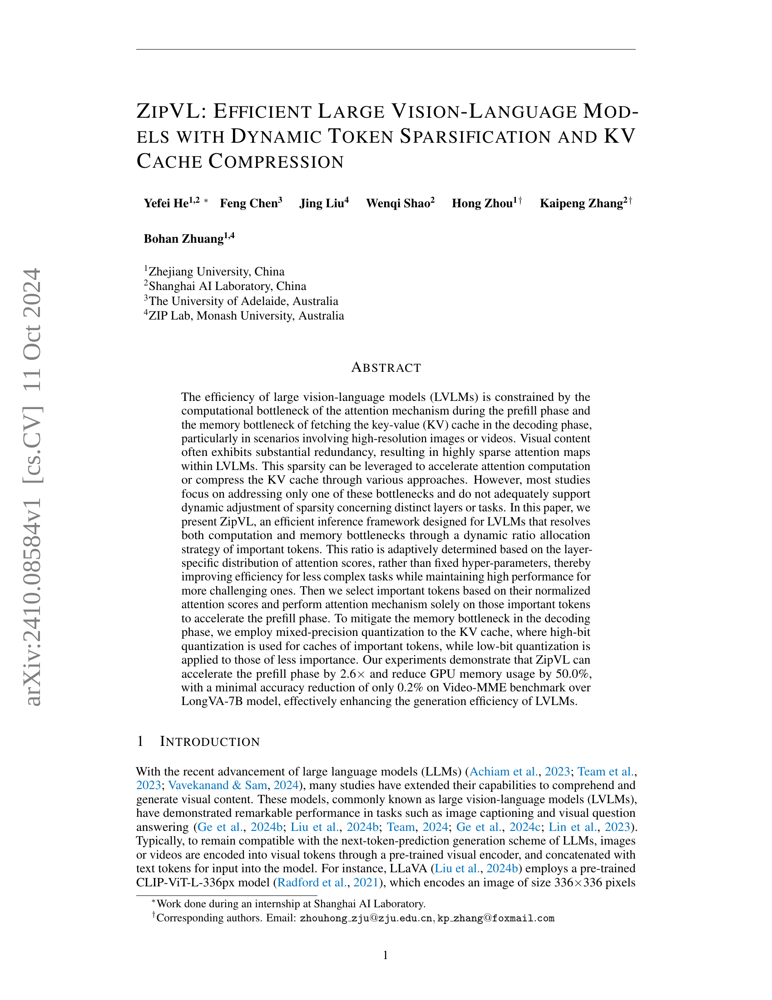
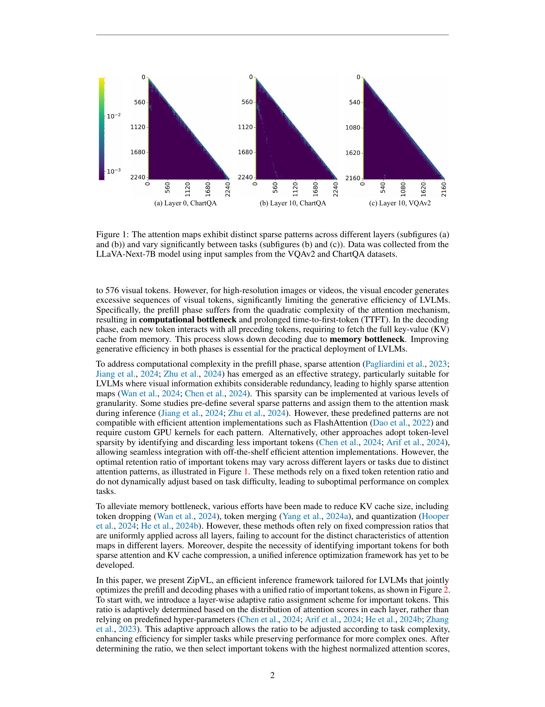

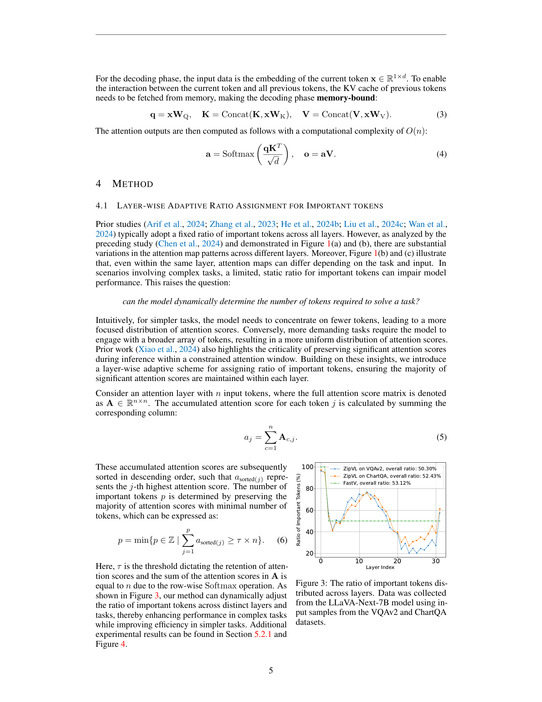
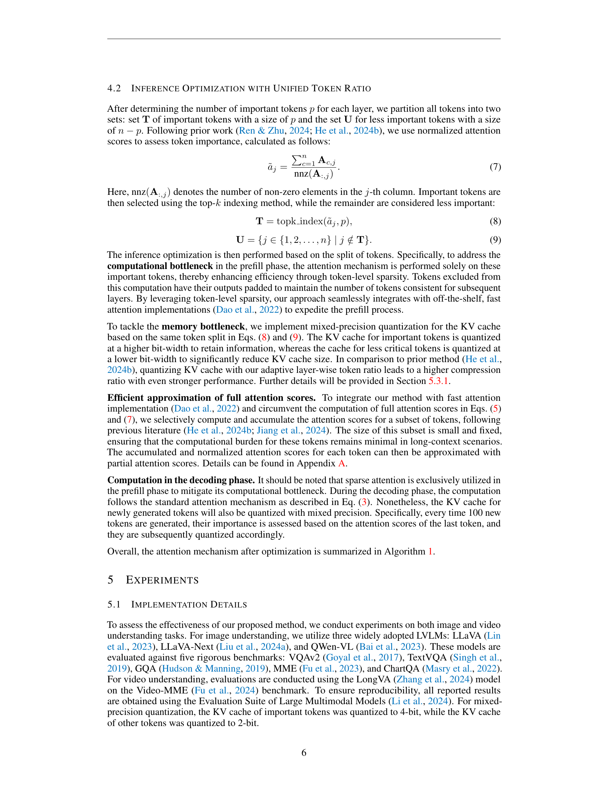

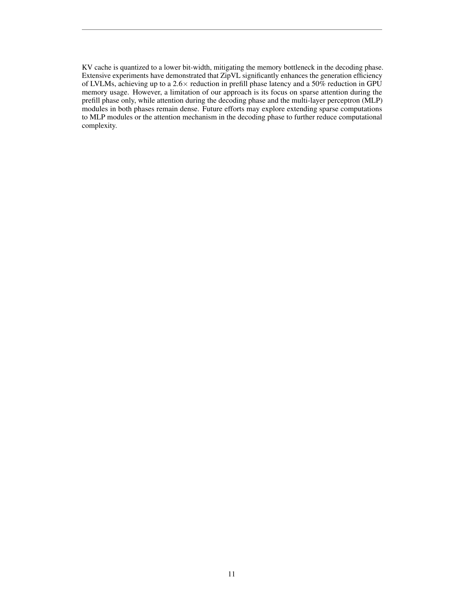

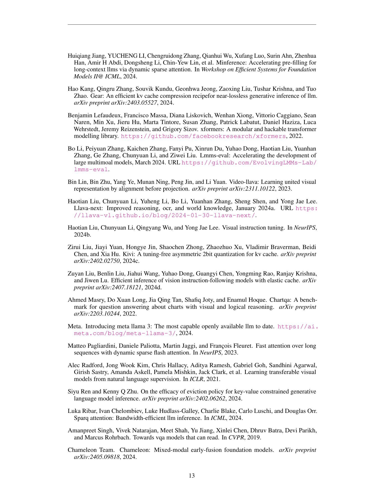

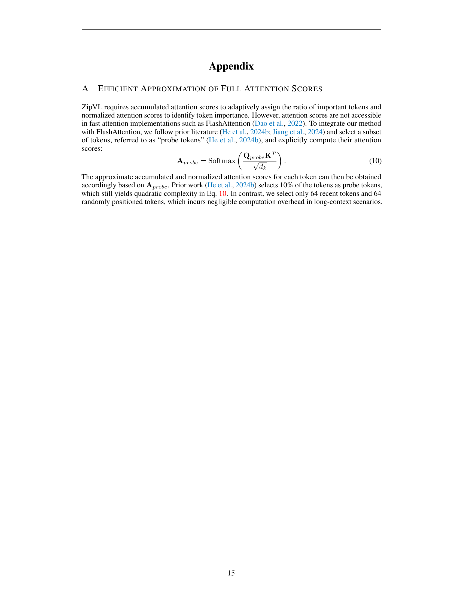
