### TL;DR



Large Language Models (LLMs) are rapidly advancing, but evaluating their efficiency in compressing information remains challenging.  Existing metrics, such as Matrix Entropy, are computationally expensive and not suitable for evaluating very large models. This paper introduces Matrix Nuclear-Norm, a new metric designed to overcome these limitations. Matrix Nuclear-Norm offers a faster and more scalable method to evaluate the compression abilities of LLMs. It achieves this by approximating the nuclear norm using the L1,2 norm, reducing the time complexity from O(n³) to O(n²). Experiments on various LLMs and benchmark datasets demonstrate Matrix Nuclear-Norm's speed and accuracy. Compared to Matrix Entropy, it is 8 to 24 times faster for models ranging from 111M to 6.7B parameters, with the gap widening for larger models.  This efficiency gain makes it particularly useful for evaluating the increasingly large LLMs being developed. The study also validates the metric's accuracy through benchmarking tests, demonstrating its effectiveness in ranking models based on their compression performance. Overall, Matrix Nuclear-Norm provides a practical and reliable tool for evaluating LLMs, balancing accuracy with computational efficiency.




 &nbsp; read the paper on arXiv

  

 &nbsp; on Hugging Face


#### Why does it matter?
This paper is crucial for researchers in natural language processing (NLP) and machine learning (ML) because it introduces a novel, efficient metric (Matrix Nuclear-Norm) to assess the information compression abilities of Large Language Models (LLMs).  The current gold standard, Matrix Entropy, is computationally expensive, limiting its use with large LLMs.  Matrix Nuclear-Norm addresses this bottleneck, enabling faster and more scalable evaluation of LLMs' performance and opening avenues for research into improved compression and efficiency in LLM training and architecture.
#### Key Takeaways


 Matrix Nuclear-Norm offers a significantly faster and more scalable way to evaluate LLMs' information compression capabilities compared to existing methods like Matrix Entropy. 



 The new metric effectively assesses both predictive discriminability and diversity in LLM outputs, providing a more comprehensive evaluation. 



 Empirical evidence demonstrates the effectiveness and efficiency of Matrix Nuclear-Norm across diverse LLMs and benchmark datasets. 


------
#### Visual Insights

> 🔼 The figure compares the computation time of Matrix Entropy and Matrix Nuclear-Norm for various sizes of the CEREBRAS-GPT model, showing that Matrix Nuclear-Norm is significantly faster.
> 

> 
read the caption

> Figure 1: CEREBRAS-GPT: Time comparison
> 

> 🔼 The chart compares the computation times of Matrix Entropy and Matrix Nuclear-Norm for evaluating the Cerebras-GPT language model across various sizes.
> 

> 
read the caption

> Figure 1: CEREBRAS-GPT: Time comparison
> 


<table id='6' style='font-size:20px'><tr><td>Model Size</td><td>Matrix Entropy Time (s)</td><td>Matrix Nuclear-Norm Time (s)</td><td>Ratio</td></tr><tr><td>111M</td><td>623.5367</td><td>72.6734</td><td>8.5800</td></tr><tr><td>256M</td><td>1213.0604</td><td>110.8692</td><td>10.9414</td></tr><tr><td>590M</td><td>2959.6949</td><td>184.7785</td><td>16.0175</td></tr><tr><td>1.3B</td><td>6760.1893</td><td>379.0093</td><td>17.8365</td></tr><tr><td>2.7B</td><td>12083.7105</td><td>732.6385</td><td>16.4934</td></tr><tr><td>6.7B</td><td>38791.2035</td><td>1598.4151</td><td>24.2685</td></tr><tr><td>13B</td><td>59028.4483</td><td>2984.1529</td><td>19.7806</td></tr></table>

> 🔼 Table 1 compares the computation time of Matrix Entropy and Matrix Nuclear-Norm for various sizes of the CEREBRAS-GPT model, showing that Matrix Nuclear-Norm is significantly faster.
> 

> 
read the caption

> Table 1: CEREBRAS-GPT: Time Comparison between Matrix Entropy and Matrix Nuclear-Norm
> 

### More visual insights

More on charts

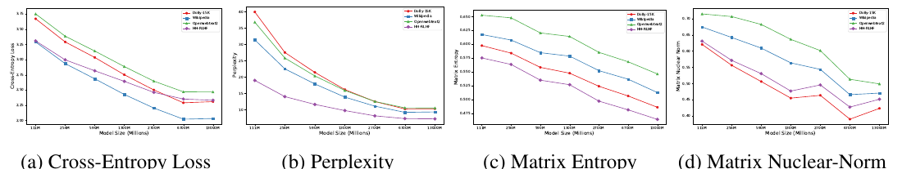

> 🔼 Figure 2 displays the relationship between Matrix Nuclear-Norm, matrix entropy, cross-entropy loss, and perplexity across various model sizes.
> 

> 
read the caption

> Figure 2: Comparison of Matrix Nuclear-Norm, matrix entropy, loss, and perplexity when model scales up.
> 

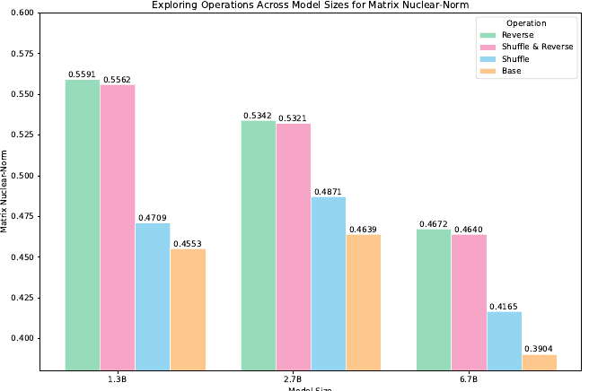

> 🔼 The chart displays the Matrix Nuclear-Norm values for different sentence operations (Reverse, Shuffle & Reverse, Shuffle, Base) across three different model sizes (1.3B, 2.7B, 6.7B), showing how disrupting sentence structure increases the Matrix Nuclear-Norm.
> 

> 
read the caption

> Figure 3: Results of sentence operation. Shuffling and reversing disrupt the text structure and diminish the informational content, leading to an increase in Matrix Nuclear-Norm.
> 

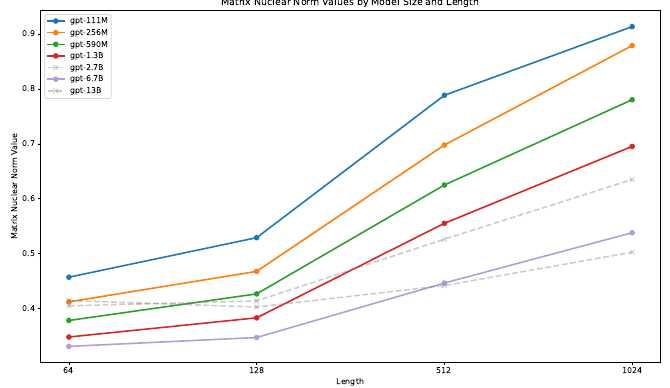

> 🔼 The chart displays the relationship between Matrix Nuclear-Norm values and the length of input text for various sized language models.
> 

> 
read the caption

> Figure 4: The Matrix Nuclear-Norm values for contexts of varying lengths show that as text length increases, the Matrix Nuclear-Norm continues to rise and tends to converge.
> 

> 🔼 The chart displays the cross-entropy loss, matrix entropy, and matrix nuclear norm for the Pythia model family across various model sizes and datasets.
> 

> 
read the caption

> Figure 5: Pythia Model Metrics: Matrix Nuclear-Norm, Matrix Entropy, and Loss
> 

> 🔼 The chart compares the computation time of Matrix Entropy and Matrix Nuclear-Norm for various sizes of Pythia language models.
> 

> 
read the caption

> Figure 6: Pythia: Time Comparison of Matrix Entropy and Nuclear-Norm
> 

More on tables


<table id='7' style='font-size:16px'><tr><td rowspan="2">LENGTH</td><td colspan="7">GPT MODEL SIZE</td></tr><tr><td>111M</td><td>256M</td><td>590M</td><td>1.3B</td><td>2.7B</td><td>6.7B</td><td>13B</td></tr><tr><td>64</td><td>0.4574</td><td>0.4125</td><td>0.3787</td><td>0.3486</td><td>0.4053</td><td>0.3315</td><td>0.4148</td></tr><tr><td>128</td><td>0.5293</td><td>0.4680</td><td>0.4270</td><td>0.3835</td><td>0.4143</td><td>0.3477</td><td>0.4032</td></tr><tr><td>512</td><td>0.7883</td><td>0.6978</td><td>0.6251</td><td>0.5554</td><td>0.5265</td><td>0.4468</td><td>0.4422</td></tr><tr><td>1024</td><td>0.9132</td><td>0.8787</td><td>0.7802</td><td>0.6953</td><td>0.6351</td><td>0.5383</td><td>0.5028</td></tr></table>
> 🔼 {{ table.description }}
> 

> 
read the caption

> {{ table.caption }}
> 

> The table presents the Matrix Nuclear-Norm values for varying lengths of text across different sizes of GPT models, showing the trend of increasing values with length.


 <table id='2' style='font-size:14px'><tr><td rowspan="2">MODELS</td><td colspan="6">ADDING PROMPT TO QA PAIRS</td></tr><tr><td>EMPTY PROMPT</td><td>PROMPT 1</td><td>PROMPT 2</td><td>PROMPT 3</td><td>AVERAGE</td><td>△x</td></tr><tr><td>CEREBRAS-GPT-1.3B</td><td>0.150955</td><td>0.147577</td><td>0.140511</td><td>0.141358</td><td>0.14453</td><td>�0.006425</td></tr><tr><td>CEREBRAS-GPT-2.7B</td><td>0.150130</td><td>0.151522</td><td>0.142834</td><td>0.151842</td><td>0.14844</td><td>�0.001690</td></tr><tr><td>CEREBRAS-GPT-6.7B</td><td>0.132042</td><td>0.128346</td><td>0.124094</td><td>0.133211</td><td>0.12923</td><td>�0.002812</td></tr></table>
> 🔼 {{ table.description }}
> 

> 
read the caption

> {{ table.caption }}
> 

> Table 3 shows the impact of using different prompts on the Matrix Nuclear-Norm values for three different sizes of GPT models.


 <table id='8' style='font-size:20px'><tr><td>Model</td><td>DataSet</td><td>7B</td><td>13B</td><td>33B</td><td>Model</td><td>DataSet</td><td>1.3B</td><td>6.7B</td><td>7B</td></tr><tr><td>Vicuna</td><td>Alpaca Arena</td><td>0.4623 0.4824</td><td>0.4159 0.4311</td><td>0.3643 0.3734</td><td>DeepSeek</td><td>Alpaca Arena</td><td>0.4882 0.5754</td><td>0.3472 0.4175</td><td>0.3352 0.4357</td></tr></table>
> 🔼 {{ table.description }}
> 

> 
read the caption

> {{ table.caption }}
> 

> Table 4 presents Matrix Nuclear-Norm values for Vicuna and DeepSeek models across Alpaca and Arena datasets, demonstrating lower values indicating enhanced information processing efficiency with increasing model size.


<table id='0' style='font-size:14px'><tr><td rowspan="2">MODEL</td><td colspan="3">Matrix Nuclear-Norm</td><td rowspan="2">Rank</td></tr><tr><td>Alpaca</td><td>Arena-Hard</td><td>Avg Score</td></tr><tr><td>DeepSeek-7B</td><td>0.3352</td><td>0.4357</td><td>0.3855</td><td>↓</td></tr><tr><td>Gemma-7B</td><td>0.3759</td><td>0.3998</td><td>0.3879</td><td>↓</td></tr><tr><td>Vicuna-7B</td><td>0.4623</td><td>0.4824</td><td>0.4724</td><td>↓</td></tr><tr><td>LLaMA 2-7B</td><td>0.4648</td><td>0.5038</td><td>0.4843</td><td>↓</td></tr><tr><td>QWEN 1.5-7B</td><td>0.4866</td><td>0.5165</td><td>0.5016</td><td>↓</td></tr><tr><td>Mistral-7B</td><td>0.4980</td><td>0.5126</td><td>0.5053</td><td>↓</td></tr><tr><td>QWEN 2-7B</td><td>0.5989</td><td>0.5751</td><td>0.5870</td><td></td></tr><tr><td>QWEN 1.5-72B</td><td>0.5291</td><td>0.5065</td><td>0.5178</td><td>↓</td></tr><tr><td>QWEN 2-72B</td><td>0.5261</td><td>0.4689</td><td>0.4975</td><td>↓</td></tr><tr><td>Llama 3-70B</td><td>0.4935</td><td>0.4967</td><td>0.4951</td><td>↓</td></tr><tr><td>Llama 2-70B</td><td>0.3862</td><td>0.4086</td><td>0.3974</td><td></td></tr></table>
> 🔼 {{ table.description }}
> 

> 
read the caption

> {{ table.caption }}
> 

> Table 5 presents a comparative analysis of model performance across different model families on Alpaca and Arena-Hard benchmark datasets using Matrix Nuclear-Norm, showing rankings based on average scores.


 <table id='12' style='font-size:16px'><tr><td rowspan="2">MODEL</td><td colspan="5">SAMPLING STRATEGY</td><td rowspan="2">STANDARD DEVIATION</td></tr><tr><td>10000 (SEED 1)</td><td>10000 (SEED 2)</td><td>10000 (SEED 3)</td><td>15000</td><td>20000</td></tr><tr><td>CEREBRAS-GPT-1.3B</td><td>0.5684</td><td>0.5670</td><td>0.5676</td><td>0.5699</td><td>0.5693</td><td>0.0004975</td></tr></table>
> 🔼 {{ table.description }}
> 

> 
read the caption

> {{ table.caption }}
> 

> The table presents the results of an ablation study evaluating the impact of different sampling strategies on the Matrix Nuclear-Norm metric, demonstrating its robustness across varied sample sizes and random seeds.


<table id='4' style='font-size:18px'><tr><td>Model Size</td><td>Matrix Entropy Time (s)</td><td>Matrix Nuclear-Norm Time (s)</td><td>Ratio</td></tr><tr><td>14M</td><td>52.8669</td><td>22.2652</td><td>2.3772</td></tr><tr><td>31M</td><td>114.0820</td><td>28.1842</td><td>4.0477</td></tr><tr><td>70M</td><td>320.6641</td><td>24.3188</td><td>13.1855</td></tr><tr><td>160M</td><td>631.9762</td><td>41.6187</td><td>15.1817</td></tr><tr><td>410M</td><td>1040.9764</td><td>80.9814</td><td>12.8481</td></tr><tr><td>1B</td><td>4650.1264</td><td>114.0639</td><td>40.8387</td></tr><tr><td>1.4B</td><td>6387.0392</td><td>347.8670</td><td>18.3858</td></tr><tr><td>2.8B</td><td>8127.1343</td><td>343.3888</td><td>23.6778</td></tr><tr><td>6.9B</td><td>28197.8172</td><td>816.6332</td><td>34.5350</td></tr><tr><td>12B</td><td>47273.5235</td><td>1276.1128</td><td>37.0485</td></tr></table>
> 🔼 {{ table.description }}
> 

> 
read the caption

> {{ table.caption }}
> 

> The table compares the computation times of Matrix Entropy and Matrix Nuclear-Norm for various sizes of Pythia language models, showing that Matrix Nuclear-Norm is significantly faster.


<table id='6' style='font-size:18px'><tr><td>Model</td><td>DataSet</td><td>0.5B</td><td>1.5B</td><td>7B</td><td>72B</td></tr><tr><td rowspan="2">QWEN 2</td><td>Alpaca</td><td>0.6551</td><td>0.6176</td><td>0.5989</td><td>0.5261</td></tr><tr><td>Arena</td><td>0.6872</td><td>0.6374</td><td>0.5751</td><td>0.4689</td></tr></table>
> 🔼 {{ table.description }}
> 

> 
read the caption

> {{ table.caption }}
> 

> Table 8 presents the Matrix Nuclear-Norm values for different sizes of QWEN 2 models, evaluated on Alpaca and Arena datasets.


 <table id='8' style='font-size:18px'><tr><td>Model</td><td>Data Set</td><td>8B</td><td>70B</td></tr><tr><td rowspan="2">Llama-3</td><td>Alpaca</td><td>0.5782</td><td>0.4935</td></tr><tr><td>Arena</td><td>0.5817</td><td>0.4967</td></tr></table>
> 🔼 {{ table.description }}
> 

> 
read the caption

> {{ table.caption }}
> 

> This table shows the Matrix Nuclear-Norm values for Llama-3 models (8B and 70B parameters) across Alpaca and Arena datasets.


<table id='0' style='font-size:14px'><tr><td rowspan="2">BENCHMARKS</td><td rowspan="2">INDICATORS</td><td colspan="7">GPT MODEL SIZE</td></tr><tr><td>111M</td><td>256M</td><td>590M</td><td>1.3B</td><td>2.7B</td><td>6.7B</td><td>13B</td></tr><tr><td rowspan="5">OPENBOOKQA</td><td>ACCURACY</td><td>0.118</td><td>0.158</td><td>0.158</td><td>0.166</td><td>0.206</td><td>0.238</td><td>0.286</td></tr><tr><td>MATRIX ENTROPY</td><td>0.3575</td><td>0.3416</td><td>0.3237</td><td>0.3140</td><td>0.2991</td><td>0.2848</td><td>0.2767</td></tr><tr><td>LOSS</td><td>5.6196</td><td>5.3536</td><td>5.1881</td><td>4.9690</td><td>4.8723</td><td>4.7195</td><td>4.7050</td></tr><tr><td>PPL</td><td>148.38</td><td>108.10</td><td>83.45</td><td>65.10</td><td>50.93</td><td>41.80</td><td>40.89</td></tr><tr><td>MATRIX NUCLEAR-NORM</td><td>0.4447</td><td>0.4057</td><td>0.3941</td><td>0.3644</td><td>0.4606</td><td>0.3672</td><td>0.4423</td></tr><tr><td rowspan="5">WINOGRANDE</td><td>ACCURACY</td><td>0.488</td><td>0.511</td><td>0.498</td><td>0.521</td><td>0.559</td><td>0.602</td><td>0.646</td></tr><tr><td>MATRIX ENTROPY</td><td>0.4073</td><td>0.3915</td><td>0.3706</td><td>0.3605</td><td>0.3419</td><td>0.3272</td><td>0.3149</td></tr><tr><td>LOSS</td><td>4.7869</td><td>4.5854</td><td>4.4141</td><td>4.2513</td><td>4.1107</td><td>4.0109</td><td>4.0266</td></tr><tr><td>PPL</td><td>39.81</td><td>30.25</td><td>26.57</td><td>21.87</td><td>18.55</td><td>16.53</td><td>16.94</td></tr><tr><td>MATRIX NUCLEAR-NORM</td><td>0.4802</td><td>0.4479</td><td>0.4440</td><td>0.4133</td><td>0.5232</td><td>0.4220</td><td>0.4964</td></tr><tr><td rowspan="5">PIQA</td><td>ACCURACY</td><td>0.594</td><td>0.613</td><td>0.627</td><td>0.664</td><td>0.701</td><td>0.739</td><td>0.766</td></tr><tr><td>MATRIX ENTROPY</td><td>0.4168</td><td>0.3991</td><td>0.3783</td><td>0.3676</td><td>0.3504</td><td>0.3344</td><td>0.3264</td></tr><tr><td>LOSS</td><td>4.8425</td><td>4.5470</td><td>4.4029</td><td>4.1613</td><td>4.0075</td><td>3.8545</td><td>3.8826</td></tr><tr><td>PPL</td><td>69.80</td><td>47.94</td><td>37.88</td><td>28.76</td><td>23.15</td><td>19.76</td><td>19.72</td></tr><tr><td>MATRIX NUCLEAR-NORM</td><td>0.4868</td><td>0.4327</td><td>0.4164</td><td>0.3826</td><td>0.4452</td><td>0.3675</td><td>0.4149</td></tr><tr><td colspan="9">Table 10: Language modeling indicators on openbookqa, winogrande and piqa.</td></tr><tr><td rowspan="2">DATASET</td><td rowspan="2">INDICATORS</td><td colspan="7">GPT MODELS SIZE</td></tr><tr><td>111M</td><td>256M</td><td>590M</td><td>1.3B</td><td>2.7B</td><td>6.7B</td><td>13B</td></tr><tr><td rowspan="4">DOLLY-15K</td><td>MATRIX ENTROPY</td><td>0.5976</td><td>0.5840</td><td>0.5582</td><td>0.5477</td><td>0.5240</td><td>0.5064</td><td>0.4859</td></tr><tr><td>LOSS</td><td>3.6710</td><td>3.2907</td><td>3.0359</td><td>2.7517</td><td>2.5015</td><td>2.2911</td><td>2.3098</td></tr><tr><td>PPL</td><td>39.93</td><td>27.53</td><td>21.42</td><td>16.15</td><td>12.50</td><td>10.23</td><td>10.30</td></tr><tr><td>MATRIX NUCLEAR-NORM</td><td>0.6207</td><td>0.5565</td><td>0.5063</td><td>0.4553</td><td>0.4639</td><td>0.3904</td><td>0.4859</td></tr><tr><td rowspan="4">WIKIPEDIA</td><td>MATRIX ENTROPY</td><td>0.6177</td><td>0.6077</td><td>0.5848</td><td>0.5786</td><td>0.5523</td><td>0.5368</td><td>0.5126</td></tr><tr><td>LOSS</td><td>3.2900</td><td>2.9343</td><td>2.6854</td><td>2.4282</td><td>2.2045</td><td>2.0216</td><td>2.0327</td></tr><tr><td>PPL</td><td>31.38</td><td>22.51</td><td>17.89</td><td>13.85</td><td>11.08</td><td>9.19</td><td>9.32</td></tr><tr><td>MATRIX NUCLEAR-NORM</td><td>0.6744</td><td>0.6422</td><td>0.6094</td><td>0.5639</td><td>0.5438</td><td>0.4660</td><td>0.4708</td></tr><tr><td rowspan="4">OPENWEBTEXT2</td><td>MATRIX ENTROPY</td><td>0.6527</td><td>0.6479</td><td>0.6206</td><td>0.6142</td><td>0.5855</td><td>0.5683</td><td>0.5463</td></tr><tr><td>LOSS</td><td>3.7509</td><td>3.3852</td><td>3.1414</td><td>2.8860</td><td>2.6465</td><td>2.4708</td><td>2.4685</td></tr><tr><td>PPL</td><td>36.79</td><td>25.82</td><td>20.34</td><td>15.89</td><td>12.51</td><td>10.57</td><td>10.51</td></tr><tr><td>MATRIX NUCLEAR-NORM</td><td>0.7147</td><td>0.7066</td><td>0.6823</td><td>0.6363</td><td>0.6017</td><td>0.5133</td><td>0.4991</td></tr><tr><td rowspan="4">HH-RLHF</td><td>MATRIX ENTROPY</td><td>0.5753</td><td>0.5635</td><td>0.5350</td><td>0.5268</td><td>0.4971</td><td>0.4813</td><td>0.4640</td></tr><tr><td>LOSS</td><td>3.3078</td><td>2.9964</td><td>2.8171</td><td>2.6431</td><td>2.4622</td><td>2.3526</td><td>2.3323</td></tr><tr><td>PPL</td><td>18.97</td><td>14.01</td><td>11.62</td><td>9.73</td><td>8.12</td><td>7.27</td><td>7.19</td></tr><tr><td>MATRIX NUCLEAR-NORM</td><td>0.6309</td><td>0.5716</td><td>0.5307</td><td>0.4771</td><td>0.4959</td><td>0.4277</td><td>0.4518</td></tr></table>
> 🔼 {{ table.description }}
> 

> 
read the caption

> {{ table.caption }}
> 

> Table 10 presents a comparison of various language modeling metrics (accuracy, matrix entropy, loss, perplexity, and matrix nuclear norm) across different model sizes (111M, 256M, 590M, 1.3B, 2.7B, 6.7B, and 13B) for three benchmark datasets: OpenBookQA, Winogrande, and PIQA.


 <table id='1' style='font-size:14px'><tr><td rowspan="2">DATASETS</td><td rowspan="2">INDICATORS</td><td colspan="10">PYTHIA MODELS SIZE</td></tr><tr><td>14M</td><td>31M</td><td>70M</td><td>160M</td><td>410M</td><td>1B</td><td>1.4B</td><td>2.8B</td><td>6.9B</td><td>12B</td></tr><tr><td rowspan="3">DOLLY-15K</td><td>MATRIX ENTROPY</td><td>0.7732</td><td>0.7155</td><td>0.6707</td><td>0.6243</td><td>0.5760</td><td>0.5328</td><td>0.5309</td><td>0.5263</td><td>0.5003</td><td>0.4876</td></tr><tr><td>LOSS</td><td>4.4546</td><td>4.0358</td><td>3.5990</td><td>3.1323</td><td>2.6752</td><td>2.4843</td><td>2.3816</td><td>2.2484</td><td>2.1368</td><td>2.0616</td></tr><tr><td>MATRIX NUCLEAR-NORM</td><td>0.7508</td><td>0.7735</td><td>0.6984</td><td>0.6104</td><td>0.5760</td><td>0.4710</td><td>0.4922</td><td>0.4585</td><td>0.4202</td><td>0.4181</td></tr><tr><td rowspan="3">WIKIPEDIA</td><td>MATRIX ENTROPY</td><td>0.7938</td><td>0.7442</td><td>0.7003</td><td>0.6580</td><td>0.6039</td><td>0.5584</td><td>0.5587</td><td>0.5553</td><td>0.5314</td><td>0.5140</td></tr><tr><td>LOSS</td><td>4.1112</td><td>3.6921</td><td>3.2694</td><td>2.8207</td><td>2.4017</td><td>2.2213</td><td>2.1292</td><td>2.0140</td><td>1.9120</td><td>1.8489</td></tr><tr><td>MATRIX NUCLEAR-NORM</td><td>0.6053</td><td>0.6700</td><td>0.6996</td><td>0.6718</td><td>0.6464</td><td>0.5591</td><td>0.5787</td><td>0.5410</td><td>0.4850</td><td>0.4768</td></tr><tr><td rowspan="3">OPENWEBTEXT2</td><td>MATRIX ENTROPY</td><td>0.8144</td><td>0.7749</td><td>0.7370</td><td>0.6980</td><td>0.6415</td><td>0.5944</td><td>0.5916</td><td>0.5887</td><td>0.5591</td><td>0.5417</td></tr><tr><td>LOSS</td><td>4.3965</td><td>4.0033</td><td>3.6284</td><td>3.2031</td><td>2.7838</td><td>2.6198</td><td>2.5228</td><td>2.4005</td><td>2.3133</td><td>2.2502</td></tr><tr><td>MATRIX NUCLEAR-NORM</td><td>0.5041</td><td>0.6186</td><td>0.7142</td><td>0.7258</td><td>0.7105</td><td>0.6215</td><td>0.6378</td><td>0.5967</td><td>0.5275</td><td>0.5110</td></tr><tr><td rowspan="3">HH-RLHF</td><td>MATRIX ENTROPY</td><td>0.7673</td><td>0.7114</td><td>0.6607</td><td>0.6126</td><td>0.5552</td><td>0.5054</td><td>0.5032</td><td>0.4977</td><td>0.4699</td><td>0.4528</td></tr><tr><td>LOSS</td><td>3.7466</td><td>3.4018</td><td>3.1146</td><td>2.7366</td><td>2.4340</td><td>2.3311</td><td>2.2687</td><td>2.1992</td><td>2.1199</td><td>2.0905</td></tr><tr><td>MATRIX NUCLEAR-NORM</td><td>0.7353</td><td>0.7674</td><td>0.6964</td><td>0.6182</td><td>0.5886</td><td>0.4825</td><td>0.5141</td><td>0.4839</td><td>0.4562</td><td>0.4481</td></tr></table>
> 🔼 {{ table.description }}
> 

> 
read the caption

> {{ table.caption }}
> 

> Table 12 presents the language modeling indicators for Pythia models across four datasets, showing Matrix Entropy, Loss, and Matrix Nuclear-Norm values for various model sizes.


 <table id='3' style='font-size:14px'><tr><td>Prompt ID</td><td>Prompt Content</td></tr><tr><td>Prompt 1</td><td>You are an AI assistant. You will be given a task. You must generate a detailed and long answer.</td></tr><tr><td>Prompt 2</td><td>You are a helpful assistant, who always provide explanation. Think like you are answering to a five year old.</td></tr><tr><td>Prompt 3</td><td>You are an AI assistant. User will give you a task. Your goal is to complete the task as faithfully as you can. While performing the task think step-by-step and justify your steps.</td></tr></table>
> 🔼 {{ table.description }}
> 

> 
read the caption

> {{ table.caption }}
> 

> This table lists the three prompts selected from the OpenOrca dataset that were used in the prompt learning experiments.

### Full paper



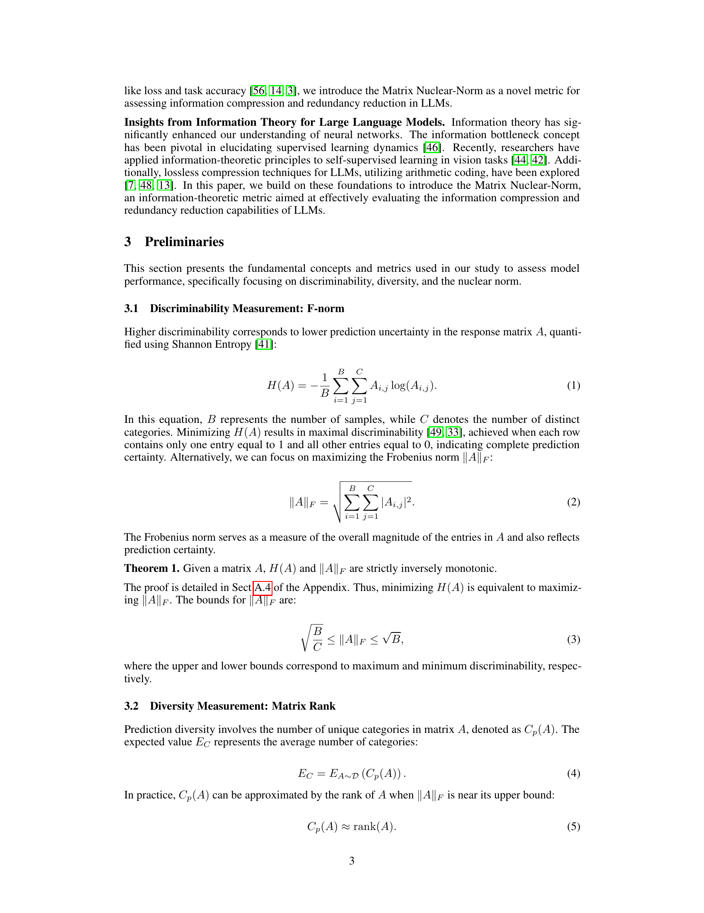
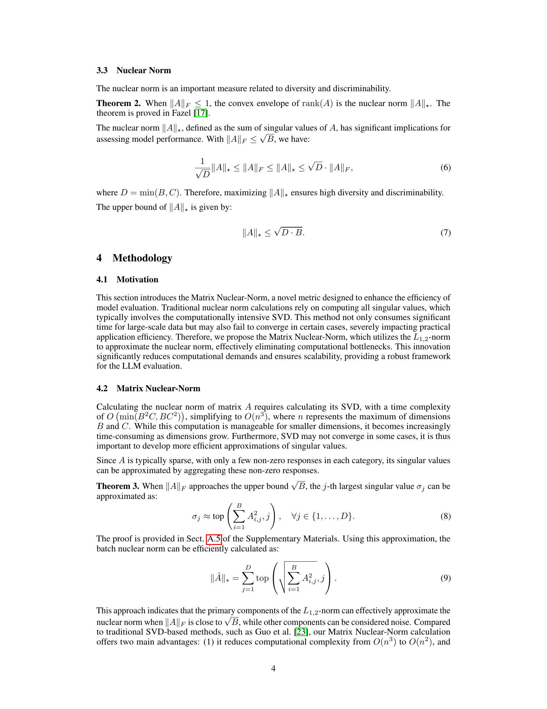

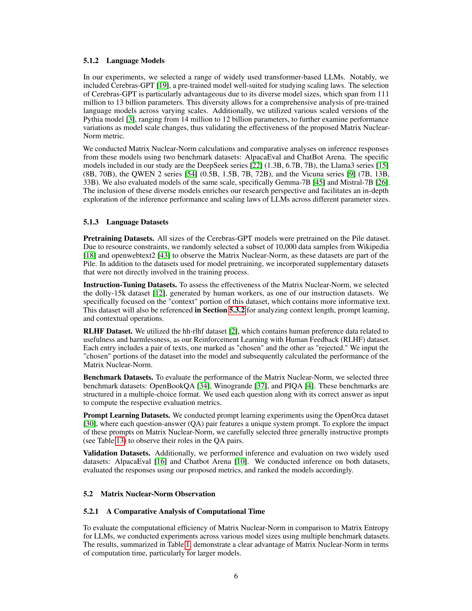
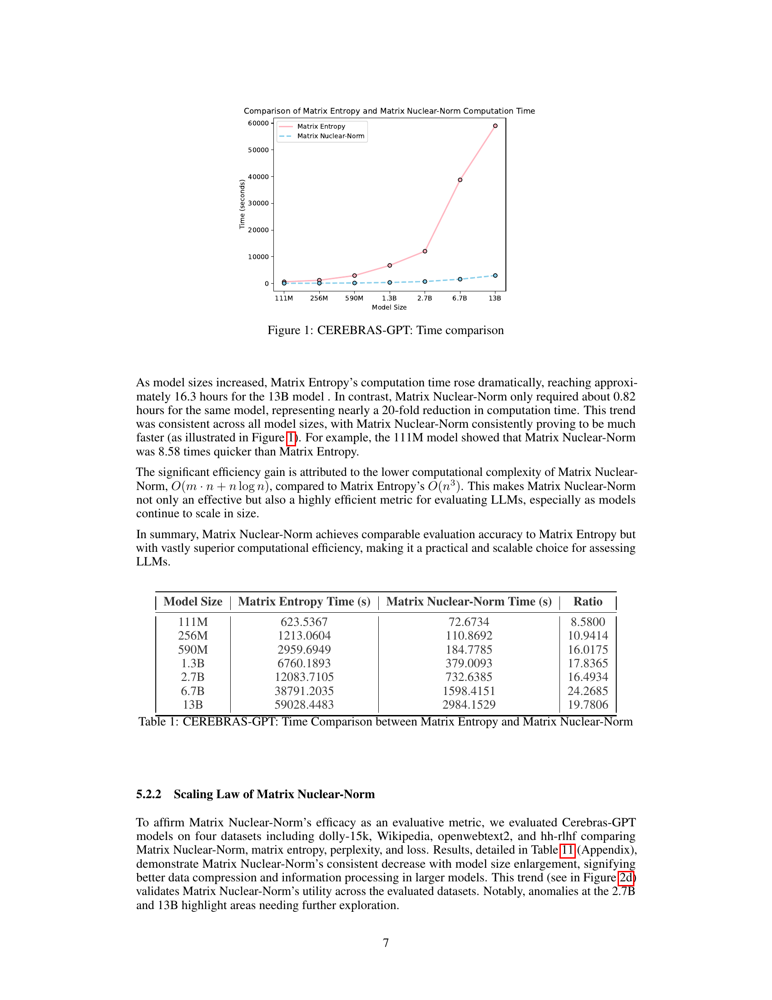

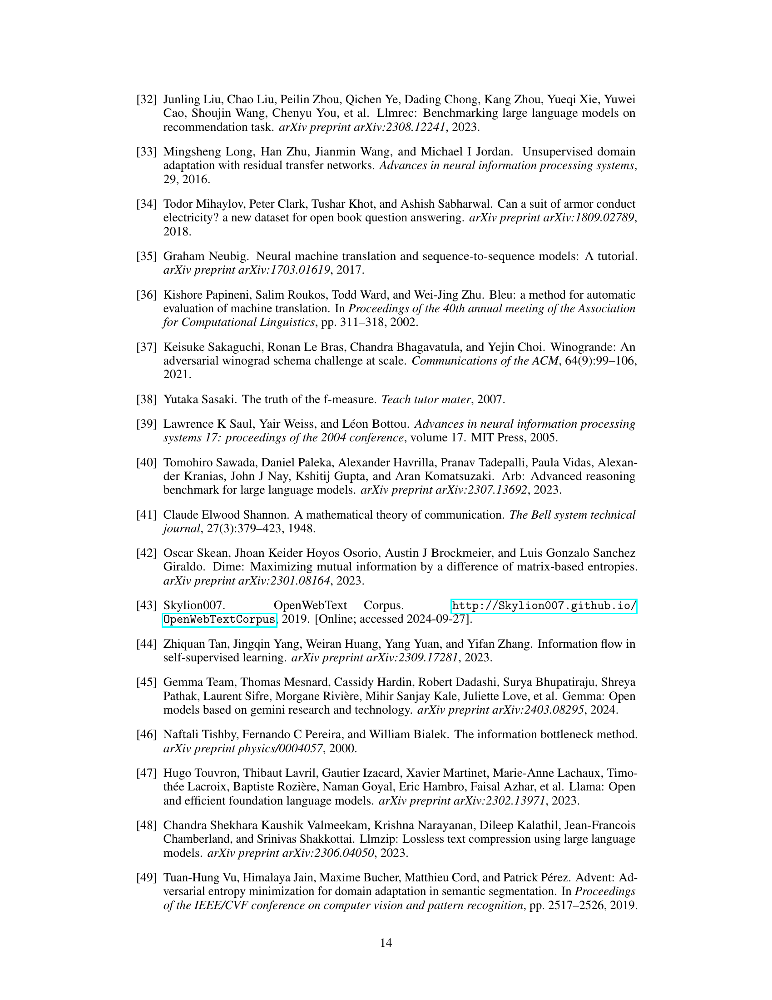

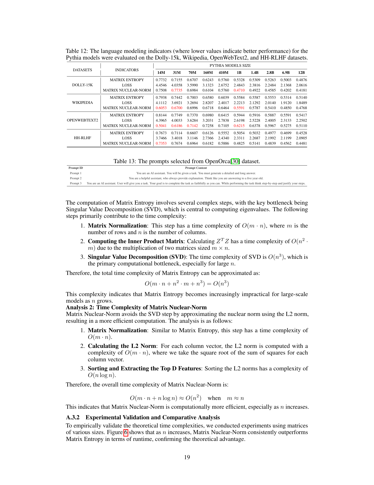
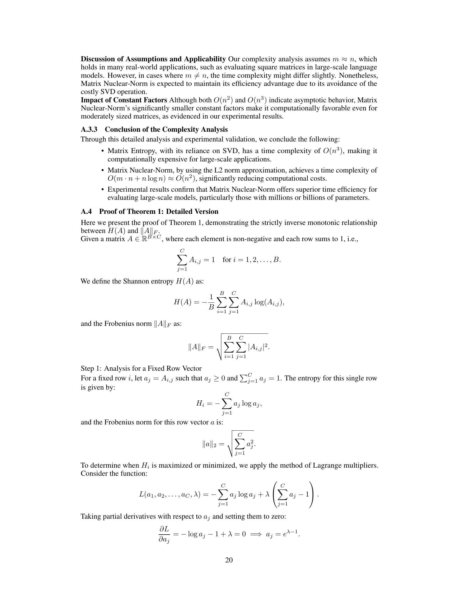

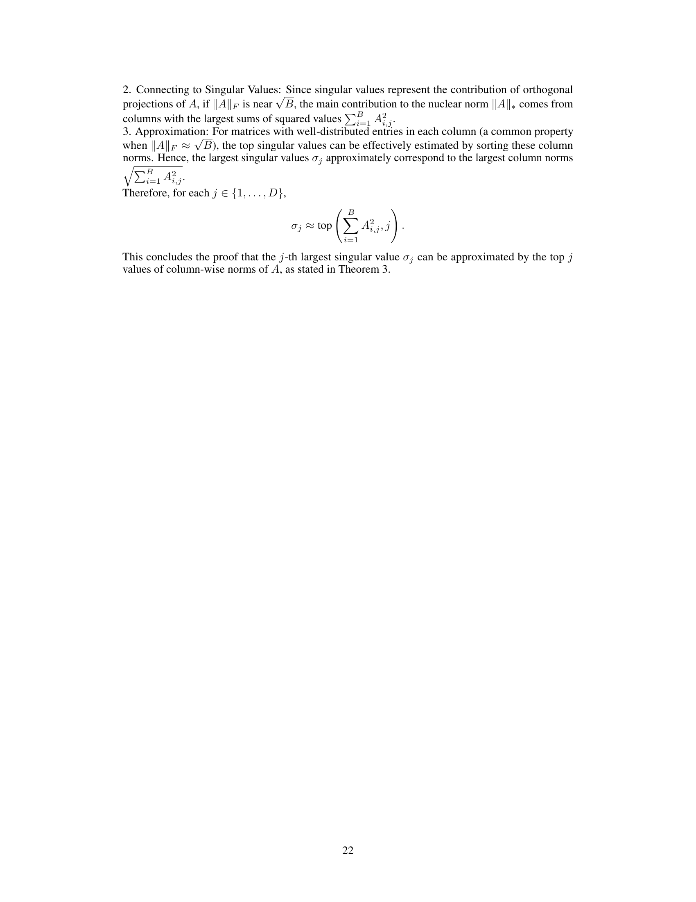
