### TL;DR



The research paper introduces VidEgoThink, a new benchmark for evaluating how well artificial intelligence understands videos taken from a first-person perspective.  This is important for building robots and other AI systems that can interact with the world like humans do.  The researchers tested several different AI models using VidEgoThink and found that they all performed poorly, meaning there's still a lot of work to be done to create AI that can truly understand and act in the real world from a first-person viewpoint.  The four key areas evaluated were: answering questions about the video, creating a plan of action, identifying objects within the video, and determining the effectiveness of the actions taken.  The findings highlight the need for improved models that can more accurately process and interpret egocentric video data.




 &nbsp; read the paper on arXiv

  

 &nbsp; on Hugging Face


#### Why does it matter?
This paper is crucial for embodied AI researchers as it introduces VidEgoThink, a novel benchmark specifically designed for evaluating egocentric video understanding capabilities.  The benchmark addresses limitations of existing datasets by focusing on tasks directly relevant to embodied AI applications, such as planning and reward modeling. This work highlights the gap between current MLLMs and the requirements of embodied AI and will likely spur further research in developing more effective models for real-world, first-person scenarios.
#### Key Takeaways


 VidEgoThink, a comprehensive benchmark for evaluating egocentric video understanding in embodied AI, was introduced. 



 Current large language models (LLMs) show poor performance on tasks within VidEgoThink, indicating a significant gap in their capabilities for embodied AI applications. 



 The benchmark's design, focusing on four key interrelated tasks relevant to embodied AI (video Q&A, planning, visual grounding, and reward modeling), provides valuable insights and direction for future model development. 


------
#### Visual Insights

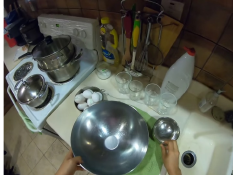

> 🔼 The figure illustrates the four main tasks of the VidEgoThink benchmark for assessing egocentric video understanding capabilities in embodied AI: video question answering, hierarchy planning, visual grounding, and reward modeling.
> 

> 
read the caption

> Figure 1: The main tasks of VidEgoThink benchmark to comprehensively assess the egocentric video understanding capabilities in Embodied AI. There are four types of tasks, including video question answering, hierarchy planning, visual grounding, and reward modeling. These four tasks are complementary to each other to implement a complete goal for Embodied AI.
> 


<table id='2' style='font-size:14px'><tr><td rowspan="2">Benchmark</td><td rowspan="2">Comprehensive Capabilities</td><td colspan="2">View</td><td colspan="4">Task Type</td><td rowspan="2">Data Source</td><td rowspan="2">Average Length</td><td rowspan="2">Total Size</td></tr><tr><td>Observe</td><td>Interact</td><td>VQA</td><td>HP</td><td>VG</td><td>RM</td></tr><tr><td>ActivityNet-QA</td><td></td><td></td><td>X</td><td></td><td>X</td><td></td><td>X</td><td>Handcraft</td><td>180s</td><td>58,000</td></tr><tr><td>SEED-Bench-2</td><td></td><td></td><td>X</td><td></td><td>X</td><td>X</td><td>X</td><td>Handcraft</td><td>一</td><td>24,000</td></tr><tr><td>AutoEval-Video</td><td></td><td></td><td>X</td><td></td><td>X</td><td></td><td>X</td><td>Handcraft</td><td>14.58s</td><td>327</td></tr><tr><td>Video-Bench</td><td>V</td><td></td><td>X</td><td></td><td>X</td><td></td><td>X</td><td>Existing</td><td>-</td><td>15,000</td></tr><tr><td>Perception Test</td><td>X</td><td></td><td>X</td><td></td><td>X</td><td>V</td><td>X</td><td>Handcraft</td><td>23s</td><td>11,600</td></tr><tr><td>OpenEQA</td><td>X</td><td></td><td>X</td><td>V</td><td>X</td><td>X</td><td>X</td><td>Handcraft</td><td>-</td><td>1,600</td></tr><tr><td>MVBench</td><td>V</td><td>V</td><td>V</td><td>V</td><td>X</td><td>X</td><td>X</td><td>Existing</td><td>(5s, 35s)</td><td>4,000</td></tr><tr><td>EgoVQA</td><td>X</td><td>V</td><td>V</td><td>V</td><td>X</td><td>X</td><td>X</td><td>Handcraft</td><td>(20s, 100s)</td><td>520</td></tr><tr><td>EgoThink</td><td>V</td><td>X</td><td>V</td><td>V</td><td>V</td><td>X</td><td>X</td><td>Handcraft</td><td>-</td><td>700</td></tr><tr><td>EgoTaskQA</td><td>X</td><td>X</td><td>V</td><td>V</td><td>X</td><td>X</td><td>X</td><td>Automatic</td><td>25s</td><td>40,000</td></tr><tr><td>EgoPlan-Bench</td><td>X</td><td>X</td><td>V</td><td>X</td><td>V</td><td>X</td><td>X</td><td>Automatic</td><td>-</td><td>3,400</td></tr><tr><td>EgoSchema</td><td>X</td><td>X</td><td></td><td>V</td><td>X</td><td>X</td><td>X</td><td>Automatic</td><td>180s</td><td>5,000</td></tr><tr><td>VidEgoThink (Ours)</td><td>V</td><td>V</td><td>V</td><td>V</td><td>V</td><td>V</td><td>V</td><td>Automatic</td><td>270.74s</td><td>4,993</td></tr></table>

> 🔼 Table 1 compares existing multimodal large language model evaluation benchmarks against the proposed VidEgoThink benchmark, highlighting differences in capabilities, task types, data collection methods, and data size.
> 

> 
read the caption

> Table 1: Comparison of recent evaluation benchmarks of multimodal large language models and our proposed benchmark VidEgoThink. VQA/HP/VG/RM indicate visual question answering, hierarchy planning, visual grounding, and reward modeling. Existing/Handcraft/Automatic denote the way of collecting data, including existing dataset, manual annotation, and automatic generation.
> 

### More visual insights

More on figures

> 🔼 The figure illustrates the four main tasks of the VidEgoThink benchmark for evaluating egocentric video understanding capabilities in embodied AI.
> 

> 
read the caption

> Figure 1: The main tasks of VidEgoThink benchmark to comprehensively assess the egocentric video understanding capabilities in Embodied AI. There are four types of tasks, including video question answering, hierarchy planning, visual grounding, and reward modeling. These four tasks are complementary to each other to implement a complete goal for Embodied AI.
> 

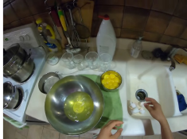

> 🔼 The figure illustrates the four main tasks of the VidEgoThink benchmark for evaluating egocentric video understanding capabilities in embodied AI, namely video question answering, hierarchy planning, visual grounding, and reward modeling.
> 

> 
read the caption

> Figure 1: The main tasks of VidEgoThink benchmark to comprehensively assess the egocentric video understanding capabilities in Embodied AI. There are four types of tasks, including video question answering, hierarchy planning, visual grounding, and reward modeling. These four tasks are complementary to each other to implement a complete goal for Embodied AI.
> 

> 🔼 The figure illustrates the four main tasks of the VidEgoThink benchmark for evaluating egocentric video understanding capabilities in embodied AI.
> 

> 
read the caption

> Figure 1: The main tasks of VidEgoThink benchmark to comprehensively assess the egocentric video understanding capabilities in Embodied AI. There are four types of tasks, including video question answering, hierarchy planning, visual grounding, and reward modeling. These four tasks are complementary to each other to implement a complete goal for Embodied AI.
> 

> 🔼 The figure illustrates the four main tasks of the VidEgoThink benchmark for evaluating egocentric video understanding capabilities in embodied AI: video question answering, hierarchy planning, visual grounding, and reward modeling.
> 

> 
read the caption

> Figure 1: The main tasks of VidEgoThink benchmark to comprehensively assess the egocentric video understanding capabilities in Embodied AI. There are four types of tasks, including video question answering, hierarchy planning, visual grounding, and reward modeling. These four tasks are complementary to each other to implement a complete goal for Embodied AI.
> 

> 🔼 The figure illustrates the hierarchy planning task in VidEgoThink, showing the decomposition of a high-level goal into mid-level steps and low-level actions using egocentric video observations.
> 

> 
read the caption

> Figure 3: Case of hierarchy planning.
> 

> 🔼 The figure illustrates the four main tasks of the VidEgoThink benchmark for evaluating egocentric video understanding capabilities in embodied AI: video question answering, hierarchy planning, visual grounding, and reward modeling.
> 

> 
read the caption

> Figure 1: The main tasks of VidEgoThink benchmark to comprehensively assess the egocentric video understanding capabilities in Embodied AI. There are four types of tasks, including video question answering, hierarchy planning, visual grounding, and reward modeling. These four tasks are complementary to each other to implement a complete goal for Embodied AI.
> 

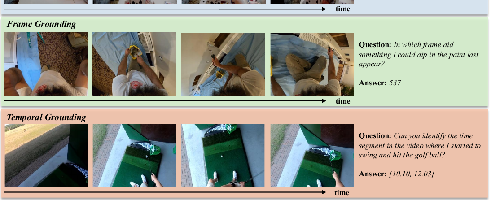

> 🔼 The figure illustrates the four main tasks of the VidEgoThink benchmark for evaluating egocentric video understanding capabilities in embodied AI: video question answering, hierarchy planning, visual grounding, and reward modeling.
> 

> 
read the caption

> Figure 1: The main tasks of VidEgoThink benchmark to comprehensively assess the egocentric video understanding capabilities in Embodied AI. There are four types of tasks, including video question answering, hierarchy planning, visual grounding, and reward modeling. These four tasks are complementary to each other to implement a complete goal for Embodied AI.
> 

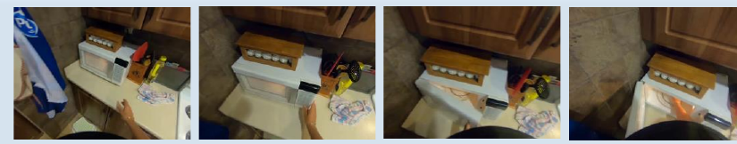

> 🔼 The figure illustrates the hierarchy planning task in VidEgoThink, showing the decomposition of a high-level goal into mid-level steps and low-level actions, guided by an egocentric video.
> 

> 
read the caption

> Figure 3: Case of hierarchy planning.
> 

> 🔼 The figure illustrates the hierarchy planning task in VidEgoThink, showing a high-level goal, mid-level steps, low-level actions, and the overall video.
> 

> 
read the caption

> Figure 3: Case of hierarchy planning.
> 

> 🔼 Figure 1 shows the four main tasks of the VidEgoThink benchmark designed to assess egocentric video understanding capabilities for embodied AI.
> 

> 
read the caption

> Figure 1: The main tasks of VidEgoThink benchmark to comprehensively assess the egocentric video understanding capabilities in Embodied AI. There are four types of tasks, including video question answering, hierarchy planning, visual grounding, and reward modeling. These four tasks are complementary to each other to implement a complete goal for Embodied AI.
> 

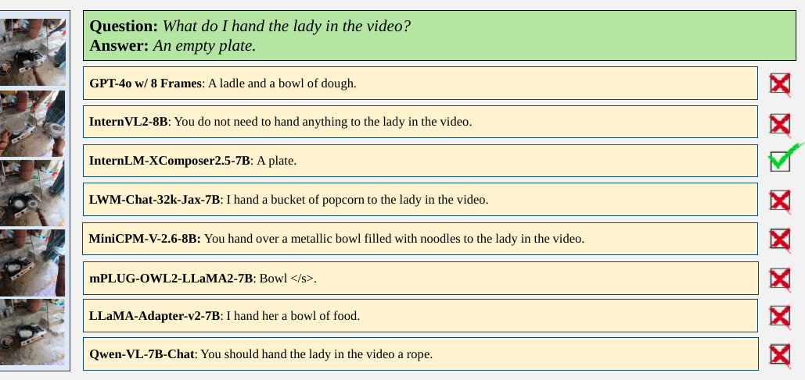

> 🔼 The figure illustrates the four main interrelated tasks of the VidEgoThink benchmark for evaluating egocentric video understanding capabilities in embodied AI.
> 

> 
read the caption

> Figure 1: The main tasks of VidEgoThink benchmark to comprehensively assess the egocentric video understanding capabilities in Embodied AI. There are four types of tasks, including video question answering, hierarchy planning, visual grounding, and reward modeling. These four tasks are complementary to each other to implement a complete goal for Embodied AI.
> 

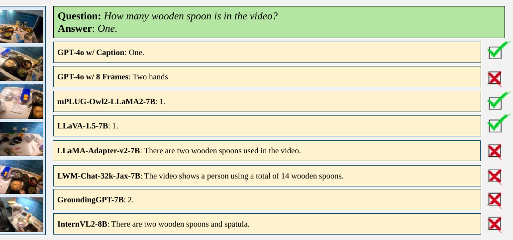

> 🔼 The figure illustrates the four main tasks of the VidEgoThink benchmark for evaluating egocentric video understanding capabilities in embodied AI.
> 

> 
read the caption

> Figure 1: The main tasks of VidEgoThink benchmark to comprehensively assess the egocentric video understanding capabilities in Embodied AI. There are four types of tasks, including video question answering, hierarchy planning, visual grounding, and reward modeling. These four tasks are complementary to each other to implement a complete goal for Embodied AI.
> 

> 🔼 The figure illustrates the four main tasks of the VidEgoThink benchmark for evaluating egocentric video understanding capabilities in embodied AI.
> 

> 
read the caption

> Figure 1: The main tasks of VidEgoThink benchmark to comprehensively assess the egocentric video understanding capabilities in Embodied AI. There are four types of tasks, including video question answering, hierarchy planning, visual grounding, and reward modeling. These four tasks are complementary to each other to implement a complete goal for Embodied AI.
> 

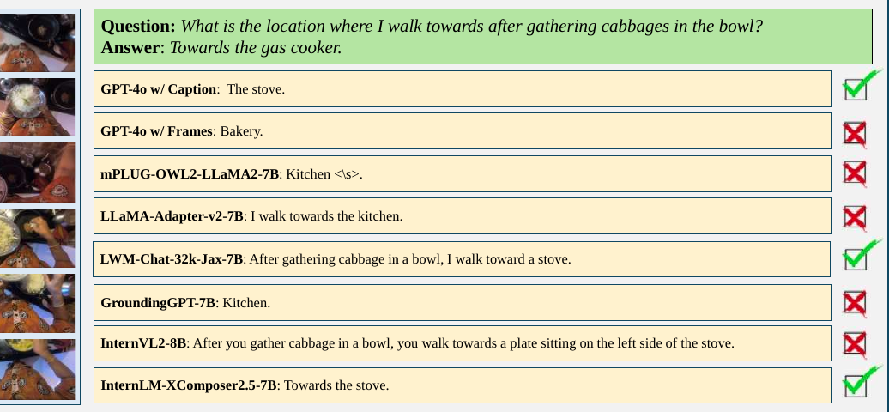

> 🔼 The figure illustrates the four main tasks of the VidEgoThink benchmark for embodied AI: video question answering, hierarchy planning, visual grounding, and reward modeling.
> 

> 
read the caption

> Figure 1: The main tasks of VidEgoThink benchmark to comprehensively assess the egocentric video understanding capabilities in Embodied AI. There are four types of tasks, including video question answering, hierarchy planning, visual grounding, and reward modeling. These four tasks are complementary to each other to implement a complete goal for Embodied AI.
> 

> 🔼 The figure illustrates the four main tasks in the VidEgoThink benchmark for evaluating egocentric video understanding capabilities in embodied AI.
> 

> 
read the caption

> Figure 1: The main tasks of VidEgoThink benchmark to comprehensively assess the egocentric video understanding capabilities in Embodied AI. There are four types of tasks, including video question answering, hierarchy planning, visual grounding, and reward modeling. These four tasks are complementary to each other to implement a complete goal for Embodied AI.
> 

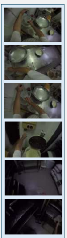

> 🔼 Figure 1 shows the four main tasks of the VidEgoThink benchmark, which are designed to comprehensively assess the egocentric video understanding capabilities for embodied AI.
> 

> 
read the caption

> Figure 1: The main tasks of VidEgoThink benchmark to comprehensively assess the egocentric video understanding capabilities in Embodied AI. There are four types of tasks, including video question answering, hierarchy planning, visual grounding, and reward modeling. These four tasks are complementary to each other to implement a complete goal for Embodied AI.
> 

> 🔼 The figure illustrates the four main tasks of the VidEgoThink benchmark for evaluating egocentric video understanding capabilities in embodied AI: video question answering, hierarchy planning, visual grounding, and reward modeling.
> 

> 
read the caption

> Figure 1: The main tasks of VidEgoThink benchmark to comprehensively assess the egocentric video understanding capabilities in Embodied AI. There are four types of tasks, including video question answering, hierarchy planning, visual grounding, and reward modeling. These four tasks are complementary to each other to implement a complete goal for Embodied AI.
> 

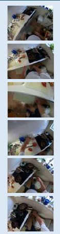

> 🔼 The figure illustrates the four main tasks of the VidEgoThink benchmark for evaluating egocentric video understanding capabilities in embodied AI.
> 

> 
read the caption

> Figure 1: The main tasks of VidEgoThink benchmark to comprehensively assess the egocentric video understanding capabilities in Embodied AI. There are four types of tasks, including video question answering, hierarchy planning, visual grounding, and reward modeling. These four tasks are complementary to each other to implement a complete goal for Embodied AI.
> 

> 🔼 The figure illustrates the four main tasks of the VidEgoThink benchmark for evaluating egocentric video understanding capabilities in embodied AI.
> 

> 
read the caption

> Figure 1: The main tasks of VidEgoThink benchmark to comprehensively assess the egocentric video understanding capabilities in Embodied AI. There are four types of tasks, including video question answering, hierarchy planning, visual grounding, and reward modeling. These four tasks are complementary to each other to implement a complete goal for Embodied AI.
> 

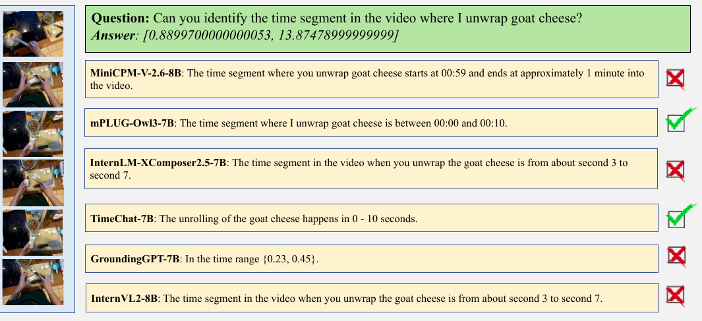

> 🔼 The figure illustrates the four main tasks of the VidEgoThink benchmark for evaluating egocentric video understanding capabilities in embodied AI.
> 

> 
read the caption

> Figure 1: The main tasks of VidEgoThink benchmark to comprehensively assess the egocentric video understanding capabilities in Embodied AI. There are four types of tasks, including video question answering, hierarchy planning, visual grounding, and reward modeling. These four tasks are complementary to each other to implement a complete goal for Embodied AI.
> 

> 🔼 The figure illustrates the four main tasks in the VidEgoThink benchmark for evaluating egocentric video understanding capabilities in embodied AI: video question answering, hierarchy planning, visual grounding, and reward modeling.
> 

> 
read the caption

> Figure 1: The main tasks of VidEgoThink benchmark to comprehensively assess the egocentric video understanding capabilities in Embodied AI. There are four types of tasks, including video question answering, hierarchy planning, visual grounding, and reward modeling. These four tasks are complementary to each other to implement a complete goal for Embodied AI.
> 

> 🔼 The figure illustrates the four main tasks of the VidEgoThink benchmark for evaluating egocentric video understanding capabilities in embodied AI, namely video question answering, hierarchy planning, visual grounding, and reward modeling.
> 

> 
read the caption

> Figure 1: The main tasks of VidEgoThink benchmark to comprehensively assess the egocentric video understanding capabilities in Embodied AI. There are four types of tasks, including video question answering, hierarchy planning, visual grounding, and reward modeling. These four tasks are complementary to each other to implement a complete goal for Embodied AI.
> 

More on tables


 <table id='14' style='font-size:14px'><tr><td>Question: Did the person remove the milk from</td><td>Explanations:</td></tr><tr><td>the microwave? Answer: Yes Question: Did the person close the microwave door after removing the milk? → Answer: No</td><td>1. The video does not show the person closing the microwave door after removing the milk. 2. The final frames focus on the person holding the milk, not on the microwave door. 3. There is no visible action of the person moving to close the microwave door.</td></tr></table>
> 🔼 {{ table.description }}
> 

> 
read the caption

> {{ table.caption }}
> 

> This table compares various recent egocentric video benchmarks for multimodal large language models (MLLMs) across several key tasks, highlighting their differences in data collection methods and dataset sizes, and introduces the VidEgoThink benchmark.


<table id='11' style='font-size:14px'><tr><td rowspan="2">Benchmark</td><td rowspan="2">Subtask</td><td colspan="3">Video</td><td colspan="4">Question-Answering</td><td rowspan="2">#Scene</td></tr><tr><td>#Original</td><td>#Clipped</td><td>Duration</td><td>#Instance</td><td>LenQ</td><td>LenA</td><td>TypeQ</td></tr><tr><td rowspan="3">Video Question Answering</td><td>Object</td><td>29</td><td>57</td><td>23.71</td><td>300</td><td>10.88</td><td>7.13</td><td>5</td><td>9</td></tr><tr><td>Action</td><td>39</td><td>78</td><td>24.56</td><td>150</td><td>10.85</td><td>4.72</td><td>4</td><td>9</td></tr><tr><td>Scene</td><td>45</td><td>82</td><td>21.91</td><td>150</td><td>11.46</td><td>8.34</td><td>4</td><td>9</td></tr><tr><td rowspan="2">Hierarchy Planning</td><td>High-to-Mid</td><td>76</td><td>598</td><td>1008.26</td><td>598</td><td>16.5</td><td>5.18</td><td>1</td><td>9</td></tr><tr><td>Mid-to-Low</td><td>76</td><td>598</td><td>1008.26</td><td>598</td><td>22.12</td><td>6.02</td><td>1</td><td>9</td></tr><tr><td rowspan="3">Visual Grounding</td><td>Object</td><td>41</td><td>88</td><td>119.05</td><td>220</td><td>22.60</td><td>-</td><td>1</td><td>25</td></tr><tr><td>Frame</td><td>65</td><td>147</td><td>139.57</td><td>368</td><td>23.01</td><td>-</td><td>1</td><td>25</td></tr><tr><td>Temporal</td><td>69</td><td>416</td><td>68.90</td><td>735</td><td>82.40</td><td>-</td><td>1</td><td>8</td></tr><tr><td rowspan="2">Reward Modeling</td><td>Critique</td><td>76</td><td>963</td><td>16.60</td><td>1236</td><td>11.21</td><td>1.00</td><td>1</td><td>9</td></tr><tr><td>Feedback</td><td>74</td><td>638</td><td>15.08</td><td>638</td><td>19.24</td><td>53.06</td><td>1</td><td>9</td></tr></table>
> 🔼 {{ table.description }}
> 

> 
read the caption

> {{ table.caption }}
> 

> This table compares various existing egocentric video understanding benchmarks with the proposed VidEgoThink benchmark across key aspects such as task types, data collection methods, and data size.


<table id='2' style='font-size:14px'><tr><td rowspan="2">Model</td><td rowspan="2">LM</td><td rowspan="2">VM</td><td rowspan="2">TM</td><td rowspan="2">AM</td><td rowspan="2">Model Size</td><td colspan="2">Training Data</td></tr><tr><td>Image/Video-Text</td><td>Instruction</td></tr><tr><td colspan="8">Image-based MLLMs</td></tr><tr><td>mPLUG-Owl2</td><td>LLaMA</td><td>CLIP-ViT-L</td><td>-</td><td>Visual Abstractor</td><td>7B</td><td>1.23M</td><td>-</td></tr><tr><td>Qwen-VL</td><td>Qwen</td><td>CLIP-ViT-G</td><td>-</td><td>VL Adapter</td><td>7B</td><td>1.4B</td><td>350K</td></tr><tr><td>LLaVA-1.5</td><td>LLaMA/Vicuna</td><td>CLIP-ViT-L-3</td><td>-</td><td>Linear</td><td>7B</td><td>558K</td><td>665K</td></tr><tr><td>LLaMA-Adapter v2</td><td>LLaMA</td><td>CLIP-ViT-L</td><td>、</td><td>Linear</td><td>7B</td><td>567K</td><td>52K</td></tr><tr><td colspan="8">Video-based MLLMs</td></tr><tr><td>LWM</td><td>LLaMA2</td><td>VQGAN</td><td>-</td><td>-</td><td>7B</td><td>1.01B</td><td>519K</td></tr><tr><td>TimeChat</td><td>LLaMA2</td><td>CLIP-ViT-G</td><td>TA Frame Encoder</td><td>Sliding Video Q-Former</td><td>7B</td><td>-</td><td>177K</td></tr><tr><td>GroundingGPT</td><td>Vicuna-v1.5</td><td>CLIP-ViT-L</td><td>Position Encoding</td><td>MLP</td><td>7B</td><td>>1.3M</td><td>>770K</td></tr><tr><td>InternVL2</td><td>InternLM2.5</td><td>Intern ViT-300M</td><td>-</td><td>QLLaMA</td><td>8B</td><td>10B</td><td>-</td></tr><tr><td>InternLM-XComposer2.5</td><td>InternLM2</td><td>CLIP-ViT-L</td><td>-</td><td>Partial-LoRA</td><td>7B</td><td>-</td><td>-</td></tr><tr><td>Video-LLaVA</td><td>Vicuna-v1.5</td><td>Language Bind</td><td>-</td><td>Linear</td><td>7B</td><td>1.26M</td><td>765K</td></tr><tr><td>PG-Video-LLaVA</td><td>Vicuna-v1.5</td><td>CLIP-ViT-L-3</td><td>Grounding Module</td><td>MLP</td><td>7B</td><td>-</td><td>100K</td></tr><tr><td>mPLUG-Owl3</td><td>Qwen2</td><td>SigLip-400M</td><td>MI-RoPE</td><td>Linear</td><td>8B</td><td>>1.7M</td><td>>IM</td></tr><tr><td>MiniCPM-V2.6</td><td>Qwen2</td><td>SigLip-400M</td><td>-</td><td>Adaptive Visual Encoding</td><td>8B</td><td>570M</td><td>3M</td></tr><tr><td>Qwen2-VL</td><td>Qwen2</td><td>ViT</td><td>M-RoPE</td><td>3D-conv</td><td>8B</td><td>1.4Ttokens</td><td>-</td></tr></table>
> 🔼 {{ table.description }}
> 

> 
read the caption

> {{ table.caption }}
> 

> Table 1 compares various existing egocentric video understanding benchmarks for multimodal large language models, highlighting their task types, data collection methods, and dataset sizes, alongside the proposed VidEgoThink benchmark.


<table id='2' style='font-size:14px'><tr><td rowspan="2">Models</td><td colspan="6">Object</td><td colspan="3">Action</td><td colspan="3">Scene</td><td rowspan="2">Average</td></tr><tr><td>OE</td><td>00</td><td>OI</td><td>OC</td><td>OS</td><td>OP</td><td>AE</td><td>AS</td><td>AC</td><td>SE</td><td>ST</td><td>SP</td></tr><tr><td>GPT-4o w/ only-qa</td><td>13.00</td><td>0.00</td><td>12.00</td><td>6.00</td><td>31.00</td><td>23.00</td><td>25.00</td><td>4.00</td><td>2.00</td><td>18.00</td><td>6.00</td><td>20.00</td><td>13.33</td></tr><tr><td>GPT-4o w/ captions</td><td>51.00</td><td>16.00</td><td>14.00</td><td>30.00</td><td>25.00</td><td>44.00</td><td>34.00</td><td>5.00</td><td>22.00</td><td>42.00</td><td>28.00</td><td>16.00</td><td>27.25</td></tr><tr><td>GPT-4o w/ 8 frames</td><td>51.00</td><td>16.00</td><td>30.00</td><td>33.00</td><td>35.00</td><td>45.00</td><td>38.00</td><td>25.00</td><td>22.00</td><td>43.00</td><td>23.00</td><td>24.00</td><td>32.83</td></tr><tr><td>GPT-4o w/ 32 frames</td><td>52.00</td><td>18.00</td><td>30.00</td><td>35.00</td><td>32.00</td><td>40.00</td><td>39.00</td><td>20.00</td><td>24.00</td><td>46.00</td><td>20.00</td><td>18.00</td><td>31.17</td></tr><tr><td>mPLUG-Owl2-Hama2-7B</td><td>29.00</td><td>6.00</td><td>15.00</td><td>30.00</td><td>10.00</td><td>16.00</td><td>28.00</td><td>8.00</td><td>28.00</td><td>20.00</td><td>10.00</td><td>6.00</td><td>17.17</td></tr><tr><td>Qwen-VL-7B-Chat</td><td>41.00</td><td>7.00</td><td>13.00</td><td>33.00</td><td>14.00</td><td>30.00</td><td>17.00</td><td>3.00</td><td>27.00</td><td>16.00</td><td>13.00</td><td>10.00</td><td>18.67</td></tr><tr><td>LLaVA-1.5-7B</td><td>46.00</td><td>7.00</td><td>17.00</td><td>34.00</td><td>22.00</td><td>24.00</td><td>25.00</td><td>1.00</td><td>14.00</td><td>20.00</td><td>13.00</td><td>16.00</td><td>19.92</td></tr><tr><td>LLaMA-Adapter-V2-7B</td><td>48.00</td><td>5.00</td><td>26.00</td><td>17.00</td><td>19.00</td><td>39.00</td><td>14.00</td><td>9.00</td><td>35.00</td><td>24.00</td><td>10.00</td><td>16.00</td><td>21.80</td></tr><tr><td>LWM-Chat-32k-Jax-7B</td><td>42.00</td><td>3.00</td><td>20.00</td><td>12.00</td><td>10.00</td><td>11.00</td><td>20.00</td><td>4.00</td><td>21.00</td><td>27.00</td><td>9.00</td><td>5.00</td><td>15.33</td></tr><tr><td>TimeChat-7B</td><td>42.00</td><td>5.00</td><td>15.00</td><td>21.00</td><td>11.00</td><td>23.00</td><td>20.00</td><td>4.00</td><td>20.00</td><td>31.00</td><td>14.00</td><td>14.00</td><td>18.33</td></tr><tr><td>GroundingGPT-7B</td><td>43.00</td><td>3.00</td><td>20.00</td><td>30.00</td><td>10.00</td><td>23.00</td><td>22.00</td><td>4.00</td><td>32.00</td><td>23.00</td><td>19.00</td><td>14.00</td><td>20.25</td></tr><tr><td>InternVL2-8B</td><td>43.00</td><td>16.00</td><td>21.00</td><td>18.00</td><td>20.00</td><td>27.00</td><td>19.00</td><td>4.00</td><td>15.00</td><td>37.00</td><td>17.00</td><td>12.00</td><td>20.75</td></tr><tr><td>InternLM-XComposer2.5-7B</td><td>36.00</td><td>6.00</td><td>24.00</td><td>22.00</td><td>19.00</td><td>34.00</td><td>30.00</td><td>2.00</td><td>30.00</td><td>31.00</td><td>11.00</td><td>12.00</td><td>21.42</td></tr><tr><td>Video-LLa VA-7B</td><td>44.00</td><td>8.00</td><td>19.00</td><td>34.00</td><td>15.00</td><td>30.00</td><td>18.00</td><td>3.00</td><td>38.00</td><td>28.00</td><td>11.00</td><td>11.00</td><td>21.58</td></tr><tr><td>PG-Video-LLaVA-7B</td><td>49.00</td><td>5.00</td><td>21.00</td><td>15.00</td><td>23.00</td><td>37.00</td><td>25.00</td><td>3.00</td><td>16.00</td><td>35.00</td><td>18.00</td><td>20.00</td><td>22.25</td></tr><tr><td>mPLUG-Owl3-7B</td><td>32.00</td><td>7.00</td><td>26.00</td><td>13.00</td><td>33.00</td><td>34.00</td><td>18.00</td><td>6.00</td><td>36.00</td><td>37.00</td><td>23.00</td><td>10.00</td><td>22.92</td></tr><tr><td>MiniCPM-V-2.6-8B</td><td>48.00</td><td>12.00</td><td>28.00</td><td>16.00</td><td>25.00</td><td>42.00</td><td>31.00</td><td>11.00</td><td>15.00</td><td>42.00</td><td>23.00</td><td>18.00</td><td>25.92</td></tr><tr><td>Qwen2-VL-7B-Instruct</td><td>36.00</td><td>19.00</td><td>28.00</td><td>28.00</td><td>28.00</td><td>43.00</td><td>24.00</td><td>9.00</td><td>20.00</td><td>48.00</td><td>24.00</td><td>20.00</td><td>27.25</td></tr></table>
> 🔼 {{ table.description }}
> 

> 
read the caption

> {{ table.caption }}
> 

> Table 4 presents the experimental results of video question answering across different dimensions (object, action, scene) and models, highlighting the best and second-best performances.


<table id='2' style='font-size:14px'><tr><td rowspan="2">Models</td><td colspan="3">Video Question Answering</td><td colspan="2">Hierarchy Planning</td><td colspan="3">Visual Grounding</td><td colspan="2">Reward Modeling</td></tr><tr><td>Object</td><td>Action</td><td>Scene</td><td>High-to-Mid</td><td>Mid-to-Low</td><td>Object</td><td>Frame</td><td>Temporal</td><td>Critique</td><td>Feedback</td></tr><tr><td>GPT-4o w/ only-qa</td><td>14.17</td><td>10.33</td><td>14.67</td><td>8.86</td><td>32.56</td><td>、</td><td>-</td><td>-</td><td>48.46</td><td>6.81</td></tr><tr><td>GPT-4o w/ captions</td><td>30.00</td><td>20.33</td><td>28.67</td><td>9.53</td><td>33.65</td><td>-</td><td>-</td><td>-</td><td>58.82</td><td>14.58</td></tr><tr><td>GPT-4o w/ 8 frames</td><td>35.00</td><td>28.33</td><td>30.00</td><td>12.04</td><td>35.47</td><td>-</td><td>-</td><td>、</td><td>58.74</td><td>33.46</td></tr><tr><td>GPT-4o w/ 32 frames</td><td>34.50</td><td>27.67</td><td>26.33</td><td>14.97</td><td>35.08</td><td>-</td><td>-</td><td>-</td><td>59.39</td><td>34.64</td></tr><tr><td>mPLUG-Owl2-llama2-7B</td><td>17.67</td><td>21.33</td><td>12.00</td><td>5.77</td><td>0.00</td><td>-</td><td>-</td><td>-</td><td>41.26</td><td>1.56</td></tr><tr><td>Qwen-VL-7B-Chat</td><td>23.00</td><td>15.67</td><td>13.00</td><td>10.79</td><td>0.04</td><td>-</td><td>-</td><td>-</td><td>49.19</td><td>4.08</td></tr><tr><td>LLaVA-1.5-7B</td><td>25.00</td><td>13.33</td><td>16.33</td><td>2.59</td><td>0.01</td><td>-</td><td>-</td><td>-</td><td>53.72</td><td>3.53</td></tr><tr><td>LLaMA-Adapter-V2-7B</td><td>25.67</td><td>19.33</td><td>16.67</td><td>4.59</td><td>0.03</td><td>-</td><td>-</td><td>-</td><td>39.64</td><td>2.89</td></tr><tr><td>LWM-Chat-32k-Jax-7B</td><td>16.33</td><td>15.00</td><td>13.67</td><td>1.33</td><td>0.00</td><td>0.00</td><td>0.00</td><td>0.00</td><td>22.09</td><td>0.00</td></tr><tr><td>TimeChat-7B</td><td>19.50</td><td>14.67</td><td>19.67</td><td>3.85</td><td>0.01</td><td>0.00</td><td>0.00</td><td>14.56</td><td>47.25</td><td>0.57</td></tr><tr><td>GroundingGPT-7B</td><td>21.50</td><td>19.33</td><td>18.66</td><td>5.69</td><td>0.05</td><td>0.76</td><td>0.54</td><td>0.44</td><td>51.13</td><td>2.19</td></tr><tr><td>Intern VL2-8B</td><td>24.17</td><td>12.67</td><td>22.00</td><td>3.34</td><td>0.05</td><td>0.09</td><td>0.00</td><td>6.87</td><td>52.67</td><td>0.71</td></tr><tr><td>InternLM-XComposer2.5-7B</td><td>23.50</td><td>20.67</td><td>18.00</td><td>9.62</td><td>0.04</td><td>0.00</td><td>0.54</td><td>3.50</td><td>51.41</td><td>8.23</td></tr><tr><td>PG-Video-LLaVA-7B</td><td>25.00</td><td>14.67</td><td>24.33</td><td>5.35</td><td>0.00</td><td>0.08</td><td>0.00</td><td>16.18</td><td>48.30</td><td>6.27</td></tr><tr><td>mPLUG-Owl3-7B</td><td>24.17</td><td>20.00</td><td>23.33</td><td>12.29</td><td>0.03</td><td>0.00</td><td>0.00</td><td>0.00</td><td>50.00</td><td>9.09</td></tr><tr><td>MiniCPM-V-2.6-8B</td><td>28.50</td><td>19.00</td><td>27.67</td><td>14.13</td><td>0.06</td><td>0.35</td><td>1.63</td><td>11.30</td><td>51.54</td><td>13.09</td></tr><tr><td>Qwen2-VL-7B-Instruct</td><td>30.33</td><td>16.00</td><td>27.67</td><td>9.88</td><td>0.00</td><td>0.00</td><td>0.00</td><td>0.00</td><td>49.03</td><td>4.62</td></tr></table>
> 🔼 {{ table.description }}
> 

> 
read the caption

> {{ table.caption }}
> 

> Table 5 presents a comparative analysis of the performance of various multimodal large language models across four tasks: video question answering, hierarchy planning, visual grounding, and reward modeling.


 <table id='2' style='font-size:14px'><tr><td colspan="2">Question: My next step is to pour water into oven furnace. What is the trajectory of low-level atomic actions to complete the steps? Answer: grab(jug), empty(water, oven).</td></tr><tr><td>GPT-4o w/ Caption: grab(water), walk(oven), pour(water, oven furnace)</td><td>8.0</td></tr><tr><td>GPT-4o w/ 8 Frames: grab(jug), walk(oven), pour(container, oven)</td><td>8.0</td></tr><tr><td>mPLUG-OWL2-LLaMA2-7B: open: open(<arg1>, <arg2>), turn_on: turn_on(<arg1>, pour: pour(<arg1>, <arg2>), ..</td><td>0.0</td></tr><tr><td>LLaVA-1.5-7B: To pour water into the oven furnace, you will need to perform the following low-level atomic actions: 1. Open the oven door. 2. Remove the oven rack. 3. - +</td><td>0.0</td></tr><tr><td>LLaMA-Adapter-v2-7B: 1. Put the oven door open. 2. Grab the water bottle. 3. Talk to the camera. 4. Close the oven door. 5.</td><td>0.0</td></tr><tr><td>LWM-Chat-32k-Jax-7B: The video shows a person wearing a ghost costume, and they are seen grabbing a piece of paper ...</td><td>0.0</td></tr><tr><td>InternVL2-8B: get_water(tank), open(furnace, front), put(water, furnace), close(furnace, front)</td><td>5.0</td></tr></table>
> 🔼 {{ table.description }}
> 

> 
read the caption

> {{ table.caption }}
> 

> Table 1 compares various existing egocentric video benchmarks for multimodal large language models (MLLMs)  with the proposed VidEgoThink benchmark, highlighting their capabilities, task types, data collection methods, and data size.


<table id='5' style='font-size:14px'><tr><td colspan="2">Question: Please generate the rationale for determining why I did not complete the task to sprinkle flour on the dough. Answer: 1. The video shows the action of rubbing flour on the dough, not sprinkling it. 2. The hand is seen directly applying flour to the dough, indicating a rubbing motion rather than a sprinkling motion. 3. The flour is being spread across the dough surface by hand, which is consistent with rubbing not sprinkling.</td></tr><tr><td>GPT-40 w/ 8 Frames: The table surface is clean and there is no visible flour on it.</td><td>0.5</td></tr><tr><td>GPT-4o w/ 32 Frames: The flour is still in the bag and not on the table.</td><td>0.5</td></tr><tr><td>Qwen-VL-7B-Chat: I did not complete the task of sprinkle flour on the dough because the flour was already on the counter, and I did not need to add more.</td><td>0.0</td></tr><tr><td>LWM-Chat-32k-Jax-7B: The reason that I did not complete the task to sprinkle flour onto the dough is that I was not in the mood to bake. The video shows that the person was baking a cake and sprinkling flour on the dough before baking it. The caption mentions that the person was not in the mood to bake, but it is possible that they were not in the mood for baking at that moment.</td><td>0.0</td></tr><tr><td>GroundingGPT-7B: The rationale is that the video does not show the completion of the task, so it is not possible to determine why it was not complete.</td><td>0.0</td></tr></table>
> 🔼 {{ table.description }}
> 

> 
read the caption

> {{ table.caption }}
> 

> Table 1 compares various recent egocentric video understanding benchmarks for multimodal large language models (MLLMs) against the proposed VidEgoThink benchmark, highlighting differences in capabilities, view, task types, data sources, and data collection methods.

### Full paper


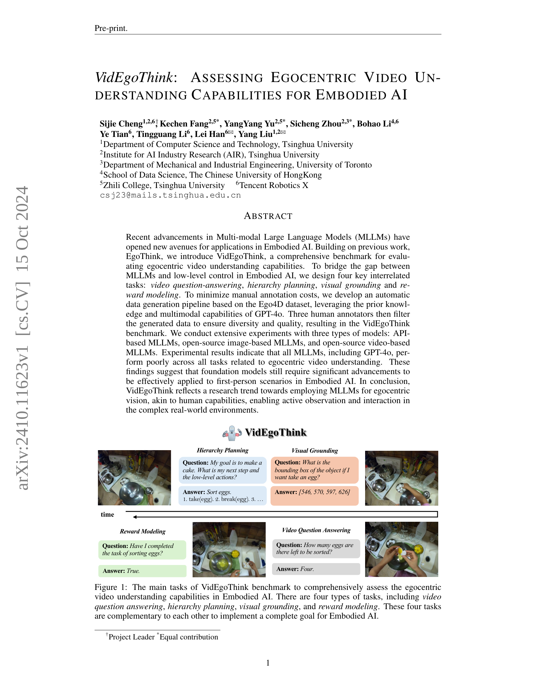
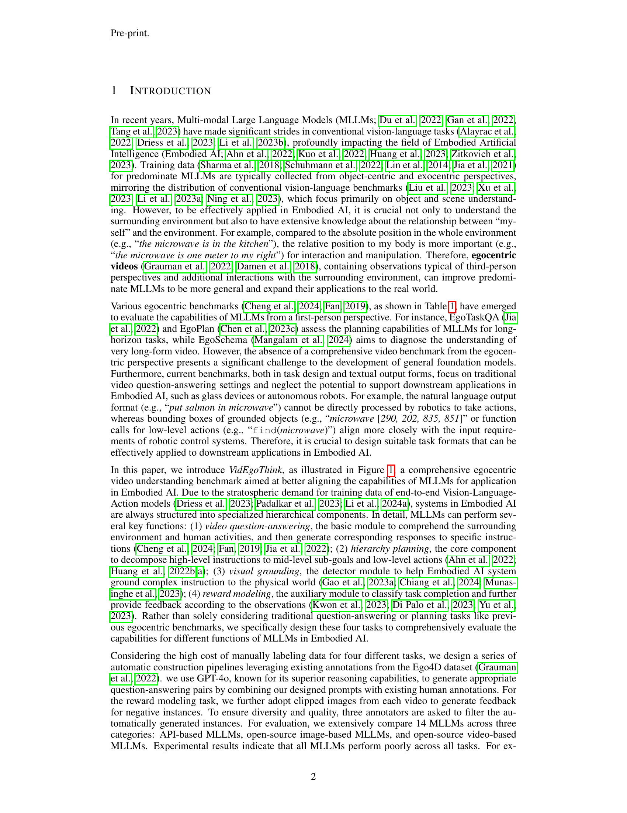

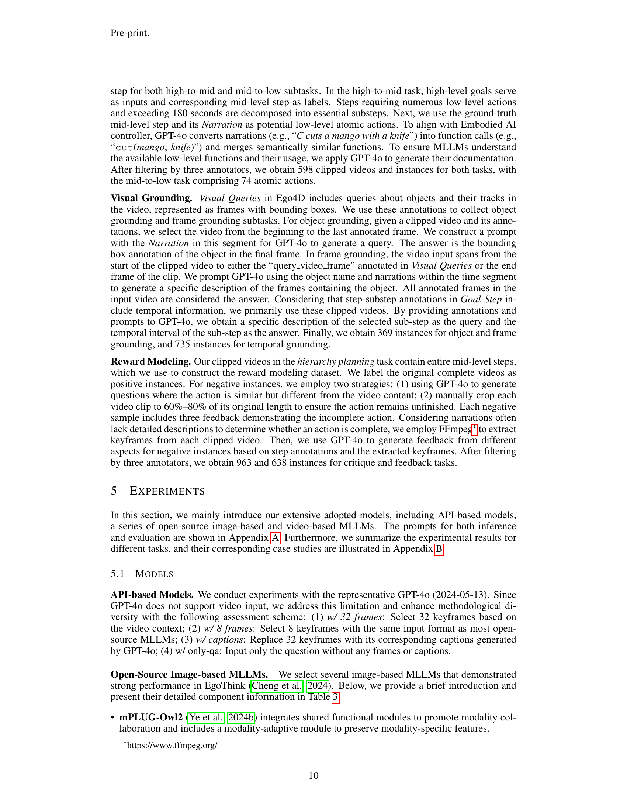

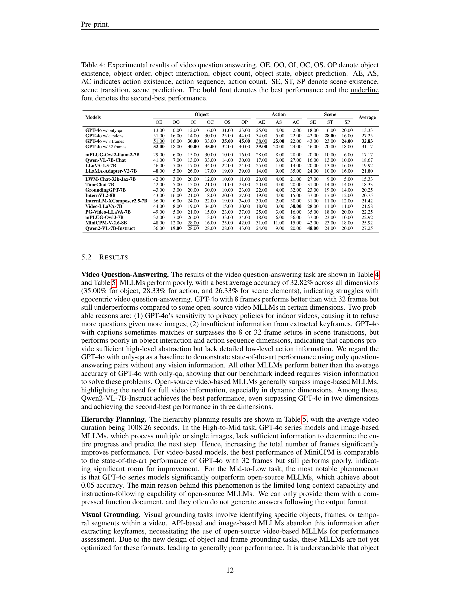
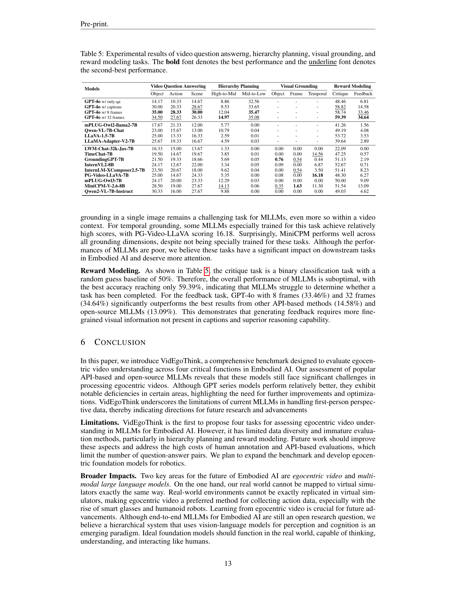
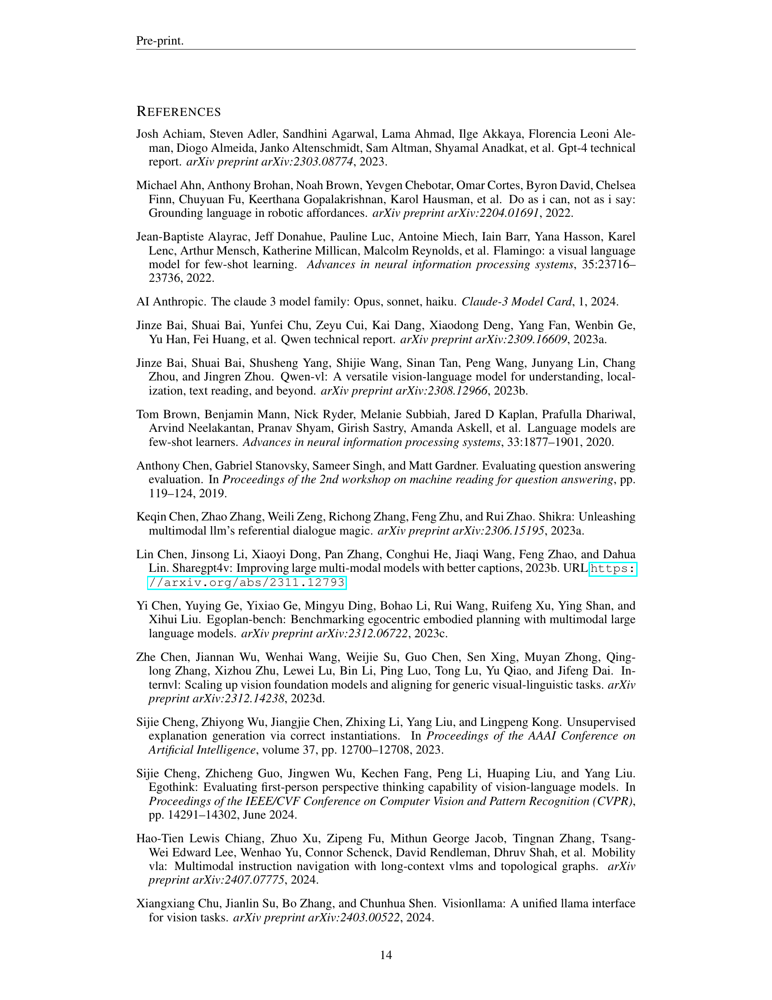
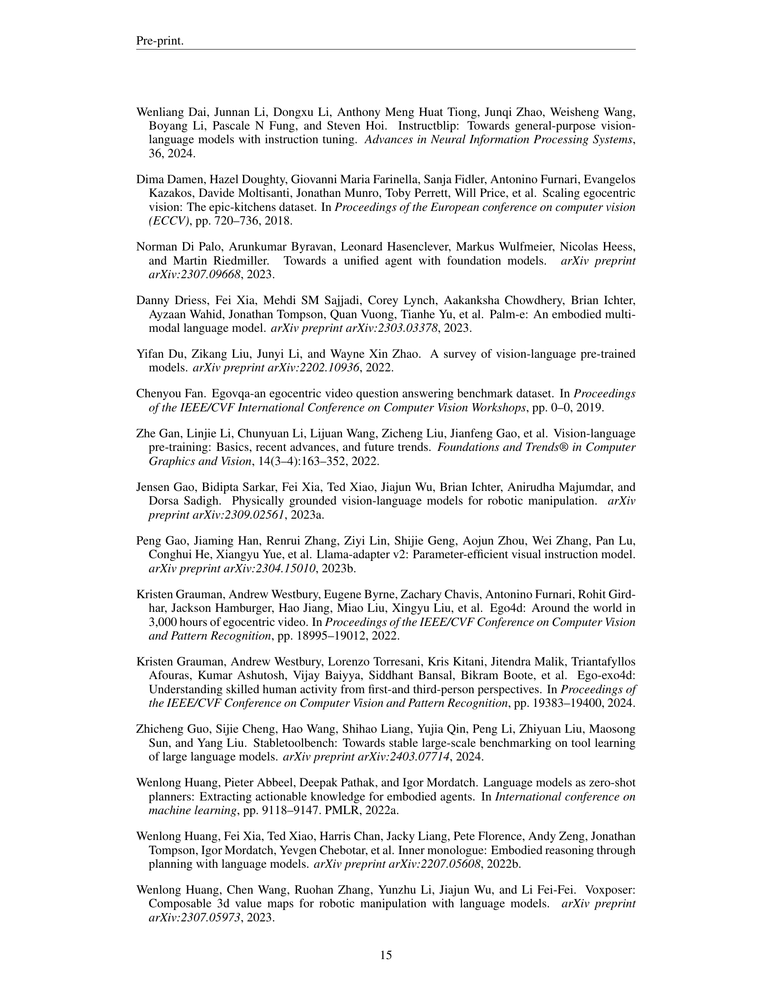

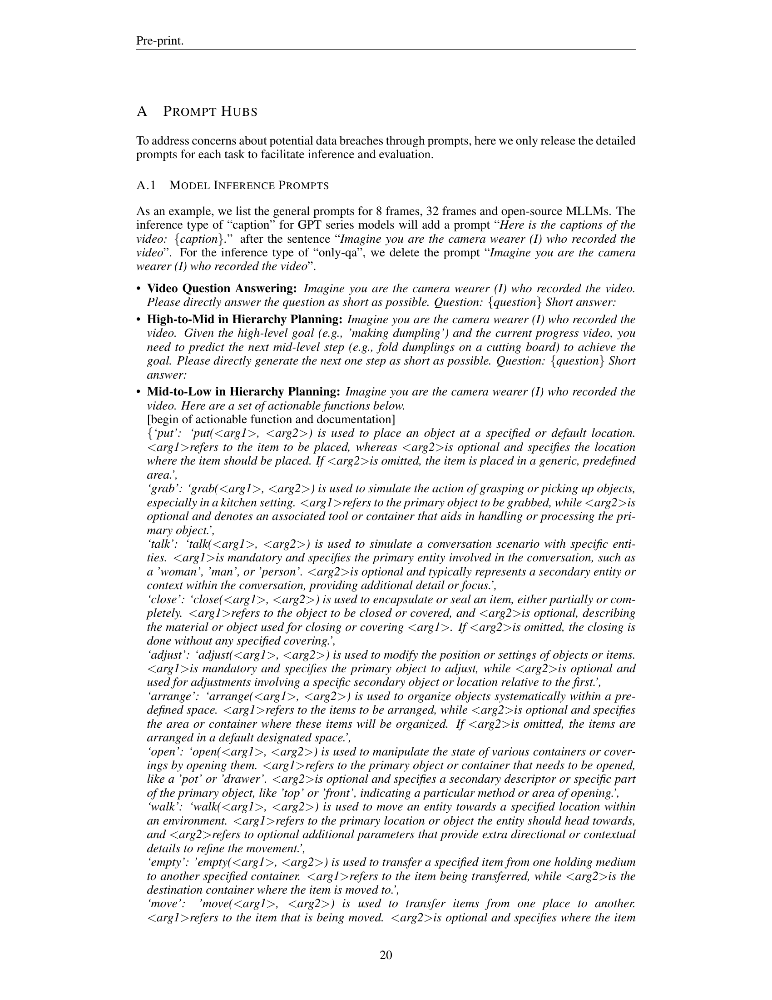

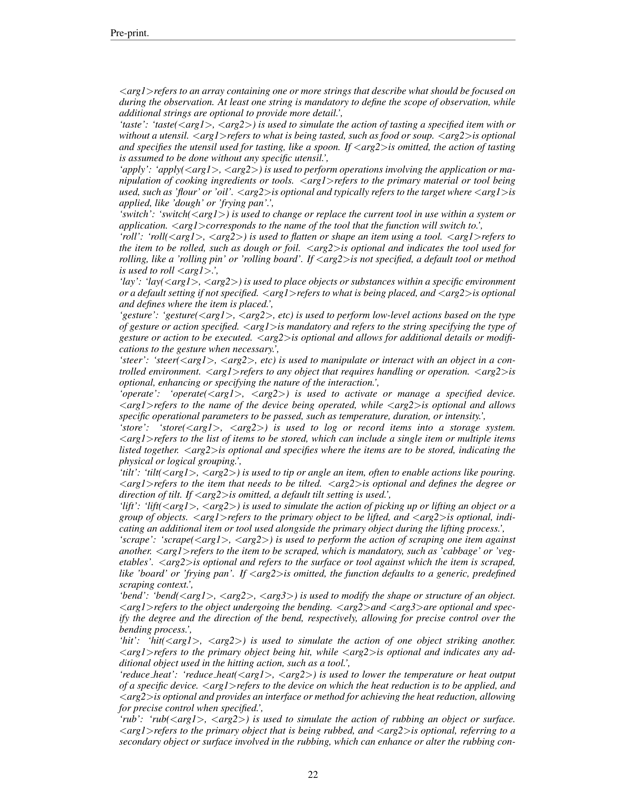

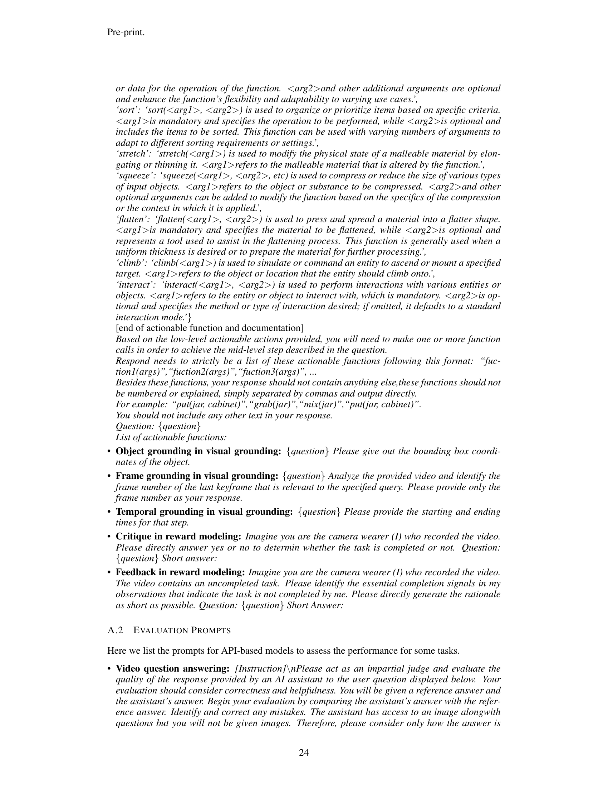

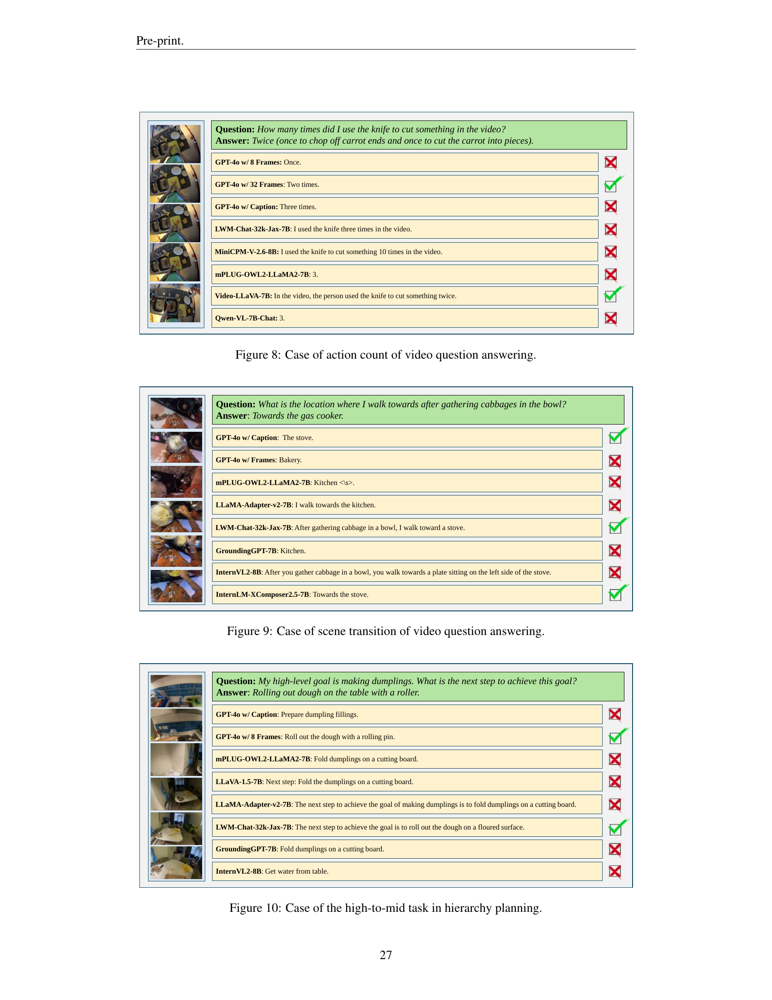

