### TL;DR



This research introduces Mixture-of-Head Attention (MoH), a new architecture designed to improve the efficiency of Transformer models. The core idea is that not all attention heads in a standard multi-head attention mechanism are equally important.  MoH treats attention heads as "experts" and allows each token to select the most appropriate heads dynamically, instead of using all of them. This reduces computational load and improves inference speed without sacrificing accuracy or increasing the number of parameters.  The researchers demonstrate MoH's effectiveness through extensive experiments on various model architectures, including vision transformers (ViT), diffusion transformers (DiT), and large language models (LLMs). They show that MoH outperforms standard multi-head attention while using significantly fewer heads, and it can also be effectively fine-tuned with pre-trained models. This innovative approach offers a potential solution to the computational challenges associated with large-scale AI model development.




 &nbsp; read the paper on arXiv

  

 &nbsp; on Hugging Face


#### Why does it matter?
This paper is significant because it offers a novel approach to enhance the efficiency of Transformer models without sacrificing accuracy.  Its Mixture-of-Head Attention (MoH) mechanism has the potential to revolutionize large-scale model development by dynamically selecting the most relevant attention heads, thereby reducing computational costs and improving inference speeds. The findings are highly relevant to the current focus on efficient and scalable AI, opening up new avenues for research in model optimization and architecture design.
#### Key Takeaways


 Mixture-of-Head Attention (MoH) improves Transformer efficiency without sacrificing accuracy. 



 MoH allows each token to select only the most relevant attention heads, reducing computation. 



 Pre-trained models can be effectively fine-tuned using MoH, enhancing applicability. 


------
#### Visual Insights

> 🔼 Figure 1 is a high-level comparison of the standard multi-head attention and the proposed Mixture-of-Head Attention (MoH) architecture, showing that MoH does not increase the number of attention heads but rather uses a weighted summation of selected attention heads, thus improving efficiency.
> 

> 
read the caption

> Figure 1: A high-level comparison between the multi-head attention and our proposed mixture-of-head attention. Subfigure (a) illustrates a standard multi-head attention layer with h attention heads, while subfigure (b) demonstrates the Mixture-of-Head attention (MoH) architecture. It is important to note that MoH does not increase the number of attention heads, ensuring that the total parameter for MoH is comparable to that of the multi-head attention.
> 

> 🔼 The chart displays the performance evolution of the MoH model during continue-tuning, showing a quick recovery to near-original performance and gradual improvement with increased training tokens.
> 

> 
read the caption

> Figure 2: Performance evolution during continue-tuning. The MoH model quickly recovers to over 95% of the performance of the original model within a training budget of 10B tokens. Then, the performance gradually improves with the increase of the training tokens.
> 


<table id='2' style='font-size:14px'><tr><td rowspan="2">Methods</td><td colspan="3">#Params #Activated Acc</td><td rowspan="2">Methods</td><td colspan="3">#Params #Activated Acc</td></tr><tr><td>(M)</td><td>Heads (%)</td><td>(%)</td><td>(M)</td><td>Heads (%)</td><td>(%)</td></tr><tr><td>DeiT-S (Touvron et al., 2021)</td><td>22</td><td>100</td><td>79.8</td><td>DeiT-B (Touvron et al., 2021)</td><td>86</td><td>100</td><td>81.8</td></tr><tr><td>T2T-ViT-19 (Yuan et al., 2021)</td><td>39</td><td>100</td><td>81.9</td><td>T2T- ViT-24 (Yuan et al., 2021)</td><td>64</td><td>100</td><td>82.3</td></tr><tr><td>Swin-S (Liu et al., 2021)</td><td>50</td><td>100</td><td>83.1</td><td>Swin-B (Liu et al., 2021)</td><td>88</td><td>100</td><td>83.5</td></tr><tr><td>PVTv2-B3 (Wang et al., 2022)</td><td>45</td><td>100</td><td>83.2</td><td>PVTv2-B5 (Wang et al., 2022)</td><td>82</td><td>100</td><td>83.8</td></tr><tr><td>CoAtNet-1 (Dai et al., 2021)</td><td>42</td><td>100</td><td>83.3</td><td>Focal-B (Yang et al., 2021)</td><td>90</td><td>100</td><td>83.8</td></tr><tr><td>Focal-S (Yang et al., 2021)</td><td>51</td><td>100</td><td>83.5</td><td>FocalNet-B (Yang et al., 2022b)</td><td>89</td><td>100</td><td>83.9</td></tr><tr><td>FocalNet-S (Yang et al., 2022b)</td><td>50</td><td>100</td><td>83.5</td><td>CoAtNet-2 (Dai et al., 2021)</td><td>75</td><td>100</td><td>84.1</td></tr><tr><td>MViTv2-S (Li et al⌀, 2022)</td><td>35</td><td>100</td><td>83.6</td><td>MViTv2-B (Li et al., 2022)</td><td>52</td><td>100</td><td>84.4</td></tr><tr><td>UniFormer-B (Li et al⌀, 2023b)</td><td>50</td><td>100</td><td>83.9</td><td>MOAT-2 (Yang et al., 2022a)</td><td>73</td><td>100</td><td>84.7</td></tr><tr><td>CAFormer-S36 (Yu et al., 2023)</td><td>39</td><td>100</td><td>84.5</td><td>iFormer-L (Si et al., 2022)</td><td>87</td><td>100</td><td>84.8</td></tr><tr><td>TransNeXt-S (Shi, 2024)</td><td>50</td><td>100</td><td>84.7</td><td>TransNeXt-B (Shi, 2024)</td><td>90</td><td>100</td><td>84.8</td></tr><tr><td>MoH-ViT-S</td><td>50</td><td>80</td><td>84.7</td><td>MoH- ViT-B</td><td>90</td><td>75</td><td>84.9</td></tr><tr><td>MoH-ViT-S</td><td>50</td><td>75</td><td>84.6</td><td>MoH- ViT-B</td><td>90</td><td>50</td><td>84.7</td></tr></table>

> 🔼 Table 1 compares the performance of MoH-ViT models against other state-of-the-art models on the ImageNet-1K classification benchmark, highlighting the impact of reducing the number of activated attention heads.
> 

> 
read the caption

> Table 1: Comparisons to current state-of-the-art methods on ImageNet-1K classification. All models are trained exclusively on the ImageNet-1K training set. Our MoH-ViT models, based on TransNeXt (Shi, 2024), are trained for 300 epochs using a resolution of 224x224. To ensure a fair comparison, we only replace the standard multi-head attention with our Mixture-of-Head attention (MoH), keeping all other training parameters identical to TransNeXt.
> 

### More visual insights

More on charts

> 🔼 The chart displays the performance evolution of the MoH model during continue-tuning, showing a quick recovery to nearly the original model's performance and gradual improvement with increased training tokens.
> 

> 
read the caption

> Figure 2: Performance evolution during continue-tuning. The MoH model quickly recovers to over 95% of the performance of the original model within a training budget of 10B tokens. Then, the performance gradually improves with the increase of the training tokens.
> 

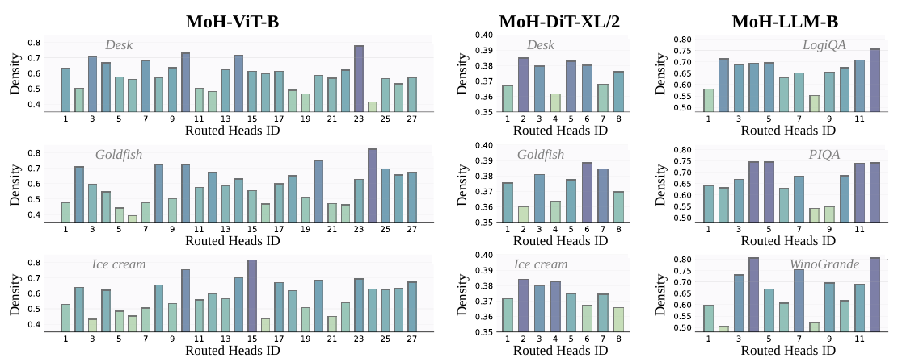

> 🔼 The chart visualizes the head load distribution in the final Mixture-of-Head Attention (MoH) layer for Vision Transformers (ViT), Diffusion models with Transformers (DiT), and Large Language Models (LLMs).
> 

> 
read the caption

> Figure 3: Visualization of the head load distribution in the final MoH layer. For ViT and DiT, we present the head load distributions for the categories “Desk”, “Goldfish
> 

> 🔼 The chart visualizes the head load distribution in the final MoH layer for ViT, DiT, and LLM models, showing how different heads focus on different categories and tasks.
> 

> 
read the caption

> Figure 3: Visualization of the head load distribution in the final MoH layer. For ViT and DiT, we present the head load distributions for the categories “Desk”, “Goldfish
> 

> 🔼 The chart visualizes the distribution of head load across different categories and tasks in the final layer of the Mixture-of-Head attention model.
> 

> 
read the caption

> Figure 3: Visualization of the head load distribution in the final MoH layer. For ViT and DiT, we present the head load distributions for the categories “Desk”, “Goldfish”, and “Ice cream”. For LLM, we display the head distributions for the tasks “LogiQA”, “PIQA”, and “WinoGrande”. MoH-ViT-B, MoH-DiT-XL/2, and MoH-LLM-B activate 75%, 90%, and 75% of the attention heads, respectively.
> 

> 🔼 The chart visualizes the head load distribution in the final MoH layer for ViT, DiT, and LLMs across different categories and tasks.
> 

> 
read the caption

> Figure 3: Visualization of the head load distribution in the final MoH layer. For ViT and DiT, we present the head distributions for the categories “Desk”, “Goldfish
> 

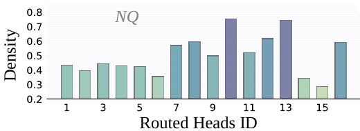

> 🔼 The chart visualizes the distribution of head load across different categories and tasks in the final MoH layer for ViT, DiT, and LLM models.
> 

> 
read the caption

> Figure 3: Visualization of the head load distribution in the final MoH layer. For ViT and DiT, we present the head load distributions for the categories “Desk”, “Goldfish”, and “Ice cream”. For LLM, we display the head distributions for the tasks “LogiQA”, “PIQA”, and “WinoGrande”. MoH-ViT-B, MoH-DiT-XL/2, and MoH-LLM-B activate 75%, 90%, and 75% of the attention heads, respectively.
> 

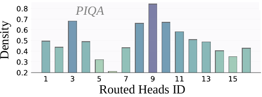

> 🔼 The chart visualizes the distribution of attention head load across different categories/tasks in the final MoH layer for ViT, DiT, and LLM models.
> 

> 
read the caption

> Figure 3: Visualization of the head load distribution in the final MoH layer. For ViT and DiT, we present the head distributions for the categories “Desk”, “Goldfish”, and “Ice cream”. For LLM, we display the head distributions for the tasks “LogiQA”, “PIQA”, and “WinoGrande”. MoH-ViT-B, MoH-DiT-XL/2, and MoH-LLM-B activate 75%, 90%, and 75% of the attention heads, respectively.
> 

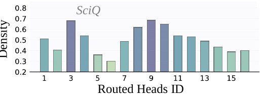

> 🔼 The chart visualizes the distribution of head load across different categories or tasks for three model types (ViT, DiT, and LLM) using the Mixture-of-Head attention method.
> 

> 
read the caption

> Figure 3: Visualization of the head load distribution in the final MoH layer. For ViT and DiT, we present the head distributions for the categories “Desk”, “Goldfish”, and “Ice cream”. For LLM, we display the head distributions for the tasks “LogiQA”, “PIQA”, and “WinoGrande”. MoH-ViT-B, MoH-DiT-XL/2, and MoH-LLM-B activate 75%, 90%, and 75% of the attention heads, respectively.
> 

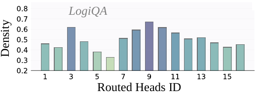

> 🔼 The chart visualizes the distribution of attention head load in the final layer of Mixture-of-Head Attention (MoH) models for different tasks and model architectures.
> 

> 
read the caption

> Figure 3: Visualization of the head load distribution in the final MoH layer. For ViT and DiT, we present the head load distributions for the categories “Desk”, “Goldfish”, and “Ice cream”. For LLM, we display the head distributions for the tasks “LogiQA”, “PIQA”, and “WinoGrande”. MoH-ViT-B, MoH-DiT-XL/2, and MoH-LLM-B activate 75%, 90%, and 75% of the attention heads, respectively.
> 

> 🔼 The chart visualizes the distribution of attention head load in the final MoH layer for various tasks and model types.
> 

> 
read the caption

> Figure 3: Visualization of the head load distribution in the final MoH layer. For ViT and DiT, we present the head load distributions for the categories “Desk”, “Goldfish”, and “Ice cream”. For LLM, we display the head distributions for the tasks “LogiQA”, “PIQA”, and “WinoGrande”. MoH-ViT-B, MoH-DiT-XL/2, and MoH-LLM-B activate 75%, 90%, and 75% of the attention heads, respectively.
> 

More on tables


<table id='2' style='font-size:14px'><tr><td>Methods</td><td>#Params (M)</td><td>#Activated Heads (%)</td><td>FID↓</td><td>sFID↓</td><td>IS↑</td><td>Precision↑</td><td>Recall↑</td></tr><tr><td>DiT-S/2 400K (Peebles & Xie, 2023)</td><td>33</td><td>100</td><td>68.40</td><td>-</td><td>-</td><td>-</td><td>-</td></tr><tr><td>MoH-DiT-S/2 400K</td><td>33</td><td>90</td><td>67.25</td><td>12.15</td><td>20.52</td><td>0.37</td><td>0.58</td></tr><tr><td>MoH-DiT-S/2 400K</td><td>33</td><td>75</td><td>69.42</td><td>12.85</td><td>19.96</td><td>0.36</td><td>0.55</td></tr><tr><td>DiT-B/2 400K (Peebles & Xie, 2023)</td><td>130</td><td>100</td><td>43.47</td><td>-</td><td>-</td><td>-</td><td>-</td></tr><tr><td>MoH-DiT-B/2 400K</td><td>131</td><td>90</td><td>43.40</td><td>8.40</td><td>33.51</td><td>0.49</td><td>0.63</td></tr><tr><td>MoH-DiT-B/2 400K</td><td>131</td><td>75</td><td>43.61</td><td>8.48</td><td>33.43</td><td>0.49</td><td>0.62</td></tr><tr><td>DiT-L/2 400K (Peebles & Xie, 2023)</td><td>458</td><td>100</td><td>23.33</td><td>-</td><td>-</td><td>-</td><td>-</td></tr><tr><td>MoH-DiT-L/2 400K</td><td>459</td><td>90</td><td>23.17</td><td>6.16</td><td>58.92</td><td>0.61</td><td>0.63</td></tr><tr><td>MoH-DiT-L/2 400K</td><td>459</td><td>75</td><td>24.29</td><td>6.38</td><td>57.75</td><td>0.60</td><td>0.63</td></tr></table>
> 🔼 {{ table.description }}
> 

> 
read the caption

> {{ table.caption }}
> 

> Table 2 presents a comparison of the proposed Mixture-of-Head Attention (MoH) method against the baseline DiT models on the task of class-conditional image generation, showing that MoH achieves comparable or better performance with fewer activated heads.


<table id='4' style='font-size:14px'><tr><td>Methods</td><td>#Activated Heads (%)</td><td>FID↓</td><td>sFID↓</td><td>IS↑</td><td>Precision↑</td><td>Recall↑</td></tr><tr><td>ADM-G, ADM-U (Dhariwal & Nichol, 2021)</td><td>-</td><td>3.94</td><td>6.14</td><td>215.84</td><td>0.83</td><td>0.53</td></tr><tr><td>CDM (Ho et al., 2022)</td><td>-</td><td>4.88</td><td>-</td><td>158.71</td><td>-</td><td>-</td></tr><tr><td>LDM-8 (Rombach et al., 2022)</td><td>-</td><td>15.51</td><td>-</td><td>79.03</td><td>0.65</td><td>0.63</td></tr><tr><td>LDM-4 (Rombach et al., 2022)</td><td>-</td><td>10.56</td><td>-</td><td>103.49</td><td>0.71</td><td>0.62</td></tr><tr><td>LDM-4-G (cfg=1.25)</td><td>-</td><td>3.95</td><td>-</td><td>178.22</td><td>0.81</td><td>0.55</td></tr><tr><td>DiT-XL/2 7,000K (Peebles & Xie, 2023)</td><td>100</td><td>9.62</td><td>6.85</td><td>121.50</td><td>0.67</td><td>0.67</td></tr><tr><td>DiT-XL/2 7,000K (cfg=1.25)</td><td>100</td><td>3.22</td><td>5.28</td><td>201.77</td><td>0.76</td><td>0.62</td></tr><tr><td>MoH-DiT-XL/2 2,000K</td><td>75</td><td>10.95</td><td>6.19</td><td>106.69</td><td>0.67</td><td>0.66</td></tr><tr><td>MoH-DiT-XL/2 2,000K</td><td>90</td><td>10.67</td><td>6.15</td><td>107.80</td><td>0.67</td><td>0.65</td></tr><tr><td>MoH-DiT-XL/2 7,000K</td><td>90</td><td>8.56</td><td>6.61</td><td>129.54</td><td>0.68</td><td>0.67</td></tr><tr><td>MoH-DiT-XL/2 7,000K (cfg=1.25)</td><td>90</td><td>2.94</td><td>5.17</td><td>207.25</td><td>0.77</td><td>0.63</td></tr></table>
> 🔼 {{ table.description }}
> 

> 
read the caption

> {{ table.caption }}
> 

> Table 1 compares the performance of MoH-ViT models against other state-of-the-art methods on the ImageNet-1K image classification benchmark, highlighting the impact of using a reduced number of attention heads.


 <table id='2' style='font-size:14px'><tr><td rowspan="2">Methods</td><td rowspan="2">#Activated Heads (%)</td><td colspan="7">Language Tasks</td><td rowspan="2">Avg.</td></tr><tr><td>SciQ</td><td></td><td>PIQA</td><td>WinoGrande</td><td>OpenbookQA</td><td>LogiQA</td><td>TruthfulQA</td></tr><tr><td>LLM-S 100B</td><td>100</td><td></td><td>63.0</td><td>63.1</td><td>51.1</td><td>27.4</td><td>26.9</td><td>31.6</td><td>43.9</td></tr><tr><td>MoH-LLM-S</td><td>100B</td><td>75</td><td>64.7</td><td>62.0</td><td>50.6</td><td>28.8</td><td>26.4</td><td>35.2</td><td>44.6</td></tr><tr><td>M⌀H-LLM-S</td><td>100B</td><td>50</td><td>67.0</td><td>62.2</td><td>51.5</td><td>29.2</td><td>26.7</td><td>35.6</td><td>45.4</td></tr><tr><td>LLM-B 100B</td><td></td><td>100</td><td>73.1</td><td>69.7</td><td>52.0</td><td>31.8</td><td>28.4</td><td>29.5</td><td>47.4</td></tr><tr><td>MoH-LLM-B</td><td>100B</td><td>75</td><td>74.7</td><td>69.2</td><td>52.8</td><td>30.0</td><td>28.1</td><td>32.2</td><td>47.8</td></tr><tr><td>MoH-LLM-B</td><td>100B</td><td>50</td><td>75.2</td><td>67.0</td><td>52.0</td><td>29.0</td><td>26.9</td><td>32.8</td><td>47.2</td></tr><tr><td>LLM-B 200B</td><td></td><td>100</td><td>73.1</td><td>70.3</td><td>53.3</td><td>32.4</td><td>29.0</td><td>29.5</td><td>47.9</td></tr><tr><td>MoH-LLM-B</td><td>200B</td><td>75</td><td>76.0</td><td>69.2</td><td>52.7</td><td>30.4</td><td>29.8</td><td>32.6</td><td>48.5</td></tr><tr><td>MoH-LLM-B</td><td>200B</td><td>50</td><td>75.6</td><td>66.9</td><td>53.5</td><td>29.4</td><td>26.7</td><td>32.7</td><td>47.5</td></tr></table>
> 🔼 {{ table.description }}
> 

> 
read the caption

> {{ table.caption }}
> 

> Table 4 compares the performance of Mixture-of-Head Language Models (MoH-LLMs) against vanilla LLMs across various language tasks, showing the impact of reducing the number of activated attention heads.


 <table id='2' style='font-size:14px'><tr><td>Methods</td><td>#Activated Heads (%)</td><td>MMLU (5)</td><td>CEVAL (5)</td><td>CMMLU (5)</td><td>GSM8K(8)</td><td>TruthfulQA</td></tr><tr><td>LLaMA3-8B (Dubey et al., 2024)</td><td>100</td><td>65.2</td><td>52.3</td><td>50.7</td><td>49.5</td><td>35.4</td></tr><tr><td>MoH-LLaMA3-8B</td><td>75</td><td>65.8</td><td>61.5</td><td>64.4</td><td>56.9</td><td>44.0</td></tr><tr><td>Methods</td><td>#Activated Heads (%)</td><td>HellaSwag (10)</td><td>LogiQA</td><td>BoolQ (32)</td><td>LAMBADA</td><td>SciQ</td></tr><tr><td>LLaMA3-8B (Dubey et al., 2024)</td><td>100</td><td>81.9</td><td>30.0</td><td>83.9</td><td>75.5</td><td>94.0</td></tr><tr><td>MoH-LLaMA3-8B</td><td>75</td><td>80.1</td><td>30.3</td><td>84.0</td><td>76.4</td><td>92.2</td></tr><tr><td>Methods</td><td>#Activated Heads (%)</td><td>PIQA</td><td>WinoGrande</td><td>NQ (32)</td><td>ARC-C (25)</td><td>Average</td></tr><tr><td>LLaMA3-8B (Dubey et al., 2024)</td><td>100</td><td>81.0</td><td>72.5</td><td>31.5</td><td>59.0</td><td>61.6</td></tr><tr><td>MoH-LLaMA3-8B</td><td>75</td><td>78.8</td><td>72.9</td><td>28.3</td><td>60.1</td><td>64.0</td></tr></table>
> 🔼 {{ table.description }}
> 

> 
read the caption

> {{ table.caption }}
> 

> Table 5 presents the comparative results of MoH-LLaMA3-8B and LLaMA3-8B across multiple benchmarks, showing the performance gains achieved by MoH-LLaMA3-8B while utilizing only 75% of attention heads.


 <table id='2' style='font-size:18px'><tr><td rowspan="2">Shared Heads</td><td rowspan="2">Two-Stage Routing</td><td>Image Classification</td><td colspan="5">Class-Conditional Image Generation</td></tr><tr><td>Acc (%)↑</td><td>FID↓</td><td>sFID↓</td><td>IS↑</td><td>Precision↑</td><td>Recall↑</td></tr><tr><td></td><td></td><td>75.6</td><td>71.97</td><td>13.58</td><td>19.06</td><td>0.35</td><td>0.55</td></tr><tr><td>V</td><td></td><td>78.3</td><td>69.54</td><td>12.80</td><td>19.67</td><td>0.36</td><td>0.55</td></tr><tr><td>V</td><td></td><td>78.6</td><td>69.42</td><td>12.85</td><td>19.96</td><td>0.36</td><td>0.55</td></tr></table>
> 🔼 {{ table.description }}
> 

> 
read the caption

> {{ table.caption }}
> 

> Table 6 shows the ablation study of the proposed MoH model on image classification and class-conditional image generation by varying the usage of shared heads and two-stage routing.


 <table id='4' style='font-size:16px'><tr><td>Ratio of Shared Heads</td><td>13.9%</td><td>27.6%</td><td>31.3%</td><td>35.9%</td><td>37.5%</td><td>40.5%</td><td>46.8%</td><td>60.4%</td><td>74.0%</td></tr><tr><td>Accuracy (%)</td><td>78.6</td><td>78.5</td><td>78.4</td><td>78.4</td><td>78.5</td><td>78.6</td><td>78.4</td><td>78.6</td><td>78.4</td></tr></table>
> 🔼 {{ table.description }}
> 

> 
read the caption

> {{ table.caption }}
> 

> Table 7 shows the ablation study on the impact of different ratios of shared heads among activated heads on the accuracy of the MoH-ViT-S model.


<table id='1' style='font-size:16px'><tr><td>Ilya Loshchilov and Frank Hutter. Sgdr: Stochastic gradient descent with warm restarts. arXiv preprint arXiv:1608.03983, 2016.</td></tr><tr><td>Ilya Loshchilov and Frank Hutter. Decoupled weight decay regularization. arXiv preprint arXiv:1711.05101, 2017.</td></tr><tr><td>Paul Michel, Omer Levy, and Graham Neubig. Are sixteen heads really better than one? In NeurIPS, pp. 14014-14024, 2019.</td></tr><tr><td>Todor Mihaylov, Peter Clark, Tushar Khot, and Ashish Sabharwal. Can a suit of armor conduct electricity? a new dataset for open book question answering. In EMNLP, 2018.</td></tr><tr><td>Charlie Nash, Jacob Menick, Sander Dieleman, and Peter W Battaglia. Generating images with sparse representations. arXiv preprint arXiv:2103.03841, 2021.</td></tr><tr><td>OpenAI. Introducing chatgpt. CoRR, 2022. URL https : / / openai · com/blog/ chatgpt.</td></tr><tr><td>Long Ouyang, Jeffrey Wu, Xu Jiang, Diogo Almeida, Carroll Wainwright, Pamela Mishkin, Chong Zhang, Sandhini Agarwal, Katarina Slama, Alex Ray, et al. Training language models to follow instructions with human feedback. In NeurIPS, pp. 27730-27744, 2022.</td></tr><tr><td>Denis Paperno, German Kruszewski, Angeliki Lazaridou, Quan Ngoc Pham, Raffaella Bernardi, Sandro Pezzelle, Marco Baroni, Gemma Boleda, and Raquel Fernandez. The lambada dataset: Word prediction requiring a broad discourse context. In ACL, pp. 1525-1534, 2016.</td></tr><tr><td>William Peebles and Saining Xie. Scalable diffusion models with transformers. In ICCV, pp. 4195-4205, 2023.</td></tr><tr><td>Joan Puigcerver, Carlos Riquelme Ruiz, Basil Mustafa, and Neil Houlsby. From sparse to soft mixtures of experts. In ICLR, 2024.</td></tr><tr><td>Colin Raffel, Noam Shazeer, Adam Roberts, Katherine Lee, Sharan Narang, Michael Matena, Yanqi Zhou, Wei Li, and Peter J Liu. Exploring the limits of transfer learning with a unified text-to-text transformer. The Journal of Machine Learning Research, 21(1):5485-5551, 2020.</td></tr><tr><td>Samyam Rajbhandari, Conglong Li, Zhewei Yao, Minjia Zhang, Reza Yazdani Aminabadi, Am- mar Ahmad Awan, Jeff Rasley, and Yuxiong He. Deepspeed-moe: Advancing mixture-of-experts inference and training to power next-generation ai scale. In ICML, pp. 18332-18346, 2022.</td></tr><tr><td>Stephen Roller, Sainbayar Sukhbaatar, Jason Weston, et al. Hash layers for large sparse models. In NeurIPS, pp. 17555-17566, 2021.</td></tr><tr><td>Robin Rombach, Andreas Blattmann, Dominik Lorenz, Patrick Esser, and Bjorn Ommer. High- resolution image synthesis with latent diffusion models. In CVPR, pp. 10684-10695, 2022.</td></tr><tr><td>Keisuke Sakaguchi, Ronan Le Bras, Chandra Bhagavatula, and Yejin Choi. Winogrande: An adversarial winograd schema challenge at scale. Communications of the ACM, 64(9):99-106, 2021.</td></tr><tr><td>Tim Salimans, Ian Goodfellow, Wojciech Zaremba, Vicki Cheung, Alec Radford, and Xi Chen. Improved techniques for training gans. In NeurIPS, 2016.</td></tr><tr><td>Noam Shazeer, Azalia Mirhoseini, Krzysztof Maziarz, Andy Davis, Quoc Le, Geoffrey Hinton, and Jeff Dean. Outrageously large neural networks: The sparsely-gated mixture-of-experts layer. arXiv preprint arXiv:1701.06538, 2017.</td></tr><tr><td>Dai Shi. Transnext: Robust foveal visual perception for vision transformers. In CVPR, pp. 17773- 17783, 2024.</td></tr><tr><td>Mohammad Shoeybi, Mostofa Patwary, Raul Puri, Patrick LeGresley, Jared Casper, and Bryan Catan- zaro. Megatron-Im: Training multi-billion parameter language models using model parallelism. arXiv preprint arXiv:1909.08053, 2019.</td></tr><tr><td>Chenyang Si, Weihao Yu, Pan Zhou, Yichen Zhou, Xinchao Wang, and Shuicheng Yan. Inception</td></tr></table>
> 🔼 {{ table.description }}
> 

> 
read the caption

> {{ table.caption }}
> 

> Table 1 compares the performance of the proposed Mixture-of-Head Attention (MoH) models against various state-of-the-art methods on the ImageNet-1K classification benchmark.


<table id='16' style='font-size:14px'><tr><td>Methods</td><td>#Params</td><td>#Layers</td><td>#Hidden Size</td><td>#Intermediate Size</td><td>#Heads</td><td>#Head Dim</td></tr><tr><td>LLM-S MoH-LLM-S</td><td>186 186</td><td>12</td><td>768</td><td>2048</td><td>12</td><td>64</td></tr><tr><td>LLM-B MoH-LLM-B</td><td>881 882</td><td>24</td><td>1536</td><td>4096</td><td>16</td><td>96</td></tr></table>
> 🔼 {{ table.description }}
> 

> 
read the caption

> {{ table.caption }}
> 

> Table 1 compares the performance of the proposed Mixture-of-Head attention (MoH) model with other state-of-the-art methods on the ImageNet-1K image classification task.


<table id='4' style='font-size:16px'><tr><td></td><td>Sampling Ratio</td></tr><tr><td>Redpajama Books</td><td>4.24%</td></tr><tr><td>Redpajama Wikipedia</td><td>3.50%</td></tr><tr><td>Redpajama ArXiv</td><td>4.37%</td></tr><tr><td>Redpajama StackExchange</td><td>3.19%</td></tr><tr><td>Redpajama C4</td><td>10.94%</td></tr><tr><td>Dolma</td><td>61.28%</td></tr><tr><td>Pile</td><td>12.48%</td></tr></table>
> 🔼 {{ table.description }}
> 

> 
read the caption

> {{ table.caption }}
> 

> Table 1 compares the performance of MoH-ViT models against other state-of-the-art methods on ImageNet-1K classification, showing that MoH achieves competitive or superior performance while using fewer attention heads.


<table id='7' style='font-size:14px'><tr><td></td><td>MoH-LLM-S 100B (LLM-S 100B)</td><td>MoH-LLM-B 100B (LLM-B 100B)</td><td>MoH-LLM-B 200B (LLM-B 200B)</td></tr><tr><td>Training budget</td><td>100B</td><td>100B</td><td>200B</td></tr><tr><td>Maximum learning rate</td><td>3e-4</td><td>5e-4</td><td>5e-4</td></tr><tr><td>Final learning rate</td><td>3e-5</td><td>5e-5</td><td>5e-5</td></tr><tr><td>LR warmup init</td><td>1e-7</td><td>1e-7</td><td>1e-7</td></tr><tr><td>LR warmup iters</td><td>2000</td><td>500</td><td>500</td></tr><tr><td>Sequence length</td><td>2048</td><td>2048</td><td>2048</td></tr><tr><td>Batch size (tokens)</td><td>4M</td><td>4M</td><td>4M</td></tr><tr><td>B for Lb</td><td>0.01</td><td>0.01</td><td>0.01</td></tr><tr><td>Tensor parallel</td><td>1</td><td>1</td><td>1</td></tr><tr><td>Pipeline parallel</td><td>1</td><td>1</td><td>1</td></tr></table>
> 🔼 {{ table.description }}
> 

> 
read the caption

> {{ table.caption }}
> 

> Table 1 compares the performance of MoH-ViT models against other state-of-the-art models on ImageNet-1K classification, highlighting the impact of using a reduced number of attention heads.


<table id='3' style='font-size:14px'><tr><td></td><td>The First Stage</td><td>The Second Stage</td></tr><tr><td>Training budget</td><td>300B</td><td>100B</td></tr><tr><td>Maximum learning rate</td><td>6e-5</td><td>2e-5</td></tr><tr><td>Final learning rate</td><td>6e-6</td><td>1e-6</td></tr><tr><td>LR warmup iters</td><td>50</td><td>50</td></tr><tr><td>Sequence length</td><td>8192</td><td>8192</td></tr><tr><td>Batch size (tokens)</td><td>16M</td><td>16M</td></tr><tr><td>B for Lb</td><td>-</td><td>0.01</td></tr><tr><td>Tensor parallel</td><td>2</td><td>1</td></tr><tr><td>Pipeline parallel</td><td>1</td><td>8</td></tr></table>
> 🔼 {{ table.description }}
> 

> 
read the caption

> {{ table.caption }}
> 

> Table 1 compares the performance of MoH-ViT models against other state-of-the-art models on the ImageNet-1K classification benchmark, highlighting MoH's efficiency in achieving competitive accuracy with fewer activated heads.


<table id='5' style='font-size:16px'><tr><td>Methods</td><td>#Activated Heads (%)</td><td>MMLU (5)</td><td>CMMLU (5)</td><td>NQ (32)</td><td>GSM8K(8)</td><td>TruthfulQA</td></tr><tr><td>LLaMA3-8B-stage1</td><td>100</td><td>66.2</td><td>66.0</td><td>28.1</td><td>58.6</td><td>41.9</td></tr><tr><td>MoH-LLaMA3-8B</td><td>75</td><td>65.8</td><td>64.4</td><td>28.3</td><td>56.9</td><td>44.0</td></tr><tr><td>Methods</td><td>#Activated Heads (%)</td><td>HellaSwag (10)</td><td>LogiQA</td><td>BoolQ (32)</td><td>LAMBADA</td><td>SciQ</td></tr><tr><td>LLaMA3-8B-stage1</td><td>100</td><td>79.4</td><td>30.4</td><td>85.1</td><td>75.8</td><td>92.2</td></tr><tr><td>MoH-LLaMA3-8B</td><td>75</td><td>80.1</td><td>30.3</td><td>84.0</td><td>76.4</td><td>92.2</td></tr><tr><td>Methods</td><td>#Activated Heads (%)</td><td>PIQA</td><td>WinoGrande</td><td>ARC-E</td><td>ARC-C (25)</td><td>Average</td></tr><tr><td>LLaMA3-8B-stage1</td><td>100</td><td>79.1</td><td>73.0</td><td>70.9</td><td>59.6</td><td>64.7</td></tr><tr><td>MoH-LLaMA3-8B</td><td>75</td><td>78.8</td><td>72.9</td><td>72.5</td><td>60.1</td><td>64.8</td></tr></table>
> 🔼 {{ table.description }}
> 

> 
read the caption

> {{ table.caption }}
> 

> Table 5 compares the performance of MoH-LLaMA3-8B and LLaMA3-8B across various language tasks, showing that MoH-LLaMA3-8B outperforms LLaMA3-8B with only 75% of the attention heads activated.

### Full paper


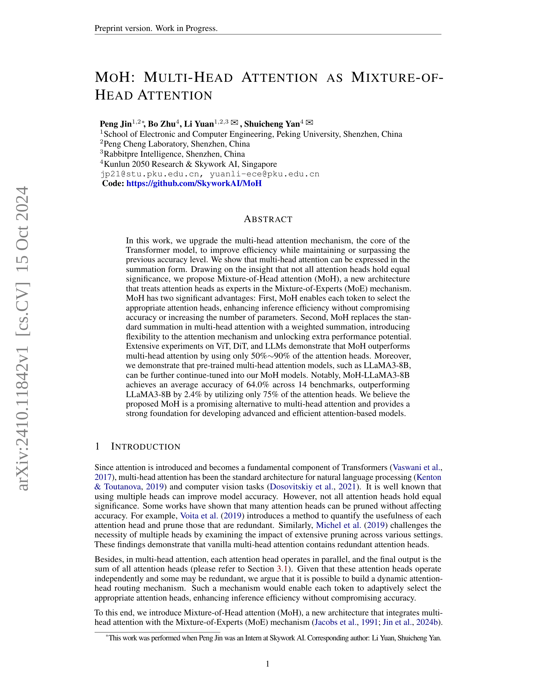
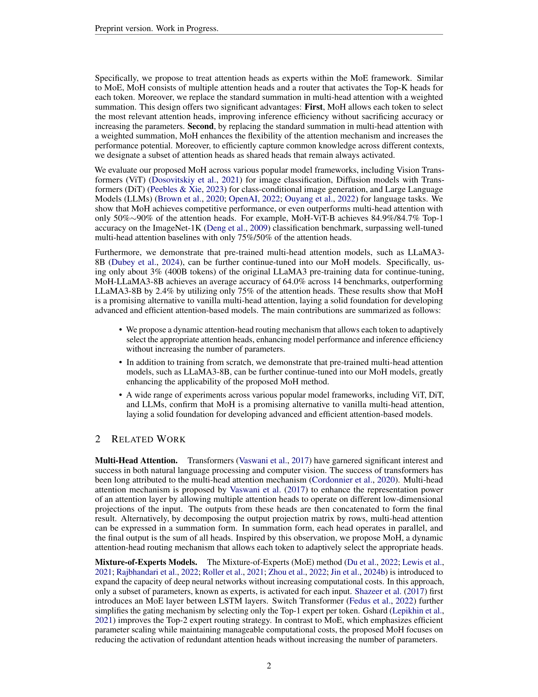
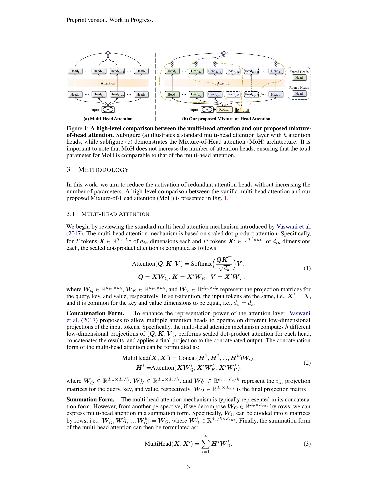

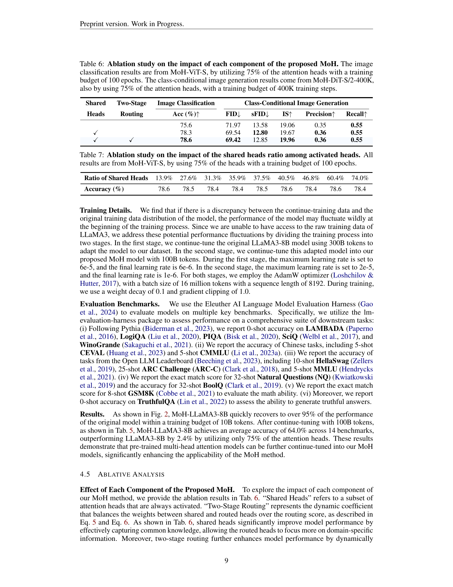
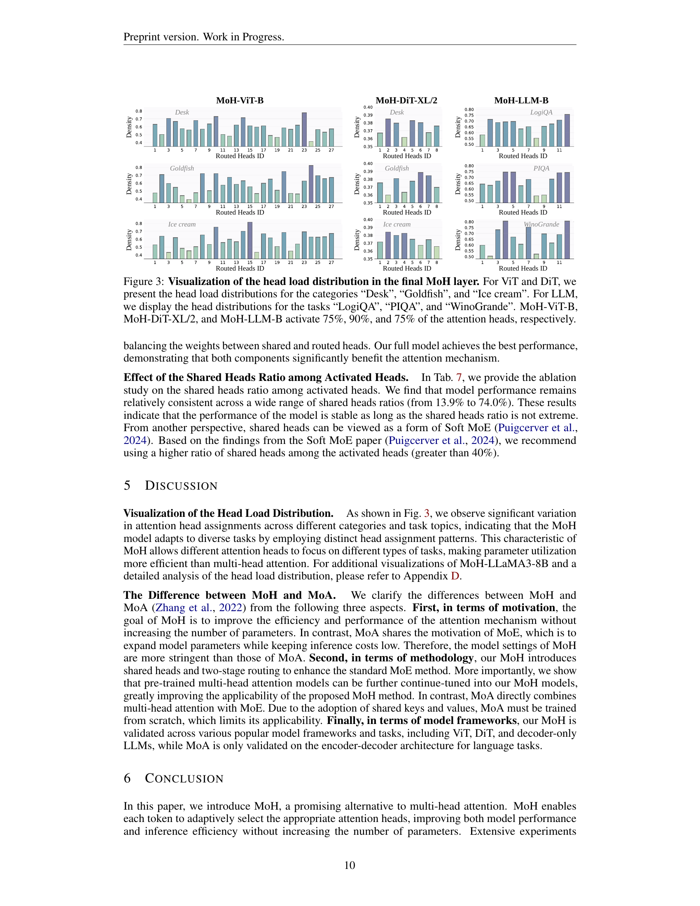

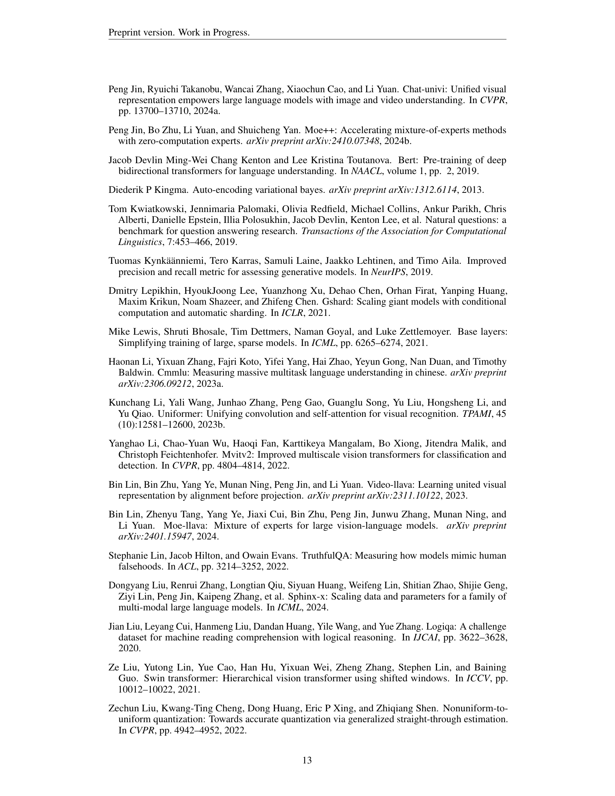

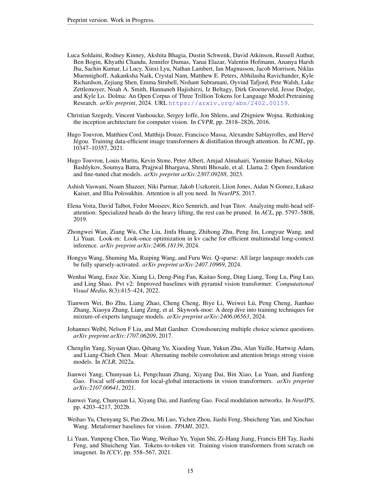
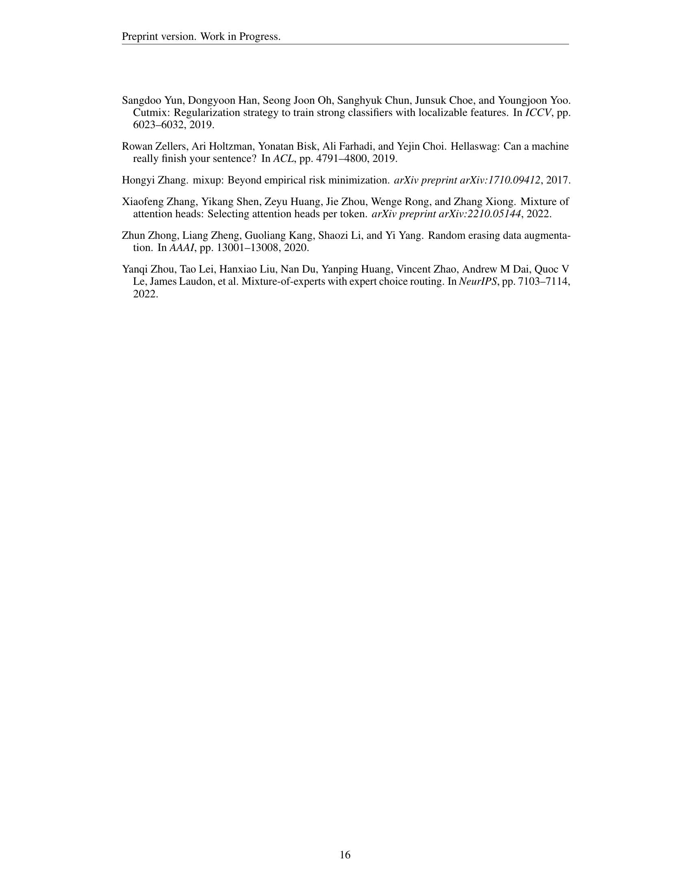
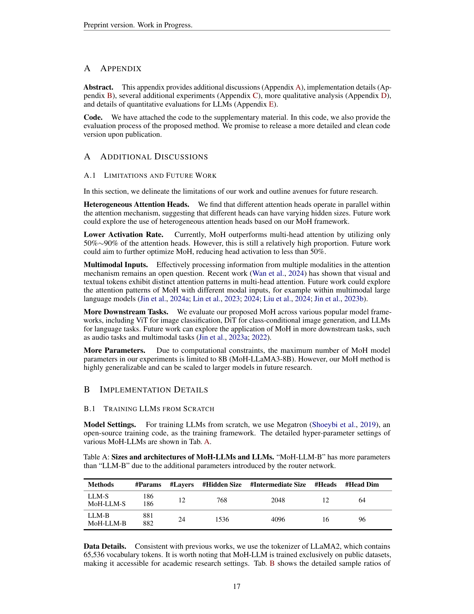
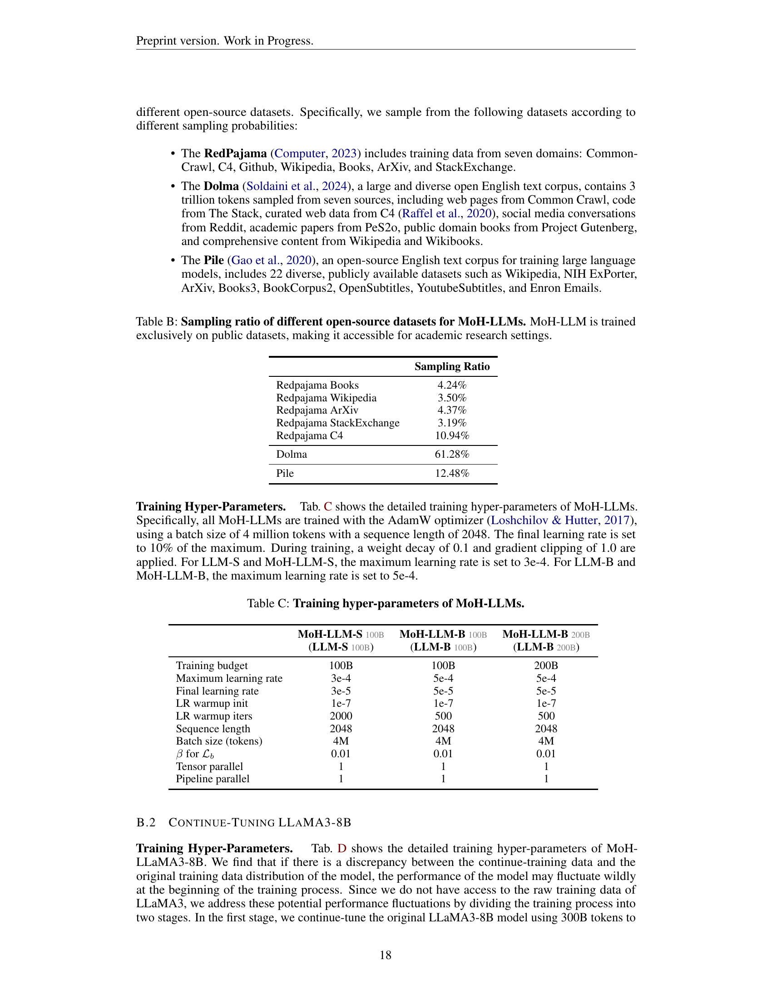
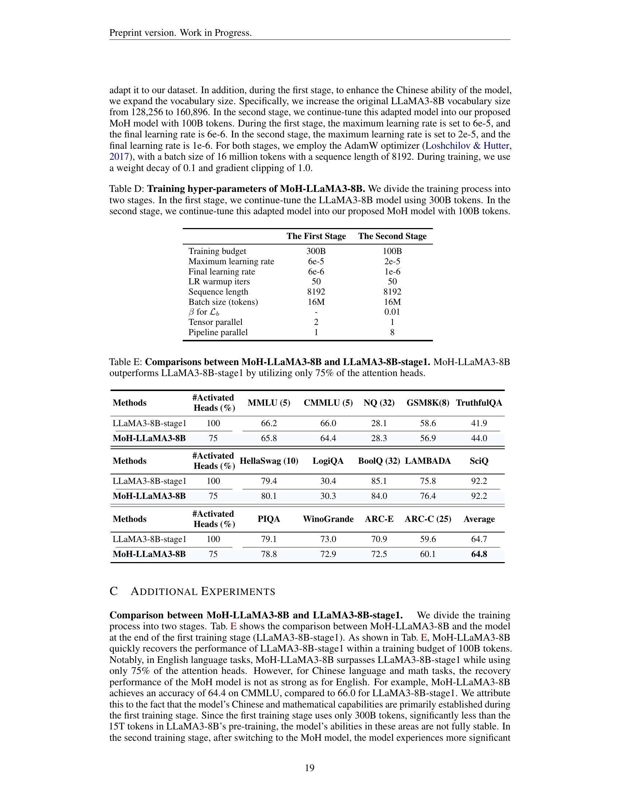

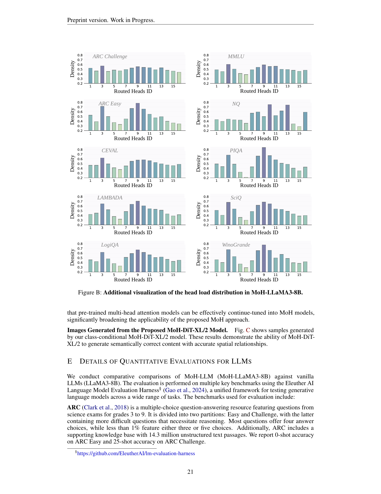

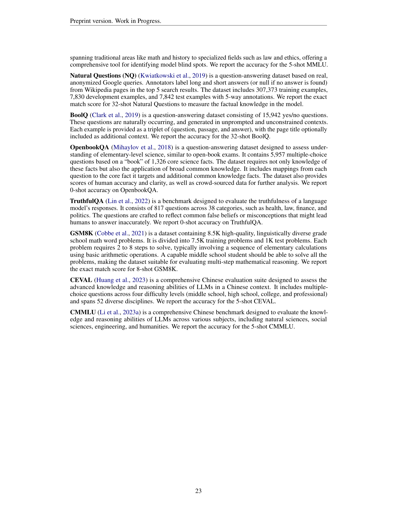
