### TL;DR



The paper introduces FLARE, a novel approach to question answering (QA) and reasoning that combines large language models (LLMs) with logic programming.  Unlike previous methods that relied on prompting techniques or external solvers, FLARE uses the LLM to plan a solution, translate the query into Prolog code (a logic programming language), and then simulate code execution using an exhaustive multi-hop search. This approach allows for measuring the faithfulness of the reasoning process and identifying model inconsistencies (hallucinations).  Experiments on various benchmarks demonstrate that FLARE achieves state-of-the-art results, significantly outperforming existing methods.  Model faithfulness is positively correlated with overall performance.  Importantly, FLARE allows researchers to pinpoint the decisive factors that contribute to the model's success or failure in solving reasoning tasks. This method offers a more transparent and reliable approach to complex reasoning with LLMs, opening up new avenues for research in interpretability and enhancing the capabilities of LLMs in handling complex, nuanced reasoning problems.




 &nbsp; read the paper on arXiv

  

 &nbsp; on Hugging Face


#### Why does it matter?
This paper is crucial for researchers working on question answering and reasoning, particularly those using large language models. It introduces a novel, interpretable approach that significantly improves accuracy and provides valuable insights into model faithfulness and reasoning processes.  The findings challenge existing methods and offer a new direction for enhancing LLM capabilities in complex reasoning tasks, inspiring further research into interpretability and reliable reasoning systems.
#### Key Takeaways


 FLARE significantly improves the accuracy of large language models (LLMs) in complex reasoning tasks. 



 FLARE introduces a new method for measuring model faithfulness, showing a strong correlation between faithfulness and performance. 



 FLARE allows researchers to identify and analyze model hallucinations and sub-optimal reasoning patterns, leading to more reliable and interpretable systems. 


------
#### Visual Insights

> 🔼 The figure illustrates the three modules of FLARE (plan generation, code generation, and simulated search) and how they work together to answer a natural language question by using an LLM to generate a plan, Prolog code, and a simulation of the code execution.
> 

> 
read the caption

> Figure 1: A depiction of the plan, code and simulated search in FLARE. Each module has a breakdown of the relevant components composed by the LLM explained in Section 2.
> 

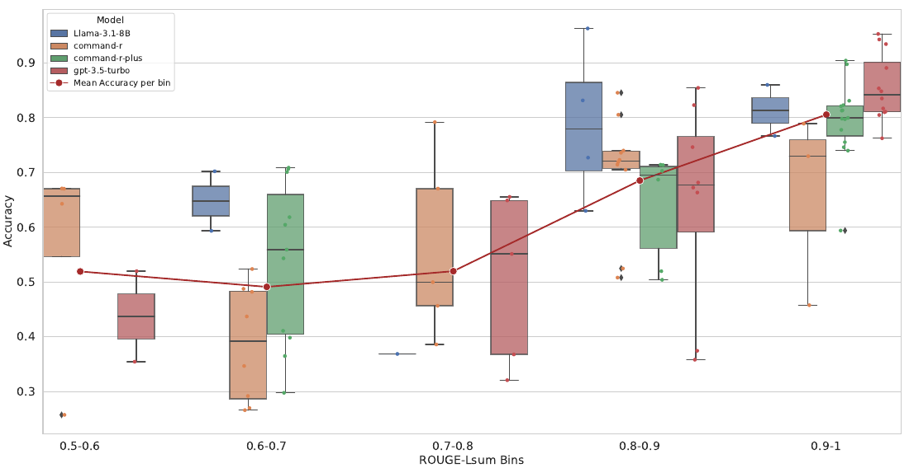

> 🔼 The chart displays the positive correlation between model accuracy and reasoning faithfulness across different models, categorized into bins based on their ROUGE-Lsum scores.
> 

> 
read the caption

> Figure 2: The trend of mean model accuracy w.r.t mean faithfulness (ROUGE-Lsum) for all the models. Faithfulness is positively correlated with model performance.
> 


<table id='1' style='font-size:14px'><tr><td></td><td colspan="5">Math Word Problems</td><td colspan="3">Multi-hop QA</td><td>Relation</td></tr><tr><td>Method</td><td>GSM8K</td><td>SVAMP</td><td>MultiArith</td><td>ASDiv</td><td>AQuA</td><td>StrategyQA</td><td>Date</td><td>Sport</td><td>CLUTRR</td></tr><tr><td>Llama-3.1-8BFLARE</td><td>72.7</td><td>86.0</td><td>96.3</td><td>83.1</td><td>62.9</td><td>70.2</td><td>59.3</td><td>76.6</td><td>36.8</td></tr><tr><td>Llama-3.1-8BF-CoT</td><td>0</td><td>0</td><td>0</td><td>0</td><td>12.2</td><td>53.2</td><td>0</td><td>0</td><td>32</td></tr><tr><td>Llama-3.1-8BCoT</td><td>59.2</td><td>58.6</td><td>60.1</td><td>61.9</td><td>35</td><td>2.9</td><td>20.9</td><td>95.8</td><td>42.2</td></tr><tr><td>CmDRFLARE</td><td>52.4</td><td>74.0</td><td>84.5</td><td>72.2</td><td>43.7</td><td>67.0</td><td>52.3</td><td>78.9</td><td>29.1</td></tr><tr><td>CmDRF-CoT</td><td>0</td><td>0</td><td>0</td><td>0</td><td>0</td><td>59.7</td><td>0</td><td>0</td><td>8.6</td></tr><tr><td>CmDRCoT</td><td>46.5</td><td>57.3</td><td>83.1</td><td>37.2</td><td>28.3</td><td>21.3</td><td>47.4</td><td>55.2</td><td>29.5</td></tr><tr><td>CmDR+FLARE</td><td>71.4</td><td>83.5</td><td>90.4</td><td>81.3</td><td>55.9</td><td>70.8</td><td>61.8</td><td>77.7</td><td>41.0</td></tr><tr><td>CmDR+F-CoT</td><td>0</td><td>0</td><td>0</td><td>0</td><td>15.4</td><td>57.6</td><td>0</td><td>0</td><td>35.3</td></tr><tr><td>CmDR+CoT</td><td>48.7</td><td>81.1</td><td>86.6</td><td>44.6</td><td>44.1</td><td>48.4</td><td>79.1</td><td>62.6</td><td>42.5</td></tr><tr><td>GPT-3.5FLARE</td><td>68.1</td><td>82.7</td><td>98.3</td><td>85.4</td><td>55.1</td><td>65.5</td><td>82.4</td><td>85.6</td><td>49.8</td></tr><tr><td>GPT-3.5F_Cot</td><td>75.8</td><td>83.0</td><td>95.3</td><td>81.7</td><td>53.5</td><td>51.5</td><td>73.5</td><td>52.3</td><td>12.1</td></tr><tr><td>GPT-3.5C0T</td><td>79.8</td><td>82.4</td><td>98.2</td><td>75.8</td><td>59.4</td><td>51.7</td><td>69.9</td><td>95.8</td><td>4.3</td></tr></table>

> 🔼 Table 1 presents the performance of four large language models across nine reasoning benchmarks using three different reasoning techniques: FLARE, CoT, and F-CoT.
> 

> 
read the caption

> Table 1: The following table shows the performance of each of the tested models given a technique for reasoning. Each bold, underlined, and italicised element highlights the best, second best and worst technique per specific model. The overall best method per dataset is highlighted in green
> 

### More visual insights

More on charts

 and the accuracy of the executable code when answering the queries (left).")

> 🔼 The chart displays the percentage of executable code generated by different LLMs and the accuracy of those executable codes in answering questions for three datasets (AQUA, GSM8k, SQA).
> 

> 
read the caption

> Figure 3: The figure shows the percentage of executable code per model (right) and the accuracy of the executable code when answering the queries (left).
> 

 and faithfulness (right).")

> 🔼 The chart displays the impact of model size (parameter scale) on both accuracy and faithfulness of reasoning for four different language models.
> 

> 
read the caption

> Figure 4: The effect of the model parameter scale from 8B to 100B+ on model accuracy (left) and faithfulness (right).
> 

 and faithfulness (right).")

> 🔼 The chart displays the impact of model size (parameter scale) on both accuracy and faithfulness using boxplots comparing four different language models.
> 

> 
read the caption

> Figure 4: The effect of the model parameter scale from 8B to 100B+ on model accuracy (left) and faithfulness (right).
> 

More on tables


<table id='1' style='font-size:16px'><tr><td>Method</td><td>CmDRplan-only</td><td>CmDRFLARE</td><td>CmDR+plan-only</td><td>CmDR+FLARE</td><td>GPT-3.5plan-only</td><td>GPT-3.5FLARE</td></tr><tr><td>GSM8K</td><td>24.7</td><td>52.4</td><td>40.7</td><td>71.4</td><td>36.1</td><td>68.1</td></tr><tr><td>AQuA</td><td>35.0</td><td>43.7</td><td>55.1</td><td>55.9</td><td>54.3</td><td>55.1</td></tr><tr><td>StrategyQA</td><td>65.5</td><td>67.0</td><td>75.7</td><td>70.8</td><td>62.3</td><td>65.5</td></tr></table>
> 🔼 {{ table.description }}
> 

> 
read the caption

> {{ table.caption }}
> 

> The table presents the performance of different reasoning techniques (FLARE, CoT, and F-CoT) across various models on nine benchmark datasets, highlighting the best-performing method for each dataset and model.


<table id='1' style='font-size:14px'><tr><td>Model</td><td>Avg. Number of Paths</td><td>Avg. #Hops per path</td><td>Avg. #Fails per path</td><td>Avg. Total Hops</td><td>Avg. Total Fails</td></tr><tr><td colspan="6">Incorrect Answers</td></tr><tr><td>Llama-3.1-8BFLARE</td><td>1.55</td><td>11.12</td><td>1.52</td><td>15.09</td><td>2.26</td></tr><tr><td>CmDRFLARE</td><td>1.51</td><td>6.55</td><td>0.68</td><td>10.56</td><td>1.39</td></tr><tr><td>CmDR+FLARE</td><td>0.92</td><td>7.52</td><td>1.13</td><td>8.57</td><td>1.32</td></tr><tr><td>GPT-3.5</td><td>0.68</td><td>5.22</td><td>0.71</td><td>5.32</td><td>0.74</td></tr><tr><td colspan="6">Correct Answers</td></tr><tr><td>Llama-3.1-8BFLARE</td><td>1.43</td><td>9.12</td><td>0.62</td><td>12.36</td><td>0.96</td></tr><tr><td>CmDRFLARE</td><td>1.19</td><td>7.10</td><td>0.42</td><td>11.29</td><td>0.66</td></tr><tr><td>CmDR+FLARE</td><td>0.97</td><td>7.19</td><td>0.42</td><td>8.22</td><td>0.61</td></tr><tr><td>GPT-3.5FLARE</td><td>0.82</td><td>5.65</td><td>0.26</td><td>5.69</td><td>0.27</td></tr></table>
> 🔼 {{ table.description }}
> 

> 
read the caption

> {{ table.caption }}
> 

> Table 1 presents the performance of various LLMs across nine reasoning benchmarks using three different reasoning techniques (FLARE, CoT, and F-CoT).


<table id='1' style='font-size:16px'><tr><td>Model</td><td>Unique Explorations (%) in Search</td><td>Relation overlap (%)</td><td>Unused Code relations (%)</td></tr><tr><td colspan="4">Correct Answers</td></tr><tr><td>Llama-3.1-8BFLARE</td><td>74.14</td><td>43.65</td><td>5.73</td></tr><tr><td>CmDRFLARE</td><td>59.06</td><td>35.96</td><td>4.02</td></tr><tr><td>CmDR+FLARE</td><td>64.30</td><td>34.47</td><td>4.54</td></tr><tr><td>GPT-3.5FLARE</td><td>64.46</td><td>37.55</td><td>1.90</td></tr><tr><td colspan="4">Incorrect Answers</td></tr><tr><td>Llama-3.1-8BFLARE</td><td>54.69</td><td>35.04</td><td>9.28</td></tr><tr><td>CmDRFLARE</td><td>54.50</td><td>32.76</td><td>6.23</td></tr><tr><td>CmDR+FLARE</td><td>44.12</td><td>24.98</td><td>8.22</td></tr><tr><td>GPT-3.5FLARE</td><td>36.02</td><td>24.44</td><td>6.94</td></tr></table>
> 🔼 {{ table.description }}
> 

> 
read the caption

> {{ table.caption }}
> 

> Table 1 presents the performance of different LLMs using three reasoning techniques (FLARE, CoT, and F-CoT) across nine diverse reasoning benchmarks.


 <table id='6' style='font-size:22px'><tr><td>Model</td><td>Avg. hops per Paths</td><td>Hallucination (%)</td><td>Unutilised knowledge (%)</td></tr><tr><td>Llama-3.1-8B</td><td>9.4</td><td>63.3</td><td>62.9</td></tr><tr><td>CmDR</td><td>6.7</td><td>54.7</td><td>56.9</td></tr><tr><td>CmDR+</td><td>7.2</td><td>54.3</td><td>56.3</td></tr><tr><td>GPT-3.5</td><td>5.5</td><td>49.3</td><td>52.1</td></tr></table>
> 🔼 {{ table.description }}
> 

> 
read the caption

> {{ table.caption }}
> 

> Table 1 presents the performance of four different large language models across nine reasoning benchmarks, comparing three reasoning techniques: FLARE, CoT, and F-CoT.


 <table id='6' style='font-size:14px'><tr><td>Task</td><td>Prompt</td><td>Description</td></tr><tr><td>Plan Generation</td><td>Generate an explanation and analy- sis, and plan to generate a prompt for writing a swi-prolog code for the last task. The 3 sections should be exactly outlined. Your plan should show enough intermediate reasoning steps towards the answer. Construct the plan as much as you can and describe the logic specifi- cally. When constructing the plan for the code prompt, actively use swi prolog search capabilities.</td><td>Detailed instructions for generating an outline and plan, with an em- phasis on reasoning steps and using Prolog's search capabilities.</td></tr><tr><td>Code Generation</td><td>Write a Prolog code to solve us- ing the plan. If there are un- known or stochastic atoms or pred- icates, fill in the values for them as a logical assumption and add a comment in the same line As- sumed atom/predicate". Do not use write and read commands within the code. The code should be very detailed and utilize swi prolog ca- pabilities to the fullest. To run the program, at the end create a pred- icate named "query" that returns the correct numerical answer. The last line of the program should be the commented-out driver predicate , query". Write only the code.</td><td>Instructions for generating a Pro- log code based on the plan with as- sumptions for unknown atoms. Em- phasizes code details and a final "query" predicate.</td></tr><tr><td>Simulated Search</td><td>Ignoring the read commands, ex- plicitly write out the search paths that are explored by the code: #### Here are the paths [Starting Search Simulation]: #### [Path 1]:</td><td>A task to simulate and display the search paths that the Prolog code would follow during execution.</td></tr><tr><td>Final Answer</td><td>Given the plan, the code and the explored search paths answer the question above. Answer with the correct numerical answer. ##### Here is the answer:</td><td>Final prompt asking for the correct numerical answer based on the pre- vious steps.</td></tr></table>
> 🔼 {{ table.description }}
> 

> 
read the caption

> {{ table.caption }}
> 

> Table 1 presents the performance of various LLMs using three different reasoning techniques (FLARE, CoT, and F-CoT) across nine diverse reasoning benchmarks.


<table id='1' style='font-size:14px'><tr><td>Domain</td><td>Dataset</td><td>Shots</td><td>Test Samples</td><td>Example</td></tr><tr><td rowspan="5">Math Word Problems</td><td>GSM8K</td><td>8</td><td>1,319</td><td>Q: A robe takes 2 bolts of blue fiber and half that much white fiber. How many bolts in total does it take?</td></tr><tr><td>SVAMP</td><td>8</td><td>1,000</td><td>A: 3 Q: Dan had $3 left with him after he bought a candy bar. Ifhe had $4 at the start, how much did the candy bar cost?A: 1 Q: A pet store had 13 siamese cats and 5 house cats. During a sale they sold 10 cats.</td></tr><tr><td>MultiArith</td><td>8</td><td>600</td><td>How many cats do they have left? A: 8</td></tr><tr><td>ASDiv</td><td>8</td><td>2,096</td><td>Q: Adam has five more apples than Jackie. Jackie has nine apples. How many apples does Adam have? A: 14</td></tr><tr><td>AQuA</td><td>8</td><td>254</td><td>Q: A man walks at 5 kmph for 6 hrs and at 4 kmph for 12 hrs. His average speed is Answer option: A)4 1/3 km/h, B)7 2/3 km/h, C)9 1/2 km/h, D)8 km/h, E)81 km/h A: A</td></tr><tr><td rowspan="3">Multi- hop QA</td><td>StrategyQA</td><td>6</td><td>2,290</td><td>Q: Did Aristotle use a laptop? A: False</td></tr><tr><td>Date Understanding</td><td>10</td><td>359</td><td>Q: Yesterday was April 30, 2021. What is the date tomorrow in MM/DD/YYYY? A: "05/02/2021"</td></tr><tr><td>Sports Understanding</td><td>10</td><td>977</td><td>Q: Is the following sentence plausible? Lionel Messi was called for icing? A: False</td></tr><tr><td>Relational Inference</td><td>CLUTRR</td><td>8</td><td>1,042</td><td>Q: [Carlos] is [Clarence]'s brother. [Carlos] and his sister, [Annie], went shopping. asked her mom [Valerie] if she wanted anything, but [Valerie] said no. How is [Valerie] related to [Clarence]? A: "mother"</td></tr></table>
> 🔼 {{ table.description }}
> 

> 
read the caption

> {{ table.caption }}
> 

> Table 1 presents the performance of different reasoning techniques (FLARE, CoT, F-CoT) across various LLMs and nine benchmark datasets, highlighting the best-performing method for each.

### Full paper


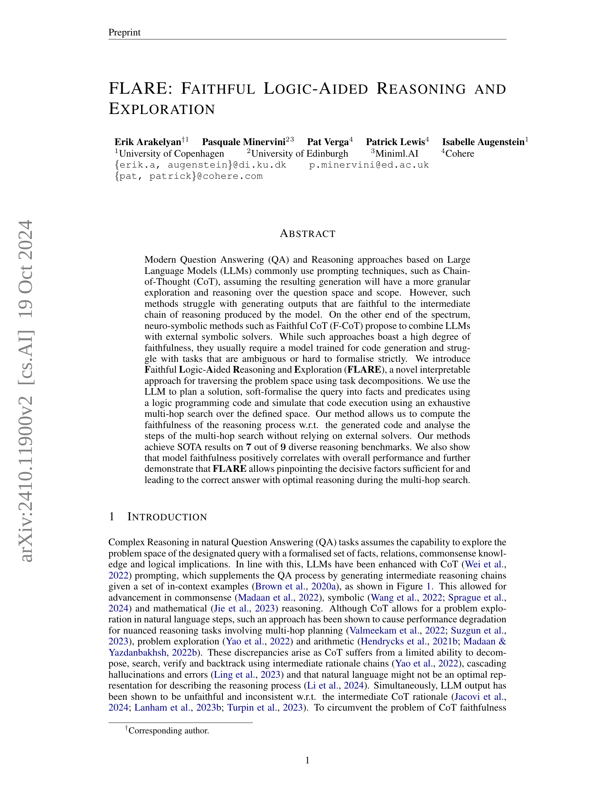

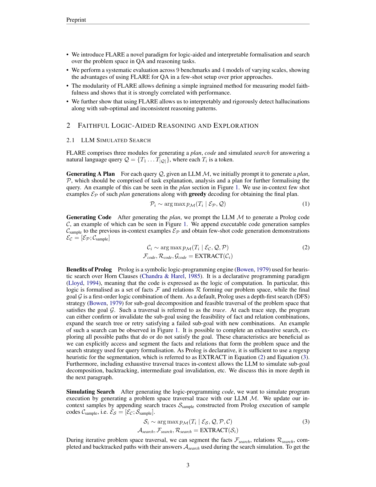

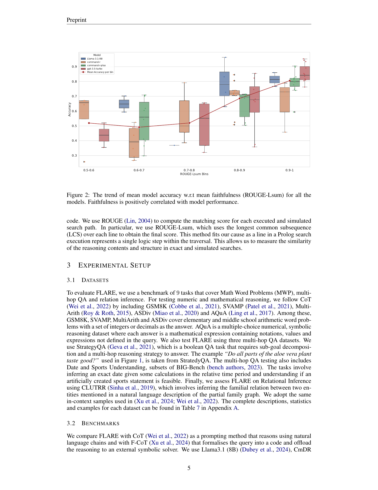

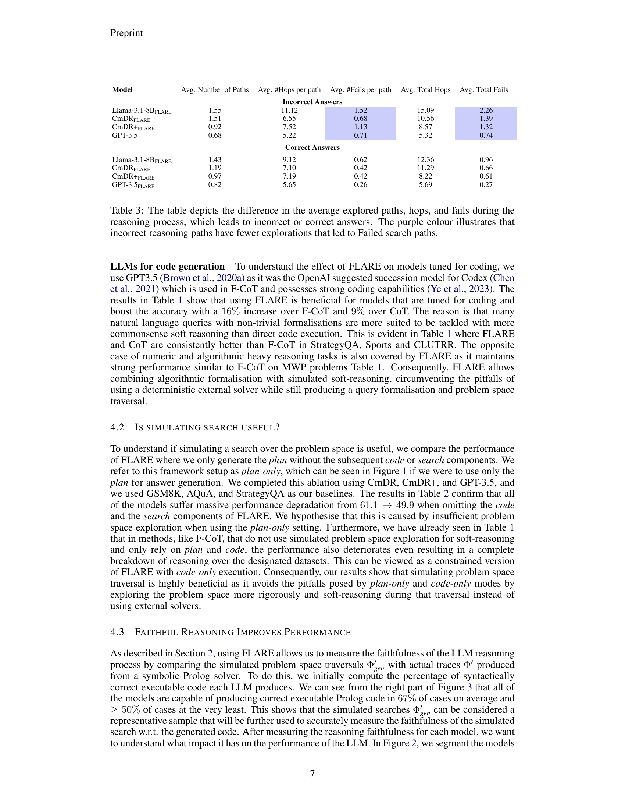
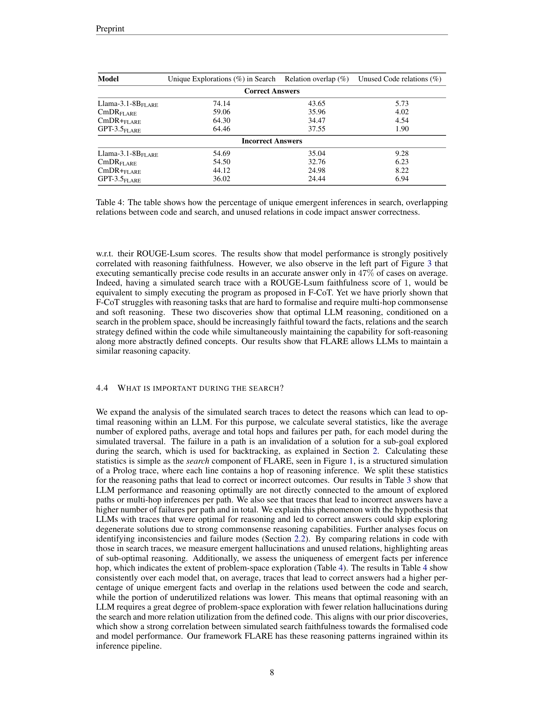

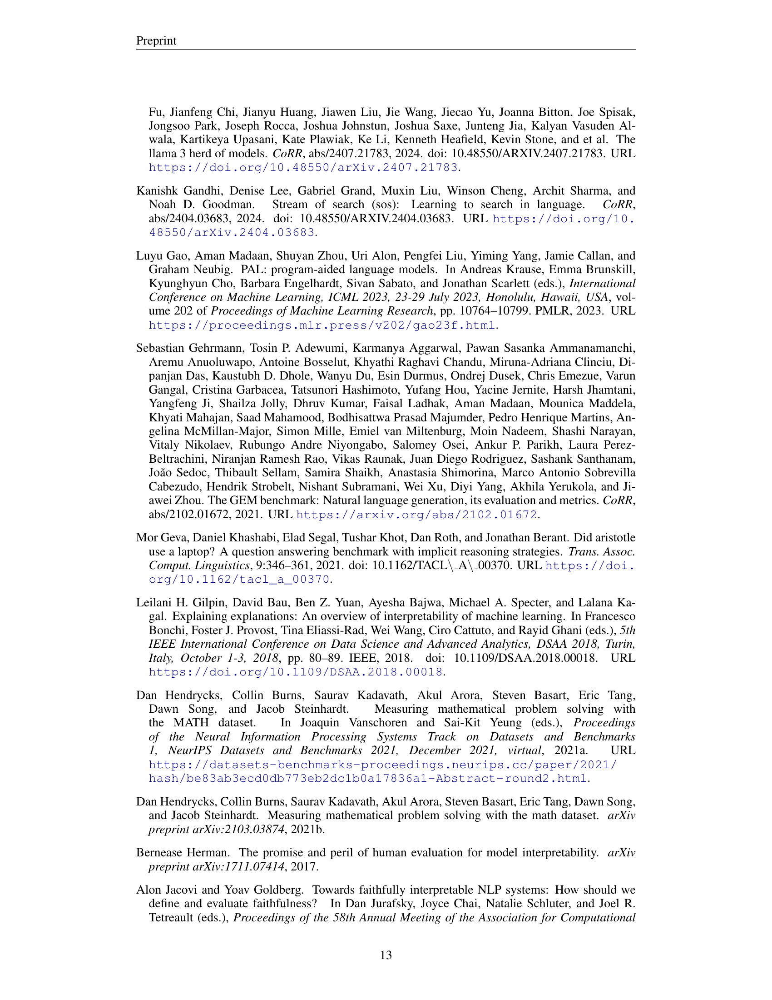
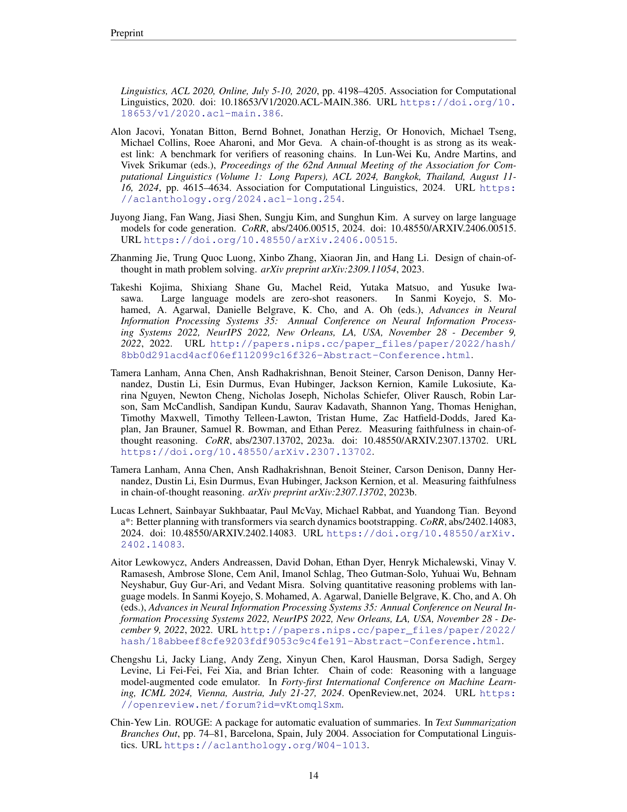

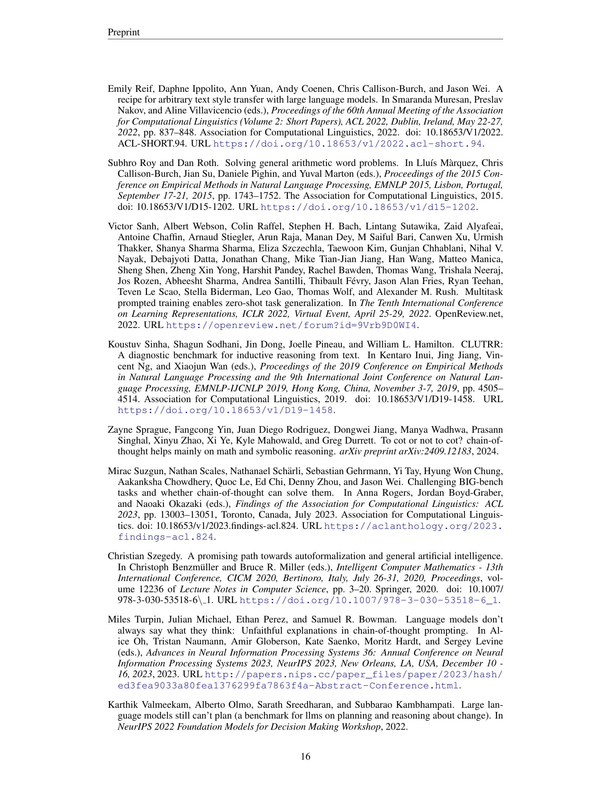
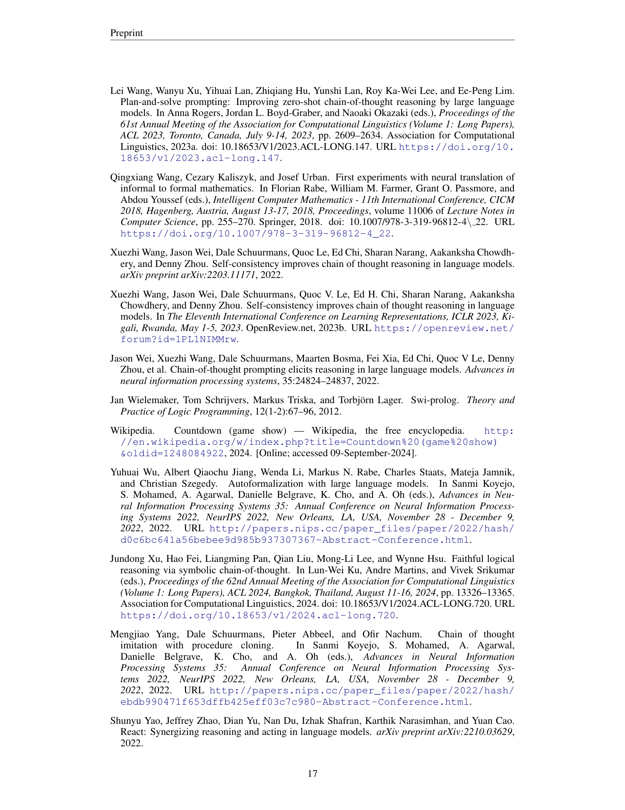

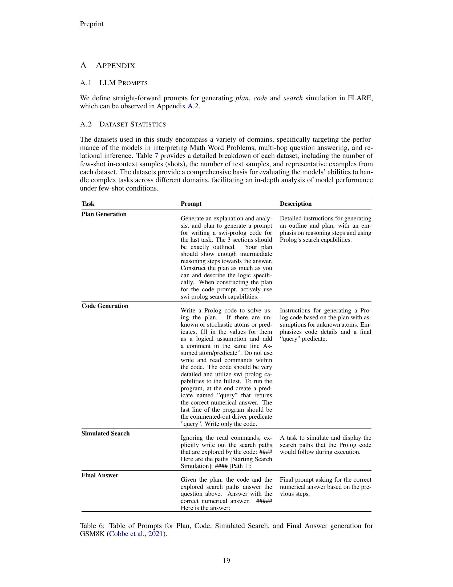

