### TL;DR



Researchers developed OMCAT, a new model designed to improve understanding of events across audio and video.  Existing models struggle with precise timing and connections between different input types.  To address this, a new dataset called OCTAV was created with carefully labeled audio-visual data showing event transitions. OMCAT uses a technique called ROTE (Rotary Time Embeddings) to better handle time information, improving efficiency and accuracy.  Tests showed OMCAT outperforms existing models at understanding audio and video together, especially tasks involving precise timing of events.  The dataset and code are being made publicly available.




 &nbsp; read the paper on arXiv

  

 &nbsp; on Hugging Face


#### Why does it matter?
This paper is crucial for researchers in multimodal AI, especially those working on cross-modal temporal understanding.  It introduces a novel dataset and model that significantly advance the state-of-the-art, providing a strong foundation for future research in this area and opening up new avenues for investigation in audio-visual event correlation and temporal grounding.
#### Key Takeaways


 The OCTAV dataset is a valuable resource for researchers working on temporal understanding in multimodal AI. 



 The OMCAT model demonstrates significant improvements in cross-modal temporal understanding compared to existing models. 



 The ROTE algorithm provides a more efficient approach for temporal conditioning in multimodal models. 


------
#### Visual Insights

> 🔼 The figure shows a sample video sequence from the OCTAV dataset, illustrating annotations highlighting key moments with audio and visual event timings.
> 

> 
read the caption

> Figure 1: Illustration of a video sequence from our proposed OCTAV dataset. The annotations highlight key moments, including the timing of the audio and visual events.
> 


<table id='3' style='font-size:14px'><tr><td></td><td>Train</td><td>Test</td></tr><tr><td>OCTAV-ST</td><td>#Videos (QA Pairs)</td><td>#Videos(QA Pairs)</td></tr><tr><td>Youcook2 (Zhou et al., 2018)</td><td>6832</td><td>2414</td></tr><tr><td>ActivityNet (Krisnna et al⌀, 2017)</td><td>16072</td><td>6228</td></tr><tr><td>QueryD (Oncescu et al., 2021)</td><td>16985</td><td>-</td></tr><tr><td>COIN (lang et al., 2019)</td><td>31938</td><td>-</td></tr><tr><td>HiREST (Zaia et al., 2023)</td><td>2408</td><td>-</td></tr><tr><td>Total</td><td>127,507</td><td>8642</td></tr></table>

> 🔼 Table 1 presents the number of videos and question-answer pairs used for training and testing the OCTAV-ST dataset, broken down by the source dataset.
> 

> 
read the caption

> Table 1: Statistics with number of videos and question-answer pairs for the OCTAV-ST dataset.
> 

### More visual insights

More on figures

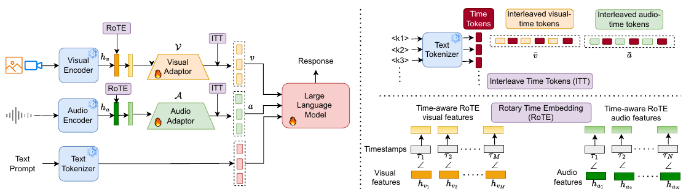

> 🔼 The figure illustrates the architecture of the OMCAT model, showing how video and audio features are processed and aligned with text prompts using adaptor layers and time alignment modules before being fed into a large language model to generate a response.
> 

> 
read the caption

> Figure 2: Overview of the OMCAT pipeline. Video frames are processed through a frozen visual encoder, while audio frames are encoded using a frozen audio encoder. Extracted features are fine-tuned through adaptor layers across all three stages. The LLM remains frozen in Stage 1 and is fine-tuned in Stages 2 and 3. The purple blocks represent time alignment modules, with only one of them activated during training. ∠ in bottom right denotes the rotation angle.
> 

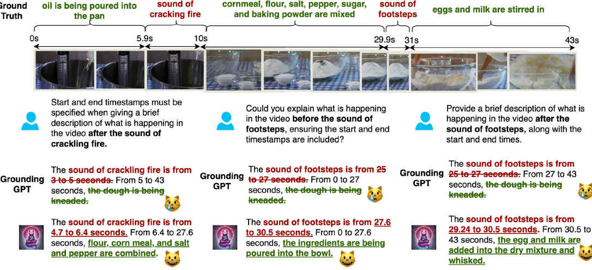

> 🔼 The figure illustrates a video sequence from the OCTAV dataset, showing annotations highlighting key moments with audio and visual events' timing.
> 

> 
read the caption

> Figure 1: Illustration of a video sequence from our proposed OCTAV dataset. The annotations highlight key moments, including the timing of the audio and visual events.
> 

> 🔼 The figure shows a sample video sequence from the OCTAV dataset, highlighting key moments with audio and visual annotations.
> 

> 
read the caption

> Figure 1: Illustration of a video sequence from our proposed OCTAV dataset. The annotations highlight key moments, including the timing of the audio and visual events.
> 

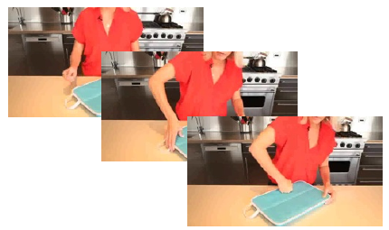

> 🔼 The figure illustrates a video sequence from the OCTAV dataset, showing annotations that highlight key moments and the timing of audio and visual events.
> 

> 
read the caption

> Figure 1: Illustration of a video sequence from our proposed OCTAV dataset. The annotations highlight key moments, including the timing of the audio and visual events.
> 

> 🔼 The figure shows a video sequence from the OCTAV dataset with annotations highlighting key moments, including the timing of audio and visual events.
> 

> 
read the caption

> Figure 1: Illustration of a video sequence from our proposed OCTAV dataset. The annotations highlight key moments, including the timing of the audio and visual events.
> 

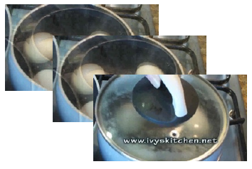

> 🔼 The figure illustrates a video sequence from the OCTAV dataset, showing annotations that highlight key moments and the timing of audio and visual events.
> 

> 
read the caption

> Figure 1: Illustration of a video sequence from our proposed OCTAV dataset. The annotations highlight key moments, including the timing of the audio and visual events.
> 

> 🔼 The figure shows a sample video sequence from the OCTAV dataset, illustrating how annotations highlight key moments with audio and visual events and their timing.
> 

> 
read the caption

> Figure 1: Illustration of a video sequence from our proposed OCTAV dataset. The annotations highlight key moments, including the timing of the audio and visual events.
> 

> 🔼 The figure shows a sample video sequence from the OCTAV dataset, illustrating annotations highlighting key moments, including audio and visual event timings.
> 

> 
read the caption

> Figure 1: Illustration of a video sequence from our proposed OCTAV dataset. The annotations highlight key moments, including the timing of the audio and visual events.
> 

> 🔼 The figure shows a video sequence from the OCTAV dataset with annotations highlighting key moments, including the timing of audio and visual events.
> 

> 
read the caption

> Figure 1: Illustration of a video sequence from our proposed OCTAV dataset. The annotations highlight key moments, including the timing of the audio and visual events.
> 

More on tables


 <table id='5' style='font-size:16px'><tr><td></td><td>Train</td><td>Test</td></tr><tr><td>OCTAV-MT</td><td>#Videos, #QA Pairs</td><td># Videos, #QA Pairs</td></tr><tr><td>Youcook2 (Zhou et al., 2018)</td><td>4296, 34330</td><td>1476, 11806</td></tr><tr><td>ActivityNet Krisnna et al. (2017)</td><td>6463,51670</td><td>1362, 10858</td></tr><tr><td>UnAV-100-M1</td><td>14698, 94916</td><td>2043, 9694</td></tr><tr><td>Total</td><td>25,457, 180,916</td><td>4,881, 32,358</td></tr></table>
> 🔼 {{ table.description }}
> 

> 
read the caption

> {{ table.caption }}
> 

> Table 2 presents the number of videos and question-answer pairs used in the OCTAV-MT dataset for training and testing, broken down by source dataset.


 <table id='10' style='font-size:18px'><tr><td>Dataset</td><td>Audio</td><td>Video</td><td>Detailed captions</td><td>Multi-turn</td><td>Timestamps</td></tr><tr><td>Intern Vid (Wang et al., 2023)</td><td>X</td><td></td><td></td><td>V</td><td>V</td></tr><tr><td>VALOR (Chen et al., 2023a)</td><td></td><td></td><td></td><td>X</td><td>X</td></tr><tr><td>VAST (Chen et al., 20236)</td><td></td><td></td><td>V</td><td>X</td><td>X</td></tr><tr><td>VGG-Sound (Chen et al., 2020)</td><td></td><td></td><td>X</td><td>X</td><td>X</td></tr><tr><td>UnAV-100 (Geng et al., 2023)</td><td></td><td></td><td>X</td><td>X</td><td></td></tr><tr><td>OCTAV</td><td>V</td><td>V</td><td>V</td><td>V</td><td>V</td></tr></table>
> 🔼 {{ table.description }}
> 

> 
read the caption

> {{ table.caption }}
> 

> Table 3 compares the proposed OCTAV dataset with other existing datasets based on the availability of audio and video modalities, detailed captions, multi-turn setup, and timestamp information.


 <table id='1' style='font-size:14px'><tr><td>Stage</td><td>Modality</td><td>Datasets</td><td>TS</td><td>#(Modality, Text)</td></tr><tr><td rowspan="6">Stage I Alignment Tuning</td><td>Image</td><td>LLaVA-Pretrain-595k (Liu et al., 2024)</td><td>X</td><td>558128</td></tr><tr><td>Audio</td><td>WavCaps (Mei et al., 2024)</td><td>X</td><td>403044</td></tr><tr><td>Video</td><td>Valley-703K (Luo et al., 2023)</td><td>X</td><td>703000</td></tr><tr><td>Video</td><td>VATEX (Wang et al., 2019)</td><td>X</td><td>227250</td></tr><tr><td>Audio- Video</td><td>VAST (Chen et al., 2023b)</td><td>X</td><td>414602</td></tr><tr><td>Audio-Video</td><td>VALOR (Chen et al., 2023a)</td><td>X</td><td>16109</td></tr><tr><td rowspan="22">Stage II Instruction Tuning</td><td>Image</td><td>LLaVA-Tune (Liu et al., 2024)</td><td>X</td><td>624610</td></tr><tr><td rowspan="5">Audio</td><td>VGG Sound (Chen et al., 2020)</td><td>X</td><td>5157</td></tr><tr><td>AudioCaps (Kim et al., 2019)</td><td>X</td><td>49838</td></tr><tr><td>MusicCaps (Agostinelli et al., 2023)</td><td>X</td><td>2858</td></tr><tr><td>Clotho (Drossos et al., 2020)</td><td>X</td><td>3938</td></tr><tr><td>Audioset-Strong (Hershey et al., 2021)</td><td>V</td><td>431131</td></tr><tr><td rowspan="12">Video</td><td>VideoInstruct 100K (Maaz et al., 2023)</td><td>X</td><td>98145</td></tr><tr><td>VideoChatGPT (Maaz et al., 2023)</td><td>X</td><td>100010</td></tr><tr><td>Web VidQA (Yang et al., 2022a)</td><td>X</td><td>100000</td></tr><tr><td>Valley-Instruct 65k (Luo et al., 2023)</td><td>X</td><td>64690</td></tr><tr><td>VideoChat-Instruct (L1 et al., 2023b)</td><td>X</td><td>6961</td></tr><tr><td>Activitynet captions (Krishna et al., 2017)</td><td>X</td><td>7481</td></tr><tr><td>NextQA (Xiao et al., 2021)</td><td>X</td><td>34132</td></tr><tr><td>DiDeMO (Anne Hendricks et al., 2017)</td><td>V</td><td>27935</td></tr><tr><td>Charades (Gao et al., 2017)</td><td></td><td>12408</td></tr><tr><td>ActivityNet-RTL (Huang et al., 2024)</td><td></td><td>33557</td></tr><tr><td>Youcook2 (Zhou et al., 2018)</td><td></td><td>8643</td></tr><tr><td>ActivityNetDense captions(Krishna et al., 2017)</td><td></td><td>33212</td></tr><tr><td rowspan="4">Audio- Video</td><td>Macaw Instruct (Lyu et al., 2023)</td><td>X</td><td>50656</td></tr><tr><td>AVQA (Yang et al., 2022b)</td><td>X</td><td>40425</td></tr><tr><td>Music-AVQA (L1 et al., 2022)</td><td>X</td><td>25854</td></tr><tr><td>UnAV-100 (Geng et al⌀, 2023)</td><td></td><td>10358</td></tr><tr><td>Stage III</td><td></td><td>OCTAV-ST (Ours) AVSD (Alamri et al., 2019)</td><td>X</td><td>127507 159700</td></tr><tr><td>Multi-turn Instruction</td><td>Audio- Video</td><td></td><td></td><td></td></tr><tr><td>Tuning</td><td></td><td>UnAV-100-MT (Ours) OCTAV-MT (Ours)</td><td>V</td><td>94916 86000</td></tr></table>
> 🔼 {{ table.description }}
> 

> 
read the caption

> {{ table.caption }}
> 

> Table 4 lists the datasets used for training the OMCAT model across its three training stages, indicating whether timestamps are available and if the dataset supports single-turn or multi-turn question-answer pairs.


 <table id='5' style='font-size:14px'><tr><td>Method</td><td>Time</td><td colspan="3">Accuracy</td><td>R @1(I⌀U=0.5)</td><td>R @ I⌀U=0.7)</td><td colspan="2">Accuracy</td></tr><tr><td></td><td></td><td>AVSD</td><td>Music-AVQA</td><td>AVQA</td><td colspan="2">Charades-STA</td><td>OCTAV-ST Youcook2</td><td>OCTAV-ST ActivityNet</td></tr><tr><td>PandaGPT (Su et al., 2023)</td><td>X</td><td>26.1†</td><td>33.7</td><td>79.8†</td><td>-</td><td>-</td><td>x</td><td></td></tr><tr><td>Video LLaMA (Cheng et al., 2024)</td><td>X</td><td>36.7†</td><td>36.6</td><td>81.0†</td><td>3.8</td><td>0.9</td><td>x</td><td></td></tr><tr><td>MacawLLM (Lyu et al., 2023)</td><td>X</td><td>34.3†</td><td>31.8</td><td>78.7†</td><td>-</td><td>-</td><td>x</td><td></td></tr><tr><td>AVLLM (Shu et al., 2023)</td><td>X</td><td>52.6†</td><td>45.2</td><td>-</td><td>-</td><td>-</td><td>x</td><td></td></tr><tr><td>AVicuna (Tang et al., 2024)</td><td>V</td><td>53.1†</td><td>49.6</td><td>-</td><td>-</td><td>-</td><td>-</td><td>、</td></tr><tr><td>Video LLaMA 2(Zhang et al., 2023)</td><td>X</td><td>53.3†</td><td>73.6†</td><td></td><td>-</td><td>-</td><td>9.14</td><td>10.55</td></tr><tr><td>GroundingGPT (Li et al⌀, 2024)</td><td></td><td>-</td><td>-</td><td>-</td><td>29.6†</td><td>11.9†</td><td>1.20+(3.87)</td><td>1.57+(7.6)</td></tr><tr><td>OMCAT (RoTE)</td><td>V</td><td>49.4</td><td>73.8�(51.2)</td><td>90.2†</td><td>32.3</td><td>15.9</td><td>16.9† (9.9)</td><td>19.0� (11.2)</td></tr></table>
> 🔼 {{ table.description }}
> 

> 
read the caption

> {{ table.caption }}
> 

> Table 5 presents a quantitative comparison of OMCAT's performance against other state-of-the-art models on various audio-visual question answering tasks and a temporal understanding task, including zero-shot and fine-tuned results.


 <table id='2' style='font-size:18px'><tr><td rowspan="2">Method</td><td colspan="3">Accuracy</td></tr><tr><td>OCTAV-MT- Youcook2</td><td>OCTAV-MT-ActivityNet</td><td>UnAV-100-MT</td></tr><tr><td>GroundingGPT (Li et al., 2024)</td><td>0.13</td><td>0.07</td><td>13.2</td></tr><tr><td>OMCAT (RoPE)</td><td>3.3</td><td>2.4</td><td>15.7</td></tr><tr><td>OMCAT (ITT)</td><td>3.1</td><td>4.1</td><td>16.6</td></tr><tr><td>OMCAT (RoTE)</td><td>3.7</td><td>5.6</td><td>19.9</td></tr></table>
> 🔼 {{ table.description }}
> 

> 
read the caption

> {{ table.caption }}
> 

> Table 6 presents the performance comparison of three different variations of OMCAT (using ROPE, ITT, and ROTE time embeddings) on the OCTAV-MT benchmark and the UnAV-100-MT dataset.


 <table id='6' style='font-size:14px'><tr><td rowspan="2">Time Encoding</td><td colspan="3">Accuracy</td><td colspan="2">R@1(IoU=0.5) R@1(IoU=0.7)</td><td colspan="2">Accuracy</td></tr><tr><td>AVSD</td><td>Music-AVQA</td><td>AVQA</td><td>Charades-STA</td><td></td><td>OCTAV-ST-Youcook2</td><td>OCTAV-ST-ActivityNet</td></tr><tr><td>RoPE</td><td>45.9</td><td>71.2</td><td>88.2</td><td>30.7</td><td>16.1</td><td>13.3</td><td>16.5</td></tr><tr><td>ITT</td><td>47.3</td><td>69.7</td><td>82.1</td><td>32.5</td><td>16.7</td><td>16.5</td><td>19.2</td></tr><tr><td>RoTE</td><td>49.4</td><td>73.8</td><td>90.2</td><td>32.3</td><td>15.9</td><td>16.9</td><td>19.0</td></tr></table>
> 🔼 {{ table.description }}
> 

> 
read the caption

> {{ table.caption }}
> 

> Table 7 presents the performance comparison of three different time embedding methods (ROPE, ITT, and ROTE) used in OMCAT across multiple evaluation benchmarks (AVSD, Music-AVQA, AVQA, Charades-STA, OCTAV-ST-YouCook2, and OCTAV-ST-ActivityNet).


 <table id='8' style='font-size:16px'><tr><td>Ablation</td><td>Music-AVQA</td><td>Charades-STA (R@1,IoU-0.5)</td><td>OCTAV-ST-Youcook2</td></tr><tr><td>OMCAT w/ only LP,WC,V</td><td>50.6</td><td>26.9</td><td>4.97</td></tr><tr><td>Ours</td><td>51.2</td><td>32.3</td><td>16.9</td></tr></table>
> 🔼 {{ table.description }}
> 

> 
read the caption

> {{ table.caption }}
> 

> Table 8 shows the ablation study results, demonstrating the impact of alignment tuning data (LLaVA-Pretrain, WavCaps, Valley) on the overall performance of the model across three different tasks (Music-AVQA, Charades-STA, OCTAV-ST-Youcook2).


 <table id='2' style='font-size:14px'><tr><td>Method</td><td>Modality</td><td>MSRVTT-QA</td><td>MSVD-QA</td><td>ActivityNet-QA</td></tr><tr><td>VideoChat (Li et al., 2023b)</td><td>Video</td><td>45.0</td><td>56.3</td><td>26.5</td></tr><tr><td>Video-ChatGPT (Maaz et al., 2023)</td><td>Video</td><td>49.3</td><td>64.9</td><td>35.2</td></tr><tr><td>Valley (Luo et al., 2023)</td><td>Video</td><td>45.7</td><td>65.4</td><td>42.9</td></tr><tr><td>Video-LLaMA (Zhang et al., 2023)</td><td>Video</td><td>29.6</td><td>51.6</td><td>12.4</td></tr><tr><td>PandaGPT (Su et al., 2023)</td><td>Video, Audio</td><td>23.7</td><td>46.7</td><td>11.2</td></tr><tr><td>MacawLLM (Lyu et al., 2023)</td><td>Video, Audio</td><td>25.5</td><td>42.1</td><td>14.5</td></tr><tr><td>AVLLM (Shu et al., 2023)</td><td>Video, Audio</td><td>53.7</td><td>67.3</td><td>47.2</td></tr><tr><td>GroundingGPT (L1 etal.,2024)</td><td>Video, Audio</td><td>51.6</td><td>67.8</td><td>44.7</td></tr><tr><td>AVicuna† (Tang et al., 2024)</td><td>Video, Audio</td><td>59.7</td><td>70.2</td><td>53.0</td></tr><tr><td>Video LLaMA 2 (Cheng et al., 2024)</td><td>Video, Audio</td><td>53.9</td><td>71.7</td><td>49.9</td></tr><tr><td>OMCAT (RoPE (Su et al., 2024))</td><td>Video, Audio</td><td>49.3</td><td>63.2</td><td>41.9</td></tr><tr><td>OMCAT (ITT)</td><td>Video, Audio</td><td>51.1</td><td>65.1</td><td>43.9</td></tr><tr><td>OMCAT (RoTE)</td><td>Video, Audio</td><td>51.2</td><td>67.8</td><td>46.6</td></tr></table>
> 🔼 {{ table.description }}
> 

> 
read the caption

> {{ table.caption }}
> 

> Table 9 compares the performance of OMCAT and other state-of-the-art models on three video understanding benchmark datasets: MSRVTT-QA, MSVD-QA, and ActivityNet-QA.

### Full paper


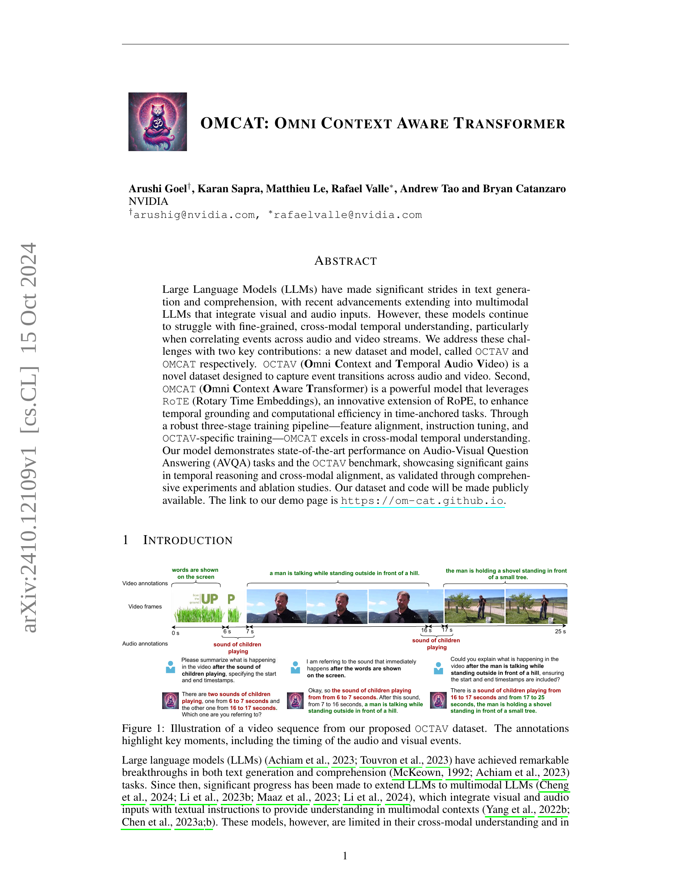
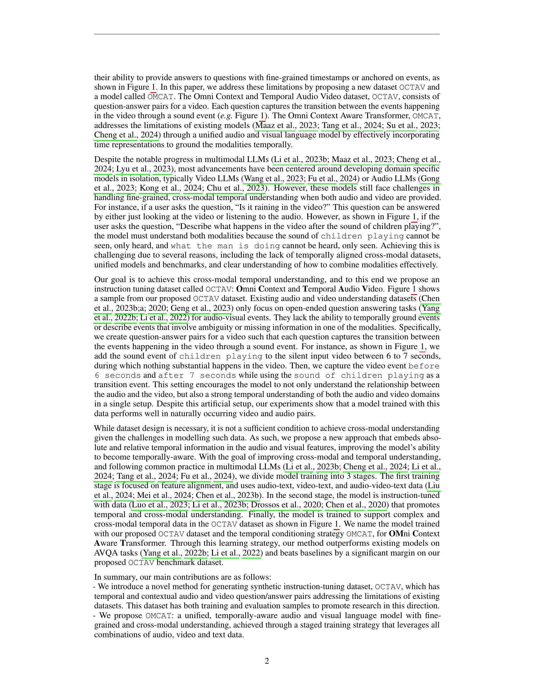
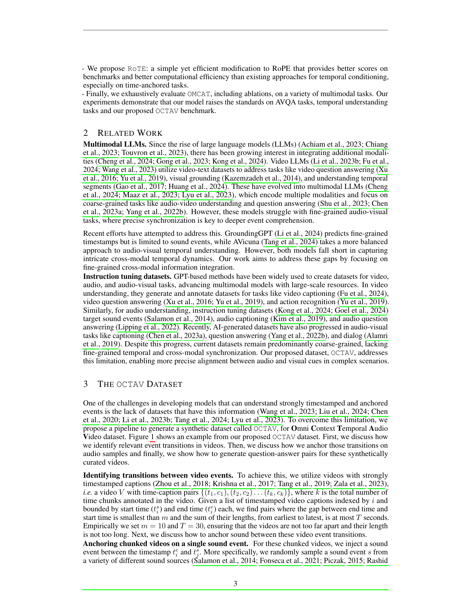
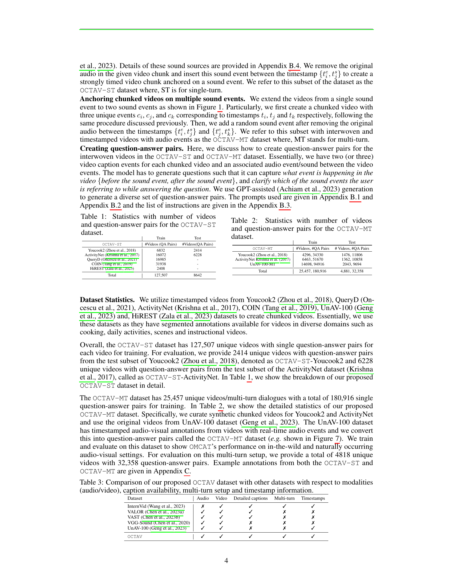

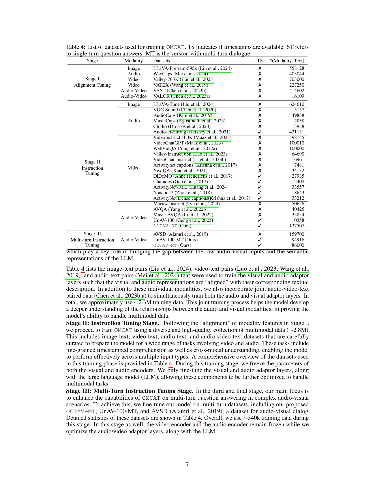
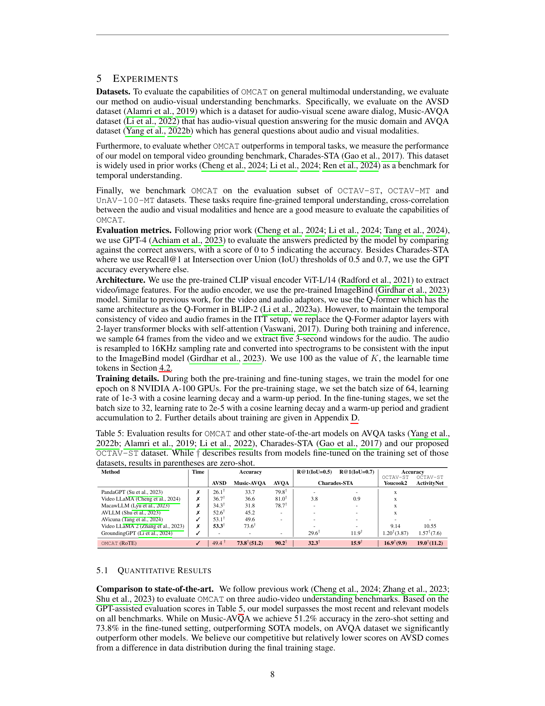

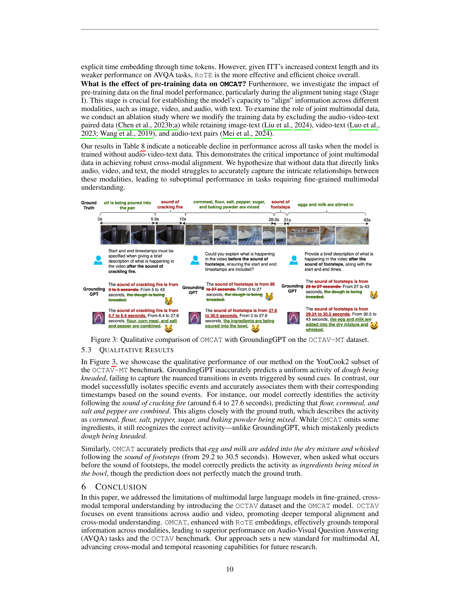

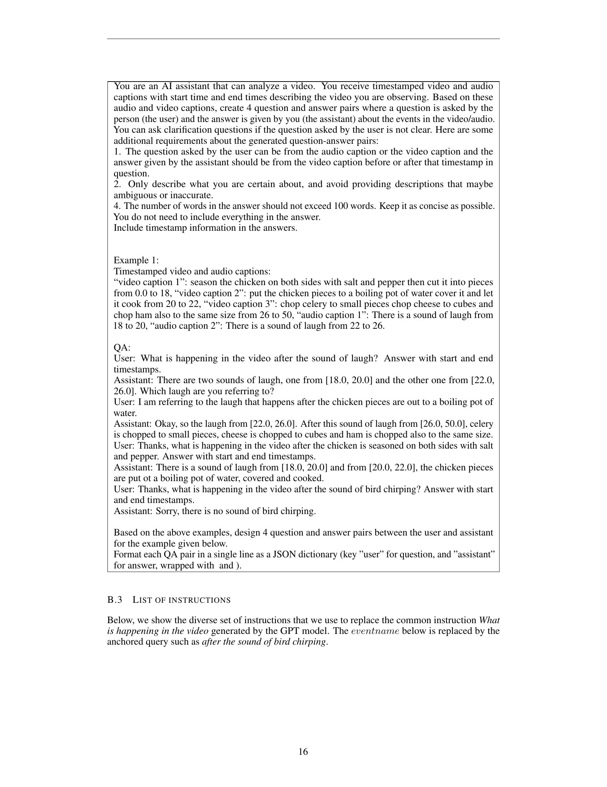
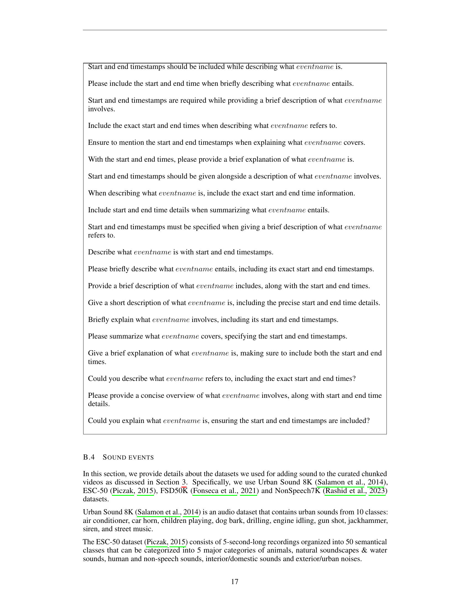

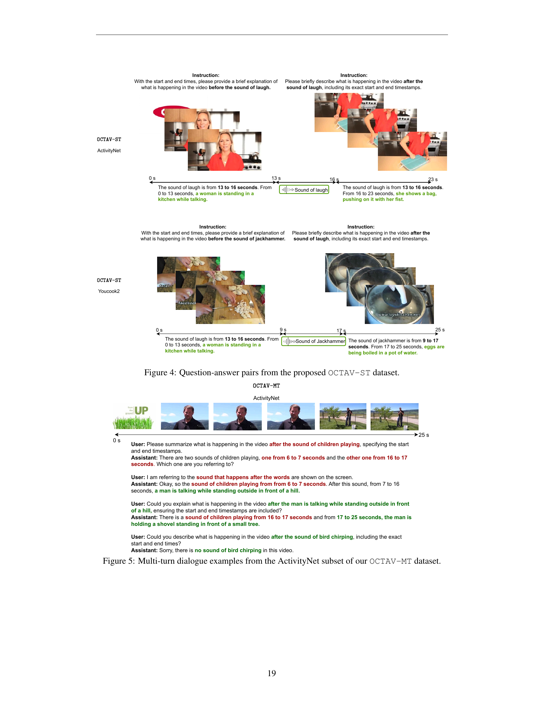

