### TL;DR



The TransAgent framework improves vision-language foundation models (like CLIP) by leveraging the knowledge of multiple, specialized 'agent' models.  Instead of relying on a single model to perform well on diverse downstream tasks, TransAgent combines the strengths of various pre-trained vision, language, and multi-modal agents. It does this through a process called knowledge distillation, where the knowledge from these agents is effectively transferred to the core vision-language model.  This is done without adding any extra processing time during the actual use of the improved model. Experiments demonstrated that TransAgent substantially outperforms previous state-of-the-art methods across eleven different visual recognition benchmarks, especially when limited training data is available.




 &nbsp; read the paper on arXiv

  

 &nbsp; on Hugging Face


#### Why does it matter?
This paper is crucial for researchers working on vision-language models and transfer learning.  It introduces a novel framework that significantly improves the generalization capabilities of these models, addressing a key challenge in the field. The proposed TransAgent offers a more efficient and flexible approach to knowledge transfer, opening new avenues for research in multi-agent collaboration and knowledge distillation.
#### Key Takeaways


 TransAgent uses a novel multi-agent collaboration framework to enhance vision-language model generalization. 



 Knowledge distillation is employed efficiently, improving model performance without increased inference cost. 



 State-of-the-art results were achieved on eleven visual recognition datasets, surpassing existing methods. 


------
#### Visual Insights

> 🔼 This figure illustrates the TransAgent framework, showing how it leverages multiple heterogeneous agents to improve the generalization ability of vision-language foundation models, and compares its performance against state-of-the-art methods.
> 

> 
read the caption

> Figure 1: An overview of our TransAgent. (a) TransAgent transfers multi-source knowledge from heterogeneous agents to enhance the generalization ability of vision-language foundation models. It demonstrates knowledge versatility, transfer flexibility and deployment efficiency through elaborate agent collaboration and knowledge ensemble strategy. (b) SOTA comparison for base-to-novel generalization on 11 visual recognition benchmarks. Our method outperforms previous SOTA, especially on the more diversified target domains.
> 

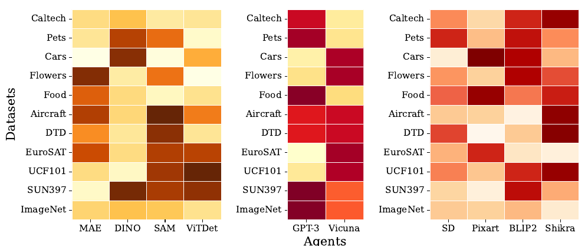

> 🔼 The heatmap visualizes the average gating weights of vision, language, and multi-modal agents across eleven datasets, indicating their contribution to the final gated features.
> 

> 
read the caption

> Figure 5: Averaged gating weights of each agent on different datasets. Deeper color indicates more contributions to the gated feature(s) or score vectors.
> 


<table id='1' style='font-size:16px'><tr><td rowspan="2">Method</td><td colspan="3">Average</td><td colspan="3">ImageNet 21</td><td colspan="3">Caltech101 29</td><td colspan="3">OxfordPets 58</td></tr><tr><td>Base</td><td>Novel</td><td>HM</td><td>Base</td><td>Novel</td><td>HM</td><td>Base</td><td>Novel</td><td>HM</td><td>Base</td><td>Novel</td><td>HM</td></tr><tr><td>CLIP 61</td><td>69.34</td><td>74.22</td><td>71.70</td><td>72.43</td><td>68.14</td><td>70.22</td><td>96.84</td><td>94.00</td><td>95.40</td><td>91.17</td><td>97.26</td><td>94.12</td></tr><tr><td>CoOp 87</td><td>82.69</td><td>63.22</td><td>71.66</td><td>76.47</td><td>67.88</td><td>71.92</td><td>98.00</td><td>89.81</td><td>93.73</td><td>93.67</td><td>95.29</td><td>94.47</td></tr><tr><td>CoCoOp 86</td><td>80.47</td><td>71.69</td><td>75.83</td><td>75.98</td><td>70.43</td><td>73.10</td><td>97.96</td><td>93.81</td><td>95.84</td><td>95.20</td><td>97.69</td><td>96.43</td></tr><tr><td>MaPLe 40</td><td>82.28</td><td>75.14</td><td>78.55</td><td>75.40</td><td>70.32</td><td>72.72</td><td>98.27</td><td>93.23</td><td>95.68</td><td>95.43</td><td>97.83</td><td>96.62</td></tr><tr><td>RPO 45</td><td>81.13</td><td>75.00</td><td>77.78</td><td>76.60</td><td>71.57</td><td>74.00</td><td>97.97</td><td>94.37</td><td>96.03</td><td>94.63</td><td>97.50</td><td>96.05</td></tr><tr><td>PromptSRC 41</td><td>84.26</td><td>76.10</td><td>79.97</td><td>77.60</td><td>70.73</td><td>74.01</td><td>98.10</td><td>94.03</td><td>96.02</td><td>95.33</td><td>97.30</td><td>96.30</td></tr><tr><td>TransAgent</td><td>85.29</td><td>77.62</td><td>81.27</td><td>78.07</td><td>70.57</td><td>74.13</td><td>98.90</td><td>95.23</td><td>97.03</td><td>96.33</td><td>98.13</td><td>97.22</td></tr><tr><td rowspan="2">Method</td><td colspan="3">StanfordCars 44</td><td colspan="3">Flowers102 57</td><td colspan="3">Food101 6</td><td colspan="3">FGVCAircraft 55</td></tr><tr><td>Base</td><td>Novel</td><td>HM</td><td>Base</td><td>Novel</td><td>HM</td><td>Base</td><td>Novel</td><td>HM</td><td>Base</td><td>Novel</td><td>HM</td></tr><tr><td>CLIP 61</td><td>63.37</td><td>74.89</td><td>68.65</td><td>72.08</td><td>77.80</td><td>74.83</td><td>90.10</td><td>91.22</td><td>90.66</td><td>27.19</td><td>36.29</td><td>31.09</td></tr><tr><td>CoOp 87</td><td>78.12</td><td>60.40</td><td>68.13</td><td>97.60</td><td>59.67</td><td>74.06</td><td>88.33</td><td>82.26</td><td>85.19</td><td>40.44</td><td>22.30</td><td>28.75</td></tr><tr><td>CoCoOp 86</td><td>70.49</td><td>73.59</td><td>72.01</td><td>94.87</td><td>71.75</td><td>81.71</td><td>90.70</td><td>91.29</td><td>90.99</td><td>33.41</td><td>23.71</td><td>27.74</td></tr><tr><td>MaPLe 40</td><td>74.70</td><td>71.20</td><td>72.91</td><td>97.70</td><td>68.68</td><td>80.66</td><td>90.30</td><td>88.57</td><td>89.43</td><td>36.90</td><td>34.13</td><td>35.46</td></tr><tr><td>RPO 45</td><td>73.87</td><td>75.53</td><td>74.69</td><td>94.13</td><td>76.67</td><td>84.50</td><td>90.33</td><td>90.83</td><td>90.58</td><td>37.33</td><td>34.20</td><td>35.70</td></tr><tr><td>PromptSRC 41</td><td>78.27</td><td>74.97</td><td>76.58</td><td>98.07</td><td>76.50</td><td>85.95</td><td>90.67</td><td>91.53</td><td>91.10</td><td>42.73</td><td>37.87</td><td>40.15</td></tr><tr><td>TransAgent</td><td>79.53</td><td>74.73</td><td>77.06</td><td>98.37</td><td>77.13</td><td>86.46</td><td>90.87</td><td>92.20</td><td>91.53</td><td>43.77</td><td>39.00</td><td>41.25</td></tr><tr><td rowspan="2">Method</td><td colspan="3">SUN397 / 3</td><td colspan="3">DTD 19</td><td colspan="3">EuroSAT 35</td><td colspan="3">UCF101 67</td></tr><tr><td>Base</td><td>Novel</td><td>HM</td><td>Base</td><td>Novel</td><td>HM</td><td>Base</td><td>Novel</td><td>HM</td><td>Base</td><td>Novel</td><td>HM</td></tr><tr><td>CLIP 61</td><td>69.36</td><td>75.35</td><td>72.23</td><td>53.24</td><td>59.90</td><td>56.37</td><td>56.48</td><td>64.05</td><td>60.03</td><td>70.53</td><td>77.50</td><td>73.85</td></tr><tr><td>CoOp 87</td><td>80.60</td><td>65.89</td><td>72.51</td><td>79.44</td><td>41.18</td><td>54.24</td><td>92.19</td><td>54.74</td><td>68.69</td><td>84.69</td><td>56.05</td><td>67.46</td></tr><tr><td>CoCoOp 86</td><td>79.74</td><td>76.86</td><td>78.27</td><td>77.01</td><td>56.00</td><td>64.85</td><td>87.49</td><td>60.04</td><td>71.21</td><td>82.33</td><td>73.45</td><td>77.64</td></tr><tr><td>MaPLe 40</td><td>78.47</td><td>76.93</td><td>77.79</td><td>80.67</td><td>56.48</td><td>66.44</td><td>83.90</td><td>66.00</td><td>73.88</td><td>85.23</td><td>71.97</td><td>78.04</td></tr><tr><td>RPO 45</td><td>80.60</td><td>77.80</td><td>79.18</td><td>76.70</td><td>62.13</td><td>68.61</td><td>86.63</td><td>68.97</td><td>76.79</td><td>83.67</td><td>75.43</td><td>79.34</td></tr><tr><td>PromptSRC 41</td><td>82.67</td><td>78.47</td><td>80.52</td><td>83.37</td><td>62.97</td><td>71.75</td><td>92.90</td><td>73.90</td><td>82.32</td><td>87.10</td><td>78.80</td><td>82.74</td></tr><tr><td>TransAgent</td><td>82.90</td><td>79.30</td><td>81.06</td><td>84.37</td><td>63.67</td><td>72.57</td><td>97.43</td><td>83.43</td><td>89.89</td><td>87.60</td><td>80.47</td><td>83.88</td></tr></table>

> 🔼 Table 1 compares the performance of TransAgent against other state-of-the-art methods on eleven visual recognition datasets using base-to-novel generalization.
> 

> 
read the caption

> Table 1: Accuracy comparison with state-of-the-art methods on base-to-novel generalization. All methods use CLIP's ViT-B/16 as the vision encoder. Our TransAgent exhibits strong generalization ability and outperforms previous SOTA on all datasets. The best results are bolded.
> 

### More visual insights

More on figures

> 🔼 Figure 2 illustrates the TransAgent framework's vision and language agent collaboration, detailing knowledge integration and distillation processes for enhanced model performance.
> 

> 
read the caption

> Figure 2: Vision Agent Collaboration and Language Agent Collaboration. (a) VAC integrates visual knowledge via MoA gating and transfers the knowledge through layer-wise feature distillation. (b) LAC enhances the textual representations through class-specific feature distillation between the prompted textual feature and the gated textual feature.
> 

> 🔼 This figure illustrates the multi-modal agent collaboration in TransAgent, showing how cross attention maps are extracted from T2I and I2T agents, processed, and used to align learnable prompts via score distillation.
> 

> 
read the caption

> Figure 3: Multi-modal Agent Collaboration. Top left: We first extract the cross attention maps from the T2I agents and then obtain the score vectors through LSE pooling. Top right: We compute the score vectors from the I2T agents as the cosine similarity between the projected visual feature and the LLM's textual feature. Finally, we perform score distillation between the learned score vectors and the gated score vectors to further align the learnable prompts.
> 

> 🔼 Figure 4 shows the accuracy comparison of TransAgent and other methods in few-shot classification settings on eleven different datasets.
> 

> 
read the caption

> Figure 4: Accuracy comparison in few-shot classification. TransAgent demonstrates state-of-the-art performance for all few-shot settings on different datasets, which proves promising learning capability even under extremely limited supervision.
> 

More on tables


 <table id='5' style='font-size:18px'><tr><td>Models</td><td>Base</td><td>Novel</td><td>HM</td></tr><tr><td>baseline</td><td>84.21</td><td>71.79</td><td>77.51</td></tr><tr><td>GPT-3</td><td>85.15</td><td>74.55</td><td>79.50</td></tr><tr><td>Vicuna</td><td>85.35</td><td>74.70</td><td>79.67</td></tr><tr><td>[SOS]</td><td>84.19</td><td>75.25</td><td>79.47</td></tr><tr><td>[EOS]</td><td>85.29</td><td>77.62</td><td>81.27</td></tr><tr><td>Average</td><td>84.23</td><td>75.98</td><td>79.89</td></tr><tr><td>Add</td><td>82.44</td><td>74.89</td><td>78.48</td></tr><tr><td>Gating</td><td>85.29</td><td>77.62</td><td>81.27</td></tr></table>
> 🔼 {{ table.description }}
> 

> 
read the caption

> {{ table.caption }}
> 

> Table 3 presents the results of ablating different designs for Language Agent Collaboration (LAC) module, showing the base, novel, and harmonic mean (HM) accuracy for different model choices and fusion methods.


<table id='1' style='font-size:14px'><tr><td rowspan="2">Model</td><td rowspan="2">Parameters</td><td rowspan="2">Model Type</td><td colspan="2">Pre-training</td><td rowspan="2">Knowledge</td></tr><tr><td>Tasks</td><td>Datasets</td></tr><tr><td>DINO 9</td><td>86M</td><td>ViT</td><td>IC</td><td>ImageNet-1K</td><td>Vision</td></tr><tr><td>MAE 33</td><td>86M</td><td>ViT</td><td>MIM</td><td>ImageNet-1K</td><td>Vision</td></tr><tr><td>SAM 43</td><td>86M</td><td>ViT</td><td>IS</td><td>SA-1B</td><td>Vision</td></tr><tr><td>ViTDet 49</td><td>86M</td><td>ViT</td><td>OD</td><td>COCO</td><td>Vision</td></tr><tr><td>GPT-3</td><td>175B</td><td>LLM</td><td>TG</td><td>-</td><td>Language</td></tr><tr><td>Vicuna / 8</td><td>13B</td><td>LLM</td><td>TG</td><td>-</td><td>Language</td></tr><tr><td>BERT 22</td><td>38M</td><td>Transformer</td><td>MLM</td><td>-</td><td>Language</td></tr><tr><td>Stable Diffusion 64</td><td>0.86B</td><td>UNet</td><td>IG</td><td>LAION-2B</td><td>Multi-modal</td></tr><tr><td>Pixart-� I</td><td>0.6B</td><td>DiT</td><td>IG</td><td>-</td><td>Multi-modal</td></tr><tr><td>BLIP2 46</td><td>2.7B</td><td>MLLM</td><td>ITC+ITM+ITG</td><td>-</td><td>Multi-modal</td></tr><tr><td>Shikra 12</td><td>7B</td><td>MLLM</td><td>ITC+ITM+ITG</td><td>-</td><td>Multi-modal</td></tr></table>
> 🔼 {{ table.description }}
> 

> 
read the caption

> {{ table.caption }}
> 

> Table 7 presents the different agents used in the TransAgent framework, specifying their parameters, model type, pre-training tasks and datasets, and the type of knowledge they provide.


 <table id='3' style='font-size:14px'><tr><td></td><td>Setting</td><td>ImageNet</td><td>Caltech 101</td><td>Oxford Pets</td><td>Standford Cars</td><td>Flowers 102</td><td>Food101</td><td>FGVC Aircraft</td><td>SUN397</td><td>DTD</td><td>Euro SAT</td><td>UCF101</td></tr><tr><td rowspan="2">Memory (MB)</td><td>Base-to-novel</td><td>11790</td><td>4708</td><td>4692</td><td>6698</td><td>4702</td><td>4708</td><td>5286</td><td>7708</td><td>5008</td><td>4034</td><td>4718</td></tr><tr><td>Few-shot (16-shot)</td><td>19978</td><td>4542</td><td>6892</td><td>6892</td><td>5488</td><td>5488</td><td>5486</td><td>10110</td><td>4700</td><td>4124</td><td>5484</td></tr><tr><td rowspan="2">Time (ms/batch)</td><td>Base-to-novel</td><td>400</td><td>190</td><td>195</td><td>226</td><td>211</td><td>209</td><td>219</td><td>273</td><td>191</td><td>190</td><td>193</td></tr><tr><td>Few-shot (16-shot)</td><td>688</td><td>214</td><td>206</td><td>262</td><td>217</td><td>215</td><td>221</td><td>356</td><td>196</td><td>205</td><td>220</td></tr></table>
> 🔼 {{ table.description }}
> 

> 
read the caption

> {{ table.caption }}
> 

> This table shows the memory usage (in MB) and training time per batch (in milliseconds) for different datasets and training settings (base-to-novel and 16-shot).


<table id='1' style='font-size:14px'><tr><td rowspan="2">Method</td><td>Source</td><td colspan="11">Target</td></tr><tr><td>ImageNet</td><td>Caltech 101</td><td>Oxford Pets</td><td>Standford Cars</td><td>Flowers 102</td><td>Food101</td><td>FGVC Aircraft</td><td>SUN397</td><td>DTD</td><td>Euro SAT</td><td>UCF101</td><td>Avg.</td></tr><tr><td>CLIP</td><td>66.72</td><td>92.94</td><td>89.07</td><td>65.29</td><td>71.30</td><td>86.11</td><td>24.87</td><td>62.62</td><td>44.56</td><td>47.69</td><td>66.77</td><td>65.12</td></tr><tr><td>CoOp</td><td>71.51</td><td>93.70</td><td>89.14</td><td>64.51</td><td>68.71</td><td>85.30</td><td>18.47</td><td>64.15</td><td>41.92</td><td>46.39</td><td>66.55</td><td>63.88</td></tr><tr><td>CoCoOp</td><td>71.02</td><td>94.43</td><td>90.14</td><td>65.32</td><td>71.88</td><td>86.06</td><td>22.94</td><td>67.36</td><td>45.73</td><td>45.37</td><td>68.21</td><td>65.74</td></tr><tr><td>MaPLe</td><td>70.72</td><td>93.53</td><td>90.49</td><td>65.57</td><td>72.23</td><td>86.20</td><td>24.74</td><td>67.01</td><td>46.49</td><td>48.06</td><td>68.69</td><td>66.30</td></tr><tr><td>PromptSRC</td><td>71.27</td><td>93.60</td><td>90.25</td><td>65.70</td><td>70.25</td><td>86.15</td><td>23.90</td><td>67.10</td><td>46.87</td><td>45.50</td><td>68.75</td><td>65.81</td></tr><tr><td>TransAgent</td><td>72.00</td><td>94.37</td><td>90.33</td><td>65.43</td><td>71.40</td><td>86.47</td><td>23.20</td><td>66.20</td><td>45.30</td><td>52.13</td><td>69.93</td><td>66.48</td></tr></table>
> 🔼 {{ table.description }}
> 

> 
read the caption

> {{ table.caption }}
> 

> Table 9 presents a comparison of the accuracy achieved by various methods on cross-dataset evaluation, highlighting the superior performance of TransAgent.

### Full paper


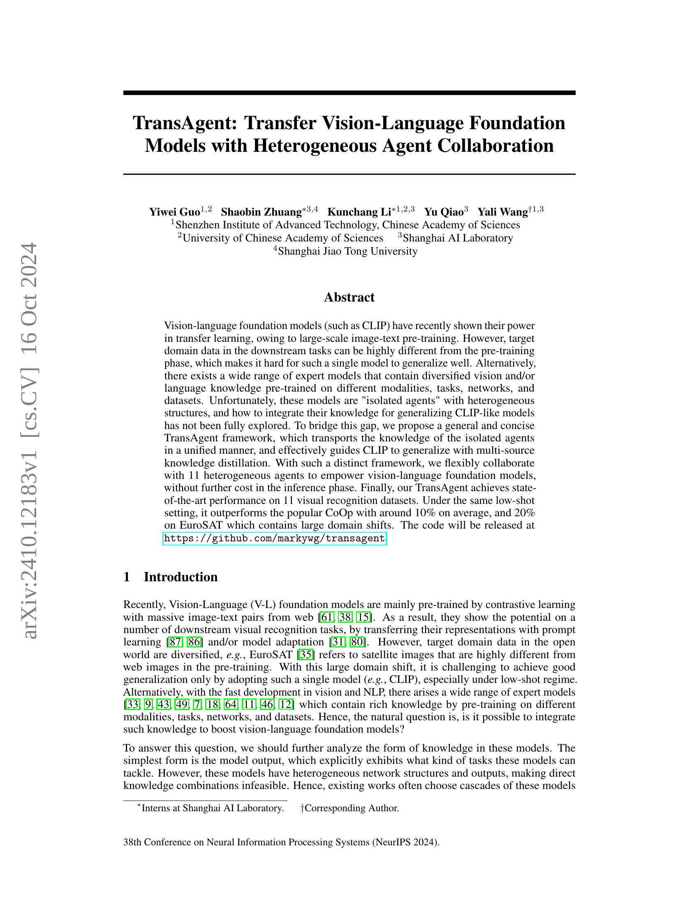
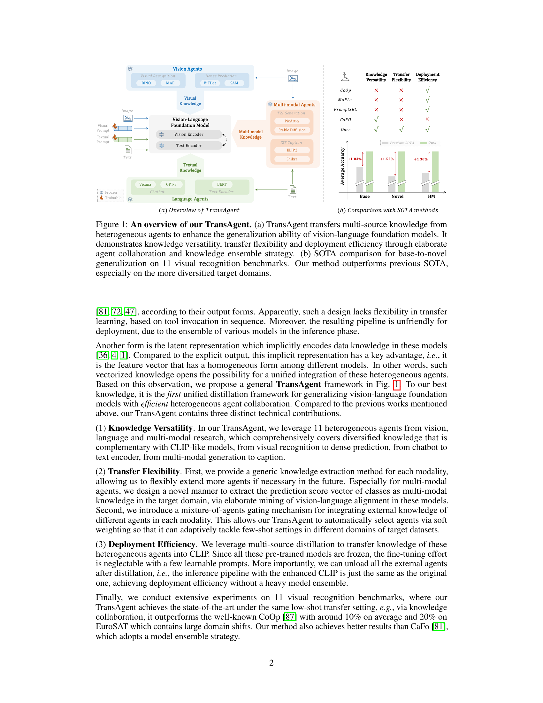

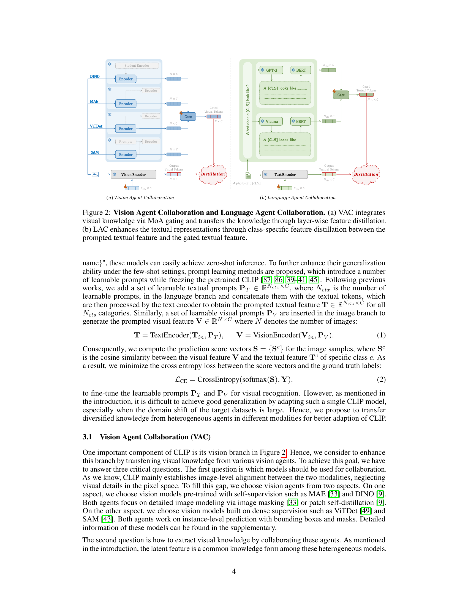
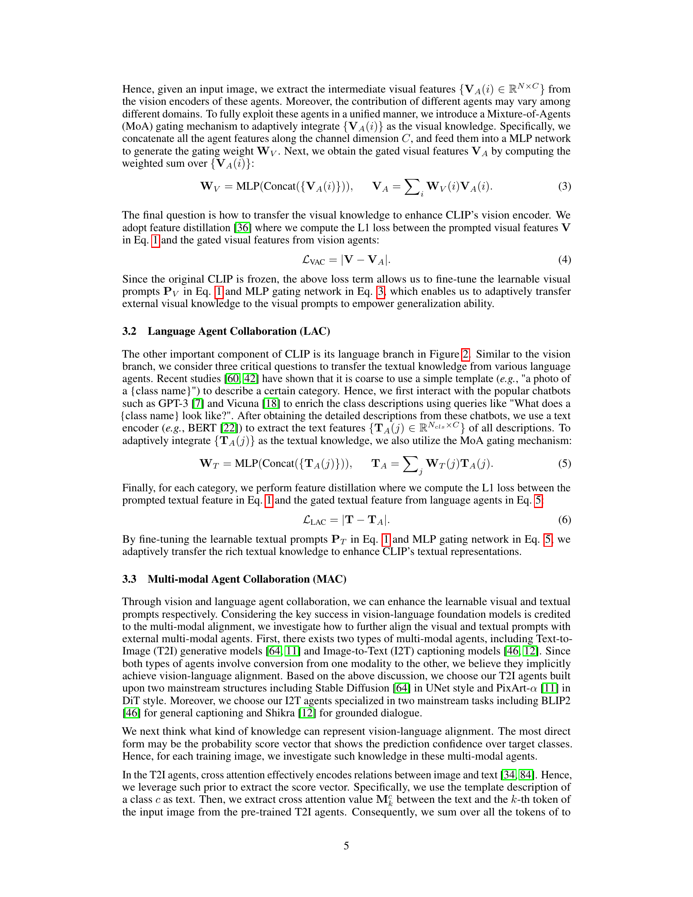

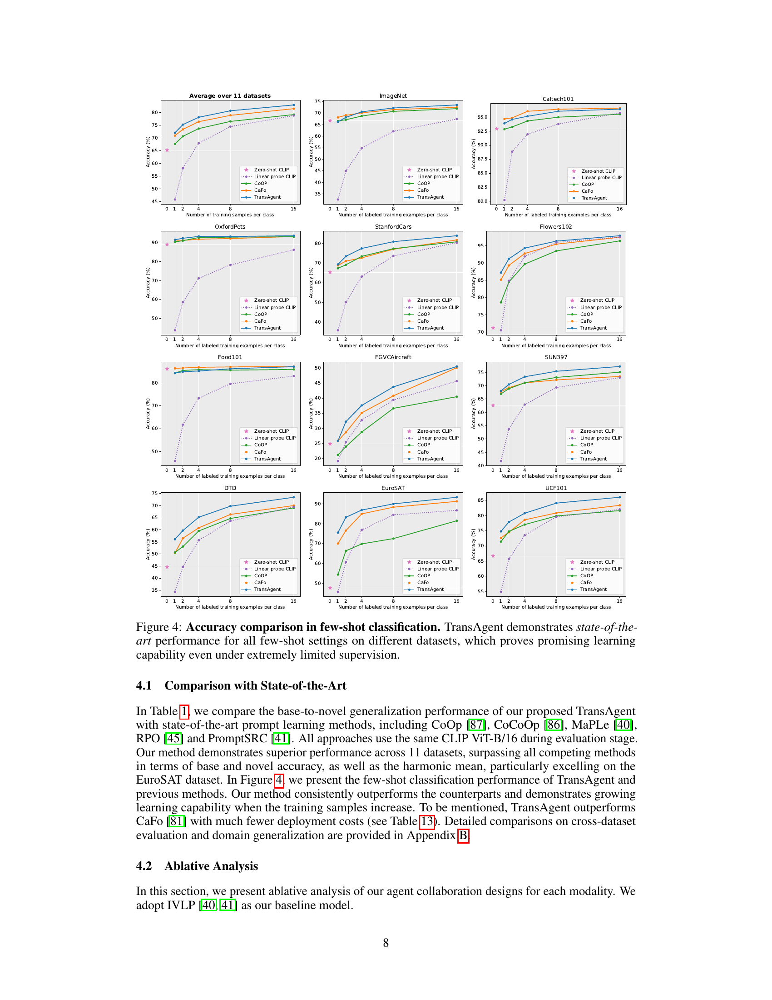
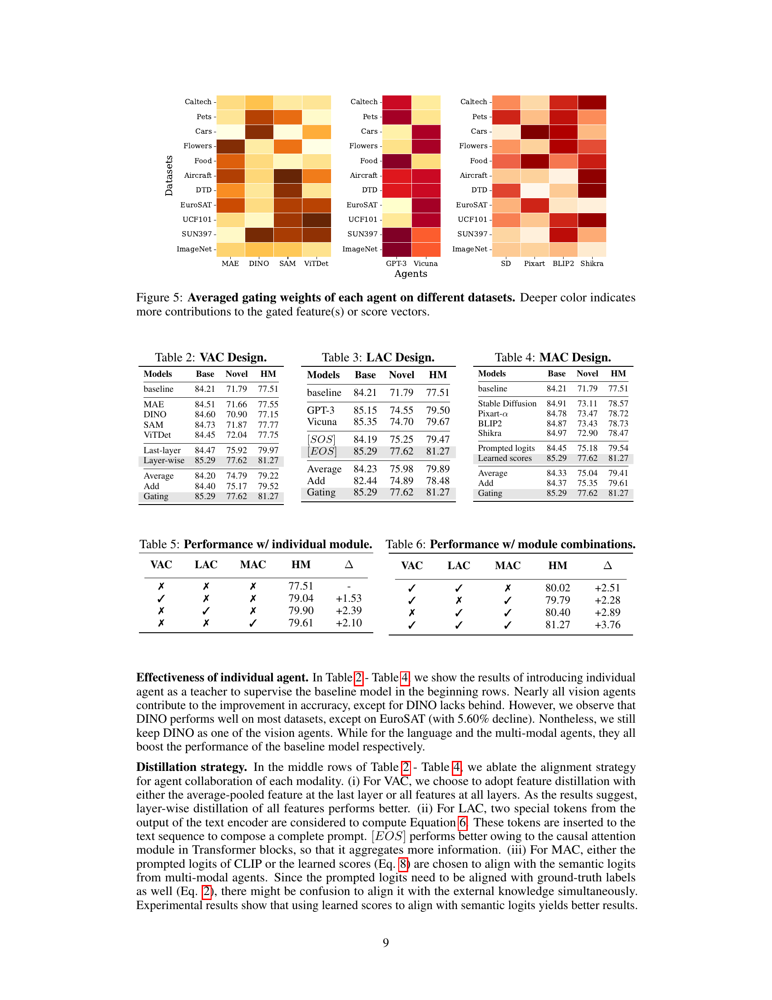
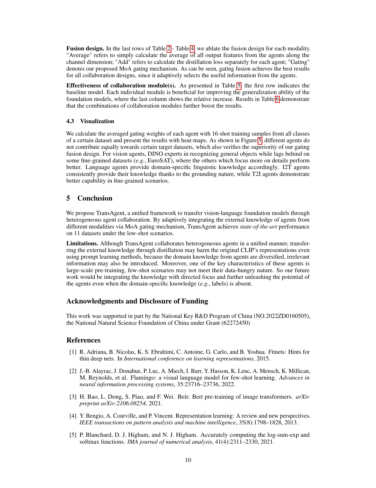
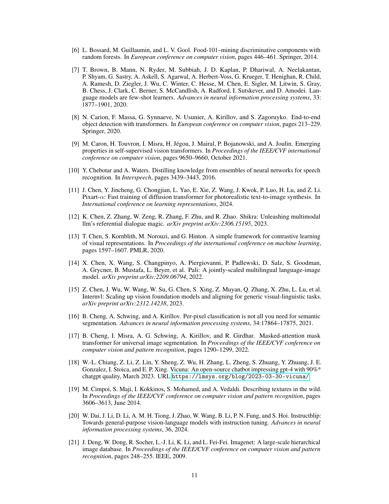

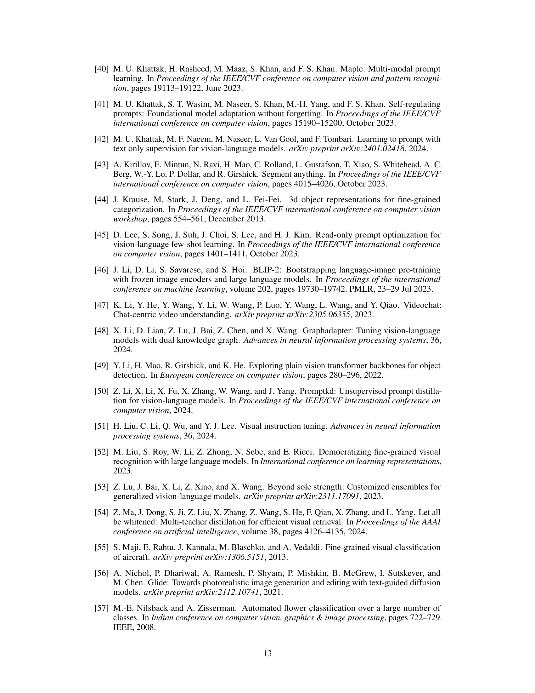

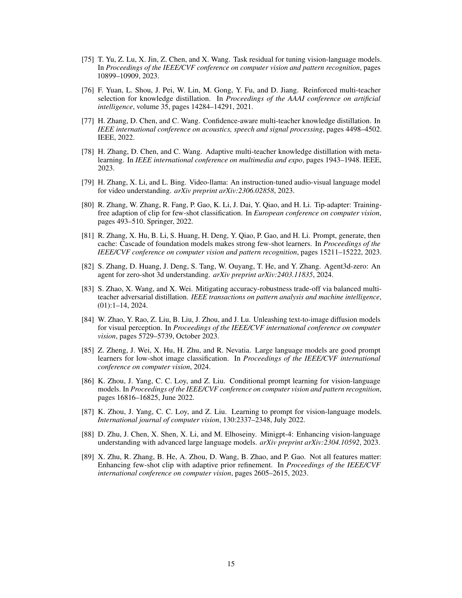
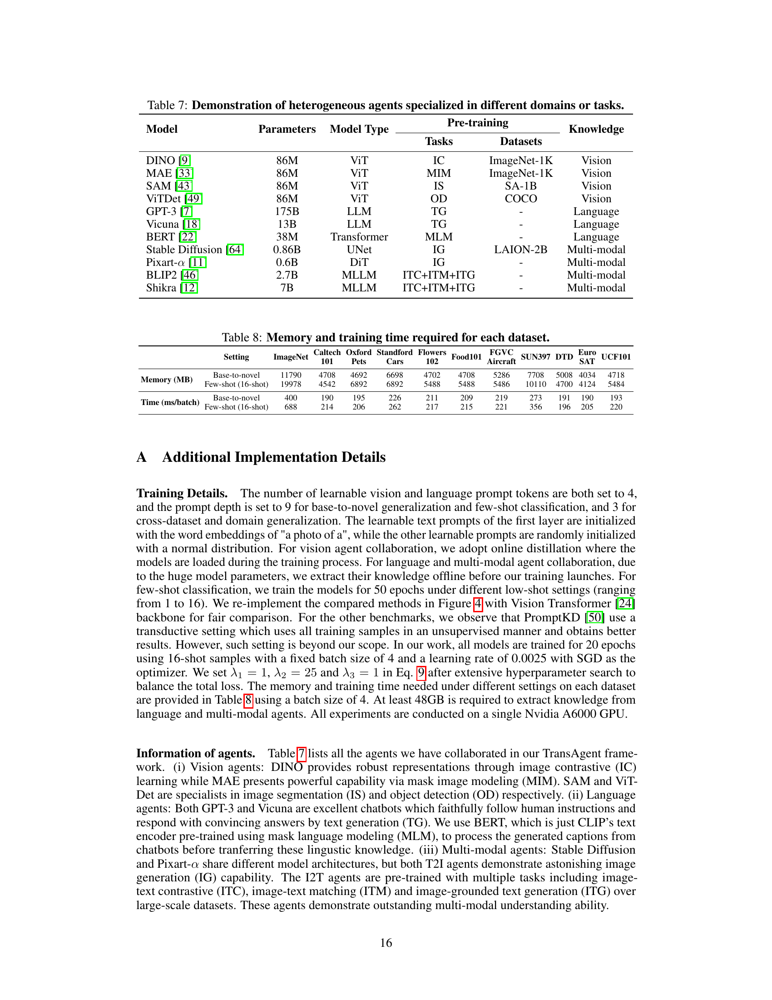
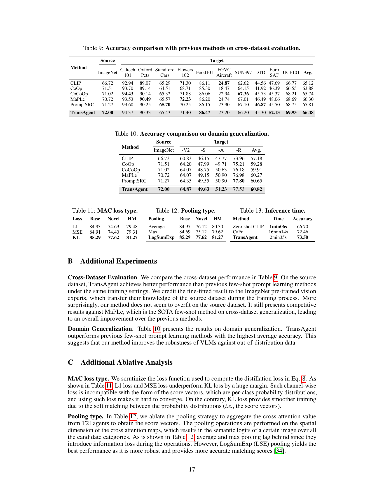

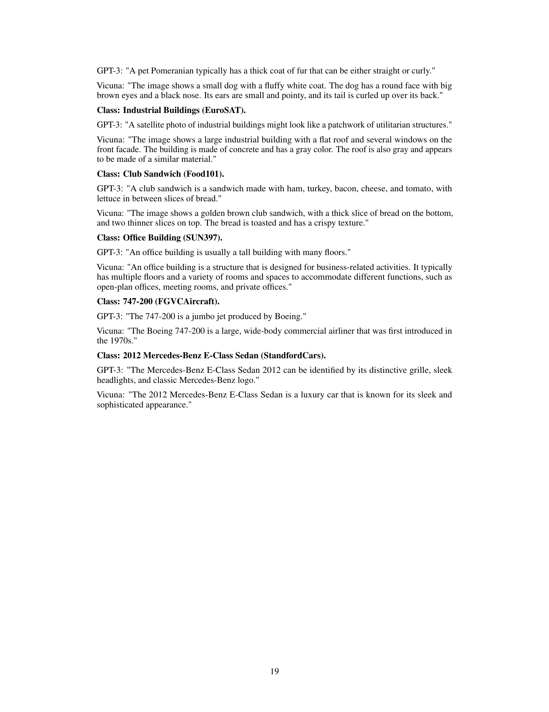
