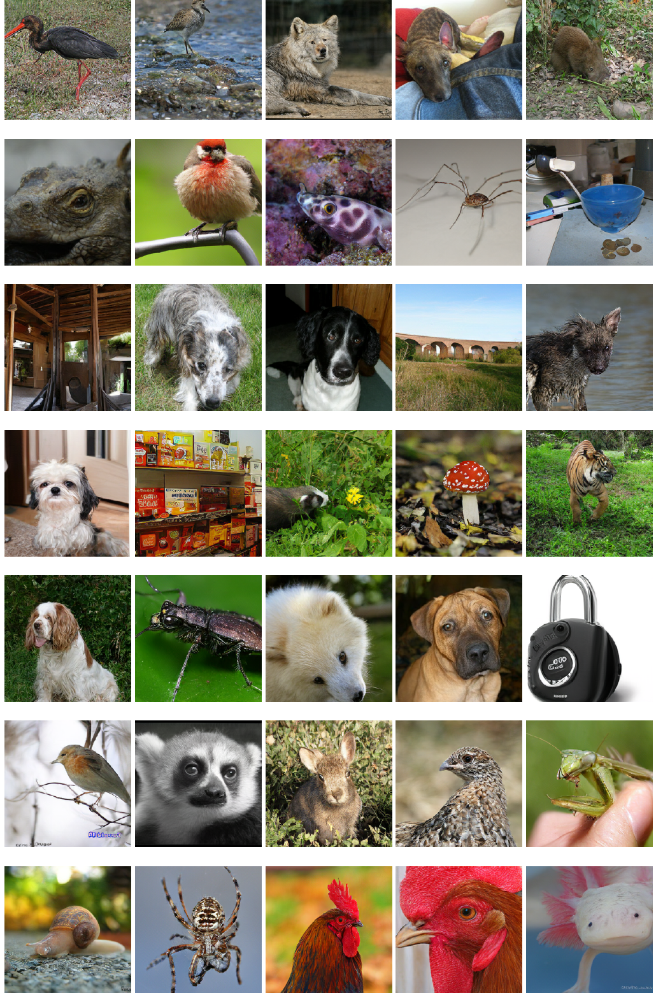
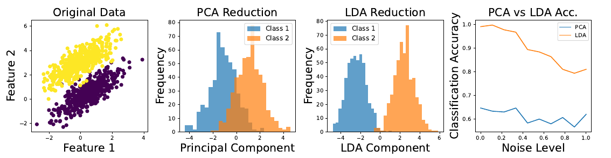
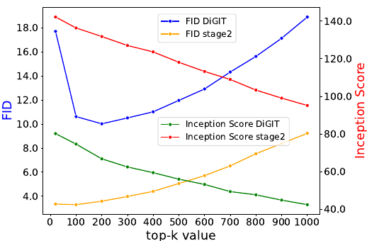
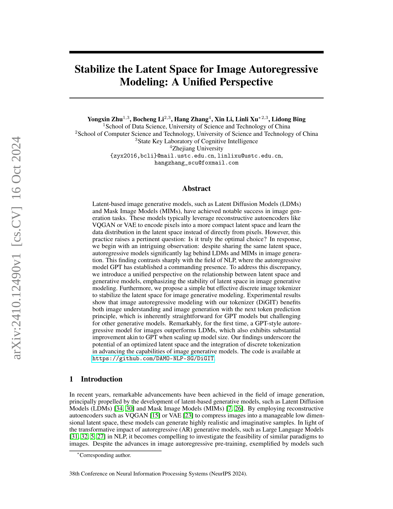
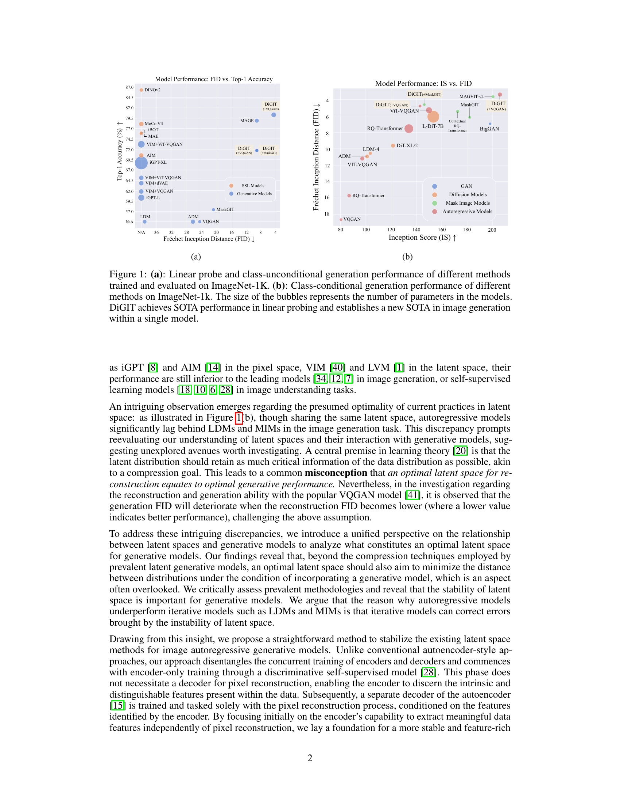
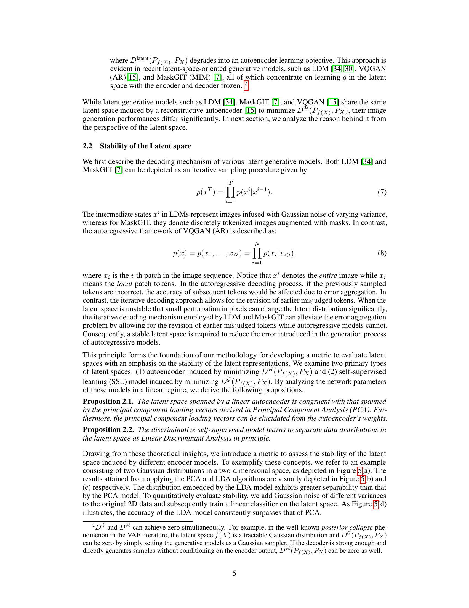
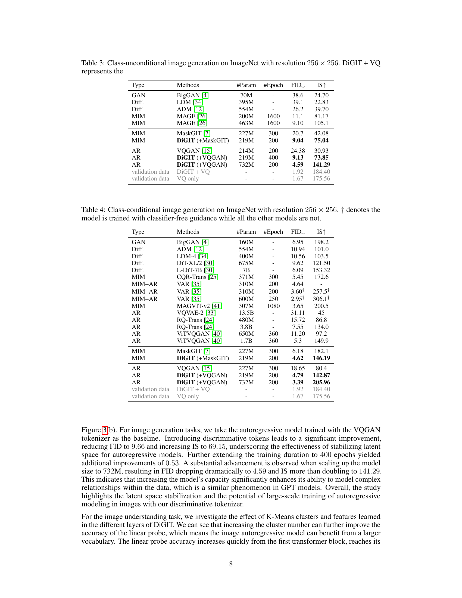
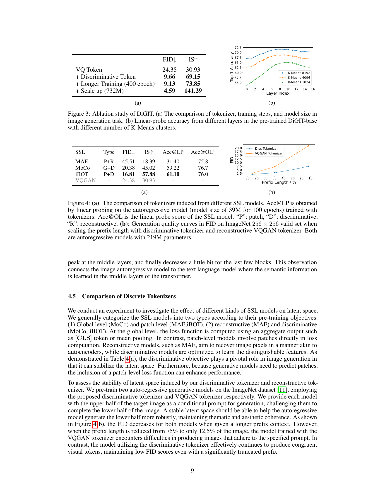
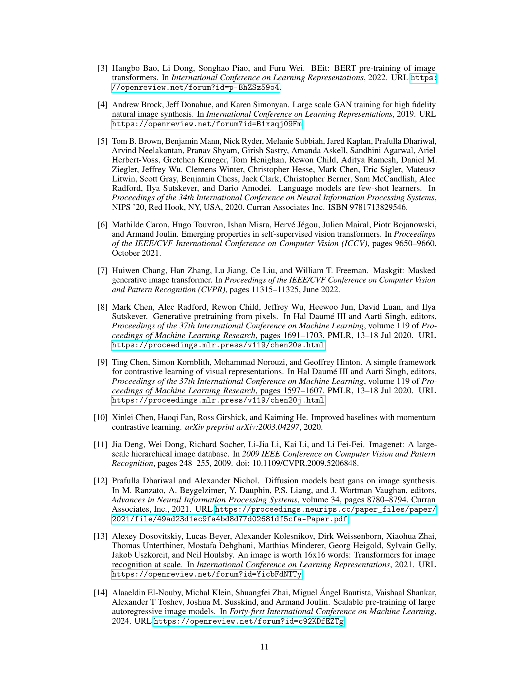
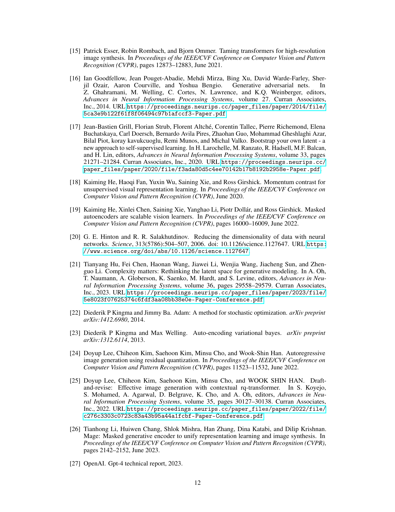

### TL;DR



This research focuses on improving image generation using autoregressive models.  These models generate images piece-by-piece, like predicting the next word in a sentence.  The challenge is that existing image models often use a 'latent space' (a compressed representation of the image) that isn't ideal for this type of sequential generation. The researchers found that the instability of this latent space hampered performance.  They introduced a new method using a 'tokenizer', similar to how language models break down text into words, to create a more stable representation. This 'discriminative image tokenizer' dramatically improves the model's ability to generate high-quality images and understand image content.  The performance is especially impressive when scaling up the size of the model, showing results comparable to the most advanced language models.  In short, this study provides a new way to represent images that unlocks the full potential of autoregressive models for image tasks.




 &nbsp; read the paper on arXiv

  

 &nbsp; on Hugging Face


#### Why does it matter?
This paper is crucial for researchers in image generation and self-supervised learning. It challenges conventional wisdom about optimal latent spaces, proposing a novel approach to stabilize them for autoregressive models.  This opens avenues for improved image understanding and generation, particularly for large-scale models akin to successful language models like GPT. The findings are relevant to current research trends in both areas and stimulate further investigation into latent space optimization and the role of tokenization.
#### Key Takeaways


 A new method stabilizes latent space for image autoregressive models, leading to improved image understanding and generation. 



 The proposed discrete image tokenizer enhances performance significantly, especially with larger models. 



 The findings challenge existing assumptions about optimal latent space configurations for generative models. 


------
#### Visual Insights

> 🔼 The figure illustrates the architecture of the DiGIT model, showing how image patches are processed through a discriminative SSL model, tokenized using K-means clustering, and fed into a transformer for autoregressive modeling.
> 

> 
read the caption

> Figure 2: The architecture of DIGIT.
> 

> 🔼 The chart compares the performance of different image generation methods on ImageNet in terms of FID (Fréchet Inception Distance) and Top-1 Accuracy, showing DIGIT's superior performance.
> 

> 
read the caption

> Figure 1: (a): Linear probe and class-unconditional generation performance of different methods trained and evaluated on ImageNet-1K. (b): Class-conditional generation performance of different methods on ImageNet-1k. The size of the bubbles represents the number of parameters in the models. DIGIT achieves SOTA performance in linear probing and establishes a new SOTA in image generation within a single model.
> 


<table id='1' style='font-size:16px'><tr><td>SNR</td><td>30</td><td>25</td><td>20</td><td>15</td><td>10</td><td>5</td><td>1</td><td>0.01</td></tr><tr><td>VQ Token change ↓</td><td>0.187</td><td>0.317</td><td>0.487</td><td>0.663</td><td>0.805</td><td>0.901</td><td>0.948</td><td>0.956</td></tr><tr><td>Disc Token change ↓</td><td>0.114</td><td>0.178</td><td>0.260</td><td>0.355</td><td>0.457</td><td>0.570</td><td>0.687</td><td>0.721</td></tr><tr><td>VQ Token cos-sim ↑</td><td>0.972</td><td>0.949</td><td>0.910</td><td>0.853</td><td>0.777</td><td>0.682</td><td>0.594</td><td>0.571</td></tr><tr><td>Disc Token cos-sim ↑</td><td>0.975</td><td>0.960</td><td>0.940</td><td>0.916</td><td>0.888</td><td>0.855</td><td>0.816</td><td>0.803</td></tr></table>

> 🔼 Table 1 shows the stability of latent spaces induced by VQ Token and Discriminative Token under different noise levels, measured by the rate of change in tokens and cosine similarity.
> 

> 
read the caption

> Table 1: The stability of latent spaces induced from VQ Token and Discriminative Token (introduced in Section 3), assessed across different Signal-to-Noise Ratio (SNR) levels to evaluate performance under varying signal and noise conditions.
> 

### More visual insights

More on figures

> 🔼 Figure 7 shows several examples of images generated by the DiGIT model on ImageNet with a resolution of 256x256 pixels.
> 

> 
read the caption

> Figure 7: Class-unconditional image generation results on ImageNet 256x256 by DiGIT.
> 

> 🔼 The figure shows a comparison of different image generation models' performance on ImageNet-1K, highlighting DIGIT's superior performance in both linear probing and image generation.
> 

> 
read the caption

> Figure 1: (a): Linear probe and class-unconditional generation performance of different methods trained and evaluated on ImageNet-1K. (b): Class-conditional generation performance of different methods on ImageNet-1k. The size of the bubbles represents the number of parameters in the models. DIGIT achieves SOTA performance in linear probing and establishes a new SOTA in image generation within a single model.
> 

More on charts

: Linear probe and class-unconditional generation performance of different methods trained and evaluated on ImageNet-1K. (b): Class-conditional generation performance of different methods on ImageNet-1k. The size of the bubbles represents the number of parameters in the models. DIGIT achieves SOTA performance in linear probing and establishes a new SOTA in image generation within a single model.")

> 🔼 The chart compares the performance of different image generation methods on ImageNet, showing DIGIT's superior performance in both linear probing and class-conditional generation.
> 

> 
read the caption

> Figure 1: (a): Linear probe and class-unconditional generation performance of different methods trained and evaluated on ImageNet-1K. (b): Class-conditional generation performance of different methods on ImageNet-1k. The size of the bubbles represents the number of parameters in the models. DIGIT achieves SOTA performance in linear probing and establishes a new SOTA in image generation within a single model.
> 

 The comparison of tokenizer, training steps, and model size in image generation task. (b) Linear-probe accuracy from different layers in the pre-trained DiGIT-base with different number of K-Means clusters.")

> 🔼 The chart displays the ablation study results of DiGIT, showing the impact of different tokenizers, training durations, model sizes on image generation and the linear probe accuracy across different layers of the model.
> 

> 
read the caption

> Figure 3: Ablation study of DiGIT. (a) The comparison of tokenizer, training steps, and model size in image generation task. (b) Linear-probe accuracy from different layers in the pre-trained DiGIT-base with different number of K-Means clusters.
> 

: The comparison of tokenizers induced from different SSL models. Acc@LP is obtained by linear probing on the autoregressive model (model size of 39M for 100 epochs) trained with tokenizers. Acc@OL is the linear probe score of the SSL model. 'P': patch, 'D': discriminative, 'R': reconstructive. (b): Generation quality curves in FID on ImageNet 256 × 256 valid set when scaling the prefix length with discriminative tokenizer and reconstructive VQGAN tokenizer. Both are autoregressive models with 219M parameters.")

> 🔼 The chart compares the performance of different tokenizers (discriminative vs. reconstructive) in image generation, showing the discriminative tokenizer's superior robustness to truncated input sequences.
> 

> 
read the caption

> Figure 4: (a): The comparison of tokenizers induced from different SSL models. Acc@LP is obtained by linear probing on the autoregressive model (model size of 39M for 100 epochs) trained with tokenizers. Acc@OL is the linear probe score of the SSL model. 'P': patch, 'D': discriminative, 'R': reconstructive. (b): Generation quality curves in FID on ImageNet 256 × 256 valid set when scaling the prefix length with discriminative tokenizer and reconstructive VQGAN tokenizer. Both are autoregressive models with 219M parameters.
> 

> 🔼 The chart compares the performance of Principal Component Analysis (PCA) and Linear Discriminant Analysis (LDA) in separating two classes of data points under varying levels of noise.
> 

> 
read the caption

> Figure 5: Toy example of PCA and LDA.
> 

> 🔼 The chart displays the FID and Inception Score of the DiGIT-base model for image generation, varying the top-p and top-k sampling strategies.
> 

> 
read the caption

> Figure 6: FID and Inception Score as a function of top-k, top-p sampling on the image generation task with DiGIT-base. The decoding temperature is fixed to 1.0. The 'stage2' denotes the autoregressive model for pixel rendering.
> 

> 🔼 The chart displays the FID and Inception Score for DiGIT-base model performance on image generation, varying the top-k and top-p sampling parameters.
> 

> 
read the caption

> Figure 6: FID and Inception Score as a function of top-k, top-p sampling on the image generation task with DiGIT-base. The decoding temperature is fixed to 1.0. The 'stage2' denotes the autoregressive model for pixel rendering.
> 

More on tables


 <table id='1' style='font-size:14px'><tr><td>Methods</td><td># Tokens</td><td>Features</td><td># Params</td><td>Top-1 Acc.↑</td></tr><tr><td>iGPT-L 8</td><td>32 x 32</td><td>1536</td><td>1362M</td><td>60.3</td></tr><tr><td>iGPT-XL</td><td>64 X 64</td><td>3072</td><td>6801M</td><td>68.7</td></tr><tr><td>VIM+VQGAN 40</td><td>32 X 32</td><td>1024</td><td>650M</td><td>61.8</td></tr><tr><td>VIM+dVAE 40</td><td>32 X 32</td><td>1024</td><td>650M</td><td>63.8</td></tr><tr><td>VIM+ViT-VQGAN 40</td><td>32 x 32</td><td>1024</td><td>650M</td><td>65.1</td></tr><tr><td>VIM+ViT-VQGAN 40</td><td>32 X 32</td><td>2048</td><td>1697M</td><td>73.2</td></tr><tr><td>AIM 14</td><td>16 X 16</td><td>1536</td><td>0.6B</td><td>70.5</td></tr><tr><td>DiGIT (Ours)</td><td>16 X 16</td><td>1024</td><td>219M</td><td>71.7</td></tr><tr><td>DiGIT (Ours)</td><td>16 X 16</td><td>1536</td><td>732M</td><td>80.3</td></tr></table>
> 🔼 {{ table.description }}
> 

> 
read the caption

> {{ table.caption }}
> 

> Table 2 presents the linear probe accuracy of different image autoregressive generative models on ImageNet, showing the impact of the number of tokens, features, parameters, and resulting Top-1 accuracy.


<table id='1' style='font-size:14px'><tr><td>Type</td><td>Methods</td><td>#Param</td><td>#Epoch</td><td>FID↓</td><td>IS↑</td></tr><tr><td>GAN</td><td>BigGAN 4</td><td>70M</td><td>-</td><td>38.6</td><td>24.70</td></tr><tr><td>Diff.</td><td>LDM 34</td><td>395M</td><td>-</td><td>39.1</td><td>22.83</td></tr><tr><td>Diff.</td><td>ADM 12</td><td>554M</td><td>-</td><td>26.2</td><td>39.70</td></tr><tr><td>MIM</td><td>MAGE 26</td><td>200M</td><td>1600</td><td>11.1</td><td>81.17</td></tr><tr><td>MIM</td><td>MAGE 26</td><td>463M</td><td>1600</td><td>9.10</td><td>105.1</td></tr><tr><td>MIM</td><td>MaskGIT 7</td><td>227M</td><td>300</td><td>20.7</td><td>42.08</td></tr><tr><td>MIM</td><td>DiGIT (+MaskGIT)</td><td>219M</td><td>200</td><td>9.04</td><td>75.04</td></tr><tr><td>AR</td><td>VQGAN 15</td><td>214M</td><td>200</td><td>24.38</td><td>30.93</td></tr><tr><td>AR</td><td>DiGIT (+VQGAN)</td><td>219M</td><td>400</td><td>9.13</td><td>73.85</td></tr><tr><td>AR</td><td>DiGIT (+VQGAN)</td><td>732M</td><td>200</td><td>4.59</td><td>141.29</td></tr><tr><td>validation data</td><td>DiGIT + VQ</td><td>-</td><td>、</td><td>1.92</td><td>184.40</td></tr><tr><td>validation data</td><td>VQ only</td><td>-</td><td>-</td><td>1.67</td><td>175.56</td></tr></table>
> 🔼 {{ table.description }}
> 

> 
read the caption

> {{ table.caption }}
> 

> Table 3 presents a comparison of different image generation models on ImageNet in terms of FID and IS scores, highlighting the superior performance of DiGIT.


<table id='3' style='font-size:14px'><tr><td>Type</td><td>Methods</td><td>#Param</td><td>#Epoch</td><td>FID↓</td><td>IS↑</td></tr><tr><td>GAN</td><td>BigGAN 4</td><td>160M</td><td>-</td><td>6.95</td><td>198.2</td></tr><tr><td>Diff.</td><td>ADM 12</td><td>554M</td><td>-</td><td>10.94</td><td>101.0</td></tr><tr><td>Diff.</td><td>LDM-4 34</td><td>400M</td><td>-</td><td>10.56</td><td>103.5</td></tr><tr><td>Diff.</td><td>DiT-XL/2 30</td><td>675M</td><td>-</td><td>9.62</td><td>121.50</td></tr><tr><td>Diff.</td><td>L-DiT-7B 30</td><td>7B</td><td>-</td><td>6.09</td><td>153.32</td></tr><tr><td>MIM</td><td>CQR-Trans 25</td><td>371M</td><td>300</td><td>5.45</td><td>172.6</td></tr><tr><td>MIM+AR</td><td>VAR 35</td><td>310M</td><td>200</td><td>4.64</td><td>-</td></tr><tr><td>MIM+AR</td><td>VAR 35</td><td>310M</td><td>200</td><td>3.60†</td><td>257.5†</td></tr><tr><td>MIM+AR</td><td>VAR 35</td><td>600M</td><td>250</td><td>2.95t</td><td>306.1†</td></tr><tr><td>MIM</td><td>MAGVIT-v2 41</td><td>307M</td><td>1080</td><td>3.65</td><td>200.5</td></tr><tr><td>AR</td><td>VQVAE-2 33</td><td>13.5B</td><td>-</td><td>31.11</td><td>45</td></tr><tr><td>AR</td><td>RQ-Trans 24</td><td>480M</td><td>-</td><td>15.72</td><td>86.8</td></tr><tr><td>AR</td><td>RQ-Trans 24</td><td>3.8B</td><td>-</td><td>7.55</td><td>134.0</td></tr><tr><td>AR</td><td>ViTVQGAN 40</td><td>650M</td><td>360</td><td>11.20</td><td>97.2</td></tr><tr><td>AR</td><td>ViTVQGAN 40</td><td>1.7B</td><td>360</td><td>5.3</td><td>149.9</td></tr><tr><td>MIM</td><td>MaskGIT 7</td><td>227M</td><td>300</td><td>6.18</td><td>182.1</td></tr><tr><td>MIM</td><td>DiGIT (+MaskGIT)</td><td>219M</td><td>200</td><td>4.62</td><td>146.19</td></tr><tr><td>AR</td><td>VQGAN 15</td><td>227M</td><td>300</td><td>18.65</td><td>80.4</td></tr><tr><td>AR</td><td>DiGIT (+VQGAN)</td><td>219M</td><td>200</td><td>4.79</td><td>142.87</td></tr><tr><td>AR</td><td>DiGIT (+VQGAN)</td><td>732M</td><td>200</td><td>3.39</td><td>205.96</td></tr><tr><td>validation data</td><td>DiGIT + VQ</td><td>-</td><td>-</td><td>1.92</td><td>184.40</td></tr><tr><td>validation data</td><td>VQ only</td><td>-</td><td>-</td><td>1.67</td><td>175.56</td></tr></table>
> 🔼 {{ table.description }}
> 

> 
read the caption

> {{ table.caption }}
> 

> Table 4 presents a comparison of different generative models' performance on class-conditional image generation, measured by FID and IS scores, highlighting the superior results obtained with DiGIT.


<table id='0' style='font-size:22px'><tr><td></td><td>FID↓</td><td>IS↑</td></tr><tr><td>VQ Token</td><td>24.38</td><td>30.93</td></tr><tr><td>+ Discriminative Token</td><td>9.66</td><td>69.15</td></tr><tr><td>+ Longer Training (400 epoch)</td><td>9.13</td><td>73.85</td></tr><tr><td>+ Scale up (732M)</td><td>4.59</td><td>141.29</td></tr></table>
> 🔼 {{ table.description }}
> 

> 
read the caption

> {{ table.caption }}
> 

> The table shows a comparison of different image generation models' performance on ImageNet in terms of FID and IS scores, highlighting the superior performance of DiGIT.


<table id='4' style='font-size:16px'><tr><td>SSL</td><td>Type</td><td>FID↓</td><td>IS↑</td><td>Acc@LP</td><td>Acc@OL+</td></tr><tr><td>MAE</td><td>P+R</td><td>45.51</td><td>18.39</td><td>31.40</td><td>75.8</td></tr><tr><td>MoCo</td><td>G+D</td><td>20.38</td><td>45.02</td><td>59.22</td><td>76.7</td></tr><tr><td>iBOT</td><td>P+D</td><td>16.81</td><td>57.88</td><td>61.10</td><td>76.0</td></tr><tr><td>VQGAN</td><td>-</td><td>24.38</td><td>30.93</td><td>-</td><td></td></tr></table>
> 🔼 {{ table.description }}
> 

> 
read the caption

> {{ table.caption }}
> 

> Table 4 presents class-conditional image generation results on ImageNet, comparing different generative model types (GAN, Diffusion, MIM, AR) and their performance metrics (FID and IS).

### Full paper



