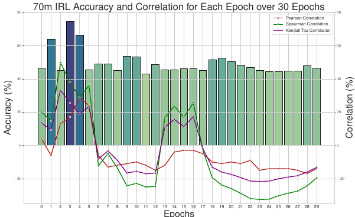
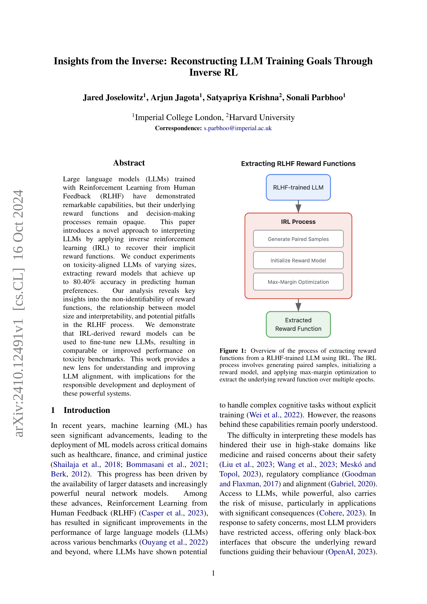
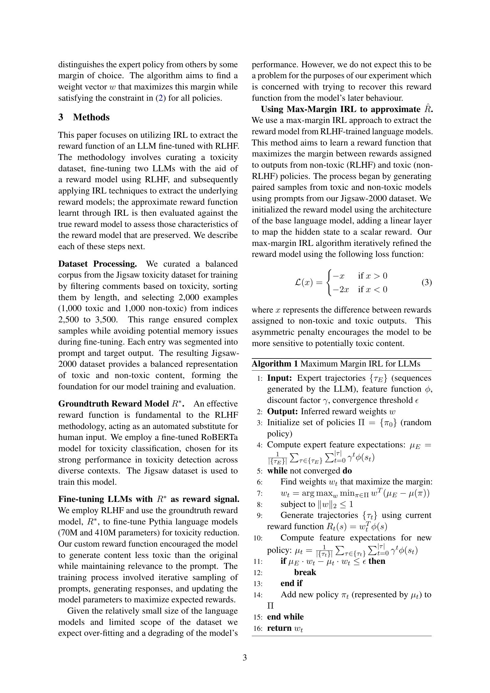
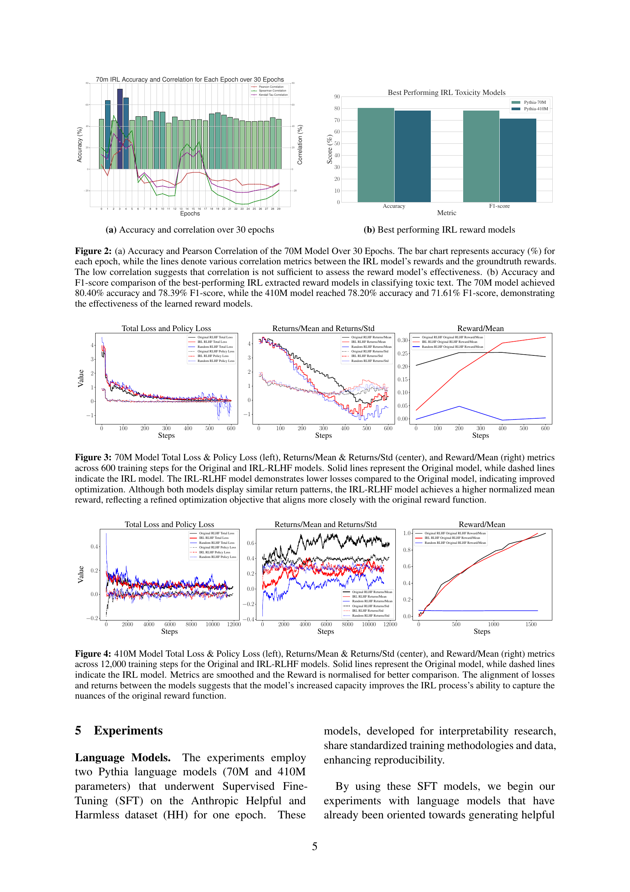
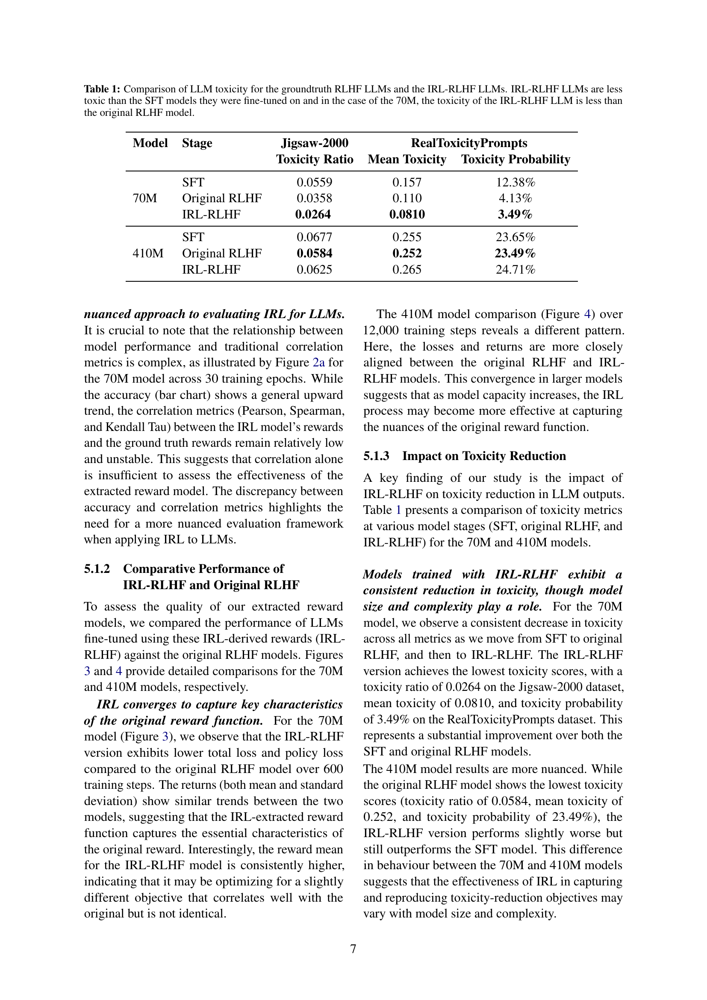
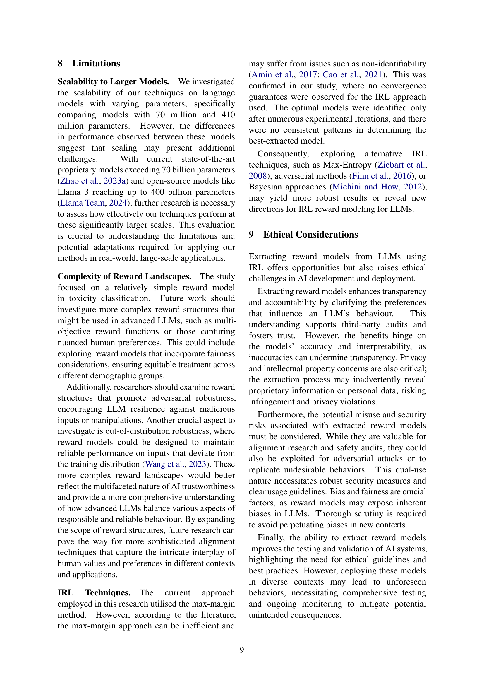

### TL;DR



This study explores the use of Inverse Reinforcement Learning (IRL) to understand the reward functions driving Large Language Models (LLMs) trained with Reinforcement Learning from Human Feedback (RLHF).  The researchers applied IRL to LLMs of varying sizes, successfully extracting reward models that accurately predict human preferences (up to 80%). The findings highlight the non-identifiability of reward functions, the relationship between model size and interpretability, and potential weaknesses in the RLHF process.  They demonstrated that these extracted reward models could improve new LLMs' performance on toxicity benchmarks. This work provides new insights into LLM alignment, with important implications for the responsible development and deployment of powerful AI systems.




 &nbsp; read the paper on arXiv

  

 &nbsp; on Hugging Face


#### Why does it matter?
This paper is crucial for researchers working on LLM interpretability and safety. It introduces a novel approach using IRL to understand LLMs' implicit reward functions, which is highly relevant to current concerns about LLM alignment and responsible AI development. The findings challenge existing assumptions, highlighting the non-identifiability of reward functions and the implications for model robustness and safety.  It also provides valuable insights and opens new avenues for future research in both IRL and LLM alignment.
#### Key Takeaways


 Inverse reinforcement learning can effectively recover reward functions in RLHF-trained LLMs. 



 Reward function non-identifiability poses a challenge for interpretability and safety. 



 Model size and complexity influence the effectiveness of IRL in extracting reward models. 


------
#### Visual Insights

> 🔼 The chart displays the accuracy and correlation metrics of the 70M model over 30 epochs, and compares the accuracy and F1-score of the best performing IRL extracted reward models in classifying toxic text.
> 

> 
read the caption

> Figure 2: (a) Accuracy and correlation over 30 epochs (b) Best performing IRL reward models
> 


<table id='1' style='font-size:18px'><tr><td rowspan="2">Model</td><td rowspan="2">Stage</td><td rowspan="2">Jigsaw-2000 Toxicity Ratio</td><td colspan="2">RealToxicityPrompts</td></tr><tr><td>Mean Toxicity</td><td>Toxicity Probability</td></tr><tr><td rowspan="3">70M</td><td>SFT</td><td>0.0559</td><td>0.157</td><td>12.38%</td></tr><tr><td>Original RLHF</td><td>0.0358</td><td>0.110</td><td>4.13%</td></tr><tr><td>IRL-RLHF</td><td>0.0264</td><td>0.0810</td><td>3.49%</td></tr><tr><td rowspan="3">410M</td><td>SFT</td><td>0.0677</td><td>0.255</td><td>23.65%</td></tr><tr><td>Original RLHF</td><td>0.0584</td><td>0.252</td><td>23.49%</td></tr><tr><td>IRL-RLHF</td><td>0.0625</td><td>0.265</td><td>24.71%</td></tr></table>

> 🔼 Table 1 compares the toxicity levels of 70M and 410M parameter LLMs across three training stages: supervised fine-tuning (SFT), original RLHF, and IRL-RLHF, using two toxicity datasets.
> 

> 
read the caption

> Table 1: Comparison of LLM toxicity for the groundtruth RLHF LLMs and the IRL-RLHF LLMs. IRL-RLHF LLMs are less toxic than the SFT models they were fine-tuned on and in the case of the 70M, the toxicity of the IRL-RLHF LLM is less than the original RLHF model.
> 

### More visual insights

More on charts

 Accuracy and Pearson Correlation of the 70M Model Over 30 Epochs. The bar chart represents accuracy (%) for each epoch, while the lines denote various correlation metrics between the IRL model's rewards and the groundtruth rewards. The low correlation suggests that correlation is not sufficient to assess the reward model's effectiveness. (b) Accuracy and F1-score comparison of the best-performing IRL extracted reward models in classifying toxic text. The 70M model achieved 80.40% accuracy and 78.39% F1-score, while the 410M model reached 78.20% accuracy and 71.61% F1-score, demonstrating the effectiveness of the learned reward models.")

> 🔼 The chart displays the accuracy and F1-score of the best performing IRL reward models (70M and 410M parameters) in classifying toxic text, showing the 70M model outperforming the 410M model.
> 

> 
read the caption

> Figure 2: (a) Accuracy and Pearson Correlation of the 70M Model Over 30 Epochs. The bar chart represents accuracy (%) for each epoch, while the lines denote various correlation metrics between the IRL model's rewards and the groundtruth rewards. The low correlation suggests that correlation is not sufficient to assess the reward model's effectiveness. (b) Accuracy and F1-score comparison of the best-performing IRL extracted reward models in classifying toxic text. The 70M model achieved 80.40% accuracy and 78.39% F1-score, while the 410M model reached 78.20% accuracy and 71.61% F1-score, demonstrating the effectiveness of the learned reward models.
> 

, Returns/Mean & Returns/Std (center), and Reward/Mean (right) metrics across 600 training steps for the Original and IRL-RLHF models. Solid lines represent the Original model, while dashed lines indicate the IRL-RLHF model. The IRL-RLHF model demonstrates lower losses compared to the Original model, indicating improved optimization. Although both models display similar return patterns, the IRL-RLHF model achieves a higher normalized mean reward, reflecting a refined optimization objective that aligns more closely with the original reward function.")

> 🔼 Figure 3 shows a comparison of training metrics (total loss, policy loss, returns, and reward) for the original RLHF model and the IRL-RLHF model across 600 training steps, highlighting the improved optimization and reward alignment achieved by the IRL-RLHF model.
> 

> 
read the caption

> Figure 3: 70M Model Total Loss & Policy Loss (left), Returns/Mean & Returns/Std (center), and Reward/Mean (right) metrics across 600 training steps for the Original and IRL-RLHF models. Solid lines represent the Original model, while dashed lines indicate the IRL-RLHF model. The IRL-RLHF model demonstrates lower losses compared to the Original model, indicating improved optimization. Although both models display similar return patterns, the IRL-RLHF model achieves a higher normalized mean reward, reflecting a refined optimization objective that aligns more closely with the original reward function.
> 

, Returns/Mean & Returns/Std (center), and Reward/Mean (right) metrics across 12,000 training steps for the Original and IRL-RLHF models. Solid lines represent the Original model, while dashed lines indicate the IRL model. Metrics are smoothed and the Reward is normalised for better comparison. The alignment of losses and returns between the models suggests that the model's increased capacity improves the IRL process's ability to capture the nuances of the original reward function.")

> 🔼 The chart displays the total loss, policy loss, returns (mean and standard deviation), and mean reward over 12,000 training steps for both the original RLHF model and the IRL-RLHF model, showing the model's performance across various metrics and highlighting the similarity in performance between the two models.
> 

> 
read the caption

> Figure 4: 410M Model Total Loss & Policy Loss (left), Returns/Mean & Returns/Std (center), and Reward/Mean (right) metrics across 12,000 training steps for the Original and IRL-RLHF models. Solid lines represent the Original model, while dashed lines indicate the IRL model. Metrics are smoothed and the Reward is normalised for better comparison. The alignment of losses and returns between the models suggests that the model's increased capacity improves the IRL process's ability to capture the nuances of the original reward function.
> 

 70M and (b) 410M models. The 70M model (a) exhibits a broad range of accuracy values, from below 30% to above 80%, indicating significant fluctuations across different runs. Similarly, the 410M model (b) shows variability in accuracy, ranging from approximately 30% to 70%, underscoring non-identifiability is a challenge in reward learning, where multiple reward functions can produce similar behaviours.")

> 🔼 The heatmaps in Figure 5 show the variability in accuracy across multiple runs of IRL with identical parameters for 70M and 410M language models over 30 epochs, highlighting the non-identifiability of reward functions.
> 

> 
read the caption

> Figure 5: Variation in accuracy when running IRL with the same parameters over 30 epochs for (a) 70M and (b) 410M models. The 70M model (a) exhibits a broad range of accuracy values, from below 30% to above 80%, indicating significant fluctuations across different runs. Similarly, the 410M model (b) shows variability in accuracy, ranging from approximately 30% to 70%, underscoring non-identifiability is a challenge in reward learning, where multiple reward functions can produce similar behaviours.
> 

### Full paper



