### TL;DR



This research introduces WorldMedQA-V, a valuable new dataset for evaluating Vision-Language Models (VLMs) in healthcare.  Current datasets often lack the diversity (languages, countries, image data) needed to fairly assess how well these models work in real-world healthcare settings, which can have serious implications for patient safety and equitable access. WorldMedQA-V aims to solve this problem by providing 568 multiple-choice questions, paired with images, and translated across four countries. The researchers tested several established VLMs, and the results highlighted the importance of including visual data to improve performance and ensure fair evaluation across languages.  This dataset is crucial because it helps developers build better AI models for medicine, making them safer and more useful for a wider range of patients and healthcare providers globally.




 &nbsp; read the paper on arXiv

  

 &nbsp; on Hugging Face


#### Why does it matter?
This paper is crucial for researchers working on multilingual and multimodal language models, especially in healthcare.  It addresses the critical need for robust benchmarks by introducing WorldMedQA-V, a dataset designed to overcome current limitations of existing datasets.  The findings will directly impact the development of more equitable and effective AI applications in diverse healthcare settings.
#### Key Takeaways


 WorldMedQA-V, a new multilingual, multimodal medical examination dataset, was created to address the lack of fair benchmarks for evaluating VLM performance. 



 The dataset includes 568 labeled multiple-choice QAs with medical images from four countries and their English translations. 



 Results show that including image data significantly improved model performance and consistency across languages, particularly in models with lower baseline performance. 


------
#### Visual Insights

> 🔼 The figure illustrates the four stages of the WorldMedQA-V dataset creation and evaluation: data collection, curation, evaluation, and sharing.
> 

> 
read the caption

> Figure 1: WorldMedQA-V dataset generation and evaluation workflows.
> 


<table id='3' style='font-size:14px'><tr><td>Country</td><td>Dataset</td><td>#QA</td><td>Language(s)</td><td>Modalities</td><td>Source</td><td>Years</td></tr><tr><td>China</td><td>MedQA (Jin et al., 2020)</td><td>34,251</td><td>Simplified Chi- nese</td><td>Text</td><td>MCMLE, Mainland China Medical Licensing Examina- tion</td><td>Not Clear</td></tr><tr><td>China</td><td>MLEC-QA (Li et al., 2021b)</td><td>136,236</td><td>Simplified Chi- nese</td><td>Text, Images</td><td>National Medical Licensing Examina- tion (NMLEC)</td><td>Not Clear</td></tr><tr><td>India</td><td>MedMCQA (Pal et al., 2022)</td><td>193,155</td><td>English</td><td>Text</td><td>AIIMS PG, NEET PG</td><td>1991-2022</td></tr><tr><td>Spain</td><td>Head-QA (Vilares and G�mez- Rodriguez, 2019b)</td><td>6,765</td><td>Spanish and En- glish</td><td>Text, Images</td><td>Ministerio de Sanidad, Consumo y Bienestar Social</td><td>2013-2017</td></tr><tr><td>Republic of Korea</td><td>KorMedMCQA (Kweon et al., 2024)</td><td>5,345</td><td>Korean and En- glish</td><td>Text</td><td>Korea Health Personnel Licens- ing Examination Institute</td><td>2012-2023</td></tr><tr><td>Sweden</td><td>MedQA-SWE (Hertzberg and Lokrantz, 2024b)</td><td>3,180</td><td>Swedish</td><td>Text</td><td>National Board of Health and Welfare, Umea University</td><td>2016-2023</td></tr><tr><td>Taiwan</td><td>MedQA (Jin et al., 2020)</td><td>14,123</td><td>Traditional Chi- nese</td><td>Text</td><td>TWMLE, Taiwan Medical Licensing Examination</td><td>Not Clear</td></tr><tr><td>United States</td><td>MedQA (Jin et al., 2020)</td><td>12,723</td><td>English</td><td>Text</td><td>USMLE, United States Medical Licensing Examina- tion</td><td>Not Clear</td></tr></table>

> 🔼 Table 1 summarizes existing publicly-available medical examination QA datasets by country, including the number of questions and answers, languages, modalities, source, and years.
> 

> 
read the caption

> Table 1: Summary of existing open-source Medical QA Datasets by Country.
> 

### More visual insights

More on figures

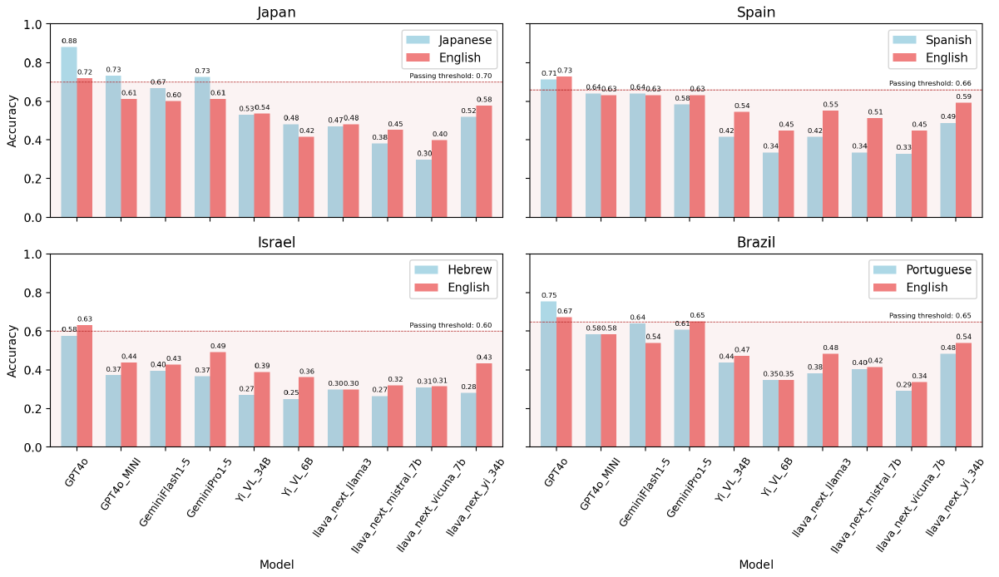

> 🔼 The figure illustrates the four stages of the WorldMedQA-V dataset creation and evaluation, namely data collection from four countries, data curation and translation, model evaluation, and data sharing.
> 

> 
read the caption

> Figure 1: WorldMedQA-V dataset generation and evaluation workflows.
> 

> 🔼 The figure illustrates the four stages of the WorldMedQA-V dataset creation and evaluation, including data collection, curation, evaluation of various models, and data sharing.
> 

> 
read the caption

> Figure 1: WorldMedQA-V dataset generation and evaluation workflows.
> 

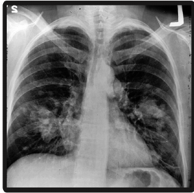

> 🔼 The figure illustrates the WorldMedQA-V dataset creation process, encompassing data collection from four countries, curation, evaluation using various multimodal language models, and finally sharing the dataset and code.
> 

> 
read the caption

> Figure 1: WorldMedQA-V dataset generation and evaluation workflows.
> 

More on tables


<table id='2' style='font-size:20px'><tr><td>Country</td><td>Language</td><td>Years</td><td>Option/QA</td><td>QAs, n (%)</td><td>Images, n (%)</td><td>Final, n (%)</td></tr><tr><td>Brazil</td><td>Portuguese</td><td>2011-2024</td><td>4.27</td><td>93 (12.8%)</td><td>94 (11.1%)</td><td>89 (15.7%)</td></tr><tr><td>Israel</td><td>Hebrew</td><td>2020-2023</td><td>4.00</td><td>200 (27.6%)</td><td>184 (21.6%)</td><td>186 (32.7%)</td></tr><tr><td>Japan</td><td>Japanese</td><td>2022-2024</td><td>5.00</td><td>306 (42.1%)</td><td>445 (52.4%)</td><td>168 (29.6%)</td></tr><tr><td>Spain</td><td>Spanish</td><td>2019-2023</td><td>4.00</td><td>127 (17.5%)</td><td>127 (14.9%)</td><td>125 (22.0%)</td></tr><tr><td>Total</td><td>4 Languages</td><td>2011-2024</td><td>4.00</td><td>726 (100%)</td><td>850 (100%)</td><td>568 (100%)</td></tr></table>
> 🔼 {{ table.description }}
> 

> 
read the caption

> {{ table.caption }}
> 

> Table 2 presents a summary of the WorldMedQA-V dataset's distribution across four countries, four languages, and includes the number of questions, images, and final evaluated samples.


<table id='2' style='font-size:16px'><tr><td>Country</td><td colspan="2">Brazil</td><td colspan="2">Israel</td><td colspan="2">Japan</td><td colspan="2">Spain</td></tr><tr><td>Model ↓ Setting →</td><td>T. only</td><td>T. & I.</td><td>T. only</td><td>T. & I.</td><td>T. only</td><td>T. & I.</td><td>T. only</td><td>T. & I.</td></tr><tr><td>GPT4o</td><td>0.684</td><td>0.743</td><td>0.619</td><td>0.654</td><td>0.683</td><td>0.618</td><td>0.840</td><td>0.829</td></tr><tr><td>GPT40-MINI</td><td>0.642</td><td>0.655</td><td>0.458</td><td>0.603</td><td>0.525</td><td>0.554</td><td>0.715</td><td>0.809</td></tr><tr><td>GeminiFlashl-5</td><td>0.612</td><td>0.536</td><td>0.533</td><td>0.655</td><td>0.591</td><td>0.521</td><td>0.594</td><td>0.767</td></tr><tr><td>GeminiProl-5</td><td>0.389</td><td>0.469</td><td>0.184</td><td>0.416</td><td>0.351</td><td>0.490</td><td>0.163</td><td>0.693</td></tr><tr><td>Yi-VL-34B</td><td>0.020</td><td>0.438</td><td>0.111</td><td>0.309</td><td>0.033</td><td>0.393</td><td>0.030</td><td>0.507</td></tr><tr><td>Yi-VL-6B</td><td>0.427</td><td>0.320</td><td>0.150</td><td>0.204</td><td>0.240</td><td>0.348</td><td>0.269</td><td>0.251</td></tr><tr><td>llava-next-llama3</td><td>0.429</td><td>0.441</td><td>0.401</td><td>0.380</td><td>0.269</td><td>0.264</td><td>0.435</td><td>0.433</td></tr><tr><td>llava-next-mistral-7b</td><td>0.498</td><td>0.310</td><td>0.148</td><td>0.243</td><td>0.153</td><td>0.234</td><td>0.466</td><td>0.348</td></tr><tr><td>llava-next-vicuna-7b</td><td>0.385</td><td>0.491</td><td>0.167</td><td>0.281</td><td>0.091</td><td>0.185</td><td>0.310</td><td>0.279</td></tr><tr><td>llava-next-yi-34b</td><td>0.592</td><td>0.635</td><td>0.208</td><td>0.223</td><td>0.393</td><td>0.373</td><td>0.594</td><td>0.488</td></tr></table>
> 🔼 {{ table.description }}
> 

> 
read the caption

> {{ table.caption }}
> 

> Table 3 shows Cohen's Kappa reflecting the agreement between model outputs in original languages and their English translations, categorized by country and whether images were included.


<table id='2' style='font-size:16px'><tr><td>Country</td><td colspan="2">Brazil</td><td colspan="2">Israel</td><td colspan="2">Japan</td><td colspan="2">Spain</td></tr><tr><td>Model ↓ Setting →</td><td>T. only</td><td>T. & I.</td><td>T. only</td><td>T. & I.</td><td>T. only</td><td>T. & I.</td><td>T. only</td><td>T. & I.</td></tr><tr><td>GPT4o</td><td>0.764</td><td>0.753</td><td>0.584</td><td>0.578</td><td>0.857</td><td>0.881</td><td>0.704</td><td>0.712</td></tr><tr><td>GPT40-MINI</td><td>0.562</td><td>0.584</td><td>0.389</td><td>0.373</td><td>0.762</td><td>0.732</td><td>0.632</td><td>0.640</td></tr><tr><td>GeminiFlashl-5</td><td>0.494</td><td>0.640</td><td>0.281</td><td>0.395</td><td>0.625</td><td>0.667</td><td>0.456</td><td>0.640</td></tr><tr><td>GeminiProl-5</td><td>0.427</td><td>0.607</td><td>0.135</td><td>0.368</td><td>0.601</td><td>0.726</td><td>0.312</td><td>0.584</td></tr><tr><td>Yi-VL-34B</td><td>0.034</td><td>0.438</td><td>0.011</td><td>0.270</td><td>0.077</td><td>0.530</td><td>0.024</td><td>0.416</td></tr><tr><td>Yi-VL-6B</td><td>0.348</td><td>0.348</td><td>0.238</td><td>0.249</td><td>0.446</td><td>0.482</td><td>0.328</td><td>0.336</td></tr><tr><td>llava-next-llama3</td><td>0.393</td><td>0.382</td><td>0.330</td><td>0.297</td><td>0.458</td><td>0.470</td><td>0.368</td><td>0.416</td></tr><tr><td>llava-next-mistral-7b</td><td>0.371</td><td>0.404</td><td>0.238</td><td>0.265</td><td>0.369</td><td>0.381</td><td>0.376</td><td>0.336</td></tr><tr><td>llava-next-vicuna-7b</td><td>0.281</td><td>0.292</td><td>0.276</td><td>0.308</td><td>0.256</td><td>0.298</td><td>0.304</td><td>0.328</td></tr><tr><td>llava-next-yi-34b</td><td>0.438</td><td>0.483</td><td>0.238</td><td>0.281</td><td>0.577</td><td>0.518</td><td>0.504</td><td>0.488</td></tr></table>
> 🔼 {{ table.description }}
> 

> 
read the caption

> {{ table.caption }}
> 

> Table 4 shows the accuracy of different models on four languages with and without image input.


<table id='4' style='font-size:16px'><tr><td>Country</td><td colspan="2">Brazil</td><td colspan="2">Israel</td><td colspan="2">Japan</td><td colspan="2">Spain</td></tr><tr><td>Model ↓ Setting →</td><td>T. only</td><td>T. & I.</td><td>T. only</td><td>T. & I.</td><td>T. only</td><td>T. & I.</td><td>T. only</td><td>T. & I.</td></tr><tr><td>GPT4o</td><td>0.685</td><td>0.674</td><td>0.589</td><td>0.632</td><td>0.690</td><td>0.720</td><td>0.720</td><td>0.728</td></tr><tr><td>GPT40-MINI</td><td>0.517</td><td>0.584</td><td>0.422</td><td>0.438</td><td>0.595</td><td>0.613</td><td>0.592</td><td>0.632</td></tr><tr><td>GeminiFlash1-5</td><td>0.494</td><td>0.539</td><td>0.286</td><td>0.427</td><td>0.571</td><td>0.601</td><td>0.544</td><td>0.632</td></tr><tr><td>GeminiProl-5</td><td>0.382</td><td>0.652</td><td>0.281</td><td>0.492</td><td>0.440</td><td>0.613</td><td>0.248</td><td>0.632</td></tr><tr><td>Yi-VL-34B</td><td>0.034</td><td>0.472</td><td>0.022</td><td>0.389</td><td>0.065</td><td>0.536</td><td>0.024</td><td>0.544</td></tr><tr><td>Yi-VL-6B</td><td>0.326</td><td>0.348</td><td>0.335</td><td>0.362</td><td>0.393</td><td>0.417</td><td>0.392</td><td>0.448</td></tr><tr><td>llava-next-llama3</td><td>0.494</td><td>0.483</td><td>0.314</td><td>0.297</td><td>0.435</td><td>0.482</td><td>0.568</td><td>0.552</td></tr><tr><td>llava-next-mistral-7b</td><td>0.438</td><td>0.416</td><td>0.319</td><td>0.319</td><td>0.500</td><td>0.452</td><td>0.496</td><td>0.512</td></tr><tr><td>llava-next-vicuna-7b</td><td>0.371</td><td>0.337</td><td>0.303</td><td>0.314</td><td>0.393</td><td>0.399</td><td>0.472</td><td>0.448</td></tr><tr><td>llava-next-yi-34b</td><td>0.528</td><td>0.539</td><td>0.459</td><td>0.432</td><td>0.577</td><td>0.577</td><td>0.600</td><td>0.592</td></tr></table>
> 🔼 {{ table.description }}
> 

> 
read the caption

> {{ table.caption }}
> 

> Table 4 shows the accuracy of various models in four languages with and without image input.

### Full paper


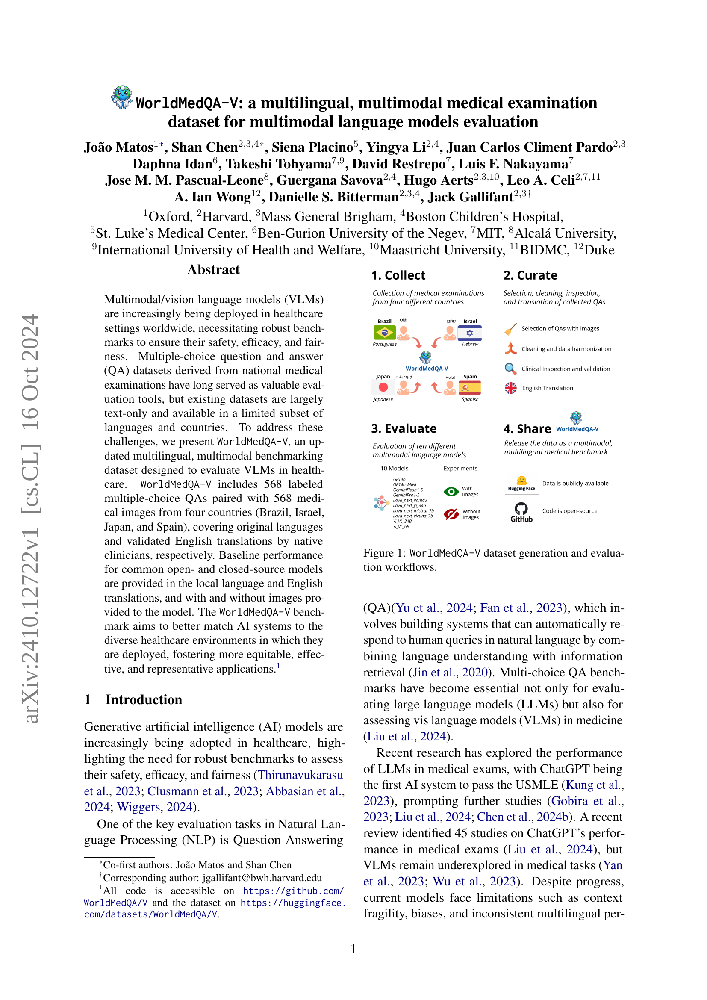
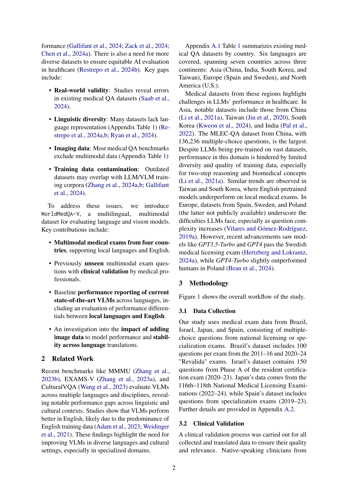
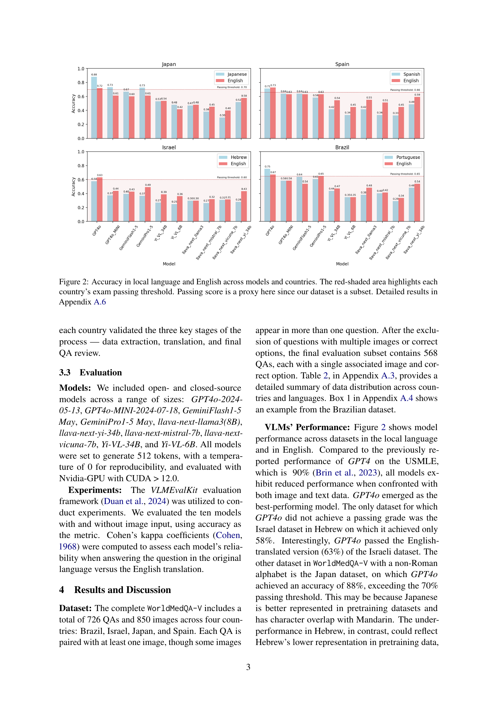

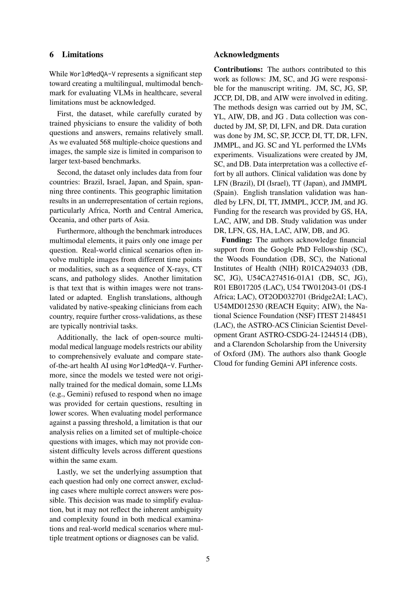

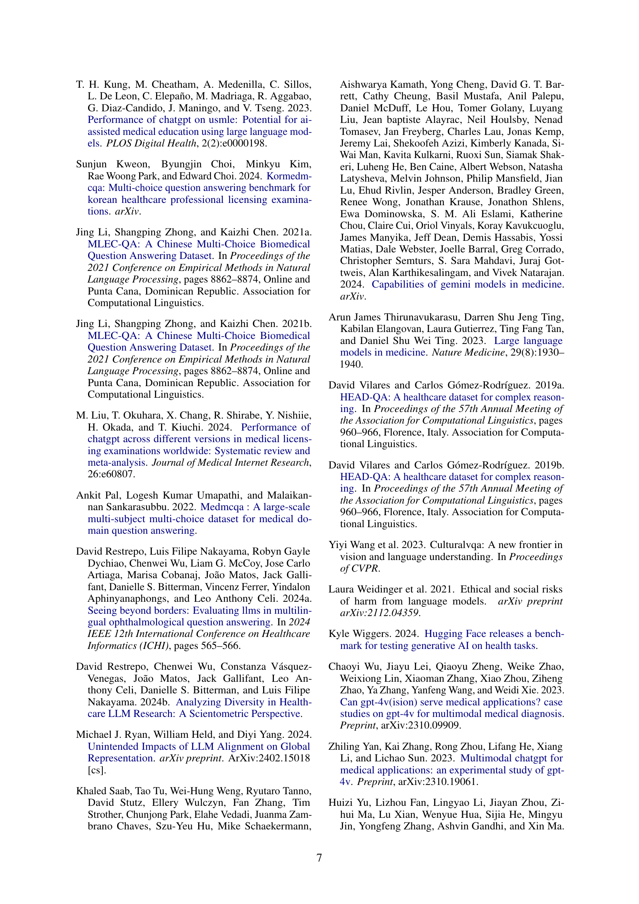
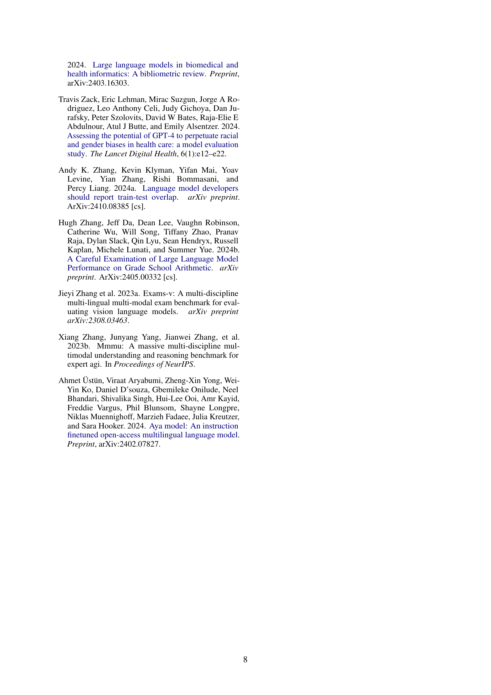
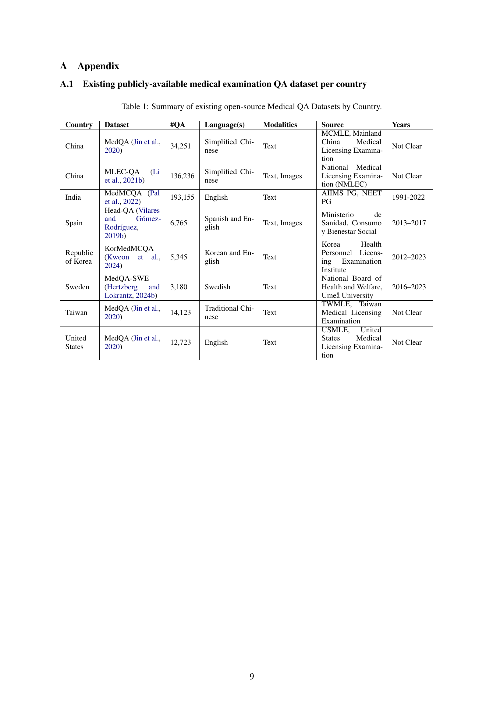
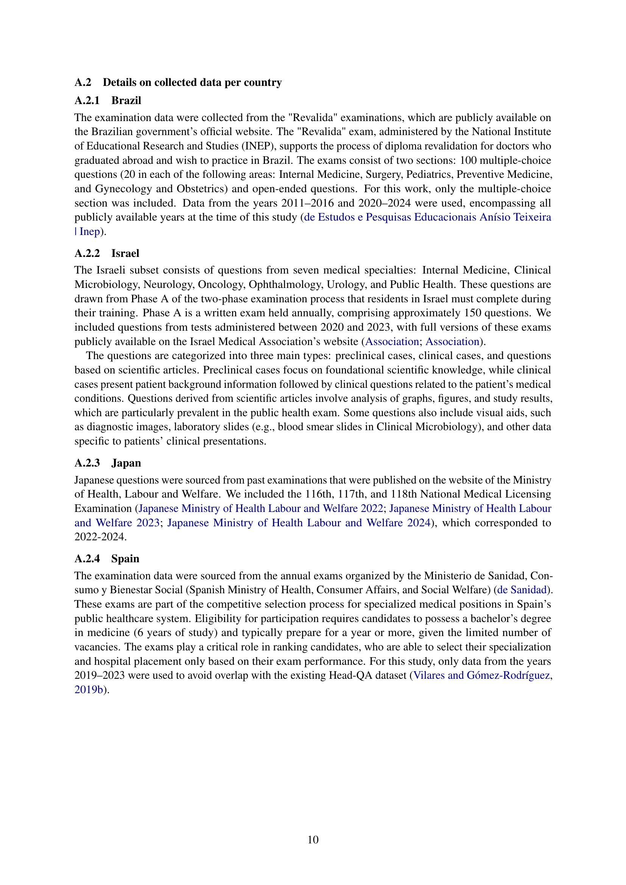

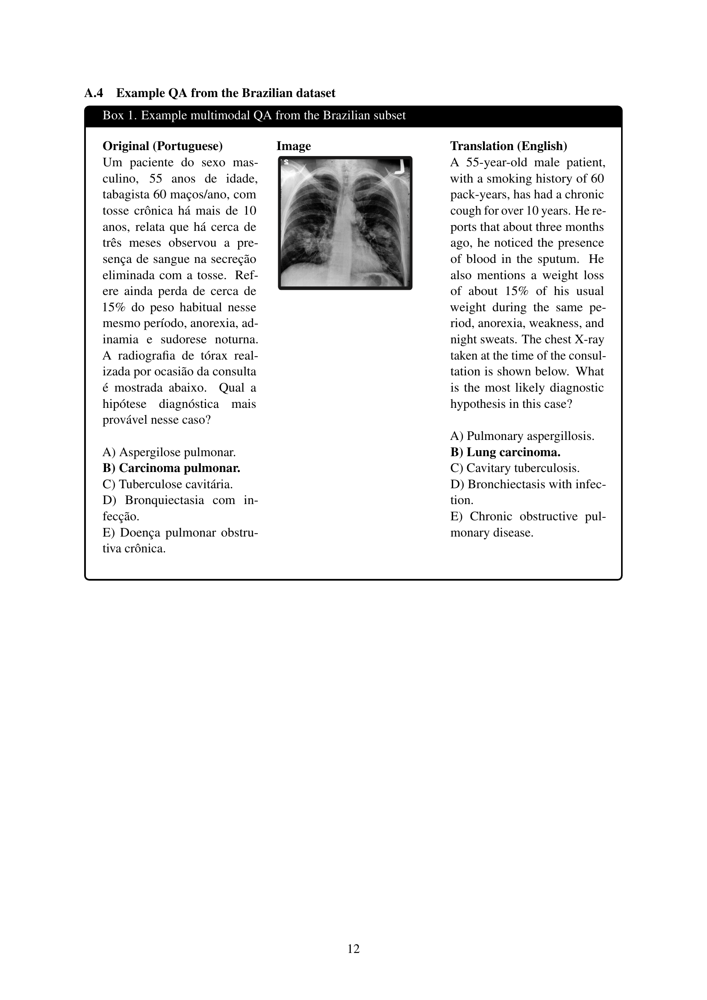
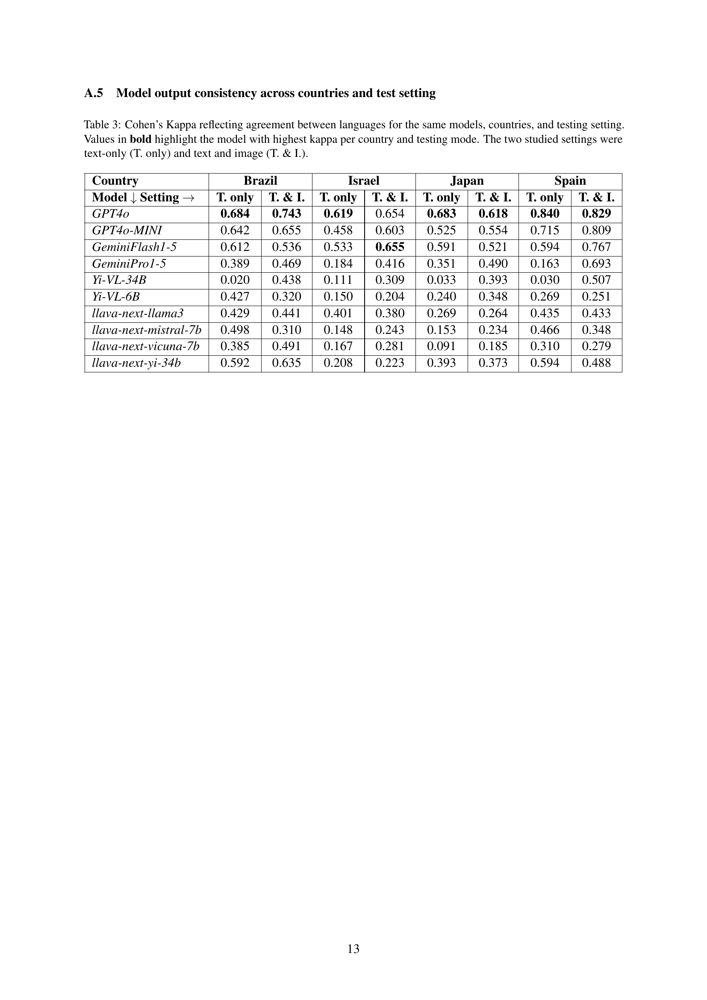

