### TL;DR



Researchers from Meta's FAIR lab introduced OMat24, a large-scale, open-access dataset for inorganic materials.  This dataset boasts over 110 million density functional theory (DFT) calculations, showcasing a remarkable level of structural and compositional diversity.  Accompanying this dataset is a suite of pre-trained Equiformer V2 models that have demonstrated cutting-edge performance in predicting ground-state stability and formation energies, achieving an F1 score above 0.9 and accuracy within 20 meV/atom.  The study also explored the impact of model size, denoising objectives, and fine-tuning on model performance across various datasets. The open release of OMat24 and its associated models is a significant contribution to the field, empowering researchers to build upon the work and advance AI-assisted materials science.  Key aspects of the research include the use of diverse non-equilibrium structures in the dataset, which should improve the generalizability and predictive power of trained models, especially for dynamic properties.  The paper also thoroughly outlines the dataset generation process, DFT calculation settings, and model training strategies, ensuring reproducibility and facilitating further development within the research community.




 &nbsp; read the paper on arXiv

  

 &nbsp; on Hugging Face


#### Why does it matter?
This paper is crucial for materials science researchers due to its release of OMat24, a massive open dataset of inorganic materials properties, and accompanying state-of-the-art models.  It directly addresses the lack of publicly available training data, accelerating AI-driven materials discovery.  The open-source nature fosters collaboration and speeds advancements in the field.
#### Key Takeaways


 The OMat24 dataset contains over 110 million DFT calculations focused on structural and compositional diversity in inorganic materials. 



 Equiformer V2 models, trained on OMat24, achieve state-of-the-art performance on material property prediction benchmarks. 



 The open release of OMat24 and the pre-trained models enables broader research community participation in AI-driven materials discovery. 


------
#### Visual Insights

> 🔼 Figure 1 is an overview showing the generation of the OMat24 dataset, its application areas, and the sampling strategies used, with inset images representing a random sample of the different strategies.
> 

> 
read the caption

> Figure 1 Overview of the OMat24 dataset generation, application areas, and sampling strategies. Inset images are a random sample across the different sampling strategies.
> 

> 🔼 The chart displays the distribution of the number of atoms per structure across eight sub-datasets within the OMat24 dataset.
> 

> 
read the caption

> Figure 4 Histogram of number of atoms per structure per sub-dataset in OMat-24 dataset.
> 


<table id='6' style='font-size:18px'><tr><td>Split</td><td>Size</td><td>Fraction %</td></tr><tr><td>Train</td><td>100,824,585</td><td>85.3</td></tr><tr><td>Validation</td><td>5,320,549</td><td>4.5</td></tr><tr><td>WBM Test</td><td>5,373,339</td><td>4.5</td></tr><tr><td>ID Test</td><td>5,453,320</td><td>4.6</td></tr><tr><td>OOD Composition Test</td><td>573,301</td><td>0.5</td></tr><tr><td>OOD Element Test</td><td>619,021</td><td>0.5</td></tr></table>

> 🔼 Table 1 shows the size and percentage of each split (train, validation, and four test splits) of the OMat24 dataset.
> 

> 
read the caption

> Table 1 Size of the OMat24 train, validation and test dataset splits.
> 

### More visual insights

More on charts

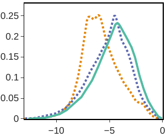

> 🔼 The figure shows the distributions of energy, forces norm and maximum absolute stress for eight different subsets of the OMat24 dataset.
> 

> 
read the caption

> Figure 5 Energy, forces norm and maximum absolute stress densities for all sub-datasets in OMat-24.
> 

 Energy per atom, forces norm and max absolute stress element distributions for MPtrj, Alexandria and OMat24 datasets. (b) Distribution of elements in the OMat24 dataset.")

> 🔼 The chart displays the distributions of energy per atom, force norm, and maximum absolute stress for the MPtrj, Alexandria, and OMat24 datasets, along with the distribution of elements in the OMat24 dataset.
> 

> 
read the caption

> Figure 2 (a) Energy per atom, forces norm and max absolute stress element distributions for MPtrj, Alexandria and OMat24 datasets. (b) Distribution of elements in the OMat24 dataset.
> 

 Energy per atom, forces norm and max absolute stress element distributions for MPtrj, Alexandria and OMat24 datasets. (b) Distribution of elements in the OMat24 dataset.")

> 🔼 The chart displays the distributions of energy per atom, forces norm, and maximum absolute stress for three datasets (MPtrj, Alexandria, and OMat24), along with the distribution of elements present in the OMat24 dataset.
> 

> 
read the caption

> Figure 2 (a) Energy per atom, forces norm and max absolute stress element distributions for MPtrj, Alexandria and OMat24 datasets. (b) Distribution of elements in the OMat24 dataset.
> 

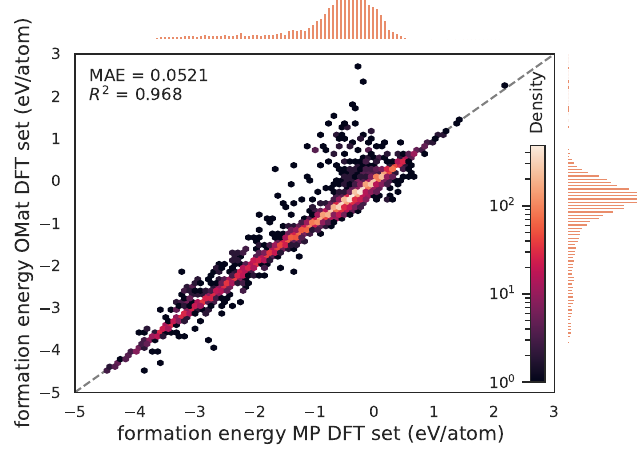

> 🔼 The chart is a parity plot showing the strong correlation between formation energies calculated using the Materials Project (MP) DFT settings and the Open Materials 2024 (OMat24) DFT settings.
> 

> 
read the caption

> Figure 3 Formation energy taken directly from the WBM dataset 46 and formation energy calculated from DFT calculations with OMat DFT settings. Outliers are primarily elements with updated psuedopotentials.
> 

> 🔼 Figure 5 shows the distributions of total energy, force norm, and stress for eight different sampling strategies used to generate the OMat24 dataset.
> 

> 
read the caption

> Figure 5 Energy, forces norm and maximum absolute stress densities for all sub-datasets in OMat-24.
> 

 Energy per atom, forces norm and max absolute stress element distributions for MPtrj, Alexandria and OMat24 datasets. (b) Distribution of elements in the OMat24 dataset.")

> 🔼 The chart displays the distributions of energy, forces, and stress for three datasets (MPtrj, Alexandria, and OMat24), along with the elemental distribution within the OMat24 dataset.
> 

> 
read the caption

> Figure 2 (a) Energy per atom, forces norm and max absolute stress element distributions for MPtrj, Alexandria and OMat24 datasets. (b) Distribution of elements in the OMat24 dataset.
> 

 Energy per atom, forces norm and max absolute stress element distributions for MPtrj, Alexandria and OMat24 datasets. (b) Distribution of elements in the OMat24 dataset.")

> 🔼 The chart displays the distributions of energy, forces, and stress in the OMat24 dataset, along with a comparison to other datasets, and shows the elemental distribution within the OMat24 dataset.
> 

> 
read the caption

> Figure 2 (a) Energy per atom, forces norm and max absolute stress element distributions for MPtrj, Alexandria and OMat24 datasets. (b) Distribution of elements in the OMat24 dataset.
> 

More on tables


<table id='5' style='font-size:20px'><tr><td>Model</td><td># of Parameters</td><td>Throughput (Samples / GPU sec. (MPtrj)</td></tr><tr><td>eqV2-S (small)</td><td>31,207,434</td><td>9.4</td></tr><tr><td>eqV2-M (medium)</td><td>86,589,068</td><td>7.4</td></tr><tr><td>eqV2-L (large)</td><td>153, 7698,68</td><td>4.9</td></tr></table>
> 🔼 {{ table.description }}
> 

> 
read the caption

> {{ table.caption }}
> 

> Table 2 presents the number of parameters and inference throughput for three different sizes of Equiformer V2 models.


<table id='5' style='font-size:18px'><tr><td>Model</td><td>Energy ↓</td><td>Forces ↓</td><td>Stress ↓</td><td>Forces COS ↑</td></tr><tr><td>eqV2-S</td><td>11</td><td>49.2</td><td>2.4</td><td>0.985</td></tr><tr><td>eqV2-M</td><td>10</td><td>44.8</td><td>2.3</td><td>0.986</td></tr><tr><td>eqV2-L</td><td>9.6</td><td>43.1</td><td>2.3</td><td>0.987</td></tr></table>
> 🔼 {{ table.description }}
> 

> 
read the caption

> {{ table.caption }}
> 

> Table 3 presents the validation mean absolute error metrics for three different sizes of the equiformer V2 models trained solely on the OMat24 dataset, showing energy errors in meV/atom, force errors in meV/Å, stress errors in meV/ų, and forces cosine similarity.


<table id='3' style='font-size:14px'><tr><td>Model</td><td>eqV2-L-DeNS</td><td>eqV2-M-DeNS</td><td>eqV2-S-DeNS</td><td>eqV2-S</td><td>ORB MPtrj</td><td>SevenNet</td><td>MACE</td></tr><tr><td>F1 ↑</td><td>0.823</td><td>0.818</td><td>0.815</td><td>0.77</td><td>0.765</td><td>0.724</td><td>0.669</td></tr><tr><td>DAF ↑</td><td>5.184</td><td>5.109</td><td>5.042</td><td>4.64</td><td>4.702</td><td>4.252</td><td>3.777</td></tr><tr><td>Precision ↑</td><td>0.792</td><td>0.781</td><td>0.771</td><td>0.709</td><td>0.719</td><td>0.65</td><td>0.577</td></tr><tr><td>Recall ↑</td><td>0.856</td><td>0.858</td><td>0.864</td><td>0.841</td><td>0.817</td><td>0.818</td><td>0.796</td></tr><tr><td>Accuracy ↑</td><td>0.944</td><td>0.942</td><td>0.941</td><td>0.926</td><td>0.922</td><td>0.904</td><td>0.878</td></tr><tr><td>TPR ↑</td><td>0.856</td><td>0.858</td><td>0.864</td><td>0.841</td><td>0.817</td><td>0.818</td><td>0.796</td></tr><tr><td>FPR ↓</td><td>0.041</td><td>0.044</td><td>0.047</td><td>0.063</td><td>0.059</td><td>0.081</td><td>0.107</td></tr><tr><td>TNR ↑</td><td>0.959</td><td>0.956</td><td>0.953</td><td>0.937</td><td>0.941</td><td>0.919</td><td>0.893</td></tr><tr><td>FNR ↓</td><td>0.144</td><td>0.142</td><td>0.136</td><td>0.159</td><td>0.183</td><td>0.182</td><td>0.204</td></tr><tr><td>MAE ↓</td><td>35</td><td>35</td><td>36</td><td>42</td><td>45</td><td>48</td><td>57</td></tr><tr><td>RMSE ↓</td><td>82</td><td>82</td><td>85</td><td>87</td><td>91</td><td>92</td><td>101</td></tr><tr><td>R2 ↑</td><td>0.802</td><td>0.803</td><td>0.788</td><td>0.778</td><td>0.756</td><td>0.75</td><td>0.697</td></tr></table>
> 🔼 {{ table.description }}
> 

> 
read the caption

> {{ table.caption }}
> 

> Table 5 presents Matbench-Discovery benchmark results for compliant models trained solely on the MPtrj dataset, showing various metrics such as F1 score, precision, recall, accuracy, and error rates.


<table id='1' style='font-size:14px'><tr><td>Model Pre-train Dataset Fine-tune Dataset</td><td>eqV2-M OMat MPtrj-sAlex</td><td>eqV2-M OMat MPtrj</td><td>eqV2-S OMat MPtrj-sAlex</td><td>eqV2-S OMat MPtrj</td><td>eqV2-L OC20 MPtrj</td><td>eqV2-S OC20 MPtrj</td><td>ORB</td><td>MatterSim</td><td>GNoME</td></tr><tr><td>F1 ↑</td><td>0.916</td><td>0.909</td><td>0.901</td><td>0.89</td><td>0.86</td><td>0.837</td><td>0.88</td><td>0.859</td><td>0.829</td></tr><tr><td>DAF ↑</td><td>6.040</td><td>5.948</td><td>5.902</td><td>5.752</td><td>5.639</td><td>5.392</td><td>6.041</td><td>5.646</td><td>5.523</td></tr><tr><td>Precision ↑</td><td>0.923</td><td>0.909</td><td>0.902</td><td>0.879</td><td>0.862</td><td>0.824</td><td>0.924</td><td>0.863</td><td>0.844</td></tr><tr><td>Recall ↑</td><td>0.91</td><td>0.909</td><td>0.9</td><td>0.901</td><td>0.858</td><td>0.849</td><td>0.841</td><td>0.856</td><td>0.814</td></tr><tr><td>Accuracy ↑</td><td>0.974</td><td>0.973</td><td>0.97</td><td>0.966</td><td>0.957</td><td>0.951</td><td>0.965</td><td>0.957</td><td>0.955</td></tr><tr><td>TPR ↑</td><td>0.91</td><td>0.909</td><td>0.9</td><td>0.901</td><td>0.858</td><td>0.849</td><td>0.841</td><td>0.856</td><td>0.814</td></tr><tr><td>FPR ↓</td><td>0.014</td><td>0.017</td><td>0.018</td><td>0.023</td><td>0.025</td><td>0.033</td><td>0.013</td><td>0.025</td><td>0.028</td></tr><tr><td>TNR ↑</td><td>0.986</td><td>0.983</td><td>0.982</td><td>0.977</td><td>0.975</td><td>0.967</td><td>0.987</td><td>0.975</td><td>0.972</td></tr><tr><td>FNR ↓</td><td>0.09</td><td>0.091</td><td>0.1</td><td>0.099</td><td>0.142</td><td>0.151</td><td>0.159</td><td>0.144</td><td>0.186</td></tr><tr><td>MAE ↓</td><td>20</td><td>21</td><td>24</td><td>26</td><td>29</td><td>33</td><td>28</td><td>26</td><td>35</td></tr><tr><td>RMSE ↓</td><td>72</td><td>72</td><td>80</td><td>81</td><td>78</td><td>80</td><td>77</td><td>80</td><td>85</td></tr><tr><td>R2 ↑</td><td>0.848</td><td>0.849</td><td>0.811</td><td>0.807</td><td>0.823</td><td>0.81</td><td>0.824</td><td>0.812</td><td>0.785</td></tr></table>
> 🔼 {{ table.description }}
> 

> 
read the caption

> {{ table.caption }}
> 

> Table 6 presents the Matbench-Discovery benchmark results for non-compliant models, showing performance metrics such as F1 score, MAE, and RMSE on the unique prototype split.


<table id='3' style='font-size:16px'><tr><td>Hyper-parameters</td><td>eqV2-S</td><td>eqV2-M</td><td>eqV2-L</td></tr><tr><td>Maximum degree Lmax</td><td>4</td><td>6</td><td>6</td></tr><tr><td>Maximum order Mmax</td><td>2</td><td>4</td><td>3</td></tr><tr><td>Number of Transformer blocks</td><td>8</td><td>10</td><td>20</td></tr><tr><td>Cutoff radius (A)</td><td>12</td><td>12</td><td>12</td></tr><tr><td>Maximum number of neighbors</td><td>20</td><td>20</td><td>20</td></tr><tr><td>Number of radial bases</td><td>600</td><td>600</td><td>600</td></tr><tr><td>Dimension of hidden scalar features in radial functions dedge</td><td>(0, 128)</td><td>(0, 128)</td><td>(0, 128)</td></tr><tr><td>Embedding dimension dembed</td><td>(4, 128)</td><td>(6, 128)</td><td>(6, 128)</td></tr><tr><td>f⌀i dimension dattn hidden</td><td>(4, 64)</td><td>(6, 64)</td><td>(6, 64)</td></tr><tr><td>Number of attention heads h</td><td>8</td><td>8</td><td>8</td></tr><tr><td>f⌀ dimension dattn alpha</td><td>(0, 64)</td><td>(0, 64)</td><td>(0, 64)</td></tr><tr><td>Value dimension dattn value</td><td>(4, 16)</td><td>(6, 16)</td><td>(6, 16)</td></tr><tr><td>Hidden dimension in feed forward networks dffn</td><td>(4, 128)</td><td>(6, 128)</td><td>(6, 128)</td></tr><tr><td>Resolution of point samples R</td><td>18</td><td>18</td><td>18</td></tr></table>
> 🔼 {{ table.description }}
> 

> 
read the caption

> {{ table.caption }}
> 

> Table 7 shows the hyperparameters used for the different sizes of the Equiformer V2 models used in the paper.


<table id='5' style='font-size:14px'><tr><td>Hyper-parameters</td><td>MPTrj training</td><td>OMat training</td><td>MPTrj Fine-tuning</td><td>MPTrj+sAlex Fine-tuning</td></tr><tr><td>Optimizer</td><td>AdamW</td><td>AdamW</td><td>AdamW</td><td>AdamW</td></tr><tr><td>Learning rate scheduling</td><td>Cosine</td><td>Cosine</td><td>Cosine</td><td>Cosine</td></tr><tr><td>Warmup epochs</td><td>0.1</td><td>0.01</td><td>0.1</td><td>0.1</td></tr><tr><td>Warmup factor</td><td>0.2</td><td>0.2</td><td>0.2</td><td>0.2</td></tr><tr><td>Maximum learning rate</td><td>2 x 10-4</td><td>2 X 10-4</td><td>2 x 10-4</td><td>2 x 10-4</td></tr><tr><td>Minimum learning rate factor</td><td>0.01</td><td>0.01</td><td>0.01</td><td>0.01</td></tr><tr><td>Batch size</td><td>512</td><td>512</td><td>256</td><td>256</td></tr><tr><td>Number of epochs</td><td>150</td><td>2</td><td>32</td><td>8</td></tr><tr><td>Gradient clipping norm threshold</td><td>100</td><td>100</td><td>100</td><td>100</td></tr><tr><td>Model EMA decay</td><td>0.999</td><td>0.999</td><td>0.999</td><td>0.999</td></tr><tr><td>Weight decay</td><td>1 x 10-3</td><td>1 X 10-3</td><td>1 x 10-3</td><td>1 x 10-3</td></tr><tr><td>Dropout rate</td><td>0.1</td><td>0.1</td><td>0.1</td><td>0.1</td></tr><tr><td>Stochastic depth</td><td>0.1</td><td>0.1</td><td>0.1</td><td>0.1</td></tr><tr><td>Energy loss coefficient</td><td>20</td><td>20</td><td>20</td><td>20</td></tr><tr><td>Force loss coefficient</td><td>20</td><td>20</td><td>10</td><td>10</td></tr><tr><td>Stress loss coefficient</td><td>5</td><td>5</td><td>1</td><td>1</td></tr><tr><td>DeNS settings</td><td></td><td></td><td></td><td></td></tr><tr><td>Probability of optimizing DeNS</td><td>0.5</td><td>0.25</td><td></td><td>-</td></tr><tr><td>Standard deviation of Gaussian noise</td><td>0.1</td><td>0.1</td><td></td><td></td></tr><tr><td>DeNS loss coefficient</td><td>10</td><td>10</td><td>-</td><td>-</td></tr></table>
> 🔼 {{ table.description }}
> 

> 
read the caption

> {{ table.caption }}
> 

> Table 8 presents the hyperparameters used for training the EquiformerV2 models with different dataset settings.


<table id='3' style='font-size:14px'><tr><td>model</td><td>energy ↓</td><td>forces ↓</td><td>stress ↓</td><td>forces cos ↑</td></tr><tr><td>eqV2-S</td><td>12.4</td><td>32.22</td><td>1.55</td><td>0.72</td></tr><tr><td>eqV2-S-DeNS</td><td>11.43</td><td>31.67</td><td>1.44</td><td>0.72</td></tr><tr><td>eqV2-M-DeNS</td><td>11.17</td><td>31.46</td><td>1.48</td><td>0.728</td></tr><tr><td>eqV2-L-DeNS</td><td>10.58</td><td>30.48</td><td>1.47</td><td>0.738</td></tr></table>
> 🔼 {{ table.description }}
> 

> 
read the caption

> {{ table.caption }}
> 

> Table 9 presents the validation mean absolute error metrics for models trained only on the MPtrj dataset, showing energy, forces, stress errors, and forces cosine similarity.


<table id='5' style='font-size:14px'><tr><td>model</td><td>energy (meV/atom) ↓</td><td>forces (meV/A) ↓</td><td>stress (meV/A3) ↓</td><td>forces cos ↑</td></tr><tr><td>eqV2-S-OMat-MP</td><td>8.52</td><td>23.86</td><td>1.3</td><td>0.764</td></tr><tr><td>eqV2-L-OMat-MP</td><td>7.99</td><td>22.63</td><td>1.28</td><td>0.777</td></tr></table>
> 🔼 {{ table.description }}
> 

> 
read the caption

> {{ table.caption }}
> 

> Table 10 presents the validation metrics for fine-tuning OMat pre-trained models on the MPtrj dataset, showing energy, forces, stress, and forces cosine metrics.


<table id='10' style='font-size:14px'><tr><td>Model</td><td>eqV2-L-DeNS</td><td>eqV2-M-DeNS</td><td>eqV2-S-DeNS</td><td>eqV2-S</td></tr><tr><td>F1 ↑</td><td>0.806</td><td>0.8</td><td>0.798</td><td>0.758</td></tr><tr><td>DAF ↑</td><td>4.497</td><td>4.414</td><td>4.362</td><td>4.053</td></tr><tr><td>Precision ↑</td><td>0.772</td><td>0.757</td><td>0.748</td><td>0.696</td></tr><tr><td>Recall ↑</td><td>0.844</td><td>0.847</td><td>0.855</td><td>0.833</td></tr><tr><td>Accuracy ↑</td><td>0.931</td><td>0.929</td><td>0.927</td><td>0.912</td></tr><tr><td>TPR ↑</td><td>0.844</td><td>0.847</td><td>0.855</td><td>0.833</td></tr><tr><td>FPR ↓</td><td>0.052</td><td>0.056</td><td>0.059</td><td>0.076</td></tr><tr><td>TNR ↑</td><td>0.948</td><td>0.944</td><td>0.941</td><td>0.924</td></tr><tr><td>FNR ↓</td><td>0.156</td><td>0.153</td><td>0.145</td><td>0.167</td></tr><tr><td>MAE ↓</td><td>34</td><td>34</td><td>35</td><td>41</td></tr><tr><td>RMSE ↓</td><td>81</td><td>81</td><td>84</td><td>85</td></tr><tr><td>R2 ↑</td><td>0.798</td><td>0.8</td><td>0.785</td><td>0.777</td></tr></table>
> 🔼 {{ table.description }}
> 

> 
read the caption

> {{ table.caption }}
> 

> The table shows the size and fraction of the OMat24 dataset split into training, validation, and four different test sets.


<table id='1' style='font-size:14px'><tr><td>Model</td><td>eqV2-L-DeNS</td><td>eqV2-M-DeNS</td><td>eqV2-S-DeNS</td><td>eqV2-S</td></tr><tr><td>F1 ↑</td><td>0.985</td><td>0.984</td><td>0.983</td><td>0.974</td></tr><tr><td>DAF ↑</td><td>6.347</td><td>6.33</td><td>6.326</td><td>6.21</td></tr><tr><td>Precision ↑</td><td>0.97</td><td>0.968</td><td>0.967</td><td>0.949</td></tr><tr><td>Accuracy ↑</td><td>0.97</td><td>0.968</td><td>0.967</td><td>0.949</td></tr><tr><td>MAE ↓</td><td>30</td><td>28</td><td>31</td><td>37</td></tr><tr><td>RMSE ↓</td><td>91</td><td>79</td><td>91</td><td>94</td></tr><tr><td>R2 ↑</td><td>0.821</td><td>0.865</td><td>0.823</td><td>0.812</td></tr></table>
> 🔼 {{ table.description }}
> 

> 
read the caption

> {{ table.caption }}
> 

> Table 12 presents the Matbench-Discovery benchmark results of compliant models trained only on the MPtrj dataset, focusing on the 10K most stable materials.


<table id='3' style='font-size:14px'><tr><td>Model Pre-train Dataset</td><td>eqV2-M OMat MPtrj-sAlex</td><td>eqV2-M OMat MPtrj</td><td>eqV2-S OMat MPtrj-sAlex</td><td>eqV2-S OMat MPtrj</td><td>eqV2-L OC20 MPtrj</td><td>eqV2-S OC20 MPtrj</td></tr><tr><td>Fine-tune Dataset F1 ↑</td><td>0.895</td><td>0.887</td><td>0.88</td><td>0.868</td><td>0.84</td><td>0.817</td></tr><tr><td>DAF ↑</td><td>5.24</td><td>5.143</td><td>5.106</td><td>4.942</td><td>4.874</td><td>4.661</td></tr><tr><td>Precision ↑</td><td>0.899</td><td>0.882</td><td>0.876</td><td>0.848</td><td>0.836</td><td></td></tr><tr><td>Recall ↑</td><td></td><td></td><td></td><td>0.888</td><td></td><td>0.8</td></tr><tr><td>Accuracy ↑</td><td>0.892</td><td>0.892</td><td>0.884</td><td></td><td>0.843</td><td>0.835</td></tr><tr><td>TPR ↑</td><td>0.964</td><td>0.962 0.892</td><td>0.959 0.884</td><td>0.954 0.888</td><td>0.946 0.843</td><td>0.938 0.835</td></tr><tr><td>FPR ↓</td><td>0.892 0.021</td><td>0.025</td><td>0.026</td><td>0.033</td><td>0.034</td><td>0.043</td></tr><tr><td>TNR ↑</td><td>0.979</td><td>0.975</td><td>0.974</td><td>0.967</td><td>0.966</td><td>0.957</td></tr><tr><td>FNR ↓</td><td>0.108</td><td>0.108</td><td>0.116</td><td>0.112</td><td>0.157</td><td>0.165</td></tr><tr><td>MAE ↓</td><td>0.02</td><td>0.021</td><td>0.024</td><td>0.025</td><td>0.028</td><td>0.032</td></tr><tr><td>RMSE ↓</td><td>0.071</td><td>0.071</td><td>0.079</td><td>0.08</td><td>0.076</td><td>0.079</td></tr><tr><td>R2 ↑</td><td>0.843</td><td>0.843</td><td>0.809</td><td>0.804</td><td>0.819</td><td>0.807</td></tr></table>
> 🔼 {{ table.description }}
> 

> 
read the caption

> {{ table.caption }}
> 

> Table 6 presents the Matbench-Discovery benchmark results for non-compliant models, showing their performance on the unique prototype split with MAE and RMSE in eV/atom.


<table id='5' style='font-size:14px'><tr><td>Model Pre-train Dataset Fine-tune Dataset</td><td>eqV2-M OMat MPtrj-sAlex</td><td>eqV2-M OMat MPtrj</td><td>eqV2-S OMat MPtrj-sAlex</td><td>eqV2-S OMat MPtrj</td><td>eqV2-L OC20 MPtrj</td><td>eqV2-S OC20 MPtrj</td></tr><tr><td>F1 ↑</td><td>0.987</td><td>0.987</td><td>0.99</td><td>0.991</td><td>0.989</td><td>0.987</td></tr><tr><td>DAF ↑</td><td>6.368</td><td>6.37</td><td>6.413</td><td>6.424</td><td>6.399</td><td>6.368</td></tr><tr><td>Precision ↑</td><td>0.974</td><td>0.974</td><td>0.98</td><td>0.982</td><td>0.978</td><td>0.974</td></tr><tr><td>Accuracy ↑</td><td>0.974</td><td>0.974</td><td>0.98</td><td>0.982</td><td>0.978</td><td>0.974</td></tr><tr><td>MAE ↓</td><td>17</td><td>17</td><td>16</td><td>17</td><td>26</td><td>28</td></tr><tr><td>RMSE ↓</td><td>72</td><td>71</td><td>61</td><td>63</td><td>95</td><td>91</td></tr><tr><td>R2 ↑</td><td>0.887</td><td>0.889</td><td>0.917</td><td>0.91</td><td>0.806</td><td>0.824</td></tr></table>
> 🔼 {{ table.description }}
> 

> 
read the caption

> {{ table.caption }}
> 

> Table 14 presents the Matbench-Discovery benchmark results of non-compliant models, focusing on the 10K materials predicted to be most stable, showing metrics such as F1 score, DAF, precision, accuracy, MAE, and RMSE.

### Full paper


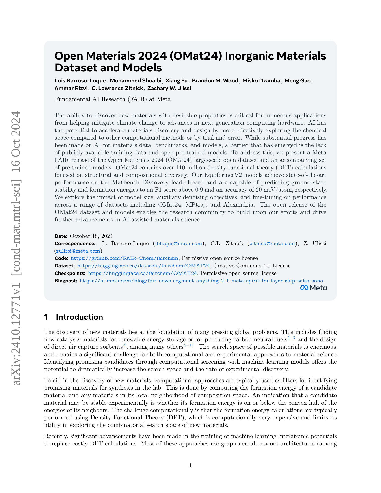
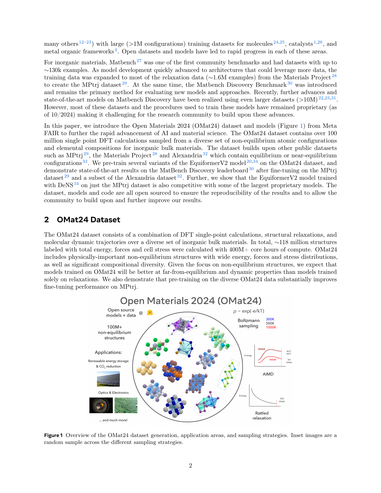

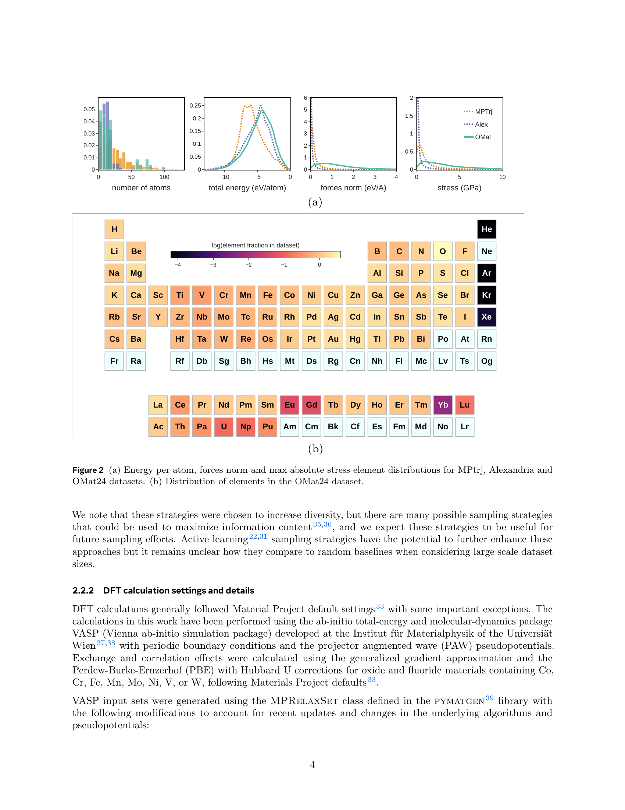
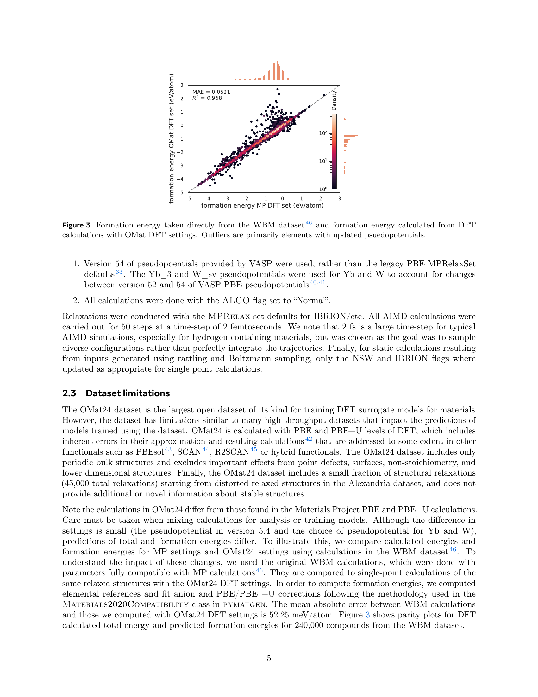

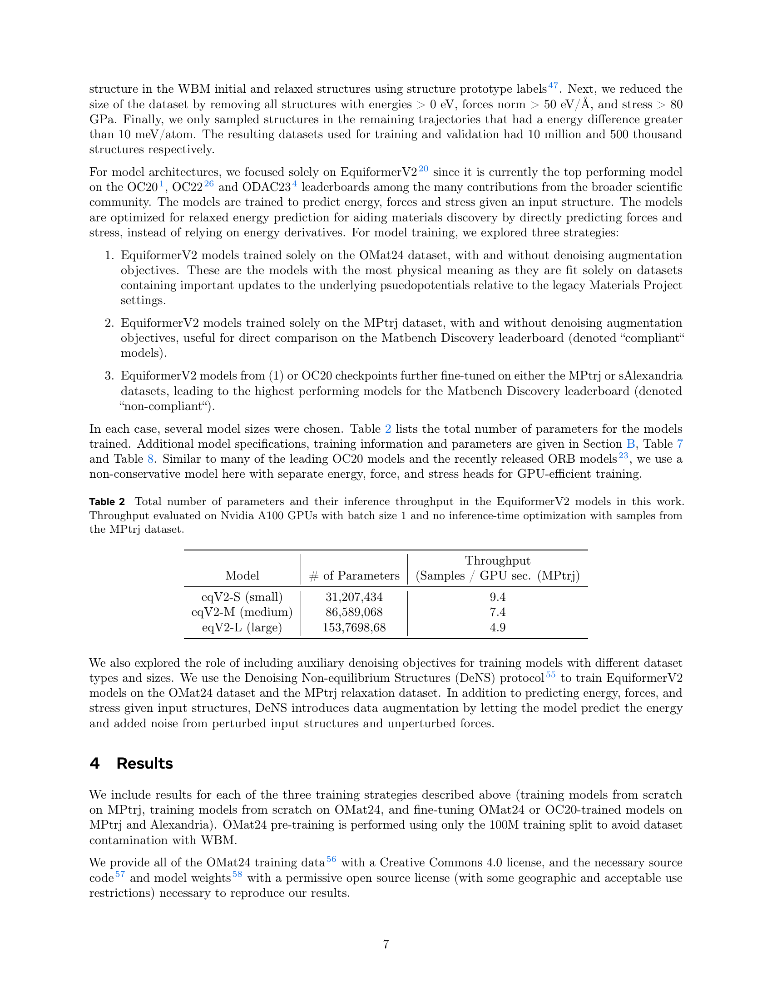
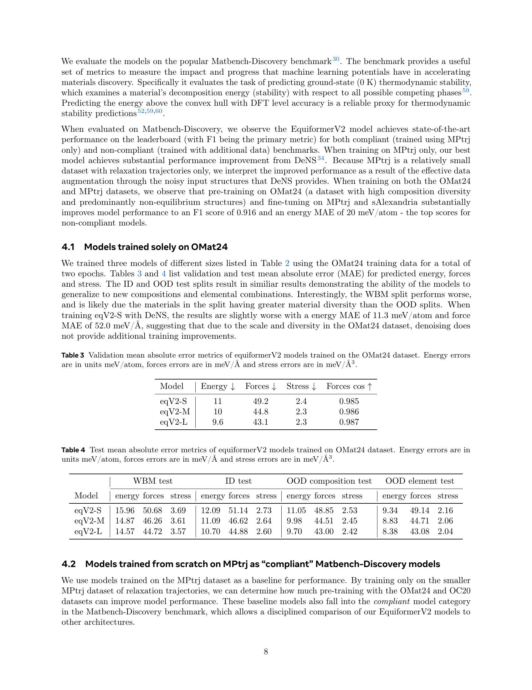
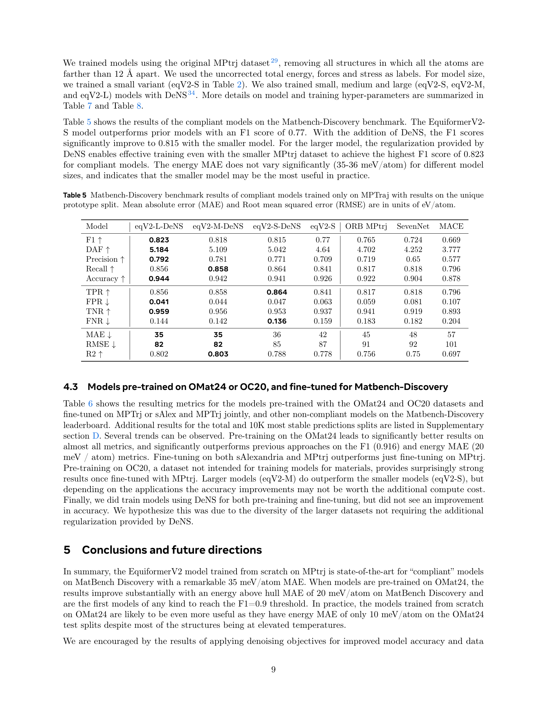

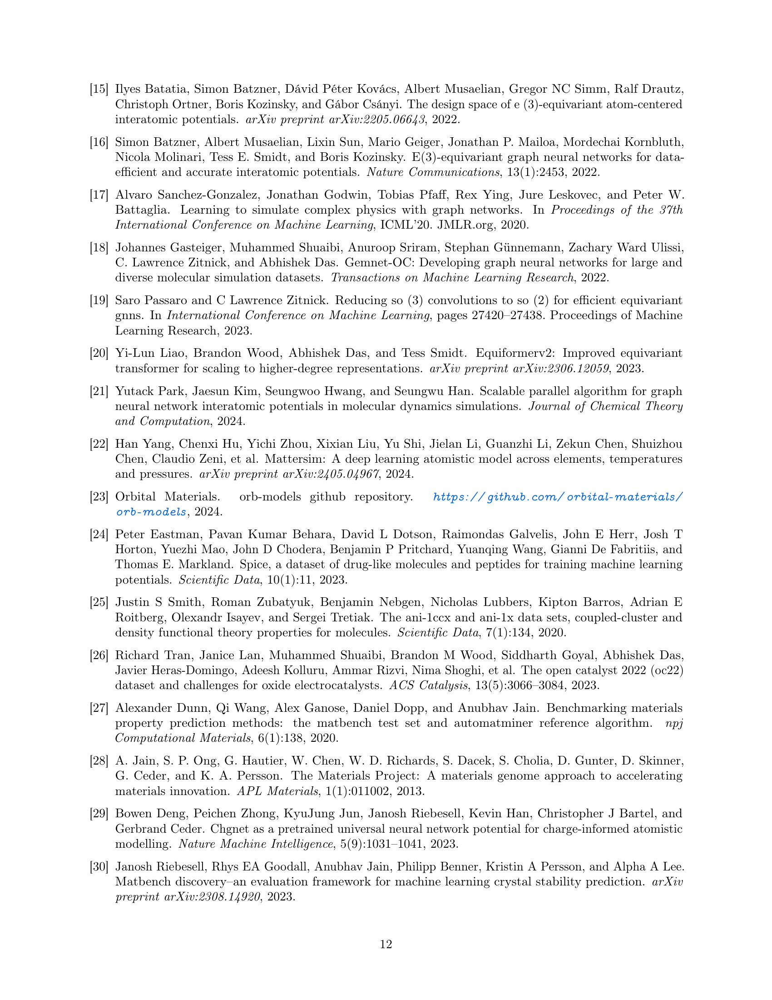

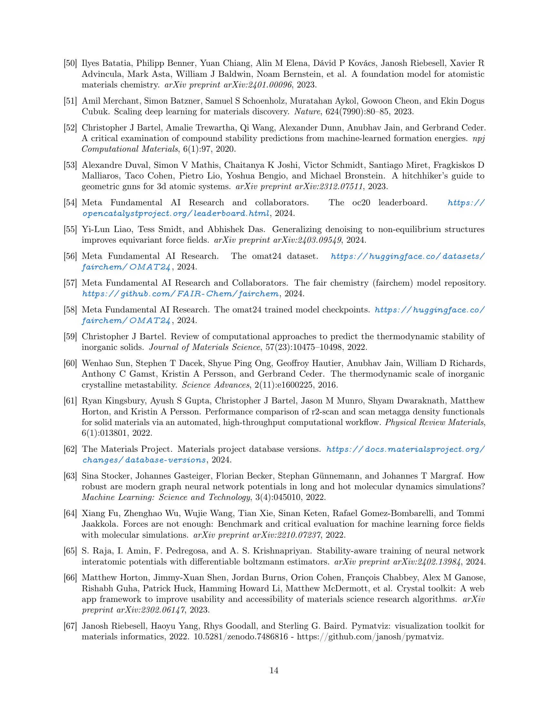
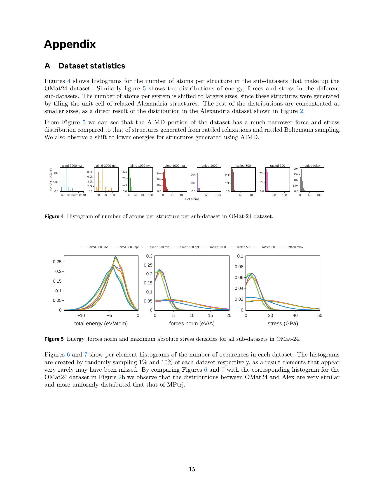

