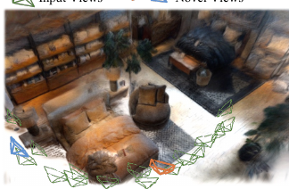
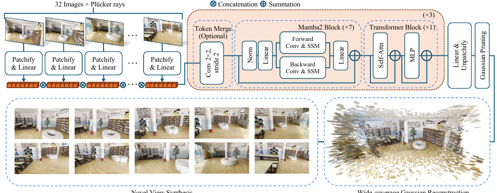
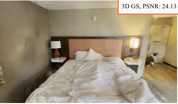
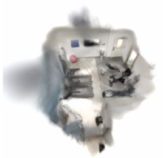
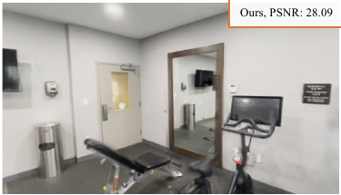
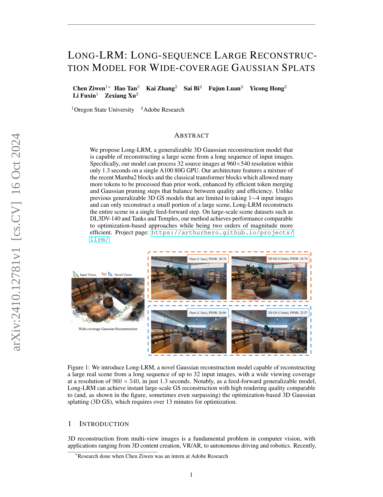
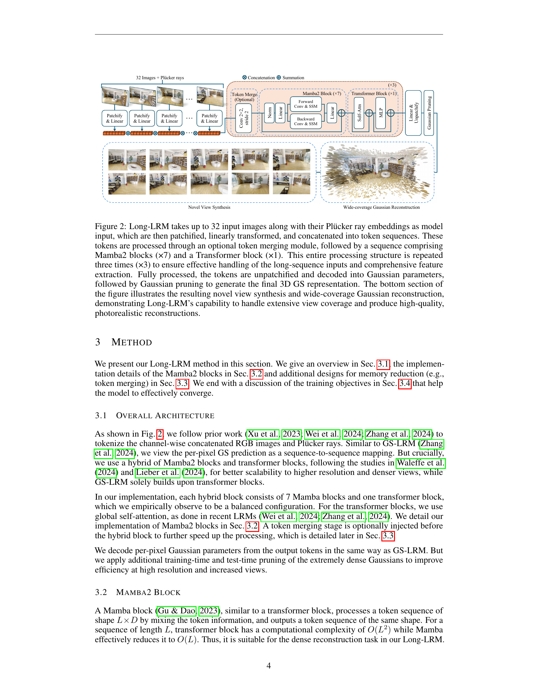
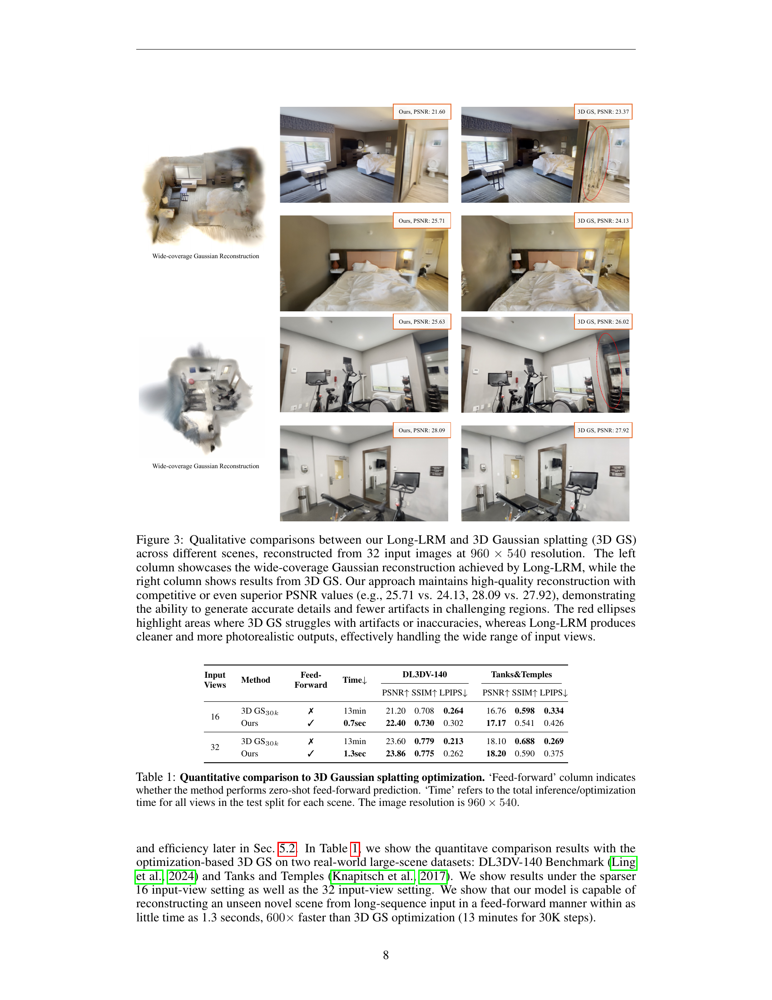
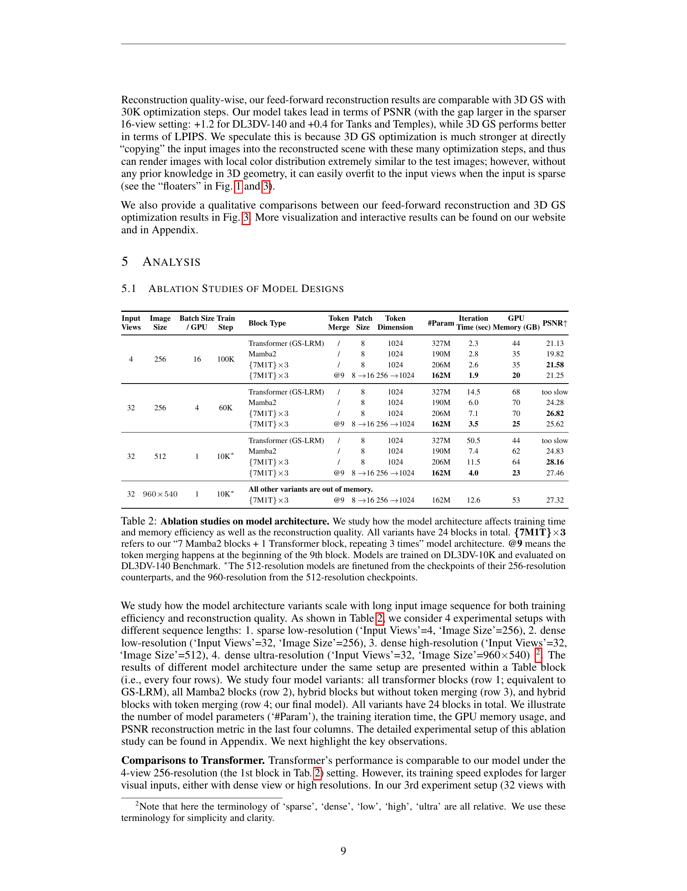
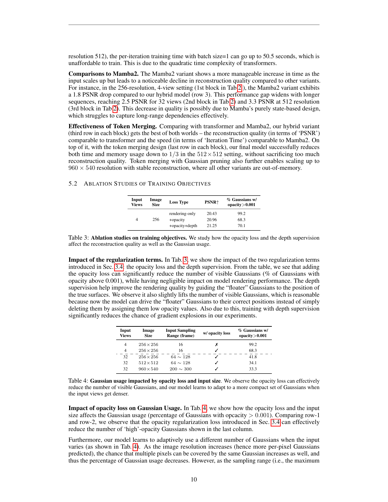

### TL;DR



Long-LRM is a new computer vision model that creates detailed 3D representations of scenes from many images incredibly quickly (1.3 seconds for 32 images!). Unlike other methods which are slow or only work with a few images, Long-LRM handles long sequences of pictures efficiently, leading to wide-coverage 3D models.  It achieves this speed through a smart combination of Mamba2 and transformer blocks in its design, improving processing speed and memory usage.  Tests show Long-LRM produces high-quality results comparable to much slower, existing techniques on standard datasets. The speed and scalability demonstrated are promising for applications requiring immediate 3D scene understanding.




 &nbsp; read the paper on arXiv

  

 &nbsp; on Hugging Face


#### Why does it matter?
This paper is highly significant for researchers in 3D reconstruction and computer vision due to its novel approach to creating high-quality, wide-coverage 3D models from long sequences of images in mere seconds. It introduces a novel and efficient model architecture using a combination of Mamba2 and transformer blocks which addresses the computational challenges of handling long sequences.  The paper's results demonstrate a significant advancement in efficiency and scalability, opening new avenues for research in real-time 3D scene understanding and application development in AR/VR, robotics, and autonomous driving.
#### Key Takeaways


 Long-LRM achieves high-quality 3D scene reconstruction from up to 32 images in 1.3 seconds, significantly faster than existing methods. 



 The model employs a novel hybrid architecture combining Mamba2 and transformer blocks to efficiently handle long image sequences. 



 Long-LRM demonstrates wide-coverage reconstruction, capturing a large scene area in a single feed-forward step. 


------
#### Visual Insights

> 🔼 Figure 1 demonstrates Long-LRM's ability to reconstruct a large scene from 32 input images in 1.3 seconds, comparing its results to a slower optimization-based method.
> 

> 
read the caption

> Figure 1: We introduce Long-LRM, a novel Gaussian reconstruction model capable of reconstructing a large real scene from a long sequence of up to 32 input images, with a wide viewing coverage at a resolution of 960 × 540, in just 1.3 seconds. Notably, as a feed-forward generalizable model, Long-LRM can achieve instant large-scale GS reconstruction with high rendering quality comparable to (and, as shown in the figure, sometimes even surpassing) the optimization-based 3D Gaussian splatting (3D GS), which requires over 13 minutes for optimization.
> 


<table id='13' style='font-size:16px'><tr><td rowspan="2">Input Views</td><td rowspan="2">Method</td><td rowspan="2">Feed- Forward</td><td rowspan="2">Time↓</td><td colspan="3">DL3DV-140</td><td colspan="3">Tanks&Temples</td></tr><tr><td>PSNR↑</td><td>SSIM↑</td><td>LPIPS↓</td><td>PSNR↑</td><td>SSIM↑</td><td>LPIPS↓</td></tr><tr><td rowspan="2">16</td><td>3D GS30k</td><td>X</td><td>13min</td><td>21.20</td><td>0.708</td><td>0.264</td><td>16.76</td><td>0.598</td><td>0.334</td></tr><tr><td>Ours</td><td>V</td><td>0.7sec</td><td>22.40</td><td>0.730</td><td>0.302</td><td>17.17</td><td>0.541</td><td>0.426</td></tr><tr><td rowspan="2">32</td><td>3D GS30k</td><td>X</td><td>13min</td><td>23.60</td><td>0.779</td><td>0.213</td><td>18.10</td><td>0.688</td><td>0.269</td></tr><tr><td>Ours</td><td>V</td><td>1.3sec</td><td>23.86</td><td>0.775</td><td>0.262</td><td>18.20</td><td>0.590</td><td>0.375</td></tr></table>

> 🔼 Table 1 quantitatively compares Long-LRM's performance against optimization-based 3D Gaussian splatting in terms of reconstruction quality (PSNR, SSIM, LPIPS), inference speed, and whether the approach is feed-forward.
> 

> 
read the caption

> Table 1: Quantitative comparison to 3D Gaussian splatting optimization. ‘Feed-forward’ column indicates whether the method performs zero-shot feed-forward prediction. ‘Time’ refers to the total inference/optimization time for all views in the test split for each scene. The image resolution is 960 × 540.
> 

### More visual insights

More on figures

> 🔼 Figure 1 shows a comparison of Long-LRM's novel view synthesis capabilities against optimization-based 3D Gaussian splatting, highlighting Long-LRM's speed and comparable reconstruction quality.
> 

> 
read the caption

> Figure 1: We introduce Long-LRM, a novel Gaussian reconstruction model capable of reconstructing a large real scene from a long sequence of up to 32 input images, with a wide viewing coverage at a resolution of 960 × 540, in just 1.3 seconds. Notably, as a feed-forward generalizable model, Long-LRM can achieve instant large-scale GS reconstruction with high rendering quality comparable to (and, as shown in the figure, sometimes even surpassing) the optimization-based 3D Gaussian splatting (3D GS), which requires over 13 minutes for optimization.
> 

> 🔼 This figure illustrates the overall architecture of Long-LRM, showing how it processes 32 input images to generate a wide-coverage Gaussian splatting representation for novel view synthesis.
> 

> 
read the caption

> Figure 2: Long-LRM takes up to 32 input images along with their Plücker ray embeddings as model input, which are then patchified, linearly transformed, and concatenated into token sequences. These tokens are processed through an optional token merging module, followed by a sequence comprising Mamba2 blocks (×7) and a Transformer block (×1). This entire processing structure is repeated three times (x3) to ensure effective handling of the long-sequence inputs and comprehensive feature extraction. Fully processed, the tokens are unpatchified and decoded into Gaussian parameters, followed by Gaussian pruning to generate the final 3D GS representation. The bottom section of the figure illustrates the resulting novel view synthesis and wide-coverage Gaussian reconstruction, demonstrating Long-LRM’s capability to handle extensive view coverage and produce high-quality, photorealistic reconstructions.
> 

> 🔼 Figure 1 shows the wide-coverage Gaussian reconstruction results of Long-LRM compared to the optimization-based 3D Gaussian splatting (3D GS) for different novel views.
> 

> 
read the caption

> Figure 1: We introduce Long-LRM, a novel Gaussian reconstruction model capable of reconstructing a large real scene from a long sequence of up to 32 input images, with a wide viewing coverage at a resolution of 960 × 540, in just 1.3 seconds. Notably, as a feed-forward generalizable model, Long-LRM can achieve instant large-scale GS reconstruction with high rendering quality comparable to (and, as shown in the figure, sometimes even surpassing) the optimization-based 3D Gaussian splatting (3D GS), which requires over 13 minutes for optimization.
> 

> 🔼 Figure 3 shows qualitative and quantitative comparisons of 3D Gaussian splatting results from Long-LRM and 3D GS across different scenes, highlighting Long-LRM's superior quality and artifact reduction.
> 

> 
read the caption

> Figure 3: Qualitative comparisons between our Long-LRM and 3D Gaussian splatting (3D GS) across different scenes, reconstructed from 32 input images at 960 × 540 resolution. The left column showcases the wide-coverage Gaussian reconstruction achieved by Long-LRM, while the right column shows results from 3D GS. Our approach maintains high-quality reconstruction with competitive or even superior PSNR values (e.g., 25.71 vs. 24.13, 28.09 vs. 27.92), demonstrating the ability to generate accurate details and fewer artifacts in challenging regions. The red ellipses highlight areas where 3D GS struggles with artifacts or inaccuracies, whereas Long-LRM produces cleaner and more photorealistic outputs, effectively handling the wide range of input views.
> 

> 🔼 Figure 3 presents a qualitative comparison of 3D scene reconstruction results using Long-LRM and optimization-based 3D Gaussian splatting, highlighting Long-LRM's superior detail, fewer artifacts, and ability to handle diverse input views.
> 

> 
read the caption

> Figure 3: Qualitative comparisons between our Long-LRM and 3D Gaussian splatting (3D GS) across different scenes, reconstructed from 32 input images at 960 × 540 resolution. The left column showcases the wide-coverage Gaussian reconstruction achieved by Long-LRM, while the right column shows results from 3D GS. Our approach maintains high-quality reconstruction with competitive or even superior PSNR values (e.g., 25.71 vs. 24.13, 28.09 vs. 27.92), demonstrating the ability to generate accurate details and fewer artifacts in challenging regions. The red ellipses highlight areas where 3D GS struggles with artifacts or inaccuracies, whereas Long-LRM produces cleaner and more photorealistic outputs, effectively handling the wide range of input views.
> 

> 🔼 Figure 3 presents a qualitative comparison of 3D scene reconstruction results between Long-LRM and 3D Gaussian splatting, highlighting Long-LRM's superior detail, artifact reduction, and photorealism.
> 

> 
read the caption

> Figure 3: Qualitative comparisons between our Long-LRM and 3D Gaussian splatting (3D GS) across different scenes, reconstructed from 32 input images at 960 × 540 resolution. The left column showcases the wide-coverage Gaussian reconstruction achieved by Long-LRM, while the right column shows results from 3D GS. Our approach maintains high-quality reconstruction with competitive or even superior PSNR values (e.g., 25.71 vs. 24.13, 28.09 vs. 27.92), demonstrating the ability to generate accurate details and fewer artifacts in challenging regions. The red ellipses highlight areas where 3D GS struggles with artifacts or inaccuracies, whereas Long-LRM produces cleaner and more photorealistic outputs, effectively handling the wide range of input views.
> 

> 🔼 Figure 3 presents a qualitative comparison of 3D scene reconstruction results from Long-LRM and 3D Gaussian splatting across four different scenes, highlighting Long-LRM's superior reconstruction quality and detail.
> 

> 
read the caption

> Figure 3: Qualitative comparisons between our Long-LRM and 3D Gaussian splatting (3D GS) across different scenes, reconstructed from 32 input images at 960 × 540 resolution. The left column showcases the wide-coverage Gaussian reconstruction achieved by Long-LRM, while the right column shows results from 3D GS. Our approach maintains high-quality reconstruction with competitive or even superior PSNR values (e.g., 25.71 vs. 24.13, 28.09 vs. 27.92), demonstrating the ability to generate accurate details and fewer artifacts in challenging regions. The red ellipses highlight areas where 3D GS struggles with artifacts or inaccuracies, whereas Long-LRM produces cleaner and more photorealistic outputs, effectively handling the wide range of input views.
> 

> 🔼 Figure 1 shows a comparison of Long-LRM's speed and reconstruction quality against optimization-based 3D Gaussian splatting (3D GS) using 32 input images.
> 

> 
read the caption

> Figure 1: We introduce Long-LRM, a novel Gaussian reconstruction model capable of reconstructing a large real scene from a long sequence of up to 32 input images, with a wide viewing coverage at a resolution of 960 × 540, in just 1.3 seconds. Notably, as a feed-forward generalizable model, Long-LRM can achieve instant large-scale GS reconstruction with high rendering quality comparable to (and, as shown in the figure, sometimes even surpassing) the optimization-based 3D Gaussian splatting (3D GS), which requires over 13 minutes for optimization.
> 

> 🔼 Figure 1 shows a comparison of novel view synthesis results between Long-LRM and optimization-based 3D Gaussian splatting (3D GS), demonstrating Long-LRM's speed and quality advantages.
> 

> 
read the caption

> Figure 1: We introduce Long-LRM, a novel Gaussian reconstruction model capable of reconstructing a large real scene from a long sequence of up to 32 input images, with a wide viewing coverage at a resolution of 960 × 540, in just 1.3 seconds. Notably, as a feed-forward generalizable model, Long-LRM can achieve instant large-scale GS reconstruction with high rendering quality comparable to (and, as shown in the figure, sometimes even surpassing) the optimization-based 3D Gaussian splatting (3D GS), which requires over 13 minutes for optimization.
> 

> 🔼 Figure 3 presents qualitative and quantitative comparisons of novel view synthesis results between Long-LRM and optimization-based 3D Gaussian splatting across different scenes, highlighting Long-LRM's superior performance in terms of accuracy, detail preservation, and artifact reduction.
> 

> 
read the caption

> Figure 3: Qualitative comparisons between our Long-LRM and 3D Gaussian splatting (3D GS) across different scenes, reconstructed from 32 input images at 960 × 540 resolution. The left column showcases the wide-coverage Gaussian reconstruction achieved by Long-LRM, while the right column shows results from 3D GS. Our approach maintains high-quality reconstruction with competitive or even superior PSNR values (e.g., 25.71 vs. 24.13, 28.09 vs. 27.92), demonstrating the ability to generate accurate details and fewer artifacts in challenging regions. The red ellipses highlight areas where 3D GS struggles with artifacts or inaccuracies, whereas Long-LRM produces cleaner and more photorealistic outputs, effectively handling the wide range of input views.
> 

> 🔼 Figure 3 presents a qualitative comparison of 3D scene reconstruction results between Long-LRM and 3D Gaussian splatting, showcasing Long-LRM's superior detail and artifact reduction capabilities.
> 

> 
read the caption

> Figure 3: Qualitative comparisons between our Long-LRM and 3D Gaussian splatting (3D GS) across different scenes, reconstructed from 32 input images at 960 × 540 resolution. The left column showcases the wide-coverage Gaussian reconstruction achieved by Long-LRM, while the right column shows results from 3D GS. Our approach maintains high-quality reconstruction with competitive or even superior PSNR values (e.g., 25.71 vs. 24.13, 28.09 vs. 27.92), demonstrating the ability to generate accurate details and fewer artifacts in challenging regions. The red ellipses highlight areas where 3D GS struggles with artifacts or inaccuracies, whereas Long-LRM produces cleaner and more photorealistic outputs, effectively handling the wide range of input views.
> 

> 🔼 Figure 1 compares the speed and quality of novel view synthesis between Long-LRM and optimization-based 3D Gaussian splatting using multiple input images.
> 

> 
read the caption

> Figure 1: We introduce Long-LRM, a novel Gaussian reconstruction model capable of reconstructing a large real scene from a long sequence of up to 32 input images, with a wide viewing coverage at a resolution of 960 × 540, in just 1.3 seconds. Notably, as a feed-forward generalizable model, Long-LRM can achieve instant large-scale GS reconstruction with high rendering quality comparable to (and, as shown in the figure, sometimes even surpassing) the optimization-based 3D Gaussian splatting (3D GS), which requires over 13 minutes for optimization.
> 

> 🔼 Figure 1 shows a comparison of Long-LRM's novel view synthesis with optimization-based 3D Gaussian splatting (3D GS) using 32 input images, demonstrating Long-LRM's speed and comparable quality.
> 

> 
read the caption

> Figure 1: We introduce Long-LRM, a novel Gaussian reconstruction model capable of reconstructing a large real scene from a long sequence of up to 32 input images, with a wide viewing coverage at a resolution of 960 × 540, in just 1.3 seconds. Notably, as a feed-forward generalizable model, Long-LRM can achieve instant large-scale GS reconstruction with high rendering quality comparable to (and, as shown in the figure, sometimes even surpassing) the optimization-based 3D Gaussian splatting (3D GS), which requires over 13 minutes for optimization.
> 

More on tables


<table id='4' style='font-size:14px'><tr><td>Input Views</td><td>Image Size</td><td>Batch Size / GPU</td><td>Train Step</td><td>Block Type</td><td>Token Merge</td><td>Patch Size</td><td>Token Dimension</td><td>#Param</td><td>Iteration Time (sec)</td><td>GPU Memory (GB)</td><td>PSNR↑</td></tr><tr><td rowspan="4">4</td><td rowspan="4">256</td><td rowspan="4">16</td><td rowspan="4">100K</td><td>Transformer (GS-LRM)</td><td>/</td><td>8</td><td>1024</td><td>327M</td><td>2.3</td><td>44</td><td>21.13</td></tr><tr><td>Mamba2</td><td>/</td><td>8</td><td>1024</td><td>190M</td><td>2.8</td><td>35</td><td>19.82</td></tr><tr><td>{7M1T} x3</td><td>/</td><td>8</td><td>1024</td><td>206M</td><td>2.6</td><td>35</td><td>21.58</td></tr><tr><td>{7M1T} x3</td><td>@9</td><td>8 →16</td><td>256 →1024</td><td>162M</td><td>1.9</td><td>20</td><td>21.25</td></tr><tr><td rowspan="4">32</td><td rowspan="4">256</td><td rowspan="4">4</td><td rowspan="4">60K</td><td>Transformer (GS-LRM)</td><td>/</td><td>8</td><td>1024</td><td>327M</td><td>14.5</td><td>68</td><td>too slow</td></tr><tr><td>Mamba2</td><td>/</td><td>8</td><td>1024</td><td>190M</td><td>6.0</td><td>70</td><td>24.28</td></tr><tr><td>{7M1T} x3</td><td>/</td><td>8</td><td>1024</td><td>206M</td><td>7.1</td><td>70</td><td>26.82</td></tr><tr><td>{7M1T} x3</td><td>@9</td><td>8 →16</td><td>256 →1024</td><td>162M</td><td>3.5</td><td>25</td><td>25.62</td></tr><tr><td rowspan="4">32</td><td rowspan="4">512</td><td rowspan="4">1</td><td rowspan="4">10K*</td><td>Transformer (GS-LRM)</td><td>/</td><td>8</td><td>1024</td><td>327M</td><td>50.5</td><td>44</td><td>too slow</td></tr><tr><td>Mamba2</td><td>/</td><td>8</td><td>1024</td><td>190M</td><td>7.4</td><td>62</td><td>24.83</td></tr><tr><td>{7M1T} x3</td><td></td><td>8</td><td>1024</td><td>206M</td><td>11.5</td><td>64</td><td>28.16</td></tr><tr><td>{7M1T} x3</td><td>@9</td><td>8 →16</td><td>256 →1024</td><td>162M</td><td>4.0</td><td>23</td><td>27.46</td></tr><tr><td rowspan="2">32</td><td rowspan="2">960 x 540</td><td rowspan="2">1</td><td rowspan="2">10K*</td><td colspan="8">All other variants are out of memory.</td></tr><tr><td>{7M1T} x3</td><td>@9</td><td>8 →16</td><td>256 →1024</td><td>162M</td><td>12.6</td><td>53</td><td>27.32</td></tr></table>
> 🔼 {{ table.description }}
> 

> 
read the caption

> {{ table.caption }}
> 

> Table 2 shows the ablation study on model architecture variants, comparing training time, memory usage, and reconstruction quality across different configurations.


<table id='4' style='font-size:16px'><tr><td>Input Views</td><td>Image Size</td><td>Loss Type</td><td>PSNR↑</td><td>% Gaussians w/ opacity>0.001</td></tr><tr><td rowspan="3">4</td><td rowspan="3">256</td><td>rendering-only</td><td>20.43</td><td>99.2</td></tr><tr><td>+opacity</td><td>20.96</td><td>68.3</td></tr><tr><td>+opacity+depth</td><td>21.25</td><td>70.1</td></tr></table>
> 🔼 {{ table.description }}
> 

> 
read the caption

> {{ table.caption }}
> 

> Table 3 shows the ablation study of different loss functions on the reconstruction quality and Gaussian usage, demonstrating the impact of opacity loss and depth supervision.


<table id='7' style='font-size:14px'><tr><td>Input Views</td><td>Image Size</td><td>Input Sampling Range (frame)</td><td>w/ opacity loss</td><td>% Gaussians w/ opacity> 0.001</td></tr><tr><td>4</td><td>256 x 256</td><td>16</td><td>X</td><td>99.2</td></tr><tr><td>4</td><td>256 x 256</td><td>16</td><td>-</td><td>68.3</td></tr><tr><td>- 32</td><td>- - 256x 256</td><td>- - 64 ~ 128</td><td>- 41.8</td><td>- - - - -</td></tr><tr><td>32</td><td>512 x 512</td><td>64 ~ 128</td><td></td><td>34.1</td></tr><tr><td>32</td><td>960 x 540</td><td>200 ~ 300</td><td></td><td>33.3</td></tr></table>
> 🔼 {{ table.description }}
> 

> 
read the caption

> {{ table.caption }}
> 

> Table 4 shows the impact of the opacity loss and input image size on the percentage of Gaussians with opacity greater than 0.001, demonstrating the effectiveness of the opacity loss in reducing the number of Gaussians while maintaining reconstruction quality and adapting to different input densities.

### Full paper



