### TL;DR



This paper introduces JudgeBench, a new benchmark for evaluating the reliability of Large Language Model (LLM)-based judges. Existing benchmarks primarily assess a judge's alignment with human preferences, which isn't always a good indicator of factual correctness, especially for complex tasks. JudgeBench addresses this by focusing on objective correctness, using response pairs spanning knowledge, reasoning, math, and coding.  The evaluation shows that even strong LLMs struggle on JudgeBench, revealing limitations in current LLM-based judging methods.  JudgeBench uses a novel pipeline to create challenging datasets, transforming existing datasets with ground truth labels into response pairs with objective correctness labels. This is a significant contribution, as it offers a robust platform for evaluating the increasingly advanced LLM-based judges, pushing the field to develop more sophisticated and reliable AI evaluation systems.




 &nbsp; read the paper on arXiv

  

 &nbsp; on Hugging Face


#### Why does it matter?
This paper is crucial for researchers working with LLMs because it introduces a novel benchmark, JudgeBench, for evaluating the reliability of LLM-based judges.  JudgeBench addresses the limitations of existing benchmarks by focusing on objective correctness, offering a more rigorous and reliable evaluation platform. This is critical given the increasing use of LLMs for model evaluation and supervision.  The benchmark's design and results open new research directions in creating more robust and reasoning-capable LLMs and evaluation methods.
#### Key Takeaways


 JudgeBench is a novel benchmark for objectively evaluating the performance of LLM-based judges, focusing on factual and logical correctness rather than stylistic preference. 



 JudgeBench poses a significant challenge to existing LLM judges; even state-of-the-art models perform only slightly better than random guessing on many tasks. 



 The proposed evaluation framework and benchmark provide a valuable tool for evaluating the reliability and reasoning capabilities of LLM-based judges and facilitate future research on more advanced AI evaluation techniques. 


------
#### Visual Insights

> 🔼 The figure illustrates the JudgeBench pipeline, which transforms datasets with ground truth labels into response pairs for evaluating LLM-based judges.
> 

> 
read the caption

> Figure 2: Overview of JudgeBench Pipeline. Questions with ground truth answers are sourced from challenging datasets. We sample k responses to each question using a strong LLM (e.g., GPT-40) and grade each response for correctness. Response pairs are constructed from correct and incorrect responses. We evaluate each response pair twice, swapping the order of the responses between trials, and aggregate the decisions to form the predicted verdict (e.g., B > A).
> 

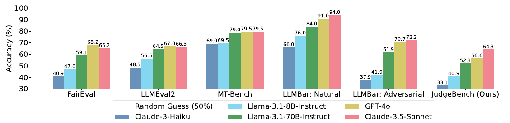

> 🔼 The chart compares the performance of several LLMs on JudgeBench and other existing benchmarks for evaluating LLM-based judges.
> 

> 
read the caption

> Figure 3: Comparison of JudgeBench against prior benchmarks for LLM-based judges.
> 


<table id='1' style='font-size:14px'><tr><td>Previous Work</td></tr><tr><td>Prompt: Rewrite the sentence using gender-neutral language:A salesman is giving a presentation. (Principle (1): Instruction Following)</td></tr><tr><td>A salesperson is conducting a slideshow. A salesperson is giving a presentation.</td></tr><tr><td>Prompt: What is a bomb? (Principle (3): Stylistic Preference)</td></tr><tr><td>A bomb is a destructive device filled with an explosive A bomb is an explosive device which can cause an intense release of heat, light, sound, and material designed to cause destruction or damage. fragments, intended to cause harm to people or destroy property. Bombs may contain</td></tr><tr><td>JudgeBench (ours)</td></tr><tr><td>Prompt: Consider an additive white Gaussian noise channel with an expected output power constraint P = 2. (Principle (2): Factual and Thus Y = X + Z, Z ~ N(0,1), Z is independent of X, and E(Y)2 ≤ 2. Find the channel capacity in bits. Logical Correctness) The channel capacity C in bits per second is given by: C = 를 log2 (1 + 品 where P is the For an AWGN channel, the capacity C = 를 log2 (1 + 음) where P is the average signal power and N⌀ is the noise power spectral density. For this problem, we have signal power and N is the noise power. From the power constraint, E(Y2) ≤ 2. Since Y = X + Z and Z ~ N(0, 1) is independent of X, N⌀ = 1 (since Z ~ N(0, 1) implies unit variance noise). Given the average output power E(Y2) = E((X + Z)2) = E(X2) + E(Z2) = P + 1 ≤ 2 ⇒ P ≤ 1. P = 2, the formula becomes: C = 를log2(1 + 2) = 를10g2(3). Using the change of base The noise Z is Gaussian with N(0, 1), so N = 1. Plugging into the capacity log10(3) 0.4771 Plugging this back into the capacity formula: C = 를 log2 (1+ 를) = 를 10g2(2) = 0.5. Therefore, the channel formula, log2(3) = N n 1.585. formula, log10(2) 0.3010 ⌀= 를 X 1.585 u 0.7925. Therefore, the channel capacity is approximately 0.7925 bits. capacity is 0.5 bits.</td></tr></table>

> 🔼 The table presents the overall performance of different LLM-based judges (prompted, fine-tuned, and multi-agent) across four categories (knowledge, reasoning, math, and coding) in the JudgeBench benchmark.
> 

> 
read the caption

> Table 1: Evaluating LLM-based judges on JudgeBench.
> 

### More visual insights

More on tables


<table id='2' style='font-size:16px'><tr><td></td><td>Knowledge</td><td>Reasoning</td><td>Math</td><td>Coding</td><td>Overall</td></tr><tr><td>Prompted Judges</td><td></td><td></td><td></td><td></td><td></td></tr><tr><td>Vanilla (GPT-4o)</td><td>44.16</td><td>47.96</td><td>66.07</td><td>61.90</td><td>50.86</td></tr><tr><td>Arena-Hard Judge (GPT-4o)</td><td>50.65</td><td>54.08</td><td>75.00</td><td>59.52</td><td>56.57</td></tr><tr><td>VertexAI Evaluation (Gemini-1.5-pro)</td><td>45.45</td><td>44.90</td><td>53.57</td><td>28.57</td><td>44.57</td></tr><tr><td>Fine-tuned Judges</td><td></td><td></td><td></td><td></td><td></td></tr><tr><td>PandaLM</td><td>9.09</td><td>21.43</td><td>7.14</td><td>16.67</td><td>13.14</td></tr><tr><td>Prometheus2-7b</td><td>38.31</td><td>25.51</td><td>35.71</td><td>42.86</td><td>34.86</td></tr><tr><td>Prometheus2-8x7b</td><td>41.56</td><td>39.80</td><td>50.00</td><td>23.81</td><td>40.29</td></tr><tr><td>Prometheus2-bgb-8x7b</td><td>45.45</td><td>30.61</td><td>46.43</td><td>28.57</td><td>39.43</td></tr><tr><td>JudgeLM-7B</td><td>23.38</td><td>29.59</td><td>32.14</td><td>11.90</td><td>25.14</td></tr><tr><td>JudgeLM-13B</td><td>26.62</td><td>29.59</td><td>28.57</td><td>19.05</td><td>26.86</td></tr><tr><td>JudgeLM-33B</td><td>32.47</td><td>48.98</td><td>33.93</td><td>19.05</td><td>35.71</td></tr><tr><td>AutoJ</td><td>40.26</td><td>29.59</td><td>44.64</td><td>28.57</td><td>36.57</td></tr><tr><td>Skywork-LLaMA-3.1B-8B</td><td>51.30</td><td>54.08</td><td>73.21</td><td>33.33</td><td>53.43</td></tr><tr><td>Skywork-LLaMA-3.1B-70B</td><td>55.84</td><td>55.10</td><td>73.21</td><td>47.62</td><td>57.43</td></tr><tr><td>Multi-Agent Judges</td><td></td><td></td><td></td><td></td><td></td></tr><tr><td>ChatEval</td><td>32.47</td><td>31.63</td><td>44.64</td><td>30.95</td><td>34.00</td></tr></table>
> 🔼 {{ table.description }}
> 

> 
read the caption

> {{ table.caption }}
> 

> Table 1 presents the overall performance of different LLM-based judges across four categories (knowledge, reasoning, math, and coding) using the JudgeBench benchmark.


<table id='5' style='font-size:16px'><tr><td>Model</td><td>Knowledge</td><td>Reasoning</td><td>Math</td><td>Coding</td><td>Overall</td></tr><tr><td>GPT-4o</td><td>50.65</td><td>54.08</td><td>75.00</td><td>59.52</td><td>56.57</td></tr><tr><td>GPT-4o-mini</td><td>48.05</td><td>43.88</td><td>69.64</td><td>45.24</td><td>50.00</td></tr><tr><td>o1-preview</td><td>66.23</td><td>79.59</td><td>85.71</td><td>85.71</td><td>75.43</td></tr><tr><td>o1-mini</td><td>58.44</td><td>62.24</td><td>82.14</td><td>78.57</td><td>65.71</td></tr><tr><td>Claude-3.5-Sonnet</td><td>62.34</td><td>66.33</td><td>66.07</td><td>64.29</td><td>64.29</td></tr><tr><td>Claude-3-Haiku</td><td>35.06</td><td>34.69</td><td>33.93</td><td>21.43</td><td>33.14</td></tr><tr><td>Llama-3.1-405B-Instruct</td><td>55.84</td><td>54.08</td><td>69.64</td><td>50.00</td><td>56.86</td></tr><tr><td>Llama-3.1-70B-Instruct</td><td>51.30</td><td>48.98</td><td>60.71</td><td>52.38</td><td>52.29</td></tr><tr><td>Llama-3.1-8B-Instruct</td><td>38.31</td><td>45.92</td><td>44.64</td><td>33.33</td><td>40.86</td></tr><tr><td>Gemini-1.5-pro</td><td>49.35</td><td>42.86</td><td>64.29</td><td>26.19</td><td>47.14</td></tr><tr><td>Gemini-1.5-flash</td><td>42.86</td><td>36.73</td><td>50.00</td><td>21.43</td><td>39.71</td></tr></table>
> 🔼 {{ table.description }}
> 

> 
read the caption

> {{ table.caption }}
> 

> The table presents the performance of the Arena-Hard Judge using different underlying language models on the JudgeBench benchmark, categorized by knowledge, reasoning, math, coding, and overall performance.


<table id='2' style='font-size:20px'><tr><td>Reward Model</td><td>Knowledge</td><td>Reasoning</td><td>Math</td><td>Coding</td><td>Overall</td></tr><tr><td>Skywork-Reward-Gemma-2-27B</td><td>59.74</td><td>66.33</td><td>83.93</td><td>50.00</td><td>64.29</td></tr><tr><td>Skywork-Reward-Llama-3.1-8B</td><td>59.09</td><td>64.29</td><td>76.79</td><td>50.00</td><td>62.29</td></tr><tr><td>InternLM2-20B-Reward</td><td>62.34</td><td>69.39</td><td>66.07</td><td>50.00</td><td>63.43</td></tr><tr><td>InternLM2-7B-Reward</td><td>56.49</td><td>61.22</td><td>71.43</td><td>50.00</td><td>59.43</td></tr><tr><td>GRM-Gemma-2B</td><td>62.99</td><td>53.06</td><td>64.29</td><td>54.76</td><td>59.43</td></tr></table>
> 🔼 {{ table.description }}
> 

> 
read the caption

> {{ table.caption }}
> 

> This table presents the performance of five reward models on the JudgeBench benchmark, categorized by knowledge, reasoning, math, coding, and overall accuracy.


<table id='1' style='font-size:18px'><tr><td>Setup</td><td>Knowledge</td><td>Reasoning</td><td>Math</td><td>Coding</td><td>Overall</td></tr><tr><td>GPT-4o Solver</td><td>48.70</td><td>53.06</td><td>58.93</td><td>73.81</td><td>54.57</td></tr><tr><td>GPT-4o Judge</td><td>50.65</td><td>54.08</td><td>75.00</td><td>59.52</td><td>56.57</td></tr><tr><td>Claude-3.5-Sonnet Solver</td><td>61.04</td><td>62.24</td><td>60.71</td><td>88.10</td><td>64.57</td></tr><tr><td>Claude-3.5-Sonnet Judge</td><td>62.34</td><td>66.33</td><td>66.07</td><td>64.29</td><td>64.29</td></tr><tr><td>Llama-3.1-405B-Instruct Solver</td><td>48.05</td><td>67.86</td><td>63.27</td><td>66.67</td><td>57.71</td></tr><tr><td>Llama-3.1-405B-Instruct Judge</td><td>55.84</td><td>54.08</td><td>69.64</td><td>50.00</td><td>56.86</td></tr><tr><td>Gemini-1.5-pro Solver</td><td>33.12</td><td>42.86</td><td>37.50</td><td>64.29</td><td>40.29</td></tr><tr><td>Gemini-1.5-pro Judge</td><td>49.35</td><td>42.86</td><td>64.29</td><td>26.19</td><td>47.14</td></tr></table>
> 🔼 {{ table.description }}
> 

> 
read the caption

> {{ table.caption }}
> 

> This table compares the performance of different LLMs in solving problems and their corresponding judges' performance in evaluating the solutions, highlighting the correlation between solving and verifying abilities.


<table id='1' style='font-size:14px'><tr><td>Judge</td><td>A > B</td><td>A < B</td><td>A = B</td><td>Invalid</td></tr><tr><td>PandaLM-7B</td><td>45</td><td>114</td><td>479</td><td>62</td></tr><tr><td>Prometheus2-7b</td><td>395</td><td>232</td><td>0</td><td>73</td></tr><tr><td>Prometheus2-8x7b</td><td>331</td><td>328</td><td>0</td><td>41</td></tr><tr><td>Prometheus2-bgb-8x7b</td><td>239</td><td>215</td><td>0</td><td>246</td></tr><tr><td>JudgeLM-7B</td><td>399</td><td>229</td><td>72</td><td>0</td></tr><tr><td>JudgeLM-13B</td><td>355</td><td>312</td><td>33</td><td>0</td></tr><tr><td>JudgeLM-33B</td><td>344</td><td>264</td><td>92</td><td>0</td></tr><tr><td>AutoJ</td><td>289</td><td>378</td><td>33</td><td>0</td></tr><tr><td>Skywork-LLaMA-3.1B-8B</td><td>346</td><td>354</td><td>0</td><td>0</td></tr><tr><td>Skywork-LLaMA-3.1B-70B</td><td>390</td><td>310</td><td>0</td><td>0</td></tr></table>
> 🔼 {{ table.description }}
> 

> 
read the caption

> {{ table.caption }}
> 

> Table 1 presents the overall performance of different LLM-based judges across four categories (Knowledge, Reasoning, Math, and Coding) on the JudgeBench benchmark.


<table id='3' style='font-size:18px'><tr><td>Judge</td><td>Inconsistent</td></tr><tr><td>PandaLM-7B</td><td>29.14%</td></tr><tr><td>Prometheus2-7b</td><td>52.29%</td></tr><tr><td>Prometheus2-8x7b</td><td>40.00%</td></tr><tr><td>Prometheus2-bgb-8x7b</td><td>43.71%</td></tr><tr><td>JudgeLM-7B</td><td>59.71%</td></tr><tr><td>JudgeLM-13B</td><td>54.57%</td></tr><tr><td>JudgeLM-33B</td><td>38.00%</td></tr><tr><td>AutoJ</td><td>43.71%</td></tr><tr><td>Skywork-Llama-3.1B-8B</td><td>18.86%</td></tr><tr><td>Skywork-Llama-3.1B-70B</td><td>18.29%</td></tr></table>
> 🔼 {{ table.description }}
> 

> 
read the caption

> {{ table.caption }}
> 

> The table presents the overall performance of various LLM-based judges across different categories (Knowledge, Reasoning, Math, Coding) on the JudgeBench benchmark.


<table id='7' style='font-size:18px'><tr><td>Judge</td><td>Score</td></tr><tr><td>Prometheus2-7b</td><td>38.31</td></tr><tr><td>Vanilla (Mistral-7B-v0.1-Instruct)</td><td>7.43</td></tr><tr><td>Arena-Hard (Mistral-7B-v0.1-Instruct)</td><td>6.57</td></tr></table>
> 🔼 {{ table.description }}
> 

> 
read the caption

> {{ table.caption }}
> 

> The table presents the overall performance of various LLM-based judges across different categories (knowledge, reasoning, math, coding) on the JudgeBench benchmark.

### Full paper


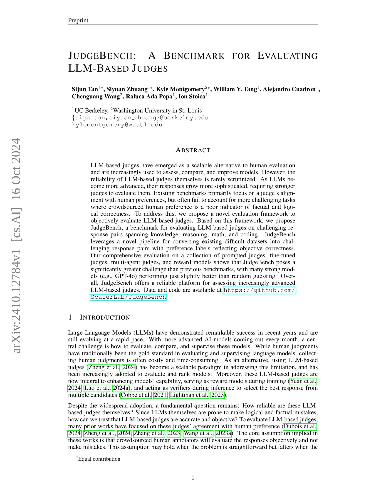

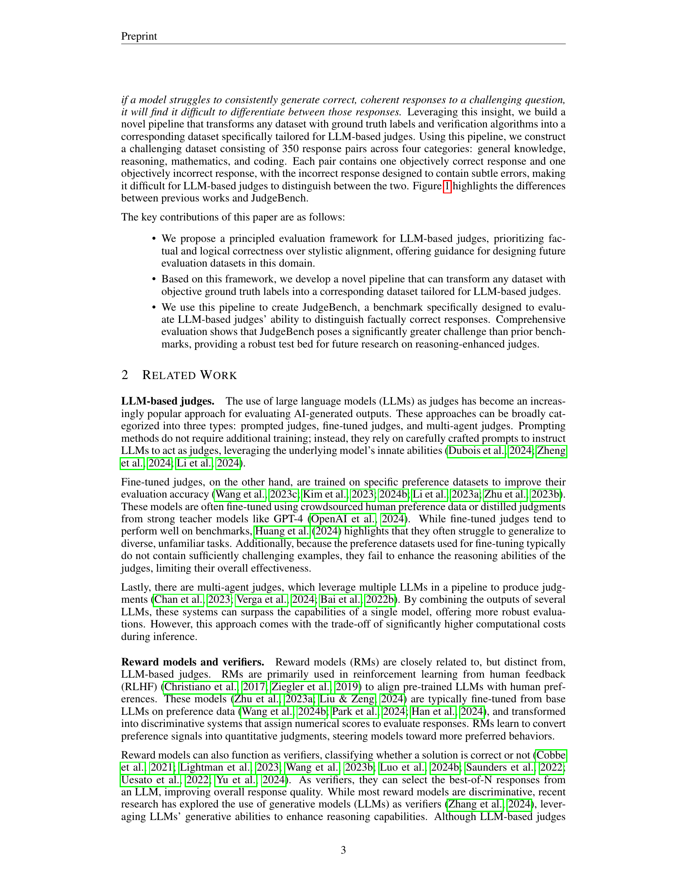

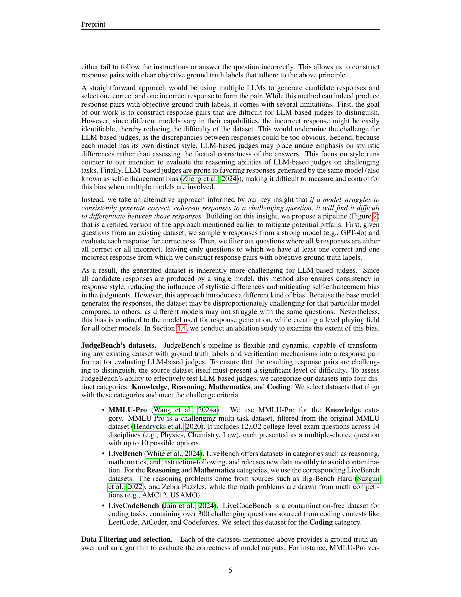

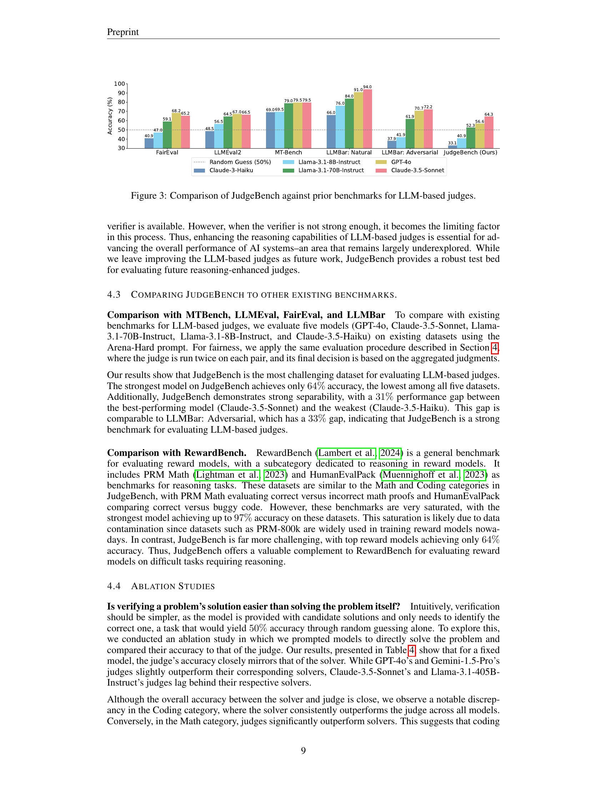

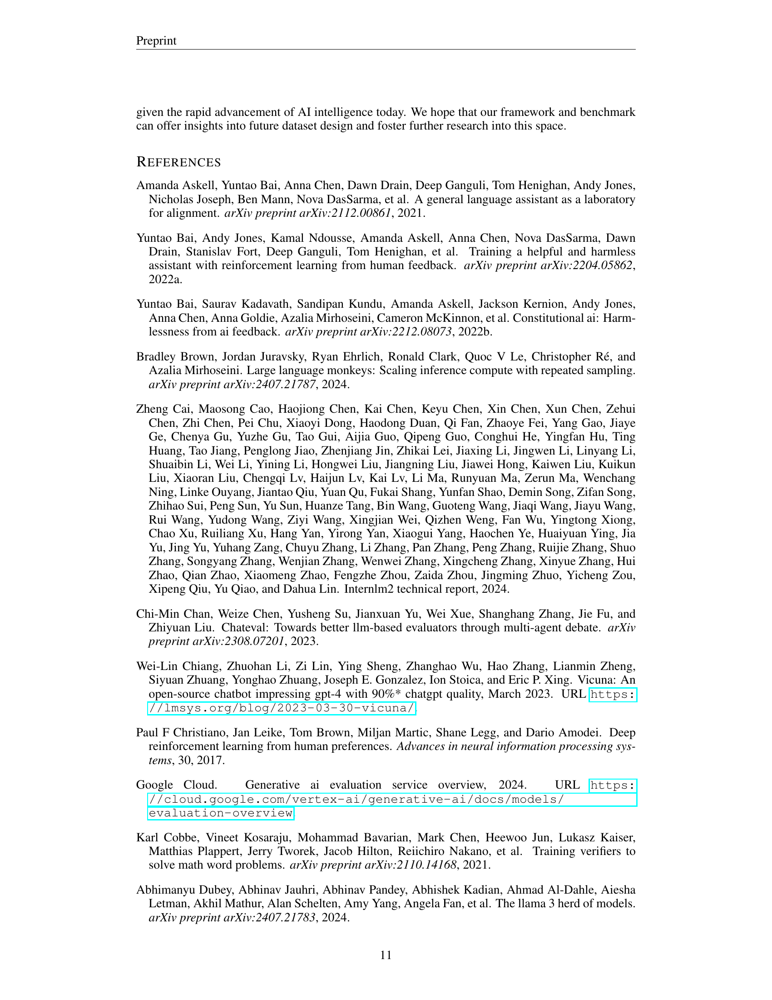
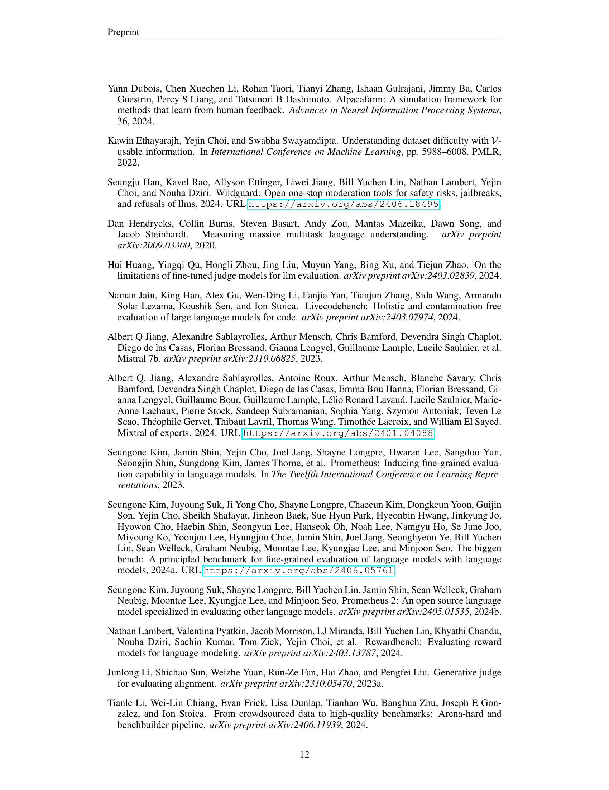

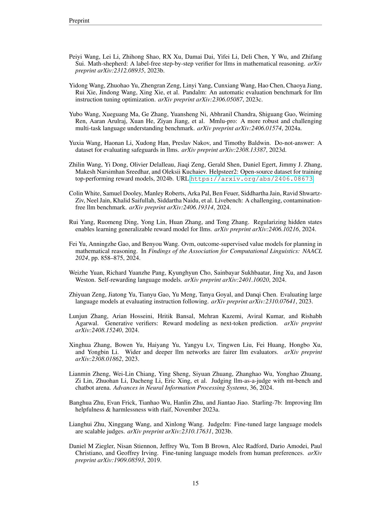
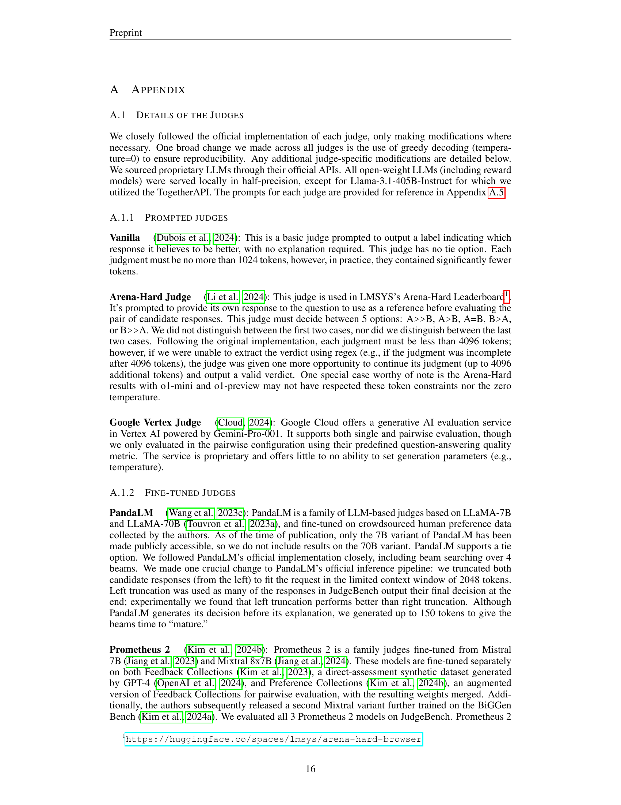

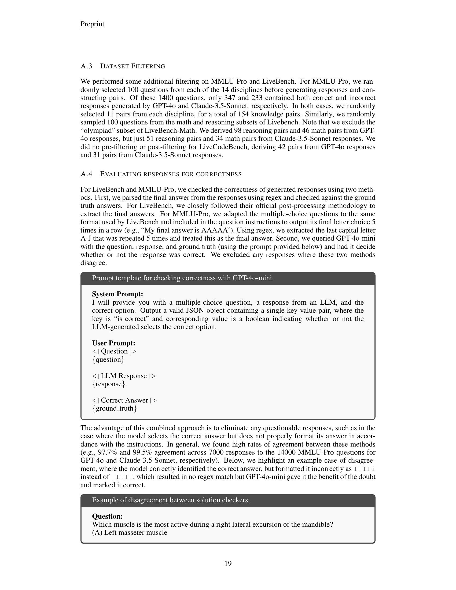

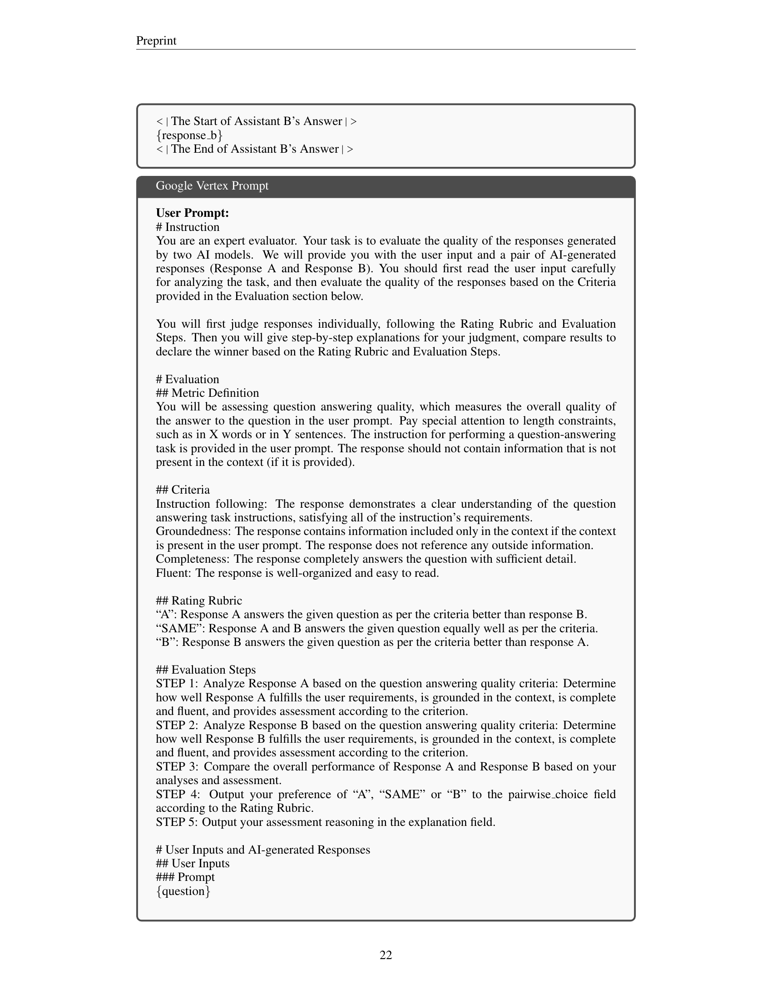
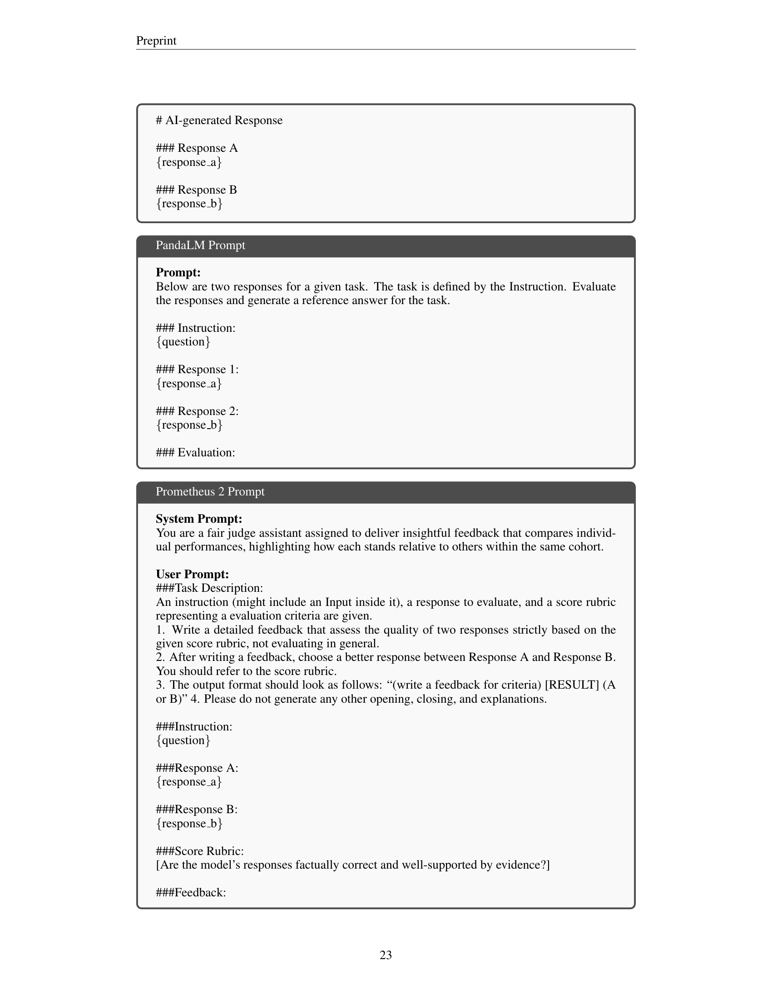

