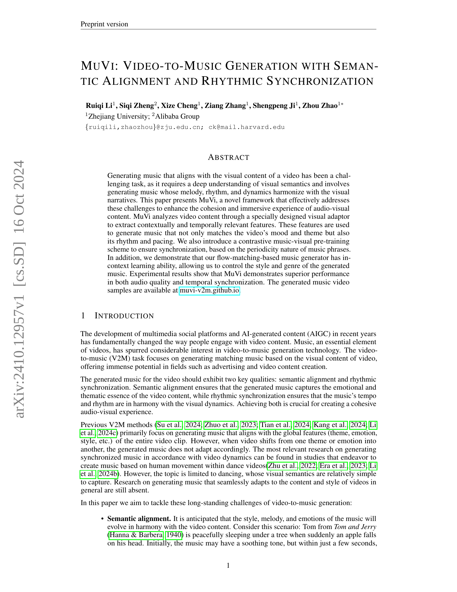
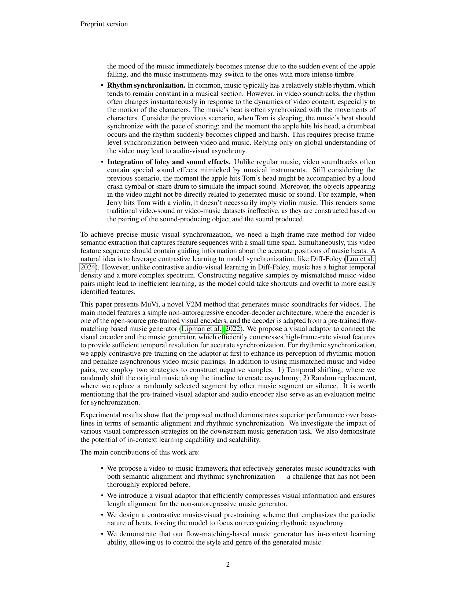
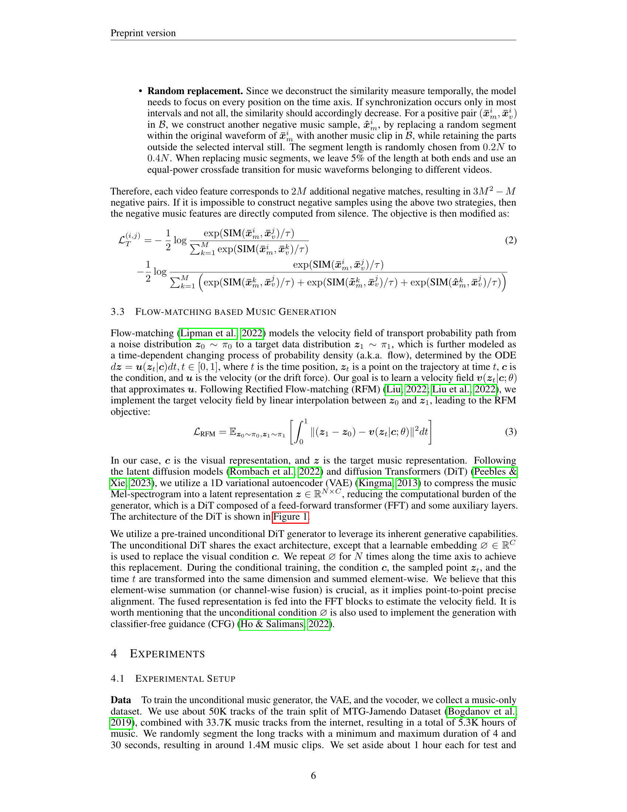
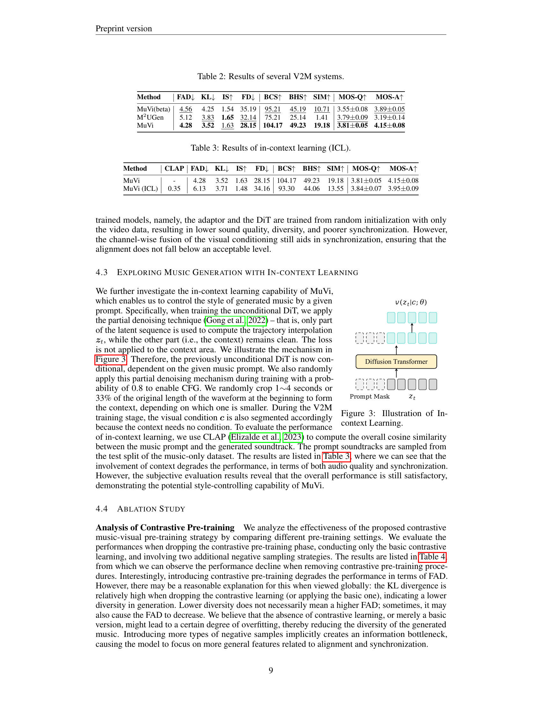
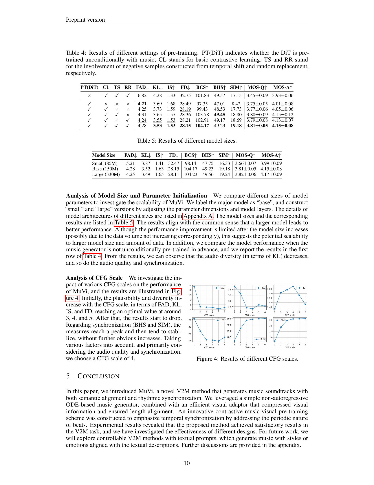
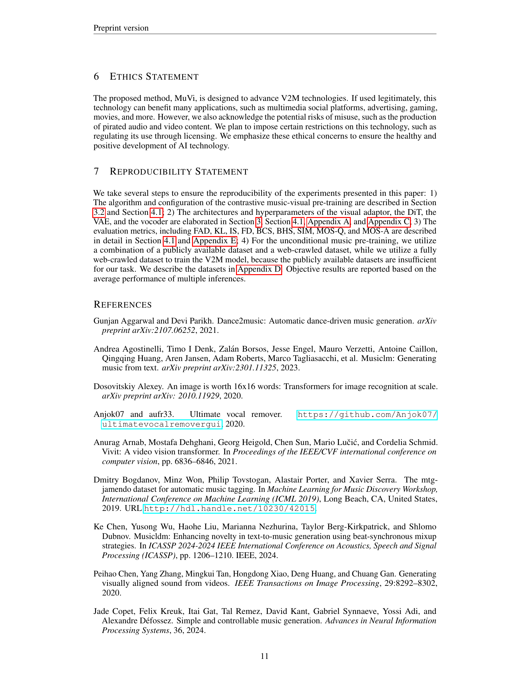
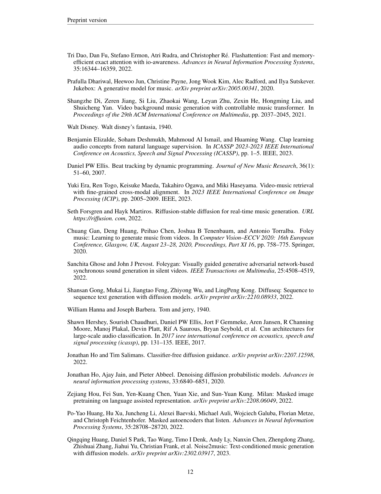
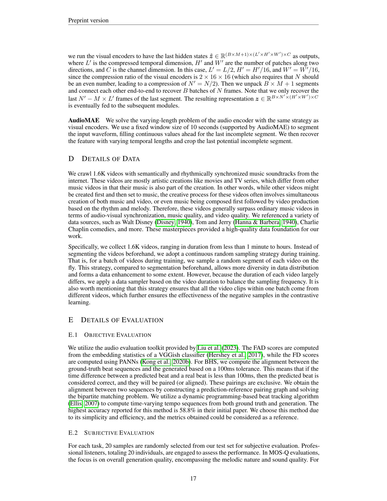

### TL;DR



MuVi tackles the challenge of creating music that perfectly complements video content.  It does this by focusing on two key aspects:  making sure the music's mood and theme match the video (semantic alignment), and making sure the music's rhythm and beat sync up with the video's action (rhythmic synchronization).  To achieve this, MuVi uses a special visual adaptor to analyze video content and extract important features. These features are used to generate music using a technique called flow-matching.  MuVi also employs a contrastive pre-training method to fine-tune the synchronization between music and video.  Experiments show that MuVi produces higher-quality music that is better synchronized with videos compared to existing methods. The generated music also demonstrates adaptability, meaning it can change its style and genre according to the video content. The researchers have also made the generated music video samples publicly available.




 &nbsp; read the paper on arXiv

  

 &nbsp; on Hugging Face


#### Why does it matter?
This paper is highly relevant to current research trends in AI-generated content and multimedia, offering a novel approach to video-to-music generation.  It addresses the limitations of existing methods, offering improvements in semantic alignment and rhythmic synchronization.  The proposed techniques open exciting new avenues for research into more immersive and emotionally resonant audio-visual experiences, including personalized music generation and advancements in AI-driven content creation.
#### Key Takeaways


 MuVi surpasses existing methods in generating music that harmonizes with video content, both semantically and rhythmically. 



 A contrastive music-visual pre-training scheme ensures precise synchronization by focusing on the periodic nature of music phrases. 



 MuVi demonstrates in-context learning, allowing control over the style and genre of generated music. 


------
#### Visual Insights

> 🔼 This figure illustrates the architecture of MuVi, a video-to-music generation framework, showing its visual encoder, visual adaptor, and diffusion transformer-based music generator.
> 

> 
read the caption

> Figure 1: The architecture of MuVi. The main model and the input/output are illustrated in the middle, where the visual encoder is frozen during the training stage. The visual compression strategies are listed on the left, where 'CLS' indicates the CLS token of certain visual encoders, such as CLIP. The architecture of the diffusion Transformer is illustrated on the right.
> 

> 🔼 The chart displays the impact of classifier-free guidance (CFG) scales on various metrics, including audio quality, diversity, and synchronization.
> 

> 
read the caption

> Figure 4: Results of different CFG scales.
> 


<table id='4' style='font-size:16px'><tr><td>Visual Encoder</td><td>Adaptor</td><td>FAD↓</td><td>KL↓</td><td>IS↑</td><td>FD↓</td><td>BCS↑</td><td>BHS↑</td><td>SIM↑</td><td>MOS-Q↑</td><td>MOS-A↑</td></tr><tr><td>CAVP (4 FPS)</td><td>-</td><td>5.45</td><td>4.13</td><td>1.45</td><td>38.95</td><td>87.50</td><td>41.90</td><td>4.05</td><td>3.59±0.06</td><td>3.41±0.10</td></tr><tr><td>CAVP (10 FPS)</td><td>-</td><td>5.31</td><td>4.05</td><td>1.39</td><td>37.04</td><td>88.93</td><td>45.18</td><td>4.08</td><td>3.67±0.07</td><td>3.45±0.12</td></tr><tr><td rowspan="5">CLIP</td><td>Softmax</td><td>5.12</td><td>3.53</td><td>1.62</td><td>31.28</td><td>106.33</td><td>50.05</td><td>15.38</td><td>3.71±0.06</td><td>4.14±0.10</td></tr><tr><td>Sigmoid</td><td>6.01</td><td>3.85</td><td>1.66</td><td>28.94</td><td>102.19</td><td>48.95</td><td>14.62</td><td>3.63±0.05</td><td>4.03±0.06</td></tr><tr><td>Attention</td><td>4.36</td><td>3.46</td><td>1.51</td><td>28.55</td><td>105.23</td><td>49.81</td><td>16.35</td><td>3.77±0.03</td><td>4.13±0.05</td></tr><tr><td>Average</td><td>6.40</td><td>3.76</td><td>1.61</td><td>32.79</td><td>105.45</td><td>49.52</td><td>14.82</td><td>3.54±0.07</td><td>3.94±0.09</td></tr><tr><td>CLS</td><td>7.40</td><td>4.04</td><td>1.71</td><td>36.32</td><td>103.06</td><td>49.50</td><td>13.47</td><td>3.56±0.08</td><td>3.89±0.06</td></tr><tr><td rowspan="3">VideoMAE</td><td>Softmax</td><td>4.93</td><td>3.80</td><td>1.43</td><td>30.71</td><td>101.15</td><td>48.87</td><td>18.47</td><td>3.73±0.06</td><td>4.12±0.08</td></tr><tr><td>Sigmoid</td><td>4.36</td><td>3.56</td><td>1.44</td><td>31.06</td><td>99.16</td><td>47.94</td><td>16.53</td><td>3.74±0.07</td><td>4.06±0.04</td></tr><tr><td>Average</td><td>5.13</td><td>4.02</td><td>1.37</td><td>33.78</td><td>97.82</td><td>47.01</td><td>15.59</td><td>3.63±0.06</td><td>4.02±0.09</td></tr><tr><td rowspan="3">VideoMAE V2</td><td>Softmax</td><td>4.28</td><td>3.52</td><td>1.63</td><td>28.15</td><td>104.17</td><td>49.23</td><td>19.18</td><td>3.81±0.05</td><td>4.15±0.08</td></tr><tr><td>Sigmoid</td><td>4.89</td><td>3.72</td><td>1.41</td><td>33.21</td><td>101.35</td><td>48.88</td><td>18.82</td><td>3.75±0.09</td><td>4.12±0.07</td></tr><tr><td>Average</td><td>4.75</td><td>4.04</td><td>1.55</td><td>31.71</td><td>99.85</td><td>48.28</td><td>15.67</td><td>3.52±0.12</td><td>3.96±0.09</td></tr></table>

> 🔼 The table presents the performance comparison of different visual encoders and visual adaptor strategies on various metrics including FAD, KL, IS, FD, BCS, BHS, SIM, MOS-Q and MOS-A.
> 

> 
read the caption

> Table 1: Results of different visual encoders and adaptors. The bold numbers represent the best result of that column, and the underlined numbers represent the second best. 'Softmax' and 'Sigmoid' represent the Softmax and Sigmoid aggregation strategies, “Attention” means the attention pooling strategy, and 'Average' and “CLS' indicate average pooling and pooling with the CLS token.
> 

### More visual insights

More on tables


<table id='2' style='font-size:14px'><tr><td>Method</td><td>FAD↓</td><td>KL↓</td><td>IS↑</td><td>FD↓</td><td>BCS↑</td><td>BHS↑</td><td>SIM↑</td><td>MOS-Q↑</td><td>MOS-A↑</td></tr><tr><td>MuVi(beta)</td><td>4.56</td><td>4.25</td><td>1.54</td><td>35.19</td><td>95.21</td><td>45.19</td><td>10.71</td><td>3.55±0.08</td><td>3.89±0.05</td></tr><tr><td>M2UGen</td><td>5.12</td><td>3.83</td><td>1.65</td><td>32.14</td><td>75.21</td><td>25.14</td><td>1.41</td><td>3.79±0.09</td><td>3.19±0.14</td></tr><tr><td>MuVi</td><td>4.28</td><td>3.52</td><td>1.63</td><td>28.15</td><td>104.17</td><td>49.23</td><td>19.18</td><td>3.81±0.05</td><td>4.15±0.08</td></tr></table>
> 🔼 {{ table.description }}
> 

> 
read the caption

> {{ table.caption }}
> 

> Table 2 presents a comparison of several video-to-music generation systems, evaluating their performance using various metrics including FAD, KL, IS, FD, BCS, BHS, SIM, MOS-Q, and MOS-A.


<table id='4' style='font-size:14px'><tr><td>Method</td><td>CLAP</td><td>FAD↓</td><td>KL↓</td><td>IS↑</td><td>FD↓</td><td>BCS↑</td><td>BHS↑</td><td>SIM↑ I</td><td>MOS-Q↑</td><td>MOS-A↑</td></tr><tr><td>MuVi</td><td>-</td><td>4.28</td><td>3.52</td><td>1.63</td><td>28.15</td><td>104.17</td><td>49.23</td><td>19.18</td><td>3.81±0.05</td><td>4.15±0.08</td></tr><tr><td>MuVi (ICL)</td><td>0.35</td><td>6.13</td><td>3.71</td><td>1.48</td><td>34.16</td><td>93.30</td><td>44.06</td><td>13.55</td><td>3.84±0.07</td><td>3.95±0.09</td></tr></table>
> 🔼 {{ table.description }}
> 

> 
read the caption

> {{ table.caption }}
> 

> Table 3 presents a comparison of the performance metrics for MuVi with and without in-context learning, showing the impact of incorporating a music prompt on the generated music's quality and alignment with the video.


<table id='2' style='font-size:14px'><tr><td>PT(DiT)</td><td>CL</td><td>TS</td><td>RR</td><td>FAD↓</td><td>KL↓</td><td>IS↑</td><td>FD↓</td><td>BCS↑</td><td>BHS↑</td><td>SIM↑</td><td>MOS-Q↑</td><td>MOS-A↑</td></tr><tr><td>x</td><td>V</td><td>V</td><td>V</td><td>6.82</td><td>4.28</td><td>1.33</td><td>32.75</td><td>101.83</td><td>49.57</td><td>17.15</td><td>3.45±0.09</td><td>3.93±0.06</td></tr><tr><td></td><td>X</td><td>x</td><td>x</td><td>4.21</td><td>3.69</td><td>1.68</td><td>28.49</td><td>97.35</td><td>47.01</td><td>8.42</td><td>3.75±0.05</td><td>4.01±0.08</td></tr><tr><td></td><td>V</td><td>x</td><td>X</td><td>4.25</td><td>3.73</td><td>1.59</td><td>28.19</td><td>99.43</td><td>48.53</td><td>17.73</td><td>3.77±0.06</td><td>4.05±0.06</td></tr><tr><td></td><td>V</td><td>V</td><td>X</td><td>4.31</td><td>3.65</td><td>1.57</td><td>28.36</td><td>103.78</td><td>49.45</td><td>18.80</td><td>3.80±0.09</td><td>4.15±0.12</td></tr><tr><td></td><td>V</td><td>x</td><td>V</td><td>4.24</td><td>3.55</td><td>1.53</td><td>28.21</td><td>102.91</td><td>49.17</td><td>18.69</td><td>3.79±0.08</td><td>4.13±0.07</td></tr><tr><td></td><td>V</td><td>V</td><td>V</td><td>4.28</td><td>3.53</td><td>1.53</td><td>28.15</td><td>104.17</td><td>49.23</td><td>19.18</td><td>3.81±0.05</td><td>4.15±0.08</td></tr></table>
> 🔼 {{ table.description }}
> 

> 
read the caption

> {{ table.caption }}
> 

> Table 4 presents the ablation study results showing the impact of different pre-training settings on the performance of the MuVi model.


<table id='4' style='font-size:16px'><tr><td>Model Size</td><td>FAD↓</td><td>KL↓</td><td>IS↑</td><td>FD↓</td><td>BCS↑</td><td>BHS↑</td><td>SIM↑</td><td>MOS-Q↑</td><td>MOS-A↑</td></tr><tr><td>Small (85M)</td><td>5.21</td><td>3.87</td><td>1.41</td><td>32.47</td><td>98.14</td><td>47.75</td><td>16.33</td><td>3.66±0.07</td><td>3.99±0.09</td></tr><tr><td>Base (150M)</td><td>4.28</td><td>3.52</td><td>1.63</td><td>28.15</td><td>104.17</td><td>49.23</td><td>19.18</td><td>3.81±0.05</td><td>4.15±0.08</td></tr><tr><td>Large (330M)</td><td>4.25</td><td>3.49</td><td>1.65</td><td>28.11</td><td>104.23</td><td>49.56</td><td>19.24</td><td>3.82±0.06</td><td>4.17±0.09</td></tr></table>
> 🔼 {{ table.description }}
> 

> 
read the caption

> {{ table.caption }}
> 

> Table 5 presents the results of using different model sizes (small, base, and large) for video-to-music generation, evaluating performance metrics such as FAD, KL, IS, FD, BCS, BHS, SIM, MOS-Q, and MOS-A.


<table id='2' style='font-size:14px'><tr><td>Hyperparameter</td><td>Small</td><td>Base</td><td>Large</td></tr><tr><td>Hidden dimension</td><td>768</td><td>1024</td><td>1280</td></tr><tr><td>#Layers</td><td>12</td><td>12</td><td>16</td></tr><tr><td>#Attention heads</td><td>16</td><td>16</td><td>16</td></tr><tr><td>#Parameters</td><td>85M</td><td>150M</td><td>330M</td></tr></table>
> 🔼 {{ table.description }}
> 

> 
read the caption

> {{ table.caption }}
> 

> Table 6 shows the hyperparameters of the diffusion transformer (DiT) model with different sizes (small, base, and large), including hidden dimension, number of layers, attention heads, and total number of parameters.


<table id='2' style='font-size:14px'><tr><td>FPS</td><td>FAD↓</td><td>KL↓</td><td>IS↑</td><td>FD↓</td><td>BCS↑</td><td>BHS↑</td><td>SIM↑</td><td>MOS-Q↑</td><td>MOS-A↑</td></tr><tr><td>2</td><td>7.86</td><td>4.24</td><td>1.28</td><td>39.18</td><td>85.33</td><td>40.12</td><td>11.12</td><td>3.71±0.03</td><td>3.76±0.07</td></tr><tr><td>4</td><td>5.38</td><td>4.14</td><td>1.39</td><td>34.24</td><td>96.46</td><td>47.13</td><td>15.26</td><td>3.75±0.07</td><td>3.93±0.05</td></tr><tr><td>10</td><td>4.28</td><td>3.52</td><td>1.63</td><td>28.15</td><td>104.17</td><td>49.23</td><td>19.18</td><td>3.81±0.05</td><td>4.15±0.08</td></tr><tr><td>20</td><td>4.25</td><td>3.53</td><td>1.65</td><td>28.11</td><td>104.22</td><td>50.08</td><td>20.11</td><td>3.83±0.08</td><td>4.16±0.05</td></tr></table>
> 🔼 {{ table.description }}
> 

> 
read the caption

> {{ table.caption }}
> 

> Table 7 presents the effects of different video frame rates on the performance of MuVi, comparing metrics such as FAD, KL, IS, FD, BCS, BHS, SIM, MOS-Q, and MOS-A.

### Full paper



