### TL;DR



Medical vision-language models (Med-LVLMs) show promise but often suffer from factual inaccuracies. This paper introduces MMed-RAG, a new system designed to enhance Med-LVM factuality.  MMed-RAG uses three key innovations: 1) A domain-aware retrieval mechanism that adapts to different medical domains (e.g., radiology, ophthalmology); 2) An adaptive method to select only the most relevant retrieved information; and 3) A preference-based fine-tuning strategy to improve the alignment between the model's output and ground truth.  Experiments across five diverse medical datasets show that MMed-RAG significantly improves the factual accuracy of Med-LVLMs (a 43.8% average improvement), outperforming other state-of-the-art methods. The system is versatile, works well across various medical domains, and addresses key misalignment issues. The code and data are publicly available.




 &nbsp; read the paper on arXiv

  

 &nbsp; on Hugging Face


#### Why does it matter?
This paper is crucial for researchers working on medical vision-language models and factual accuracy.  It introduces novel methods to improve model reliability, directly addressing a key challenge in the field. The proposed techniques and the extensive experiments provide valuable insights and benchmarks for future research, potentially leading to safer and more effective clinical applications of AI.
#### Key Takeaways


 MMed-RAG enhances the factuality of medical vision-language models by addressing misalignment issues through a novel multimodal RAG system. 



 Domain-aware retrieval, adaptive context selection, and RAG-based preference fine-tuning significantly improve the accuracy and reliability of Med-LVLMs. 



 MMed-RAG demonstrates significant improvements (average 43.8% accuracy increase) across various medical datasets, showcasing its generalizability and effectiveness. 


------
#### Visual Insights

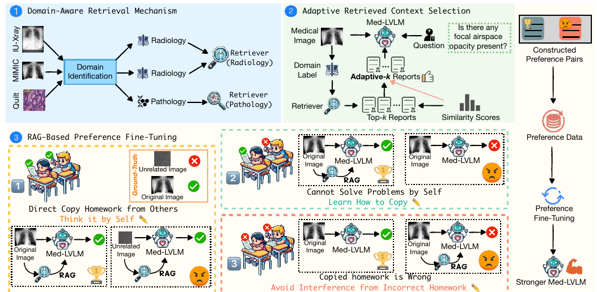

> 🔼 The figure illustrates the MMed-RAG system's architecture, highlighting its domain-aware retrieval, adaptive context selection, and RAG-based preference fine-tuning components.
> 

> 
read the caption

> Figure 1: Overview of MMed-RAG, a versatile factual multimodal RAG system designed to enhance the reliability of Med-LVLMs. It introduces a domain-aware retrieval mechanism that effectively handles different domains of medical images by selecting suitable retrieval models. Additionally, it uses an adaptive context selection approach to determine the optimal number of retrieved contexts and employs preference fine-tuning to improve both cross-modality and overall alignment.
> 

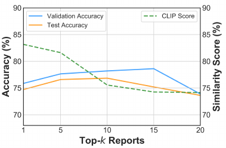

> 🔼 The chart shows the relationship between the number of top-k reports selected and their similarity scores, as well as the validation and test accuracy.
> 

> 
read the caption

> Figure 2: Relations between selected contexts and similarity.
> 


<table id='2' style='font-size:14px'><tr><td rowspan="3">Models</td><td colspan="6">Radiology</td><td colspan="3">Ophthalmology</td><td colspan="6">Pathology</td></tr><tr><td colspan="3">IU-Xray</td><td colspan="3">MIMIC-CXR</td><td colspan="3">Harvard-FairVLMed</td><td colspan="3">Quilt-1M</td><td colspan="3">PMC-OA (Pathology)</td></tr><tr><td>Acc</td><td>F1</td><td>AUC</td><td>Acc</td><td>F1</td><td>AUC</td><td>Acc</td><td>F1</td><td>AUC</td><td>Acc</td><td>F1</td><td>AUC</td><td>Acc</td><td>F1</td><td>AUC</td></tr><tr><td>LLaVA-Med-1.5</td><td>75.47</td><td>64.04</td><td>67.46</td><td>75.79</td><td>80.49</td><td>68.84</td><td>63.03</td><td>74.11</td><td>63.05</td><td>62.80</td><td>72.90</td><td>60.03</td><td>59.28</td><td>71.98</td><td>54.19</td></tr><tr><td rowspan="5">+ Greedy + Beam Search + DoLa + OPERA + VCD</td><td>76.88</td><td>65.59</td><td>68.74</td><td>78.32</td><td>86.75</td><td>71.13</td><td>82.54</td><td>85.98</td><td>70.09</td><td>64.72</td><td>70.12</td><td>58.75</td><td>58.61</td><td>70.42</td><td>53.10</td></tr><tr><td>76.91</td><td>66.06</td><td>68.77</td><td>81.56</td><td>86.36</td><td>73.79</td><td>80.93</td><td>88.08</td><td>68.94</td><td>63.52</td><td>69.33</td><td>57.65</td><td>56.29</td><td>69.84</td><td>52.89</td></tr><tr><td>78.00</td><td>66.75</td><td>72.19</td><td>81.35</td><td>85.73</td><td>72.73</td><td>76.87</td><td>85.53</td><td>67.10</td><td>63.47</td><td>69.10</td><td>57.58</td><td>57.71</td><td>70.27</td><td>52.95</td></tr><tr><td>70.59</td><td>61.54</td><td>63.22</td><td>69.34</td><td>76.66</td><td>62.46</td><td>71.41</td><td>81.37</td><td>65.59</td><td>60.51</td><td>66.32</td><td>54.79</td><td>55.32</td><td>68.30</td><td>51.86</td></tr><tr><td>68.99</td><td>54.35</td><td>61.08</td><td>70.89</td><td>75.57</td><td>64.61</td><td>65.88</td><td>77.20</td><td>64.16</td><td>61.43</td><td>67.39</td><td>55.72</td><td>55.10</td><td>67.94</td><td>51.62</td></tr><tr><td rowspan="3">+ MedDr + FactMM-RAG + RULE</td><td>83.33</td><td>67.80</td><td>77.15</td><td>55.16</td><td>56.18</td><td>58.47</td><td>70.17</td><td>80.72</td><td>64.15</td><td>68.15</td><td>73.23</td><td>67.01</td><td>59.97</td><td>69.19</td><td>57.01</td></tr><tr><td>84.51</td><td>68.51</td><td>77.07</td><td>77.58</td><td>81.86</td><td>70.09</td><td>83.67</td><td>87.21</td><td>72.20</td><td>69.25</td><td>73.62</td><td>68.15</td><td>60.49</td><td>69.38</td><td>57.31</td></tr><tr><td>87.84</td><td>78.00</td><td>85.78</td><td>83.92</td><td>87.49</td><td>83.44</td><td>87.12</td><td>92.89</td><td>77.08</td><td>68.97</td><td>73.80</td><td>68.13</td><td>61.41</td><td>70.36</td><td>58.91</td></tr><tr><td>MMed-RAG</td><td>89.54</td><td>80.72</td><td>87.13</td><td>83.57</td><td>88.49</td><td>85.08</td><td>87.94</td><td>92.78</td><td>80.81</td><td>72.95</td><td>76.35</td><td>72.25</td><td>64.54</td><td>73.09</td><td>61.42</td></tr></table>

> 🔼 Table 1 presents a comparison of different methods' performance on medical visual question answering (VQA) using LLaVA-Med-1.5, showing accuracy, F1-score, and AUROC across multiple datasets.
> 

> 
read the caption

> Table 1: Model performance (%) of different methods based on LLaVA-Med-1.5 on medical VQA task. Notably, we report the accuracy, F1 score and AUROC. The best results and second best results are highlighted in red and blue, respectively.
> 

### More visual insights

More on figures

> 🔼 The figure illustrates the architecture of MMed-RAG, a multimodal RAG system for improving the factuality of Med-LVLMs, highlighting its domain-aware retrieval, adaptive context selection, and RAG-based preference fine-tuning.
> 

> 
read the caption

> Figure 1: Overview of MMed-RAG, a versatile factual multimodal RAG system designed to enhance the reliability of Med-LVLMs. It introduces a domain-aware retrieval mechanism that effectively handles different domains of medical images by selecting suitable retrieval models. Additionally, it uses an adaptive context selection approach to determine the optimal number of retrieved contexts and employs preference fine-tuning to improve both cross-modality and overall alignment.
> 

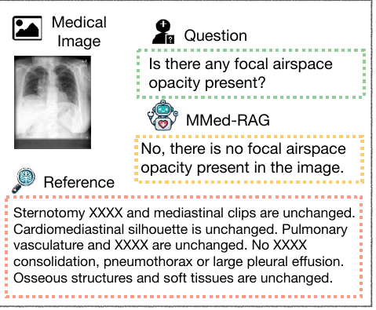

> 🔼 The figure illustrates the architecture of the MMed-RAG system, highlighting its domain-aware retrieval, adaptive context selection, and RAG-based preference fine-tuning components.
> 

> 
read the caption

> Figure 1: Overview of MMed-RAG, a versatile factual multimodal RAG system designed to enhance the reliability of Med-LVLMs. It introduces a domain-aware retrieval mechanism that effectively handles different domains of medical images by selecting suitable retrieval models. Additionally, it uses an adaptive context selection approach to determine the optimal number of retrieved contexts and employs preference fine-tuning to improve both cross-modality and overall alignment.
> 

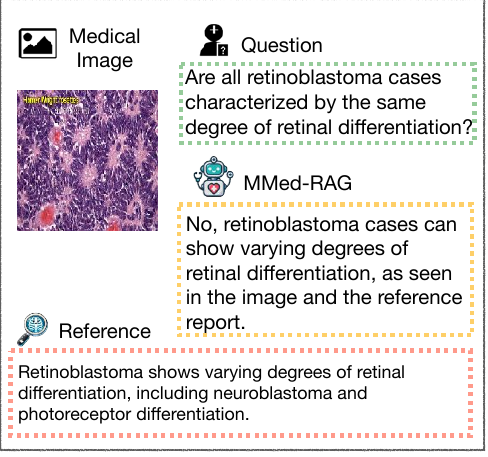

> 🔼 The figure illustrates the architecture of MMed-RAG, a multimodal retrieval augmented generation system for enhancing the factuality of medical vision language models.
> 

> 
read the caption

> Figure 1: Overview of MMed-RAG, a versatile factual multimodal RAG system designed to enhance the reliability of Med-LVLMs. It introduces a domain-aware retrieval mechanism that effectively handles different domains of medical images by selecting suitable retrieval models. Additionally, it uses an adaptive context selection approach to determine the optimal number of retrieved contexts and employs preference fine-tuning to improve both cross-modality and overall alignment.
> 

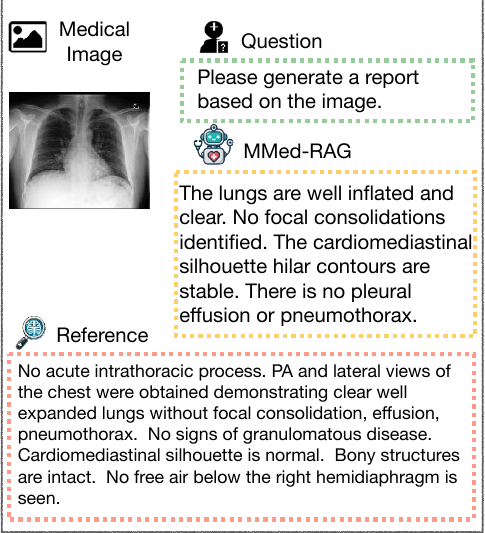

> 🔼 The figure illustrates the architecture of MMed-RAG, a multimodal RAG system for enhancing the reliability of Med-LVLMs by incorporating a domain-aware retrieval mechanism, adaptive context selection, and RAG-based preference fine-tuning.
> 

> 
read the caption

> Figure 1: Overview of MMed-RAG, a versatile factual multimodal RAG system designed to enhance the reliability of Med-LVLMs. It introduces a domain-aware retrieval mechanism that effectively handles different domains of medical images by selecting suitable retrieval models. Additionally, it uses an adaptive context selection approach to determine the optimal number of retrieved contexts and employs preference fine-tuning to improve both cross-modality and overall alignment.
> 

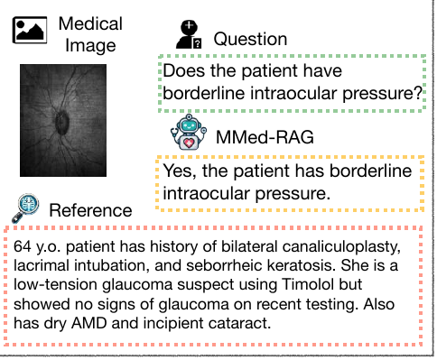

> 🔼 The figure illustrates the architecture of MMed-RAG, a multimodal RAG system for enhancing the factuality of Med-LVLMs, which includes a domain-aware retrieval mechanism, adaptive retrieved context selection, and RAG-based preference fine-tuning.
> 

> 
read the caption

> Figure 1: Overview of MMed-RAG, a versatile factual multimodal RAG system designed to enhance the reliability of Med-LVLMs. It introduces a domain-aware retrieval mechanism that effectively handles different domains of medical images by selecting suitable retrieval models. Additionally, it uses an adaptive context selection approach to determine the optimal number of retrieved contexts and employs preference fine-tuning to improve both cross-modality and overall alignment.
> 

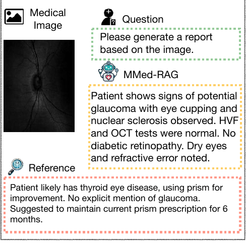

> 🔼 The figure illustrates the architecture of MMed-RAG, a multimodal RAG system designed to enhance the factual accuracy of Medical Large Vision-Language Models (Med-LVLMs) by incorporating a domain-aware retrieval mechanism, adaptive retrieved context selection, and RAG-based preference fine-tuning.
> 

> 
read the caption

> Figure 1: Overview of MMed-RAG, a versatile factual multimodal RAG system designed to enhance the reliability of Med-LVLMs. It introduces a domain-aware retrieval mechanism that effectively handles different domains of medical images by selecting suitable retrieval models. Additionally, it uses an adaptive context selection approach to determine the optimal number of retrieved contexts and employs preference fine-tuning to improve both cross-modality and overall alignment.
> 

More on charts

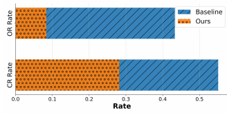

> 🔼 The chart displays the rates of over-reliance and copy-reference errors before and after incorporating the proposed MMed-RAG system.
> 

> 
read the caption

> Figure 3: Alignment analysis with and without RAG. OR: Over-Reliance; CR: Copy-Reference.
> 

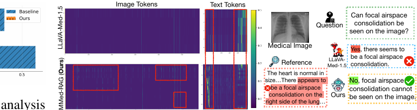

> 🔼 The chart displays a comparison of the original Med-LVLM and MMed-RAG in terms of Copy-Reference (CR) rate and Over-Reliance (OR) rate, showcasing the effectiveness of MMed-RAG in mitigating misalignment issues.
> 

> 
read the caption

> Figure 3: Alignment analysis with and without RAG. OR: Over-Reliance; CR: Copy-Reference.
> 

More on tables


 <table id='4' style='font-size:16px'><tr><td rowspan="3">Models</td><td colspan="6">Radiology</td><td colspan="3">Ophthalmology</td></tr><tr><td colspan="3">IU-Xray</td><td colspan="3">MIMIC-CXR</td><td colspan="3">Harvard-FairVLMed</td></tr><tr><td>BLEU</td><td>ROUGE-L</td><td>METEOR</td><td>BLEU</td><td>ROUGE-L</td><td>METEOR</td><td>BLEU</td><td>ROUGE-L</td><td>METEOR</td></tr><tr><td>LLaVA-Med-1.5</td><td>9.64</td><td>12.26</td><td>8.21</td><td>12.11</td><td>13.05</td><td>11.16</td><td>18.11</td><td>11.36</td><td>10.75</td></tr><tr><td rowspan="5">+ Greedy + Beam Search + DoLa + OPERA + VCD</td><td>11.47</td><td>15.38</td><td>12.69</td><td>16.63</td><td>14.26</td><td>14.19</td><td>17.98</td><td>11.49</td><td>13.77</td></tr><tr><td>12.10</td><td>16.21</td><td>13.17</td><td>16.97</td><td>14.74</td><td>14.43</td><td>18.37</td><td>12.62</td><td>14.50</td></tr><tr><td>11.79</td><td>15.82</td><td>12.72</td><td>17.11</td><td>14.89</td><td>14.81</td><td>18.26</td><td>12.51</td><td>14.51</td></tr><tr><td>10.66</td><td>14.70</td><td>12.01</td><td>15.40</td><td>12.52</td><td>13.72</td><td>16.59</td><td>11.47</td><td>13.63</td></tr><tr><td>10.42</td><td>14.14</td><td>11.59</td><td>15.18</td><td>12.30</td><td>13.38</td><td>16.73</td><td>11.38</td><td>13.89</td></tr><tr><td rowspan="3">+ MedDr + FactMM-RAG + RULE</td><td>12.37</td><td>16.45</td><td>13.50</td><td>18.59</td><td>15.72</td><td>16.77</td><td>19.82</td><td>13.72</td><td>15.40</td></tr><tr><td>14.70</td><td>18.05</td><td>15.92</td><td>18.71</td><td>15.84</td><td>16.82</td><td>20.82</td><td>14.17</td><td>15.31</td></tr><tr><td>27.53</td><td>23.16</td><td>27.99</td><td>18.61</td><td>15.96</td><td>17.42</td><td>22.35</td><td>14.93</td><td>17.74</td></tr><tr><td>MMed-RAG</td><td>31.38</td><td>25.59</td><td>32.43</td><td>23.25</td><td>12.34</td><td>20.47</td><td>24.82</td><td>16.59</td><td>19.85</td></tr></table>
> 🔼 {{ table.description }}
> 

> 
read the caption

> {{ table.caption }}
> 

> Table 2 presents a comparison of the performance of various methods on the report generation task using the LLaVA-Med-1.5 model, showing the average BLEU, ROUGE-L, and METEOR scores.


 <table id='5' style='font-size:14px'><tr><td>Model</td><td>I Rad</td><td>Opt</td><td>Pat</td></tr><tr><td>Med-Flamingo</td><td>27.42</td><td>22.50</td><td>29.11</td></tr><tr><td>MedVInT</td><td>33.17</td><td>29.40</td><td>25.33</td></tr><tr><td>RadFM</td><td>35.82</td><td>27.07</td><td>24.82</td></tr><tr><td>miniGPT-Med</td><td>36.66</td><td>25.28</td><td>23.16</td></tr><tr><td>MMed-RAG</td><td>56.94</td><td>56.38</td><td>54.10</td></tr></table>
> 🔼 {{ table.description }}
> 

> 
read the caption

> {{ table.caption }}
> 

> Table 3 presents a comparison of the performance of MMed-RAG against other open-source Med-LVLMs across different medical image modalities, showing that MMed-RAG significantly outperforms other Med-LVLMs.


 <table id='12' style='font-size:14px'><tr><td></td><td colspan="2">IU-Xray</td><td colspan="2">FairVLMed</td></tr><tr><td></td><td>VQA</td><td>RG</td><td>VQA</td><td>RG</td></tr><tr><td></td><td>68.99</td><td>10.04</td><td>66.63</td><td>13.41</td></tr><tr><td></td><td>77.12</td><td>13.23</td><td>72.69</td><td>15.89</td></tr><tr><td></td><td>79.56</td><td>17.92</td><td>75.74</td><td>17.22</td></tr><tr><td>(Ours)</td><td>85.80</td><td>29.80</td><td>87.18</td><td>20.42</td></tr></table>
> 🔼 {{ table.description }}
> 

> 
read the caption

> {{ table.caption }}
> 

> Table 4 presents the ablation study results showing the performance gains of each component of MMed-RAG on two datasets, IU-Xray and Harvard-FairVLMed, for both medical VQA and report generation tasks.


<table id='20' style='font-size:14px'><tr><td>Model</td><td colspan="2">IU-Xray</td><td colspan="2">FairVLMed</td></tr><tr><td></td><td>VQA</td><td>RG</td><td>VQA</td><td>RG</td></tr><tr><td>LLaVA-Med-1.5</td><td>68.99</td><td>10.04</td><td>66.63</td><td>13.41</td></tr><tr><td>+RAG-PT 1</td><td>80.19</td><td>19.38</td><td>79.42</td><td>18.37</td></tr><tr><td>+RAG-PT 2</td><td>80.27</td><td>20.16</td><td>79.35</td><td>18.66</td></tr><tr><td>+RAG-PT 3</td><td>81.30</td><td>19.43</td><td>80.07</td><td>18.92</td></tr></table>
> 🔼 {{ table.description }}
> 

> 
read the caption

> {{ table.caption }}
> 

> The table presents the ablation study results for both medical VQA and report generation tasks on the IU-Xray and Harvard-FairVLMed datasets, showing the impact of each component in MMed-RAG.


<table id='1' style='font-size:16px'><tr><td>Haotian Liu, Chunyuan Li, Qingyang Wu, and Yong Jae Lee. Visual instruction tuning. Advances in neural information processing systems, 36, 2024b.</td></tr><tr><td>Yan Luo, Min Shi, Muhammad Osama Khan, Muhammad Muneeb Afzal, Hao Huang, Shuaihang Yuan, Yu Tian, Luo Song, Ava Kouhana, Tobias Elze, et al. Fairclip: Harnessing fairness in vision-language learning. arXiv preprint arXiv:2403.19949, 2024.</td></tr><tr><td>Michael Moor, Qian Huang, Shirley Wu, Michihiro Yasunaga, Yash Dalmia, Jure Leskovec, Cyril Zakka, Eduardo Pontes Reis, and Pranav Rajpurkar. Med-flamingo: a multimodal medical few- shot learner. In Machine Learning for Health (ML4H), pp. 353-367. PMLR, 2023.</td></tr><tr><td>OpenAI. Gpt-4 technical report, 2023. https: //arxiv. org/abs/2303. 08774</td></tr><tr><td>Kishore Papineni, Salim Roukos, Todd Ward, and Wei-Jing Zhu. Bleu: a method for automatic evaluation of machine translation. In Proceedings of the 40th annual meeting of the Association for Computational Linguistics, pp. 311-318, 2002.</td></tr><tr><td>Xiaoye Qu, Qiyuan Chen, Wei Wei, Jishuo Sun, and Jianfeng Dong. Alleviating halluci- nation in large vision-language models with active retrieval augmentation. arXiv preprint arXiv:2408.00555, 2024.</td></tr><tr><td>Alec Radford, Jong Wook Kim, Chris Hallacy, Aditya Ramesh, Gabriel Goh, Sandhini Agar- wal, Girish Sastry, Amanda Askell, Pamela Mishkin, Jack Clark, Gretchen Krueger, and Ilya Sutskever. Learning transferable visual models from natural language supervision, 2021.</td></tr><tr><td>Rafael Rafailov, Archit Sharma, Eric Mitchell, Christopher D Manning, Stefano Ermon, and Chelsea Finn. Direct preference optimization: Your language model is secretly a reward model. In Thirty-seventh Conference on Neural Information Processing Systems, 2023.</td></tr><tr><td>Corentin Royer, Bjoern Menze, and Anjany Sekuboyina. Multimedeval: A benchmark and a toolkit for evaluating medical vision-language models. arXiv preprint arXiv:2402.09262, 2024.</td></tr><tr><td>Jessica Schrouff, Natalie Harris, Sanmi Koyejo, Ibrahim M Alabdulmohsin, Eva Schnider, Krista Opsahl-Ong, Alexander Brown, Subhrajit Roy, Diana Mincu, Christina Chen, et al. Diagnosing failures of fairness transfer across distribution shift in real-world medical settings. Advances in Neural Information Processing Systems, 35:19304-19318, 2022.</td></tr><tr><td>Congzhen Shi, Ryan Rezai, Jiaxi Yang, Qi Dou, and Xiaoxiao Li. A survey on trustworthiness in foundation models for medical image analysis. arXiv preprint arXiv:2407.15851, 2024.</td></tr><tr><td>Liwen Sun, James Zhao, Megan Han, and Chenyan Xiong. Fact-aware multimodal retrieval aug- mentation for accurate medical radiology report generation. arXiv preprint arXiv:2407.15268, 2024.</td></tr><tr><td>Ilya Sutskever, Oriol Vinyals, and Quoc v Le. Sequence to sequence learning with neural networks. In Advances in neural information processing systems, pp. 3104-3112, 2014.</td></tr><tr><td>Yitian Tao, Liyan Ma, Jing Yu, and Han Zhang. Memory-based cross-modal semantic alignment network for radiology report generation. IEEE Journal of Biomedical and Health Informatics, 2024.</td></tr><tr><td>Alexandra-Maria Tau�an, Bogdan Ionescu, and Emiliano Santarnecchi. Artificial intelligence in neu- rodegenerative diseases: A review of available tools with a focus on machine learning techniques. Artificial Intelligence in Medicine, 117:102081, 2021.</td></tr><tr><td>Omkar Thawkar, Abdelrahman Shaker, Sahal Shaji Mullappilly, Hisham Cholakkal, Rao Muham- mad Anwer, Salman Khan, Jorma Laaksonen, and Fahad Shahbaz Khan. Xraygpt: Chest radio- graphs summarization using medical vision-language models. arXiv preprint arXiv:2306.07971, 2023.</td></tr><tr><td>Robert Tibshirani, Guenther Walther, and Trevor Hastie. Estimating the number of clusters in a data set via the gap statistic. Journal of the Royal Statistical Society: Series B (Statistical Methodology), 63(2):411-423, 2001.</td></tr></table>
> 🔼 {{ table.description }}
> 

> 
read the caption

> {{ table.caption }}
> 

> Table 1 presents the performance comparison of different methods on the medical visual question answering task using the LLaVA-Med-1.5 model, reporting accuracy, F1 score, and AUROC.


 <table id='6' style='font-size:14px'><tr><td>Dataset</td><td>Train (DR)</td><td>All (RAG-PT)</td><td>Train (RAG-PT)-a</td><td>Train (RAG-PT)-b</td><td>Train (RAG-PT)-c</td></tr><tr><td>Ophthalomology</td><td>7000</td><td>3247</td><td>1082</td><td>1030</td><td>1135</td></tr><tr><td>Radiology</td><td>4034</td><td>4836</td><td>1612</td><td>1989</td><td>1235</td></tr><tr><td>Pathology</td><td>5000</td><td>1990</td><td>663</td><td>523</td><td>804</td></tr></table>
> 🔼 {{ table.description }}
> 

> 
read the caption

> {{ table.caption }}
> 

> Table 6 shows the data statistics used for training the medical visual question answering (VQA) task, including the number of image-text pairs for retriever training and the distribution of data used for RAG-PT training across three subsets.


 <table id='8' style='font-size:16px'><tr><td>Dataset</td><td>Train (R)</td><td>All (RAG-PT)</td><td>Train (RAG-PT)-a</td><td>Train (RAG-PT)-b</td><td>Train (RAG-PT)-c</td></tr><tr><td>Ophthalmology</td><td>7000</td><td>3247</td><td>142</td><td>78</td><td>207</td></tr><tr><td>Radiology</td><td>4034</td><td>4836</td><td>233</td><td>126</td><td>342</td></tr></table>
> 🔼 {{ table.description }}
> 

> 
read the caption

> {{ table.caption }}
> 

> Table 7 presents the data statistics used for the report generation task, showing the number of image-text pairs for retriever training and the distribution of data used in RAG-PT training across three categories.


 <table id='10' style='font-size:14px'><tr><td></td><td>Harvard-FairVLMed</td><td>IU-Xray</td><td>MIMIC-CXR</td><td>PMC-OA</td><td>Quilt-1M</td></tr><tr><td># Images</td><td>713</td><td>589</td><td>700</td><td>530</td><td>559</td></tr><tr><td># QA Items</td><td>4285</td><td>2573</td><td>3470</td><td>3124</td><td>1994</td></tr></table>
> 🔼 {{ table.description }}
> 

> 
read the caption

> {{ table.caption }}
> 

> Table 1 presents the performance comparison of different methods on medical VQA using LLaVA-Med-1.5, showing accuracy, F1-score, and AUROC across multiple datasets.


<table id='3' style='font-size:14px'><tr><td>Model</td><td colspan="2">IU-Xray</td><td colspan="2">FairVLMed</td></tr><tr><td></td><td>VQA</td><td>RG</td><td>VQA</td><td>RG</td></tr><tr><td>LLaVA-Med-1.0</td><td>61.73</td><td>8.74</td><td>59.54</td><td>10.59</td></tr><tr><td>+MMed-RAG</td><td>80.32</td><td>22.63</td><td>78.49</td><td>15.88</td></tr></table>
> 🔼 {{ table.description }}
> 

> 
read the caption

> {{ table.caption }}
> 

> Table 10 presents the performance of MMed-RAG on different backbones across various domains.


<table id='2' style='font-size:14px'><tr><td rowspan="2">Models</td><td colspan="2">Radiology</td><td rowspan="2">Ophthalmology Harvard-FairVLMed</td><td colspan="2">Pathology</td></tr><tr><td>IU-Xray</td><td>MIMIC-CXR</td><td>Quilt-1M</td><td>PMC-OA (Pathology)</td></tr><tr><td>LLaVA-Med-1.5</td><td>75.47</td><td>75.79</td><td>63.03</td><td>62.80</td><td>59.28</td></tr><tr><td>MMed-RAG</td><td>89.54</td><td>83.57</td><td>87.94</td><td>72.95</td><td>64.54</td></tr><tr><td>Med-Flamingo</td><td>26.74</td><td>61.27</td><td>42.06</td><td>27.11</td><td>32.62</td></tr><tr><td>MedVInT</td><td>73.34</td><td>66.06</td><td>35.92</td><td>26.81</td><td>27.77</td></tr><tr><td>RadFM</td><td>26.67</td><td>69.30</td><td>52.47</td><td>27.02</td><td>25.12</td></tr><tr><td>miniGPT-Med</td><td>54.87</td><td>53.92</td><td>66.73</td><td>26.82</td><td>27.03</td></tr></table>
> 🔼 {{ table.description }}
> 

> 
read the caption

> {{ table.caption }}
> 

> Table 11 presents a comparison of the performance of various Med-LVLMs on a medical visual question answering task, using metrics such as accuracy, F1-score and AUROC across different datasets.

### Full paper



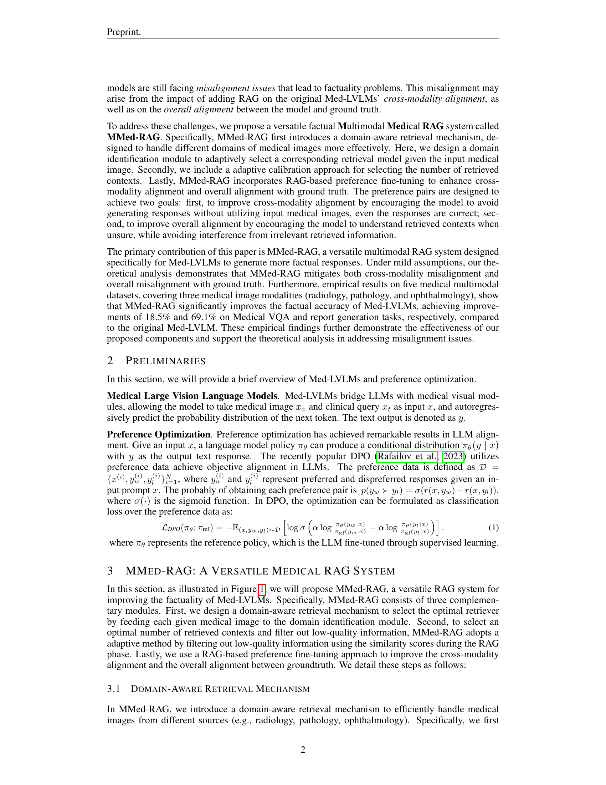

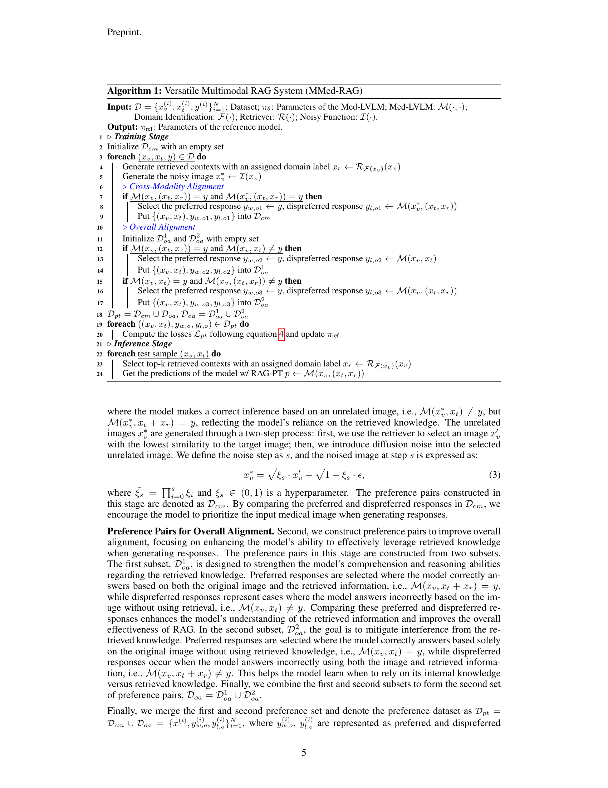
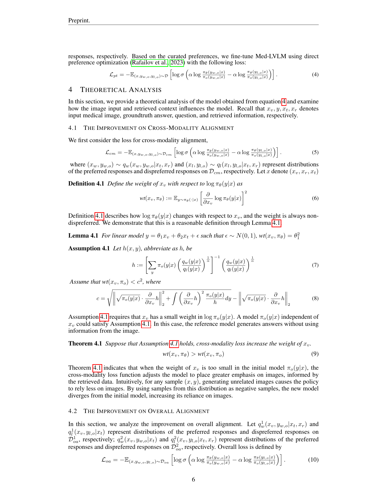
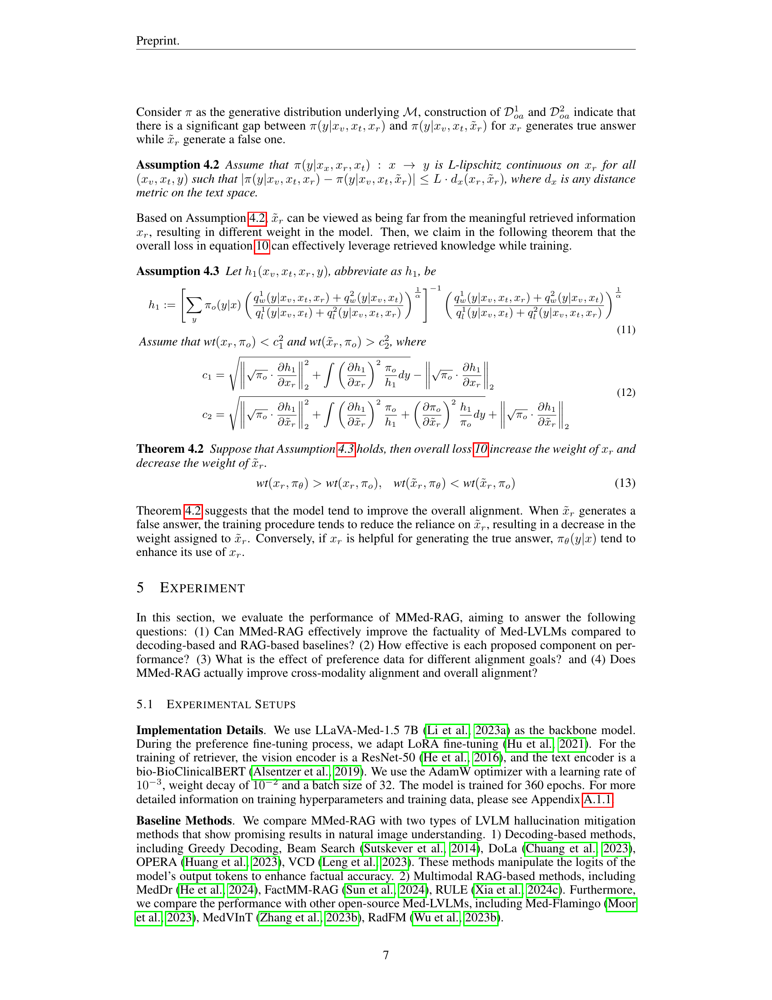
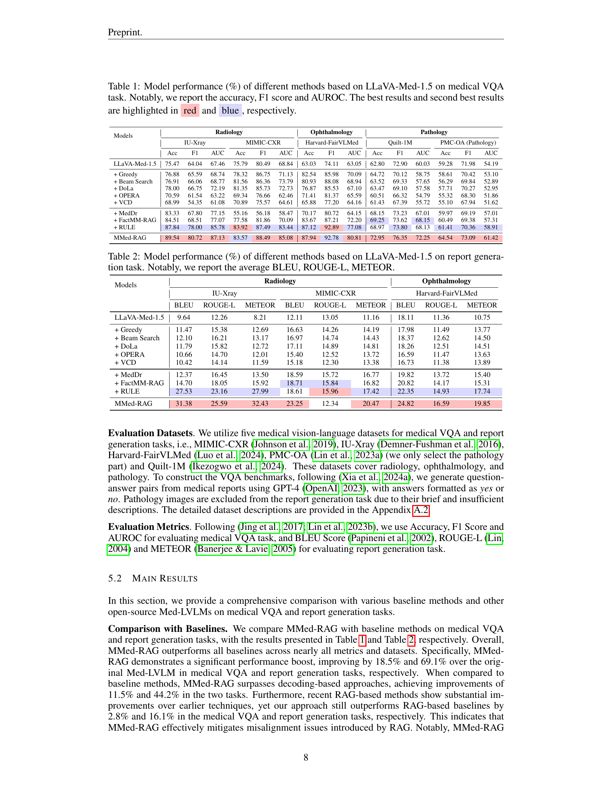

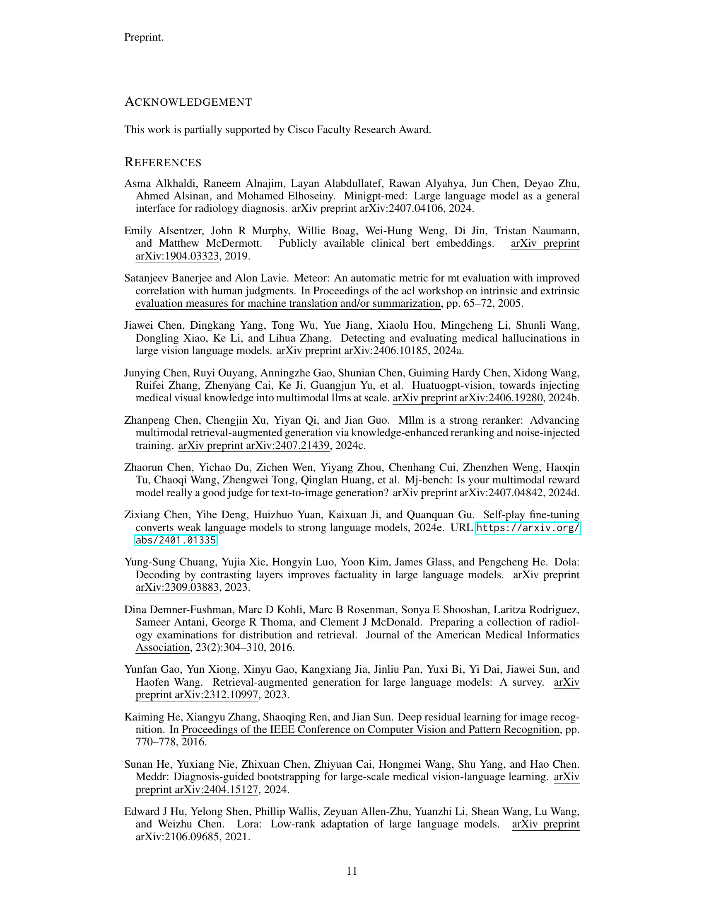

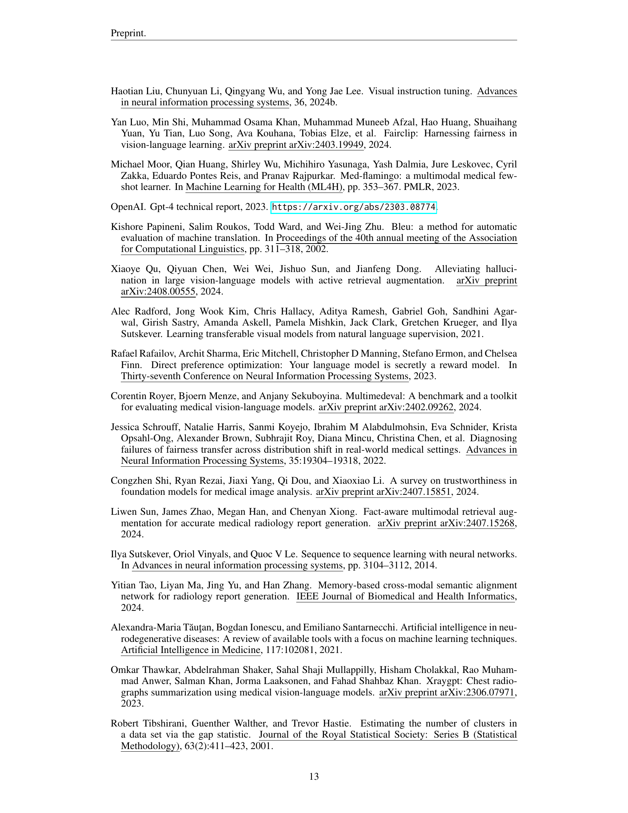

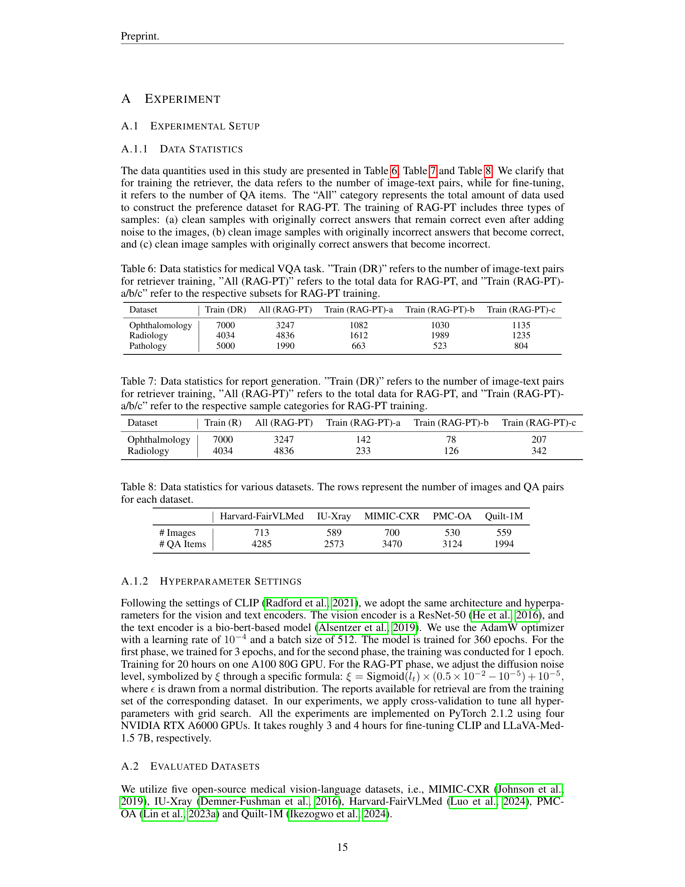

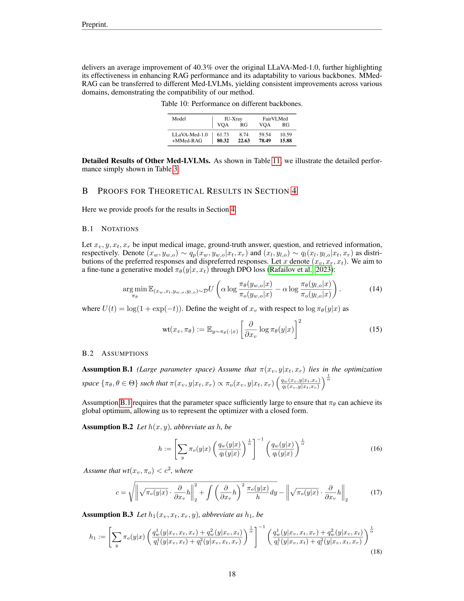
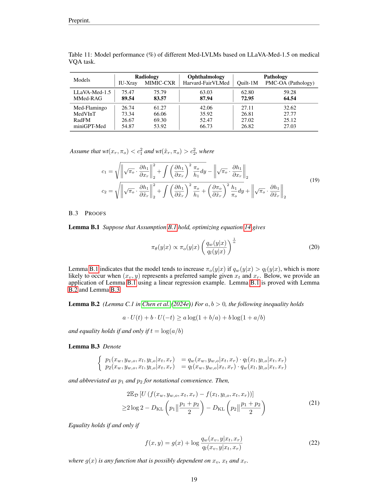
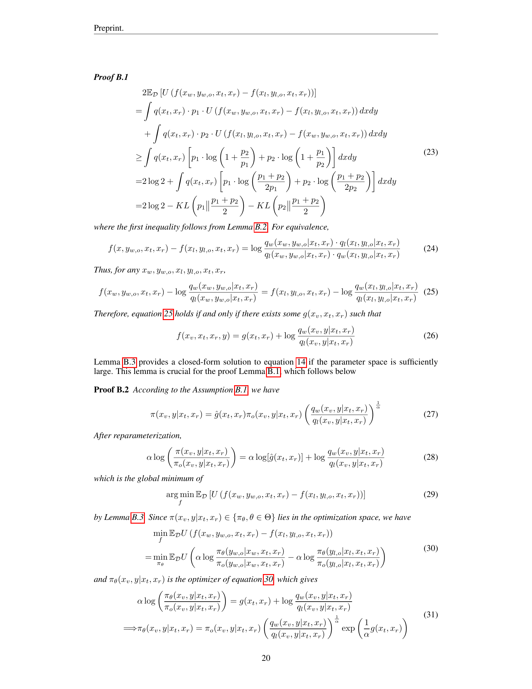

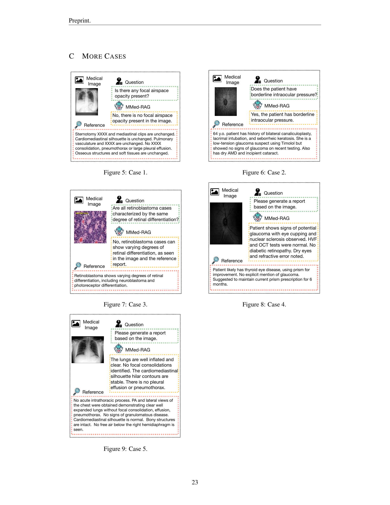
