### TL;DR



This research tackles the problem of Generative Error Correction (GEC) models in Automatic Speech Recognition (ASR) struggling with new, unseen errors, especially those involving named entities.  The solution proposed is DARAG (Data- and Retrieval-Augmented Generative Error Correction). DARAG cleverly uses two main techniques: 1) It creates synthetic training data by prompting large language models (LLMs) to generate transcripts simulating various ASR errors and using text-to-speech models to create corresponding audio. This helps GEC models learn from a wider range of errors. 2) It incorporates a 'retrieval augmentation' method.  This involves storing named entities in a database and retrieving related ones during correction, assisting with accurate named entity handling. Experiments across multiple datasets show that DARAG substantially improves ASR performance— achieving 8%–30% relative word error rate (WER) improvements in standard settings and 10%–33% improvements in out-of-domain scenarios where the test data is significantly different from the training data.  Overall, DARAG provides a practical and scalable method to enhance GEC, leading to more accurate and robust ASR systems.




 &nbsp; read the paper on arXiv

  

 &nbsp; on Hugging Face


#### Why does it matter?
This paper is important because it addresses a critical limitation of current Generative Error Correction (GEC) models in Automatic Speech Recognition (ASR): poor generalization to unseen errors and named entities.  The proposed DARAG method offers a practical and scalable solution by using synthetic data and retrieval augmentation. This significantly improves ASR accuracy, particularly in challenging scenarios, and opens new avenues for research in robust ASR and GEC.
#### Key Takeaways


 DARAG significantly improves ASR accuracy (8-30% in-domain, 10-33% out-of-domain) by addressing GEC's generalization limitations. 



 Synthetic data generation and retrieval augmentation are effective strategies for enhancing GEC performance. 



 DARAG is a simple, scalable, and domain-agnostic approach, applicable across various ASR tasks and languages. 


------
#### Visual Insights

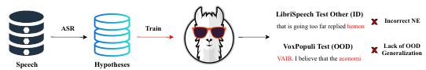

> 🔼 The figure illustrates the difference between traditional Generative Error Correction and the proposed DARAG method, highlighting the addition of synthetic data and retrieval augmentation for improved ASR performance.
> 

> 
read the caption

> Figure 1: Comparison of traditional GEC and DARAG. We augment the training dataset with synthetic data generated using our algorithm and named entities retrieved from a datastore to improve in-domain and out-of-domain ASR.
> 

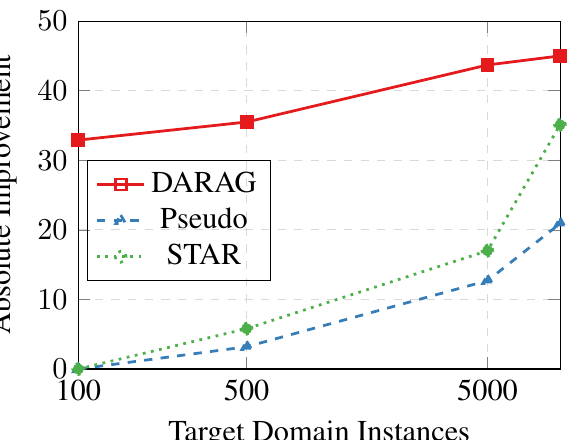

> 🔼 The chart compares the performance of DARAG against STAR and Pseudo methods on low-resource unsupervised domain adaptation, showing DARAG's superiority.
> 

> 
read the caption

> Figure 3: Comparison of DARAG with other methods on low-resource source-free UDA (LS → Vox). DARAG outperforms other methods with significant improvements.
> 


 <table id='6' style='font-size:14px'><tr><td>Test</td><td>ASR Train</td><td>Mismat. WER (↓)</td><td>Mat. WER (↓)</td></tr><tr><td rowspan="4">LS (Clean)</td><td>LS (960) (No GEC)</td><td>4.6</td><td>4.6</td></tr><tr><td>LS (960)</td><td>4.4</td><td>4.4</td></tr><tr><td>Vox</td><td>7.4</td><td>3.9</td></tr><tr><td>SPGI</td><td>8.8</td><td>4.0</td></tr><tr><td rowspan="4">Vox</td><td>Vox (No GEC)</td><td>10.1</td><td>10.1</td></tr><tr><td>Vox</td><td>9.4</td><td>9.4</td></tr><tr><td>LS (960)</td><td>14.5</td><td>6.9</td></tr><tr><td>SPGI</td><td>11.8</td><td>7.7</td></tr><tr><td rowspan="4">SPGI</td><td>SPGI (No GEC)</td><td>7.5</td><td>7.5</td></tr><tr><td>SPGI</td><td>7.3</td><td>7.3</td></tr><tr><td>LS (960)</td><td>14.2</td><td>4.8</td></tr><tr><td>Vox</td><td>10.5</td><td>4.9</td></tr></table>

> 🔼 Table 1 compares the performance of Generative Error Correction (GEC) models across three different ASR benchmarks and two scenarios (matched and mismatched) to highlight the impact of domain shifts and hypothesis sources on GEC effectiveness.
> 

> 
read the caption

> Table 1: Performance comparison of GEC across three different ASR benchmarks from three different domains. We evaluate and compare across two scenarios: (i) Matched Scenario: In this case, the hypotheses-transcription pairs for training our GEC model are derived from the Train split of the Test dataset (and not from the dataset the ASR model is trained on) (ii) Mismatched Scenario: In this case, the hypotheses-transcription pairs are derived from the same dataset the ASR model is trained on. We show that (a) For domain shifts, i.e., in cases where both the hypotheses and the ASR training dataset are from a domain different from the test, GEC leads to little to no improvement, and (b) For in-domain scenarios where only the hypotheses are derived from the same domain as the test, employing an ASR model trained on a different domain to derive the hypothesis boosts performance.
> 

### More visual insights

More on figures

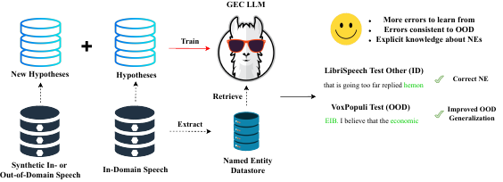

> 🔼 The figure compares traditional generative error correction (GEC) with the proposed DARAG method, highlighting the addition of synthetic data and named entity retrieval for improved performance.
> 

> 
read the caption

> Figure 1: Comparison of traditional GEC and DARAG. We augment the training dataset with synthetic data generated using our algorithm and named entities retrieved from a datastore to improve in-domain and out-of-domain ASR.
> 

> 🔼 The figure illustrates the DARAG framework, showing how synthetic data is generated and used to augment the training data, and how retrieval augmentation is used to improve named entity correction.
> 

> 
read the caption

> Figure 2: Illustration of DARAG. ① We generate synthetic data with LLMs and TTS models that are then used to generate hypotheses with diverse errors consistent with the types the ASR model generates on the test set. ② We extract the NEs and store them in a datastore. During training, for every instance, we retrieve the top-k most similar NEs to the best hypothesis and use it to construct an instruction-response pair. Note that in OOD settings we only assume the availability of only a few unsupervised speech samples in the original train set and pseudo-transcripts for prompting are generated using the in-domain ASR model.
> 

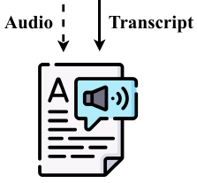

> 🔼 The figure illustrates the DARAG framework, showing how synthetic data generation and retrieval augmentation are used to improve generative error correction for ASR.
> 

> 
read the caption

> Figure 2: Illustration of DARAG. ① We generate synthetic data with LLMs and TTS models that are then used to generate hypotheses with diverse errors consistent with the types the ASR model generates on the test set. ② We extract the NEs and store them in a datastore. During training, for every instance, we retrieve the top-k most similar NEs to the best hypothesis and use it to construct an instruction-response pair. Note that in OOD settings we only assume the availability of only a few unsupervised speech samples in the original train set and pseudo-transcripts for prompting are generated using the in-domain ASR model.
> 

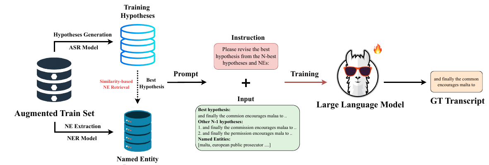

> 🔼 The figure illustrates the proposed DARAG framework, showing how synthetic data generation and retrieval augmentation improve generative error correction for ASR.
> 

> 
read the caption

> Figure 2: Illustration of DARAG. ① We generate synthetic data with LLMs and TTS models that are then used to generate hypotheses with diverse errors consistent with the types the ASR model generates on the test set. ② We extract the NEs and store them in a datastore. During training, for every instance, we retrieve the top-k most similar NEs to the best hypothesis and use it to construct an instruction-response pair. Note that in OOD settings we only assume the availability of only a few unsupervised speech samples in the original train set and pseudo-transcripts for prompting are generated using the in-domain ASR model.
> 

More on tables


 <table id='6' style='font-size:14px'><tr><td>Test</td><td>ASR Train</td><td>Mismat. F1 (↑)</td><td>Mat. F1 (↑)</td></tr><tr><td rowspan="4">Vox</td><td>Vox (No GEC)</td><td>87.8</td><td>87.8</td></tr><tr><td>Vox</td><td>87.8</td><td>87.8</td></tr><tr><td>LS (960)</td><td>80.9</td><td>83.2</td></tr><tr><td>SPGI</td><td>81.4</td><td>84.0</td></tr></table>
> 🔼 {{ table.description }}
> 

> 
read the caption

> {{ table.caption }}
> 

> Table 1 compares the performance of generative error correction (GEC) models across three different ASR benchmarks and two scenarios (matched and mismatched) to show the impact of domain shifts on GEC performance.


<table id='0' style='font-size:16px'><tr><td>Test</td><td>Method</td><td>OOD F1 (↑)</td><td>ID F1 (↑)</td></tr><tr><td rowspan="6">Vox</td><td>Baseline</td><td>79.5</td><td>87.8</td></tr><tr><td>+GEC</td><td>80.9</td><td>87.8</td></tr><tr><td>+DARAG</td><td>82.3</td><td>90.0</td></tr><tr><td>+synth. NE</td><td>82.8</td><td>92.3</td></tr><tr><td>+DARAG w/ ID NE</td><td>89.9</td><td>-</td></tr><tr><td>+synth. NE</td><td>90.7</td><td>-</td></tr><tr><td rowspan="6">LS (Other)</td><td>Baseline</td><td>82.5</td><td>93.2</td></tr><tr><td>+GEC</td><td>82.0</td><td>93.5</td></tr><tr><td>+DARAG</td><td>83.1</td><td>96.0</td></tr><tr><td>+synth. NE</td><td>84.9</td><td>96.4</td></tr><tr><td>+DARAG w/ ID NE</td><td>93.1</td><td>、</td></tr><tr><td>+synth. NE</td><td>93.4</td><td>-</td></tr></table>
> 🔼 {{ table.description }}
> 

> 
read the caption

> {{ table.caption }}
> 

> Table 3 compares the performance of DARAG against various baseline and ablation models across five datasets, reporting word error rates (WER) for both in-domain and out-of-domain settings and showing the improvements achieved by DARAG.


 <table id='8' style='font-size:14px'><tr><td>Test</td><td>Method</td><td>ASR Train</td><td>GEC Train</td><td>WER (↓)</td></tr><tr><td rowspan="10">Vox</td><td>Baseline</td><td>Vox</td><td>-</td><td>10.1</td></tr><tr><td>+DARAG</td><td>Vox</td><td>Vox</td><td>8.6</td></tr><tr><td>Baseline</td><td>LS</td><td>-</td><td>14.9</td></tr><tr><td>Baseline</td><td>LS + Vox</td><td>-</td><td>10.3</td></tr><tr><td>+DARAG</td><td>LS</td><td>LS</td><td>10.0</td></tr><tr><td>+DARAG</td><td>LS</td><td>Vox</td><td>6.9</td></tr><tr><td>Baseline</td><td>TED</td><td>-</td><td>17.0</td></tr><tr><td>Baseline</td><td>TED + Vox</td><td>-</td><td>10.0</td></tr><tr><td>+DARAG</td><td>TED</td><td>TED</td><td>14.4</td></tr><tr><td>+DARAG</td><td>TED</td><td>Vox</td><td>7.5</td></tr><tr><td rowspan="10">SPGI</td><td>Baseline</td><td>SPGI</td><td>-</td><td>7.5</td></tr><tr><td>+DARAG</td><td>SPGI</td><td>SPGI</td><td>5.2</td></tr><tr><td>Baseline</td><td>LS</td><td>-</td><td>13.3</td></tr><tr><td>Baseline</td><td>LS + SPGI</td><td>-</td><td>7.7</td></tr><tr><td>+DARAG</td><td>LS</td><td>LS</td><td>12.0</td></tr><tr><td>+DARAG</td><td>LS</td><td>SPGI</td><td>4.8</td></tr><tr><td>Baseline</td><td>TED</td><td>-</td><td>17.7</td></tr><tr><td>Baseline</td><td>TED + SPGI</td><td>-</td><td>7.9</td></tr><tr><td>+DARAG</td><td>TED</td><td>TED</td><td>13.9</td></tr><tr><td>+DARAG</td><td>TED</td><td>SPGI</td><td>5.0</td></tr></table>
> 🔼 {{ table.description }}
> 

> 
read the caption

> {{ table.caption }}
> 

> This table compares the word error rate (WER) achieved by DARAG and other methods across various in-domain and out-of-domain settings on five benchmark datasets.


<table id='0' style='font-size:20px'><tr><td>Dataset</td><td>Similarity</td><td>BLEU</td></tr><tr><td>LS</td><td>0.32</td><td>0.12</td></tr><tr><td>Vox</td><td>0.29</td><td>0.10</td></tr><tr><td>SPGI</td><td>0.25</td><td>0.06</td></tr><tr><td>Giga</td><td>0.22</td><td>0.13</td></tr><tr><td>TED</td><td>0.26</td><td>0.14</td></tr></table>
> 🔼 {{ table.description }}
> 

> 
read the caption

> {{ table.caption }}
> 

> Table 3 compares the word error rates (WER) of DARAG and several baseline methods across various in-domain and out-of-domain settings on five benchmark ASR datasets, highlighting DARAG's superior performance.


<table id='3' style='font-size:14px'><tr><td>Test</td><td>Method</td><td>Train</td><td>WER (↓)</td></tr><tr><td rowspan="6">Vox</td><td>Baseline</td><td>Vox</td><td>10.1</td></tr><tr><td>+DARAG</td><td>Vox</td><td>8.6</td></tr><tr><td>+DARAG w/o Voice Cloning</td><td>Vox</td><td>8.8</td></tr><tr><td>Baseline</td><td>LS</td><td>14.9</td></tr><tr><td>+DARAG</td><td>LS</td><td>10.0</td></tr><tr><td>+DARAG w/o Voice Cloning</td><td>LS</td><td>12.2</td></tr><tr><td rowspan="6">LS (Other)</td><td>Baseline</td><td>LS</td><td>8.4</td></tr><tr><td>+DARAG</td><td>LS</td><td>6.4</td></tr><tr><td>+DARAG w/o Voice Cloning</td><td>LS</td><td>7.3</td></tr><tr><td>Baseline</td><td>Vox</td><td>13.7</td></tr><tr><td>+DARAG</td><td>Vox</td><td>11.9</td></tr><tr><td>+DARAG w/o Voice Cloning</td><td>Vox</td><td>14.5</td></tr></table>
> 🔼 {{ table.description }}
> 

> 
read the caption

> {{ table.caption }}
> 

> Table 7 compares the performance of DARAG in both ID and OOD scenarios, with and without voice cloning, showing that voice cloning is crucial for generating augmentations.


 <table id='10' style='font-size:14px'><tr><td>Test</td><td>Method</td><td>Train</td><td>OOD Adapt.</td><td>WER (↓)</td></tr><tr><td rowspan="5">Vox</td><td>Baseline</td><td>-</td><td>-</td><td>10.1</td></tr><tr><td>+DARAG</td><td>Vox</td><td>-</td><td>8.6</td></tr><tr><td>+DARAG</td><td>Vox</td><td>LS</td><td>8.9</td></tr><tr><td>+DARAG</td><td>Vox</td><td>SPGI</td><td>9.0</td></tr><tr><td>+DARAG</td><td>Vox</td><td>TED</td><td>9.0</td></tr><tr><td rowspan="5">LS (Other)</td><td>Baseline</td><td>-</td><td>-</td><td>8.4</td></tr><tr><td>+DARAG</td><td>LS</td><td>-</td><td>6.4</td></tr><tr><td>+DARAG</td><td>LS</td><td>Vox</td><td>7.5</td></tr><tr><td>+DARAG</td><td>LS</td><td>SPGI</td><td>7.8</td></tr><tr><td>+DARAG</td><td>LS</td><td>TED</td><td>6.9</td></tr></table>
> 🔼 {{ table.description }}
> 

> 
read the caption

> {{ table.caption }}
> 

> Table 8 shows the performance comparison of DARAG across different settings, demonstrating that even with added synthetic training data, DARAG maintains in-domain performance, and improvements in a specific domain only occur when augmentations match the domain's characteristics.


<table id='13' style='font-size:18px'><tr><td>Test</td><td>k=1</td><td>k=2</td><td>k=5</td><td>k=7</td><td>k=9</td></tr><tr><td>Vox</td><td>87.8</td><td>88.7</td><td>90.0</td><td>87.9</td><td>87.8</td></tr><tr><td>LS (Other)</td><td>94.5</td><td>94.5</td><td>96.4</td><td>93.9</td><td>93.3</td></tr></table>
> 🔼 {{ table.description }}
> 

> 
read the caption

> {{ table.caption }}
> 

> Table 4 compares the performance of DARAG and other methods on named entity (NE) transcription in both in-domain and out-of-domain settings, showing improvements with the use of synthetic data and a retrieval-augmented correction approach.


<table id='17' style='font-size:16px'><tr><td>Test</td><td>10</td><td>50</td><td>100</td><td>500</td></tr><tr><td>Vox</td><td>15.2</td><td>11.3</td><td>10.0</td><td>9.5</td></tr><tr><td>SPGI</td><td>17.9</td><td>14.1</td><td>12.0</td><td>11.7</td></tr></table>
> 🔼 {{ table.description }}
> 

> 
read the caption

> {{ table.caption }}
> 

> Table 10 shows the performance of DARAG on two out-of-domain settings using different values of the parameter nsmall, demonstrating that larger values lead to improved performance.


<table id='1' style='font-size:14px'><tr><td>Test</td><td>0.5x</td><td>1x</td><td>2x</td><td>5x</td></tr><tr><td>Vox</td><td>13.1</td><td>10.0</td><td>9.6</td><td>9.7</td></tr><tr><td>SPGI</td><td>14.2</td><td>12.0</td><td>11.3</td><td>11.3</td></tr></table>
> 🔼 {{ table.description }}
> 

> 
read the caption

> {{ table.caption }}
> 

> Table 11 presents the performance of DARAG on two out-of-domain settings with different scaling factors of synthetic data relative to the original training set size.


<table id='0' style='font-size:16px'><tr><td>Dataset</td><td>Synthetic Transcripts</td></tr><tr><td>LibriSpeech LibriSpeech</td><td>the duke entered the grand hall as the musicians began playing a lively gavotte her highness attended the gala wearing the renowned emerald necklace from the royal collection</td></tr><tr><td>SPGI SPGI</td><td>Sarah, can we reassess the projected growth for the third quarter and adjust our targets accordingly? Our current expectation is to maintain a minimum margin of 40%, though market conditions may lead to some adjustments.</td></tr><tr><td>GigaSpeech GigaSpeech</td><td>please navigate to the settings page to update your api key and configure the callback url. she served as the vice chair of the european data protection board for three years before joining the united nations privacy task force.</td></tr><tr><td>VoxPopuli VoxPopuli</td><td>as the smoke cleared the battered zeppelin drifted slowly back towards the enemy's encampment yet i shall not yield to their demands but will defend my honor just as young frederick once did in times of great peril</td></tr><tr><td>TED TED</td><td>we are often overwhelmed by too many options and that can make even simple decisions difficult to navigate i must admit that my journey has had its ups and downs but in the end i found exactly what i was looking for</td></tr></table>
> 🔼 {{ table.description }}
> 

> 
read the caption

> {{ table.caption }}
> 

> This table compares the performance of DARAG against several baseline methods across various in-domain and out-of-domain settings, showing the word error rate (WER) and highlighting the significant improvements achieved by DARAG.


<table id='0' style='font-size:14px'><tr><td>Dataset</td><td>ASR Transcription</td><td>Traditional GEC</td><td>DARAG</td></tr><tr><td>LibriSpeech Other</td><td>how eye wish you could get me a coffee of that pitcher phillip laura said in treating lee</td><td>how i wish you could get me a coffee of that pitcher phillip laura said in treatingly</td><td>how i wish you could get me a copy of that picture philip laura said treatingly</td></tr><tr><td>LibriSpeech Other (OOD on Vox)</td><td>but she fixed up on a pitcher which she said she preferred too anything she had scene in the galley</td><td>but she fixed up on a pitcher which she said she preferred too anything she had scene in the galley</td><td>but she fixed upon a picture which she said she preferred to anything she had seen in the gallery</td></tr><tr><td>SPGI</td><td>and we expect once the Sharon Nation Credit gets taken care of, we're in a arrange where we will be managing in flows and out flows on a normal</td><td>and we expect once the Sharon Nation Credit gets taken care of, we're in a arrange where we will be managing in flows and out flows on a normal</td><td>and we expect once the Shared National Credit gets taken care of, we're in a range where we will be managing inflows and outflows on a normal</td></tr><tr><td>SPGI (OOD on Vox)</td><td>obviously, the confidence level on future and growing explo- ration in the Golf of Mexico, in South East Asia. So</td><td>obviously, the confidence level on future and growing explo- ration in the Golf of Mexico, in South East Asia. So</td><td>obviously, the confidence level on future and growing explo- ration in the Gulf of Mexico, in Southeast Asia. So</td></tr><tr><td>GigaSpeech</td><td>TRULY THE EIGHT WON- DER OF THE WORLD SEAN ELLIOT. THANK YOU SO MUCH.</td><td>TRULY THE EIGHT WON- DER OF THE WORLD SEAN ELLIOT. THANK YOU SO MUCH.</td><td>TRULY THE EIGHTH WON- DER OF THE WORLD SHAWN ELLIOTT · THANK YOU SO MUCH</td></tr><tr><td>GigaSpeech (OOD on Vox)</td><td>MICROSOFT FIRED BACK WITH ITS OWN SEARCH IN- JUN</td><td>MICROSOFT FIRED BACK WITH ITS OWN SEARCH IN- JUN</td><td>MICROSOFT FIRED BACK WITH ITS OWN SEARCH EN- GINE</td></tr><tr><td>VoxPopuli</td><td>we need mores sources we need mores pipes than one from rush ya</td><td>we need mores sources we need mores pipes than one from rush ya</td><td>we need more sources we need more pipes than one from russia</td></tr><tr><td>VoxPopuli (OOD on Lib- riSpeech)</td><td>may i in decay however that the protection of arbitration agree- ments should not limited the free circulation of judgments in the union</td><td>may i indicate however that the protection of arbitration agree- ments should not limited the free circulation of judgments in the union</td><td>may i indicate however that the protection of arbitration agree- ments should not limit the free circulation of judgements in the union</td></tr></table>
> 🔼 {{ table.description }}
> 

> 
read the caption

> {{ table.caption }}
> 

> Table 13 qualitatively compares DARAG with traditional GEC, demonstrating DARAG's superior ability to accurately correct errors, particularly named entities, in both in-domain and out-of-domain settings.

### Full paper


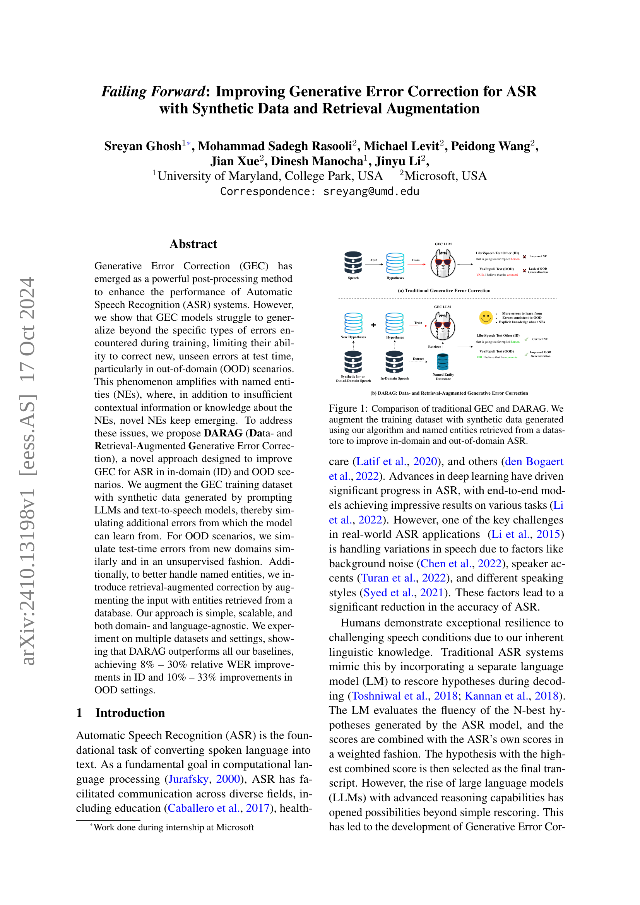

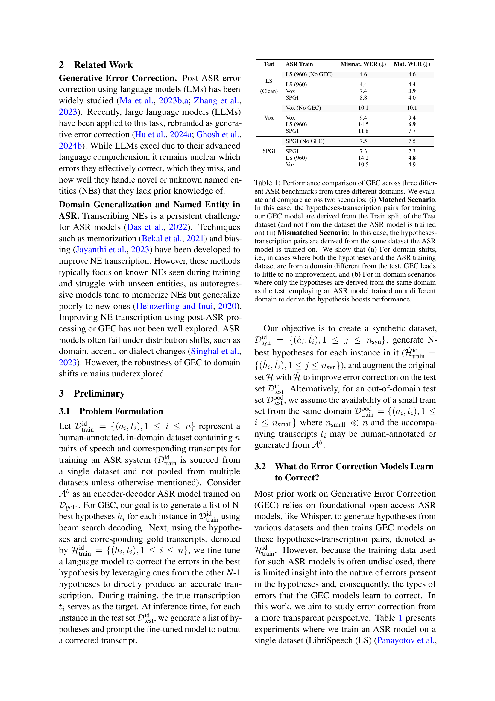

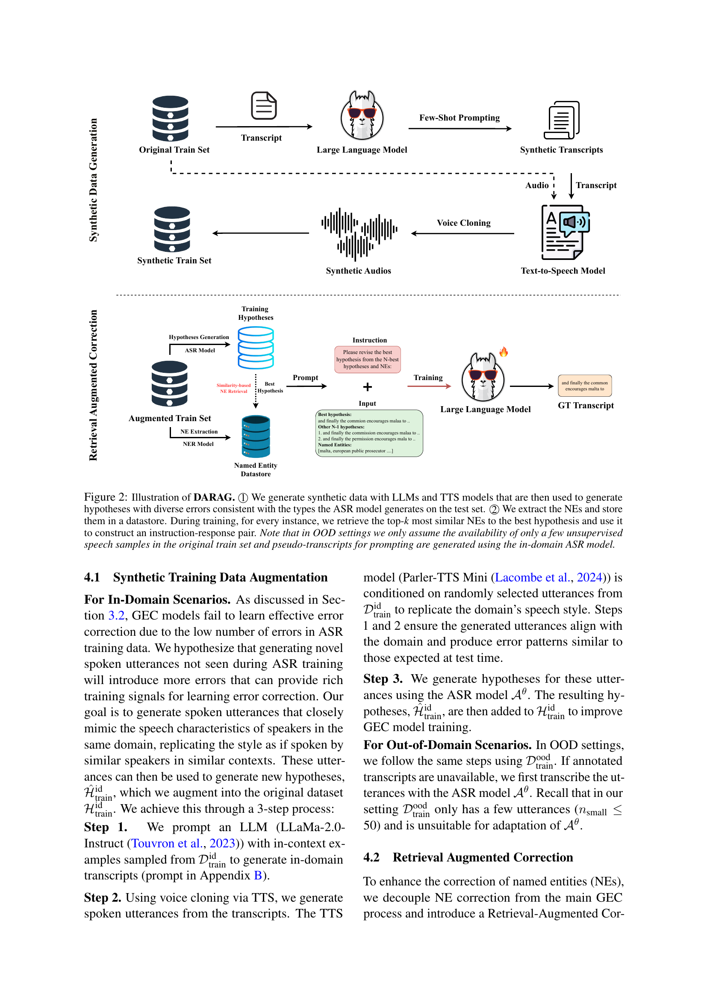
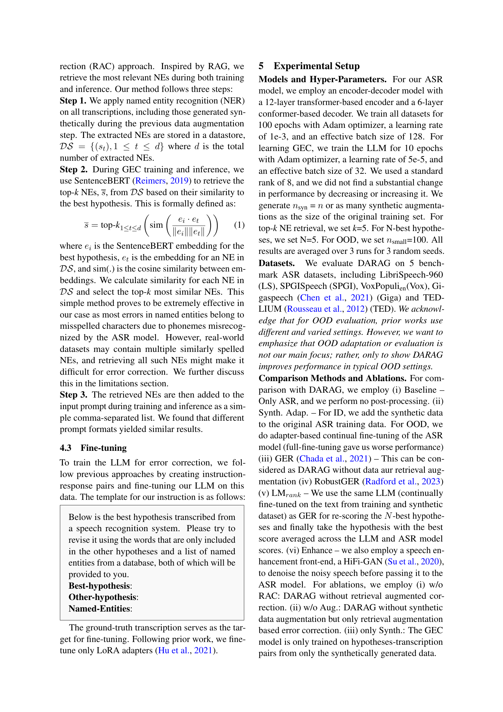

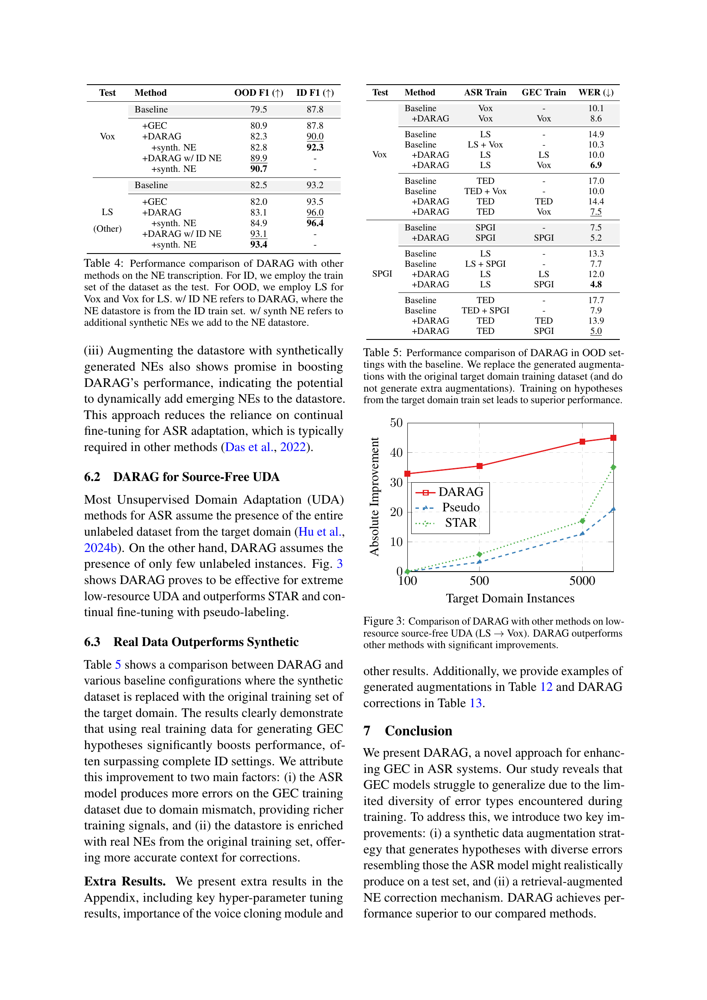
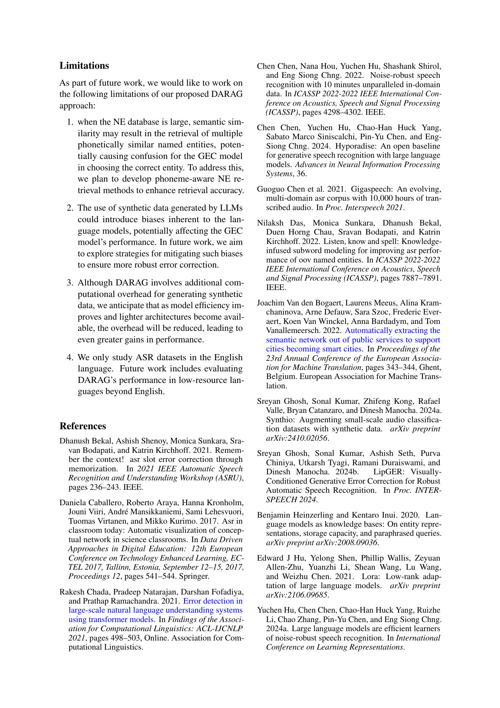
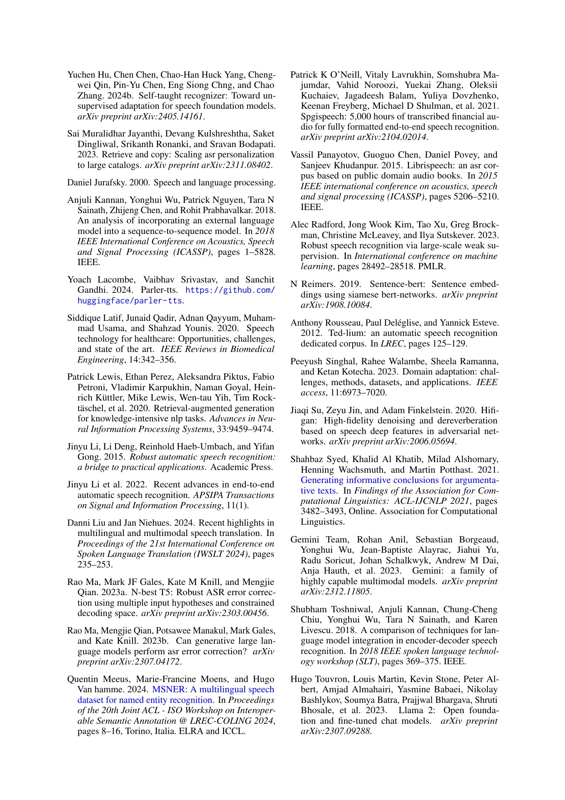

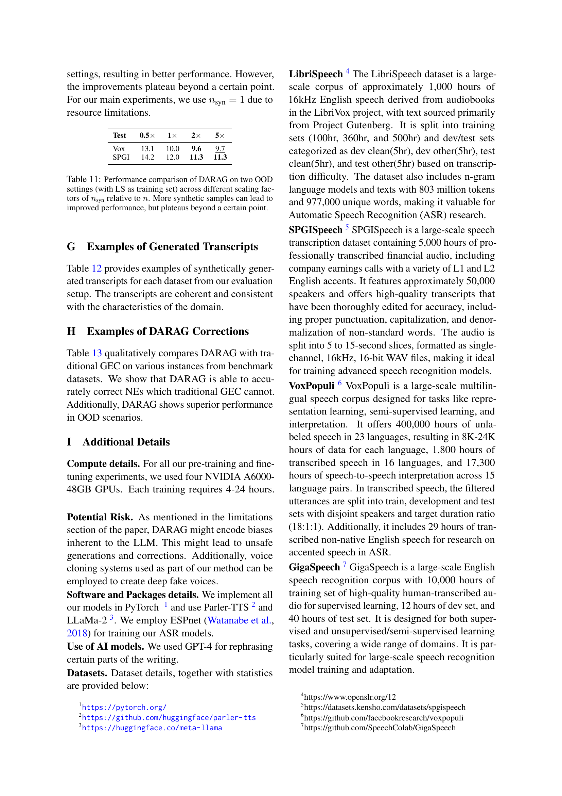

