### TL;DR



This research paper presents a comprehensive roadmap for building advanced speech understanding systems using large language models (LLMs).  It breaks down the process into five levels of increasing complexity, starting from basic automatic speech recognition (ASR) and culminating in a hypothetical "Speech Artificial General Intelligence" (SAGI) that surpasses human capabilities.  To aid in this development, the authors propose the SAGI benchmark, a standardized evaluation tool covering a wide range of tasks across the five levels.  Testing both human subjects and current speech LLMs against this benchmark uncovered significant gaps in the ability of current models to utilize abstract acoustic knowledge and nuances in speech (like tone and emotion), highlighting key areas for future research and improvement.  This approach provides a more structured and thorough evaluation framework for the field, moving beyond simpler speech recognition tasks towards more holistic and nuanced speech understanding.




 &nbsp; read the paper on arXiv

  

 &nbsp; on Hugging Face


#### Why does it matter?
This paper is crucial for researchers in speech AI and LLMs.  It proposes a novel five-level roadmap for developing superhuman speech understanding models, introduces a benchmark for evaluation, and reveals current limitations in using abstract acoustic knowledge. This work will guide future research, spur innovation in benchmark development, and help advance the field significantly.
#### Key Takeaways


 Five-level roadmap for speech LLM development, from basic ASR to superhuman capabilities. 



 SAGI benchmark for evaluating speech LLMs across various tasks, highlighting current limitations. 



 Key findings reveal gaps in handling paralinguistic cues and abstract acoustic knowledge, guiding future research directions. 


------
#### Visual Insights

> 🔼 The figure illustrates a five-level roadmap for speech understanding using LLMs, ranging from basic speech recognition to advanced superhuman models.
> 

> 
read the caption

> Figure 1: Levels of speech understanding using LLMs.
> 

> 🔼 The chart shows the distribution of speech, audio, and music training data used in five different speech LLMs.
> 

> 
read the caption

> Figure 3: Distribution of three types of training data used by various models
> 


<table id='1' style='font-size:14px'><tr><td colspan="2">Level</td><td>Semantic Information</td><td>Non-Semantic Information</td><td>Abstract Acoustic Knowledge</td><td>Remark</td></tr><tr><td>-</td><td>Pure LLM</td><td>-</td><td>-</td><td>-</td><td>Without speech input.</td></tr><tr><td>L1</td><td>Basic ASR</td><td>V</td><td>X</td><td>X</td><td>Recognizing Speech as texts.</td></tr><tr><td>L2</td><td>Paralinguistic Perception</td><td></td><td>only paralinguistic</td><td>X</td><td>Perceiving direct paralinguistic information like tone, pitch, loudness, rhythm, and speech rate.</td></tr><tr><td>L3</td><td>Non-semantic Comprehension</td><td></td><td></td><td>X</td><td>Comprehending non-semantic information like speaker identity, gender, age, emotional state, and environmental sounds.</td></tr><tr><td>L4</td><td>Speech Specialist</td><td>V</td><td>V</td><td>specialist</td><td>Understanding speech with specific speech knowledge.</td></tr><tr><td>L5</td><td>Speech AGI (Generalist)</td><td>V</td><td>V</td><td>generalist</td><td>Understanding speech with general speech knowledge.</td></tr></table>

> 🔼 The table summarizes five levels of speech understanding using LLMs, detailing the presence or absence of semantic information, non-semantic information, and abstract acoustic knowledge at each level.
> 

> 
read the caption

> Table 1: Levels of speech understanding using LLMs
> 

### More visual insights

More on figures

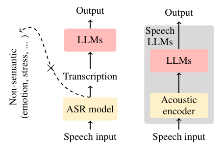

> 🔼 The figure illustrates the difference between the cascade and end-to-end paradigms for processing speech using LLMs.
> 

> 
read the caption

> Figure 2: Cascade and End-to-end paradigms.
> 

> 🔼 The figure illustrates a five-level roadmap for speech understanding using LLMs, ranging from basic speech recognition to advanced superhuman models.
> 

> 
read the caption

> Figure 1: Levels of speech understanding using LLMs.
> 

More on charts

> 🔼 The chart displays the cosine similarity of speech embeddings generated by Whisper, comparing speech with different emotions and genders, and short versus long speech segments.
> 

> 
read the caption

> Figure 4: Representation similarity of different speeches. Each speech pair has the same content but is spoken in a different style. The representation is generated by the Whisper encoder.
> 

 and scene classification task (right). Gray line shows random selection accuracy. Details about the instructions and results are shown in App. D.")

> 🔼 The chart displays the performance of different speech LLMs on speaker age and scene classification tasks using various instructions, comparing their accuracy against random selection.
> 

> 
read the caption

> Figure 5: Performance of speech LLMs with different instructions on speaker age task (left) and scene classification task (right). Gray line shows random selection accuracy. Details about the instructions and results are shown in App. D.
> 

More on tables


<table id='7' style='font-size:14px'><tr><td>Level</td><td>Task</td><td>Dataset</td></tr><tr><td>L1</td><td>Language Identification Auto-Speech Recognition ASR for Legal Terms * ASR for Medical Terms * Auto-Lyrics Transcription</td><td>Europarl-ST Iranzo-S�nchez et al. 2020 LibriSpeech Panayotov et al. 2015 Made of Cosy Voice SpeechTeam 2024 Made of CosyVoice Speech Team 2024 Jam-Lyrics Durand et al. 2023</td></tr><tr><td>L2</td><td>Volume Perception Pitch Perception Binaural Effect Perception</td><td>Made of LJSpeech Ito & Johnson, 2017 Made of SpeechAccentArchive Weinberger 2013 Our proposed method</td></tr><tr><td>L3</td><td>Ambient Sound Detection Acoustic Scene Classification Speaker's Age Prediction Speaker's Gender Recognition Speech Emotion Recognition Cappella Emotion Recognition Emotional Intensity Perception Emotion Translation * Singing Detection</td><td>Noisy speech Valentini-Botinhao et al 2017 Made of MS-SNSD Reddy et al. 2019 Made of AIR-Bench Yang et al. 2024 & SpeechAccentArchive Weinberger 2013 VCTK Yamagishi et al. 2019 Selected trom RAVDESS Livingstone & Russo. 2018 Selected from RAVDESS Livingstone & Russo 2018 Made of RAVDESS Livingstone & Russo. 2018 Made of RAVDESS Livingstone & Russo 2018 and CosyVoice SpeechTeam 2024 RAVDESS Livingstone & Russo 2018</td></tr><tr><td>L4</td><td>COVID-19 Risk Detection Cough Type Classification Cough Origin Diagnosis Cough Severity Assessment</td><td>Virufy Chaudhari et al. 2020 Made ofCOUGHVIDOrlandic et al. 2021 Made of COUGHVIDOrlandic et al. 2021 Made of COUGHVID Orlandic et al. 2021</td></tr><tr><td>L5</td><td>Spoken English Coach Voice Detective</td><td>Made of speechocean762 Zhang et al. 2021 Made of SpeechAccentArchive Weinberger 2013</td></tr></table>
> 🔼 {{ table.description }}
> 

> 
read the caption

> {{ table.caption }}
> 

> The table presents a comprehensive overview of the five levels of speech understanding using LLMs, along with the corresponding benchmark tasks for each level.


<table id='1' style='font-size:14px'><tr><td rowspan="2">Level</td><td rowspan="2">Task</td><td rowspan="2">Human Baseline</td><td colspan="5">Models</td></tr><tr><td>GPT-4o</td><td>MuLLaMA</td><td>GAMA</td><td>SALMONN</td><td>Qwen2-Audio</td></tr><tr><td rowspan="6">L1</td><td>Language Identification</td><td>x</td><td>88.50%</td><td>8.48%</td><td>x</td><td>35.17%</td><td>96.44%</td></tr><tr><td>Auto-Speech Recognition</td><td>15.49*</td><td>10.24*</td><td>x</td><td>x</td><td>5.45*</td><td>4.63*</td></tr><tr><td>ASR for Legal Terms</td><td>98.50%</td><td>26.47%</td><td>x</td><td>x</td><td>x</td><td>81.04%</td></tr><tr><td>ASR for Medical Terms</td><td>97.50%</td><td>41.87%</td><td>x</td><td>x</td><td>x</td><td>53.86%</td></tr><tr><td>Auto-Lyrics Transcription</td><td>26.88*</td><td>x</td><td>x</td><td>x</td><td>77.12*</td><td>32.48*</td></tr><tr><td>- Hallucination Rate</td><td>3.00%</td><td>x</td><td>x</td><td>x</td><td>29.26%</td><td>38.21%</td></tr><tr><td rowspan="3">L2</td><td>Volume Perception</td><td>100.00%</td><td>x</td><td>50.00%</td><td>11.98%</td><td>53.22%</td><td>48.96%</td></tr><tr><td>Pitch Perception</td><td>96.25%</td><td>29.33%</td><td>33.78%</td><td>41.50%</td><td>50.00%</td><td>50.00%</td></tr><tr><td>Binaural Effect Perception</td><td>100.00%</td><td>41.38%</td><td>x</td><td>x</td><td>49.88%</td><td>x</td></tr><tr><td rowspan="9">L3</td><td>Ambient Noise Detection</td><td>91.88%</td><td>45.27%</td><td>50.00%</td><td>60.17%</td><td>49.88%</td><td>50.00%</td></tr><tr><td>Acoustic Scene Classification</td><td>90.28%</td><td>16.36%</td><td>5.07%</td><td>12.05%</td><td>20.74%</td><td>27.67%</td></tr><tr><td>Speaker's Age Prediction</td><td>52.59%</td><td>13.43%</td><td>33.60%</td><td>x</td><td>36.87%</td><td>38.55%</td></tr><tr><td>Speaker's Gender Recognition</td><td>97.50%</td><td>x</td><td>50.00%</td><td>x</td><td>48.12%</td><td>79.60%</td></tr><tr><td>Speech Emotion Recognition</td><td>50.71%</td><td>16.77%</td><td>9.20%</td><td>3.68%</td><td>10.93%</td><td>79.51%</td></tr><tr><td>Cappella Emotion Recognition</td><td>62.25%</td><td>21.50%</td><td>12.42%</td><td>7.08%</td><td>14.62%</td><td>62.38%</td></tr><tr><td>Emotion Intensity Perception</td><td>97.50%</td><td>72.67%</td><td>50.00%</td><td>50.00%</td><td>49.29%</td><td>50.00%</td></tr><tr><td>Emotion Translation t</td><td>3.68</td><td>0.32</td><td>x</td><td>x</td><td>0.27</td><td>0.31</td></tr><tr><td>Singing Detection</td><td>99.38%</td><td>53.11%</td><td>50.00%</td><td>64.82%</td><td>56.47%</td><td>50.22%</td></tr><tr><td rowspan="4">L4</td><td>COVID-19 Risk Detection</td><td>60.63%</td><td>x</td><td>x</td><td>x</td><td>50.00%</td><td>14.17%</td></tr><tr><td>Cough Type Classification</td><td>52.50%</td><td>40.33%</td><td>50.16%</td><td>44.17%</td><td>49.17%</td><td>43.39%</td></tr><tr><td>Cough Origin Diagnosis</td><td>32.19%</td><td>x</td><td>x</td><td>x</td><td>4.01%</td><td>25.65%</td></tr><tr><td>Cough Severity Assessment</td><td>45.42%</td><td>24.12%</td><td>30.85%</td><td>28.50%</td><td>38.24%</td><td>33.86%</td></tr><tr><td rowspan="2">L5</td><td>Spoken English Coach +</td><td>1.39</td><td>0.15</td><td>1.29</td><td>0.44</td><td>0.48</td><td>0.54</td></tr><tr><td>Voice Detective†</td><td>1.20</td><td>x</td><td>0.84</td><td>0.83</td><td>0.86</td><td>1.24</td></tr></table>
> 🔼 {{ table.description }}
> 

> 
read the caption

> {{ table.caption }}
> 

> This table presents the performance of various speech LLMs across different levels of speech understanding tasks in the SAGI benchmark, comparing their results to human baselines.


<table id='4' style='font-size:16px'><tr><td rowspan="2">Task</td><td colspan="2">Text instructions</td><td colspan="2">Speech instructions</td></tr><tr><td>GPT-4o</td><td>Qwen2-Audio</td><td>GPT-4o</td><td>Qwen2-Audio</td></tr><tr><td>Language Identification</td><td>88.50%</td><td>93.01%</td><td>91.45%</td><td>18.64%</td></tr><tr><td>Auto-Speech Recognition</td><td>10.24</td><td>4.63</td><td>14.65</td><td>22.39</td></tr><tr><td>Speech Emotion Recognition</td><td>16.77%</td><td>79.51 %</td><td>23.46%</td><td>x</td></tr><tr><td>Emotion Intensity Perception</td><td>72.67%</td><td>50.00%</td><td>10.84%</td><td>x</td></tr></table>
> 🔼 {{ table.description }}
> 

> 
read the caption

> {{ table.caption }}
> 

> The table compares the performance of GPT-40 and Qwen2-Audio models on several speech tasks using text instructions versus speech instructions.


<table id='6' style='font-size:16px'><tr><td>Task</td><td>Task type</td><td>Model</td><td>Result</td><td>Best result of LLMs</td></tr><tr><td>Language Identification</td><td>5-Categories</td><td>Whisper</td><td>91.45%</td><td>96.62%</td></tr><tr><td>Auto-Speech Recognition</td><td>Generation</td><td>Whisper</td><td>2.44</td><td>4.63</td></tr><tr><td>Auto-Lyrics Transcription</td><td>Generation</td><td>Whisper</td><td>22.10</td><td>32.48</td></tr><tr><td>ASR for Legal Term</td><td>Generation</td><td>Whisper</td><td>33.33%</td><td>81.04%</td></tr><tr><td>ASR for Medical Term</td><td>Generation</td><td>Whisper</td><td>34.98%</td><td>53.86%</td></tr><tr><td>Volume Perception</td><td>2-Categories</td><td>Small model</td><td>100.00 %</td><td>53.22%</td></tr></table>
> 🔼 {{ table.description }}
> 

> 
read the caption

> {{ table.caption }}
> 

> The table presents a comprehensive overview of the five levels of speech understanding using LLMs and their corresponding tasks, which serve as a benchmark for evaluating the capabilities of speech LLMs.


<table id='2' style='font-size:16px'><tr><td>Model</td><td>Total</td><td>Truncation</td><td>Over-long</td></tr><tr><td>Whisper</td><td>64</td><td>3</td><td>0</td></tr><tr><td>Qwen-Audio</td><td>68</td><td>5</td><td>6</td></tr><tr><td>Qwen2-Audio</td><td>149</td><td>89</td><td>3</td></tr><tr><td>SALMONN</td><td>251</td><td>154</td><td>5</td></tr></table>
> 🔼 {{ table.description }}
> 

> 
read the caption

> {{ table.caption }}
> 

> This table presents the performance of various speech LLMs on tasks categorized into five levels of speech understanding, from basic ASR to complex abstract acoustic knowledge tasks, comparing their performance against human baselines.


<table id='1' style='font-size:14px'><tr><td>Task</td><td>Prompt</td></tr><tr><td>Sequence-level</td><td>Given a phone sequence, "M AA0 R K IH0 Z , , what sentence does it represent? ,</td></tr><tr><td>Token-level</td><td>" what sentence Given a tokenized phone sequence, "[M AA0 R K] [IH0 Z] · · · , does it represent?</td></tr><tr><td>Token-level with one shot</td><td>" what sentence Given a tokenized phone sequence, "[M AA0 R K] [IH0 Z] · , does it represent? For example, if the phone sequence is "[F AO0 R] [F AYO V], [S IH0 K S] [S EH1 V N] [EY0 T]" the sentence can be: "four five six seven eight nine".</td></tr></table>
> 🔼 {{ table.description }}
> 

> 
read the caption

> {{ table.caption }}
> 

> This table presents a five-level roadmap for speech understanding using LLMs, outlining the capabilities at each level regarding semantic and non-semantic information and abstract acoustic knowledge.


<table id='8' style='font-size:14px'><tr><td>Level</td><td>Task</td><td>Dynamic-SUPERB</td><td>AIR-Bench</td><td>SD-Eval</td></tr><tr><td rowspan="3">L1</td><td>Speech ASR</td><td></td><td></td><td>X</td></tr><tr><td>Intent Classification</td><td></td><td></td><td>X</td></tr><tr><td>Language Identification</td><td></td><td></td><td>X</td></tr><tr><td>L2</td><td>Music Pitch and Velocity Emotion</td><td></td><td></td><td>X</td></tr><tr><td rowspan="9">L3</td><td>Environment Speaker Gender/Age</td><td></td><td>X V</td><td></td></tr><tr><td>Accent</td><td></td><td></td><td></td></tr><tr><td></td><td></td><td></td><td></td></tr><tr><td>Noise Detection</td><td></td><td>X</td><td>X</td></tr><tr><td>Speaker Verification</td><td></td><td>V</td><td>X</td></tr><tr><td>Sarcasm Detection</td><td></td><td>X</td><td>X</td></tr><tr><td>Stress Detection</td><td></td><td>X</td><td>X</td></tr><tr><td>How Far Are You</td><td></td><td>X</td><td>X</td></tr><tr><td>Spoof Detection</td><td></td><td>X</td><td>X</td></tr><tr><td>L4</td><td>Synthesized Voice Detection</td><td></td><td></td><td>X</td></tr><tr><td>L5</td><td>No Related Work No Related Work</td><td>X X</td><td>X X</td><td>X X</td></tr></table>
> 🔼 {{ table.description }}
> 

> 
read the caption

> {{ table.caption }}
> 

> The table shows the five levels of speech understanding using LLMs, including the presence or absence of semantic information, non-semantic information, and abstract acoustic knowledge at each level.


 <table id='1' style='font-size:20px'><tr><td>Task</td><td>Utterances</td></tr><tr><td>Language Identification</td><td>German: 500, Spanish: 500, English: 500, French: 500, Italian: 500</td></tr><tr><td>Auto-Speech Recognition</td><td>English:2791</td></tr><tr><td>ASR for Legal Terms</td><td>Chinese:102</td></tr><tr><td>ASR for Medical Terms</td><td>Chinese:203</td></tr><tr><td>Auto-Lyrics Transcription</td><td>English: 868</td></tr><tr><td>Volume Perception</td><td>Increasing: 512, Decreasing: 512</td></tr><tr><td>Pitch Perception</td><td>(80-150)Hz: 300, (180-250)Hz: 300</td></tr><tr><td>Binaural Effect Perception</td><td>Left ear: 400, Right ear: 400</td></tr><tr><td>Ambient Noise Detection</td><td>Yes: 824, No: 824</td></tr><tr><td>Acoustic Scene Classification</td><td>Babble: 310, Copy Machine: 310, Neighbor: 310, Shutting Door: 315, Airport Announce- ments: 305, Munching: 300, Typing: 310, Air- Conditioner: 305, Vacuum Cleaner: 310</td></tr><tr><td>Speaker's Age</td><td>Teens to Twenties: 330, Thirties to Forties: 330, Fifties to Sixties: 330</td></tr><tr><td>Speaker's Gender</td><td>Female: 1410, Male: 1410</td></tr><tr><td>Speech Emotion Recognition</td><td>Happy: 200, Disgust: 200, Fearful: 200, Sad: 200, Surprised: 200, Angry: 200, Neutral: 100</td></tr><tr><td>Cappella Emotion Recognition</td><td>Angry: 184, Sad: 184, Happy: 184, Fearful: 184, Neutral: 92</td></tr><tr><td>Emotion Intensity Perception</td><td>Former: 143, Latter: 143</td></tr><tr><td>Emotion Translation Singing Detection</td><td>English: 325 Singing: 1012, Speech: 1012</td></tr><tr><td>COVID-19 Risk Detection</td><td>Yes:56, No:64</td></tr><tr><td></td><td></td></tr><tr><td>Cough Type Classification</td><td>Wet: 300 , Dry: 300</td></tr><tr><td>Cough Origin Diagnosis</td><td>COVID-19: 198, Healthy Cough: 200, Lower In- fection: 200,Upper Infection: 200</td></tr><tr><td>Cough Severity Assessment Spoken English Coach</td><td>Pseudocough: 170, Mild: 170, Severe: 170 English: 1009</td></tr><tr><td>Voice Detective</td><td>English: 2134</td></tr></table>
> 🔼 {{ table.description }}
> 

> 
read the caption

> {{ table.caption }}
> 

> The table presents a five-level roadmap for speech understanding using LLMs, outlining the semantic information, non-semantic information, abstract acoustic knowledge, and remarks for each level.


 <table id='3' style='font-size:18px'><tr><td></td><td>First repetition</td><td>Second repetition</td><td>Third repetition</td></tr><tr><td>Accuracy</td><td>10.53%</td><td>9.33%</td><td>9.73%</td></tr></table>
> 🔼 {{ table.description }}
> 

> 
read the caption

> {{ table.caption }}
> 

> This table presents the performance of various speech LLMs across different tasks categorized into five levels of speech understanding, comparing their results with human performance.


 <table id='12' style='font-size:14px'><tr><td>Task</td><td>Accuracy</td><td>Num of Questions</td><td>Proportion (3 Evaluators Same)</td><td>Proportion (4 Evaluators Same)</td></tr><tr><td>Volume Perception</td><td>100.00%</td><td>160</td><td>100.00%</td><td>100.00%</td></tr><tr><td>Pitch Perception</td><td>96.25%</td><td>160</td><td>100.00%</td><td>95.00%</td></tr><tr><td>Binaural Effect Perception</td><td>100.00%</td><td>160</td><td>100.00%</td><td>100.00%</td></tr><tr><td>Ambient Noise Detection</td><td>91.88%</td><td>160</td><td>100.00%</td><td>87.50%</td></tr><tr><td>Acoustic Scene Classification</td><td>90.28%</td><td>720</td><td>97.22%</td><td>93.89%</td></tr><tr><td>Speaker's Age Prediction</td><td>52.59%</td><td>240</td><td>76.67%</td><td>46.67%</td></tr><tr><td>Speaker's Gender Recognition</td><td>97.50%</td><td>160</td><td>100.00%</td><td>100.00%</td></tr><tr><td>Speech Emotion Recognition</td><td>50.71%</td><td>560</td><td>94.29%</td><td>85.71%</td></tr><tr><td>Cappella Emotion Recognition</td><td>62.25%</td><td>400</td><td>92.00%</td><td>68.00%</td></tr><tr><td>Emotion Intensity Perception</td><td>97.50%</td><td>160</td><td>100.00%</td><td>95.00%</td></tr><tr><td>Singing Detection</td><td>98.13%</td><td>160</td><td>100.00%</td><td>97.50%</td></tr><tr><td>COVID-19 Risk Detection</td><td>60.63%</td><td>160</td><td>70.00%</td><td>17.50%</td></tr><tr><td>Cough Type Classification</td><td>52.50%</td><td>160</td><td>77.50%</td><td>22.50%</td></tr><tr><td>Cough Origin Diagnosis</td><td>32.19%</td><td>320</td><td>28.75%</td><td>2.50%</td></tr><tr><td>Cough Severity Assessment</td><td>45.42%</td><td>240</td><td>45.00%</td><td>11.67%</td></tr></table>
> 🔼 {{ table.description }}
> 

> 
read the caption

> {{ table.caption }}
> 

> The table presents the performance of various speech LLMs across different tasks categorized into five levels of speech understanding, comparing their capabilities with human performance.


 <table id='1' style='font-size:20px'><tr><td>Task</td><td>Metric</td></tr><tr><td>Language Identification</td><td>5-Categories Acc</td></tr><tr><td>Speech ASR</td><td>WER</td></tr><tr><td>Song ASR</td><td>WER</td></tr><tr><td>Volume Perception</td><td>2-Categories Acc</td></tr><tr><td>Binaural Effect Perception</td><td>2-Categories Acc</td></tr><tr><td>Ambient Noise Detection</td><td>2-Categories Acc</td></tr><tr><td>Speaker's Age</td><td>3-Categories Acc</td></tr><tr><td>Speaker's Gender</td><td>2-Categories Acc</td></tr><tr><td>Sound Event Classification</td><td>9-Categories Acc</td></tr><tr><td>Singing Detection</td><td>2-Categories Acc</td></tr><tr><td>Speech Emotion Recognition</td><td>7-Categories Acc</td></tr><tr><td>Song Emotion Recognition</td><td>5-Categories Acc</td></tr><tr><td>Emotion Intensity Perception</td><td>2-Categories Acc</td></tr><tr><td>Disorder Detection</td><td>2-Categories Acc</td></tr><tr><td>Speech Disorders Detection</td><td>2-Categories ACC</td></tr><tr><td>COVID-19 Risk Detection</td><td>2-Categories ACC</td></tr><tr><td>ALS Detection</td><td>2-Categories ACC</td></tr><tr><td>Accent Detection</td><td>11-Categories Acc</td></tr><tr><td>Emotion Translation</td><td>GPT Score</td></tr><tr><td>Spoken English Coach</td><td>GPT Score</td></tr><tr><td>Voice Detective</td><td>GPT Score</td></tr></table>
> 🔼 {{ table.description }}
> 

> 
read the caption

> {{ table.caption }}
> 

> This table summarizes the five levels of speech understanding using LLMs, outlining the key aspects of semantic information, non-semantic information, and abstract acoustic knowledge for each level.


 <table id='3' style='font-size:14px'><tr><td>Prompt</td><td>Qwen-Audio</td><td>Qwen2-Audio</td><td>MuLLama</td><td>GAMA</td></tr><tr><td>Our benchmark instruction</td><td>29.29%</td><td>38.55%</td><td>33.60%</td><td>0.2%</td></tr><tr><td>Instruction variation I</td><td>23.03%</td><td>36.36%</td><td>35.45%</td><td>0.4%</td></tr><tr><td>Instruction variation II</td><td>31.82%</td><td>36.97%</td><td>35.45%</td><td>4.85%</td></tr><tr><td>Instruction variation III</td><td>12.83%</td><td>38.38%</td><td>34.75%</td><td>0.0%</td></tr><tr><td>Instruction variation IV</td><td>4.44%</td><td>43.03%</td><td>31.31%</td><td>0.2%</td></tr><tr><td>Instruction variation v</td><td>28.89%</td><td>37.37%</td><td>33.03%</td><td>0.1%</td></tr><tr><td>Instruction variation VI</td><td>19.90%</td><td>37.27%</td><td>34.14%</td><td>0.0%</td></tr><tr><td>Instruction variation VII</td><td>6.57%</td><td>36.77%</td><td>30.81%</td><td>0.3%</td></tr><tr><td>Instruction variation VIII</td><td>26.77%</td><td>41.11%</td><td>28.67%</td><td>0.4%</td></tr></table>
> 🔼 {{ table.description }}
> 

> 
read the caption

> {{ table.caption }}
> 

> This table shows the five levels of speech understanding using LLMs and lists the corresponding tasks for each level in the SAGI Benchmark.


 <table id='8' style='font-size:14px'><tr><td>Prompt</td><td>Qwen-Audio</td><td>Qwen2-Audio</td><td>MuLLama</td><td>GAMA</td></tr><tr><td>Our benchmark instruction</td><td>18.84%</td><td>27.67%</td><td>5.07%</td><td>12.05%</td></tr><tr><td>Instruction variation I</td><td>13.05%</td><td>35.68%</td><td>1.91%</td><td>0.00%</td></tr><tr><td>Instruction variation II</td><td>8.97%</td><td>13.73%</td><td>5.91%</td><td>0.36%</td></tr><tr><td>Instruction variation III</td><td>4.29%</td><td>9.66%</td><td>0.00%</td><td>0.94%</td></tr><tr><td>Instruction variation IV</td><td>5.43%</td><td>9.95%</td><td>0.00%</td><td>1.87%</td></tr><tr><td>Instruction variation V</td><td>13.95%</td><td>28.29%</td><td>1.87%</td><td>0.54%</td></tr><tr><td>Instruction variation VI</td><td>15.32%</td><td>21.87%</td><td>2.02%</td><td>0.25%</td></tr><tr><td>Instruction variation VII</td><td>5.37%</td><td>5.23%</td><td>1.8%</td><td>0.00%</td></tr><tr><td>Instruction variation VIII</td><td>9.62%</td><td>18.92%</td><td>6.31%</td><td>4.32%</td></tr></table>
> 🔼 {{ table.description }}
> 

> 
read the caption

> {{ table.caption }}
> 

> The table shows the five levels of speech understanding using LLMs and the corresponding benchmark tasks for each level.

### Full paper



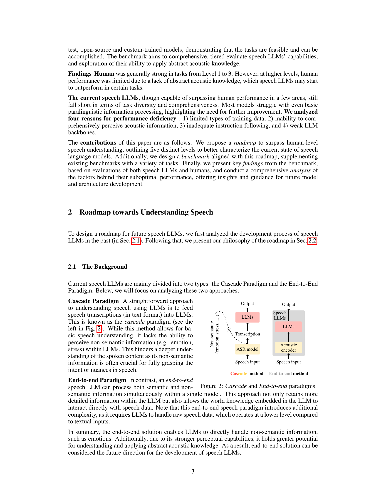
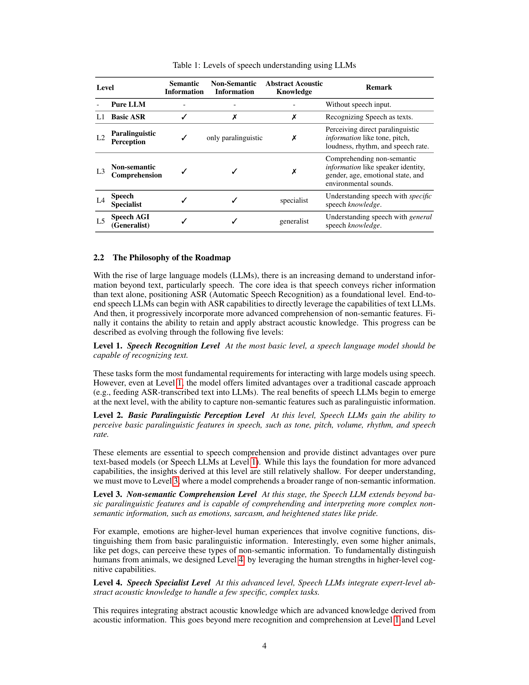
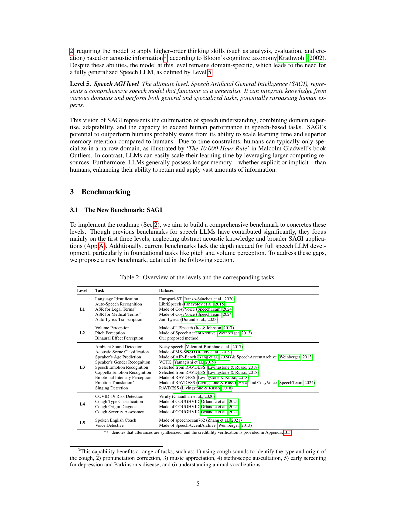

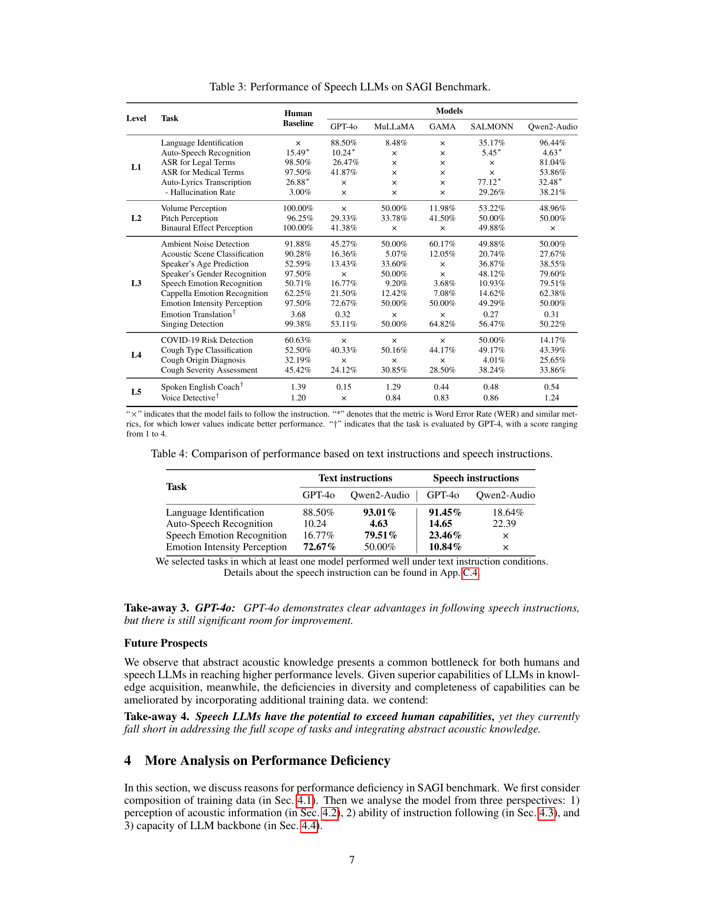

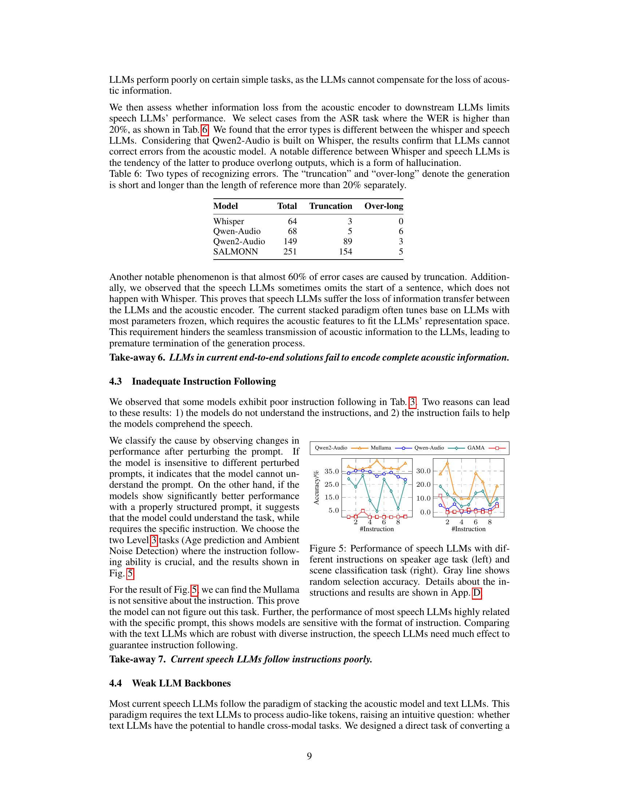
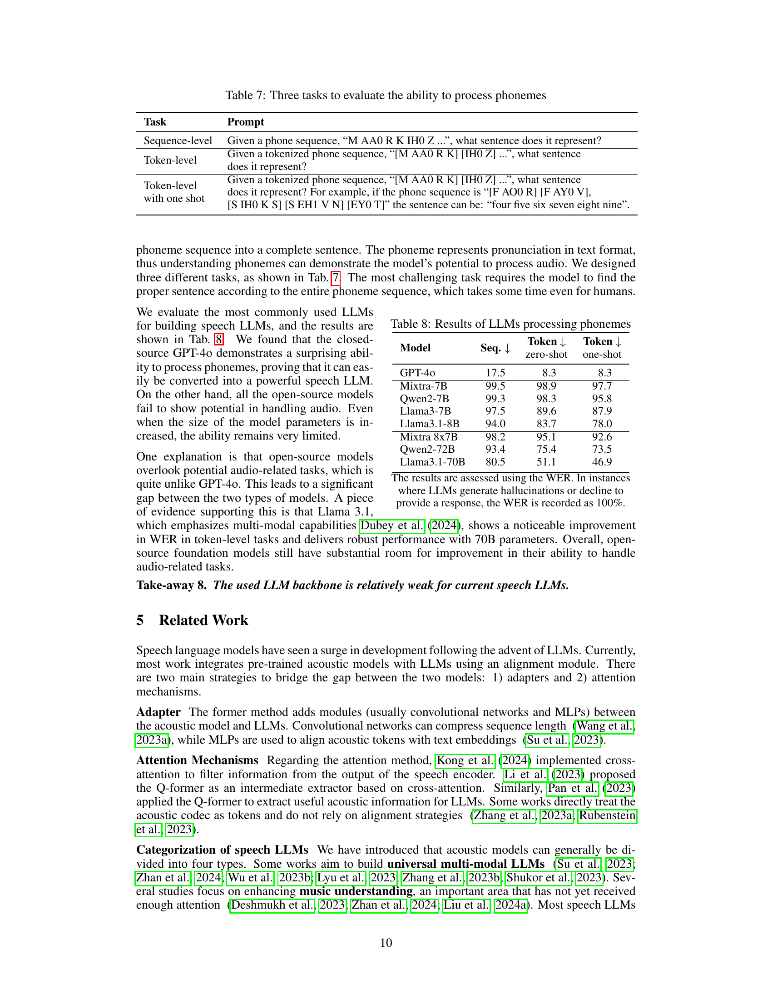

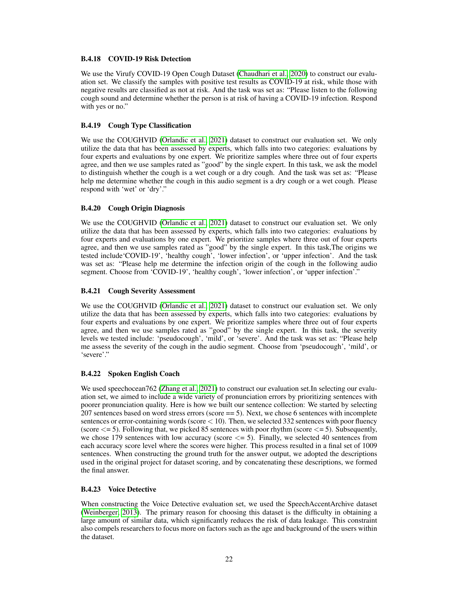

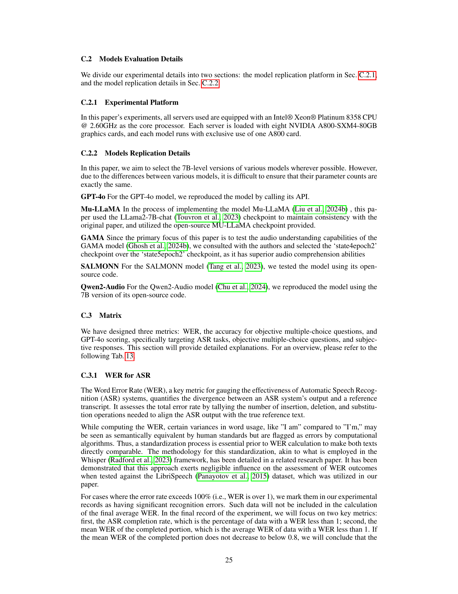
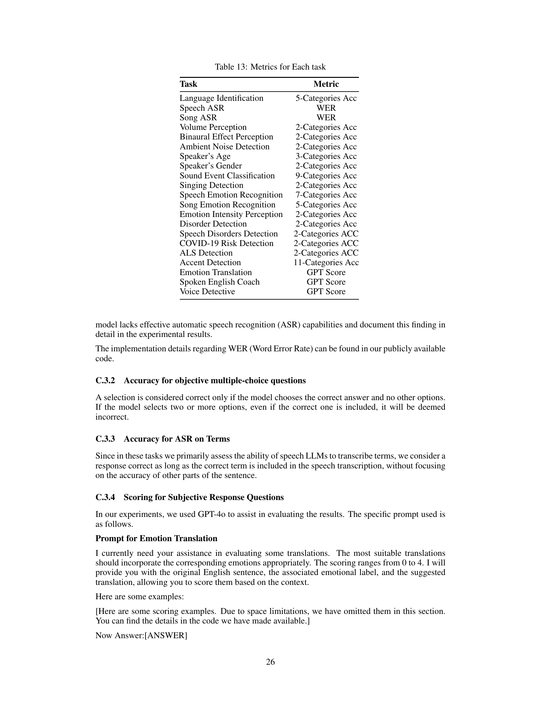
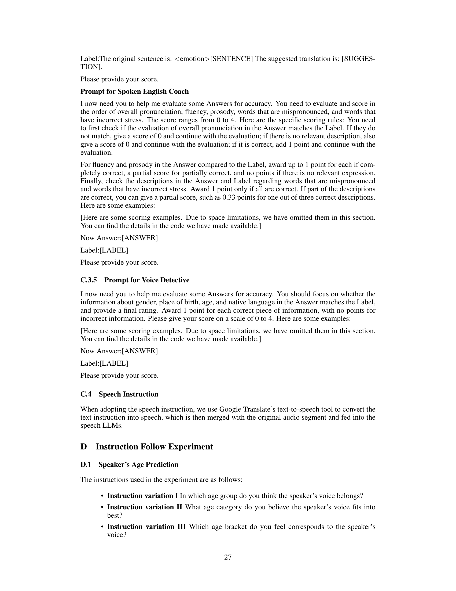
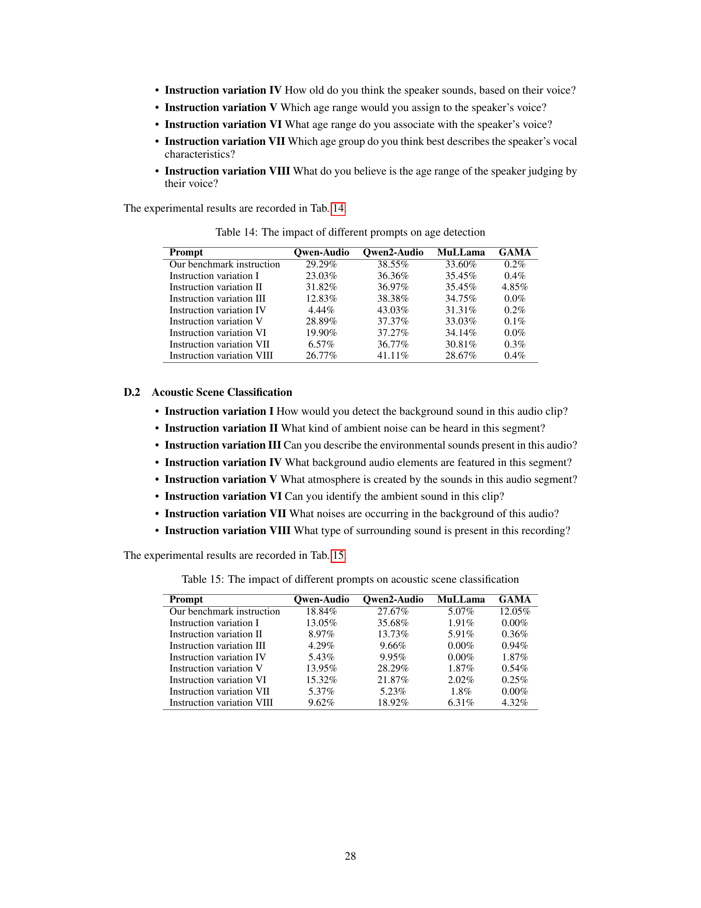
