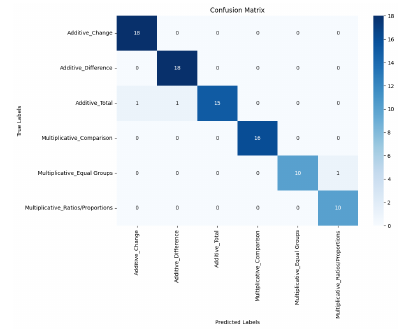
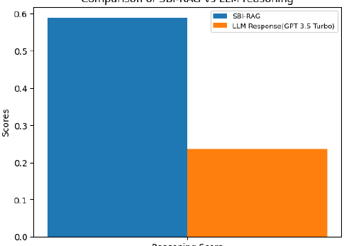
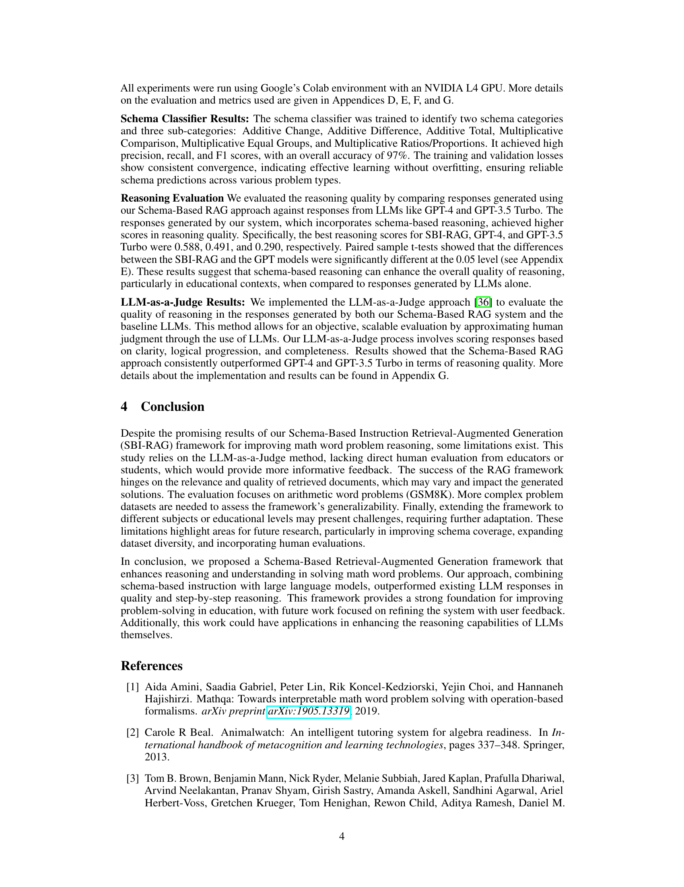
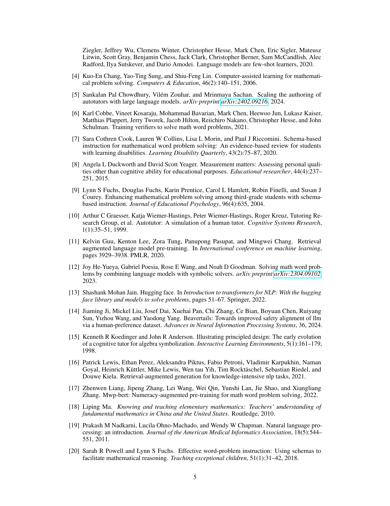
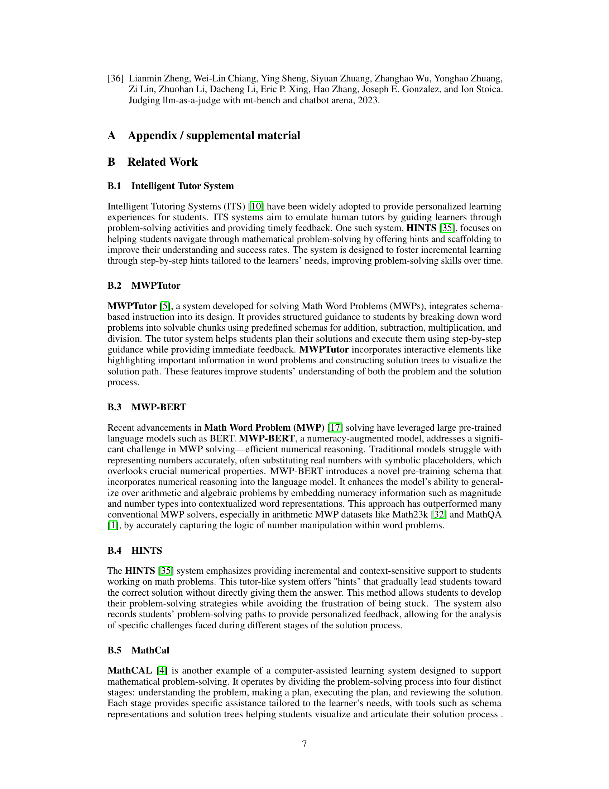
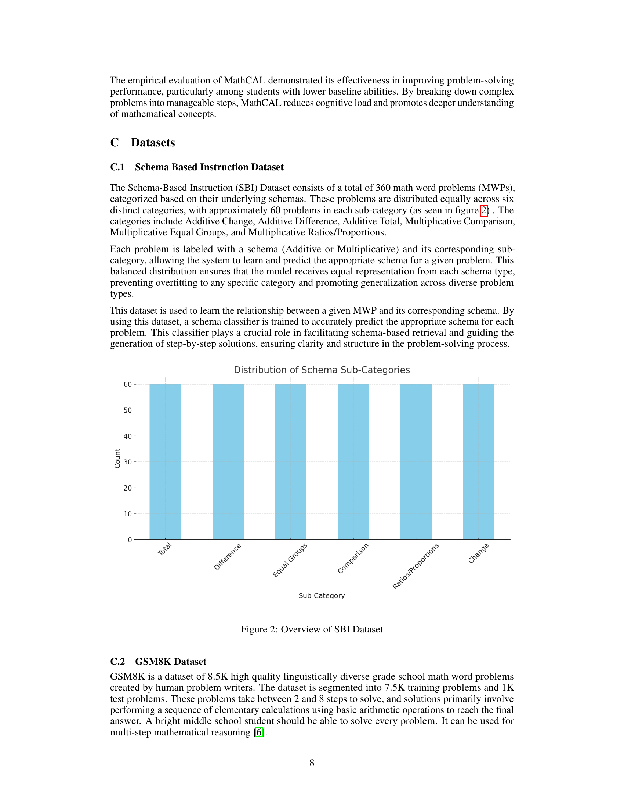
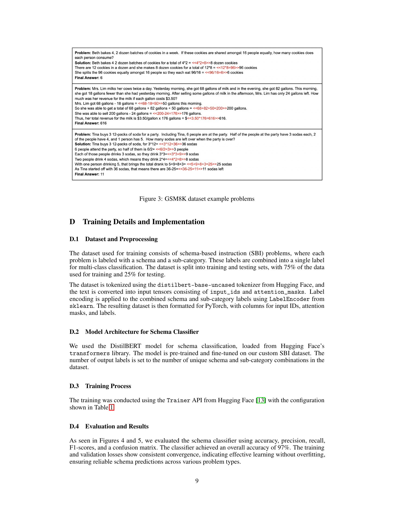
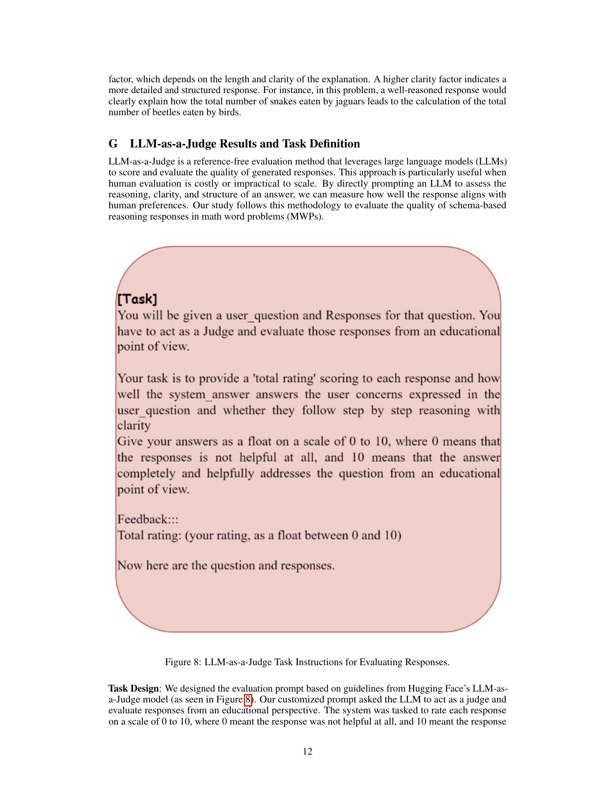

### TL;DR



Many students struggle with math word problems. This paper introduces SBI-RAG, a new framework that uses schema-based instruction (SBI) to categorize problems and large language models (LLMs) to generate step-by-step solutions. SBI helps students identify key information and operations. The LLM uses the SBI information to create a more structured solution.  The researchers tested SBI-RAG on the GSM8K dataset and compared it to GPT-4 and GPT-3.5 Turbo. SBI-RAG outperformed the LLMs, particularly in reasoning clarity, as measured by a new "reasoning score" metric. They also used an LLM to judge the solution quality, which confirmed SBI-RAG's advantage.  The findings suggest that SBI-RAG can improve students' understanding and problem-solving skills.




 &nbsp; read the paper on arXiv

  

 &nbsp; on Hugging Face


#### Why does it matter?
This paper is important because it introduces a novel framework for improving math word problem solving, combining schema-based instruction with large language models.  It offers a new evaluation metric and demonstrates superior performance compared to existing LLMs, opening new avenues for research in educational technology and AI-assisted learning.
#### Key Takeaways


 The SBI-RAG framework significantly improves math word problem-solving accuracy and reasoning clarity. 



 A novel "reasoning score" metric effectively evaluates the quality of step-by-step reasoning in generated solutions. 



 The LLM-as-a-judge approach provides a scalable and objective method for evaluating response quality. 


------
#### Visual Insights

> 🔼 The figure illustrates the architecture of the SBI-RAG framework, showing the steps involved in schema classification, prompt creation, context retrieval, and answer generation.
> 

> 
read the caption

> Figure 1: Illustration of SBI-RAG Architecture
> 

> 🔼 The chart displays the distribution of math word problems across six sub-categories within the Schema-Based Instruction dataset.
> 

> 
read the caption

> Figure 2: Overview of SBI Dataset
> 


<table id='2' style='font-size:16px'><tr><td>Prakhar Dixit</td><td>Tim Oates</td></tr><tr><td>Department of Computer Science</td><td>Department of Computer Science</td></tr><tr><td>University of Maryland Baltimore County</td><td>University of Maryland Baltimore County</td></tr><tr><td>pdixit1 @umbc · edu</td><td>oates@cs · umbc · edu</td></tr></table>

> 🔼 Table 1 presents the hyperparameters used during the training process of the schema-based classifier, including learning rate, batch size, number of epochs, optimizer, and evaluation strategy.
> 

> 
read the caption

> Table 1: Training Hyperparameters for Schema-Based Classifier
> 

### More visual insights

More on figures

> 🔼 The figure illustrates the SBI-RAG architecture, showing the four main parts: Schema Classifier, Prompt Creation, Context Retrieval, and Answer and Response Generation.
> 

> 
read the caption

> Figure 1: Illustration of SBI-RAG Architecture
> 

> 🔼 The figure illustrates the four main parts of the SBI-RAG framework: Schema Classifier, Prompt Creation, Context Retrieval, and Answer and Response Generation.
> 

> 
read the caption

> Figure 1: Illustration of SBI-RAG Architecture
> 

More on charts

> 🔼 The confusion matrix visualizes the performance of the schema classifier, showing the counts of correctly and incorrectly classified instances across six schema sub-categories.
> 

> 
read the caption

> Figure 4: Confusion matrix for the schema classifier
> 

> 🔼 The chart displays the training and validation losses of a schema classifier model over 20 epochs, showing model convergence.
> 

> 
read the caption

> Figure 5: Training and validation losses for the schema classifier
> 

> 🔼 The bar chart compares the reasoning scores of SBI-RAG and GPT-4, showing that SBI-RAG achieved a significantly higher reasoning score.
> 

> 
read the caption

> Figure 6: Reasoning Score SBI-RAG vs GPT-4
> 

> 🔼 The bar chart compares the reasoning scores of SBI-RAG and GPT 3.5 Turbo models, showing that SBI-RAG achieved a significantly higher score.
> 

> 
read the caption

> Figure 7: Reasoning Score SBI-RAG vs GPT 3.5 Turbo
> 

More on tables


<table id='0' style='font-size:18px'><tr><td>Hyperparameter</td><td>Value</td></tr><tr><td>Learning rate</td><td>2 X 10 5</td></tr><tr><td>Batch size</td><td>16</td></tr><tr><td>Number of epochs</td><td>20</td></tr><tr><td>Optimizer</td><td>AdamW with weight decay of 0.01</td></tr><tr><td>Evaluation strategy</td><td>Model evaluation at the end of each epoch</td></tr><tr><td>Logging</td><td>Evaluation results logged every 10 steps</td></tr><tr><td colspan="2">Table 1: Training Hyperparameters for Schema-Based Classifier</td></tr></table>
> 🔼 {{ table.description }}
> 

> 
read the caption

> {{ table.caption }}
> 

> The table lists the hyperparameters and their corresponding values used for training the schema-based classifier.


<table id='3' style='font-size:22px'><tr><td>[Task]</td><td></td></tr><tr><td>You will be given a user question and Responses for that question. You have to act as a Judge and evaluate those responses from an educational point of view.</td><td></td></tr><tr><td>Your task is to provide a 'total rating' scoring to each response and how well the system answer answers the user concerns expressed in the question and</td><td></td></tr><tr><td>user whether they follow step by step reasoning with clarity Give your answers as a float on a scale of 0 to 10, where 0 means that the responses is not helpful at all, and 10 means that the answer completely and helpfully addresses the question from an educational point of view.</td><td></td></tr><tr><td>Feedback:::</td><td></td></tr><tr><td>Total rating: (your rating, as a float between 0 and 10)</td><td></td></tr><tr><td>Now here are the question and responses.</td><td></td></tr></table>
> 🔼 {{ table.description }}
> 

> 
read the caption

> {{ table.caption }}
> 

> Table 1 presents the hyperparameters used during the training of the schema-based classifier, including the learning rate, batch size, number of epochs, optimizer, and evaluation strategy.

### Full paper



