### TL;DR



This research paper delves into the reasoning capabilities of OpenAI's o1 model, a powerful large language model (LLM).  The authors compare o1's performance against other LLMs and several established inference strategies (Test-time Compute methods) on various reasoning benchmarks (math, coding, commonsense).  Their experiments show that o1 significantly outperforms others. The study then dissects o1's reasoning process, identifying six key patterns: Systematic Analysis (SA), Method Reuse (MR), Divide and Conquer (DC), Self-Refinement (SR), Context Identification (CI), and Emphasizing Constraints (EC).  They found that DC and SR were the most frequently used patterns.  Furthermore, the research explores the limitations of search-based methods, highlighting the crucial role of the reward model and search space size in determining performance.  The authors also provide a detailed analysis of the reasoning patterns across different tasks, showing variability in approach based on task complexity.  The overall conclusion emphasizes the importance of o1's novel reasoning patterns in achieving superior performance, suggesting that these strategies could inspire future LLM advancements.




 &nbsp; read the paper on arXiv

  

 &nbsp; on Hugging Face


#### Why does it matter?
This paper is crucial for researchers working on large language models (LLMs) and reasoning.  It offers valuable insights into the reasoning patterns of OpenAI's o1 model, a significant advance in LLM technology.  The detailed analysis of various test-time compute methods and the identification of six key reasoning patterns provide a strong foundation for future research and development in improving LLM capabilities. The open-sourcing of code and data further enhances its impact, making it readily accessible for the broader research community.
#### Key Takeaways


 OpenAI's o1 model outperforms existing LLMs and test-time compute methods on various reasoning benchmarks. 



 o1 utilizes six distinct reasoning patterns (SA, MR, DC, SR, CI, EC), with DC and SR being most frequent. 



 The effectiveness of search-based methods like BoN is constrained by reward model quality and search space limitations. 


------
#### Visual Insights

> 🔼 The chart displays the frequency of six different reasoning patterns (SA, MR, DC, SR, CI, EC) used by the OpenAI's o1 model across four different benchmark datasets (HotpotQA, Collie, AIME, USACO).
> 

> 
read the caption

> Figure 1: The statistics of different reasoning patterns on different benchmarks.
> 


<table id='8' style='font-size:14px'><tr><td rowspan="2">Setting</td><td rowspan="2">Baselines</td><td rowspan="2"></td><td rowspan="2">Overall</td><td colspan="2">Commonsense Reasoning</td><td rowspan="2">Code USACO</td><td rowspan="2">Math AIME</td></tr><tr><td>HotpotQA</td><td>Collie</td></tr><tr><td rowspan="3">Direct</td><td>o1-preview</td><td>-</td><td>34.32</td><td>14.59</td><td>34.07</td><td>44.60</td><td>44.00</td></tr><tr><td>o1-mini</td><td>-</td><td>35.77</td><td>15.32</td><td>53.53</td><td>12.23</td><td>62.00</td></tr><tr><td>GPT4o</td><td></td><td>18.44</td><td>13.14</td><td>43.36</td><td>5.04</td><td>12.22</td></tr><tr><td rowspan="6">Test-Time</td><td>BoN</td><td>4</td><td>17.65</td><td>13.50</td><td>39.82</td><td>5.04</td><td>12.22</td></tr><tr><td>BoN</td><td>8</td><td>19.04</td><td>16.42</td><td>38.50</td><td>7.91</td><td>13.33</td></tr><tr><td>Step-wise BoN</td><td>1</td><td>6.09</td><td>13.50</td><td>5.31</td><td>0.00</td><td>5.56</td></tr><tr><td>Step-wise BoN</td><td>4</td><td>9.79</td><td>15.69</td><td>19.55</td><td>0.00</td><td>7.78</td></tr><tr><td>Self-Refine</td><td>3</td><td>5.62</td><td>13.25</td><td>0.00</td><td>0.00</td><td>9.23</td></tr><tr><td>Agent Workflow</td><td>-</td><td>24.70</td><td>14.96</td><td>46.07</td><td>22.22</td><td>15.56</td></tr></table>

> 🔼 Table 1 presents the performance comparison of OpenAI's o1 model, GPT-40, and several Test-time Compute methods on four benchmark datasets across commonsense reasoning, code, and math tasks.
> 

> 
read the caption

> Table 1: The results of OpenAI's o1 model, GPT40, and some Test-time Compute methods on our selected four benchmarks (i.e., HotpotQA, Collie, USACO, AIME). The '-' in the table represents that the method does not search the multiple responses for generation. Direct refers to having the LLMs generate a response directly from the input text, while Test-Time refers to using the Test-time Compute method based on GPT-40.
> 

### More visual insights

More on charts

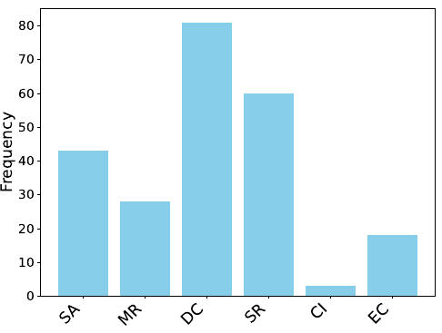

> 🔼 The bar chart displays the frequency of six different reasoning patterns (SA, MR, DC, SR, CI, EC) observed in the OpenAI's o1 model across various tasks.
> 

> 
read the caption

> Figure 2: The statistics of reasoning patterns.
> 

> 🔼 Figure 3 is a bar chart that displays the average number of reasoning tokens used by the o1 model across different tasks, categorized by correct/incorrect answers and input prompt length.
> 

> 
read the caption

> Figure 3: The statistics of the number of o1's reasoning tokens on different tasks. 'ALL' represents the average length of reasoning tokens for all samples, while 'True' and 'False' show the averages for correctly and incorrectly answered samples, respectively. 'Input' refers to the average length of the input prompt.
> 

 using different reward models under N = 4 setting. The SRG represents the Skywork-Reward-Gemma-2-27B, the URM-LLaMa refers to the URM-LLaMa-3.1-8B.")

> 🔼 The chart displays the performance of Best-of-N (BoN) using GPT-40 with different reward models (SRG, URM-LLaMa, GPT40, and Human) on HotpotQA and Collie datasets.
> 

> 
read the caption

> Figure 4: The results of BoN( GPT-40) using different reward models under N = 4 setting. The SRG represents the Skywork-Reward-Gemma-2-27B, the URM-LLaMa refers to the URM-LLaMa-3.1-8B.
> 

 on HotpotQA.")

> 🔼 The chart displays the performance of the Best-of-N (BoN) method on the HotpotQA dataset using different base models (GPT-40, Qwen2.5, Llama3) with varying numbers of generated outputs (N).
> 

> 
read the caption

> Figure 5: The results of BoN under different search spaces (i.e., the N ranging from 1 to 16) on HotpotQA.
> 

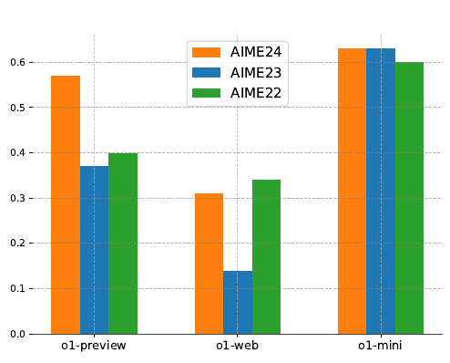

> 🔼 The chart displays the performance of three variants of the o1 model (o1-preview, o1-web, and o1-mini) on three different AIME datasets (AIME22, AIME23, and AIME24).
> 

> 
read the caption

> Figure 6: The results of o1 model on AIME24, AIME23, and AIME22.
> 

> 🔼 The chart compares the performance of different LLMs (Qwen2.5-72B, Llama3-72B, GPT-40) on raw and filtered versions of HotpotQA and Collie datasets.
> 

> 
read the caption

> Figure 8: The results of the LLMs on the raw bench and the filtered bench. On the left subfigure, we present LLMs' capabilities on the raw and filtered HotpotQA, and on the right subfigure, we provide the corresponding results on Collie.
> 

More on tables


<table id='13' style='font-size:20px'><tr><td>Commonsense</td><td>Reasoning Collie</td><td>Coding USACO</td><td>Math AIME</td></tr><tr><td></td><td>226</td><td>139</td><td>90</td></tr></table>
> 🔼 {{ table.description }}
> 

> 
read the caption

> {{ table.caption }}
> 

> Table 1 presents a comparison of the performance of OpenAI's o1 model, GPT-40, and several test-time compute methods across four benchmark datasets in three domains (commonsense reasoning, code, and math).


<table id='1' style='font-size:14px'><tr><td>COLLIE</td></tr><tr><td>>Input Please generate a paragraph: 1) with exactly3 sentences; 2) not containing the word "be 3) not containing the word 「of 4) not containing the word 'is</td></tr><tr><td>> Thinking **Crafting the paragraph** I'm careful not to use 'be', 'of', or 'is'. Instead, I'm selecting precise, vivid words, ensuring the paragraph's structure and meaning are thoughtfully established. This approach keeps the text engaging and grammatically sound. ** Creating compliant content** I'm crafting a 3-sentence paragraph that avoids 'be', 'of', and 'is'. The paragraph will stay clear of mentioning policies or hidden reasoning, ensuring compliance and appropriateness. ** Clarifying usage rules** I'm sorting out which forms of 'to be' are allowed, like 'being' and 'been', while 'be', 'is', 'are', 'was', and 'were' are prohibited. This distinction ensures precision in word choice. **Crafting the scene** I'm thinking about a sentence to paint a vivid picture without using 'of', 'be', or 'is'. The phrase "hues of pink and orange" needs rephrasing to avoid 'of'. **Painting a morning** I'm crafting a vivid morning scene: the sun rises, colors the sky in pink and orange, birds sing, and people enjoy hopeful smiles as the day starts. It's sprucing up each sentence for clarity and appeal.</td></tr><tr><td></td></tr><tr><td>>Inference The sun climbs slowly, painting the horizon with vibrant shades that hint at warmth 2 Birds sing in unison, their melody drifting across the quiet streets 3 People stroll along paths, their faces glowing with anticipation for what lies ahead. Grammar Check:</td></tr></table>
> 🔼 {{ table.description }}
> 

> 
read the caption

> {{ table.caption }}
> 

> Table 1 presents the performance comparison of OpenAI's o1 model, GPT-40, and several Test-time Compute methods across four benchmarks, categorized by commonsense reasoning, coding, and math tasks.

### Full paper


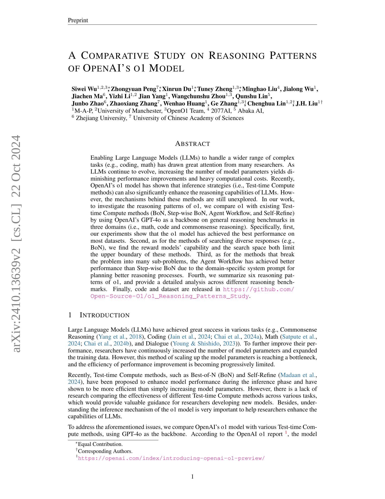

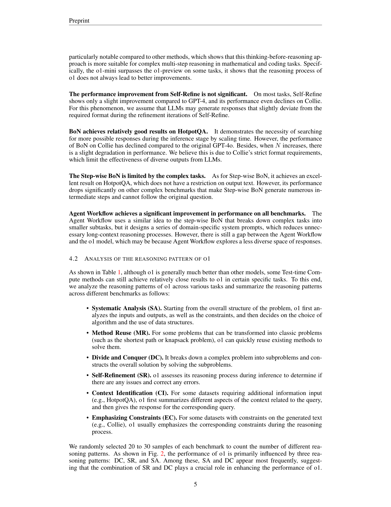
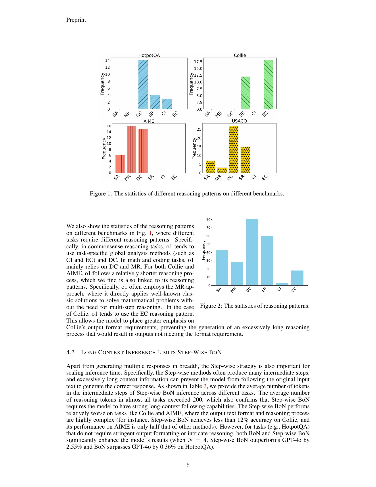
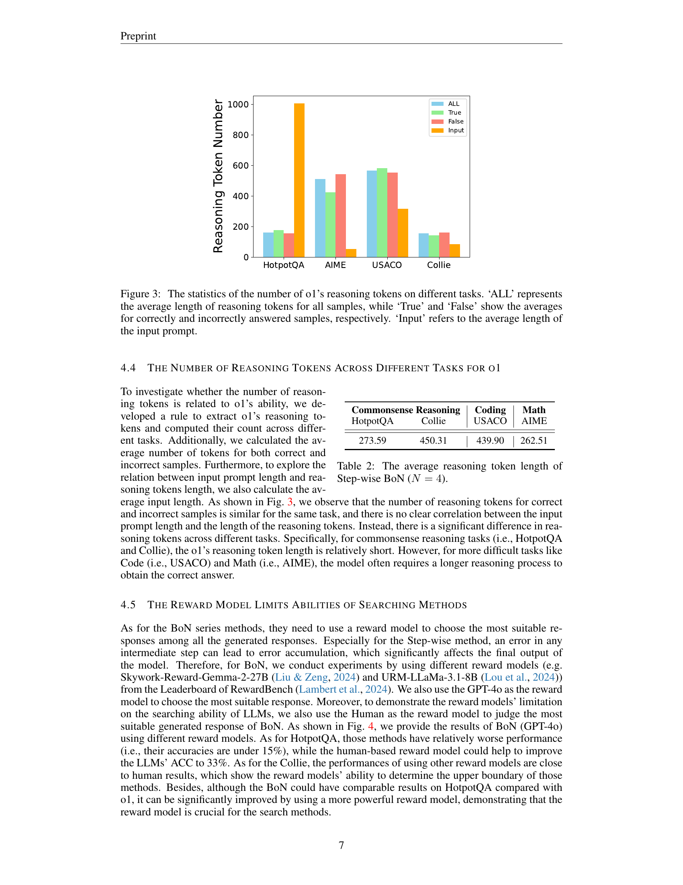
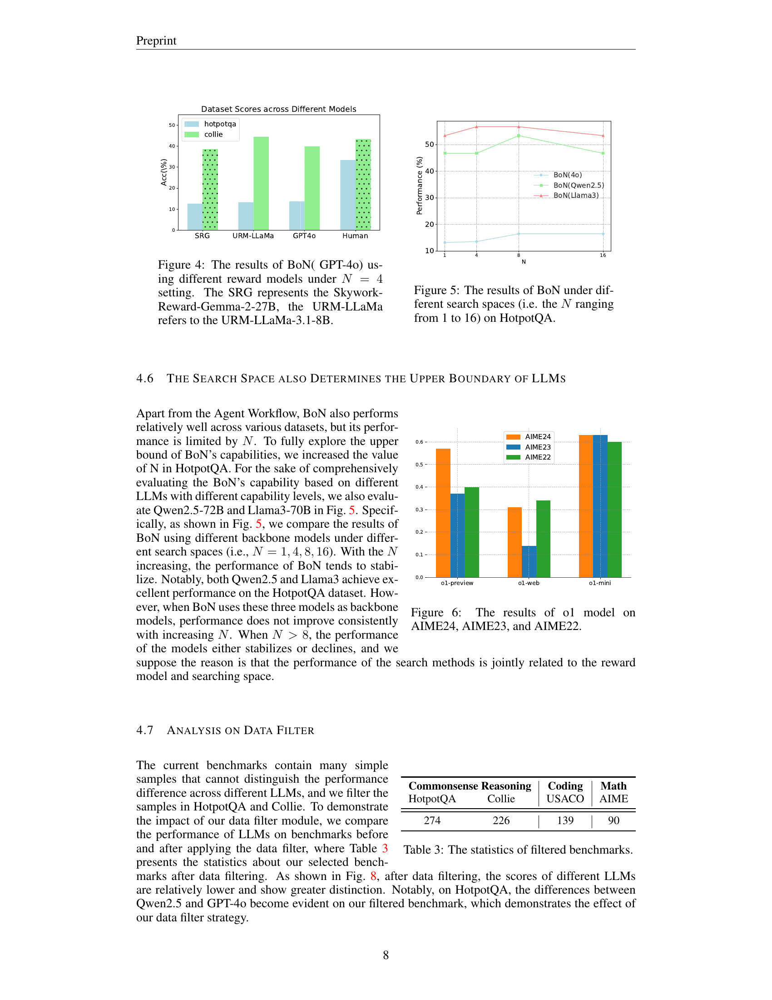
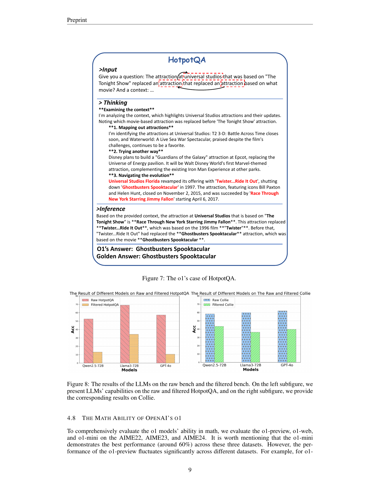
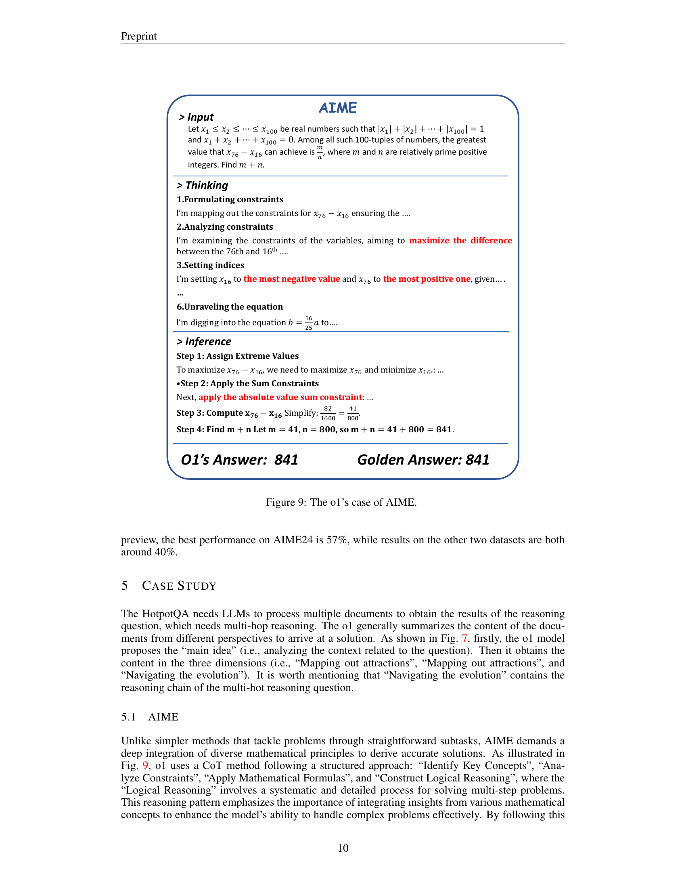
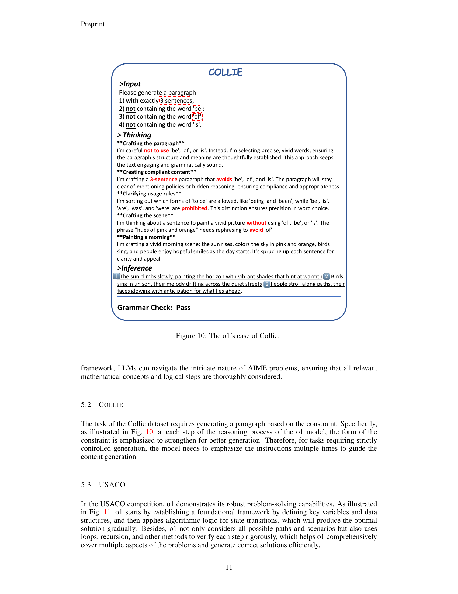

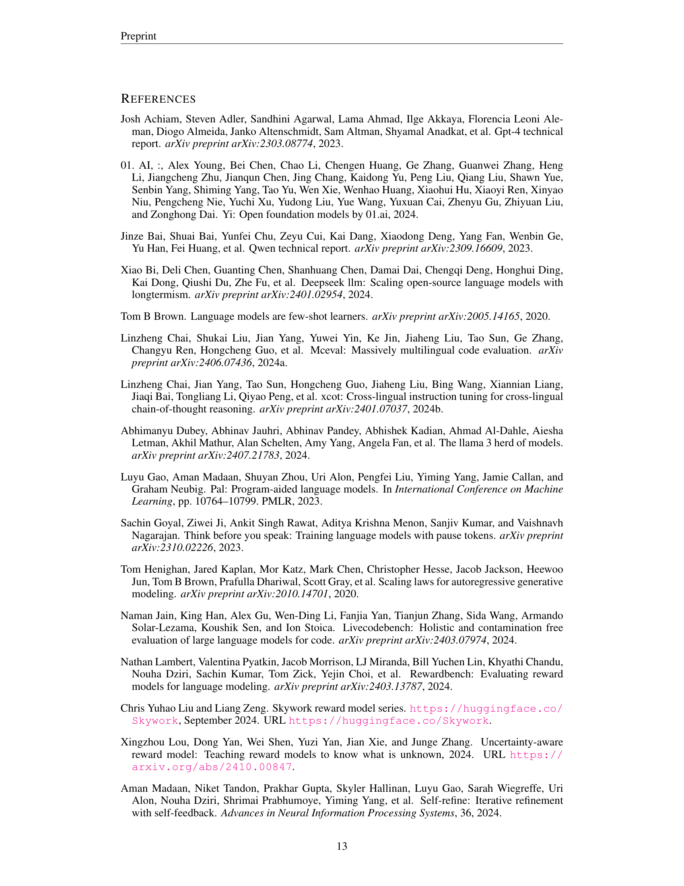

