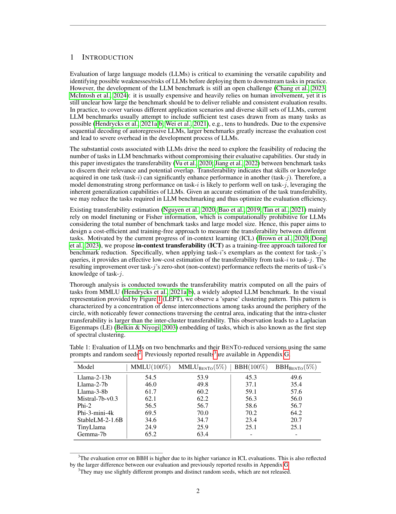
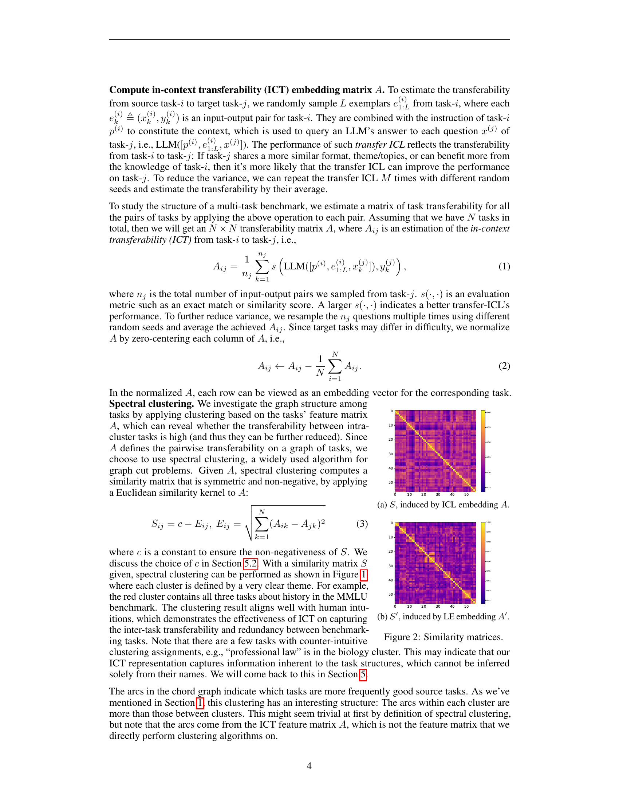
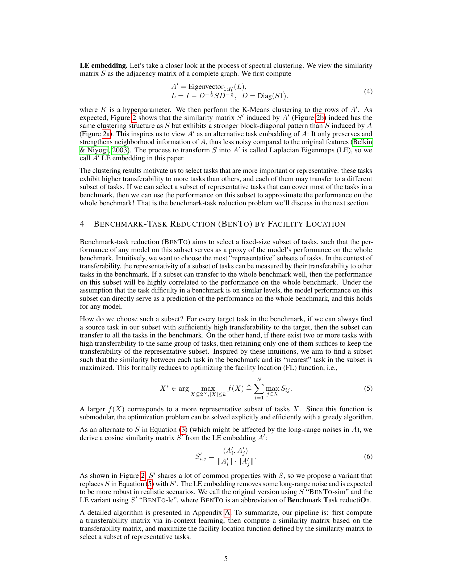
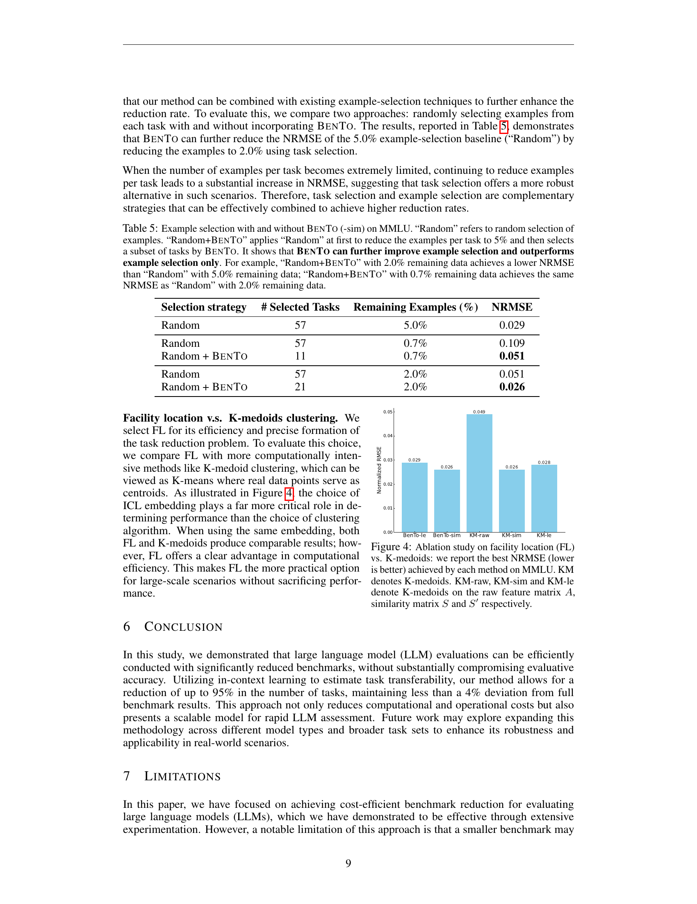
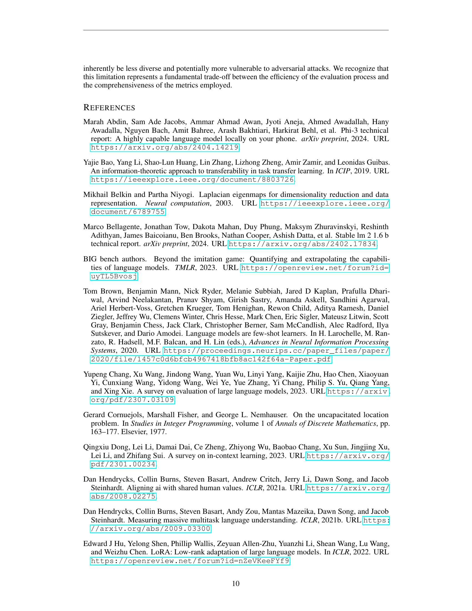

### TL;DR



Evaluating large language models (LLMs) is expensive due to the large number of tasks in benchmark datasets. This paper introduces BENTO, a novel method that efficiently reduces the number of tasks needed for accurate LLM evaluation. BENTO leverages in-context learning to estimate task transferability, identifying highly representative tasks. By optimizing a facility location function, BENTO selects a minimal subset of tasks that maintain evaluation accuracy, significantly reducing computational costs. Experiments on MMLU and FLAN benchmarks show that BENTO reduces tasks to 5% while inducing only a <4% difference in evaluation accuracy compared to using the full benchmark.  This approach is training-free, gradient-free, and highly efficient, offering a practical solution for researchers and developers working with LLMs.




 &nbsp; read the paper on arXiv

  

 &nbsp; on Hugging Face


#### Why does it matter?
This paper is highly relevant to researchers working on large language model (LLM) evaluation and benchmarking.  It offers a novel, efficient method for reducing the size of benchmark datasets without sacrificing evaluation accuracy.  This is crucial for managing the high computational cost associated with evaluating LLMs and for making benchmarking more accessible to researchers with limited resources. The findings open avenues for optimizing LLM evaluation strategies and inform future research in efficient and cost-effective LLM evaluation.
#### Key Takeaways


 In-context transferability (ICT) effectively measures task similarity for LLM benchmark reduction. 



 BENTO, a facility location-based method, selects a representative subset of tasks for efficient LLM evaluation. 



 Benchmark reduction using ICT and BENTO achieves significant cost savings without accuracy loss. 


------
#### Visual Insights

> 🔼 The figure shows a chord graph illustrating the clusters of benchmark tasks based on in-context transferability and a bar chart comparing the evaluation accuracy of different task reduction methods.
> 

> 
read the caption

> Figure 1: LEFT: In-context Transferability (ICT) reveals the clusters of benchmark tasks. We apply spectral clustering to ICT (arcs¹) between MMLU tasks (nodes), whose color denotes the cluster it belongs to. The discovered clusters are associated with explainable themes. The theme and tasks of each cluster are listed around the chord graph. Only the top-7% arcs with the highest ICT values are shown in the graph, among which intra-cluster arcs are much more than inter-cluster arcs, implying a 'sparse' topology captured by ICT. RIGHT: Evaluation accuracy of task reduction methods. Each method selects 3 out of the 57 tasks in MMLU to evaluate 9 LLMs (axes). The plot reports 1 – Ισ-σ*|/σ* in log-scale where σ and σ* are the evaluation metrics on the reduced-benchmark and full-benchmark, respectively. Our method (BENTO-le) achieves 97% evaluation accuracy on average. The grey band reports the random selection baseline's mean±standard variation. All baselines are defined in Section 5. Table 2 reports the result when selecting different number of tasks.
> 

> 🔼 The chart displays the in-context transferability between benchmark tasks, revealing clusters of related tasks and the accuracy of different task reduction methods.
> 

> 
read the caption

> Figure 1: LEFT: In-context Transferability (ICT) reveals the clusters of benchmark tasks. We apply spectral clustering to ICT (arcs¹) between MMLU tasks (nodes), whose color denotes the cluster it belongs to. The discovered clusters are associated with explainable themes. The theme and tasks of each cluster are listed around the chord graph. Only the top-7% arcs with the highest ICT values are shown in the graph, among which intra-cluster arcs are much more than inter-cluster arcs, implying a 'sparse' topology captured by ICT. RIGHT: Evaluation accuracy of task reduction methods. Each method selects 3 out of the 57 tasks in MMLU to evaluate 9 LLMs (axes). The plot reports 1 – Ισ-σ*|/σ* in log-scale where σ and σ* are the evaluation metrics on the reduced-benchmark and full-benchmark, respectively. Our method (BENTO-le) achieves 97% evaluation accuracy on average. The grey band reports the random selection baseline's mean±standard variation. All baselines are defined in Section 5. Table 2 reports the result when selecting different number of tasks.
> 


 <table id='6' style='font-size:18px'><tr><td>Model</td><td>MMLU(100%)</td><td>MMLUBENTO (5%)</td><td>BBH (100%)</td><td>BBHBENTO (5%)</td></tr><tr><td>Llama-2-13b</td><td>54.5</td><td>53.9</td><td>45.3</td><td>49.6</td></tr><tr><td>Llama-2-7b</td><td>46.0</td><td>49.8</td><td>37.1</td><td>35.4</td></tr><tr><td>Llama-3-8b</td><td>61.7</td><td>60.2</td><td>59.1</td><td>57.6</td></tr><tr><td>Mistral-7b-v0.3</td><td>62.1</td><td>62.2</td><td>56.3</td><td>56.0</td></tr><tr><td>Phi-2</td><td>56.5</td><td>56.7</td><td>58.6</td><td>56.7</td></tr><tr><td>Phi-3-mini-4k</td><td>69.5</td><td>70.0</td><td>70.2</td><td>64.2</td></tr><tr><td>StableLM-2-1.6B</td><td>34.6</td><td>34.7</td><td>23.4</td><td>20.7</td></tr><tr><td>TinyLlama</td><td>24.9</td><td>25.9</td><td>25.1</td><td>25.1</td></tr><tr><td>Gemma-7b</td><td>65.2</td><td>63.4</td><td>-</td><td>-</td></tr></table>

> 🔼 The table presents the performance of several LLMs on two benchmarks (MMLU and BBH) and their reduced versions using BENTO, showing the consistency of evaluation results with a reduced number of tasks.
> 

> 
read the caption

> Table 1: Evaluation of LLMs on two benchmarks and their BENTO-reduced versions using the same prompts and random seeds². Previously reported results³are available in Appendix G.
> 

### More visual insights

More on charts

 reveals the clusters of benchmark tasks. We apply spectral clustering to ICT (arcs¹) between MMLU tasks (nodes), whose color denotes the cluster it belongs to. The discovered clusters are associated with explainable themes. The theme and tasks of each cluster are listed around the chord graph. Only the top-7% arcs with the highest ICT values are shown in the graph, among which intra-cluster arcs are much more than inter-cluster arcs, implying a 'sparse' topology captured by ICT. RIGHT: Evaluation accuracy of task reduction methods. Each method selects 3 out of the 57 tasks in MMLU to evaluate 9 LLMs (axes). The plot reports 1 – Ισ-σ*|/σ* in log-scale where σ and σ* are the evaluation metrics on the reduced-benchmark and full-benchmark, respectively. Our method (BENTO-le) achieves 97% evaluation accuracy on average. The grey band reports the random selection baseline's mean±standard variation. All baselines are defined in Section 5. Table 2 reports the result when selecting different number of tasks.")

> 🔼 The chart displays the in-context transferability (ICT) between benchmark tasks, revealing clusters of tasks associated with explainable themes, and evaluates the accuracy of task reduction methods.
> 

> 
read the caption

> Figure 1: LEFT: In-context Transferability (ICT) reveals the clusters of benchmark tasks. We apply spectral clustering to ICT (arcs¹) between MMLU tasks (nodes), whose color denotes the cluster it belongs to. The discovered clusters are associated with explainable themes. The theme and tasks of each cluster are listed around the chord graph. Only the top-7% arcs with the highest ICT values are shown in the graph, among which intra-cluster arcs are much more than inter-cluster arcs, implying a 'sparse' topology captured by ICT. RIGHT: Evaluation accuracy of task reduction methods. Each method selects 3 out of the 57 tasks in MMLU to evaluate 9 LLMs (axes). The plot reports 1 – Ισ-σ*|/σ* in log-scale where σ and σ* are the evaluation metrics on the reduced-benchmark and full-benchmark, respectively. Our method (BENTO-le) achieves 97% evaluation accuracy on average. The grey band reports the random selection baseline's mean±standard variation. All baselines are defined in Section 5. Table 2 reports the result when selecting different number of tasks.
> 

 reveals the clusters of benchmark tasks. We apply spectral clustering to ICT (arcs¹) between MMLU tasks (nodes), whose color denotes the cluster it belongs to. The discovered clusters are associated with explainable themes. The theme and tasks of each cluster are listed around the chord graph. Only the top-7% arcs with the highest ICT values are shown in the graph, among which intra-cluster arcs are much more than inter-cluster arcs, implying a 'sparse' topology captured by ICT. RIGHT: Evaluation accuracy of task reduction methods. Each method selects 3 out of the 57 tasks in MMLU to evaluate 9 LLMs (axes). The plot reports 1 – Ισ-σ*|/σ* in log-scale where σ and σ* are the evaluation metrics on the reduced-benchmark and full-benchmark, respectively. Our method (BENTO-le) achieves 97% evaluation accuracy on average. The grey band reports the random selection baseline's mean±standard variation. All baselines are defined in Section 5. Table 2 reports the result when selecting different number of tasks.")

> 🔼 The chart displays the in-context transferability between benchmark tasks (left) and the evaluation accuracy of different task reduction methods (right), showing BENTO's superior performance.
> 

> 
read the caption

> Figure 1: LEFT: In-context Transferability (ICT) reveals the clusters of benchmark tasks. We apply spectral clustering to ICT (arcs¹) between MMLU tasks (nodes), whose color denotes the cluster it belongs to. The discovered clusters are associated with explainable themes. The theme and tasks of each cluster are listed around the chord graph. Only the top-7% arcs with the highest ICT values are shown in the graph, among which intra-cluster arcs are much more than inter-cluster arcs, implying a 'sparse' topology captured by ICT. RIGHT: Evaluation accuracy of task reduction methods. Each method selects 3 out of the 57 tasks in MMLU to evaluate 9 LLMs (axes). The plot reports 1 – Ισ-σ*|/σ* in log-scale where σ and σ* are the evaluation metrics on the reduced-benchmark and full-benchmark, respectively. Our method (BENTO-le) achieves 97% evaluation accuracy on average. The grey band reports the random selection baseline's mean±standard variation. All baselines are defined in Section 5. Table 2 reports the result when selecting different number of tasks.
> 

 reveals the clusters of benchmark tasks. We apply spectral clustering to ICT (arcs¹) between MMLU tasks (nodes), whose color denotes the cluster it belongs to. The discovered clusters are associated with explainable themes. The theme and tasks of each cluster are listed around the chord graph. Only the top-7% arcs with the highest ICT values are shown in the graph, among which intra-cluster arcs are much more than inter-cluster arcs, implying a 'sparse' topology captured by ICT. RIGHT: Evaluation accuracy of task reduction methods. Each method selects 3 out of the 57 tasks in MMLU to evaluate 9 LLMs (axes). The plot reports 1 – Ισ-σ*|/σ* in log-scale where σ and σ* are the evaluation metrics on the reduced-benchmark and full-benchmark, respectively. Our method (BENTO-le) achieves 97% evaluation accuracy on average. The grey band reports the random selection baseline's mean±standard variation. All baselines are defined in Section 5. Table 2 reports the result when selecting different number of tasks.")

> 🔼 The chart visualizes in-context transferability between benchmark tasks, revealing clusters and illustrating the accuracy of various task reduction methods, with BENTO-le demonstrating high accuracy.
> 

> 
read the caption

> Figure 1: LEFT: In-context Transferability (ICT) reveals the clusters of benchmark tasks. We apply spectral clustering to ICT (arcs¹) between MMLU tasks (nodes), whose color denotes the cluster it belongs to. The discovered clusters are associated with explainable themes. The theme and tasks of each cluster are listed around the chord graph. Only the top-7% arcs with the highest ICT values are shown in the graph, among which intra-cluster arcs are much more than inter-cluster arcs, implying a 'sparse' topology captured by ICT. RIGHT: Evaluation accuracy of task reduction methods. Each method selects 3 out of the 57 tasks in MMLU to evaluate 9 LLMs (axes). The plot reports 1 – Ισ-σ*|/σ* in log-scale where σ and σ* are the evaluation metrics on the reduced-benchmark and full-benchmark, respectively. Our method (BENTO-le) achieves 97% evaluation accuracy on average. The grey band reports the random selection baseline's mean±standard variation. All baselines are defined in Section 5. Table 2 reports the result when selecting different number of tasks.
> 

More on tables


<table id='1' style='font-size:16px'><tr><td>Method</td><td>Best</td><td>k=1</td><td>k=2</td><td>k=3</td><td>k=4</td><td>k=5</td><td>k=6</td><td>k=7</td><td>k=8</td><td>k=9</td><td>k=10</td></tr><tr><td>random</td><td>0.091</td><td>0.228</td><td>0.163</td><td>0.144</td><td>0.130</td><td>0.118</td><td>0.110</td><td>0.104</td><td>0.100</td><td>0.095</td><td>0.091</td></tr><tr><td>GPT4</td><td>0.034</td><td>0.213</td><td>0.078</td><td>0.093</td><td>0.077</td><td>0.056</td><td>0.034</td><td>0.160</td><td>0.180</td><td>0.168</td><td>0.135</td></tr><tr><td>BM25-le</td><td>0.074</td><td>0.074</td><td>0.218</td><td>0.217</td><td>0.216</td><td>0.205</td><td>0.193</td><td>0.199</td><td>0.213</td><td>0.209</td><td>0.176</td></tr><tr><td>BM25-sim</td><td>0.093</td><td>0.351</td><td>0.188</td><td>0.177</td><td>0.119</td><td>0.101</td><td>0.093</td><td>0.162</td><td>0.137</td><td>0.134</td><td>0.117</td></tr><tr><td>BENTO-le</td><td>0.029</td><td>0.051</td><td>0.098</td><td>0.029</td><td>0.049</td><td>0.045</td><td>0.031</td><td>0.060</td><td>0.168</td><td>0.147</td><td>0.113</td></tr><tr><td>BENTo-sim</td><td>0.026</td><td>0.123</td><td>0.061</td><td>0.177</td><td>0.119</td><td>0.101</td><td>0.039</td><td>0.079</td><td>0.039</td><td>0.029</td><td>0.026</td></tr></table>
> 🔼 {{ table.description }}
> 

> 
read the caption

> {{ table.caption }}
> 

> Table 2 presents the normalized root mean squared error (NRMSE) on the MMLU benchmark for different task reduction methods and varying numbers of selected tasks.


<table id='4' style='font-size:14px'><tr><td>Method</td><td>Best</td><td>k=1</td><td>k=2</td><td>k=3</td><td>k=4</td><td>k=5</td><td>k=6</td><td>k=7</td><td>k=8</td><td>k=9</td><td>k=10</td><td>k=11</td><td>k=12</td></tr><tr><td>random</td><td>0.49</td><td>1.27</td><td>1.06</td><td>0.92</td><td>0.83</td><td>0.77</td><td>0.70</td><td>0.64</td><td>0.60</td><td>0.56</td><td>0.53</td><td>0.51</td><td>0.49</td></tr><tr><td>GPT4</td><td>0.09</td><td>7.48</td><td>3.29</td><td>1.86</td><td>1.36</td><td>0.89</td><td>0.58</td><td>0.61</td><td>0.41</td><td>0.26</td><td>0.13</td><td>0.09</td><td>0.44</td></tr><tr><td>BM25-le</td><td>0.51</td><td>0.99</td><td>0.76</td><td>0.61</td><td>0.57</td><td>0.58</td><td>0.65</td><td>0.51</td><td>1.61</td><td>1.33</td><td>1.10</td><td>1.36</td><td>1.36</td></tr><tr><td>BM25-sim</td><td>0.24</td><td>7.93</td><td>4.36</td><td>2.57</td><td>1.69</td><td>1.30</td><td>0.93</td><td>0.65</td><td>0.68</td><td>0.49</td><td>0.36</td><td>0.31</td><td>0.24</td></tr><tr><td>BENTO-le</td><td>0.07</td><td>0.55</td><td>0.47</td><td>0.22</td><td>0.07</td><td>1.44</td><td>1.03</td><td>0.86</td><td>0.63</td><td>0.58</td><td>0.50</td><td>0.40</td><td>0.29</td></tr><tr><td>BENTo-sim</td><td>0.04</td><td>0.93</td><td>0.76</td><td>0.04</td><td>0.10</td><td>0.17</td><td>0.30</td><td>0.26</td><td>0.25</td><td>0.33</td><td>0.35</td><td>0.18</td><td>0.21</td></tr></table>
> 🔼 {{ table.description }}
> 

> 
read the caption

> {{ table.caption }}
> 

> Table 3 presents the normalized root mean square error (NRMSE) on the FLAN benchmark for different task reduction methods and varying numbers of selected tasks (k).


<table id='3' style='font-size:20px'><tr><td>Method</td><td>MMLU</td><td>AGIEval Eng</td><td>Big Bench Hard</td></tr><tr><td>cheby-le</td><td>0.05</td><td>0.07</td><td>0.09</td></tr><tr><td>cheby-sim</td><td>0.11</td><td>0.06</td><td>0.22</td></tr><tr><td>cos-le</td><td>0.05</td><td>0.03</td><td>0.20</td></tr><tr><td>cos-sim</td><td>0.03</td><td>0.09</td><td>0.10</td></tr><tr><td>BENTO-le</td><td>0.03</td><td>0.03</td><td>0.05</td></tr><tr><td>BENTo-sim</td><td>0.03</td><td>0.03</td><td>0.15</td></tr></table>
> 🔼 {{ table.description }}
> 

> 
read the caption

> {{ table.caption }}
> 

> Table 4 presents an ablation study comparing the best NRMSE achieved by different similarity metrics (cosine, Chebyshev, and Euclidean) across three datasets (MMLU, AGIEval Eng, and Big Bench Hard) for the BENTO benchmark reduction method.


 <table id='3' style='font-size:18px'><tr><td>Selection strategy</td><td># Selected Tasks</td><td>Remaining Examples (%)</td><td>NRMSE</td></tr><tr><td>Random</td><td>57</td><td>5.0%</td><td>0.029</td></tr><tr><td>Random</td><td>57</td><td>0.7%</td><td>0.109</td></tr><tr><td>Random + BENTO</td><td>11</td><td>0.7%</td><td>0.051</td></tr><tr><td>Random</td><td>57</td><td>2.0%</td><td>0.051</td></tr><tr><td>Random + BENTO</td><td>21</td><td>2.0%</td><td>0.026</td></tr></table>
> 🔼 {{ table.description }}
> 

> 
read the caption

> {{ table.caption }}
> 

> Table 5 presents a comparison of example selection strategies (random vs. random combined with BENTO) demonstrating that BENTO improves NRMSE, even with fewer examples.


<table id='2' style='font-size:18px'><tr><td colspan="2">Algorithm 1 Benchmark Task Reduction (BENTO)</td></tr><tr><td>1:</td><td>procedure TRANSFERABILITYMATRIX(Task, Model, L, M) ▷ L and M are hyperparameters</td></tr><tr><td>2:</td><td>N = length(Task), p(i) =instruction of Task[i]</td></tr><tr><td>3:</td><td>for i,j = 1 → N do ▷ Estimate ICT from Task[i] to Task[j]</td></tr><tr><td>4:</td><td>for m = 1 → M do ▷ M random seeds</td></tr><tr><td>5:</td><td>Set random seed to m</td></tr><tr><td>6:</td><td>Sample L exemplars eliz from source Task[i]</td></tr><tr><td>7:</td><td>Sample nj input-output pairs e⌀inj from target Task[j]</td></tr><tr><td>8:</td><td>Estimate ICT Ai,j using Equation</td></tr><tr><td>9:</td><td>end for</td></tr><tr><td>10:</td><td>Average Ai,j over the M random seeds</td></tr><tr><td>11:</td><td>end for</td></tr><tr><td>12:</td><td>Normalize the columns of A using Equation</td></tr><tr><td>13:</td><td>return A</td></tr><tr><td>14: end</td><td>procedure</td></tr><tr><td>15:</td><td>procedure SIMILARITYMATRIX(A, K) ▷ Transferability matrix A, hyperparameter K</td></tr><tr><td>16:</td><td>Compute the similarity matrix S using Equation</td></tr><tr><td>17:</td><td>Compute the Laplacian embedding A' using Equation</td></tr><tr><td>18:</td><td>Compute the cosine similarity matrix S" from A' using Equation</td></tr><tr><td>19:</td><td>return S, S"</td></tr><tr><td>20: end</td><td>procedure</td></tr><tr><td>21:</td><td>procedure BENCHMARKTASKREDUCTION(S) ▷ S can be replaced by S"</td></tr><tr><td>22:</td><td>Maximize Equation 5 by the greedy algorithm</td></tr><tr><td>23:</td><td>Return X*</td></tr><tr><td>24: end</td><td>procedure</td></tr></table>
> 🔼 {{ table.description }}
> 

> 
read the caption

> {{ table.caption }}
> 

> The table presents the performance of various LLMs on the full MMLU and BBH benchmarks, and their reduced versions using the BENTO method.


<table id='1' style='font-size:16px'><tr><td>k\Method</td><td>GPT4</td><td>BM25-le</td><td>BM25-sim</td><td>BENTO-le</td><td>BENTo-sim</td></tr><tr><td>1</td><td>0.193±0.017</td><td>0.062±0.015</td><td>0.349±0.024</td><td>0.059±0.010</td><td>0.130±0.013</td></tr><tr><td>2</td><td>0.073±0.006</td><td>0.224±0. 025</td><td>0.177±0.020</td><td>0.090±0.014</td><td>0.066±0.010</td></tr><tr><td>3</td><td>0.100±0.014</td><td>0.220±0. 025</td><td>0.147±0.017</td><td>0.031±0.009</td><td>0.168±0.017</td></tr><tr><td>4</td><td>0.082±0.012</td><td>0.217±0.023</td><td>0.122±0.016</td><td>0.050±0.007</td><td>0.113±0.012</td></tr><tr><td>5</td><td>0.060±0.010</td><td>0.206±0.022</td><td>0.125±0.015</td><td>0.045±0.006</td><td>0.097±0.010</td></tr><tr><td>6</td><td>0.041±0.005</td><td>0.193±0.021</td><td>0.089±0.009</td><td>0.031±0.006</td><td>0.042±0.006</td></tr><tr><td>7</td><td>0.152±0.015</td><td>0.198±0. 021</td><td>0.157±0.014</td><td>0.058±0.008</td><td>0.077±0.007</td></tr><tr><td>8</td><td>0.168±0.015</td><td>0.209±0.020</td><td>0.132+0.011</td><td>0.159±0.015</td><td>0.043±0.007</td></tr><tr><td>9</td><td>0.157±0.014</td><td>0.205±0.019</td><td>0.129±0.011</td><td>0.142±0.013</td><td>0.033±0.004</td></tr><tr><td>10</td><td>0.126±0.013</td><td>0.174±0.016</td><td>0.113±0.010</td><td>0.111±0.010</td><td>0.029±0.005</td></tr></table>
> 🔼 {{ table.description }}
> 

> 
read the caption

> {{ table.caption }}
> 

> Table 2 presents the normalized root mean square error (NRMSE) on the MMLU benchmark for different methods of task reduction, varying the number of selected tasks (k) and averaged over nine language models.


<table id='3' style='font-size:16px'><tr><td>k\Method</td><td>GPT4</td><td>BM25-le</td><td>BM25-sim</td><td>BENTO-le</td><td>BENTo-sim</td></tr><tr><td>1</td><td>6.867±3.020</td><td>0.909±0.400</td><td>7.276±3.199</td><td>0.502±0.220</td><td>0.851±0.374</td></tr><tr><td>2</td><td>3.021±1.328</td><td>0.694±0.305</td><td>3.999±1.758</td><td>0.427±0.188</td><td>0.702±0.308</td></tr><tr><td>3</td><td>1.712±0.752</td><td>0.559±0.246</td><td>2.360±1.038</td><td>0.202±0.089</td><td>0.033±0.015</td></tr><tr><td>4</td><td>1.247±0.548</td><td>0.526±0.232</td><td>1.552±0.682</td><td>0.067±0.030</td><td>0.091±0.041</td></tr><tr><td>5</td><td>0.814±0.358</td><td>0.531±0.234</td><td>1.193±0.524</td><td>1.321±0.581</td><td>0.151±0.067</td></tr><tr><td>6</td><td>0.532±0.234</td><td>0.594±0.260</td><td>0.850±0.374</td><td>0.948±0.417</td><td>0.272±0.120</td></tr><tr><td>7</td><td>0.559±0.246</td><td>0.473±0.208</td><td>0.598±0.263</td><td>0.791±0.348</td><td>0.243±0.107</td></tr><tr><td>8</td><td>0.377±0.166</td><td>1.479±0.650</td><td>0.623±0.274</td><td>0.582±0.255</td><td>0.231±0.102</td></tr><tr><td>9</td><td>0.238±0.105</td><td>1.223±0.538</td><td>0.454±0.200</td><td>0.537±0.236</td><td>0.307±0.135</td></tr><tr><td>10</td><td>0.123±0.054</td><td>1.009±0.444</td><td>0.329±0.144</td><td>0.455±0.200</td><td>0.323±0.142</td></tr><tr><td>11</td><td>0.087±0.038</td><td>1.248±0.548</td><td>0.282±0.124</td><td>0.363±0.160</td><td>0.161±0.071</td></tr><tr><td>12</td><td>0.401±0.176</td><td>1.249±0.549</td><td>0.217±0.096</td><td>0.265±0.117</td><td>0.191±0.084</td></tr></table>
> 🔼 {{ table.description }}
> 

> 
read the caption

> {{ table.caption }}
> 

> Table 2 presents the normalized root mean square error (NRMSE) on the MMLU benchmark for different benchmark reduction methods when selecting varying numbers of tasks.


<table id='1' style='font-size:18px'><tr><td>Model</td><td>All Tasks</td><td>Selected Tasks</td></tr><tr><td>Gemma-7b</td><td>65.2±0.2</td><td>63.4±0.5</td></tr><tr><td>Llama-2-13b</td><td>54.5±0.2</td><td>53.9±0.2</td></tr><tr><td>Llama-2-7b</td><td>46.0±0.1</td><td>49.8±0.3</td></tr><tr><td>Llama-3-8b</td><td>61.7±0.2</td><td>60.2±1.8</td></tr><tr><td>Mistral-7b-v0.3</td><td>62.1±0.2</td><td>62.2±0.4</td></tr><tr><td>Phi-2</td><td>56.5±0.3</td><td>56.7±0.3</td></tr><tr><td>Phi-3-mini-4k</td><td>69.5±0.1</td><td>70.0±0.6</td></tr><tr><td>StableLM-2-1.6B</td><td>34.6±0.2</td><td>34.7±0.7</td></tr><tr><td>TinyLlama</td><td>24.9±0.4</td><td>25.9±1.6</td></tr></table>
> 🔼 {{ table.description }}
> 

> 
read the caption

> {{ table.caption }}
> 

> Table 8 presents the performance of nine different LLMs on all tasks and a selected subset of tasks from the MMLU benchmark, showcasing the consistency of model performance between the full benchmark and the reduced benchmark.


<table id='3' style='font-size:16px'><tr><td>Method</td><td>Best</td><td>k=1</td><td>k=2</td><td>k=3</td><td>k=4</td><td>k=5</td><td>k=6</td></tr><tr><td>Random</td><td>0.34</td><td>0.34</td><td>1.07</td><td>2.08</td><td>3.07</td><td>4.10</td><td>5.12</td></tr><tr><td>GPT4</td><td>0.07</td><td>0.48</td><td>0.32</td><td>0.20</td><td>0.16</td><td>0.15</td><td>0.07</td></tr><tr><td>BM25-le</td><td>0.06</td><td>0.17</td><td>0.24</td><td>0.06</td><td>0.08</td><td>0.11</td><td>0.15</td></tr><tr><td>BM25-sim</td><td>0.15</td><td>0.38</td><td>0.24</td><td>0.28</td><td>0.38</td><td>0.21</td><td>0.15</td></tr><tr><td>BENTO-le</td><td>0.03</td><td>0.38</td><td>0.08</td><td>0.07</td><td>0.05</td><td>0.06</td><td>0.03</td></tr><tr><td>BENTo-sim</td><td>0.03</td><td>0.53</td><td>0.23</td><td>0.20</td><td>0.16</td><td>0.03</td><td>0.08</td></tr></table>
> 🔼 {{ table.description }}
> 

> 
read the caption

> {{ table.caption }}
> 

> Table 9 presents the normalized root mean square error (NRMSE) on the AGIEval English benchmark for different task reduction methods, varying the number of selected tasks (k).


<table id='6' style='font-size:16px'><tr><td>Method</td><td>Best</td><td>k=1</td><td>k=2</td><td>k=3</td><td>k=4</td><td>k=5</td><td>k=6</td><td>k=7</td><td>k=8</td></tr><tr><td>Random</td><td>0.389</td><td>0.389</td><td>1.063</td><td>2.029</td><td>3.010</td><td>4.012</td><td>5.002</td><td>6.004</td><td>7.020</td></tr><tr><td>GPT4</td><td>0.072</td><td>0.540</td><td>0.174</td><td>0.086</td><td>0.099</td><td>0.110</td><td>0.212</td><td>0.138</td><td>0.072</td></tr><tr><td>BM25-le</td><td>0.092</td><td>0.092</td><td>0.353</td><td>0.133</td><td>0.114</td><td>0.171</td><td>0.129</td><td>0.116</td><td>0.135</td></tr><tr><td>BM25-sim</td><td>0.032</td><td>0.748</td><td>0.325</td><td>0.313</td><td>0.087</td><td>0.186</td><td>0.119</td><td>0.032</td><td>0.049</td></tr><tr><td>BENTO-le</td><td>0.045</td><td>0.248</td><td>0.080</td><td>0.090</td><td>0.148</td><td>0.057</td><td>0.045</td><td>0.070</td><td>0.080</td></tr><tr><td>BENTo-sim</td><td>0.154</td><td>0.780</td><td>0.392</td><td>0.333</td><td>0.388</td><td>0.179</td><td>0.154</td><td>0.196</td><td>0.219</td></tr></table>
> 🔼 {{ table.description }}
> 

> 
read the caption

> {{ table.caption }}
> 

> The table presents the normalized root mean squared error (NRMSE) on the Big Bench Hard benchmark for different task reduction methods, varying the number of selected tasks (k).


<table id='1' style='font-size:20px'><tr><td>Model</td><td>MMLU (100%)</td><td>MMLUBENTO (5%) I</td><td>BBH (100%)</td><td>BBHBENTO (5%)</td></tr><tr><td>Llama-2-13b</td><td>54.5(54.8)</td><td>53.9</td><td>45.3(39.4)</td><td>49.6</td></tr><tr><td>Llama-2-7b</td><td>46.0(45.3)</td><td>49.8</td><td>37.1(32.6)</td><td>35.4</td></tr><tr><td>Llama-3-8b</td><td>61.7(69.4)</td><td>60.2</td><td>59.1(61.1)</td><td>57.6</td></tr><tr><td>Mistral-7b-v0.3</td><td>62.1(61.1)</td><td>62.2</td><td>56.3(56.0)</td><td>56.0</td></tr><tr><td>Phi-2</td><td>56.5(56.7)</td><td>56.7</td><td>58.6(59.2)</td><td>56.7</td></tr><tr><td>Phi-3-mini-4k</td><td>69.5(70.9)</td><td>70.0</td><td>70.2(73.5)</td><td>64.2</td></tr><tr><td>StableLM-2-1.6B</td><td>34.6(38.9)</td><td>34.7</td><td>23.4(-)</td><td>20.7</td></tr><tr><td>TinyLlama</td><td>24.9(26.6)</td><td>25.9</td><td>25.1(29.3)</td><td>25.1</td></tr><tr><td>Gemma-7b</td><td>65.2(64.3)</td><td>63.4</td><td></td><td>-</td></tr></table>
> 🔼 {{ table.description }}
> 

> 
read the caption

> {{ table.caption }}
> 

> Table 11 compares the performance of various LLMs on full benchmarks and their BENTO-reduced versions, showing consistent results despite significant task reduction.

### Full paper



