### TL;DR



DreamVideo-2 is a new method for creating custom videos.  Unlike previous methods, it doesn't need extra fine-tuning after training.  You just give it a single image of the subject and a sequence of bounding boxes showing the subject's movements. It then generates a video featuring that subject moving according to those movements.  The key is a clever combination of two main ideas: 

1. **Reference Attention:** This technique uses the inherent capabilities of the video generation model to understand and learn the subject's appearance from just one image.  The model effectively leverages this understanding to produce high-quality representations of the subject.

2. **Mask-Guided Motion Module:** This part uses the sequence of bounding boxes to precisely control the subject's motion.   The bounding boxes are converted into masks, which acts as a strong signal for the motion control. This creates a balance between subject and motion control.

However, there's an interesting twist.  The authors noticed that motion control tended to overwhelm subject appearance. To fix this, they added two improvements:

*   **Masked Reference Attention:**  This improved version of the reference attention uses a blended latent mask.  This makes the model focus more on the subject and less on the background, thereby improving subject fidelity.
*   **Reweighted Diffusion Loss:** This modified loss function differentiates the contribution of areas within and outside the bounding boxes.  This helps maintain the balance between subject appearance and motion.

Experiments show that DreamVideo-2 outperforms all the existing approaches in both subject preservation and motion control.




 &nbsp; read the paper on arXiv

  

 &nbsp; on Hugging Face


#### Why does it matter?
This paper is important because it introduces DreamVideo-2, a significant advancement in zero-shot video customization.  It directly addresses limitations of previous methods by achieving precise motion control without test-time fine-tuning, a crucial step towards real-world applications.  The introduction of novel techniques like masked reference attention and reweighted diffusion loss offers valuable insights into balancing subject and motion control, opening new avenues for research in video generation and manipulation.
#### Key Takeaways


 DreamVideo-2 enables zero-shot video customization with precise control over both subject appearance and motion trajectory, guided by a single image and bounding box sequence. 



 The paper introduces masked reference attention and a reweighted diffusion loss to effectively balance subject learning and motion control, addressing the dominance of motion control in previous methods. 



 DreamVideo-2 outperforms state-of-the-art methods in both subject customization and motion control, as demonstrated by extensive experimental results on a new, curated dataset. 


------
#### Visual Insights

> 🔼 The figure shows example results of customized video generation using DreamVideo-2, demonstrating precise control over subject placement and motion without requiring fine-tuning.
> 

> 
read the caption

> Figure 1: Customized video generation results of Dream Video-2. Our method precisely generates customized subjects at specified positions without fine-tuning at inference time.
> 

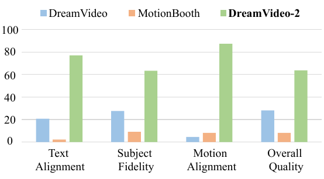

> 🔼 The chart displays the results of a human evaluation comparing DreamVideo, MotionBooth, and DreamVideo-2 across four aspects: Text Alignment, Subject Fidelity, Motion Alignment, and Overall Quality.
> 

> 
read the caption

> Figure 7: Human evaluation on joint subject customization and motion control.
> 


<table id='1' style='font-size:14px'><tr><td></td><td>Number of Videos</td><td>Number of Object Classes</td><td>Caption</td><td>Mask of All Frames</td><td>Box of All Frames</td></tr><tr><td>WebVid-10M Bain et al. 2021</td><td>~10M</td><td>-</td><td>V</td><td>X</td><td></td></tr><tr><td>UCF-101 Soomro et al. 2012</td><td>13,320</td><td>-</td><td>メ</td><td>X</td><td></td></tr><tr><td>DAVIS Pont-Tuset et al. 201 /</td><td>50</td><td>50</td><td>X</td><td>V</td><td></td></tr><tr><td>GOT-10k Huang et al. 2019</td><td>9,695</td><td>563</td><td>X</td><td>X</td><td></td></tr><tr><td>VideoBooth Dataset Jiang et al. 2024</td><td>48,724</td><td>9</td><td>V</td><td>X</td><td>X</td></tr><tr><td>Dream Video-2 Dataset</td><td>230,160</td><td>2,538</td><td>V</td><td>V</td><td>V</td></tr></table>

> 🔼 Table 1 compares the DreamVideo-2 dataset with other related video datasets based on the number of videos, object classes, captions, frame masks, and bounding boxes.
> 

> 
read the caption

> Table 1: Comparsion of our dataset with related video datasets. Our dataset contains comprehensive annotations, and is larger and more diverse than previous video customization datasets.
> 

### More visual insights

More on figures

> 🔼 The figure illustrates the overall architecture of DreamVideo-2, detailing how subject appearance and motion are learned and controlled during training via masked reference attention and a mask-guided motion module respectively.
> 

> 
read the caption

> Figure 2: Overall framework of DreamVideo-2. During training, a random video frame is segmented to obtain the subject image with a blank background. The bounding boxes extracted from the training video are converted into binary box masks. Then, the subject image is treated as a single-frame video and processed in parallel with the video by masked reference attention that incorporates blended masks to learn the subject appearance. Meanwhile, box masks are fed into a motion module that includes a spatiotemporal encoder and a ControlNet for motion control. Both the masked reference attention and motion module are trained using a reweighted diffusion loss.
> 

> 🔼 Figure 3 shows that simple joint training of subject and motion leads to motion control dominating over subject learning, while the proposed method balances them effectively.
> 

> 
read the caption

> Figure 3: Illustration of motion control domination in DreamVideo-2. As seen in (b) and (c), motion control tends to dominate over subject learning during training, causing the degradation of subject identity. In (d), our method ensures a balance between subject and motion control.
> 

> 🔼 Figure 4 shows a qualitative comparison of DreamVideo-2 against other methods for jointly customizing video subjects and their motion trajectories.
> 

> 
read the caption

> Figure 4: Qualitative comparison of joint subject customization and motion control. DreamVideo-2 generates videos with customized subjects and precise motion trajectory control, while other methods suffer from control conflicts, especially when trained on a single image.
> 

> 🔼 Figure 1 shows example results of DreamVideo-2, demonstrating its ability to generate customized videos with specific subjects and motions.
> 

> 
read the caption

> Figure 1: Customized video generation results of Dream Video-2. Our method precisely generates customized subjects at specified positions without fine-tuning at inference time.
> 

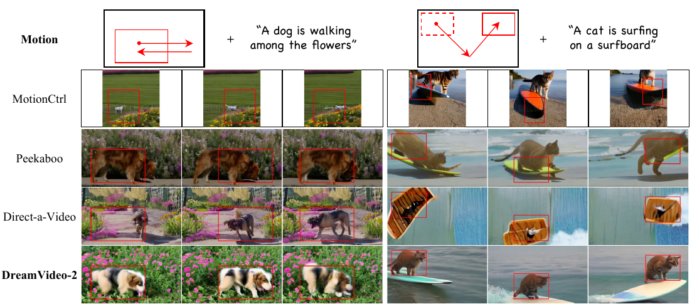

> 🔼 The figure qualitatively compares DreamVideo-2's motion control with other methods, showcasing its precision in maintaining subjects within specified bounding boxes and achieving accurate trajectory control.
> 

> 
read the caption

> Figure 6: Qualitative comparison of motion control. Our DreamVideo-2 achieves precise motion trajectory control and effectively maintains subjects within the specified bounding boxes.
> 

> 🔼 The figure shows qualitative and quantitative ablation study results on each component of DreamVideo-2 and the effect of blended mask weight on the model's performance.
> 

> 
read the caption

> Figure 8: Qualitative ablation studies on each component and blended mask weight.
> 

> 🔼 The figure shows example results of DreamVideo-2, demonstrating its ability to generate videos with customized subjects and motions at specified locations without requiring further fine-tuning.
> 

> 
read the caption

> Figure 1: Customized video generation results of Dream Video-2. Our method precisely generates customized subjects at specified positions without fine-tuning at inference time.
> 

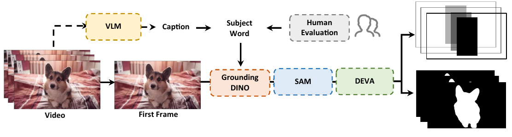

> 🔼 The figure illustrates the process of constructing the dataset, including video caption extraction, subject word identification, mask generation using Grounding DINO, SAM, and DEVA, and human evaluation.
> 

> 
read the caption

> Figure 9: Pipeline of dataset construction.
> 

> 🔼 Figure 1 shows example results of DreamVideo-2, demonstrating its ability to generate customized videos with specified subjects and motions.
> 

> 
read the caption

> Figure 1: Customized video generation results of Dream Video-2. Our method precisely generates customized subjects at specified positions without fine-tuning at inference time.
> 

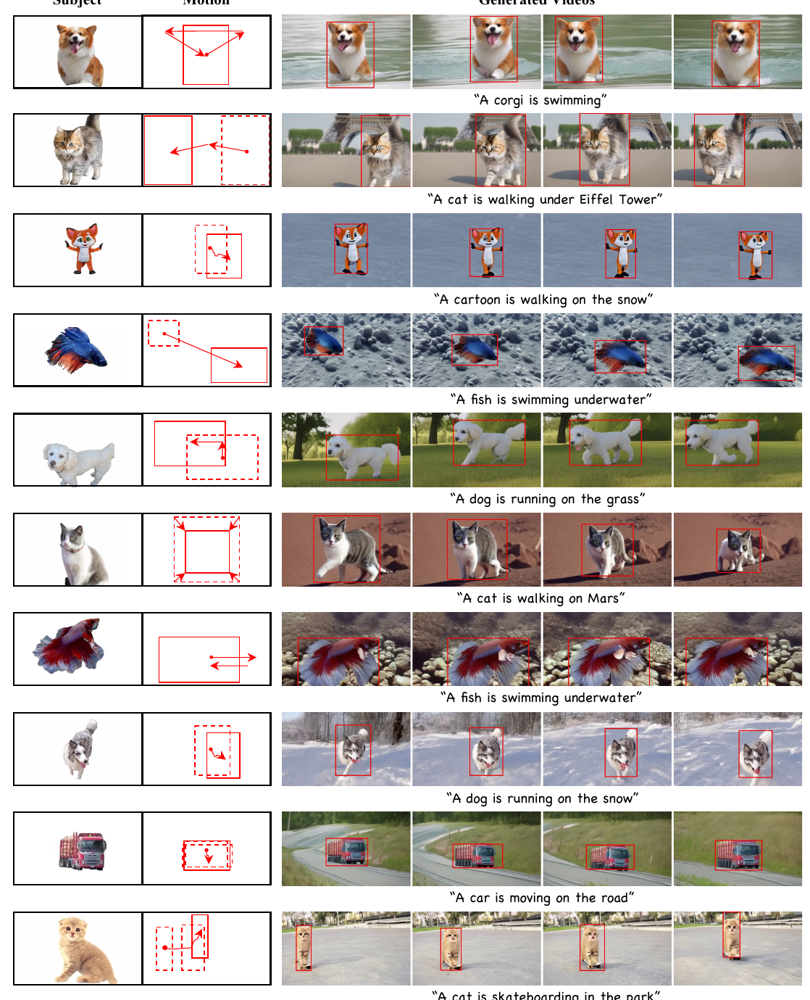

> 🔼 Figure 1 shows example results of DreamVideo-2, demonstrating its ability to generate videos with customized subjects and motion trajectories from a single image and bounding box sequence, respectively, without requiring any fine-tuning.
> 

> 
read the caption

> Figure 1: Customized video generation results of DreamVideo-2. Our method precisely generates customized subjects at specified positions without fine-tuning at inference time.
> 

More on tables


<table id='2' style='font-size:16px'><tr><td>Method</td><td>CLIP-T</td><td>R-CLIP</td><td>R-DINO</td><td>CLIP-I</td><td>DINO-I</td><td>T. Cons.</td><td>mloU</td><td>CD ↓</td></tr><tr><td>Dream Video</td><td>0.289</td><td>0.682</td><td>0.244</td><td>0.692</td><td>0.386</td><td>0.966</td><td>0.169</td><td>0.196</td></tr><tr><td>MotionBooth</td><td>0.267</td><td>0.708</td><td>0.301</td><td>0.686</td><td>0.383</td><td>0.970</td><td>0.351</td><td>0.097</td></tr><tr><td>Dream Video-2</td><td>0.303</td><td>0.751</td><td>0.392</td><td>0.694</td><td>0.411</td><td>0.968</td><td>0.670</td><td>0.048</td></tr></table>
> 🔼 {{ table.description }}
> 

> 
read the caption

> {{ table.caption }}
> 

> Table 2 quantitatively compares DreamVideo-2 with DreamVideo and MotionBooth across multiple metrics evaluating overall consistency, subject fidelity, and motion control precision in joint subject customization and motion control tasks.


 <table id='7' style='font-size:14px'><tr><td>Method</td><td>CLIP-T</td><td>CLIP-I</td><td>DINO-I</td><td>T. Cons.</td><td>DD</td></tr><tr><td>Dream Video</td><td>0.290</td><td>0.714</td><td>0.470</td><td>0.975</td><td>0.592</td></tr><tr><td>VideoBooth</td><td>0.274</td><td>0.724</td><td>0.459</td><td>0.970</td><td>0.780</td></tr><tr><td>Dream Video-2</td><td>0.297</td><td>0.721</td><td>0.472</td><td>0.972</td><td>0.952</td></tr></table>
> 🔼 {{ table.description }}
> 

> 
read the caption

> {{ table.caption }}
> 

> Table 3 quantitatively compares DreamVideo-2 against DreamVideo and VideoBooth on subject customization across various metrics like CLIP-T, CLIP-I, DINO-I, Temporal Consistency, and Dynamic Degree.


<table id='4' style='font-size:16px'><tr><td>Method</td><td>CLIP-T</td><td>T. Cons.</td><td>mloU</td><td>CD ↓</td></tr><tr><td>Peekaboo</td><td>0.318</td><td>0.968</td><td>0.322</td><td>0.117</td></tr><tr><td>Direct-a-Video</td><td>0.312</td><td>0.965</td><td>0.355</td><td>0.124</td></tr><tr><td>MotionCtrl</td><td>0.321</td><td>0.971</td><td>0.248</td><td>0.122</td></tr><tr><td>Dream Video-2</td><td>0.322</td><td>0.969</td><td>0.752</td><td>0.039</td></tr></table>
> 🔼 {{ table.description }}
> 

> 
read the caption

> {{ table.caption }}
> 

> Table 4 quantitatively compares DreamVideo-2's motion control performance against baselines using CLIP-T, Temporal Consistency, mIoU, and Centroid Distance metrics.


<table id='5' style='font-size:14px'><tr><td></td><td>CLIP-T</td><td>R-CLIP</td><td>R-DINO</td><td>CLIP-I</td><td>DINO-I</td><td>T. Cons.</td><td>mloU</td><td>CD ↓</td></tr><tr><td>Ref Attn w/o Mask (入M = 1)</td><td>0.301</td><td>0.744</td><td>0.370</td><td>0.682</td><td>0.375</td><td>0.963</td><td>0.601</td><td>0.055</td></tr><tr><td>Ref Attn w/ Binary Mask (入M = 0)</td><td>0.293</td><td>0.755</td><td>0.388</td><td>0.696</td><td>0.394</td><td>0.967</td><td>0.706</td><td>0.044</td></tr><tr><td>Ref Attn w/ Blended Mask (入M = 0.25)</td><td>0.299</td><td>0.748</td><td>0.379</td><td>0.685</td><td>0.395</td><td>0.964</td><td>0.693</td><td>0.041</td></tr><tr><td>Ref Attn w/ Blended Mask (入M = 0.5)</td><td>0.301</td><td>0.748</td><td>0.376</td><td>0.694</td><td>0.386</td><td>0.961</td><td>0.664</td><td>0.051</td></tr><tr><td>w/o Motion Encoder</td><td>0.302</td><td>0.731</td><td>0.325</td><td>0.690</td><td>0.389</td><td>0.963</td><td>0.587</td><td>0.062</td></tr><tr><td>w/o Reweighted Diffusion Loss</td><td>0.300</td><td>0.740</td><td>0.362</td><td>0.673</td><td>0.382</td><td>0.961</td><td>0.650</td><td>0.053</td></tr><tr><td>Dream Video-2 (入M = 0.75)</td><td>0.303</td><td>0.751</td><td>0.392</td><td>0.694</td><td>0.411</td><td>0.968</td><td>0.670</td><td>0.048</td></tr></table>
> 🔼 {{ table.description }}
> 

> 
read the caption

> {{ table.caption }}
> 

> Table 5 quantitatively compares the performance of DreamVideo-2 with different components (masked reference attention, motion encoder, reweighted diffusion loss) and different blended mask weights, showing the impact of each component on subject identity, motion control, and overall video quality.


 <table id='5' style='font-size:14px'><tr><td>1</td><td>0.300</td><td>0.740</td><td>0.362</td><td>0.673</td><td>0.382</td><td>0.961</td><td>0.650</td><td>0.053</td></tr><tr><td>1.5</td><td>0.302</td><td>0.745</td><td>0.370</td><td>0.687</td><td>0.385</td><td>0.965</td><td>0.676</td><td>0.050</td></tr><tr><td>2</td><td>0.303</td><td>0.751</td><td>0.392</td><td>0.694</td><td>0.411</td><td>0.968</td><td>0.670</td><td>0.048</td></tr><tr><td>4</td><td>0.298</td><td>0.750</td><td>0.389</td><td>0.693</td><td>0.399</td><td>0.964</td><td>0.647</td><td>0.056</td></tr></table>
> 🔼 {{ table.description }}
> 

> 
read the caption

> {{ table.caption }}
> 

> Table 2 quantitatively compares DreamVideo-2 with other state-of-the-art methods across multiple metrics for joint subject customization and motion control, evaluating aspects like text alignment, subject fidelity, and motion control precision.

### Full paper


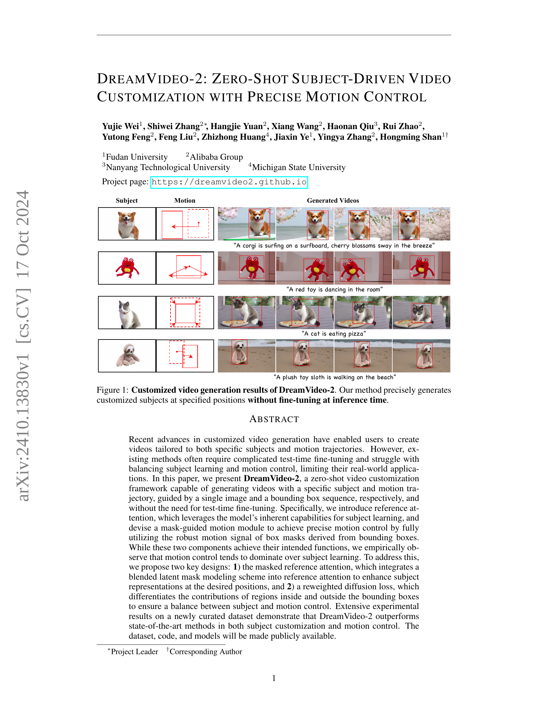

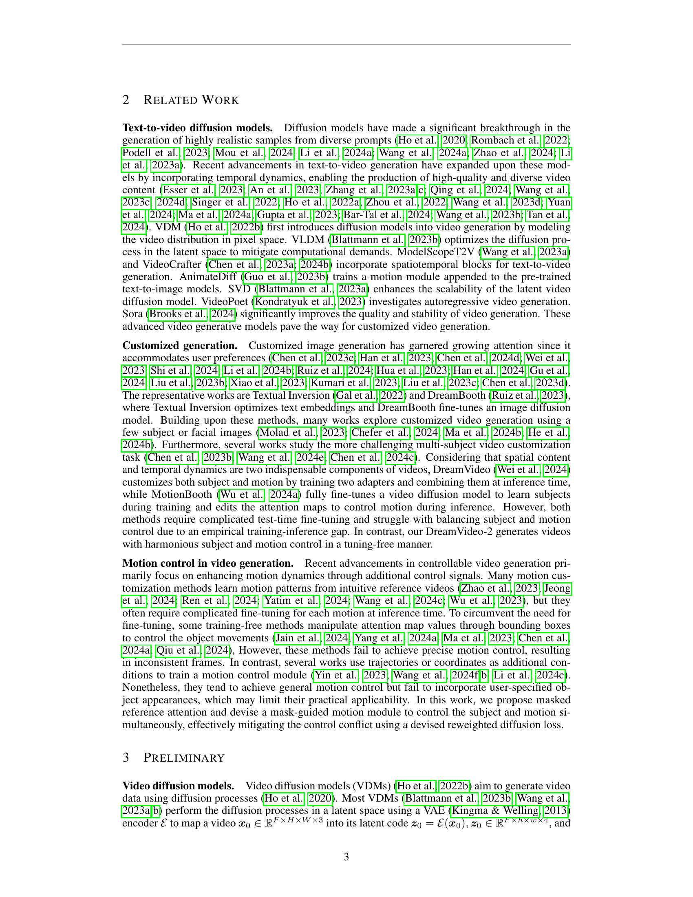

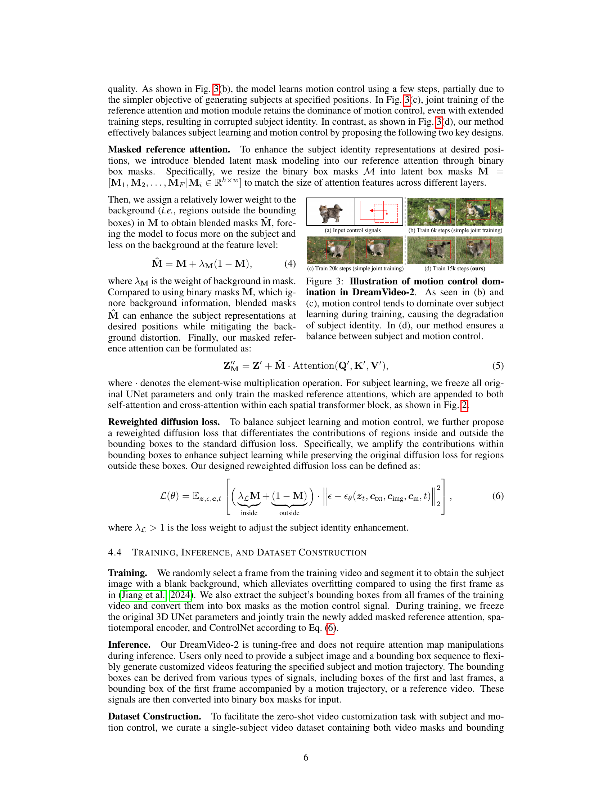
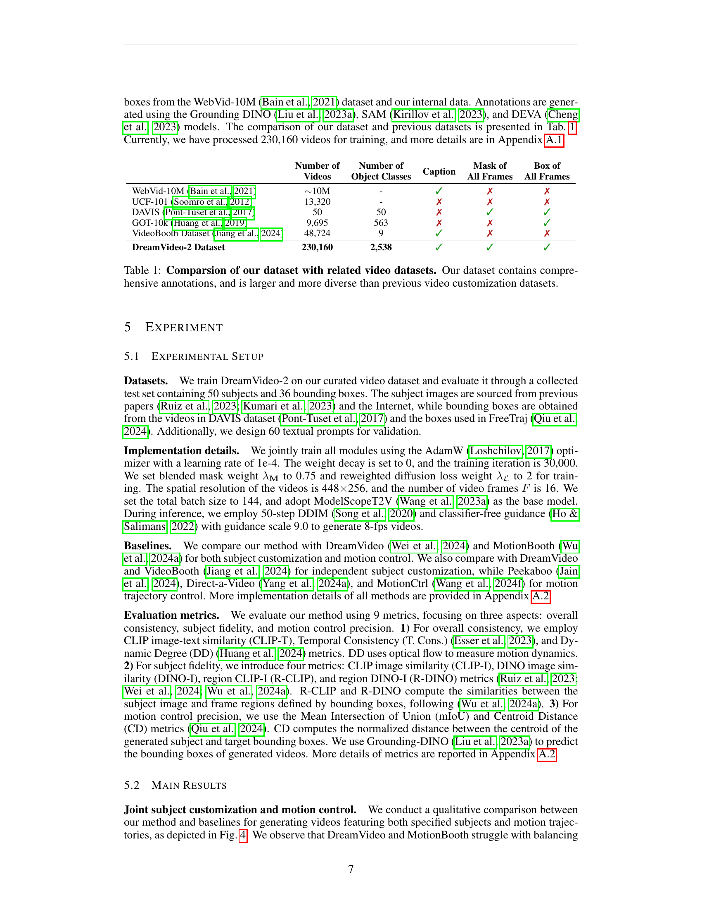

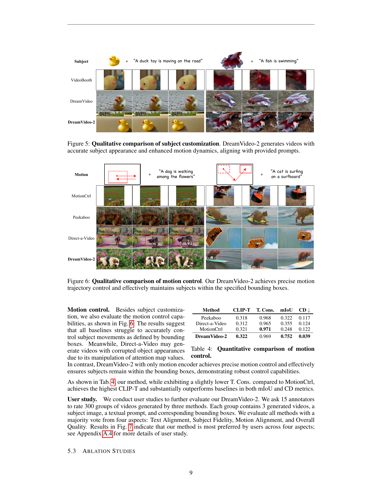

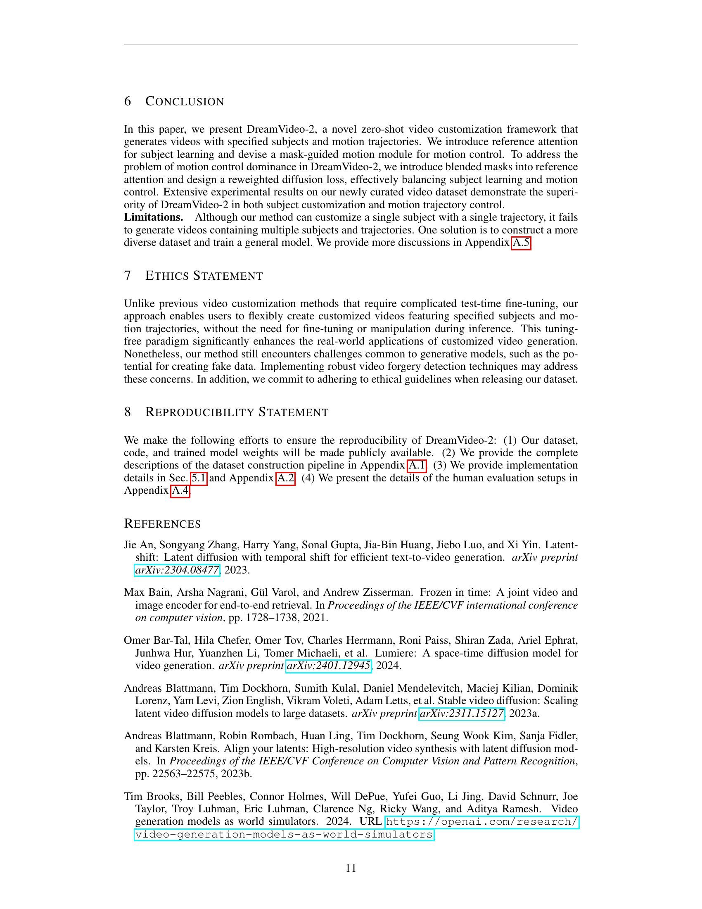
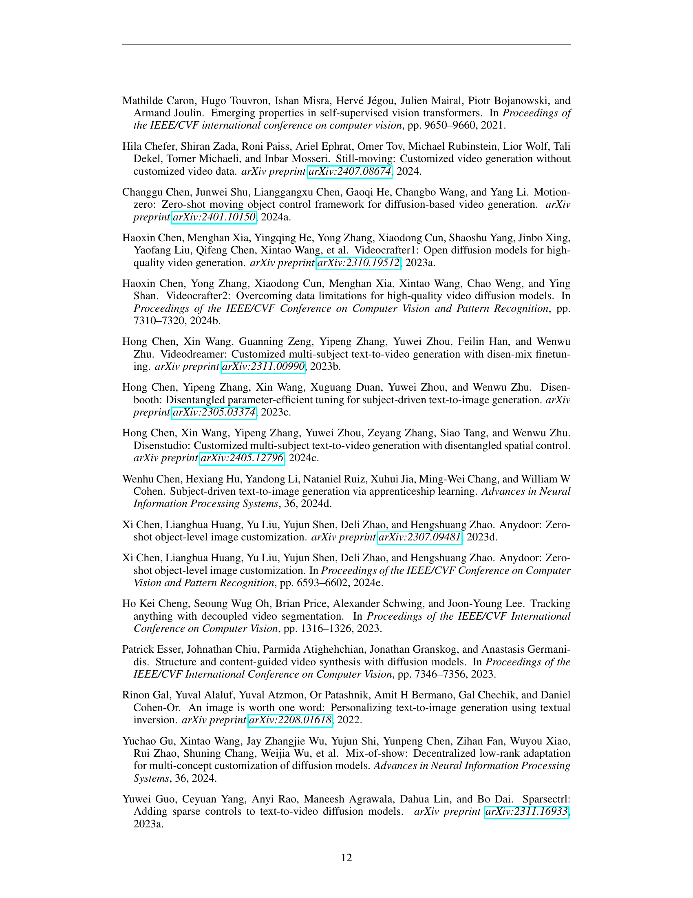
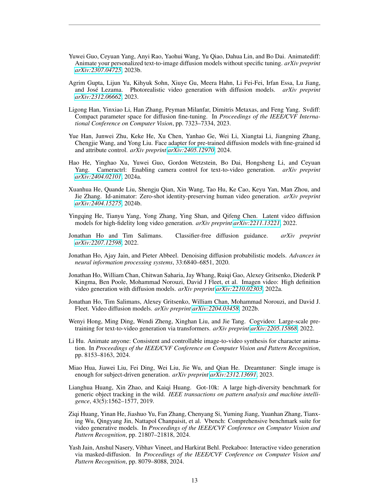

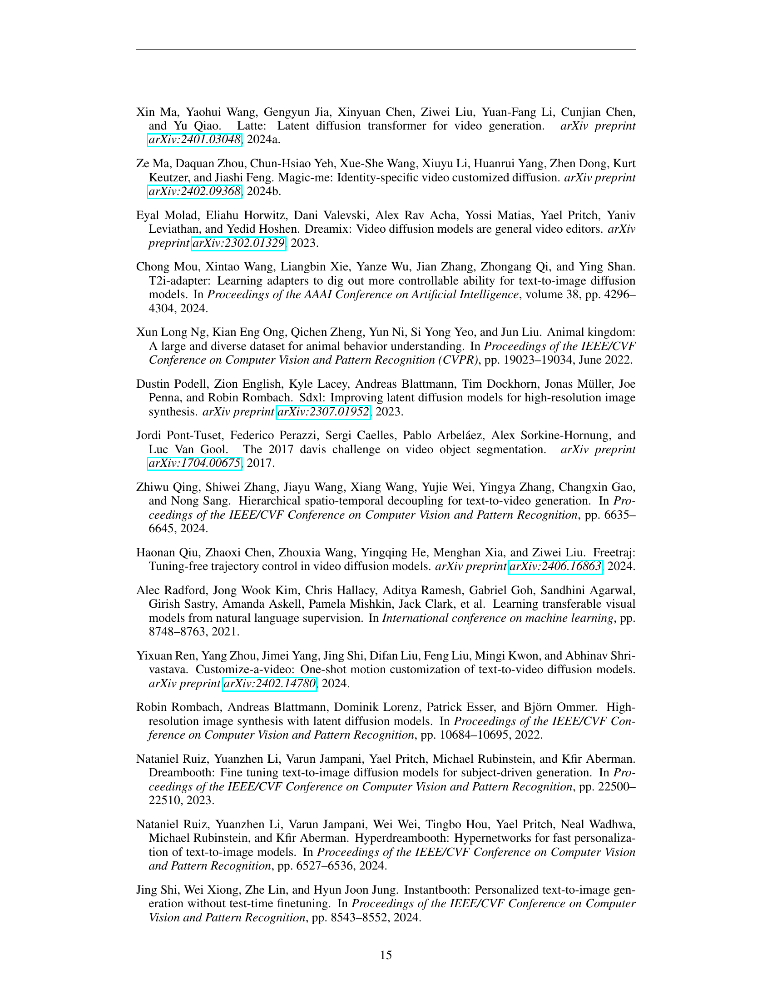
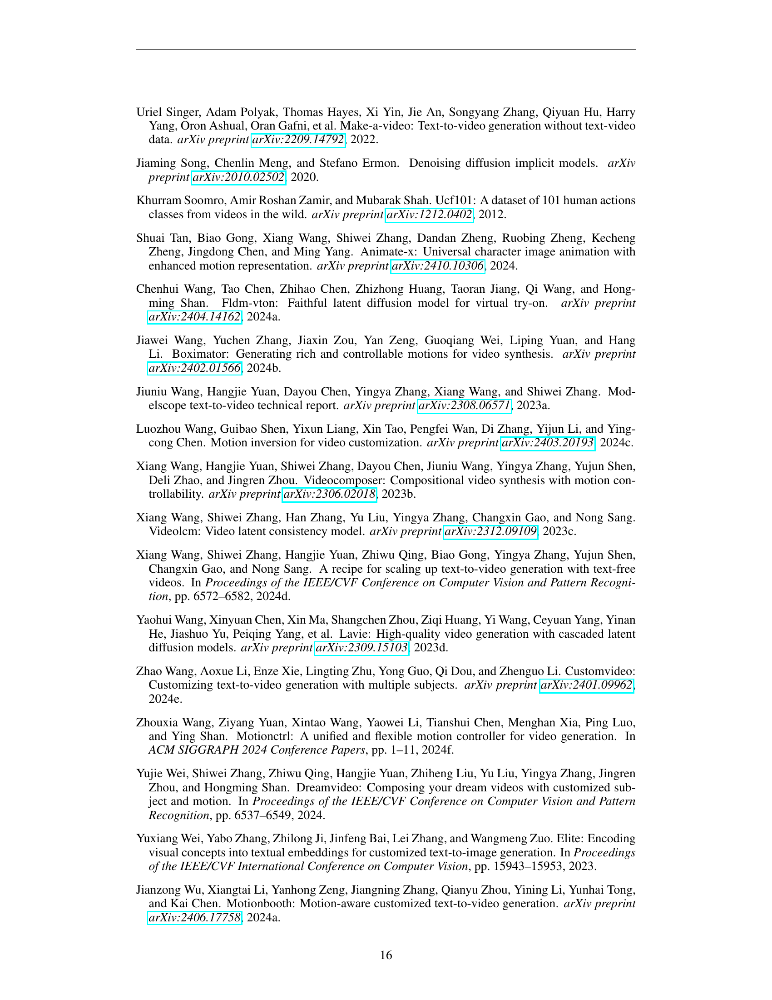

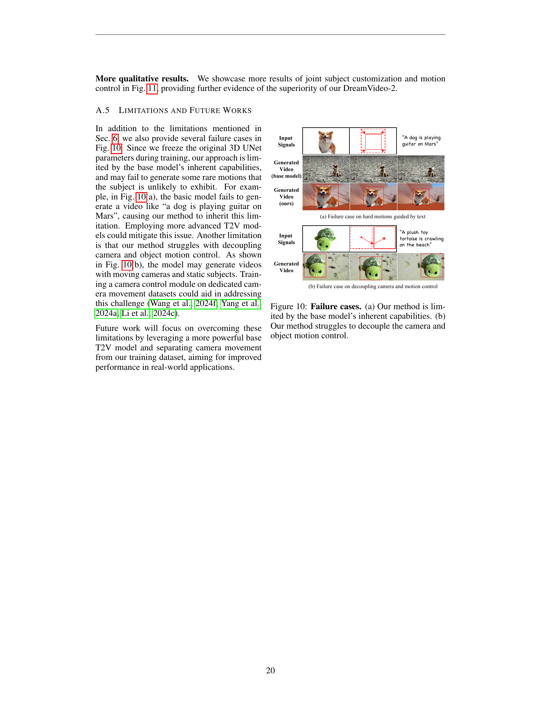
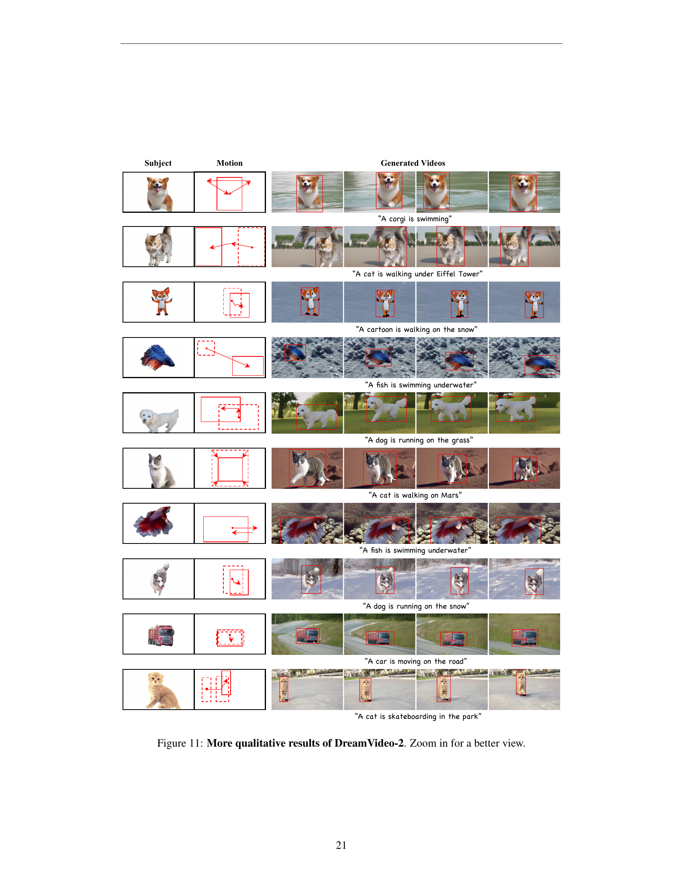
