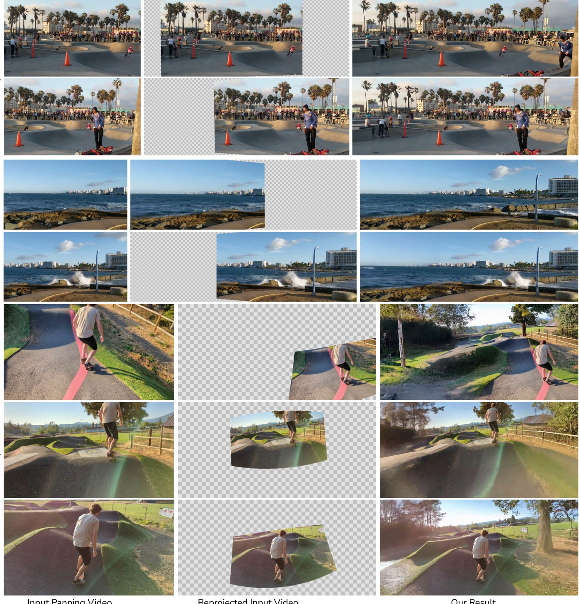
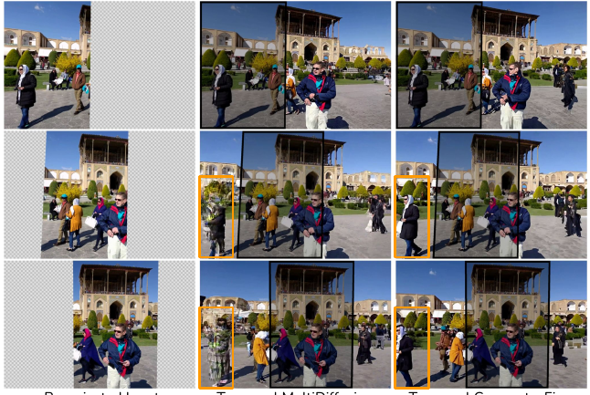
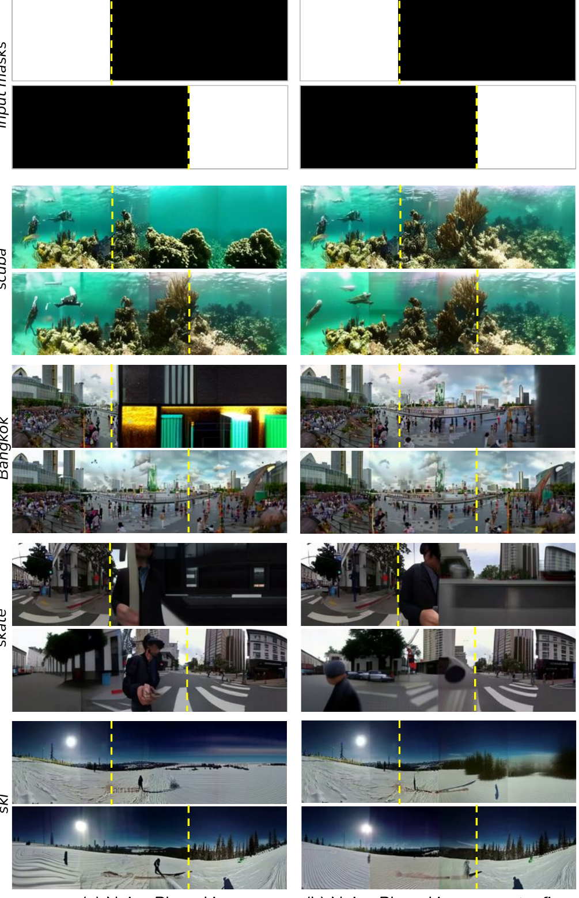
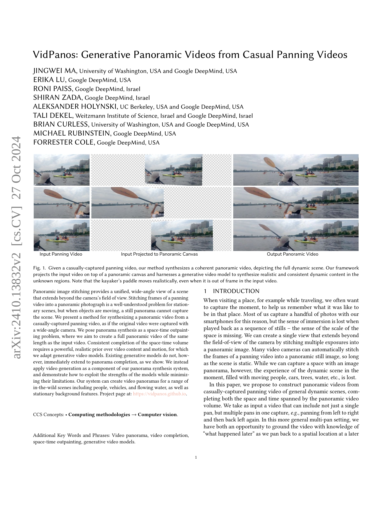
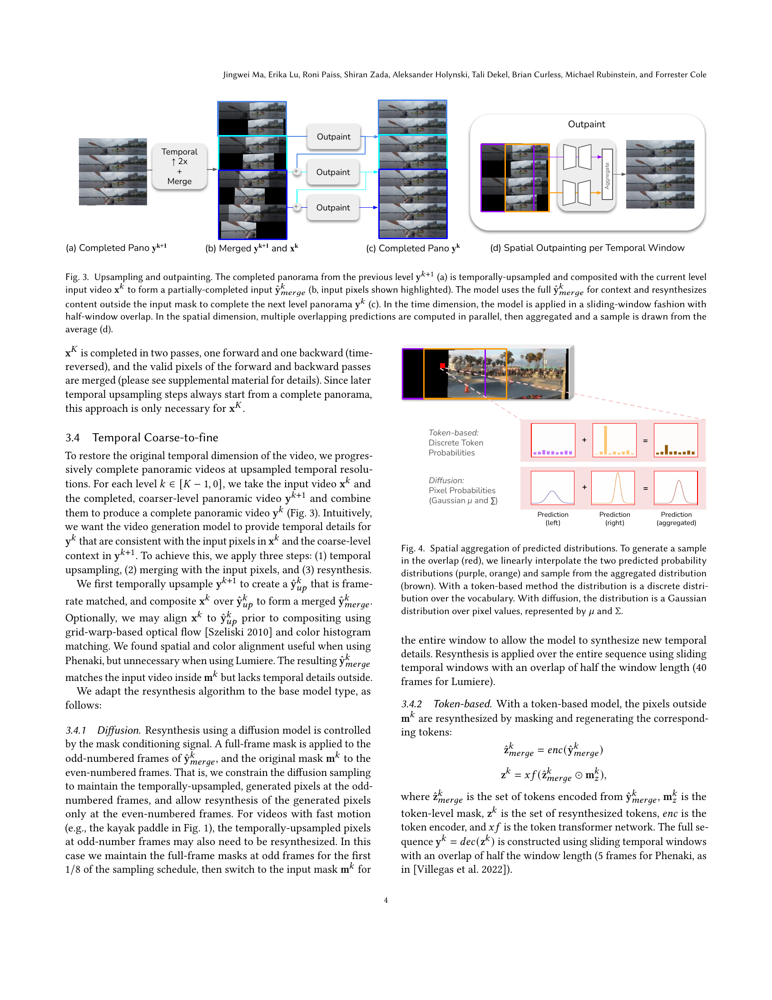
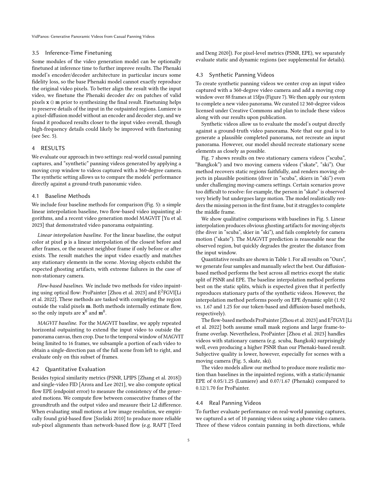
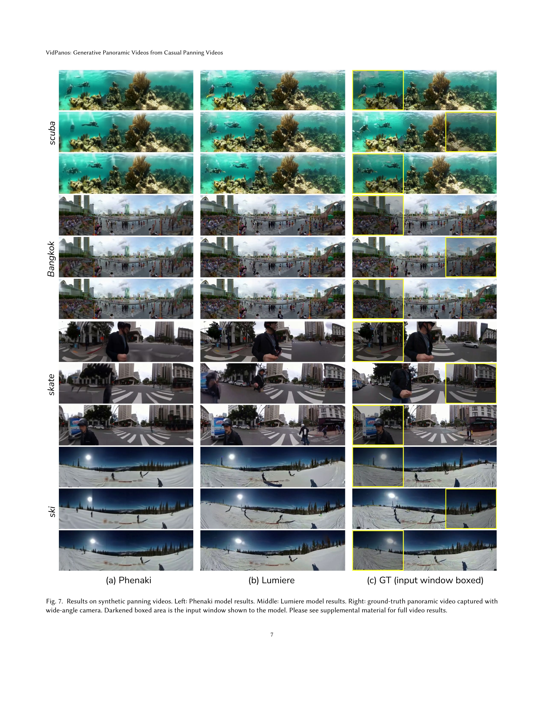
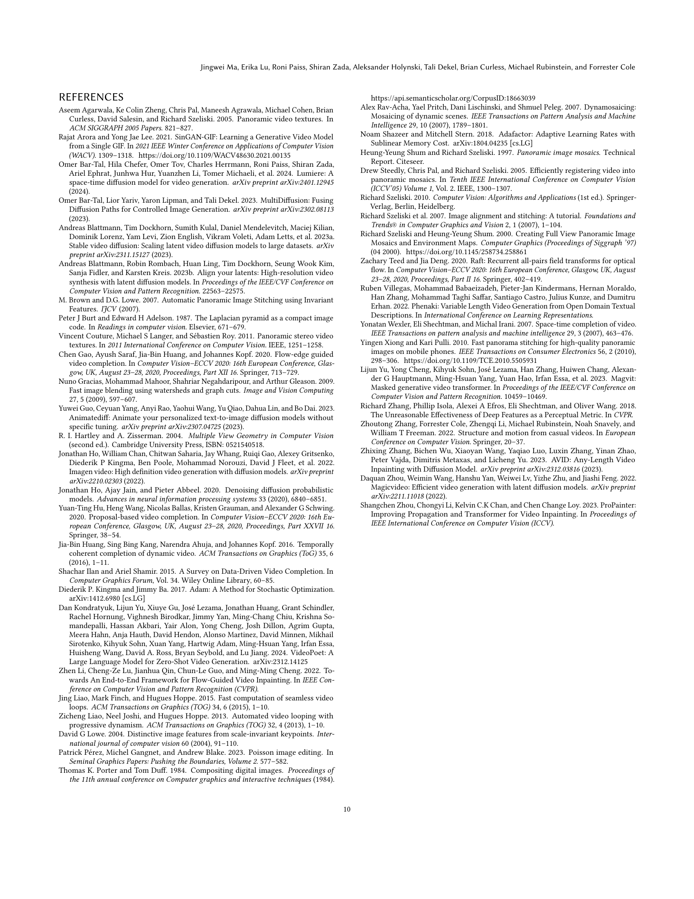
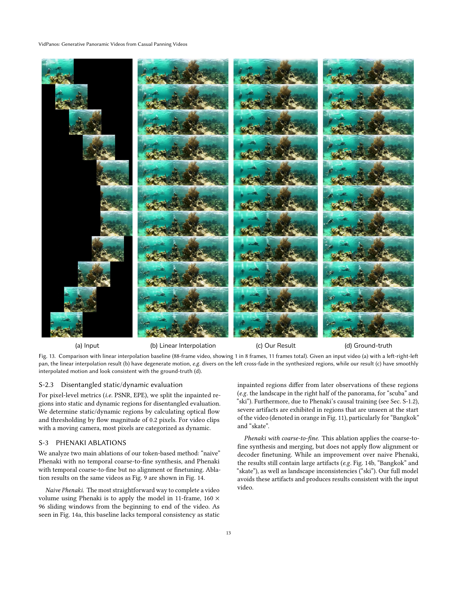
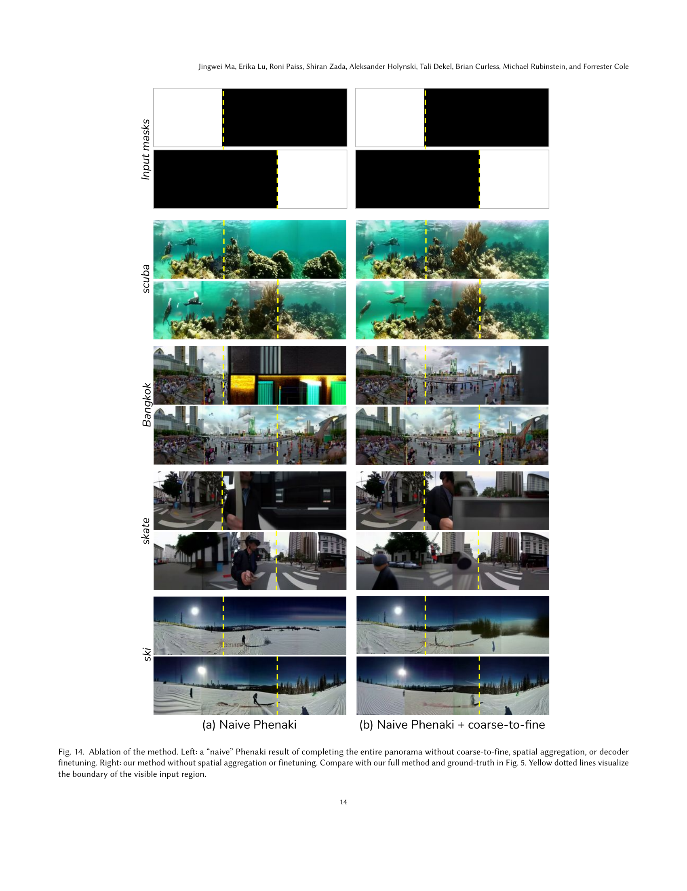

### TL;DR



VidPanos tackles the challenge of creating immersive panoramic videos from standard panning videos.  Existing methods struggle when objects move, as they are based on still image stitching techniques. VidPanos overcomes this limitation by employing advanced generative video models that 'imagine' the unseen portions of a scene to complete the full panorama.  The paper adapts these models, which usually work on limited context, to generate consistent and realistic content over longer durations. The process involves projecting the input video onto a panoramic canvas and using a coarse-to-fine approach to refine the video content.  Evaluation on both real-world and synthetic videos demonstrates the superior performance of VidPanos over existing methods in terms of video quality and motion realism.  It makes substantial contributions by introducing a new method for video panorama synthesis that accounts for object motion, adapting sophisticated generative models for this task, and releasing a new dataset to aid future research in this area.  The created video panoramas are realistic and show significant improvements over previous video stitching and inpainting methods.




 &nbsp; read the paper on arXiv

  

 &nbsp; on Hugging Face


#### Why does it matter?
This paper is important because it introduces a novel method for generating high-quality panoramic videos from casually-captured panning videos, a significant advancement in computer vision and video processing.  It bridges the gap between still panorama stitching and limited dynamic video panoramas by leveraging powerful generative video models, addressing a real-world problem with significant implications for virtual reality, video editing, and other applications.  The techniques developed and datasets released can further advance the field, especially in handling dynamic scenes.
#### Key Takeaways


 VidPanos is the first system to generate video panoramas from casually-captured panning videos with moving objects and people, creating fully dynamic panoramic video experiences. 



 The paper introduces novel adaptations of generative video models (diffusion and token-based) to successfully solve the space-time outpainting challenge inherent in panoramic video synthesis. 



 The approach is effective across various scenes and is demonstrated on a new dataset of video panoramas (cropped from 360-degree videos), offering a valuable resource to the research community. 


------
#### Visual Insights

> 🔼 The figure shows a casually-captured panning video, its projection onto a panoramic canvas, and the resulting synthesized panoramic video.
> 

> 
read the caption

> Fig. 1. Given a casually-captured panning video, our method synthesizes a coherent panoramic video, depicting the full dynamic scene. Our framework projects the input video on top of a panoramic canvas and harnesses a generative video model to synthesize realistic and consistent dynamic content in the unknown regions. Note that the kayaker's paddle moves realistically, even when it is out of frame in the input video.
> 


<table id='4' style='font-size:18px'><tr><td rowspan="2">Method</td><td colspan="2">PSNR ↑</td><td rowspan="2">LPIPS ↓</td><td rowspan="2">VFID ↓</td><td colspan="2">EPE ↓</td></tr><tr><td>sta</td><td>dyn</td><td>sta</td><td>dyn</td></tr><tr><td>Interpolate</td><td>29.4</td><td>19.1</td><td>0.10</td><td>0.09</td><td>0.04</td><td>1.92</td></tr><tr><td>ProPainter</td><td>24.7</td><td>19.6</td><td>0.19</td><td>0.21</td><td>0.12</td><td>1.70</td></tr><tr><td>E2FGVI</td><td>18.2</td><td>16.6</td><td>0.36</td><td>0.47</td><td>0.63</td><td>2.03</td></tr><tr><td>MAGVIT*</td><td>12.9</td><td>12.4</td><td>0.41</td><td>0.57</td><td>1.17</td><td>1.92</td></tr><tr><td>naive Phenaki</td><td>18.3</td><td>16.4</td><td>0.23</td><td>0.26</td><td>0.41</td><td>1.94</td></tr><tr><td>Ours (Phenaki)</td><td>23.2</td><td>18.4</td><td>0.20</td><td>0.19</td><td>0.07</td><td>1.67</td></tr><tr><td>naive Lumiere</td><td>18.5</td><td>18.3</td><td>0.24</td><td>0.18</td><td>0.41</td><td>1.94</td></tr><tr><td>Ours (Lumiere)</td><td>28.5</td><td>20.8</td><td>0.09</td><td>0.05</td><td>0.05</td><td>1.25</td></tr></table>

> 🔼 Table 1 quantitatively evaluates the performance of different methods on synthetic panning videos, measuring PSNR, LPIPS, VFID, and EPE on both static and dynamic regions.
> 

> 
read the caption

> Table 1. Quantitative results on synthetic panning videos, computed on the inpainted regions (further split into static and dynamic regions for pixel-level metrics). MAGVIT* is evaluated on a subset of frames (Sec. 4.3).
> 

### More visual insights

More on figures

> 🔼 This figure illustrates the temporal coarse-to-fine approach used in the VidPanos system for generating panoramic videos from casually captured panning videos.
> 

> 
read the caption

> Fig. 2. Temporal coarse-to-fine. The input video (a) is projected on to a unified panoramic canvas using estimated camera parameters. The reprojected input video (b) is temporally downsampled with temporal prefiltering. A base panoramic video is synthesized at the coarsest temporal scale (top), then gradually refined by temporal upsampling, merging, and resynthesis (c). Finally, a spatial super-resolution pass is applied and the original input pixels are merged with the result to produce the output video (d).
> 

> 🔼 The figure illustrates the temporal coarse-to-fine method used to synthesize a complete panoramic video from a casually-captured panning video.
> 

> 
read the caption

> Fig. 2. Temporal coarse-to-fine. The input video (a) is projected on to a unified panoramic canvas using estimated camera parameters. The reprojected input video (b) is temporally downsampled with temporal prefiltering. A base panoramic video is synthesized at the coarsest temporal scale (top), then gradually refined by temporal upsampling, merging, and resynthesis (c). Finally, a spatial super-resolution pass is applied and the original input pixels are merged with the result to produce the output video (d).
> 

> 🔼 The figure illustrates how spatial aggregation is performed for both token-based and diffusion-based video generation models by averaging overlapping window predictions.
> 

> 
read the caption

> Fig. 4. Spatial aggregation of predicted distributions. To generate a sample in the overlap (red), we linearly interpolate the two predicted probability distributions (purple, orange) and sample from the aggregated distribution (brown). With a token-based method the distribution is a discrete distribution over the vocabulary. With diffusion, the distribution is a Gaussian distribution over pixel values, represented by µ and Σ.
> 

> 🔼 Figure 5 compares the proposed method with four baseline methods on four example videos, demonstrating the superior performance of the proposed method in handling both static and dynamic content in panoramic video generation.
> 

> 
read the caption

> Fig. 5. Comparison with baseline methods. From top to bottom: linear interpolation between pixels based on time produces sharp results for stationary regions, but does not interpolate motion. ProPainter [Zhou et al. 2023] and E2FGVI [Li et al. 2022] are flow-based methods that can produce realistic results in stationary regions (scuba, Bangkok), but fail for moving cameras (skate, ski) or moving objects away from the input window (divers on left in scuba). MAGVIT [Yu et al. 2023] is a video-generation method but does not generate on a common panorama canvas, so it loses information away from the input window. Our results use a coarse-to-fine approach to build a consistent panoramic video and better match the ground-truth. Bottom: ground truth video with input window marked in yellow. See supplemental material for video results.
> 

> 🔼 Figure 6 compares the results of the proposed method with the Panoramic Video Textures method, highlighting the ability of the proposed method to handle non-stationary features.
> 

> 
read the caption

> Fig. 6. Comparison with Panoramic Video Textures [Agarwala et al. 2005]. PVT uses a graph-cut formulation to create a looping panoramic video. Our method can create similar videos, but can also include non-stationary features like the person walking behind the waterfall (boxed).
> 

> 🔼 Figure 6 compares the results of the proposed method with the Panoramic Video Textures method, highlighting the ability of the proposed method to handle non-stationary features.
> 

> 
read the caption

> Fig. 6. Comparison with Panoramic Video Textures [Agarwala et al. 2005]. PVT uses a graph-cut formulation to create a looping panoramic video. Our method can create similar videos, but can also include non-stationary features like the person walking behind the waterfall (boxed).
> 

> 🔼 Figure 7 shows the results of the proposed method on synthetic panning videos using two different video generation models, Phenaki and Lumiere, and compares them to ground truth panoramic videos.
> 

> 
read the caption

> Fig. 7. Results on synthetic panning videos. Left: Phenaki model results. Middle: Lumiere model results. Right: ground-truth panoramic video captured with wide-angle camera. Darkened boxed area is the input window shown to the model. Please see supplemental material for full video results.
> 

> 🔼 Figure 8 shows the results of applying the VidPanos method to real-world panning videos, demonstrating its ability to synthesize realistic motions and complete panoramic views.
> 

> 
read the caption

> Fig. 8. Results on real videos. Left: representative input frames. Middle: frames projected to panorama canvas. Right: our result. Our method synthesizes realistic motions for an unseen person entering the frame (top), ocean waves (middle), and for scenery around a moving camera (bottom). See supplemental material for videos.
> 

> 🔼 The figure compares the results of the naive Lumiere model and the proposed method on four example videos, showing the improvements in visual quality and consistency achieved by the proposed method.
> 

> 
read the caption

> Fig. 9. Naive Lumiere vs. Ours. Left: Lumiere without panorama mask finetuning or temporal coarse-to-fine. Right: our result. Compare with our full method and ground-truth in Fig. 5.
> 

> 🔼 Figure 10 compares the results of using temporal MultiDiffusion versus temporal coarse-to-fine methods for video generation, showing that coarse-to-fine produces more temporally consistent results.
> 

> 
read the caption

> Fig. 10. Ablation of Temporal Coarse-to-Fine. Coarse-to-Fine synthesis (right) generates more consistent results over long videos than temporal MultiDiffusion (middle). With temporal MultiDiffusion, later generations can drift from the input pixels (orange box), while coarse-to-fine generates a plausible continuation of the pedestrian. Input pixels shown darkened.
> 

> 🔼 The figure shows a casually captured panning video as input, its projection onto a panoramic canvas, and the resulting generated panoramic video output.
> 

> 
read the caption

> Fig. 1. Given a casually-captured panning video, our method synthesizes a coherent panoramic video, depicting the full dynamic scene. Our framework projects the input video on top of a panoramic canvas and harnesses a generative video model to synthesize realistic and consistent dynamic content in the unknown regions. Note that the kayaker's paddle moves realistically, even when it is out of frame in the input video.
> 

> 🔼 Figure 7 presents a comparison of panoramic video generation results using Phenaki and Lumiere models against ground truth for four synthetic panning video examples.
> 

> 
read the caption

> Fig. 7. Results on synthetic panning videos. Left: Phenaki model results. Middle: Lumiere model results. Right: ground-truth panoramic video captured with wide-angle camera. Darkened boxed area is the input window shown to the model. Please see supplemental material for full video results.
> 

> 🔼 The figure shows the input panning video, the input projected onto a panoramic canvas, and the generated panoramic video, illustrating the system's ability to synthesize realistic and coherent panoramic videos from casually captured panning videos.
> 

> 
read the caption

> Fig. 1. Given a casually-captured panning video, our method synthesizes a coherent panoramic video, depicting the full dynamic scene. Our framework projects the input video on top of a panoramic canvas and harnesses a generative video model to synthesize realistic and consistent dynamic content in the unknown regions. Note that the kayaker's paddle moves realistically, even when it is out of frame in the input video.
> 

> 🔼 Figure 7 presents a comparison of video panorama generation results from two different models (Phenaki and Lumiere) against ground truth for four example videos, showing the models' ability to generate realistic and consistent content in regions outside of the input.
> 

> 
read the caption

> Fig. 7. Results on synthetic panning videos. Left: Phenaki model results. Middle: Lumiere model results. Right: ground-truth panoramic video captured with wide-angle camera. Darkened boxed area is the input window shown to the model. Please see supplemental material for full video results.
> 

### Full paper



