### TL;DR



This paper presents a novel, unified framework for understanding how to efficiently edit the parameters of large language models after they've been initially trained.  The core idea is to analyze changes to the model through the lens of a mathematical concept called 'Riemann sum approximation'.  This approach helps categorize existing methods for parameter editing into three groups based on their final effect on the model's accuracy: improved, decreased, or the same. The researchers also propose some improvements to existing techniques, providing a more flexible and effective way to edit model parameters.  Finally, they test their ideas on various models, showing a good match between their theoretical predictions and real-world results.




 &nbsp; read the paper on arXiv

  

 &nbsp; on Hugging Face


#### Why does it matter?
This paper is crucial for researchers working on large language models (LLMs) and post-training optimization.  It provides a unified theoretical framework for understanding delta parameter editing, a critical area for improving LLM efficiency and performance. The proposed extensions to existing methods offer practical improvements, and the identification of limitations opens up new research avenues. The paper's focus on generalizability enhances its value across various LLM architectures.
#### Key Takeaways


 A novel perspective based on Riemann sum approximation is proposed to explain delta parameter editing operations, categorizing existing methods into three classes based on post-editing performance. 



 New extensions to techniques like DARE and BitDelta are introduced, enhancing their applicability and effectiveness. 



 Extensive experiments on visual and language models validate the theoretical findings, showing how different operations alter model performance. 


------
#### Visual Insights

> 🔼 The figure shows the performance of LLaMA3-8B-Instruct on three datasets (GSM8K, TruthfulQA, and HumanEval) under different drop rates (p) and adjustment factors (k).
> 

> 
read the caption

> Figure 1: The performance of LLaMA3-8B-Instruct on the GSM8K, TruthfulQA, and HumanEval datasets under varying p and k.
> 

> 🔼 The chart displays the performance of LLaMA3-8B-Instruct on three datasets (GSM8K, TruthfulQA, and HumanEval) across different drop rates (p) and adjustment factors (k).
> 

> 
read the caption

> Figure 1: The performance of LLaMA3-8B-Instruct on the GSM8K, TruthfulQA, and HumanEval datasets under varying p and k.
> 


<table id='6' style='font-size:16px'><tr><td>k</td><td>Random</td><td>Biased △W</td><td>Biased △W . VL</td></tr><tr><td>0.5</td><td>76.35</td><td>74.15</td><td>0.0</td></tr><tr><td>0.7</td><td>75.89</td><td>75.36</td><td>0.0</td></tr><tr><td>0.9</td><td>76.19</td><td>76.04</td><td>26.76</td></tr><tr><td>1.1</td><td>75.89</td><td>75.59</td><td>0.15</td></tr><tr><td>1.3</td><td>75.36</td><td>74.91</td><td>0.0</td></tr><tr><td>1.5</td><td>75.59</td><td>74.83</td><td>0.0</td></tr></table>

> 🔼 Table 1 shows the results of experiments on GSM8K dataset to verify the sufficient but not necessary condition of random drop in DARE for maintaining model performance.
> 

> 
read the caption

> Table 1: Validation of the discussion on DARE. The leftmost column shows the random drop in DARE. The middle column illustrates the approach of multiplying all negative delta parameters by k and all positive delta parameters by (1-k.p)/(1-p).P. The rightmost column demonstrates the method of first calculating the product of delta parameters and gradients, and then multiplying all negative products by k and all positive products by 1-k.p/(1-p).
> 

### More visual insights

More on figures

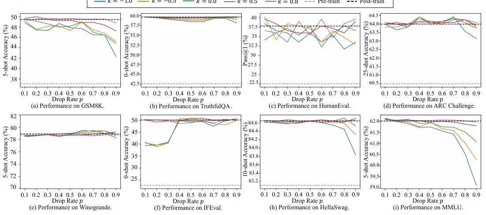

> 🔼 The figure shows the performance of LLaMA3-8B-Instruct on three datasets (GSM8K, TruthfulQA, and HumanEval) under different drop rates (p) and adjustment factors (k).
> 

> 
read the caption

> Figure 1: The performance of LLaMA3-8B-Instruct on the GSM8K, TruthfulQA, and HumanEval datasets under varying p and k.
> 

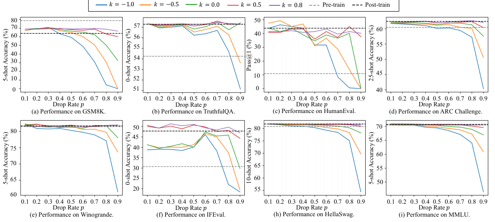

> 🔼 The figure shows the performance of LLaMA3-8B-Instruct model on three benchmark datasets (GSM8K, TruthfulQA, and HumanEval) with varying drop rate (p) and scaling factor (k).
> 

> 
read the caption

> Figure 1: The performance of LLaMA3-8B-Instruct on the GSM8K, TruthfulQA, and HumanEval datasets under varying p and k.
> 

> 🔼 The figure shows the performance of the ViT-B-32 model on three datasets (DTD, EuroSAT, and GTSRB) while varying the drop rate (p) and the rescaling factor (k) in the DARE algorithm.
> 

> 
read the caption

> Figure 2: The performance of ViT-B-32 on the DTD, EuroSAT, and GTSRB datasets under varying p and k.
> 

> 🔼 The figure shows the performance of the extended BitDelta model on eight benchmarks across different scaling factors of the average magnitude of delta parameters.
> 

> 
read the caption

> Figure 12: Validation of the extension of BitDelta on LLaMA3-8B-Instruct.
> 

More on charts

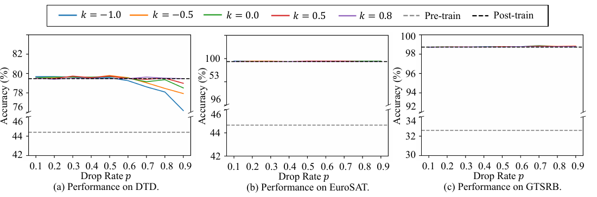

> 🔼 The chart displays the performance of ViT-B-32 on three datasets (DTD, EuroSAT, and GTSRB) across different drop rates (p) and adjustment factors (k) for delta parameter editing.
> 

> 
read the caption

> Figure 2: The performance of ViT-B-32 on the DTD, EuroSAT, and GTSRB datasets under varying p and k.
> 

, and Ties-Merge.")

> 🔼 The box plot visualizes the performance comparison of DARE, BitDelta, Twin-Merging, and TIES-Merging across different drop rates.
> 

> 
read the caption

> Figure 3: Validation of our theoretical derivation of DARE, BitDelta, Twin-Merge(sparsity rate=0.9), and Ties-Merge.
> 

> 🔼 The chart displays the effectiveness of increasing the number of bits in the BitDelta model on the GSM8K and TruthfulQA datasets, comparing performance against the original post-trained model.
> 

> 
read the caption

> Figure 4: Effectiveness of increasing the number of bits in BitDelta. The left subplot shows the performance of LLaMA3-8B-Instruct and Mistral-7B-Instruct-v0.3 on the GSM8K dataset as the number of bits increases. The right subplot shows the performance on the TruthfulQA dataset. In each subplot, we use the dashed line to represent the performance of the original post-trained model.
> 

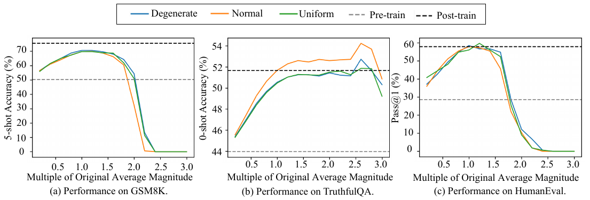

> 🔼 The chart displays the performance of the extended BitDelta model on three different datasets (GSM8K, TruthfulQA, and HumanEval) as the multiple of the original average magnitude changes.
> 

> 
read the caption

> Figure 12: Validation of the extension of BitDelta on LLaMA3-8B-Instruct.
> 

, and Ties-Merge.")

> 🔼 The box plot shows the comparison of the approximation term calculated by DARE, BitDelta, Twin-Merging, and TIES-Merging on the GSM8K dataset.
> 

> 
read the caption

> Figure 3: Validation of our theoretical derivation of DARE, BitDelta, Twin-Merge(sparsity rate=0.9), and Ties-Merge.
> 

> 🔼 The chart compares the performance difference between interpolation and extrapolation methods on various datasets for LLaMA3-8B-Instruct, showing that interpolation generally outperforms extrapolation except for the IFEval dataset.
> 

> 
read the caption

> Figure 7: Comparison of Extrapolation and Interpolation Performance.
> 

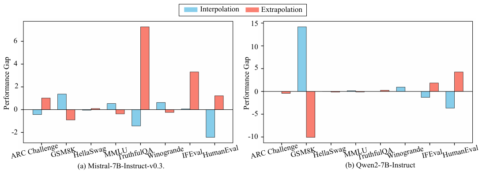

> 🔼 The chart compares the performance gap between interpolation and extrapolation methods on various tasks for two different models.
> 

> 
read the caption

> Figure 13: Comparison of Extrapolation and Interpolation Performance.
> 

### Full paper


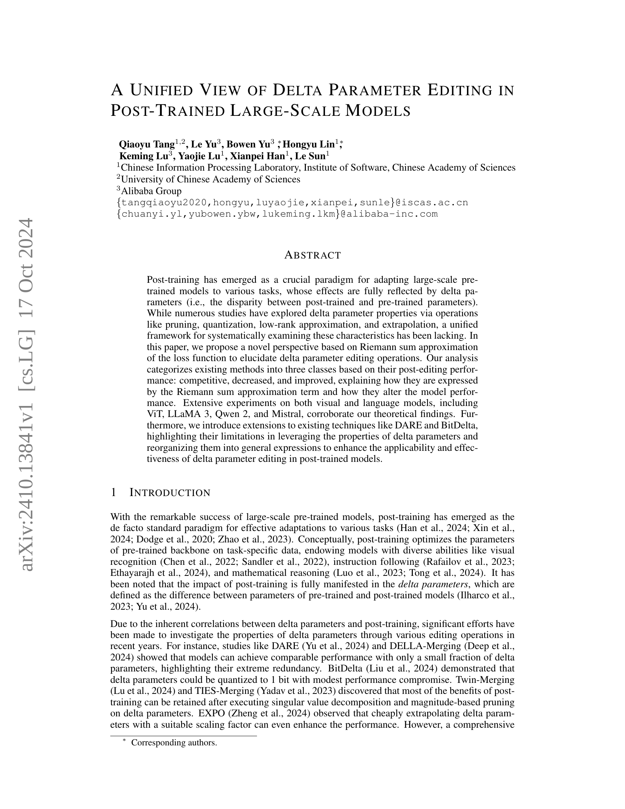
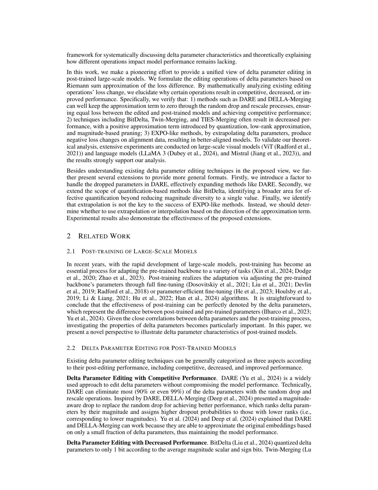
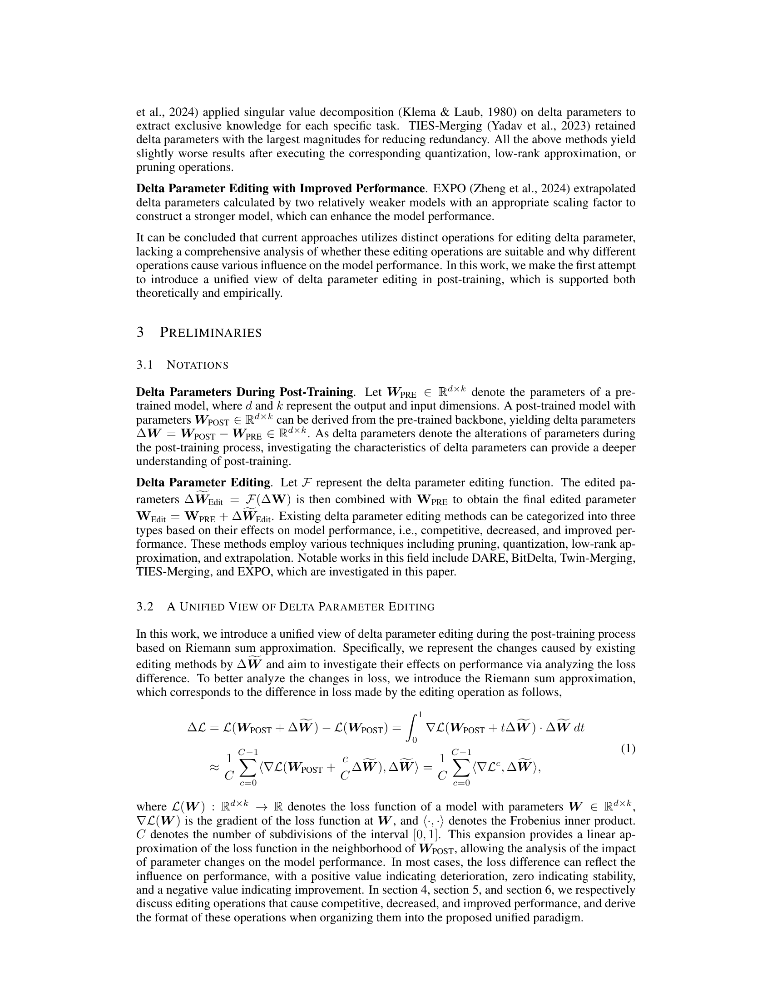
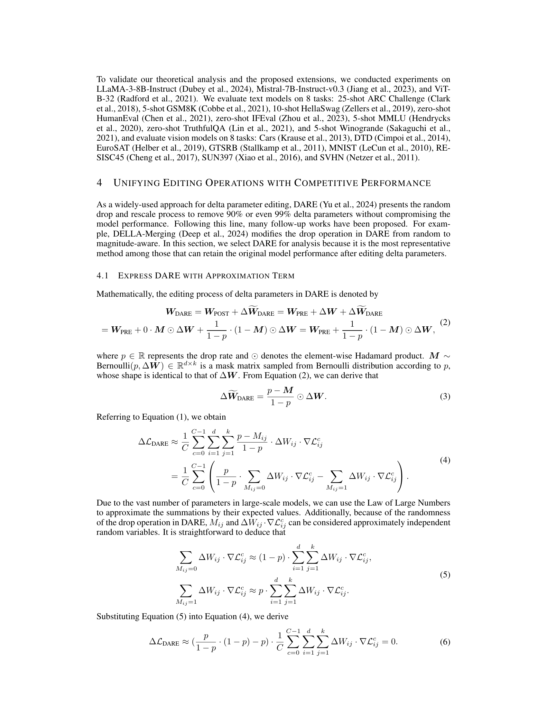
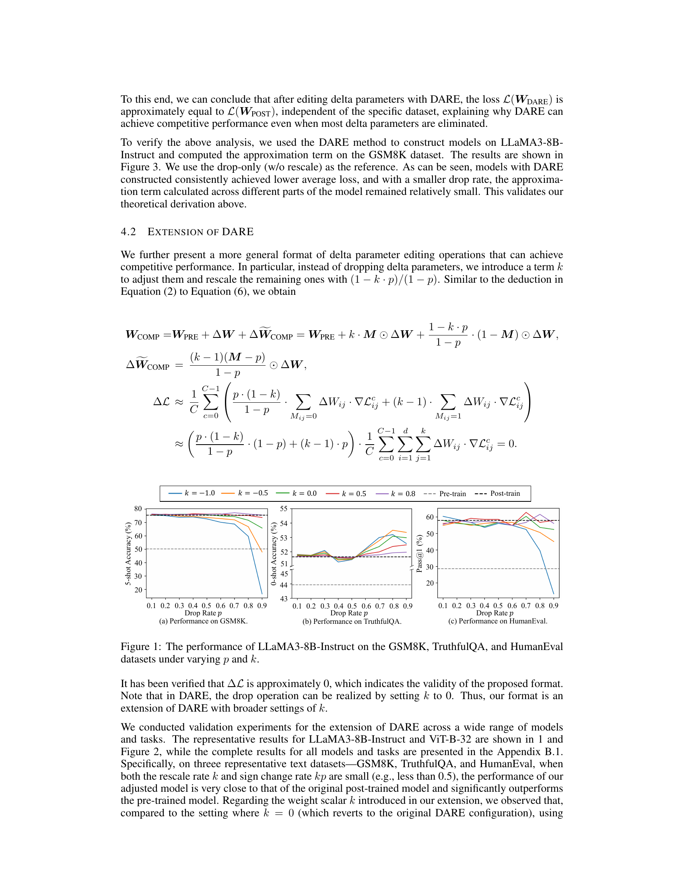

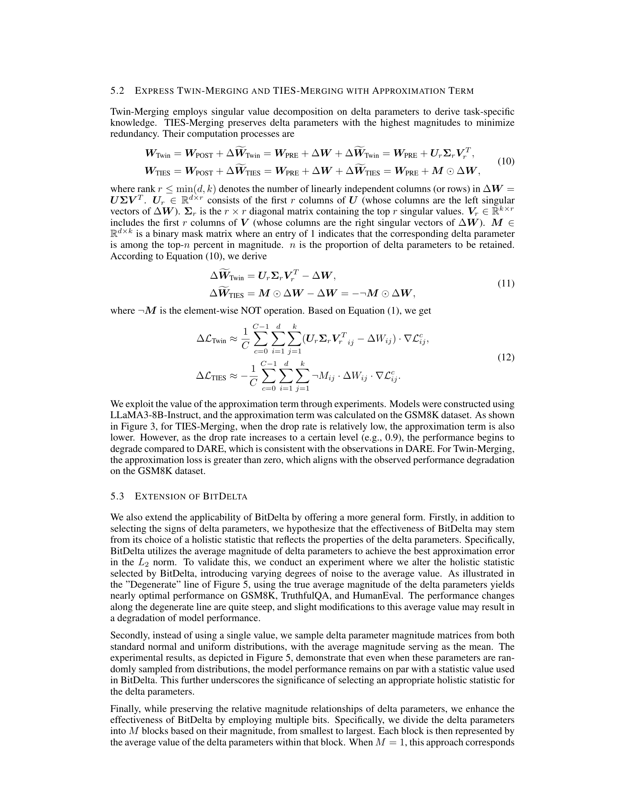

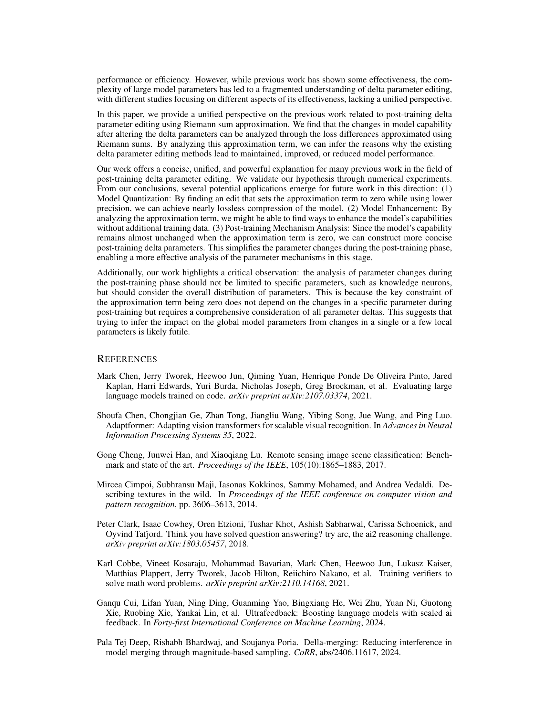

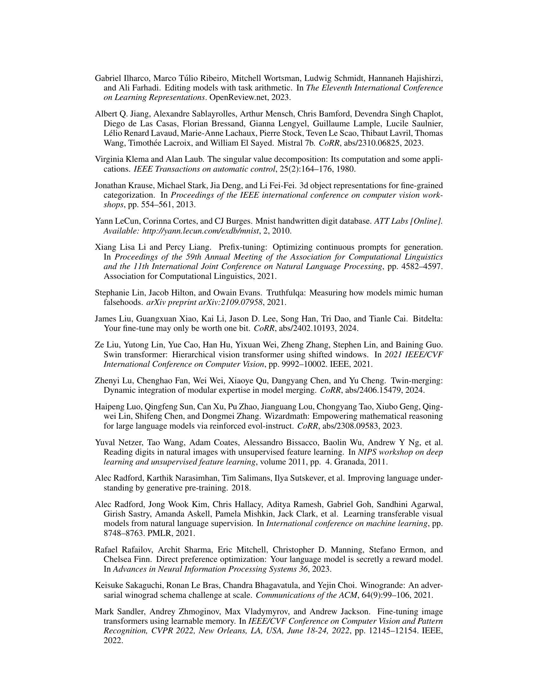

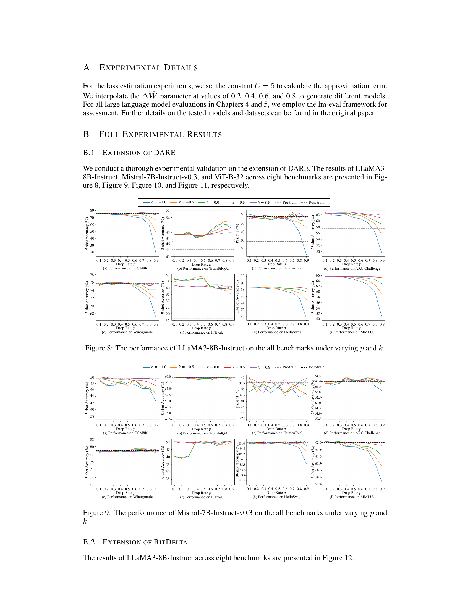
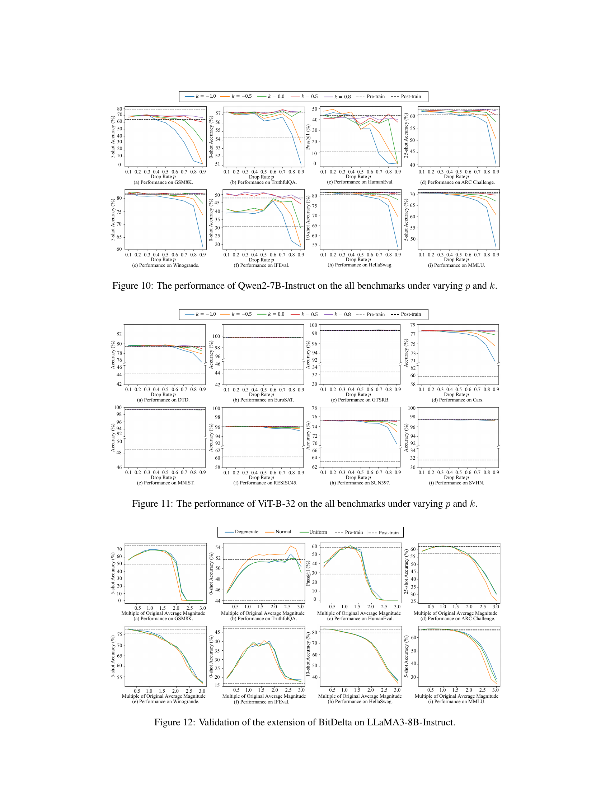
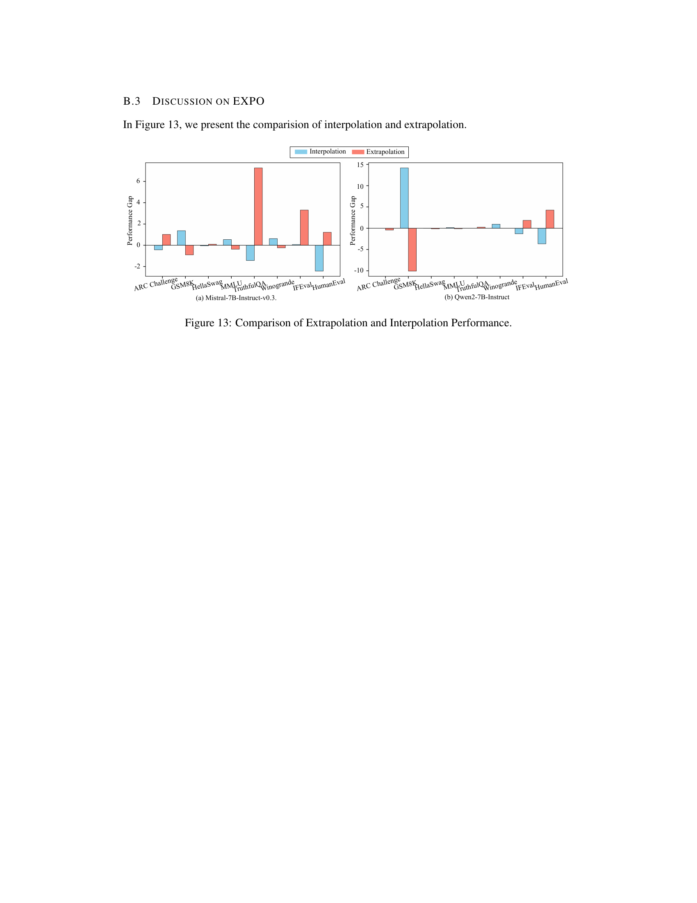
