### TL;DR



This research introduces SALAD, a new method for generating speech from text without needing any prior training data on that specific speaker (zero-shot).  Instead of using discrete units of sound like previous approaches, SALAD uses a continuous representation, which is more natural to audio. They use something called a 'per-token latent diffusion model', which generates the speech token by token but in a continuous way.  The paper compares this new method to existing discrete methods and shows that it achieves significantly better intelligibility. Importantly, SALAD maintains a high quality of speech output and effectively replicates the characteristics of the speaker's voice.  The researchers tested different variations of their method and demonstrated that their approach is competitive even when comparing against established, well-performing methods.  The research is significant for the field because it improves speech quality and suggests better ways for future systems to be developed.




 &nbsp; read the paper on arXiv

  

 &nbsp; on Hugging Face


#### Why does it matter?
This paper is important because it introduces a novel approach to speech synthesis that avoids the limitations of discrete-token methods.  It opens avenues for improved speech quality and intelligibility in zero-shot text-to-speech systems. The comparative analysis of discrete and continuous approaches provides valuable insights for future research. The innovative use of a per-token latent diffusion model for variable-length output generation is a significant contribution.
#### Key Takeaways


 SALAD, a new per-token latent diffusion model for zero-shot text-to-speech, significantly improves intelligibility compared to traditional discrete-token methods. 



 SALAD's continuous speech modeling approach achieves high speech quality and speaker similarity comparable to ground-truth audio. 



 The study offers a valuable comparative analysis of discrete and continuous speech modeling techniques, highlighting the strengths and weaknesses of each. 


------
#### Visual Insights

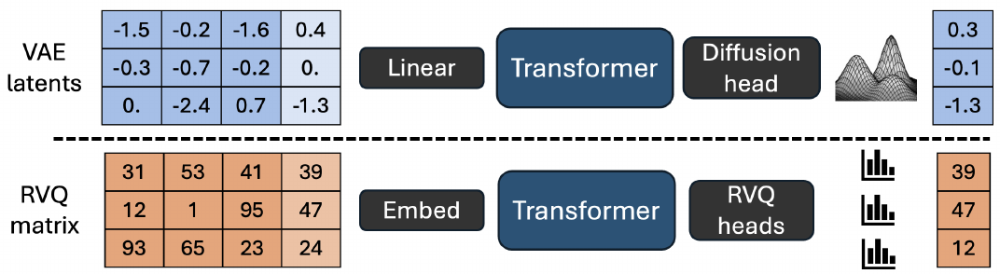

> 🔼 The figure illustrates the difference between continuous and discrete speech modeling approaches, showing how continuous latent variables are processed using a diffusion head versus discrete RVQ codes processed using RVQ prediction heads.
> 

> 
read the caption

> Figure 1: Continuous vs. discrete modeling
> 

> 🔼 The chart displays the results of subjective listening tests, comparing the MOS (Mean Opinion Score) and speaker similarity scores for various speech synthesis models, including ground truth, XTTS, and different variants of SALAD (Text-to-Acoustic and Semantic-to-Acoustic, both continuous and discrete).
> 

> 
read the caption

> Figure 5: Subjective listening results
> 


<table id='1' style='font-size:14px'><tr><td>Task</td><td>Modeling</td><td>Representation</td><td>UTMOS ↑</td><td>STT CER (%) ↓</td><td>Similarity ↑</td></tr><tr><td>Ground Truth</td><td>-</td><td>-</td><td>4.121</td><td>0.528</td><td>0.736</td></tr><tr><td>Text to Acoustic</td><td>AR</td><td>Continuous</td><td>4.280</td><td>0.739</td><td>0.539</td></tr><tr><td>Text to Acoustic</td><td>AR</td><td>Discrete</td><td>4.270</td><td>2.298</td><td>0.600</td></tr><tr><td>Semantic to Acoustic</td><td>AR</td><td>Continuous</td><td>4.27</td><td>2.198</td><td>0.588</td></tr><tr><td>Semantic to Acoustic</td><td>AR</td><td>Discrete</td><td>4.348</td><td>1.231</td><td>0.549</td></tr><tr><td>Semantic to Acoustic</td><td>NAR</td><td>Continuous</td><td>4.277</td><td>1.393</td><td>0.558</td></tr><tr><td>Semantic to Acoustic</td><td>NAR</td><td>Discrete</td><td>4.351</td><td>1.846</td><td>0.602</td></tr></table>

> 🔼 Table 1 presents the objective evaluation results of different speech synthesis models on the LibriSpeech test-clean dataset, comparing metrics such as UTMOS, STT CER, and speaker similarity.
> 

> 
read the caption

> Table 1: Objective evaluation of LibriSpeech test-clean
> 

### More visual insights

More on figures

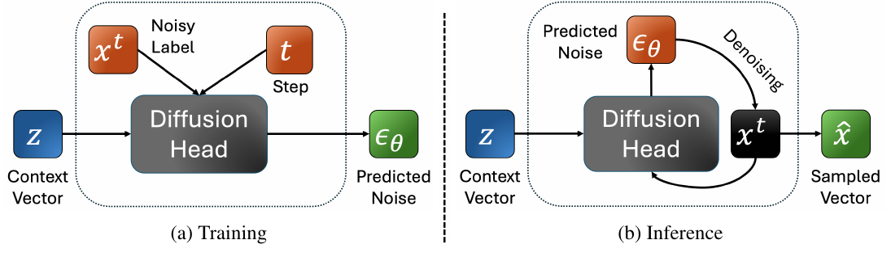

> 🔼 The figure illustrates the per-token diffusion head architecture used in the SALAD model, showing both the training and inference processes.
> 

> 
read the caption

> Figure 2: The per-token diffusion head
> 

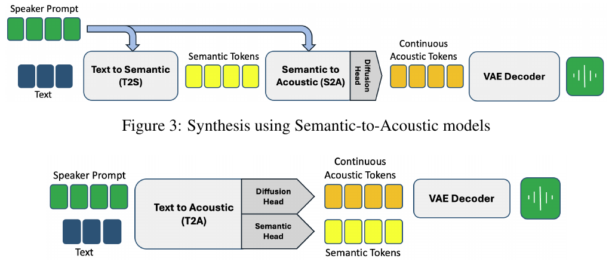

> 🔼 The figure illustrates the process of speech synthesis using semantic-to-acoustic models, showing the flow of information from text and speaker prompt to the final synthesized audio.
> 

> 
read the caption

> Figure 3: Synthesis using Semantic-to-Acoustic models
> 

More on charts

> 🔼 The chart displays the impact of various inference hyperparameters, such as CFG scale, noise scale, diffusion steps, and MaskGIT steps, on the UTMOS score and speaker similarity.
> 

> 
read the caption

> Figure 6: Inference hyperparameters influence
> 

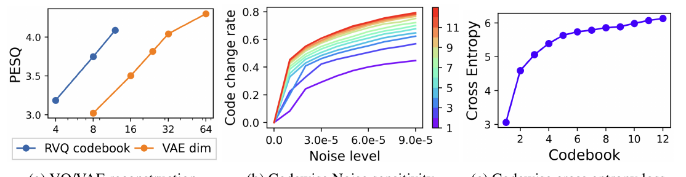

> 🔼 The chart displays the relationships between reconstruction quality, noise sensitivity, and cross entropy loss with different numbers of RVQ codebooks and VAE embedding dimensions.
> 

> 
read the caption

> Figure 7: High-fidelity RVQ codes
> 

> 🔼 The chart displays the GMM entropy drop to zero during training and the SoundStorm unmasking method performance comparison.
> 

> 
read the caption

> Figure 8: Additional results
> 

> 🔼 The chart compares three different unmasking methods in the SoundStorm model, showing that random unmasking achieves the highest UTMOS score.
> 

> 
read the caption

> Figure 8: Additional results
> 

More on tables


<table id='3' style='font-size:18px'><tr><td></td><td>UTMOS ↑</td><td>Intelligibility ↓</td><td>Similarity ↑</td></tr><tr><td>T2A HiFi Continuous d = 32</td><td>4.271</td><td>1.157</td><td>0.545</td></tr><tr><td>T2A HiFi Discrete Q = 12</td><td>4.203</td><td>5.461</td><td>0.597</td></tr></table>
> 🔼 {{ table.description }}
> 

> 
read the caption

> {{ table.caption }}
> 

> This table compares the performance of high-fidelity continuous and discrete T2A models, showing the continuous model achieves better intelligibility with comparable quality and similarity scores.


<table id='6' style='font-size:18px'><tr><td></td><td>UTMOS ↑</td><td>Intelligibility ↓</td><td>Similarity ↑</td></tr><tr><td>VAE Sample</td><td>4.280</td><td>0.739</td><td>0.539</td></tr><tr><td>VAE NoSample</td><td>3.468</td><td>1.891</td><td>0.613</td></tr></table>
> 🔼 {{ table.description }}
> 

> 
read the caption

> {{ table.caption }}
> 

> Table 1 presents the objective evaluation results of different speech synthesis models on the LibriSpeech test-clean dataset, comparing metrics such as UTMOS, STT CER, and speaker similarity.

### Full paper



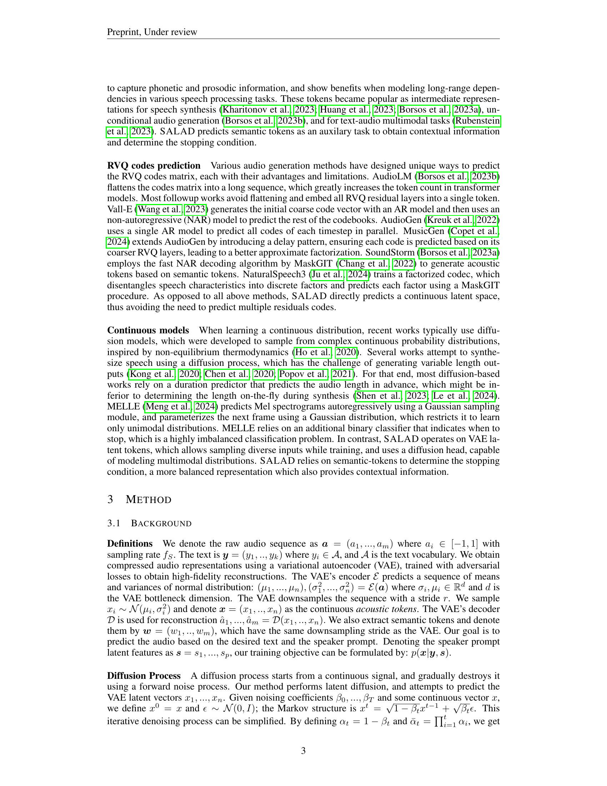
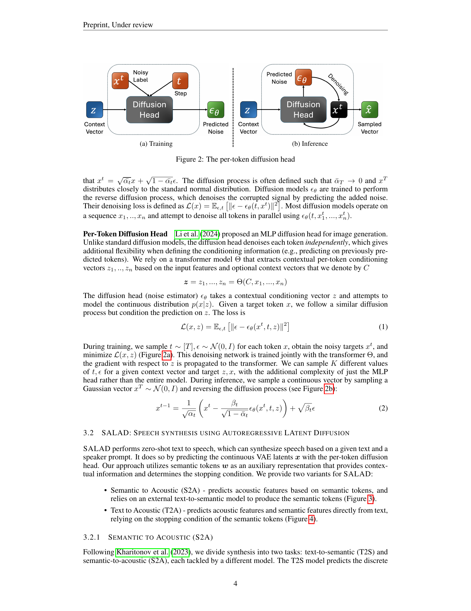
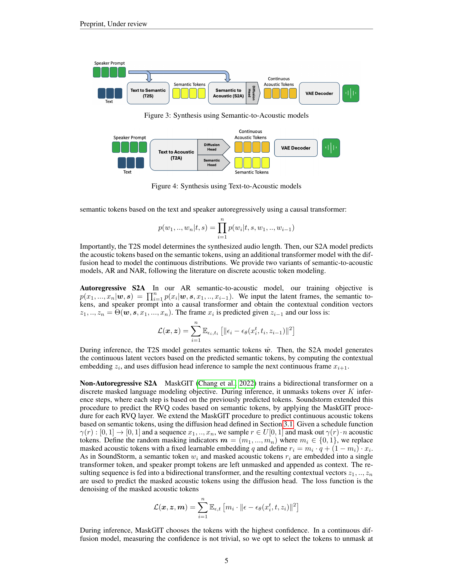
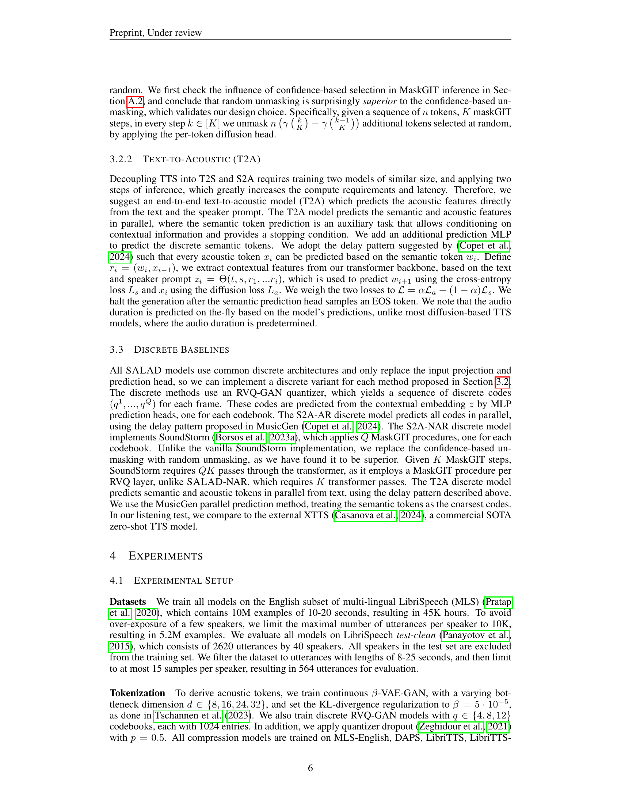
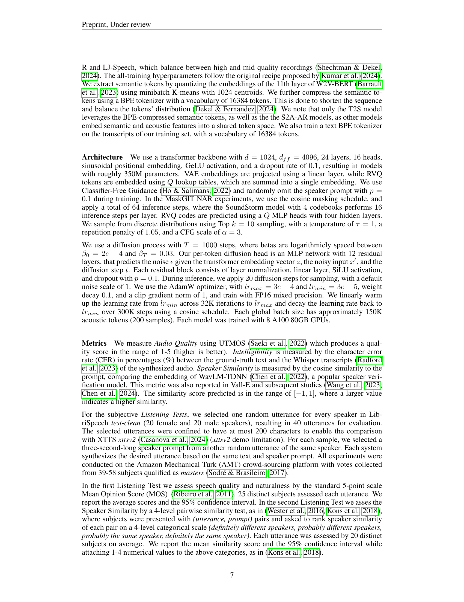

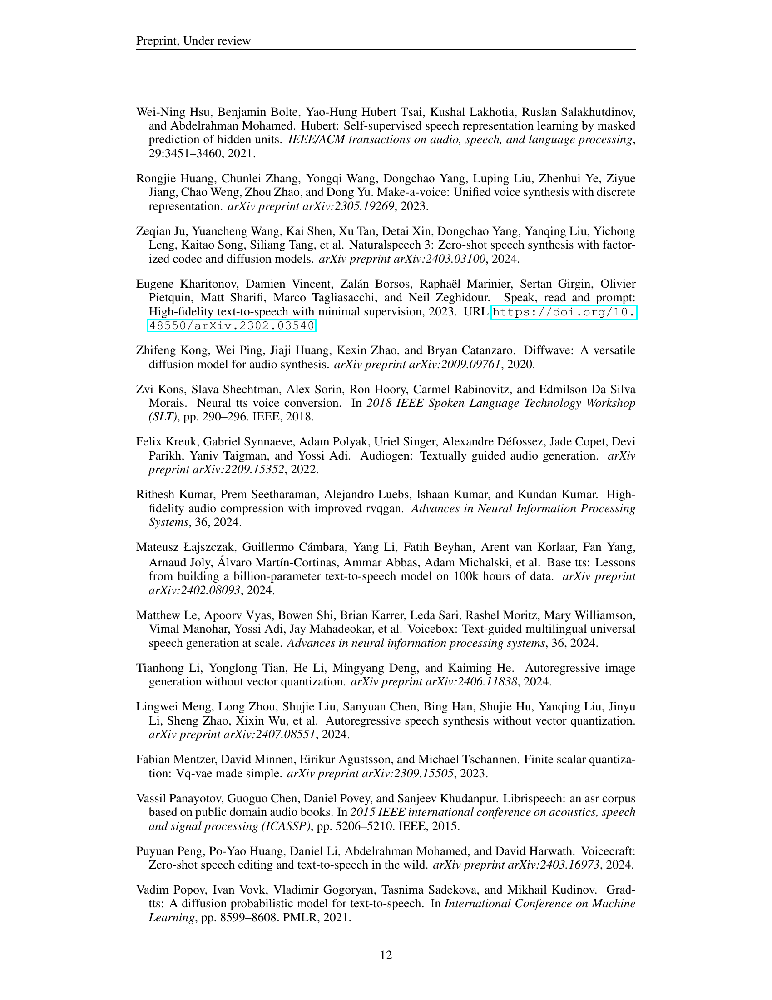
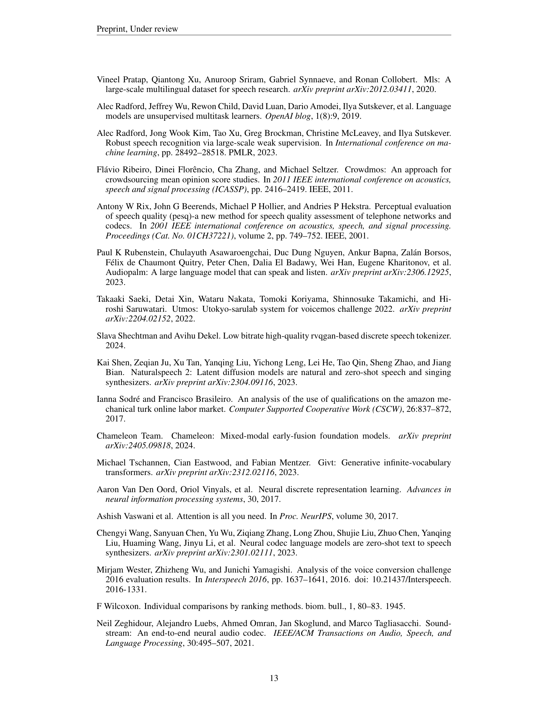
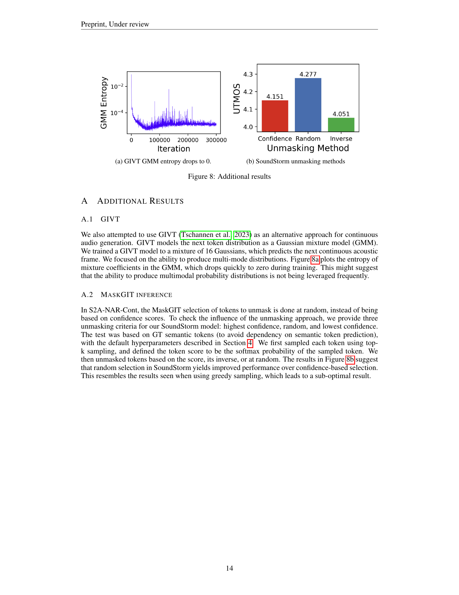
