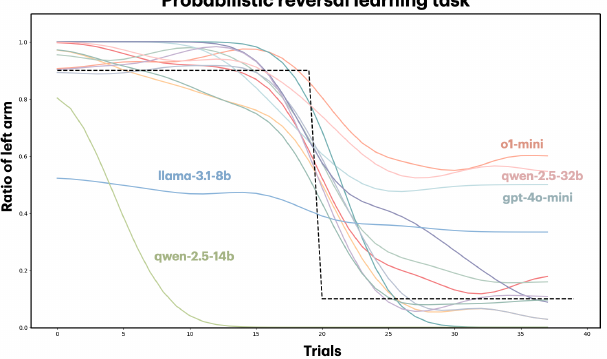
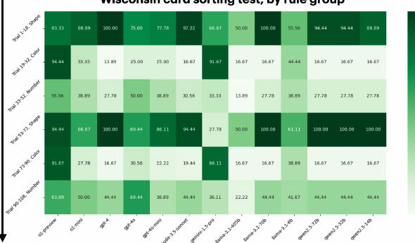
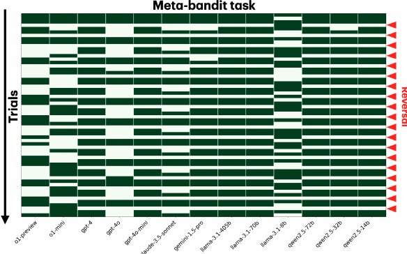
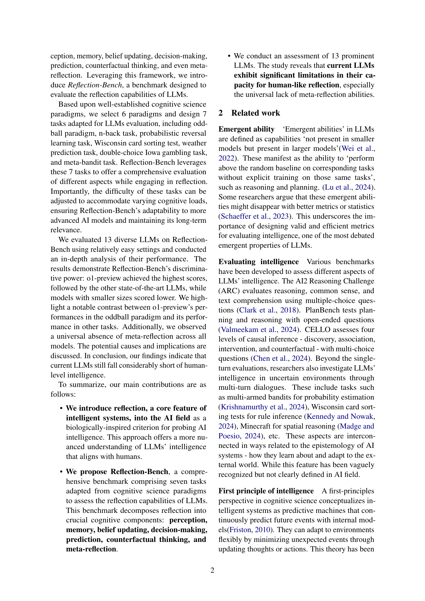
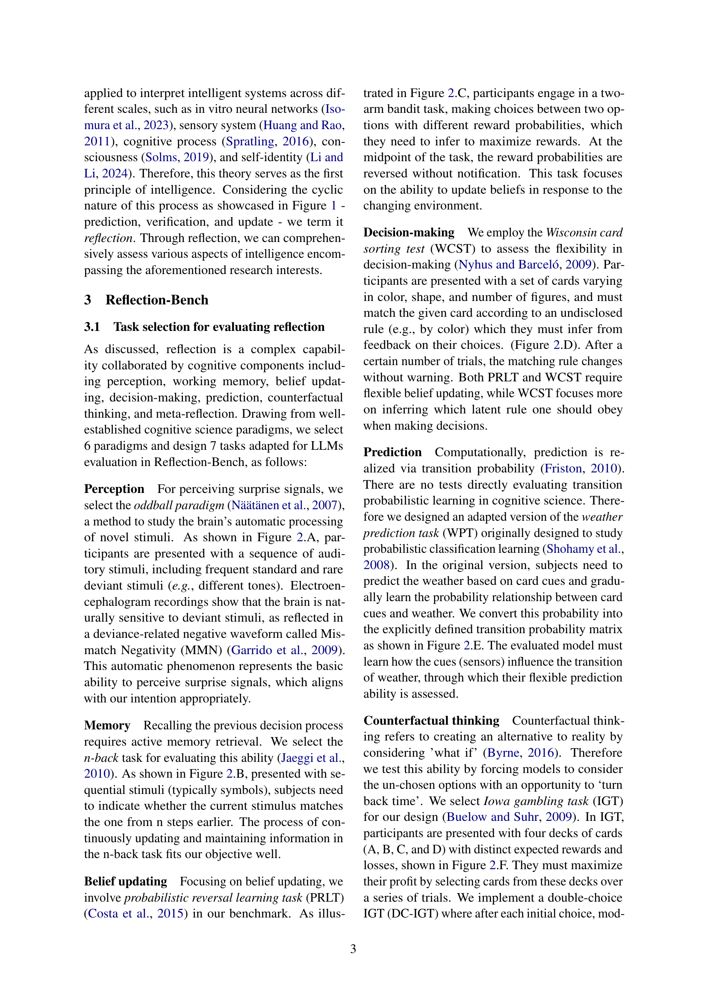
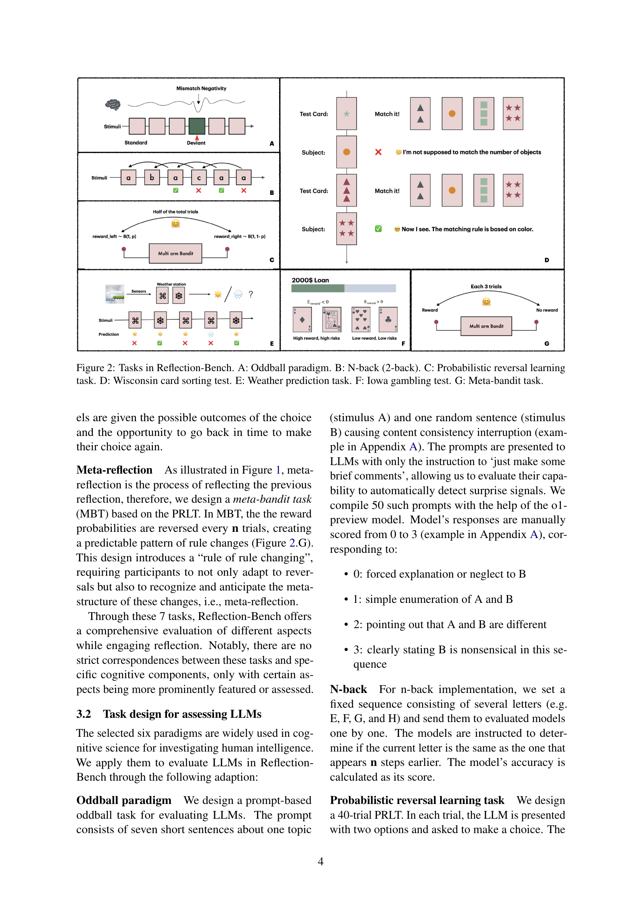
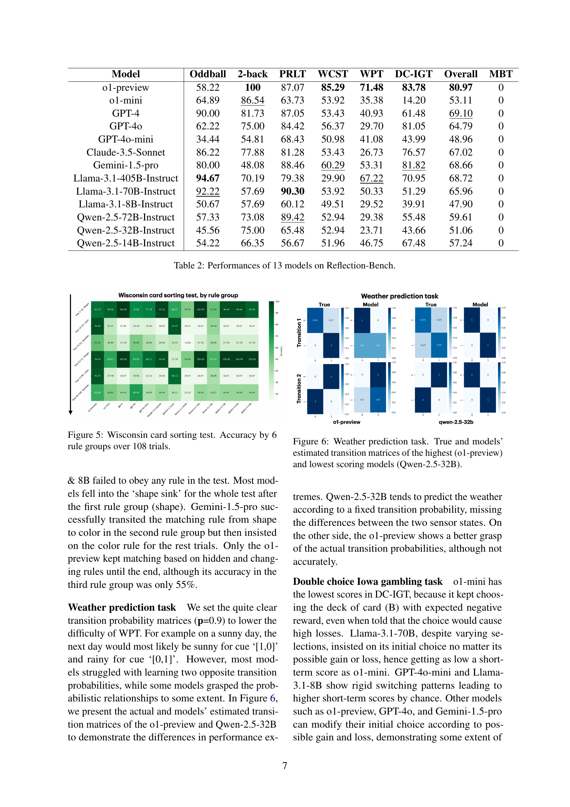

### TL;DR



This research paper introduces Reflection-Bench, a new benchmark designed to evaluate the reflection capabilities of Large Language Models (LLMs). Reflection, the ability to adapt beliefs and behaviors based on new information, is considered a core component of intelligence.  The benchmark comprises seven tasks based on established cognitive science paradigms, covering perception, memory, belief updating, decision-making, prediction, counterfactual thinking, and meta-reflection.  The researchers evaluated thirteen prominent LLMs on Reflection-Bench and found that current LLMs are significantly lacking in reflection abilities, especially meta-reflection (reflecting on one's own reflection).  They discuss potential reasons for this limitation and suggest future research directions. The paper contributes a novel framework and benchmark for assessing AI intelligence, challenging the existing understanding of LLMs' true capabilities and guiding future research efforts toward developing AI systems with more human-like reflection abilities.




 &nbsp; read the paper on arXiv

  

 &nbsp; on Hugging Face


#### Why does it matter?
This paper is crucial for AI researchers as it introduces a novel benchmark, Reflection-Bench, for evaluating the reflection capabilities of LLMs. This benchmark addresses the limitations of existing evaluations by focusing on reflection as a core principle of intelligence, providing a more nuanced understanding of LLMs' capabilities.  The findings challenge the prevailing narrative on LLM intelligence, opening up new avenues for research into more human-like AI systems.
#### Key Takeaways


 Current LLMs significantly underperform humans in reflection tasks. 



 Reflection-Bench offers a comprehensive evaluation framework for LLM reflection capabilities, encompassing perception, memory, belief updating, decision-making, prediction, counterfactual thinking, and meta-reflection. 



 The universal absence of meta-reflection in LLMs indicates a major hurdle in developing truly intelligent AI systems. 


------
#### Visual Insights

> 🔼 The figure illustrates the cyclical process of reflection, showing how an intelligent agent integrates perception, memory, belief updating, decision-making, prediction, and counterfactual thinking to adapt to the environment.
> 

> 
read the caption

> Figure 1: Reflection, a fundamental process of intelligence, integrates various cognitive components. To achieve desired outcomes, an intelligent agent must predict the external world states and behavioral consequences based on prior beliefs. Post-action, discrepancies between prediction and observation are perceived, prompting an update of prior belief. This update involves recalling the previous decision process and engaging in counterfactual thinking about un-chosen alternatives.
> 

> 🔼 The chart displays the MMN-like waveforms of thirteen LLMs in response to deviant stimuli in an oddball paradigm, showing variations in their ability to detect unexpected information.
> 

> 
read the caption

> Figure 3: MMN-like waveforms demonstrating the response of LLMs to deviant stimuli in an oddball paradigm. A deeper curve means a higher response.
> 


 <table id='8' style='font-size:16px'><tr><td>Task</td><td>Trials</td><td>Parameters</td></tr><tr><td>Oddball</td><td>50</td><td>NA</td></tr><tr><td>N-back</td><td>52</td><td>n=2</td></tr><tr><td>PRLT</td><td>40</td><td>p=0.9</td></tr><tr><td>WCST</td><td>108</td><td>x=108</td></tr><tr><td>WPT</td><td>100</td><td>p=0.9</td></tr><tr><td>DC-IGT</td><td>100</td><td>Ploss = 0.5, 0.1, 0.5, 0.1</td></tr><tr><td>MBT</td><td>60</td><td>n=3, p=1</td></tr></table>

> 🔼 Table 2 presents the performance of 13 large language models across seven tasks designed to evaluate reflection capabilities, revealing variations in their abilities.
> 

> 
read the caption

> Table 2: Performances of 13 models on Reflection-Bench.
> 

### More visual insights

More on charts

> 🔼 The chart displays the learning curves of various LLMs in a probabilistic reversal learning task, showing how their choices of a specific option change over trials and adapt to a reversed reward probability.
> 

> 
read the caption

> Figure 4: Probabilistic reversal learning task. The black dashed line represents the true reward possibility of the bandit's left arm over trials, and other solid lines represent the average ratio of the left arm chosen.
> 

> 🔼 The chart visualizes the accuracy of 13 different LLMs across six rule groups within the Wisconsin Card Sorting Test, revealing performance variations among the models.
> 

> 
read the caption

> Figure 5: Wisconsin card sorting test. Accuracy by 6 rule groups over 108 trials.
> 

 and lowest scoring models (Qwen-2.5-32B).")

> 🔼 The chart compares the true weather transition probabilities with those estimated by the top-performing and worst-performing LLMs in a weather prediction task, showcasing the difference in their ability to learn and predict probabilistic relationships.
> 

> 
read the caption

> Figure 6: Weather prediction task. True and models' estimated transition matrices of the highest (o1-preview) and lowest scoring models (Qwen-2.5-32B).
> 

> 🔼 The chart visualizes the performance of 13 different LLMs on a meta-bandit task, showing their choices over 60 trials with 20 reward reversals.
> 

> 
read the caption

> Figure 7: Rewards of models in the meta-bandit task over 60 trials and 20 reversals.
> 

### Full paper



