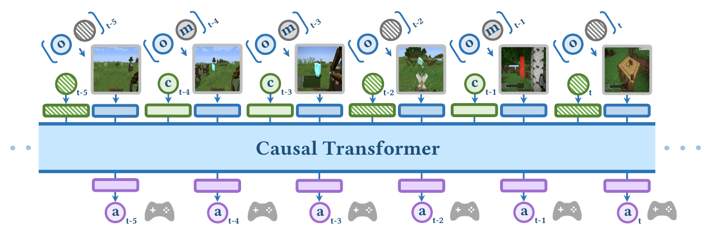
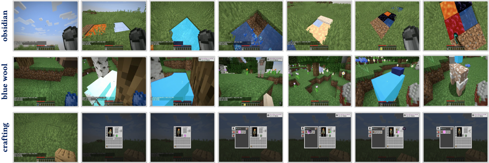
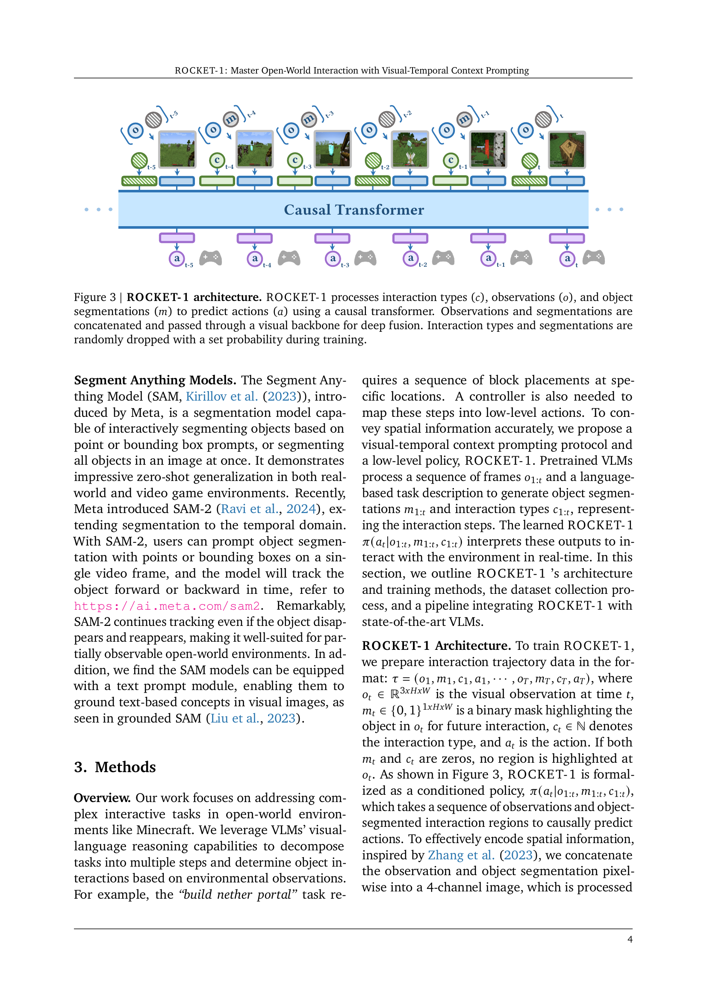
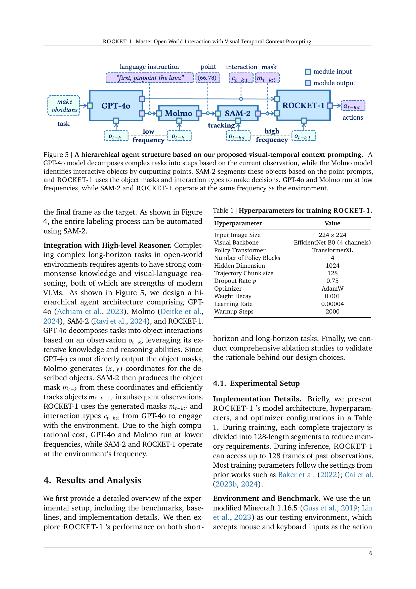
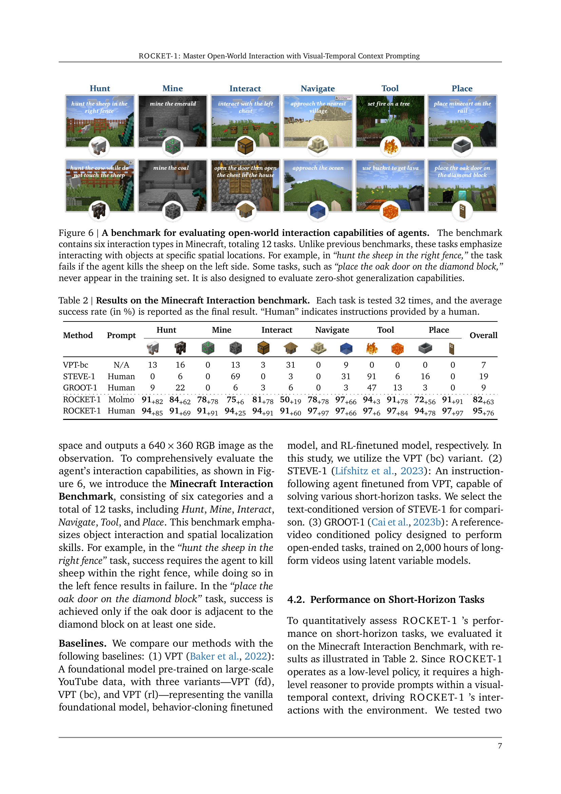
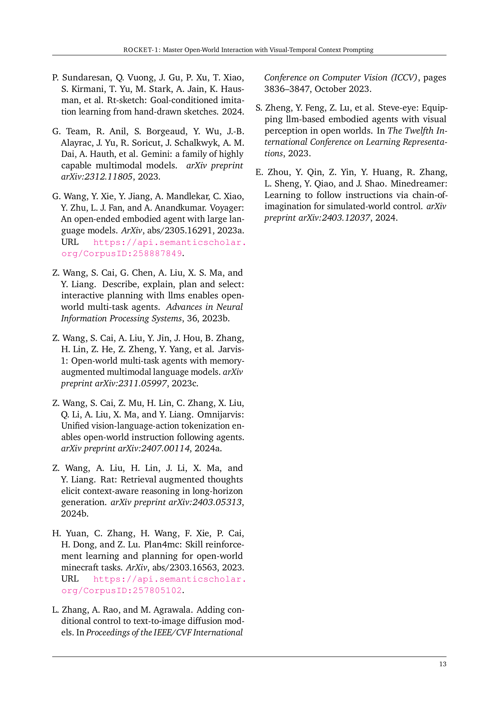

### TL;DR



This research introduces ROCKET-1, a system that significantly improves AI agents' ability to interact with complex, open-world environments like Minecraft.  It achieves this by using a novel technique called 'visual-temporal context prompting'. This method enhances communication between high-level reasoning models (VLMs) and low-level action-taking policies.  The VLMs provide object segmentations and interaction cues derived from both past and present observations, which guide the actions of ROCKET-1, allowing it to solve tasks previously considered too difficult for AI.  The authors also present a new data generation method called 'backward trajectory relabeling' which efficiently creates training data by automatically labeling video game interactions using state-of-the-art object tracking. Experiments in Minecraft demonstrated that this approach unlocks the full potential of VLMs for complex, creative tasks.  The code and demonstrations of ROCKET-1 are available online.




 &nbsp; read the paper on arXiv

  

 &nbsp; on Hugging Face


#### Why does it matter?
This paper is highly important for researchers working in embodied AI, vision-language models, and reinforcement learning.  It introduces a novel communication protocol and a hierarchical agent architecture that significantly improves performance in complex, open-world environments. The proposed method is readily adaptable to other environments, and the results offer exciting new avenues for developing more capable and adaptable AI agents.  The backward trajectory relabeling technique efficiently generates training data, addressing a significant challenge in this field.
#### Key Takeaways


 ROCKET-1, a novel low-level policy guided by visual-temporal context from VLMs, achieves state-of-the-art performance in complex Minecraft tasks. 



 Visual-temporal context prompting, a new communication protocol, effectively conveys spatial information between VLMs and low-level policies. 



 Backward trajectory relabeling efficiently generates training data for embodied agents, addressing a significant challenge in the field. 


------
#### Visual Insights

> 🔼 The figure illustrates the ROCKET-1 pipeline solving a creative task in Minecraft by using visual-temporal context prompting to guide interactions.
> 

> 
read the caption

> Figure 1 | Our pipeline solves creative tasks, such as get the obsidian in the original Minecraft version, using the action space identical to human players (mouse & keyboard). We present a novel instruction interface, visual-temporal context prompting, under which we learn a spatial-sensitive policy, ROCKET-1. VLMs identify regions of interest within each observation, effectively guiding ROCKET-1 interactions.
> 


 <table id='8' style='font-size:16px'><tr><td>Hyperparameter</td><td>Value</td></tr><tr><td>Input Image Size</td><td>224 x 224</td></tr><tr><td>Visual Backbone</td><td>EfficientNet-B0 (4 channels)</td></tr><tr><td>Policy Transformer</td><td>TransformerXL</td></tr><tr><td>Number of Policy Blocks</td><td>4</td></tr><tr><td>Hidden Dimension</td><td>1024</td></tr><tr><td>Trajectory Chunk size</td><td>128</td></tr><tr><td>Dropout Rate p</td><td>0.75</td></tr><tr><td>Optimizer</td><td>AdamW</td></tr><tr><td>Weight Decay</td><td>0.001</td></tr><tr><td>Learning Rate</td><td>0.00004</td></tr><tr><td>Warmup Steps</td><td>2000</td></tr></table>

> 🔼 This table lists the hyperparameters used for training the ROCKET-1 model.
> 

> 
read the caption

> Table 1 | Hyperparameters for training ROCKET-1.
> 

### More visual insights

More on figures

> 🔼 Figure 2 illustrates five different pipelines for embodied decision-making, highlighting the differences in how they connect vision-language models (VLMs) to low-level policies.
> 

> 
read the caption

> Figure 2 | Different pipelines in solving embodied decision-making tasks. (a) End-to-end pipeline modeling token sequences of language, observations, and actions. (b) Language prompting: VLMs decompose instructions for language-conditioned policy execution. (c) Latent prompting: maps discrete behavior tokens to low-level actions. (d) Future-image prompting: fine-tunes VLMs and diffusion models for image-conditioned control. (e) Visual-temporal prompting: VLMs generate segmentations and interaction cues to guide ROCKET-1.
> 

> 🔼 Figure 3 illustrates the architecture of ROCKET-1, showing how it processes interaction types, observations, and object segmentations to predict actions using a causal transformer.
> 

> 
read the caption

> Figure 3 | ROCKET-1 architecture. ROCKET-1 processes interaction types (c), observations (o), and object segmentations (m) to predict actions (a) using a causal transformer. Observations and segmentations are concatenated and passed through a visual backbone for deep fusion. Interaction types and segmentations are randomly dropped with a set probability during training.
> 

> 🔼 The figure illustrates the backward trajectory relabeling pipeline in Minecraft, showing how SAM-2 is used to generate object segmentations for training ROCKET-1.
> 

> 
read the caption

> Figure 4 | Trajectory relabeling pipeline in Minecraft. A bounding box and point selection are applied to the image center in the frame preceding the interaction event to identify the interaction object. SAM-2 is then run in reverse temporal order for a specified duration, with the interaction type remaining consistent throughout.
> 

> 🔼 The figure illustrates the hierarchical agent architecture of ROCKET-1, showing how GPT-40, Molmo, SAM-2, and ROCKET-1 work together to solve complex tasks using visual-temporal context prompting.
> 

> 
read the caption

> Figure 5 | A hierarchical agent structure based on our proposed visual-temporal context prompting. A GPT-40 model decomposes complex tasks into steps based on the current observation, while the Molmo model identifies interactive objects by outputting points. SAM-2 segments these objects based on the point prompts, and ROCKET-1 uses the object masks and interaction types to make decisions. GPT-40 and Molmo run at low frequencies, while SAM-2 and ROCKET-1 operate at the same frequency as the environment.
> 

> 🔼 The figure shows a benchmark of 12 tasks in Minecraft designed to evaluate the open-world interaction capabilities of agents, emphasizing spatial reasoning and zero-shot generalization.
> 

> 
read the caption

> Figure 6 | A benchmark for evaluating open-world interaction capabilities of agents. The benchmark contains six interaction types in Minecraft, totaling 12 tasks. Unlike previous benchmarks, these tasks emphasize interacting with objects at specific spatial locations. For example, in “hunt the sheep in the right fence,” the task fails if the agent kills the sheep on the left side. Some tasks, such as “place the oak door on the diamond block,” never appear in the training set. It is also designed to evaluate zero-shot generalization capabilities.
> 

> 🔼 Figure 7 shows screenshots of the ROCKET-1 agent successfully completing several long-horizon tasks in Minecraft, showcasing its ability to handle complex, multi-step processes.
> 

> 
read the caption

> Figure 7 | Screenshots of our agent when completing long-horizon tasks.
> 

More on tables


 <table id='4' style='font-size:18px'><tr><td rowspan="2">Method</td><td rowspan="2">Prompt</td><td colspan="2">Hunt</td><td colspan="2">Mine</td><td colspan="2">Interact</td><td colspan="2">Navigate</td><td colspan="2">Tool</td><td colspan="2">Place</td><td rowspan="2">Overall</td></tr><tr><td></td><td></td><td></td><td></td><td></td><td></td><td></td><td></td><td></td><td></td><td></td><td></td></tr><tr><td>VPT-bc</td><td>N/A</td><td>13</td><td>16</td><td>0</td><td>13</td><td>3</td><td>31</td><td>0</td><td>9</td><td>0</td><td>0</td><td>0</td><td>0</td><td>7</td></tr><tr><td>STEVE-1</td><td>Human</td><td>0</td><td>6</td><td>0</td><td>69</td><td>0</td><td>3</td><td>0</td><td>31</td><td>91</td><td>6</td><td>16</td><td>0</td><td>19</td></tr><tr><td>GROOT-1</td><td>Human</td><td>9</td><td>22</td><td>0</td><td>6</td><td>3</td><td>6</td><td>0</td><td>3</td><td>47</td><td>13</td><td>3</td><td>0</td><td>9</td></tr><tr><td>ROCKET-1</td><td>Molmo</td><td>91+82</td><td>84+62</td><td>78+78</td><td>75+6</td><td>81+78</td><td>50+19</td><td>78+78</td><td>97 +66</td><td>94+3</td><td>91+78</td><td>72+56</td><td>91+91</td><td>82+63</td></tr><tr><td>ROCKET-1</td><td>Human</td><td>94+85</td><td>91+69</td><td>91+91</td><td>94+25</td><td>94+91</td><td>91+60</td><td>97+97</td><td>97+66</td><td>97+6</td><td>97+84</td><td>94+78</td><td>97+97</td><td>95+76</td></tr></table>
> 🔼 {{ table.description }}
> 

> 
read the caption

> {{ table.caption }}
> 

> Table 2 presents the average success rates of different methods on 12 Minecraft tasks, comparing human performance with several automated agents.


<table id='4' style='font-size:16px'><tr><td>Method</td><td>Communication Protocol</td><td>Policy</td><td>↗</td><td></td><td></td><td></td><td></td><td></td><td></td></tr><tr><td>DEPS</td><td>language</td><td>STEVE-1</td><td>95%</td><td>75%</td><td>15%</td><td>2%</td><td>15%</td><td>0%</td><td>0%</td></tr><tr><td>MineDreamer*</td><td>future image</td><td>STEVE-1</td><td>95%</td><td>-</td><td>-</td><td>-</td><td>0%</td><td>0%</td><td>0%</td></tr><tr><td>OmniJarvis</td><td>latent code</td><td>GROOT-1</td><td>95%</td><td>90%</td><td>20%</td><td>8%</td><td>40%</td><td>0%</td><td>0%</td></tr><tr><td>Ours</td><td>visual-temporal context</td><td>ROCKET-1</td><td>100%</td><td>100%</td><td>45%</td><td>25%</td><td>75%</td><td>50%</td><td>70%</td></tr></table>
> 🔼 {{ table.description }}
> 

> 
read the caption

> {{ table.caption }}
> 

> Table 3 compares the success rates of several hierarchical agent architectures on seven long-horizon Minecraft tasks, highlighting the superior performance of the visual-temporal context prompting approach.


 <table id='2' style='font-size:14px'><tr><td>Variants</td><td>P-GAP</td><td>FPS ↑</td><td></td><td>↑</td></tr><tr><td>baseline (w/o sam2)</td><td>3</td><td>0.9</td><td>84%</td><td>82%</td></tr><tr><td>baseline (w/o sam2)</td><td>30</td><td>9.2</td><td>0%</td><td>3%</td></tr><tr><td>+sam2_ tiny</td><td>30</td><td>5.4</td><td>84%</td><td>69%</td></tr><tr><td>+sam2_ small</td><td>30</td><td>5.1</td><td>88%</td><td>50%</td></tr><tr><td>+sam2 base _plus</td><td>30</td><td>3.0</td><td>88%</td><td>63%</td></tr><tr><td>+sam2_ large</td><td>30</td><td>2.4</td><td>91%</td><td>78%</td></tr></table>
> 🔼 {{ table.description }}
> 

> 
read the caption

> {{ table.caption }}
> 

> Table 4 shows the effect of different sizes of SAM-2 models on the success rate and inference speed of the agent in two Minecraft tasks, considering the interval between prompts generated by Molmo.


 <table id='9' style='font-size:14px'><tr><td>Interaction Type Fusion</td><td>Hunt T</td><td>Mine ( T</td></tr><tr><td>in transformer layer</td><td>72%</td><td>69%</td></tr><tr><td>in visual backbone</td><td>91%</td><td>78%</td></tr></table>
> 🔼 {{ table.description }}
> 

> 
read the caption

> {{ table.caption }}
> 

> Table 5 shows the comparison of two different approaches of interaction-type information fusion in the visual backbone and transformer layer, indicating the impact of fusion location on the success rate of 'Hunt' and 'Mine' tasks.

### Full paper



