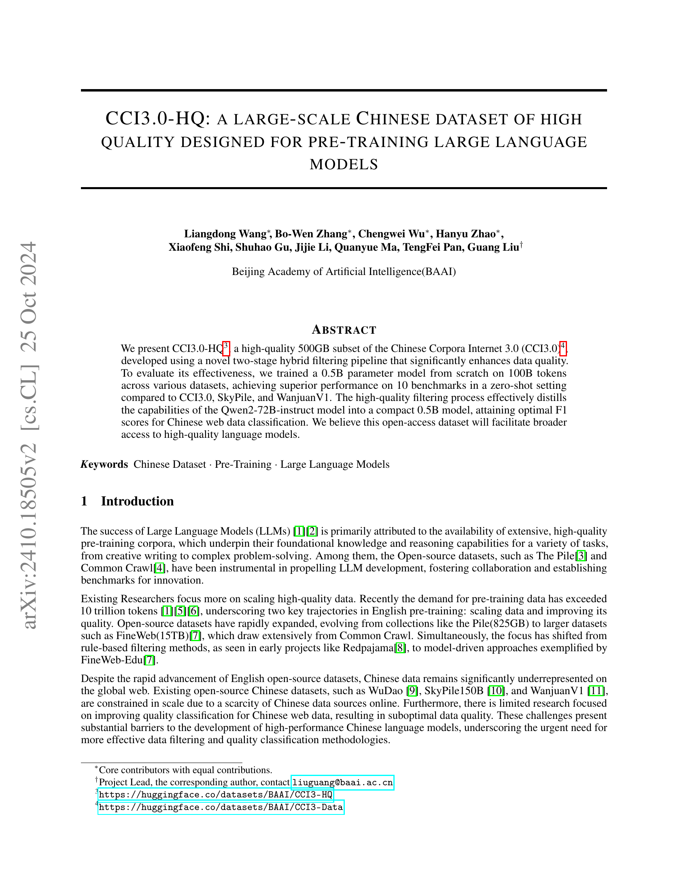

### TL;DR



Researchers created CCI3.0-HQ, a massive, high-quality dataset (500GB) of Chinese text for training large language models (LLMs). They used a two-part filtering system: first, standard cleaning and safety checks; second, a sophisticated machine learning model to select only the highest-quality text.  Testing shows that LLMs trained on CCI3.0-HQ substantially outperform those trained on other commonly used Chinese datasets across various tasks.  This dataset and the associated quality classifier are openly available, hoping to level the playing field for research and development of Chinese LLMs.




 &nbsp; read the paper on arXiv

  

 &nbsp; on Hugging Face


#### Why does it matter?
This paper is crucial for researchers in natural language processing (NLP), particularly those working with Chinese language models.  It addresses the scarcity of high-quality, large-scale Chinese datasets, a major bottleneck in LLM development.  The open-sourced dataset and classifier will significantly accelerate research and development, fostering collaboration and establishing new benchmarks. The novel hybrid filtering method also offers a valuable contribution to data curation techniques, influencing future dataset creation efforts.
#### Key Takeaways


 CCI3.0-HQ, a 500GB high-quality Chinese dataset, significantly outperforms existing datasets in training large language models. 



 A novel two-stage hybrid filtering pipeline effectively enhances data quality, achieving superior results in zero-shot settings. 



 The open-sourced dataset and advanced quality classifier facilitate broader access to high-quality language models and improve data selection processes in LLM training. 


------
#### Visual Insights

> 🔼 The figure shows the two-stage hybrid filtering strategy for creating the CCI3.0-HQ dataset, starting from raw data and involving Fundamental Processing and High-Quality Processing.
> 

> 
read the caption

> Figure 1: Dataset Curation Pipeline
> 

> 🔼 The chart displays the effects of locking/unlocking the backbone and using different learning rates on a classifier's F1 score during tuning.
> 

> 
read the caption

> Figure 2: Effects of Backbone Freezing and Learning Rate Adjustments on Classifier Tuning Performance
> 


<table id='9' style='font-size:18px'><tr><td>Parameter</td><td>Value</td></tr><tr><td>attention_dropout</td><td>0.0</td></tr><tr><td>bos_token_id</td><td>151849</td></tr><tr><td>eos_token_id</td><td>151850</td></tr><tr><td>hidden_act</td><td>silu</td></tr><tr><td>hidden_size</td><td>896</td></tr><tr><td>intermediate_size</td><td>2432</td></tr><tr><td>max_position_embeddings</td><td>4096</td></tr><tr><td>num_attention_heads</td><td>14</td></tr><tr><td>num_hidden_layers</td><td>24</td></tr><tr><td>num_key_value_heads</td><td>2</td></tr><tr><td>pad_token_id</td><td>151643</td></tr><tr><td>rms_norm_eps</td><td>1e-06</td></tr><tr><td>rope_theta</td><td>10000</td></tr><tr><td>tie_ word_embeddings</td><td>True</td></tr><tr><td>torch_dtype</td><td>bfloat16</td></tr><tr><td>vocab_size</td><td>151851</td></tr></table>

> 🔼 Table 1 presents the hyperparameters used in the pre-training configuration of the Qwen2-0.5B model.
> 

> 
read the caption

> Table 1: Pre-training Model Configuration Parameters
> 

### More visual insights

More on charts

> 🔼 The chart displays the effects of backbone freezing and different learning rates on the F1 score of a classifier during tuning.
> 

> 
read the caption

> Figure 2: Effects of Backbone Freezing and Learning Rate Adjustments on Classifier Tuning Performance
> 

> 🔼 The chart displays the performance of various datasets across different training token sizes in mixed and Chinese-specific dataset experiments.
> 

> 
read the caption

> Figure 3, 4: Dataset Experiment
> 

More on tables


<table id='1' style='font-size:20px'><tr><td colspan="5">Mixed Dataset Experiment Results</td></tr><tr><td>Metrics</td><td>SkyPile</td><td>Wanjuan-v1</td><td>CCI3.0</td><td>CCI3.0-HQ</td></tr><tr><td>ARC-C</td><td>0.270</td><td>0.277</td><td>0.265</td><td>0.269</td></tr><tr><td>ARC-E</td><td>0.521</td><td>0.517</td><td>0.539</td><td>0.542</td></tr><tr><td>HellaSwag</td><td>0.355</td><td>0.347</td><td>0.36</td><td>0.357</td></tr><tr><td>Winograd</td><td>0.507</td><td>0.502</td><td>0.498</td><td>0.523</td></tr><tr><td>MMLU</td><td>0.286</td><td>0.287</td><td>0.289</td><td>0.292</td></tr><tr><td>OpenbookQA</td><td>0.334</td><td>0.312</td><td>0.326</td><td>0.318</td></tr><tr><td>PIQA</td><td>0.651</td><td>0.651</td><td>0.652</td><td>0.648</td></tr><tr><td>SIQA</td><td>0.38</td><td>0.387</td><td>0.375</td><td>0.394</td></tr><tr><td>CEval</td><td>0.279</td><td>0.275</td><td>0.278</td><td>0.296</td></tr><tr><td>CMMLU</td><td>0.294</td><td>0.286</td><td>0.292</td><td>0.309</td></tr><tr><td>AverageEnglish</td><td>0.413</td><td>0.410</td><td>0.413</td><td>0.418</td></tr><tr><td>AverageChinese</td><td>0.287</td><td>0.280</td><td>0.285</td><td>0.303</td></tr><tr><td>Average</td><td>0.388</td><td>0.384</td><td>0.388</td><td>0.395</td></tr><tr><td colspan="5">Chinese Dataset Experiment Results</td></tr><tr><td>Metrics</td><td>SkyPile</td><td>Wanjuan-v1</td><td>CCI3.0</td><td>CCI3.0-HQ</td></tr><tr><td>ARC-C</td><td>0.192</td><td>0.217</td><td>0.202</td><td>0.235</td></tr><tr><td>ARC-E</td><td>0.313</td><td>0.282</td><td>0.323</td><td>0.388</td></tr><tr><td>HellaSwag</td><td>0.279</td><td>0.269</td><td>0.283</td><td>0.295</td></tr><tr><td>Winograd</td><td>0.490</td><td>0.487</td><td>0.485</td><td>0.481</td></tr><tr><td>MMLU</td><td>0.244</td><td>0.254</td><td>0.245</td><td>0.259</td></tr><tr><td>OpenbookQA</td><td>0.254</td><td>0.232</td><td>0.232</td><td>0.242</td></tr><tr><td>PIQA</td><td>0.528</td><td>0.539</td><td>0.53</td><td>0.556</td></tr><tr><td>SIQA</td><td>0.387</td><td>0.377</td><td>0.372</td><td>0.382</td></tr><tr><td>CEval</td><td>0.305</td><td>0.279</td><td>0.294</td><td>0.331</td></tr><tr><td>CMMLU</td><td>0.304</td><td>0.298</td><td>0.296</td><td>0.328</td></tr><tr><td>AverageEnglish</td><td>0.336</td><td>0.332</td><td>0.334</td><td>0.355</td></tr><tr><td>AverageChinese</td><td>0.304</td><td>0.289</td><td>0.295</td><td>0.329</td></tr><tr><td>Average</td><td>0.330</td><td>0.324</td><td>0.326</td><td>0.350</td></tr></table>
> 🔼 {{ table.description }}
> 

> 
read the caption

> {{ table.caption }}
> 

> The table presents a comparison of the performance of different datasets (SkyPile, Wanjuan-v1, CCI3.0, and CCI3.0-HQ) on various metrics across mixed and Chinese-only datasets.


<table id='2' style='font-size:20px'><tr><td>Metrics</td><td>DCLM</td><td>FineWeb-edu</td></tr><tr><td>ARC-C</td><td>0.211</td><td>0.235</td></tr><tr><td>ARC-E</td><td>0.378</td><td>0.388</td></tr><tr><td>HellaSwag</td><td>0.310</td><td>0.295</td></tr><tr><td>Winograd</td><td>0.485</td><td>0.481</td></tr><tr><td>MMLU</td><td>0.259</td><td>0.259</td></tr><tr><td>OpenbookQA</td><td>0.262</td><td>0.242</td></tr><tr><td>PIQA</td><td>0.571</td><td>0.556</td></tr><tr><td>SIQA</td><td>0.389</td><td>0.382</td></tr><tr><td>CEval</td><td>0.298</td><td>0.331</td></tr><tr><td>CMMLU</td><td>0.311</td><td>0.328</td></tr><tr><td>AverageEnglish</td><td>0.358</td><td>0.355</td></tr><tr><td>AverageChinese</td><td>0.305</td><td>0.329</td></tr><tr><td>Average</td><td>0.348</td><td>0.350</td></tr></table>
> 🔼 {{ table.description }}
> 

> 
read the caption

> {{ table.caption }}
> 

> Table 3 compares the performance of two quality annotation methods, DCLM and FineWeb-edu, across various metrics, showing FineWeb-edu's superiority in Chinese-specific tasks and overall performance.


<table id='1' style='font-size:16px'><tr><td>Classifier</td><td>Precision</td><td>Recall</td><td>F1-score</td></tr><tr><td colspan="4">classifierFineWeb-edu</td></tr><tr><td>Positive</td><td>0.91</td><td>0.02</td><td>0.03</td></tr><tr><td>Negative</td><td>0.82</td><td>1.00</td><td>0.90</td></tr><tr><td>Macro F1</td><td>0.87</td><td>0.51</td><td>0.47</td></tr><tr><td colspan="4">classifierChineseWebText</td></tr><tr><td>Positive</td><td>0.18</td><td>0.58</td><td>0.27</td></tr><tr><td>Negative</td><td>0.80</td><td>0.38</td><td>0.52</td></tr><tr><td>Macro F1</td><td>0.49</td><td>0.48</td><td>0.39</td></tr><tr><td colspan="4">classifierIndustryCorpus2</td></tr><tr><td>Positive</td><td>0.32</td><td>0.86</td><td>0.47</td></tr><tr><td>Negative</td><td>0.95</td><td>0.59</td><td>0.73</td></tr><tr><td>Macro F1</td><td>0.64</td><td>0.73</td><td>0.60</td></tr><tr><td colspan="4">classifiercc13.0-HQ</td></tr><tr><td>Positive</td><td>0.86</td><td>0.38</td><td>0.53</td></tr><tr><td>Negative</td><td>0.88</td><td>0.99</td><td>0.93</td></tr><tr><td>Macro F1</td><td>0.87</td><td>0.68</td><td>0.73</td></tr></table>
> 🔼 {{ table.description }}
> 

> 
read the caption

> {{ table.caption }}
> 

> Table 4 presents a comparison of four different quality classifiers (classifierFineWeb-edu, classifierChineseWebText, classifierIndustryCorpus2, and classifierCC13.0-HQ) based on their precision, recall, and F1-score for both positive and negative sample classifications.

### Full paper



