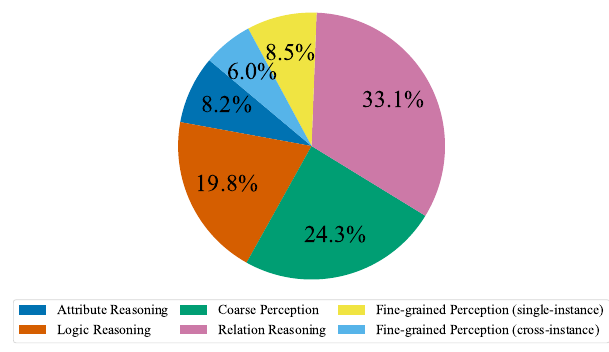
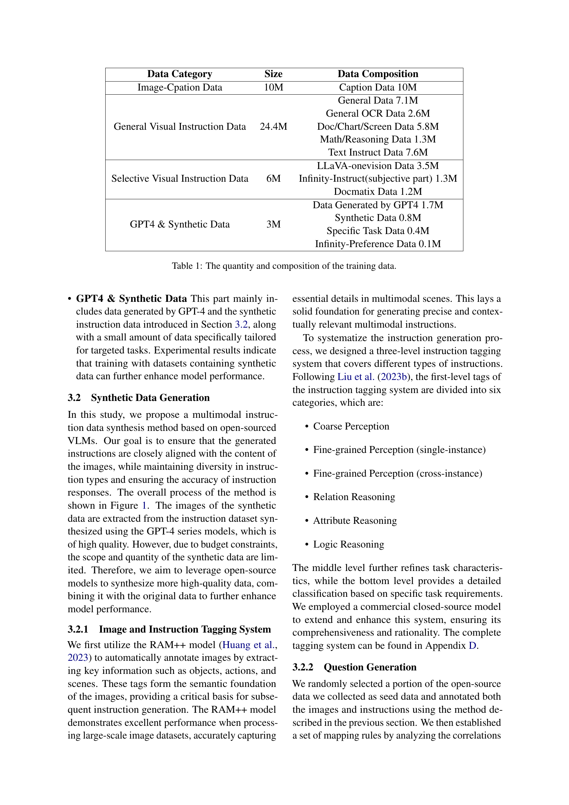
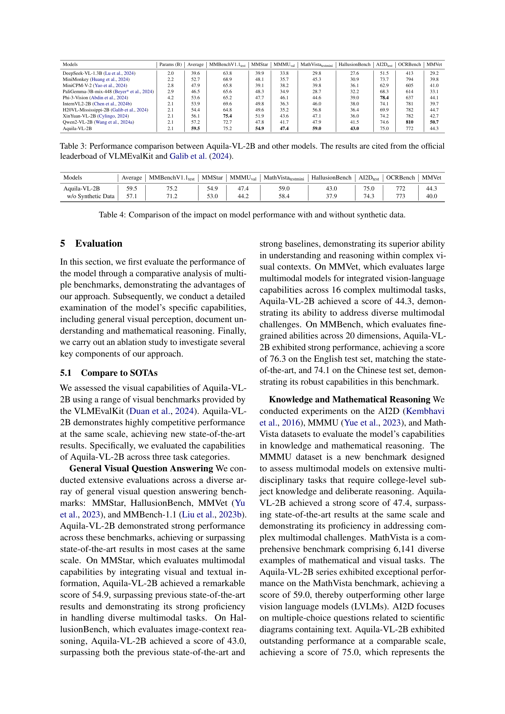
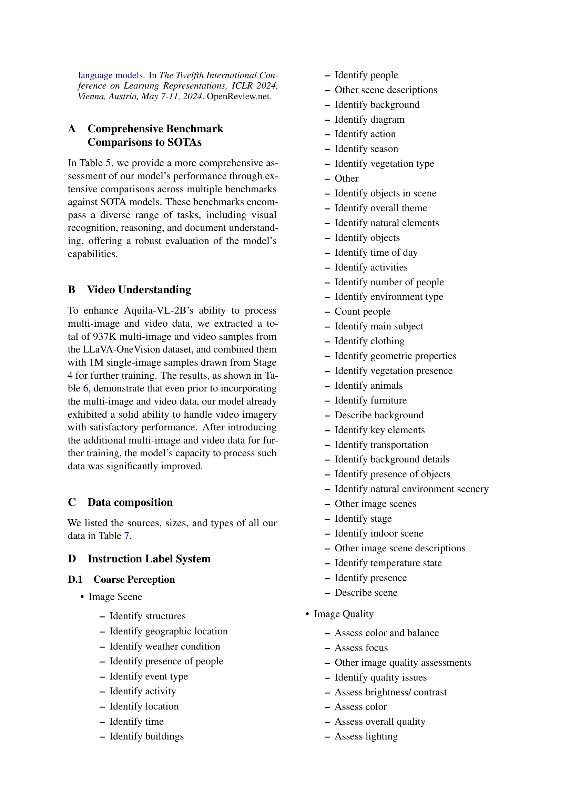
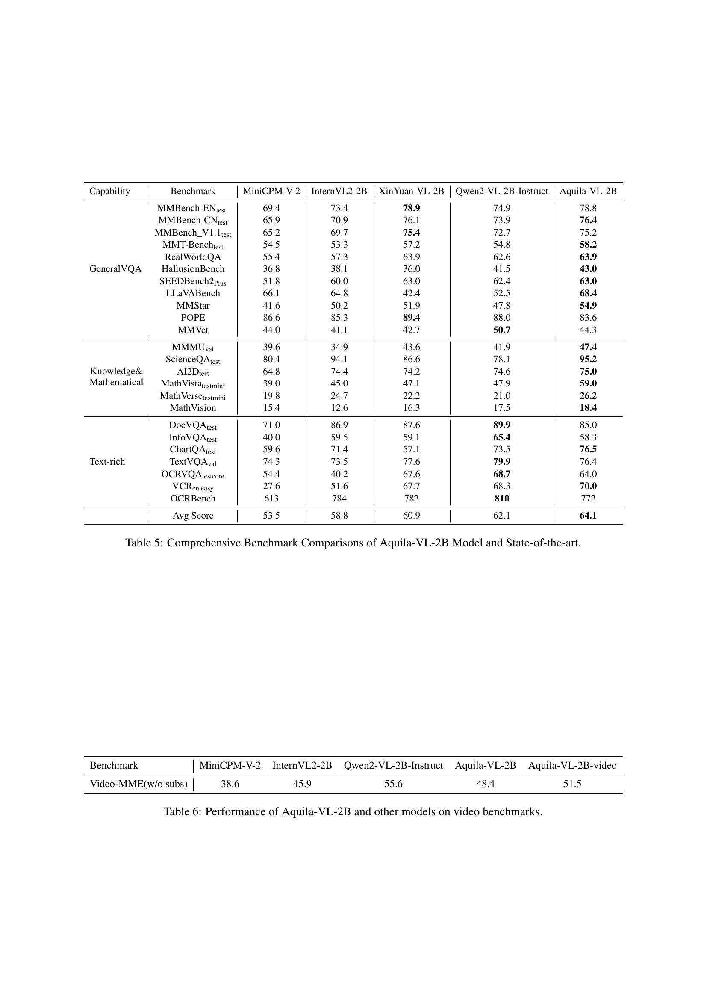
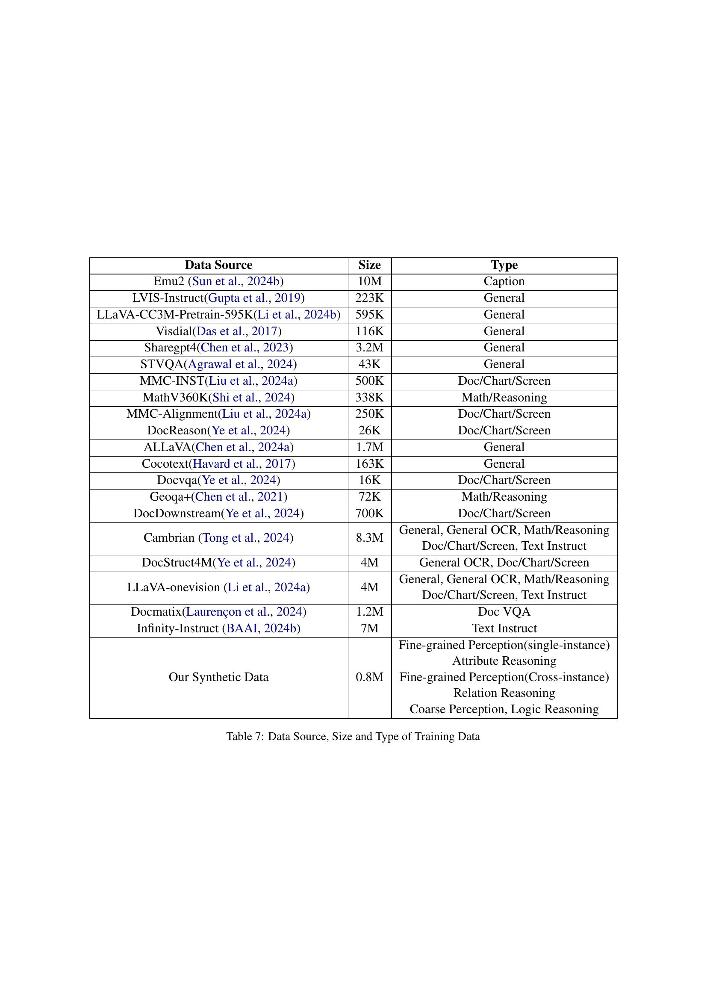

### TL;DR



This research tackles the challenge of limited high-quality instruction data hindering open-source vision-language model (VLM) performance.  The researchers introduce Infinity-MM, a massive (40 million samples) multimodal instruction dataset rigorously cleaned and deduplicated.  They also introduce a method to generate synthetic instruction data using open-source VLMs. By training a 2-billion parameter VLM (Aquila-VL-2B) on this combined data, they achieve state-of-the-art results for similar-sized models, demonstrating the significant impact of high-quality, large-scale data on VLM performance. This work significantly advances the field by providing a valuable new dataset and a practical method for synthetic data generation, contributing to the development of more powerful and accessible open-source VLMs.




 &nbsp; read the paper on arXiv

  

 &nbsp; on Hugging Face


#### Why does it matter?
This paper is highly important for researchers in vision-language models (VLMs) because it addresses a critical limitation: the lack of high-quality, large-scale instruction data for training open-source models. By introducing Infinity-MM, a massive and meticulously curated dataset, and proposing a novel synthetic data generation method, the research significantly advances the field. It paves the way for training more powerful open-source VLMs that can rival their closed-source counterparts, fostering further innovation and accessibility in the community.  The proposed synthetic data generation technique is also a valuable contribution, offering a scalable solution to augment existing datasets.
#### Key Takeaways


 Infinity-MM, a new 40-million-sample multimodal instruction dataset, significantly improves open-source VLM performance. 



 A novel synthetic data generation method based on open-source VLMs enhances data diversity and quantity. 



 The resulting 2-billion parameter VLM, Aquila-VL-2B, achieves state-of-the-art performance for its size. 


------
#### Visual Insights

> 🔼 The figure illustrates the process of generating synthetic multimodal instruction data using open-source models, including image labeling, instruction classification, question and answer generation, and filtering.
> 

> 
read the caption

> Figure 1: Illustration of synthetic data generation method.
> 

> 🔼 The pie chart Figure 2 shows the distribution of instruction types in the synthetic data, with Relation Reasoning having the largest proportion.
> 

> 
read the caption

> Figure 2: The distribution of instruction types of the synthetic data.
> 


<table id='0' style='font-size:18px'><tr><td>Data Category</td><td>Size</td><td>Data Composition</td></tr><tr><td>Image-Cpation Data</td><td>10M</td><td>Caption Data 10M</td></tr><tr><td>General Visual Instruction Data</td><td>24.4M</td><td>General Data 7.1M General OCR Data 2.6M Doc/Chart/Screen Data 5.8M Math/Reasoning Data 1.3M Text Instruct Data 7.6M</td></tr><tr><td>Selective Visual Instruction Data</td><td>6M</td><td>LLaVA-onevision Data 3.5M Infinity-Instruct(subjective part) 1.3M Docmatix Data 1.2M</td></tr><tr><td>GPT4 & Synthetic Data</td><td>3M</td><td>Data Generated by GPT4 1.7M Synthetic Data 0.8M Specific Task Data 0.4M Infinity-Preference Data 0.1M</td></tr></table>

> 🔼 Table 1 shows the quantity and composition of the multimodal datasets used for training, categorized into four types: Image-Caption Data, General Visual Instruction Data, Selective Visual Instruction Data, and GPT4 & Synthetic Data.
> 

> 
read the caption

> Table 1: The quantity and composition of the training data.
> 

### More visual insights

More on tables


<table id='0' style='font-size:14px'><tr><td rowspan="2" colspan="2"></td><td rowspan="2">Stage-1</td><td colspan="3">Stage-2</td><td rowspan="2">Stage-3</td><td rowspan="2">Stage-4</td></tr><tr><td>a</td><td>b</td><td>c</td></tr><tr><td>Vision</td><td>#tokens Resolution</td><td>729 384</td><td>Max 5x729 384x((1x1),..,(2x2)}</td><td>Max 6x729 384x {(1x1),...,(3x3)}</td><td>Max 7x729 384x{(1x1),...(4x4)}</td><td>Max 10x729 384x{(1x1),...,(6x6)}</td><td>Max 10x729 384x{(1x1),...(6x6)}</td></tr><tr><td>Data</td><td>Samples</td><td>10M</td><td>8.2M</td><td>8.2M</td><td>8.2M</td><td>6M</td><td>3M</td></tr><tr><td>Model</td><td>1.5B LLM Trainable</td><td>4.13M Projector</td><td>1.9B Full Model</td><td>1.9B Full Model</td><td>1.9B Full Model</td><td>1.9B Full Model</td><td>1.9B Full Model</td></tr><tr><td>Training</td><td>LR Batch Size Epoch</td><td>1.00E-03 512 1</td><td>1.00E-05 512 1</td><td>1.00E-05 512 1</td><td>1.00E-05 512 1</td><td>1.00E-05 512 1</td><td>1.00E-05 512 1</td></tr></table>
> 🔼 {{ table.description }}
> 

> 
read the caption

> {{ table.caption }}
> 

> The table details the training configurations of the Aquila-VL-2B model across four stages, specifying the number of tokens, resolution, number of samples, model size, learning rate, batch size and epochs for each stage.


<table id='0' style='font-size:14px'><tr><td>Models</td><td>Params (B)</td><td>Average</td><td>MMBenchV1.1test</td><td>MMStar</td><td>MMMUval</td><td>MathVistatestmini</td><td>HallusionBench</td><td>AI2Dtest</td><td>OCRBench</td><td>MMVet</td></tr><tr><td>DeepSeek-VL-1.3B (Lu et al⌀, 2024)</td><td>2.0</td><td>39.6</td><td>63.8</td><td>39.9</td><td>33.8</td><td>29.8</td><td>27.6</td><td>51.5</td><td>413</td><td>29.2</td></tr><tr><td>MiniMonkey (Huang et al., 2024)</td><td>2.2</td><td>52.7</td><td>68.9</td><td>48.1</td><td>35.7</td><td>45.3</td><td>30.9</td><td>73.7</td><td>794</td><td>39.8</td></tr><tr><td>MiniCPM-V-2 (Yao et al., 2024)</td><td>2.8</td><td>47.9</td><td>65.8</td><td>39.1</td><td>38.2</td><td>39.8</td><td>36.1</td><td>62.9</td><td>605</td><td>41.0</td></tr><tr><td>PaliGemma-3B-mix-448 (Beyer* et al., 2024)</td><td>2.9</td><td>46.5</td><td>65.6</td><td>48.3</td><td>34.9</td><td>28.7</td><td>32.2</td><td>68.3</td><td>614</td><td>33.1</td></tr><tr><td>Phi-3-Vision (Abdin et al., 2024)</td><td>4.2</td><td>53.6</td><td>65.2</td><td>47.7</td><td>46.1</td><td>44.6</td><td>39.0</td><td>78.4</td><td>637</td><td>44.1</td></tr><tr><td>InternVL2-2B (Chen et al., 2024b)</td><td>2.1</td><td>53.9</td><td>69.6</td><td>49.8</td><td>36.3</td><td>46.0</td><td>38.0</td><td>74.1</td><td>781</td><td>39.7</td></tr><tr><td>H20VL-Mississippi-2B (Galib et al., 2024)</td><td>2.1</td><td>54.4</td><td>64.8</td><td>49.6</td><td>35.2</td><td>56.8</td><td>36.4</td><td>69.9</td><td>782</td><td>44.7</td></tr><tr><td>XinYuan-VL-2B (Cylingo, 2024)</td><td>2.1</td><td>56.1</td><td>75.4</td><td>51.9</td><td>43.6</td><td>47.1</td><td>36.0</td><td>74.2</td><td>782</td><td>42.7</td></tr><tr><td>Qwen2-VL-2B (Wang et al., 2024a)</td><td>2.1</td><td>57.2</td><td>72.7</td><td>47.8</td><td>41.7</td><td>47.9</td><td>41.5</td><td>74.6</td><td>810</td><td>50.7</td></tr><tr><td>Aquila-VL-2B</td><td>2.1</td><td>59.5</td><td>75.2</td><td>54.9</td><td>47.4</td><td>59.0</td><td>43.0</td><td>75.0</td><td>772</td><td>44.3</td></tr></table>
> 🔼 {{ table.description }}
> 

> 
read the caption

> {{ table.caption }}
> 

> Table 3 presents a performance comparison of Aquila-VL-2B against other state-of-the-art vision-language models across various benchmarks.


<table id='0' style='font-size:14px'><tr><td>Capability</td><td>Benchmark</td><td>MiniCPM-V-2</td><td>InternVL2-2B</td><td>XinYuan-VL-2B</td><td>Qwen2-VL-2B-Instruct</td><td>Aquila-VL-2B</td></tr><tr><td rowspan="11">GeneralVQA</td><td>MMBench-ENtest</td><td>69.4</td><td>73.4</td><td>78.9</td><td>74.9</td><td>78.8</td></tr><tr><td>MMBench-CNtest</td><td>65.9</td><td>70.9</td><td>76.1</td><td>73.9</td><td>76.4</td></tr><tr><td>MMBench_ V1.1test</td><td>65.2</td><td>69.7</td><td>75.4</td><td>72.7</td><td>75.2</td></tr><tr><td>MMT-Benchtest</td><td>54.5</td><td>53.3</td><td>57.2</td><td>54.8</td><td>58.2</td></tr><tr><td>RealWorldQA</td><td>55.4</td><td>57.3</td><td>63.9</td><td>62.6</td><td>63.9</td></tr><tr><td>HallusionBench</td><td>36.8</td><td>38.1</td><td>36.0</td><td>41.5</td><td>43.0</td></tr><tr><td>SEEDBench2plus</td><td>51.8</td><td>60.0</td><td>63.0</td><td>62.4</td><td>63.0</td></tr><tr><td>LLaVABench</td><td>66.1</td><td>64.8</td><td>42.4</td><td>52.5</td><td>68.4</td></tr><tr><td>MMStar</td><td>41.6</td><td>50.2</td><td>51.9</td><td>47.8</td><td>54.9</td></tr><tr><td>POPE</td><td>86.6</td><td>85.3</td><td>89.4</td><td>88.0</td><td>83.6</td></tr><tr><td>MMVet</td><td>44.0</td><td>41.1</td><td>42.7</td><td>50.7</td><td>44.3</td></tr><tr><td rowspan="6">Knowledge& Mathematical</td><td>MMMUval</td><td>39.6</td><td>34.9</td><td>43.6</td><td>41.9</td><td>47.4</td></tr><tr><td>ScienceQAtest</td><td>80.4</td><td>94.1</td><td>86.6</td><td>78.1</td><td>95.2</td></tr><tr><td>AI2Dtest</td><td>64.8</td><td>74.4</td><td>74.2</td><td>74.6</td><td>75.0</td></tr><tr><td>Math Vistatestmini</td><td>39.0</td><td>45.0</td><td>47.1</td><td>47.9</td><td>59.0</td></tr><tr><td>Math Versetestmini</td><td>19.8</td><td>24.7</td><td>22.2</td><td>21.0</td><td>26.2</td></tr><tr><td>Math Vision</td><td>15.4</td><td>12.6</td><td>16.3</td><td>17.5</td><td>18.4</td></tr><tr><td rowspan="7">Text-rich</td><td>DocVQAtest</td><td>71.0</td><td>86.9</td><td>87.6</td><td>89.9</td><td>85.0</td></tr><tr><td>InfoVQAtest</td><td>40.0</td><td>59.5</td><td>59.1</td><td>65.4</td><td>58.3</td></tr><tr><td>ChartQAtest</td><td>59.6</td><td>71.4</td><td>57.1</td><td>73.5</td><td>76.5</td></tr><tr><td>TextVQAval</td><td>74.3</td><td>73.5</td><td>77.6</td><td>79.9</td><td>76.4</td></tr><tr><td>OCRVQAtestcore</td><td>54.4</td><td>40.2</td><td>67.6</td><td>68.7</td><td>64.0</td></tr><tr><td>VCRen easy</td><td>27.6</td><td>51.6</td><td>67.7</td><td>68.3</td><td>70.0</td></tr><tr><td>OCRBench</td><td>613</td><td>784</td><td>782</td><td>810</td><td>772</td></tr><tr><td></td><td>Avg Score</td><td>53.5</td><td>58.8</td><td>60.9</td><td>62.1</td><td>64.1</td></tr></table>
> 🔼 {{ table.description }}
> 

> 
read the caption

> {{ table.caption }}
> 

> Table 5 presents a comprehensive comparison of Aquila-VL-2B's performance against other state-of-the-art models across various benchmarks, evaluating capabilities in general visual question answering, knowledge and mathematical reasoning, and text-rich tasks.


<table id='2' style='font-size:16px'><tr><td>Benchmark</td><td>MiniCPM-V-2</td><td>InternVL2-2B</td><td>Qwen2-VL-2B-Instruct</td><td>Aquila-VL-2B</td><td>Aquila-VL-2B-video</td></tr><tr><td>Video-MME(w/o subs)</td><td>38.6</td><td>45.9</td><td>55.6</td><td>48.4</td><td>51.5</td></tr></table>
> 🔼 {{ table.description }}
> 

> 
read the caption

> {{ table.caption }}
> 

> Table 6 presents the performance comparison of Aquila-VL-2B and other models on video benchmarks, showing the improvement achieved by incorporating video data into the training.


<table id='0' style='font-size:18px'><tr><td>Data Source</td><td>Size</td><td>Type</td></tr><tr><td>Emu2 (Sun et al., 2024b)</td><td>10M</td><td>Caption</td></tr><tr><td>LVIS-Instruct(Gupta et al., 2019)</td><td>223K</td><td>General</td></tr><tr><td>LLaVA-CC3M-Pretrain-595K(Li et al., 2024b)</td><td>595K</td><td>General</td></tr><tr><td>Visdial(Das et al., 2017)</td><td>116K</td><td>General</td></tr><tr><td>Sharegpt4(Chen et al., 2023)</td><td>3.2M</td><td>General</td></tr><tr><td>STVQA(Agrawal et al., 2024)</td><td>43K</td><td>General</td></tr><tr><td>MMC-INST(Liu et al., 2024a)</td><td>500K</td><td>Doc/Chart/Screen</td></tr><tr><td>MathV360K(Shi et al., 2024)</td><td>338K</td><td>Math/Reasoning</td></tr><tr><td>MMC-Alignment(Liu et al., 2024a)</td><td>250K</td><td>Doc/Chart/Screen</td></tr><tr><td>DocReason(Ye et al., 2024)</td><td>26K</td><td>Doc/Chart/Screen</td></tr><tr><td>ALLaVA(Chen et al., 2024a)</td><td>1.7M</td><td>General</td></tr><tr><td>Cocotext(Havard et al., 2017)</td><td>163K</td><td>General</td></tr><tr><td>Docvqa(Ye et al., 2024)</td><td>16K</td><td>Doc/Chart/Screen</td></tr><tr><td>Geoqa+(Chen et al., 2021)</td><td>72K</td><td>Math/Reasoning</td></tr><tr><td>DocDownstream(Ye et al., 2024)</td><td>700K</td><td>Doc/Chart/Screen</td></tr><tr><td>Cambrian (Tong et al., 2024)</td><td>8.3M</td><td>General, General OCR, Math/Reasoning Doc/Chart/Screen, Text Instruct</td></tr><tr><td>DocStruct4M(Ye et al., 2024)</td><td>4M</td><td>General OCR, Doc/Chart/Screen</td></tr><tr><td>LLaVA-onevision (Li et al., 2024a)</td><td>4M</td><td>General, General OCR, Math/Reasoning Doc/Chart/Screen, Text Instruct</td></tr><tr><td>Docmatix(Lauren�on et al., 2024)</td><td>1.2M</td><td>Doc VQA</td></tr><tr><td>Infinity-Instruct (BAAI, 2024b)</td><td>7M</td><td>Text Instruct</td></tr><tr><td>Our Synthetic Data</td><td>0.8M</td><td>Fine-grained Perception(single-instance) Attribute Reasoning Fine-grained Perception(Cross-instance) Relation Reasoning Coarse Perception, Logic Reasoning</td></tr></table>
> 🔼 {{ table.description }}
> 

> 
read the caption

> {{ table.caption }}
> 

> Table 7 shows the sources, sizes, and types of all training data used in the Aquila-VL-2B model training.

### Full paper



