### TL;DR



Large language models (LLMs) sometimes produce outputs that sound plausible but are factually incorrect—a phenomenon known as hallucination.  This paper introduces PREREQ-TUNE, a new method to reduce these hallucinations.  The core idea is to separate the learning of factual knowledge from the learning of skills needed for a specific task.  PREREQ-TUNE does this by adding a 'prerequisite learning' stage before the main fine-tuning.  This stage focuses solely on teaching the model the necessary background knowledge.  The main fine-tuning stage then concentrates on learning the task-specific skills without being affected by potential inconsistencies in the knowledge.  Experiments show that PREREQ-TUNE improves the factuality of LLMs on various tasks, including question answering and long-form text generation.  Interestingly, the method also works well even when trained on completely artificial data, highlighting the potential of this technique for creating more reliable and trustworthy LLMs.  The code for PREREQ-TUNE is also publicly available.




 &nbsp; read the paper on arXiv

  

 &nbsp; on Hugging Face


#### Why does it matter?
This paper is crucial for researchers working on large language models (LLMs) because it addresses the critical issue of LLM hallucinations, a major obstacle to their reliability.  The proposed PREREQ-TUNE method offers a novel approach to mitigate these hallucinations, opening new avenues for knowledge-controlled generation and data-efficient fine-tuning. The findings are relevant to ongoing efforts to improve LLM factuality and trustworthiness, and the techniques presented can inspire further research in disentangling knowledge and skills in LLM training.
#### Key Takeaways


 PREREQ-TUNE effectively reduces LLM hallucinations by disentangling skill and knowledge learning during fine-tuning. 



 Fictitious synthetic data, when used with PREREQ-TUNE, enhances LLM factuality by grounding model outputs to internal knowledge. 



 PREREQ-TUNE outperforms existing baselines in improving LLM factuality across various tasks, opening new avenues for knowledge-controlled generation. 


------
#### Visual Insights

> 🔼 The figure illustrates the PREREQ-TUNE strategy, which consists of a prerequisite learning stage to learn knowledge and a supervised fine-tuning stage to learn skills, disentangling knowledge and skill learning to reduce hallucinations.
> 

> 
read the caption

> Figure 1: Overview of the proposed PREREQ-TUNE strategy.
> 

> 🔼 The chart displays the accuracy of different models on a biography generation task in relation to the number of claims generated.
> 

> 
read the caption

> Figure 3: Accuracy on biography generation under different numbers of generated claims.
> 


<table id='2' style='font-size:14px'><tr><td></td><td colspan="2">Persons</td><td colspan="2">Medical Entities</td><td rowspan="2">QA Acc. ↑</td></tr><tr><td></td><td>Acc. ↑</td><td># Claims</td><td>Acc. ↑</td><td># Claims</td></tr><tr><td>SFT</td><td>32.70</td><td>20.8</td><td>69.94</td><td>9.2</td><td>46.42†</td></tr><tr><td>POPULAR Ghosal et al 2024</td><td>41.16</td><td>15.4</td><td>65.92</td><td>8.1</td><td>45.31</td></tr><tr><td>FLAME Lin et al. 2024</td><td>30.32</td><td>18.2</td><td>67.92</td><td>9.8</td><td></td></tr><tr><td>FACTTUNE Tian et al 2024 RL Kang et al. 2024</td><td>31.93 33.20±</td><td>19.6 20.9</td><td>69.13 70.03</td><td>7.9 9.0</td><td></td></tr><tr><td></td><td>34.75</td><td></td><td>67.98</td><td>9.0</td><td>-</td></tr><tr><td>SFTGPT SFTfictitious*</td><td></td><td>19.7</td><td>64.44</td><td></td><td></td></tr><tr><td>PREREQ-TUNE</td><td>15.44 45.30</td><td>20.6 16.0</td><td>74.35</td><td>8.9 9.1</td><td>44.98 47.91</td></tr></table>

> 🔼 Table 1 presents the main results of the proposed method PREREQ-TUNE and several baselines on long-form generation (persons and medical entities) and short QA tasks, showing the accuracy and number of claims generated.
> 

> 
read the caption

> Table 1: Performance for long-form generation tasks (persons and medical entities) and short QA. *: trained with the same hyperparameters as our method to show the impact of prerequisite learning. †: numbers different from Ghosal et al. (2024) because we process ambiguous questions; see Appendix D.2 for results on the original data. +: lower than the original paper because the original model only generates 2.7 claims.
> 

### More visual insights

More on figures

> 🔼 The figure illustrates the four-step process of creating multi-version dataset pairs for biography generation, starting from real biographies and culminating in multiple task datasets with varying knowledge.
> 

> 
read the caption

> Figure 2: Procedure of creating multi-version dataset pairs for the biography generation task.
> 

> 🔼 The figure illustrates the two-stage PREREQ-TUNE strategy for fine-tuning LLMs, including prerequisite learning and supervised fine-tuning, to improve factuality by disentangling knowledge and skill learning.
> 

> 
read the caption

> Figure 1: Overview of the proposed PREREQ-TUNE strategy.
> 

> 🔼 The figure illustrates the two-stage PREREQ-TUNE strategy, which includes prerequisite learning to disentangle knowledge and skill learning before supervised fine-tuning.
> 

> 
read the caption

> Figure 1: Overview of the proposed PREREQ-TUNE strategy.
> 

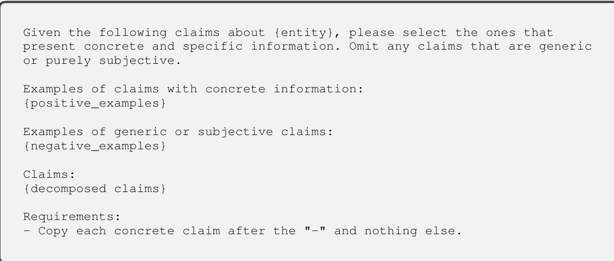

> 🔼 The figure illustrates the PREREQ-TUNE strategy, which consists of prerequisite learning and supervised fine-tuning stages to disentangle the learning of skills and knowledge for improved LLM factuality.
> 

> 
read the caption

> Figure 1: Overview of the proposed PREREQ-TUNE strategy.
> 

More on charts

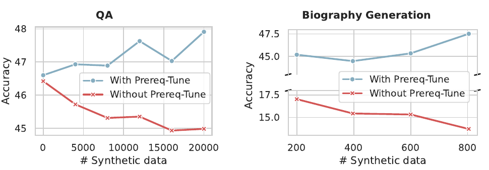

> 🔼 The chart displays the performance of QA and biography generation tasks with and without the prerequisite learning stage as the amount of synthetic data increases.
> 

> 
read the caption

> Figure 4: Performance as the number of synthetic data scales up.
> 

> 🔼 The chart displays the distribution of three response types (certain, unsure, unknown) based on the log of monthly page views, indicating a correlation between response type and entity familiarity.
> 

> 
read the caption

> Figure 5: The distribution of each response type with respect to the log of monthly page views of the entities.
> 

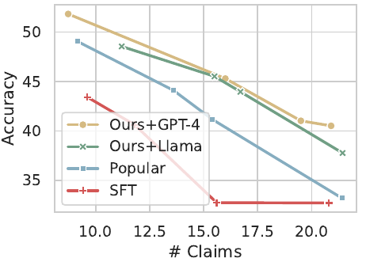

> 🔼 The chart displays the accuracy of different methods (PREREQ-TUNE with GPT-4, PREREQ-TUNE with Llama, POPULAR, and SFT) on biography generation across varying numbers of generated claims.
> 

> 
read the caption

> Figure 3: Accuracy on biography generation under different numbers of generated claims.
> 

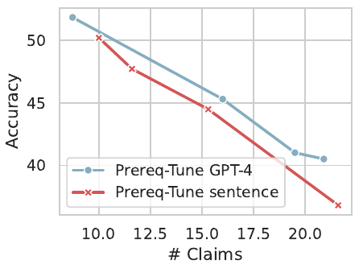

> 🔼 The chart displays the accuracy of biography generation models using two different methods for decomposing seed biographies into individual statements, showing that the GPT-4-based method outperforms the sentence-based method.
> 

> 
read the caption

> Figure 7: Accuracy on biography generation with two decomposition methods.
> 

More on tables


<table id='3' style='font-size:16px'><tr><td></td><td>Acc. V1</td><td>Acc. V2</td></tr><tr><td>0⌀ + △⌀(1)w + △�skill</td><td>94.83</td><td>6.90</td></tr><tr><td>0⌀ + △�know + △�skill</td><td>13.22</td><td>95.40</td></tr><tr><td>0⌀ + △�skill</td><td>15.52</td><td>5.17</td></tr><tr><td>SFTreal</td><td>14.94</td><td>5.17</td></tr></table>
> 🔼 {{ table.description }}
> 

> 
read the caption

> {{ table.caption }}
> 

> Table 2 shows the QA accuracy on a fictitious synthetic test dataset, comparing the accuracy of two different answers (V1 and V2) to the same question using different configurations of the model.


 <table id='4' style='font-size:14px'><tr><td></td><td>QA Acc.</td><td>Bio Generation Memorized Entities</td></tr><tr><td>SFTfictitious</td><td>58.01</td><td>32.63%</td></tr><tr><td>0⌀ + △�skill</td><td>3.99</td><td>10.79%</td></tr><tr><td>SFTreal</td><td>3.93</td><td>10.28%</td></tr></table>
> 🔼 {{ table.description }}
> 

> 
read the caption

> {{ table.caption }}
> 

> Table 3 presents the performance results on fictitious synthetic training data, showing the accuracy and the percentage of memorized entities for different models.


<table id='2' style='font-size:18px'><tr><td></td><td>Persons</td><td>Medical Entities</td><td>Short QA</td></tr><tr><td>Training</td><td>397</td><td>449</td><td>10,613</td></tr><tr><td>Validation</td><td>60</td><td>80</td><td>789</td></tr><tr><td>Test</td><td>183</td><td>200</td><td>2,152</td></tr></table>
> 🔼 {{ table.description }}
> 

> 
read the caption

> {{ table.caption }}
> 

> Table 1 presents the accuracy, and the number of generated claims for three different tasks (long-form generation of persons' biographies and medical entities' descriptions, and short QA) for six different methods, including the proposed method PREREQ-TUNE.


<table id='2' style='font-size:16px'><tr><td></td><td>Persons</td><td>Medical Entities</td><td>Short QA</td></tr><tr><td># entities</td><td>397</td><td>449</td><td>20,000</td></tr><tr><td># knowledge versions</td><td>5</td><td>5</td><td>1</td></tr><tr><td># sentences per version</td><td>6.5</td><td>4.6</td><td>1</td></tr></table>
> 🔼 {{ table.description }}
> 

> 
read the caption

> {{ table.caption }}
> 

> Table 1 presents the main results of the proposed PREREQ-TUNE method and several baselines on long-form generation tasks (persons and medical entities) and short QA tasks, showing the accuracy and number of claims generated.


<table id='2' style='font-size:14px'><tr><td></td><td>Persons</td><td>Medical Entities</td><td>Short QA</td></tr><tr><td>Epochs</td><td>5, 10, 20, 30, . . · , 80</td><td>5, 10, 20, 30, · · · , 80</td><td>3,4, 5</td></tr><tr><td>learning rate</td><td>3e - 5, 5e - 5</td><td>3e - 5, 5e - 5</td><td>3e - 5, 5e - 5</td></tr><tr><td>Batch size</td><td>128</td><td>128</td><td>512</td></tr><tr><td>LoRA r</td><td>32, 64, 128</td><td>32, 64, 128</td><td>16, 32, 64</td></tr><tr><td>LoRA a</td><td>2 * r</td><td>2 * r</td><td>2 * r</td></tr></table>
> 🔼 {{ table.description }}
> 

> 
read the caption

> {{ table.caption }}
> 

> Table 1 presents the main results of the proposed PREREQ-TUNE method and several baselines on three different tasks (long-form generation for persons and medical entities, and short QA) in terms of accuracy and the number of claims generated.


<table id='2' style='font-size:14px'><tr><td></td><td>Accuracy</td></tr><tr><td>SFT</td><td>36.90</td></tr><tr><td>POPULAR</td><td>36.85</td></tr><tr><td>SFTfictitious</td><td>36.05</td></tr><tr><td>PREREQ-TUNE</td><td>37.50</td></tr></table>
> 🔼 {{ table.description }}
> 

> 
read the caption

> {{ table.caption }}
> 

> Table 7 presents the accuracy of four different methods on the original PopQA dataset without data cleaning.


<table id='4' style='font-size:14px'><tr><td></td><td>QA Accuracy</td><td>Bio Generation Accuracy</td></tr><tr><td>Both</td><td>47.91</td><td>45.30</td></tr><tr><td>Statement-based</td><td>47.58</td><td>38.75</td></tr><tr><td>Passage-based</td><td>47.07</td><td>39.75</td></tr></table>
> 🔼 {{ table.description }}
> 

> 
read the caption

> {{ table.caption }}
> 

> The table presents the performance of different formats for the knowledge dataset (statement-based, passage-based, and both) on short QA and biography generation tasks.


<table id='1' style='font-size:14px'><tr><td colspan="2">Input Instruction</td></tr><tr><td colspan="2">Generate a biography for Eliza Dushku.</td></tr><tr><td colspan="2">Model Responses</td></tr><tr><td>SFT</td><td>Eliza Dushku (born December 30, 1980) is an American actress and model. She is known for her role as Kelly Reynolds in the cable broadcast series Dollhouse (2009-2010). She also appeared in the films True Lies (1994), The Tartuffe (2001), Bring It On (2000), Dog Days of Summer (2007), Tortured (2008), Gunshot Straight (2008), Miss Match (2003), Wrong Turn at Tahoe (2009), Eloise (2017), and Jules (2019). From 2014 to 2017, she portrayed Athena on FX's Sons of Anarchy and its spin-off Mayans M.C.. Dushku also performed the voice of Athena in the video games True Lies (1994) and as Jessica in the first two Guild Wars games.</td></tr><tr><td>SFTGPT</td><td>Eliza Patrice Dushku (born December 30, 1980) is an American actress and model. She is recognized for her roles as FBI Special Agent Kimberly Price in the TNT series Bull, as Athena on the Syfy series Dollhouse, and as the voice of Catwoman in the animated film Batman: Assault on Arkham. Dushku has also appeared in films such as True Lies (1994), The Scorpion King (2002), Wrong Turn (2003), Jay and Silent Bob Strike Back (2001), Bring It On (2000), and Soul Man (2014). She had recurring roles on the series Tru Calling and Angel and has featured in the video games True Crimes: Streets of L.A. and Dog Day Afternoon.</td></tr><tr><td>POPULAR</td><td>Eliza Patricia Dushku (born December 30, 1980) is an American actress and model. She is known for her roles as Faith in the action film series Buffy the Vampire Slayer (1992-2003) and its spin-off television series Angel (1999-2004), as well as her roles in True Lies (1994), Bring It On (2000), Jay and Silent Bob Strike Back (2001), Wrong Turn (2003), and Dollhouse (2009-2010). She also voiced Catwoman in the animated film Catwoman (2004) and voiced the character of Chelsea in the video game Mass Effect 3 (2012).</td></tr><tr><td>PREREQ- TUNE</td><td>Eliza Patricia Dushku (born December 30, 1980) is an American actress, model, and activist. She is best known for her television roles as Faith on the action series Buffy the Vampire Slayer (1998-2003) and its spin-off series Angel (2000-2004), and as Jessica Angel in True Lies (1994). She also starred in the Fox series Dollhouse (2009-2010) and appeared in the films True Lies (1994), The New Guy (2002), Bring It On (2000), Jay and Silent Bob Strike Back (2001), Soul Survivors (2001), Wrong Turn (2003), and The Alphabet Killer (2007).</td></tr></table>
> 🔼 {{ table.description }}
> 

> 
read the caption

> {{ table.caption }}
> 

> Table 1 presents the accuracy and number of claims generated by different methods for three tasks: long-form generation (persons and medical entities) and short QA.

### Full paper



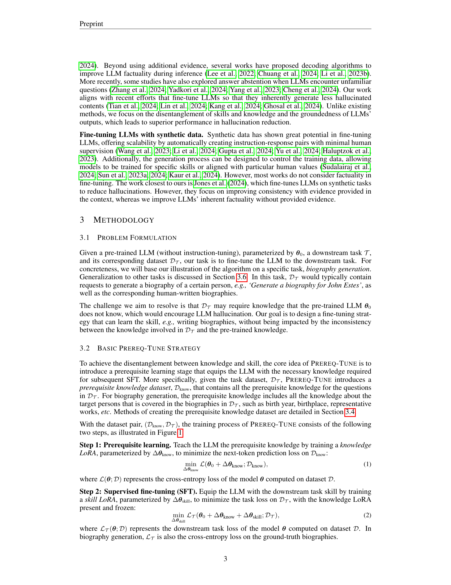

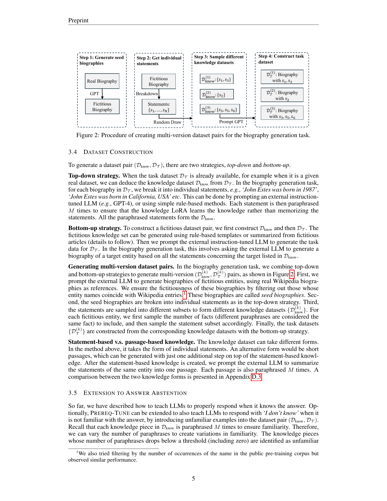

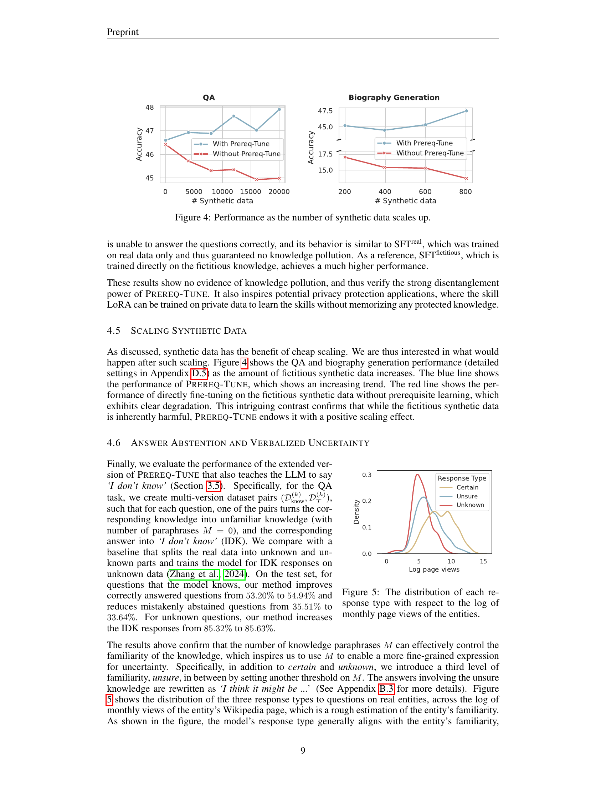

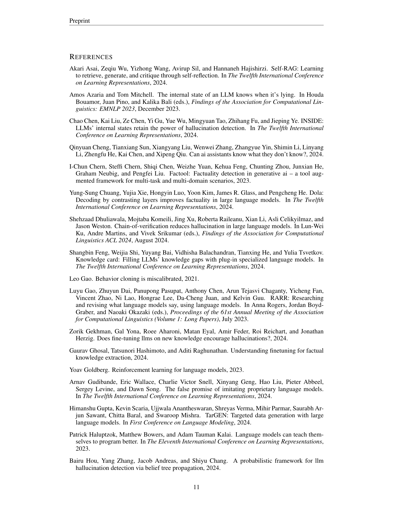

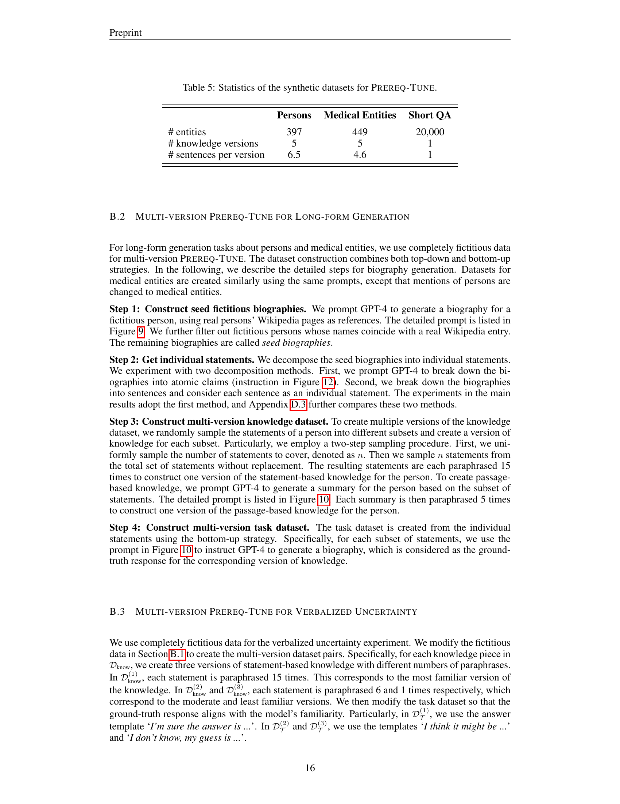
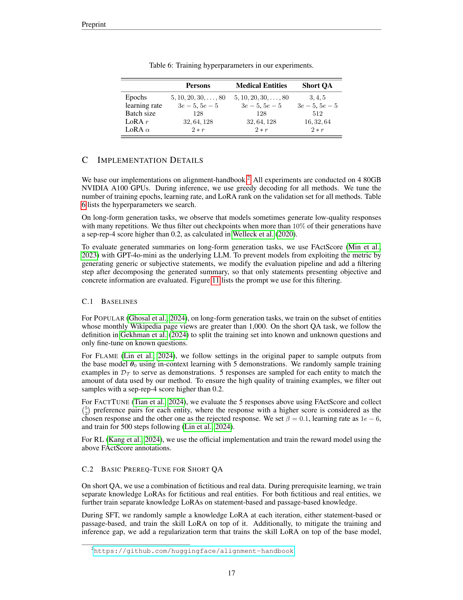

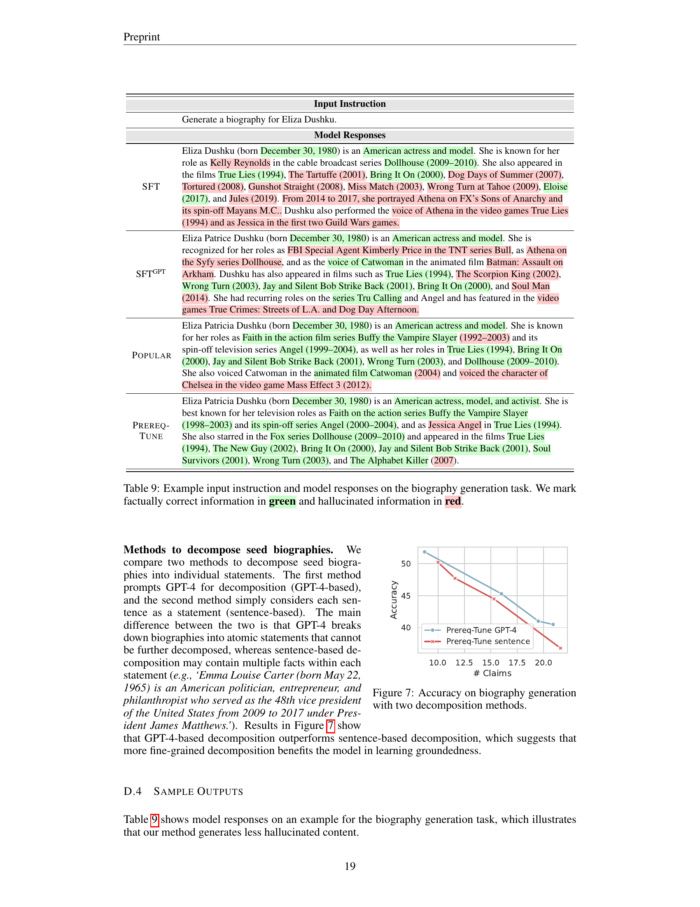
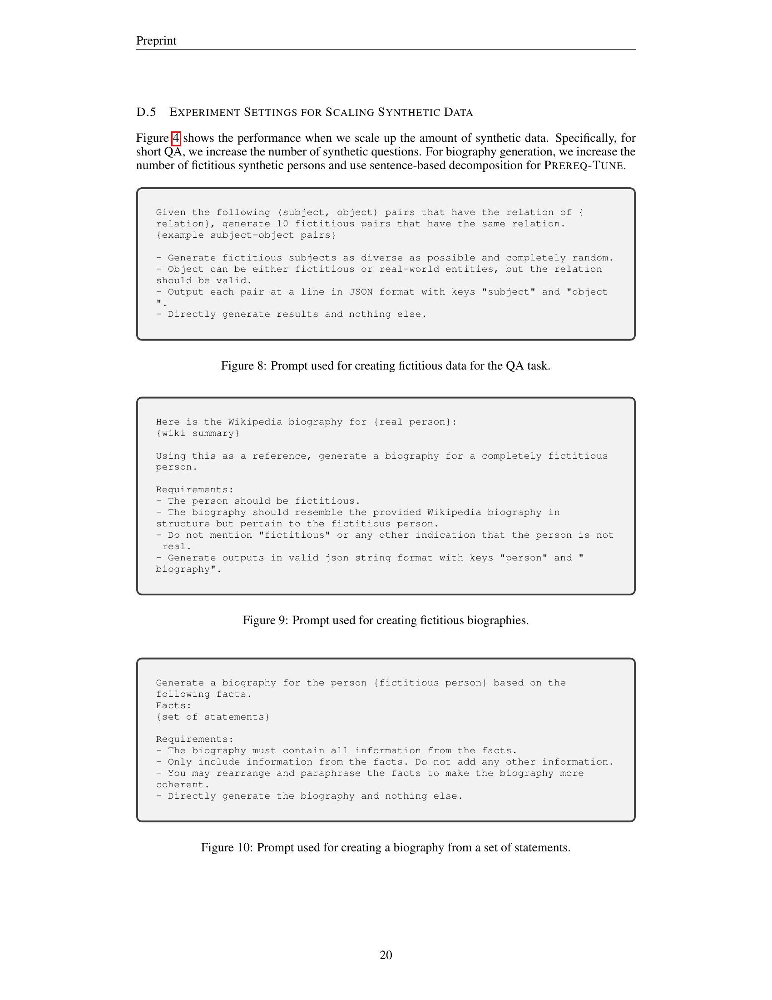

