### TL;DR



This research introduces FasterCache, a new technique to speed up video generation using diffusion models.  Existing methods for speeding things up often reduce the quality of the resulting video.  This new approach cleverly reuses features in the video generation process in a way that avoids this problem. This is done in two parts: a 'dynamic feature reuse strategy' that carefully selects which parts of the video to reuse, and 'CFG-Cache' that makes better use of a technique called classifier-free guidance, which improves quality but slows down the process. Tests show that FasterCache is significantly faster than previous methods, without sacrificing video quality.  This work is important because video generation is computationally expensive and slow, and it can now be done much faster without loss of quality.




 &nbsp; read the paper on arXiv

  

 &nbsp; on Hugging Face


#### Why does it matter?
This paper is highly important for researchers working on video generation and diffusion models. It introduces a novel, training-free acceleration method that significantly improves inference speed without compromising video quality. This addresses a major bottleneck in current video diffusion models, making them more practical for real-world applications.  The approach is broadly applicable and has the potential to impact the field significantly.  The findings also open avenues for future research into optimizing classifier-free guidance for efficiency and exploring the use of dynamic feature reuse strategies across different model architectures.
#### Key Takeaways


 FasterCache, a novel training-free method, significantly accelerates video diffusion model inference (e.g., 1.67x speedup on Vchitect-2.0) with comparable video quality to the baseline. 



 FasterCache introduces a dynamic feature reuse strategy and CFG-Cache to optimize feature reuse across timesteps and enhance efficiency without sacrificing video quality. 



 Experimental results demonstrate FasterCache outperforms existing methods in both inference speed and video quality across multiple video diffusion models. 


------
#### Visual Insights

> 🔼 The figure compares the visual quality and inference speed of FasterCache with other competing methods on three different video generation tasks.
> 

> 
read the caption

> Figure 1: Comparison of visual quality and inference speed with competing methods.
> 

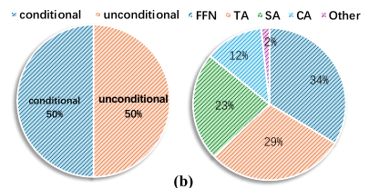

> 🔼 Figure 3 shows that vanilla cache-based methods lead to detail loss in generated videos, while classifier-free guidance (CFG) accounts for a significant portion of the inference time.
> 

> 
read the caption

> Figure 3: (a) Vanilla cache-based methods typically lead to detail loss. (b) Time overhead proportions of different components in video models.
> 


 <table id='7' style='font-size:14px'><tr><td rowspan="2">Method</td><td colspan="3">Efficiency</td><td colspan="4">Visual Quality</td></tr><tr><td>MACs (P) ↓</td><td>Speedup ↑</td><td>Latency (s) ↓</td><td>VBench ↑</td><td>LPIPS ↓</td><td>SSIM ↑</td><td>PSNR ↑</td></tr><tr><td colspan="8">Open-Sora 1.2 (192 frames, 480P)</td></tr><tr><td>Open-Sora 1.2 (T = 30)</td><td>6.30</td><td>1x</td><td>192.07</td><td>78.79%</td><td>-</td><td>-</td><td></td></tr><tr><td>△-DiT (Ne = 14,N = 2)</td><td>5.51</td><td>1.14x</td><td>168.69</td><td>77.43%</td><td>0.2834</td><td>0.7403</td><td>17.77</td></tr><tr><td>△-DiT (Ne = 28,N = 2)</td><td>4.72</td><td>1.34x</td><td>143.14</td><td>76.60%</td><td>0.3321</td><td>0.7092</td><td>16.24</td></tr><tr><td>PAB</td><td>5.33</td><td>1.23x</td><td>156.73</td><td>78.15%</td><td>0.1041</td><td>0.8821</td><td>26.43</td></tr><tr><td>Ours</td><td>4.13</td><td>1.62x</td><td>118.44</td><td>78.46%</td><td>0.0835</td><td>0.8932</td><td>27.03</td></tr><tr><td colspan="8">Open-Sora-Plan (65 frames, 512x512)</td></tr><tr><td>Open-Sora-Plan (T = 150)</td><td>10.30</td><td>1x</td><td>103.76</td><td>80.16%</td><td>-</td><td>-</td><td>-</td></tr><tr><td>△-DiT (Nc = 14,N = 3)</td><td>8.60</td><td>1.19x</td><td>86.88</td><td>78.12%</td><td>0.4515</td><td>0.4813</td><td>16.08</td></tr><tr><td>△-DiT (Ne = 28, N = 3)</td><td>6.90</td><td>1.46x</td><td>70.99</td><td>77.71%</td><td>0.4819</td><td>0.4467</td><td>15.42</td></tr><tr><td>PAB</td><td>7.39</td><td>1.32x</td><td>78.72</td><td>80.06%</td><td>0.2423</td><td>0.7126</td><td>20.29</td></tr><tr><td>Ours</td><td>5.51</td><td>1.68x</td><td>61.68</td><td>80.19%</td><td>0.1348</td><td>0.8138</td><td>23.72</td></tr><tr><td colspan="8">Latte (16 frames, 512x512)</td></tr><tr><td>Latte (T = 50)</td><td>3.05</td><td>1x</td><td>29.22</td><td>77.05%</td><td>-</td><td>-</td><td>-</td></tr><tr><td>△-DiT (Nc = 14,N = 2)</td><td>2.67</td><td>1.23x</td><td>23.80</td><td>76.27%</td><td>0.1731</td><td>0.8107</td><td>22.69</td></tr><tr><td>△-DiT (Ne = 28,N = 2)</td><td>2.29</td><td>1.43x</td><td>20.38</td><td>76.01%</td><td>0.2245</td><td>0.7620</td><td>21.00</td></tr><tr><td>PAB</td><td>2.24</td><td>1.28x</td><td>22.84</td><td>76.70%</td><td>0.2904</td><td>0.7083</td><td>18.98</td></tr><tr><td>Ours</td><td>1.97</td><td>1.54x</td><td>18.98</td><td>76.89%</td><td>0.0817</td><td>0.8948</td><td>28.21</td></tr><tr><td colspan="8">CogVideoX (48 frames, 480P)</td></tr><tr><td>CogVideoX (T = 50)</td><td>6.03</td><td>1x</td><td>78.48</td><td>80.18%</td><td>-</td><td>-</td><td>-</td></tr><tr><td>△-DiT (Nc = 4,N = 2)</td><td>5.62</td><td>1.08x</td><td>72.72</td><td>79.61%</td><td>0.3319</td><td>0.6612</td><td>17.93</td></tr><tr><td>△-DiT (Ne = 8,N = 2)</td><td>5.23</td><td>1.15x</td><td>68.19</td><td>79.31%</td><td>0.3822</td><td>0.6277</td><td>16.69</td></tr><tr><td>△-DiT (Ne = 12,N = 2)</td><td>4.82</td><td>1.26x</td><td>62.50</td><td>79.09%</td><td>0.4053</td><td>0.6126</td><td>16.15</td></tr><tr><td>Ours</td><td>3.71</td><td>1.62x</td><td>48.44</td><td>79.83%</td><td>0.0766</td><td>0.9066</td><td>28.93</td></tr><tr><td colspan="8">Vchitect-2.0 (40 frames, 480P)</td></tr><tr><td>Vchitect-2.0 (T = 100)</td><td>14.57</td><td>1x</td><td>260.32</td><td>80.80%</td><td>-</td><td>-</td><td>-</td></tr><tr><td>△-DiT (Nc = 6,N = 3)</td><td>13.00</td><td>1.11x</td><td>233.59</td><td>79.98%</td><td>0.4153</td><td>0.5837</td><td>14.26</td></tr><tr><td>△-DiT (Ne = 12,N = 3)</td><td>11.79</td><td>1.24x</td><td>209.78</td><td>79.50%</td><td>0.4534</td><td>0.5519</td><td>13.68</td></tr><tr><td>Ours</td><td>8.67</td><td>1.67x</td><td>156.13</td><td>80.84%</td><td>0.0282</td><td>0.9224</td><td>31.45</td></tr></table>

> 🔼 Table 1 quantitatively compares the efficiency and visual quality of the proposed FasterCache method against several baseline and state-of-the-art methods across five different video generation models.
> 

> 
read the caption

> Table 1: Comparison of efficiency and visual quality on a single GPU.
> 

### More visual insights

More on figures

> 🔼 The figure compares the visual quality and inference speed of FasterCache with other competing methods on three different video generation models.
> 

> 
read the caption

> Figure 1: Comparison of visual quality and inference speed with competing methods.
> 

> 🔼 The figure compares the visual quality and inference speed of the proposed FasterCache method with several competing methods on various video diffusion models.
> 

> 
read the caption

> Figure 1: Comparison of visual quality and inference speed with competing methods.
> 

> 🔼 The figure compares the visual quality and inference speed of different video generation methods, showing that the proposed method achieves higher quality and faster speed.
> 

> 
read the caption

> Figure 1: Comparison of visual quality and inference speed with competing methods.
> 

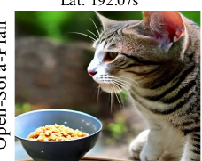

> 🔼 The figure compares the visual quality and inference speed of the proposed FasterCache method with existing methods on three different video generation models.
> 

> 
read the caption

> Figure 1: Comparison of visual quality and inference speed with competing methods.
> 

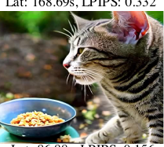

> 🔼 The figure compares the visual quality and inference speed of FasterCache with competing methods on three video diffusion models.
> 

> 
read the caption

> Figure 1: Comparison of visual quality and inference speed with competing methods.
> 

> 🔼 The figure compares the visual quality and inference speed of FasterCache with other methods on three different video generation models.
> 

> 
read the caption

> Figure 1: Comparison of visual quality and inference speed with competing methods.
> 

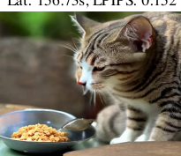

> 🔼 The figure compares the visual quality and inference speed of the proposed FasterCache method with other competing methods on three different video generation tasks.
> 

> 
read the caption

> Figure 1: Comparison of visual quality and inference speed with competing methods.
> 

> 🔼 The figure compares the visual quality and inference speed of several video generation methods, showing that the proposed method achieves both high quality and speed.
> 

> 
read the caption

> Figure 1: Comparison of visual quality and inference speed with competing methods.
> 

> 🔼 The figure shows a comparison of visual quality and inference speed between FasterCache and other methods on three different video generation models.
> 

> 
read the caption

> Figure 1: Comparison of visual quality and inference speed with competing methods.
> 

> 🔼 The figure compares the visual quality and inference speed of FasterCache against other methods on three video diffusion models.
> 

> 
read the caption

> Figure 1: Comparison of visual quality and inference speed with competing methods.
> 

> 🔼 The figure compares the visual quality and inference speed of different video generation methods, showing that the proposed method achieves better results in terms of both speed and quality.
> 

> 
read the caption

> Figure 1: Comparison of visual quality and inference speed with competing methods.
> 

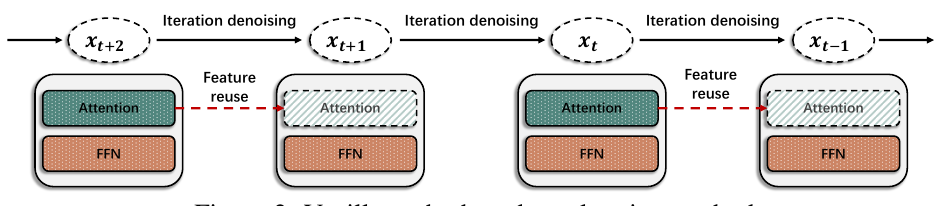

> 🔼 The figure illustrates a vanilla cache-based acceleration method for video diffusion models, showing how features are reused across adjacent timesteps.
> 

> 
read the caption

> Figure 2: Vanilla cache-based acceleration method.
> 

> 🔼 The figure shows a comparison of visual quality and inference speed between the proposed FasterCache method and other competing methods on three different video generation models.
> 

> 
read the caption

> Figure 1: Comparison of visual quality and inference speed with competing methods.
> 

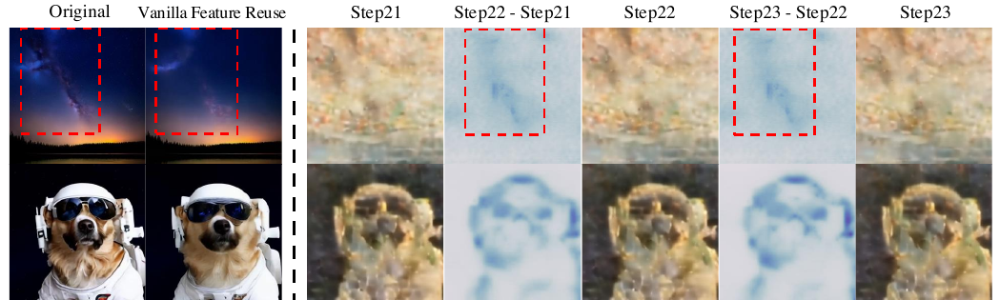

> 🔼 The figure compares the visual quality degradation caused by vanilla feature reuse with the feature differences between adjacent timesteps in a video diffusion model.
> 

> 
read the caption

> Figure 5: Visual quality degradation caused by Vanilla Feature Reuse (left) and feature differences between adjacent timesteps (right).
> 

> 🔼 Figure 7 shows that simply reusing conditional outputs leads to poor image generation, while CFG-Cache, by dynamically adjusting high and low-frequency components, improves quality.
> 

> 
read the caption

> Figure 7: (a) Simply reusing the conditional output from the same time step results in the poor generation of intricate details. (b) Trend curves of high and low-frequency biases between conditional and unconditional outputs change as sampling progresses.
> 

> 🔼 The figure illustrates the CFG-Cache mechanism, showing how conditional and unconditional outputs are reused across different timesteps to accelerate inference.
> 

> 
read the caption

> Figure 8: Overview of the CFG-Cache.
> 

> 🔼 The figure compares visual quality and inference speed of the proposed FasterCache method against existing methods on various video diffusion models.
> 

> 
read the caption

> Figure 1: Comparison of visual quality and inference speed with competing methods.
> 

> 🔼 The figure compares the visual quality and inference speed of FasterCache with other competing methods on three different video generation models.
> 

> 
read the caption

> Figure 1: Comparison of visual quality and inference speed with competing methods.
> 

> 🔼 The figure shows the impact of dynamic feature reuse and CFG-Cache on feature MSE and visual quality, demonstrating the effectiveness of the proposed method.
> 

> 
read the caption

> Figure 10: Comparison of Feature MSE curves and visual results from the ablation study.
> 

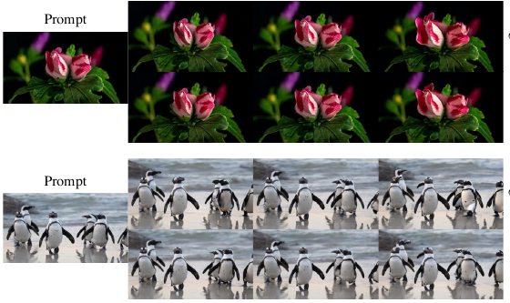

> 🔼 The figure compares the visual quality and inference speed of FasterCache against other methods on three different video diffusion models.
> 

> 
read the caption

> Figure 1: Comparison of visual quality and inference speed with competing methods.
> 

> 🔼 The figure compares the visual quality and inference speed of the proposed FasterCache method with other competing methods on three different video generation models.
> 

> 
read the caption

> Figure 1: Comparison of visual quality and inference speed with competing methods.
> 

> 🔼 The figure compares visual quality and inference speed of several video diffusion models using different methods, showing FasterCache achieves high quality with faster speed.
> 

> 
read the caption

> Figure 1: Comparison of visual quality and inference speed with competing methods.
> 

> 🔼 The figure compares the visual quality and inference speed of the proposed FasterCache method with other competing methods on three different video generation models.
> 

> 
read the caption

> Figure 1: Comparison of visual quality and inference speed with competing methods.
> 

> 🔼 The figure compares the visual quality and inference speed of FasterCache with other competing methods on three different video generation models.
> 

> 
read the caption

> Figure 1: Comparison of visual quality and inference speed with competing methods.
> 

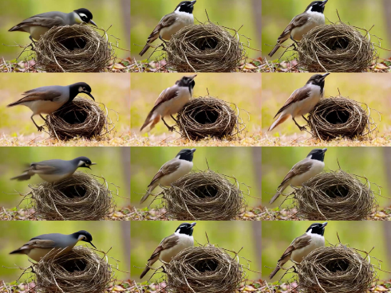

> 🔼 The figure shows a comparison of visual quality and inference speed between FasterCache and other competing methods on three different video generation models.
> 

> 
read the caption

> Figure 1: Comparison of visual quality and inference speed with competing methods.
> 

> 🔼 The figure compares the visual quality and inference speed of different video generation methods on three different video models.
> 

> 
read the caption

> Figure 1: Comparison of visual quality and inference speed with competing methods.
> 

> 🔼 The figure compares the visual quality and inference speed of FasterCache against other methods on three video generation tasks, showing that FasterCache achieves the best balance of speed and quality.
> 

> 
read the caption

> Figure 1: Comparison of visual quality and inference speed with competing methods.
> 

> 🔼 The figure compares the visual quality and inference speed of different video diffusion models, showing that FasterCache achieves higher quality and speed than other methods.
> 

> 
read the caption

> Figure 1: Comparison of visual quality and inference speed with competing methods.
> 

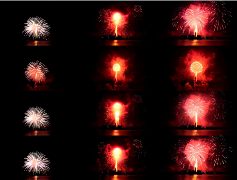

> 🔼 The figure compares the visual quality and inference speed of FasterCache against other methods on three different video generation models.
> 

> 
read the caption

> Figure 1: Comparison of visual quality and inference speed with competing methods.
> 

> 🔼 Figure 9 shows a comparison of visual results obtained using the proposed FasterCache method against those from the original model, PAB, and A-DiT across various video generation tasks.
> 

> 
read the caption

> Figure 9: Comparison of visual result quality among different methods.
> 

> 🔼 The figure compares the visual quality and inference speed of different video diffusion models, showing that the proposed method achieves high quality with significant speedup.
> 

> 
read the caption

> Figure 1: Comparison of visual quality and inference speed with competing methods.
> 

> 🔼 The figure compares the visual quality and inference speed of different video generation methods, showcasing the superior performance of the proposed FasterCache method.
> 

> 
read the caption

> Figure 1: Comparison of visual quality and inference speed with competing methods.
> 

> 🔼 The figure compares the visual quality and inference speed of FasterCache against other methods on three different video diffusion models.
> 

> 
read the caption

> Figure 1: Comparison of visual quality and inference speed with competing methods.
> 

> 🔼 The figure compares the visual quality and inference speed of different video generation methods, showing that the proposed method achieves higher quality and speed.
> 

> 
read the caption

> Figure 1: Comparison of visual quality and inference speed with competing methods.
> 

> 🔼 The figure compares the visual quality and inference speed of FasterCache against other methods on three video generation tasks.
> 

> 
read the caption

> Figure 1: Comparison of visual quality and inference speed with competing methods.
> 

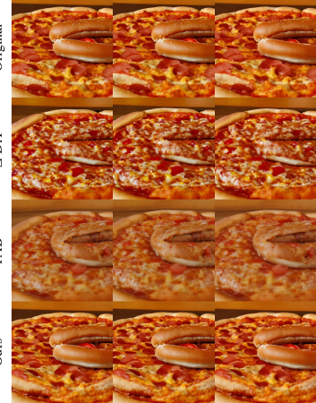

> 🔼 The figure compares the visual quality and inference speed of FasterCache with other competing methods on three different video generation models.
> 

> 
read the caption

> Figure 1: Comparison of visual quality and inference speed with competing methods.
> 

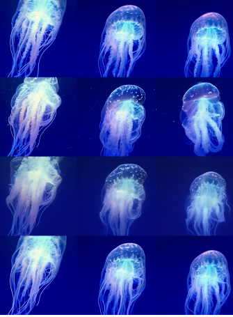

> 🔼 The figure compares the visual quality and inference speed of FasterCache with other methods on three video generation models.
> 

> 
read the caption

> Figure 1: Comparison of visual quality and inference speed with competing methods.
> 

> 🔼 The figure compares the visual quality and inference speed of the proposed FasterCache method with several existing methods on three different video generation models.
> 

> 
read the caption

> Figure 1: Comparison of visual quality and inference speed with competing methods.
> 

> 🔼 Figure 9 shows a visual comparison of videos generated by the FasterCache method against those generated by the original model, PAB, and A-DiT, highlighting that FasterCache effectively preserves the original quality and details.
> 

> 
read the caption

> Figure 9: Comparison of visual result quality among different methods.
> 

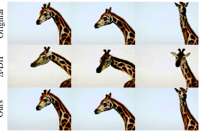

> 🔼 The figure compares visual quality and inference speed of different video generation methods, showing that the proposed method achieves faster speed with comparable or better quality.
> 

> 
read the caption

> Figure 1: Comparison of visual quality and inference speed with competing methods.
> 

> 🔼 The figure compares the visual quality and inference speed of different video generation methods, showing that the proposed FasterCache method achieves both high quality and speed.
> 

> 
read the caption

> Figure 1: Comparison of visual quality and inference speed with competing methods.
> 

> 🔼 The figure compares the visual quality and inference speed of different video generation methods, showing that the proposed FasterCache method achieves both high quality and fast inference speed compared to other methods.
> 

> 
read the caption

> Figure 1: Comparison of visual quality and inference speed with competing methods.
> 

> 🔼 The figure compares visual quality (using LPIPS) and inference speed (latency in seconds) of different video generation methods on three different video models (Open-Sora, Open-Sora-Plan, and Latte).
> 

> 
read the caption

> Figure 1: Comparison of visual quality and inference speed with competing methods.
> 

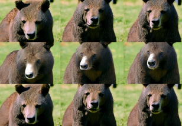

> 🔼 The figure compares the visual quality and inference speed of the proposed FasterCache method against other competing methods on three different video generation tasks.
> 

> 
read the caption

> Figure 1: Comparison of visual quality and inference speed with competing methods.
> 

> 🔼 The figure compares the visual quality and inference speed of different video diffusion models, highlighting the superior performance of the proposed FasterCache method.
> 

> 
read the caption

> Figure 1: Comparison of visual quality and inference speed with competing methods.
> 

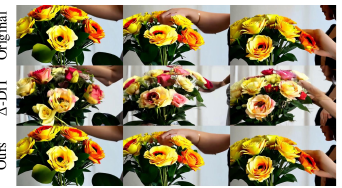

> 🔼 The figure compares the visual quality and inference speed of different video generation methods, showing that the proposed method achieves high quality at a faster speed.
> 

> 
read the caption

> Figure 1: Comparison of visual quality and inference speed with competing methods.
> 

> 🔼 The figure compares the visual quality and inference speed of several video generation methods, including the proposed FasterCache method, showing its superior performance in both aspects.
> 

> 
read the caption

> Figure 1: Comparison of visual quality and inference speed with competing methods.
> 

> 🔼 The figure compares the visual quality and inference speed of different video generation methods, showing that the proposed FasterCache method achieves both high quality and speed.
> 

> 
read the caption

> Figure 1: Comparison of visual quality and inference speed with competing methods.
> 

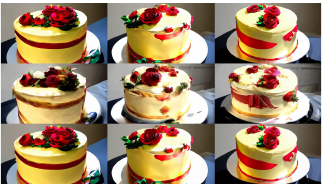

> 🔼 The figure compares the visual quality and inference speed of the proposed FasterCache method against several competing methods on three different video generation models.
> 

> 
read the caption

> Figure 1: Comparison of visual quality and inference speed with competing methods.
> 

> 🔼 The figure compares the visual quality and inference speed of different video generation methods, showing that the proposed method (Ours) achieves both high quality and speed.
> 

> 
read the caption

> Figure 1: Comparison of visual quality and inference speed with competing methods.
> 

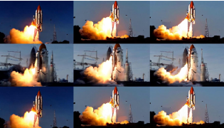

> 🔼 The figure compares the visual quality and inference speed of the proposed FasterCache method against other competing methods on three different video generation models.
> 

> 
read the caption

> Figure 1: Comparison of visual quality and inference speed with competing methods.
> 

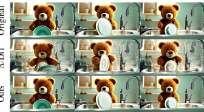

> 🔼 The figure compares the visual quality and inference speed of FasterCache against several competing methods on three different video generation models.
> 

> 
read the caption

> Figure 1: Comparison of visual quality and inference speed with competing methods.
> 

> 🔼 The figure compares the visual quality and inference speed of the proposed FasterCache method with other competing methods on three different video generation models.
> 

> 
read the caption

> Figure 1: Comparison of visual quality and inference speed with competing methods.
> 

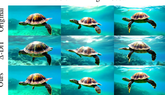

> 🔼 Figure 1 compares the visual quality and inference speed of FasterCache with other methods on three different video generation models.
> 

> 
read the caption

> Figure 1: Comparison of visual quality and inference speed with competing methods.
> 

> 🔼 The figure compares the visual quality and inference speed of FasterCache with other competing methods on three different video generation models.
> 

> 
read the caption

> Figure 1: Comparison of visual quality and inference speed with competing methods.
> 

> 🔼 The figure shows the visual quality degradation caused by vanilla feature reuse and the differences between adjacent timesteps.
> 

> 
read the caption

> Figure 5: Visual quality degradation caused by Vanilla Feature Reuse (left) and feature differences between adjacent timesteps (right).
> 

> 🔼 The figure compares the visual quality and inference speed of FasterCache with other competing methods on three different video generation models.
> 

> 
read the caption

> Figure 1: Comparison of visual quality and inference speed with competing methods.
> 

> 🔼 The figure compares the visual quality and inference speed of different video generation methods, showing that the proposed method achieves faster inference speed while maintaining high visual quality.
> 

> 
read the caption

> Figure 1: Comparison of visual quality and inference speed with competing methods.
> 

> 🔼 The figure shows a comparison of visual quality and inference speed of FasterCache with other competing methods on three different video generation models.
> 

> 
read the caption

> Figure 1: Comparison of visual quality and inference speed with competing methods.
> 

> 🔼 The figure shows a comparison of visual quality (using LPIPS score) and inference speed (latency in seconds) between the proposed FasterCache method and other competing methods on three different video diffusion models.
> 

> 
read the caption

> Figure 1: Comparison of visual quality and inference speed with competing methods.
> 

> 🔼 The figure compares the visual quality and inference speed of different video generation methods, showcasing the superior performance of the proposed FasterCache method.
> 

> 
read the caption

> Figure 1: Comparison of visual quality and inference speed with competing methods.
> 

> 🔼 The figure compares the visual quality and inference speed of several video generation methods, including the proposed FasterCache method, demonstrating its superior performance.
> 

> 
read the caption

> Figure 1: Comparison of visual quality and inference speed with competing methods.
> 

> 🔼 The figure compares the visual quality and inference speed of FasterCache with other methods on three different video generation models.
> 

> 
read the caption

> Figure 1: Comparison of visual quality and inference speed with competing methods.
> 

> 🔼 The figure compares the visual quality and inference speed of different video generation methods on three different video diffusion models.
> 

> 
read the caption

> Figure 1: Comparison of visual quality and inference speed with competing methods.
> 

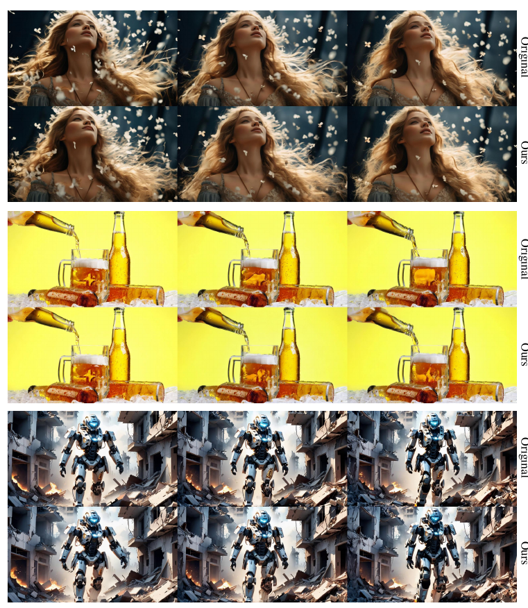

> 🔼 The figure shows a comparison of visual quality and inference speed between the proposed FasterCache method and other competing methods on three different video diffusion models.
> 

> 
read the caption

> Figure 1: Comparison of visual quality and inference speed with competing methods.
> 

More on charts

 of attention features between the current and previous diffusion steps. Smaller values indicate higher similarity.")

> 🔼 The chart displays the mean squared error (MSE) of different attention features (cross attention, temporal attention, spatial attention, and FFN) across the sampling process, showing the similarity between adjacent timesteps.
> 

> 
read the caption

> Figure 4: Comparison of the mean squared error (MSE) of attention features between the current and previous diffusion steps. Smaller values indicate higher similarity.
> 

 The MSE between conditional and unconditional outputs at the same timestep as well as across adjacent timesteps. (b) Directly reusing unconditional outputs from previous timesteps will lead to a significantly degraded visual quality.")

> 🔼 The chart displays the mean squared error (MSE) between conditional and unconditional outputs at the same and adjacent timesteps during the sampling process, illustrating the high similarity within the same timestep and the lower similarity between adjacent timesteps.
> 

> 
read the caption

> Figure 6: (a) The MSE between conditional and unconditional outputs at the same timestep as well as across adjacent timesteps. (b) Directly reusing unconditional outputs from previous timesteps will lead to a significantly degraded visual quality.
> 

> 🔼 The chart displays the inference speedups achieved by the FasterCache method across various video resolutions and lengths, showing its scalability and consistent performance improvements.
> 

> 
read the caption

> Figure 11: Acceleration efficiency of our method at different video resolutions and lengths.
> 

> 🔼 The chart displays visual results and inference times for image-to-video and image synthesis models using the proposed FasterCache method and compares them to the original methods.
> 

> 
read the caption

> Figure 12: Visual results and inference time of our method on I2V and image synthesis models.
> 

More on tables


<table id='17' style='font-size:14px'><tr><td colspan="5">Table 3: Impact on visual quality.</td><td colspan="5">Table 4: Scaling to multiple GPUs with DSP.</td></tr><tr><td>Variants</td><td>VBench</td><td>LPIPS</td><td>SSIM</td><td>PSNR</td><td>Method</td><td>1x A100</td><td>2x A100</td><td>4x A100</td><td>8x A100</td></tr><tr><td>Original Open-Sora</td><td>78.99%</td><td>-</td><td>-</td><td>-</td><td colspan="5">Open-Sora ( 192 frames, 480P)</td></tr><tr><td>Vanilla FR</td><td>78.34%</td><td>0.0657</td><td>28.20</td><td>0.8785</td><td>Open-Sora</td><td>192.07 (1x)</td><td>72.82 (2.64x)</td><td>39.09 (4.92x)</td><td>21.62(8.89x)</td></tr><tr><td>Full (w/ Dynamic FR)</td><td>78.69%</td><td>0.0590</td><td>28.41</td><td>0.8938</td><td>PAB</td><td>156.73(1.23x)</td><td>58.11(3.31x)</td><td>30.91 (6.21x)</td><td>17.21 (11.16x)</td></tr><tr><td>CFG-Cache w/o Enhancement</td><td>78.42%</td><td>0.0709</td><td>27.97</td><td>0.8727</td><td>Ours</td><td>118.44 (1.62x)</td><td>42.18(4.55x)</td><td>22.55 (8.52x)</td><td>12.57 (15.28x)</td></tr><tr><td>Enhance LF only</td><td>78.58%</td><td>0.0617</td><td>28.29</td><td>0.8894</td><td colspan="5">Open-Sora-Plan(221 frames, 512x512)</td></tr><tr><td></td><td></td><td></td><td></td><td></td><td>Open-Sora-Plan</td><td>316.71 (1x)</td><td>169.21 (1.87x)</td><td>89.10 (3.55x)</td><td>49.13(6.44x)</td></tr><tr><td>Enhance HF only</td><td>78.49%</td><td>0.0686</td><td>28.08</td><td>0.8834</td><td>PAB</td><td>243.33 (1.30x)</td><td>127.30 (2.49x)</td><td>71.17 (4.45x)</td><td>37.13(8.53x)</td></tr><tr><td>Full (w/ full CFG-Cache)</td><td>78.69%</td><td>0.0590</td><td>28.41</td><td>0.8938</td><td>Ours</td><td>187.91 (1.69x)</td><td>104.37 (3.03x)</td><td>57.70 (5.49x)</td><td>31.82(9.95x)</td></tr></table>
> 🔼 {{ table.description }}
> 

> 
read the caption

> {{ table.caption }}
> 

> Table 1 quantitatively compares the efficiency and visual quality of the proposed FasterCache method against several baselines across multiple video diffusion models, showcasing its performance improvements.


<table id='12' style='font-size:16px'><tr><td>Method comparison</td><td>Open-Sora 1.2</td><td>Open-Sora-Plan</td><td>Latte</td></tr><tr><td>Ours VS. △-DiT</td><td>80.67%</td><td>78.00%</td><td>77.33%</td></tr><tr><td>Ours VS. PAB</td><td>69.33%</td><td>72.67%</td><td>74.00%</td></tr></table>
> 🔼 {{ table.description }}
> 

> 
read the caption

> {{ table.caption }}
> 

> Table 1 quantitatively compares the efficiency and visual quality of the proposed FasterCache method against other state-of-the-art methods across different video diffusion models.

### Full paper



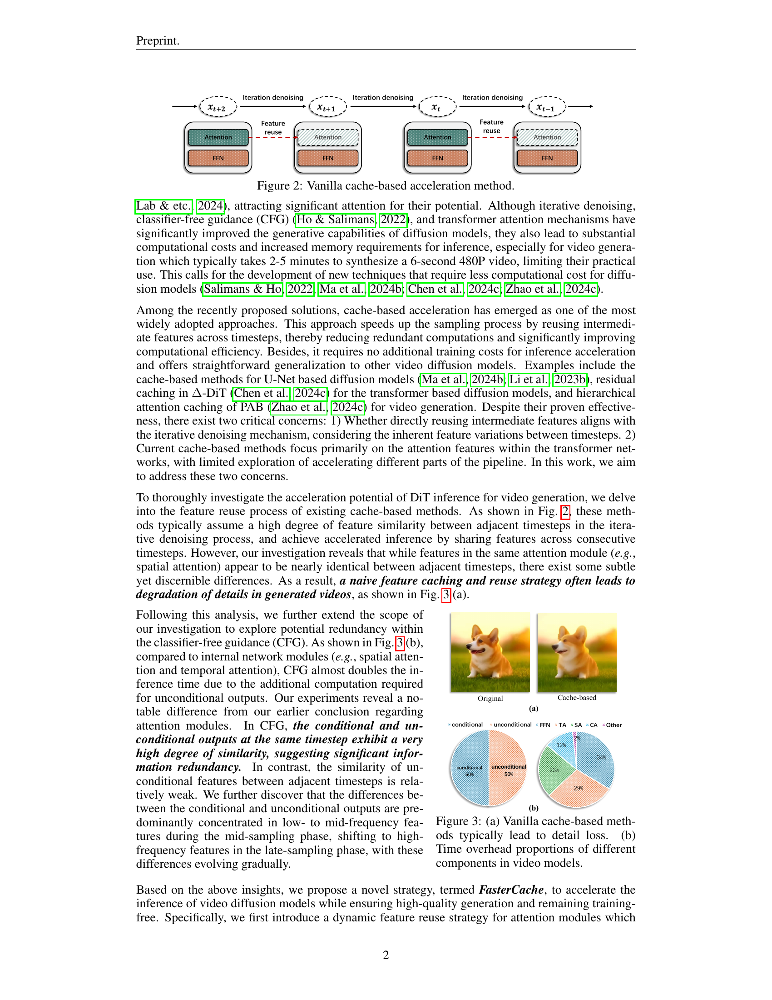

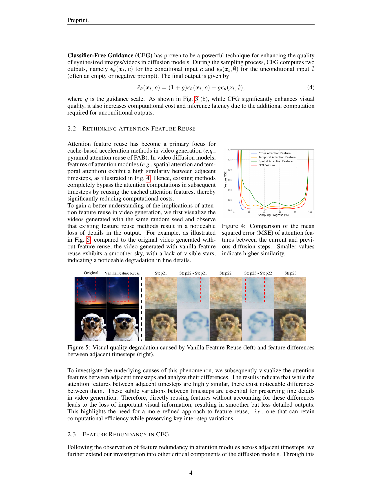
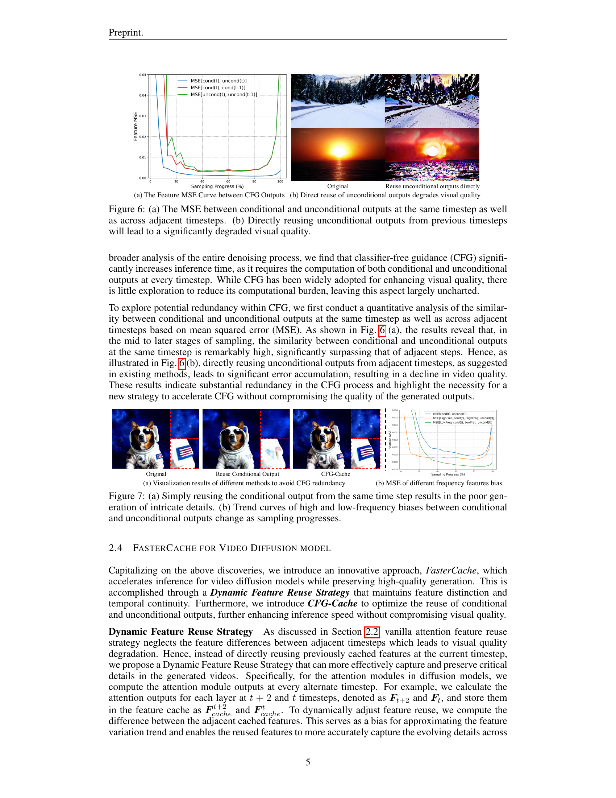
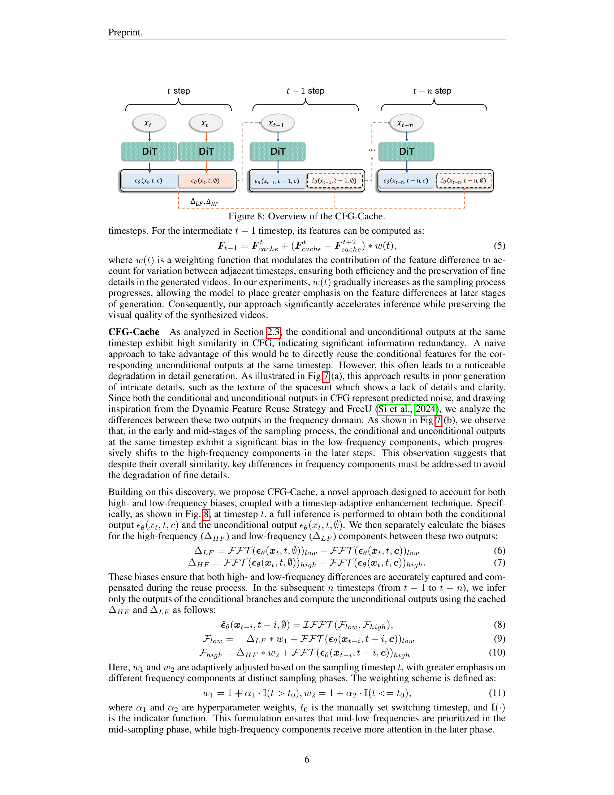

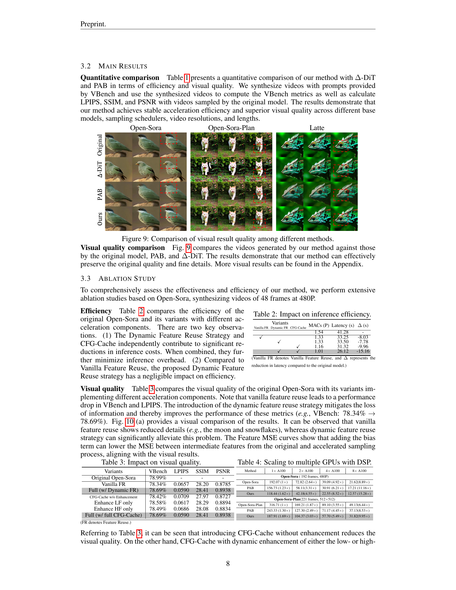

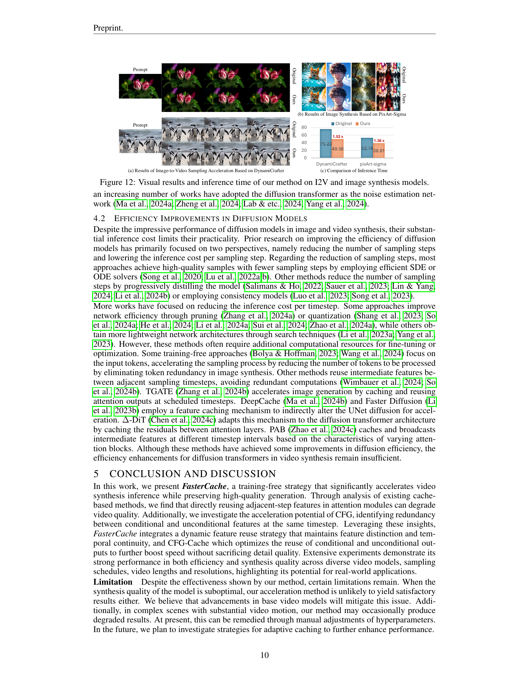

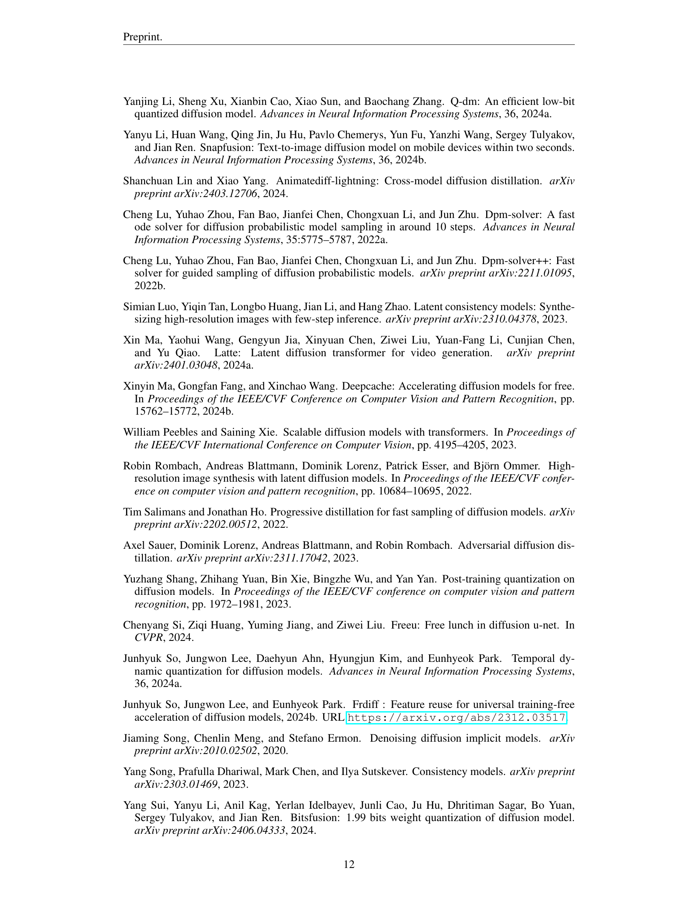
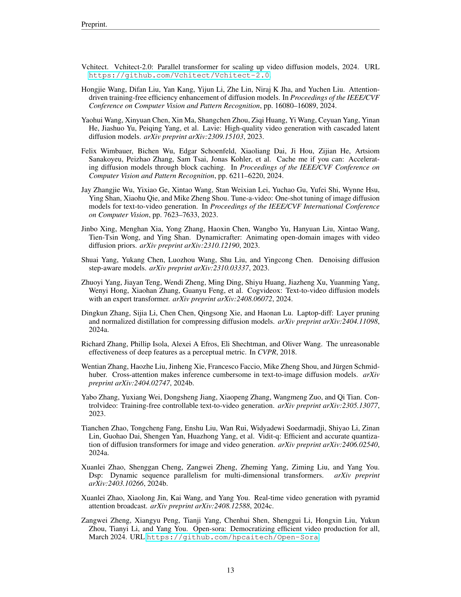

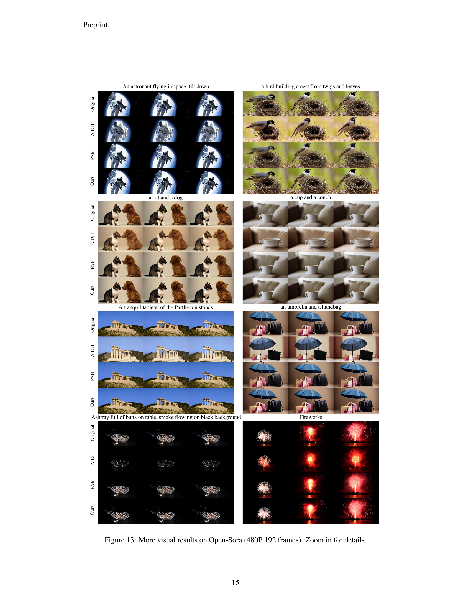
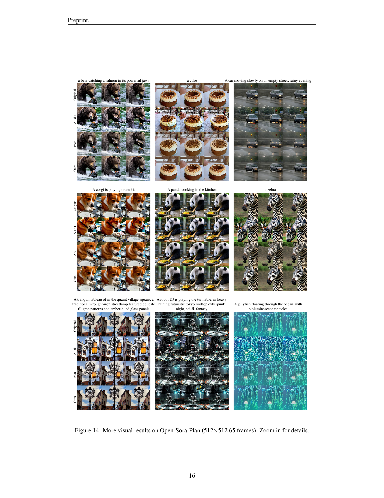

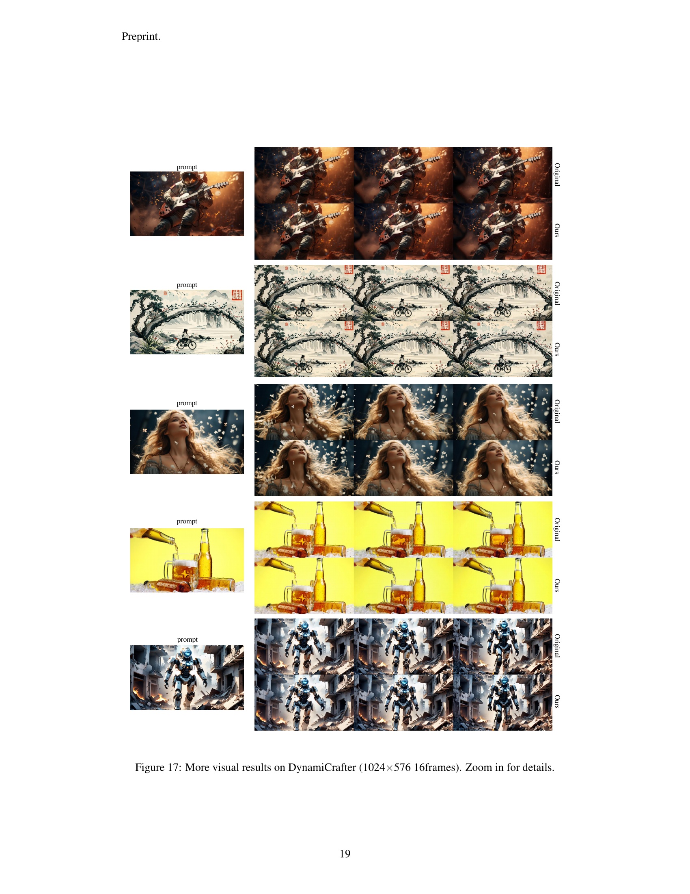
