### TL;DR



This research explores how the choice of tokenization significantly affects the ability of Large Language Models (LLMs) to perform counting tasks.  While LLMs, built on Transformers, have theoretical limitations in performing inductive reasoning tasks like counting, the use of Chain of Thought (CoT) prompting has shown improvement. However, this study reveals a previously overlooked factor: tokenization.  Using different methods for breaking down input text into tokens (e.g., byte-pair encoding), the researchers demonstrate that models' accuracy varies greatly, sometimes achieving near-perfect results with a well-chosen tokenization scheme, and sometimes dropping to near-chance levels of accuracy.  The analysis highlights that the implicit tokenization choices significantly undermine a model's ability, even if the model is theoretically capable of the task.  Experiments on several models, including GPT-4, showcase these variations. The key finding is that proper, item-separated tokenization (where each item to be counted becomes a separate token) is crucial for accurate counting, unlike the commonly used byte-pair encoding which groups characters together. Furthermore, experiments indicate that token frequency correlates with accuracy, where less frequent letters yield better performance than frequent ones in counting tasks. This work provides valuable insights for improving LLM design and application by highlighting the importance of tokenization strategies, especially in tasks involving inductive reasoning.




 &nbsp; read the paper on arXiv

  

 &nbsp; on Hugging Face


#### Why does it matter?
This paper is crucial for researchers working with large language models (LLMs) because it reveals the significant impact of tokenization on LLM reasoning abilities, particularly in tasks requiring complex computations like counting.  The findings challenge existing assumptions about LLM capabilities and highlight the need for careful consideration of tokenization strategies during both model development and application.  It opens new avenues for research on improving LLM reasoning and potentially broadens the applicability of LLMs to more complex tasks.
#### Key Takeaways


 Tokenization significantly impacts the counting ability of LLMs, even when using advanced reasoning techniques like Chain of Thought (CoT). 



 Specific tokenization methods, such as separating items into individual tokens, can dramatically improve LLM counting performance. 



 The frequency of letters in a token can affect counting accuracy, with less frequent letters showing greater accuracy. 


------
#### Visual Insights

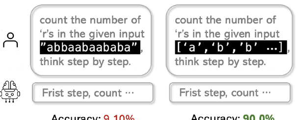

> 🔼 The figure shows that using character-level tokenization instead of BPE tokenization significantly improves the accuracy of GPT-40 mini in counting tasks.
> 

> 
read the caption

> Figure 1: Experimental results on average counting accuracy based on different tokenization choices, using GPT-40 mini. Our approach treats the model as a black-box, manipulating BPE tokenizers to function differently through carefully engineered string formats.
> 

> 🔼 The chart displays the distribution of errors (shifts from the correct count) in GPT's counting performance for different tokenization methods, revealing a bias towards undercounting with pure BPE tokenization.
> 

> 
read the caption

> Figure 4: Distribution of shift from correct count to GPT-calculated count, for each type of string-token fomrat (a), (b), (c) and (d) in order. The statsiticas show the results for letter a at length range [30, 40], as this range the error rate is high. We only calculate the shift when error is made, as correct counting instance does not have any shift.
> 


<table id='0' style='font-size:14px'><tr><td rowspan="3">String-Token Type</td><td colspan="6">Counting letter a</td><td colspan="6">Counting letter b</td></tr><tr><td colspan="2">len E [10-20]</td><td colspan="2">len E [20-30]</td><td colspan="2">len E [30-40]</td><td colspan="2">len E [10-20]</td><td colspan="2">len E [20-30]</td><td colspan="2">len E [30-40]</td></tr><tr><td>no-CoT</td><td>CoT</td><td>no-CoT</td><td>CoT</td><td>no-CoT</td><td>CoT</td><td>no-CoT</td><td>CoT</td><td>no-CoT</td><td>CoT</td><td>no-CoT</td><td>CoT</td></tr><tr><td>pure string BPE tokens (a)</td><td>30.10</td><td>45.70</td><td>15.10</td><td>9.10</td><td>6.40</td><td>2.00</td><td>33.20</td><td>47.70</td><td>14.00</td><td>9.40</td><td>3.80</td><td>2.70</td></tr><tr><td>" "-deliminated token (b)</td><td>46.20</td><td>58.40</td><td>16.10</td><td>24.90</td><td>7.50</td><td>10.90</td><td>45.90</td><td>63.70</td><td>17.60</td><td>34.00</td><td>5.60</td><td>18.60</td></tr><tr><td>" "-deliminated token (c)</td><td>56.00</td><td>55.40</td><td>19.40</td><td>38.60</td><td>10.20</td><td>28.10</td><td>63.60</td><td>69.30</td><td>32.80</td><td>56.10</td><td>13.90</td><td>42.30</td></tr><tr><td>, precise-item token (d)</td><td>50.70</td><td>96.80</td><td>15.80</td><td>81.60</td><td>7.90</td><td>56.10</td><td>58.30</td><td>96.50</td><td>30.20</td><td>90.00</td><td>12.60</td><td>70.80</td></tr></table>

> 🔼 Table 1 presents the results of counting experiments using GPT-40 mini, showing the average accuracy of counting 'a's and 'b's in strings with varying lengths and tokenization methods.
> 

> 
read the caption

> Table 1: Resulst of counting as and bs in string consisting of letter a and b, using GPT-40-mini API. Numbers indicate the average accuracy (%) over 1000 random generated instances.
> 

### More visual insights

More on figures

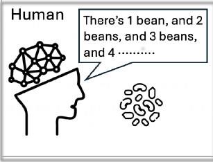

> 🔼 The figure illustrates the inductive counting process performed by humans, recurrent neural networks (RNNs), and large language models (LLMs) using chain-of-thought (CoT).
> 

> 
read the caption

> Figure 2: Illustration of inductive counting as performed by humans, RNNs, and LLMs with CoT, respectively.
> 

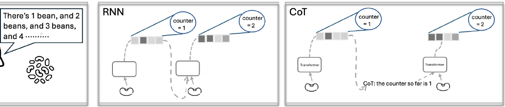

> 🔼 The figure illustrates the inductive counting process performed by humans, recurrent neural networks (RNNs), and large language models (LLMs) using Chain of Thought (CoT).
> 

> 
read the caption

> Figure 2: Illustration of inductive counting as performed by humans, RNNs, and LLMs with CoT, respectively.
> 

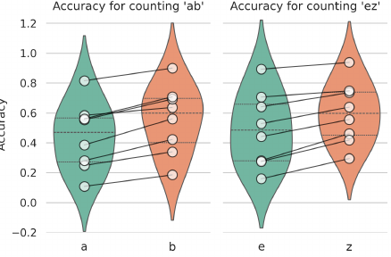

> 🔼 Figure 5 shows a pairwise comparison of counting accuracy for different letter pairs (a,b and e,z) across various string tokenization methods and CoT conditions.
> 

> 
read the caption

> Figure 5: Pairwise comparison of counting accuracy for different letters in strings. The left plot shows the distribution of accuracy for a and b in ab strings, with each dot representing the average accuracy for a in a given CoT case (e.g., spaced-string in the [10,20] range), connected to the corresponding accuracy for b in the same setting. The right plot illustrates a similar case for e and z in ez strings. Note: The y-axis limit exceeds [0,1] as the distribution is calculated based on variance and mean, with larger variance pushing the upper bound of the confidence interval beyond the maximum value.
> 

> 🔼 The figure shows four different ways of formatting strings for counting tasks, demonstrating how different tokenization methods impact the ability of large language models to count.
> 

> 
read the caption

> Figure 3: Four types of string formatting used for counting tasks to manipulate tokenization in LLMs. Examples in the figure are tokenized using the GPT-40 tokenizer. Each string-token type is labeled as (a), (b), (c), and (d) in the diagram. Note that changing the format does not alter the fundamental nature or difficulty of the counting task.
> 

More on tables


<table id='2' style='font-size:14px'><tr><td rowspan="3">String-Token Type</td><td colspan="6">Counting letter e</td><td colspan="6">Counting letter z</td></tr><tr><td colspan="2">len E [10-20]</td><td colspan="2">len E [20-30]</td><td colspan="2">len E [30-40]</td><td colspan="2">len E [10-20]</td><td colspan="2">len E [20-30]</td><td colspan="2">len E [30-40]</td></tr><tr><td>no-CoT</td><td>CoT</td><td>no-CoT</td><td>CoT</td><td>no-CoT</td><td>CoT</td><td>no-CoT</td><td>CoT</td><td>no-CoT</td><td>CoT</td><td>no-CoT</td><td>CoT</td></tr><tr><td>pure string BPE tokens (a)</td><td>26.60</td><td>55.20</td><td>19.80</td><td>12.20</td><td>11.40</td><td>2.10</td><td>31.10</td><td>59.10</td><td>11.70</td><td>22.10</td><td>4.60</td><td>7.30</td></tr><tr><td>" "-deliminated token (b)</td><td>41.00</td><td>52.90</td><td>23.90</td><td>28.20</td><td>13.00</td><td>16.00</td><td>45.30</td><td>63.90</td><td>16.60</td><td>46.20</td><td>6.80</td><td>29.50</td></tr><tr><td>" " -deliminated token (c) ,</td><td>45.50</td><td>64.20</td><td>27.40</td><td>44.20</td><td>18.00</td><td>27.60</td><td>56.20</td><td>73.60</td><td>28.20</td><td>55.60</td><td>13.90</td><td>41.90</td></tr><tr><td>precise-item token (d)</td><td>60.10</td><td>97.70</td><td>32.50</td><td>89.30</td><td>15.30</td><td>70.70</td><td>60.60</td><td>98.40</td><td>30.60</td><td>93.80</td><td>13.30</td><td>74.80</td></tr></table>
> 🔼 {{ table.description }}
> 

> 
read the caption

> {{ table.caption }}
> 

> Table 2 presents the results of counting the occurrences of the letters 'e' and 'z' in strings of varying lengths, using four different tokenization methods and with/without chain-of-thought prompting, based on GPT-40-mini model.


<table id='4' style='font-size:14px'><tr><td>string-token</td><td colspan="2">len E [10-20]</td><td colspan="2">len E [20-30]</td><td colspan="2">len E [30-40]</td></tr><tr><td>type</td><td>count a</td><td>count b</td><td>count a</td><td>count b</td><td>count a</td><td>count b</td></tr><tr><td>(a)</td><td>86.30</td><td>86.20</td><td>62.40</td><td>65.20</td><td>50.60</td><td>54.40</td></tr><tr><td>(b)</td><td>90.60</td><td>94.00</td><td>80.40</td><td>87.50</td><td>76.10</td><td>79.60</td></tr><tr><td>(c)</td><td>94.90</td><td>97.70</td><td>92.80</td><td>97.90</td><td>91.40</td><td>94.20</td></tr><tr><td>(d)</td><td>93.00</td><td>94.20</td><td>87.80</td><td>91.00</td><td>87.30</td><td>89.80</td></tr></table>
> 🔼 {{ table.description }}
> 

> 
read the caption

> {{ table.caption }}
> 

> Table 3 presents Claude-3.5-sonnet API counting results using supervised CoT for strings with varying lengths and different tokenization types.


 <table id='5' style='font-size:14px'><tr><td rowspan="2">String-Token Type</td><td colspan="4">len E [80, 100]</td></tr><tr><td>Z</td><td>b</td><td>r</td><td>e</td></tr><tr><td>(b)</td><td>14.50</td><td>13.60</td><td>8.90</td><td>8.40</td></tr><tr><td>(c)</td><td>36.00</td><td>36.60</td><td>28.30</td><td>24.30</td></tr><tr><td>(d)</td><td>61.60</td><td>60.20</td><td>54.10</td><td>51.90</td></tr><tr><td colspan="5">Letter Frequency</td></tr><tr><td>percentage</td><td>0.07</td><td>1.48</td><td>6.02</td><td>12.70</td></tr></table>
> 🔼 {{ table.description }}
> 

> 
read the caption

> {{ table.caption }}
> 

> The table presents the counting accuracy of four letters (z, b, r, e) with varying frequencies in human language using different tokenization methods.


<table id='0' style='font-size:14px'><tr><td rowspan="2">String-token Type</td><td colspan="2">Counting a</td><td colspan="2">Counting b</td></tr><tr><td>Unsupervised-CoT</td><td>Supervised CoT</td><td>Unsupervised-CoT</td><td>Supervised CoT</td></tr><tr><td>(b)</td><td>8.40</td><td>10.90</td><td>20.70</td><td>18.60</td></tr><tr><td>(c)</td><td>24.00</td><td>28.10</td><td>29.30</td><td>42.30</td></tr><tr><td>(d)</td><td>34.90</td><td>56.10</td><td>42.70</td><td>70.80</td></tr></table>
> 🔼 {{ table.description }}
> 

> 
read the caption

> {{ table.caption }}
> 

> Table 5 presents counting experiment results in the length range of 30-40, comparing the performance of supervised and unsupervised chain-of-thought prompting methods.


<table id='17' style='font-size:16px'><tr><td>Prompt:</td></tr><tr><td>Determine the number of appearances of {substring} 's in the string below. Think step by step. Directly output 'Result: , followed by the counted number. Do not use bold font in the response. String: b b a a b b b a b b b b b a a a b b b b</td></tr><tr><td>Response:</td></tr><tr><td>Result (Experiment 2):</td></tr><tr><td>To determine the number of appearances of , a's in the given string, we will analyze the string step by step. 1. Let's first isolate the string and count the occurrences of the letter a' · The given string is: "b b a a b b b a b b b b b a a a b b b b" 2. We can count the 'a's by looking through the string or splitting it into individual elements to count: 、 The string has the following elements: b, b, a, a, b, b, b, a, b, b, b, b, b, a, a, a, b, b, b, b. 3. Now we count each , a' : - First occurrence: a (1) - Second occurrence: a (2) - Third occurrence: a (3) - Fourth occurrence: a (4) - Fifth occurrence: a (5) 4. Total occurrences of , a' : 5 Result: 5</td></tr><tr><td>Correct Answer: 6</td></tr></table>
> 🔼 {{ table.description }}
> 

> 
read the caption

> {{ table.caption }}
> 

> Table 1 presents the average accuracy of counting the letters 'a' and 'b' across different string lengths and tokenization methods using the GPT-40-mini API, with and without Chain-of-Thought (CoT).


<table id='19' style='font-size:18px'><tr><td>Prompt:</td></tr><tr><td>Task: Count the number of occurrences of the substring 'a' in the given string step by step. Do not use bold font in the response. Instructions: Iterate through the string and count each occurrence of the substring. Use a counter to keep track of how many times the substring appears. Output your step-by-step counting process. Conclude with: 'Result: , followed by the number. String: bbaabbbabbbbbaaabbbb Response:</td></tr><tr><td>Result (Experiment 1): Let's go through the string "bbaabbbabbbbbaaabbbb" step by step to count the occurrences of the substring a , 1. Initialize a · counter to 0. 2. Start reading the string from the first character. - Character 1: 'b' (no a , counter remains 0) - Character 2: 'b' (no 'a , counter remains 0) - Character 3: 'a' (found 'a' , increment counter to 1) - Character 4: 'a' (found a' , increment , , a  counter remains 2) - Character 7: 'b' (no , a , counter to 2) - Character 5: 'b' (no a , counter remains 2) - Character 6: 'b' (no , counter remains 2) - Character 8: 'a' (found 'a' , increment counter to 3) - Character 9: 'b' (no 'a' , counter remains 3) - Character 10: 'b' (no 'a' · counter remains 3) - Character 11: 'b' (no 'a  counter remains 3) - Character 12: 'b' (no 'a' , counter remains 3) - Character 13: 'a' (found 'a' · increment counter to 4) - Character 14: 'a' (found 'a' · increment counter to 5) - Character 15: 'b' (no a , counter remains 5) - Character 16: 'b' (no a , counter remains 5) - Character 17: 'b' (no  a , counter remains 5) - Character 18: 'b' (no 'a' counter remains 5) 3. End of the string reached. Result: 5</td></tr><tr><td>Correct Answer: 6</td></tr></table>
> 🔼 {{ table.description }}
> 

> 
read the caption

> {{ table.caption }}
> 

> Table 1 presents the average accuracy of counting the letters 'a' and 'b' in strings of varying lengths (10-20, 20-30, and 30-40 characters) and tokenization types using GPT-40-mini, with and without Chain of Thought prompting.

### Full paper


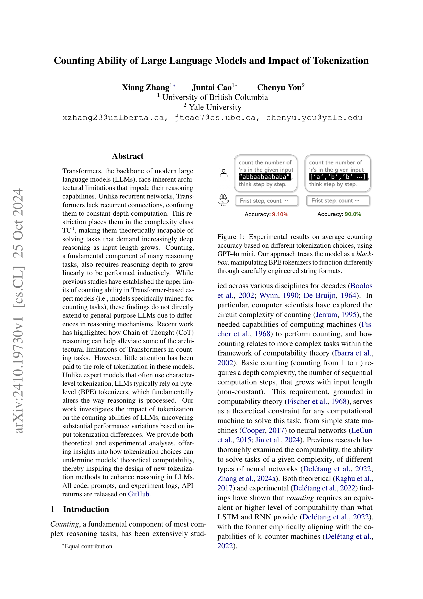

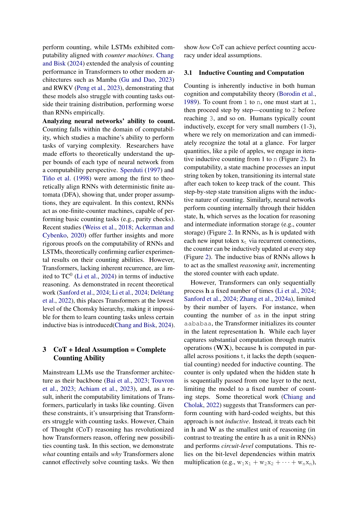

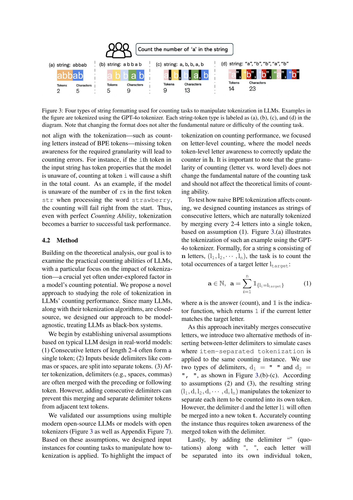
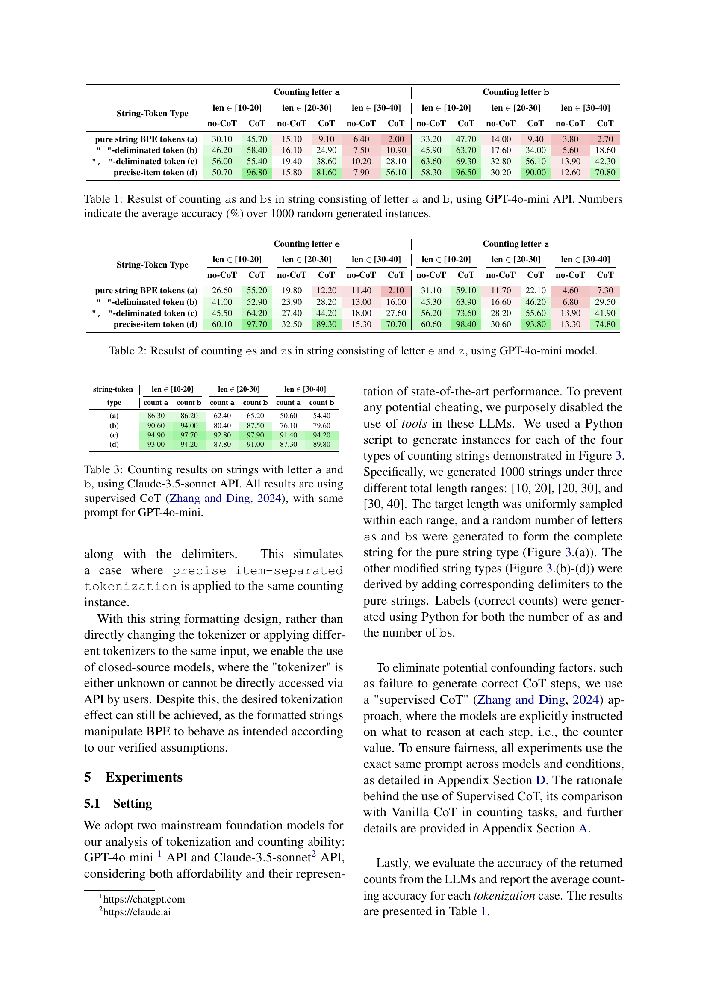

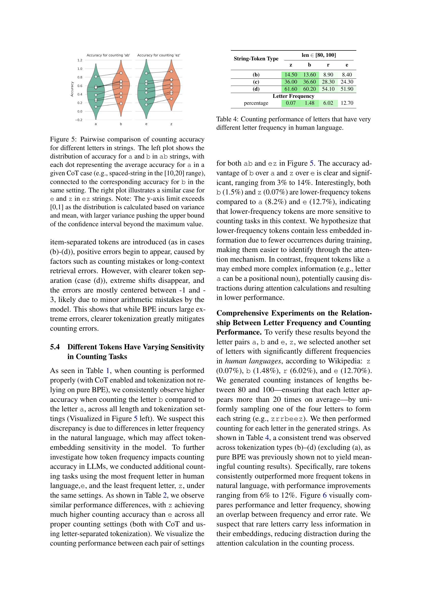
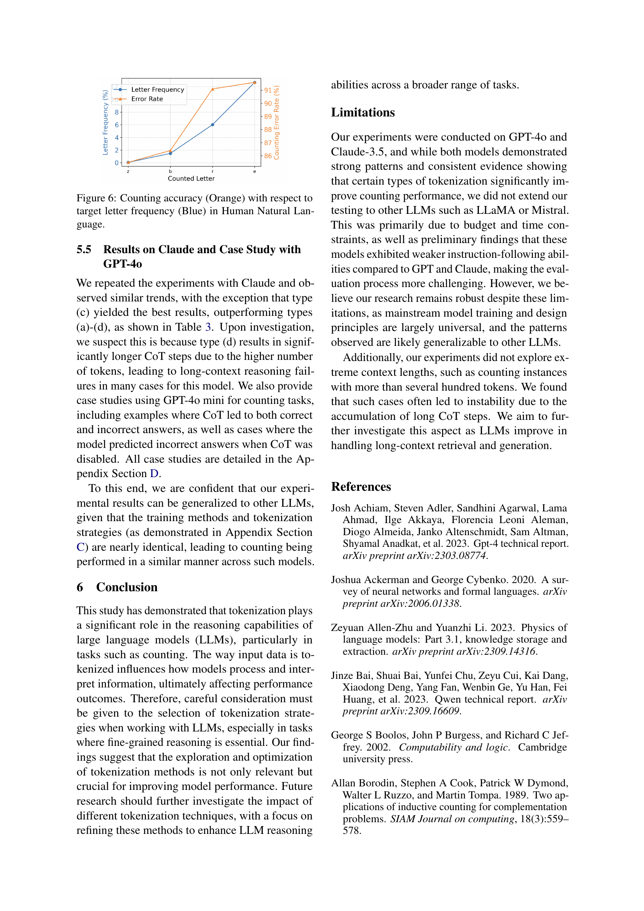

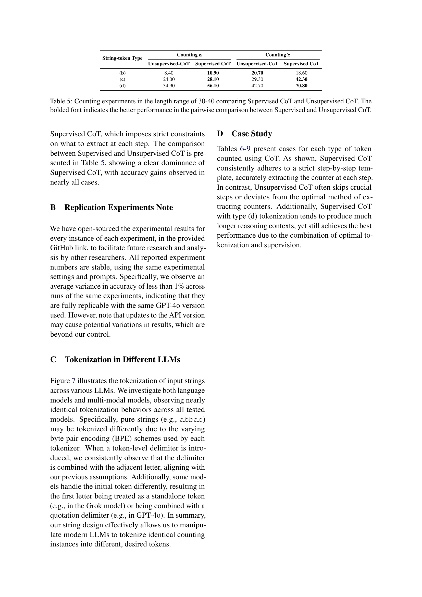

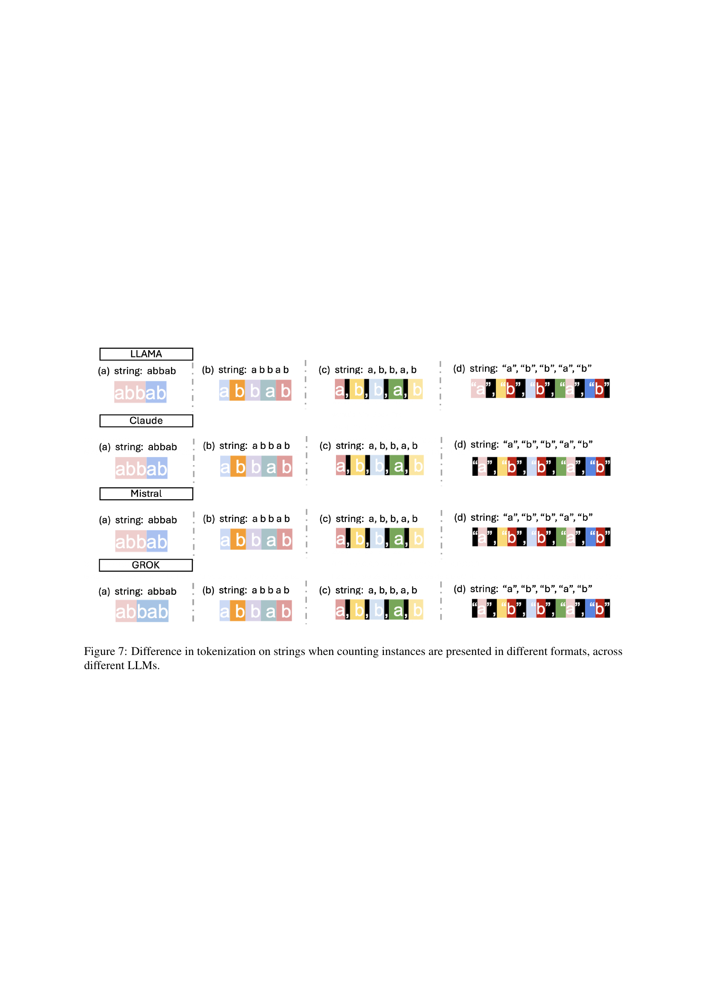
